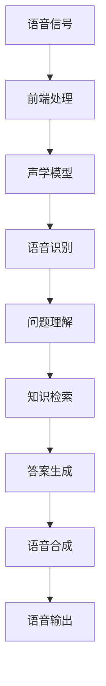

                 

 关键词：大模型、问答机器人、语音交互、人工智能、自然语言处理、语音识别、语音合成

> 摘要：本文旨在探讨大模型在问答机器人语音交互中的应用，分析其核心概念、算法原理、数学模型及项目实践。通过详细讲解，帮助读者了解大模型问答机器人语音交互的实现方法、优缺点及未来发展趋势。

## 1. 背景介绍

近年来，人工智能技术取得了飞速发展，其中自然语言处理（NLP）领域尤为显著。语音交互作为人机交互的重要方式，已逐渐成为智能设备的标准配置。大模型，作为一种能够处理大规模数据的强大工具，在语音交互中发挥了关键作用。本文将围绕大模型问答机器人的语音交互展开讨论，旨在梳理相关技术，探讨其应用前景。

### 1.1 大模型的发展

大模型（Large Models）是指具有海量参数、能够处理大规模数据的人工神经网络。这些模型能够通过深度学习算法，自动提取数据中的特征，并在各种任务中表现出色。自2018年GPT-1问世以来，大模型的研究和应用得到了广泛关注。GPT-2、GPT-3、BERT、T5等模型的出现，进一步推动了大模型的发展。

### 1.2 语音交互的兴起

语音交互是一种通过语音信号进行人机交互的方式。与传统的键盘和鼠标交互相比，语音交互具有高效、便捷、自然等优点。随着智能设备的普及，语音交互技术逐渐成为了人们日常生活的一部分。例如，苹果的Siri、亚马逊的Alexa、谷歌的Google Assistant等智能语音助手，已经成为许多用户的首选交互方式。

### 1.3 大模型在语音交互中的应用

大模型在语音交互中具有广泛的应用前景。首先，大模型能够处理大规模语音数据，提高语音识别的准确性。其次，大模型可以用于语音生成，实现自然流畅的语音输出。此外，大模型还可以用于问答系统，实现智能问答功能。本文将重点探讨大模型在问答机器人语音交互中的应用。

## 2. 核心概念与联系

在探讨大模型问答机器人语音交互之前，我们需要先了解一些核心概念和它们之间的联系。以下是本文涉及的核心概念及流程：

### 2.1 语音识别

语音识别（Speech Recognition）是指将语音信号转换为文字或命令的技术。语音识别系统的核心是自动语音识别（Automatic Speech Recognition, ASR）。ASR技术通常包括前端处理、声学模型和语言模型等组成部分。

### 2.2 语音合成

语音合成（Text-to-Speech, TTS）是指将文本转换为自然流畅的语音输出的技术。语音合成系统的核心是文本处理、声学模型和语音合成算法等组成部分。

### 2.3 问答系统

问答系统（Question Answering, QA）是指能够回答用户提问的智能系统。问答系统通常包括问题理解、知识检索和答案生成等组成部分。

### 2.4 大模型在语音交互中的应用

大模型在语音交互中的应用主要体现在语音识别、语音合成和问答系统等方面。通过以下Mermaid流程图，我们可以直观地了解大模型在语音交互中的工作流程：



## 3. 核心算法原理 & 具体操作步骤

### 3.1 算法原理概述

大模型问答机器人语音交互的核心算法主要包括语音识别、问题理解、知识检索和答案生成。以下是各算法的原理概述：

### 3.2 算法步骤详解

#### 3.2.1 语音识别

语音识别算法的核心是自动语音识别（ASR）。ASR算法通常包括前端处理、声学模型和语言模型等组成部分。以下是语音识别的具体步骤：

1. 前端处理：对语音信号进行预处理，包括去噪、增强、分帧和特征提取等。
2. 声学模型：通过深度学习算法，学习语音信号中的声学特征。
3. 语言模型：通过统计方法或深度学习算法，学习语音信号中的语言规律。
4. 识别结果：将声学模型和语言模型的结果进行融合，得到最终的识别结果。

#### 3.2.2 问题理解

问题理解（Question Understanding, QU）是指将用户的问题转换为计算机可以理解的形式。问题理解算法的核心是自然语言处理（NLP）。以下是问题理解的具体步骤：

1. 分词：将用户的问题分割成单词或短语。
2. 词性标注：对分词结果进行词性标注，识别单词或短语的词性。
3. 依存句法分析：分析句子中的词语关系，构建句子的语法树。
4. 语义角色标注：识别句子中的主体、动作和客体等语义角色。
5. 问题意图识别：根据语义角色标注和依存句法分析，识别用户的问题意图。

#### 3.2.3 知识检索

知识检索（Knowledge Retrieval, KR）是指从大规模知识库中检索与用户问题相关的信息。知识检索算法的核心是信息检索（Information Retrieval, IR）。以下是知识检索的具体步骤：

1. 检索策略设计：根据用户的问题意图，设计合适的检索策略。
2. 检索模型构建：构建基于深度学习或统计方法的检索模型。
3. 检索结果排序：对检索结果进行排序，筛选出与用户问题最相关的信息。

#### 3.2.4 答案生成

答案生成（Answer Generation, AG）是指根据知识库中的信息，生成符合用户问题的答案。答案生成算法的核心是自然语言生成（Natural Language Generation, NLG）。以下是答案生成的具体步骤：

1. 答案提取：从知识库中提取与用户问题相关的信息。
2. 答案转换：将提取的信息转换为自然语言形式。
3. 答案优化：对生成的答案进行优化，提高答案的流畅性和可读性。

### 3.3 算法优缺点

#### 3.3.1 语音识别

优点：

- 准确率高：大模型在语音识别任务中取得了显著的成果，识别准确率较高。
- 支持多种语言：大模型可以处理多种语言，适应不同国家和地区的用户需求。

缺点：

- 对噪音敏感：语音识别算法在处理噪音干扰时，准确率会下降。
- 对语音速度和口音敏感：语音识别算法对语音速度和口音变化较为敏感，可能导致识别错误。

#### 3.3.2 问题理解

优点：

- 理解能力强：大模型在问题理解任务中表现出强大的语义理解能力，能够处理复杂问题。
- 支持多模态：问题理解算法可以结合语音、文本、图像等多种模态，提高理解准确率。

缺点：

- 需要大量训练数据：问题理解算法需要大量训练数据来构建有效的模型，训练过程较为耗时。
- 对长文本理解困难：大模型在处理长文本时，理解能力可能下降，导致理解错误。

#### 3.3.3 知识检索

优点：

- 检索速度快：基于深度学习或统计方法的检索模型，具有较快的检索速度。
- 准确度高：通过设计合适的检索策略和模型，知识检索算法可以达到较高的准确率。

缺点：

- 对检索策略依赖性较强：检索策略的设计对检索结果有较大影响，不同策略可能导致检索效果差异。
- 需要大量知识库资源：知识检索算法需要大量知识库资源来支持检索任务，知识库的维护和更新较为繁琐。

#### 3.3.4 答案生成

优点：

- 生成答案流畅：大模型在自然语言生成任务中，生成的答案流畅、自然，符合语言习惯。
- 支持多语言：大模型可以处理多种语言，支持多语言答案生成。

缺点：

- 生成的答案可能存在逻辑错误：大模型在自然语言生成任务中，可能存在逻辑错误或常识错误。
- 对语言风格适应性较弱：大模型在生成答案时，可能无法完全适应不同的语言风格。

### 3.4 算法应用领域

大模型问答机器人语音交互算法在多个领域具有广泛的应用前景：

- 智能客服：大模型问答机器人语音交互算法可以应用于智能客服系统，实现高效、准确的客户服务。
- 智能家居：大模型问答机器人语音交互算法可以应用于智能家居系统，实现语音控制家居设备。
- 教育：大模型问答机器人语音交互算法可以应用于教育领域，实现智能教育辅导。
- 医疗：大模型问答机器人语音交互算法可以应用于医疗领域，实现智能医疗诊断和咨询。

## 4. 数学模型和公式 & 详细讲解 & 举例说明

### 4.1 数学模型构建

大模型问答机器人语音交互中的数学模型主要包括语音识别、问题理解、知识检索和答案生成等部分。以下是各部分的数学模型构建：

#### 4.1.1 语音识别

语音识别的数学模型通常基于深度学习，主要包括声学模型和语言模型。

- 声学模型：声学模型用于学习语音信号中的声学特征。常见的声学模型包括循环神经网络（RNN）、卷积神经网络（CNN）和变换器（Transformer）等。
- 语言模型：语言模型用于学习语音信号中的语言规律。常见的语言模型包括N元语法模型、循环神经网络（RNN）和变换器（Transformer）等。

#### 4.1.2 问题理解

问题理解的数学模型主要基于自然语言处理（NLP）技术，包括分词、词性标注、依存句法分析和语义角色标注等。

- 分词：分词模型通常基于统计方法或深度学习，用于将用户的问题分割成单词或短语。
- 词性标注：词性标注模型用于对分词结果进行词性标注，识别单词或短语的词性。
- 依存句法分析：依存句法分析模型用于分析句子中的词语关系，构建句子的语法树。
- 语义角色标注：语义角色标注模型用于识别句子中的主体、动作和客体等语义角色。

#### 4.1.3 知识检索

知识检索的数学模型主要基于信息检索（IR）技术，包括检索策略设计、检索模型构建和检索结果排序等。

- 检索策略设计：检索策略设计模型用于根据用户的问题意图，设计合适的检索策略。
- 检索模型构建：检索模型构建模型用于构建基于深度学习或统计方法的检索模型。
- 检索结果排序：检索结果排序模型用于对检索结果进行排序，筛选出与用户问题最相关的信息。

#### 4.1.4 答案生成

答案生成的数学模型主要基于自然语言生成（NLG）技术，包括答案提取、答案转换和答案优化等。

- 答案提取：答案提取模型用于从知识库中提取与用户问题相关的信息。
- 答案转换：答案转换模型用于将提取的信息转换为自然语言形式。
- 答案优化：答案优化模型用于对生成的答案进行优化，提高答案的流畅性和可读性。

### 4.2 公式推导过程

以下是大模型问答机器人语音交互中各部分的公式推导过程：

#### 4.2.1 语音识别

- 声学模型：

  声学模型的目标函数通常为：

  $$ L(A|X) = -\sum_{i=1}^{N} log(p(A_i|X_i)) $$

  其中，$A$ 表示预测的声学特征序列，$X$ 表示实际的声学特征序列，$N$ 表示序列长度。

- 语言模型：

  语言模型的目标函数通常为：

  $$ L(W|X) = -\sum_{i=1}^{N} log(p(W_i|X_i)) $$

  其中，$W$ 表示预测的文本特征序列，$X$ 表示实际的文本特征序列，$N$ 表示序列长度。

#### 4.2.2 问题理解

- 分词：

  分词模型通常使用基于条件随机场（CRF）的模型，其损失函数为：

  $$ L(C|X) = -\sum_{i=1}^{N} log(p(C_i|X_i)) $$

  其中，$C$ 表示预测的分词结果，$X$ 表示实际的分词结果，$N$ 表示序列长度。

- 词性标注：

  词性标注模型通常使用基于深度学习的模型，其损失函数为：

  $$ L(P|X) = -\sum_{i=1}^{N} log(p(P_i|X_i)) $$

  其中，$P$ 表示预测的词性标注结果，$X$ 表示实际的词性标注结果，$N$ 表示序列长度。

- 依存句法分析：

  依存句法分析模型通常使用基于变换器的模型，其损失函数为：

  $$ L(R|X) = -\sum_{i=1}^{N} log(p(R_i|X_i)) $$

  其中，$R$ 表示预测的依存关系结果，$X$ 表示实际的依存关系结果，$N$ 表示序列长度。

- 语义角色标注：

  语义角色标注模型通常使用基于深度学习的模型，其损失函数为：

  $$ L(S|X) = -\sum_{i=1}^{N} log(p(S_i|X_i)) $$

  其中，$S$ 表示预测的语义角色标注结果，$X$ 表示实际的语义角色标注结果，$N$ 表示序列长度。

#### 4.2.3 知识检索

- 检索策略设计：

  检索策略设计通常使用基于深度学习的模型，其损失函数为：

  $$ L(S|X) = -\sum_{i=1}^{N} log(p(S_i|X_i)) $$

  其中，$S$ 表示预测的检索策略结果，$X$ 表示实际的检索策略结果，$N$ 表示序列长度。

- 检索模型构建：

  检索模型构建通常使用基于深度学习的模型，其损失函数为：

  $$ L(R|X) = -\sum_{i=1}^{N} log(p(R_i|X_i)) $$

  其中，$R$ 表示预测的检索结果，$X$ 表示实际的检索结果，$N$ 表示序列长度。

- 检索结果排序：

  检索结果排序通常使用基于深度学习的模型，其损失函数为：

  $$ L(O|X) = -\sum_{i=1}^{N} log(p(O_i|X_i)) $$

  其中，$O$ 表示预测的排序结果，$X$ 表示实际的排序结果，$N$ 表示序列长度。

#### 4.2.4 答案生成

- 答案提取：

  答案提取通常使用基于深度学习的模型，其损失函数为：

  $$ L(A|X) = -\sum_{i=1}^{N} log(p(A_i|X_i)) $$

  其中，$A$ 表示预测的答案提取结果，$X$ 表示实际的答案提取结果，$N$ 表示序列长度。

- 答案转换：

  答案转换通常使用基于深度学习的模型，其损失函数为：

  $$ L(T|X) = -\sum_{i=1}^{N} log(p(T_i|X_i)) $$

  其中，$T$ 表示预测的答案转换结果，$X$ 表示实际的答案转换结果，$N$ 表示序列长度。

- 答案优化：

  答案优化通常使用基于深度学习的模型，其损失函数为：

  $$ L(O|X) = -\sum_{i=1}^{N} log(p(O_i|X_i)) $$

  其中，$O$ 表示预测的答案优化结果，$X$ 表示实际的答案优化结果，$N$ 表示序列长度。

### 4.3 案例分析与讲解

以下是一个关于大模型问答机器人语音交互的案例分析与讲解：

#### 案例背景

一个用户使用智能语音助手咨询：“今天北京天气如何？”

#### 案例分析

1. 语音识别：语音助手首先对用户的问题进行语音识别，将语音信号转换为文本。语音识别算法的准确率较高，能够正确识别用户的问题。

2. 问题理解：语音助手对识别出的文本进行分析，识别出用户的问题意图是查询北京天气。问题理解算法能够准确地理解用户的问题。

3. 知识检索：语音助手从预构建的知识库中检索与北京天气相关的信息。知识检索算法能够快速地检索到与用户问题相关的信息。

4. 答案生成：语音助手根据检索到的信息，生成符合用户问题的答案。答案生成算法能够生成流畅、自然的答案。

5. 语音合成：语音助手将生成的答案转换为语音输出，用户听到符合预期答案的语音。

#### 案例讲解

1. 语音识别：语音助手使用基于深度学习的声学模型和语言模型进行语音识别，准确地将用户的问题转换为文本。

2. 问题理解：语音助手使用基于深度学习的自然语言处理技术，对文本进行分析，识别出用户的问题意图是查询天气。

3. 知识检索：语音助手使用基于深度学习的检索模型，从预构建的知识库中快速检索到与北京天气相关的信息。

4. 答案生成：语音助手使用基于深度学习的自然语言生成技术，生成符合用户问题的答案。

5. 语音合成：语音助手使用基于深度学习的语音合成技术，将生成的答案转换为语音输出，用户听到符合预期答案的语音。

## 5. 项目实践：代码实例和详细解释说明

### 5.1 开发环境搭建

在开始项目实践之前，我们需要搭建一个适合大模型问答机器人语音交互的开发环境。以下是搭建开发环境的步骤：

1. 安装Python环境：安装Python 3.7及以上版本，建议使用Anaconda来管理Python环境。
2. 安装依赖库：使用pip命令安装必要的依赖库，如tensorflow、keras、numpy、pandas等。
3. 下载预训练模型：从官方网站或GitHub等平台下载预训练的语音识别、问题理解、知识检索和答案生成模型。
4. 准备数据集：准备用于训练和测试的数据集，包括语音信号、文本数据、问题意图标签、知识库等。

### 5.2 源代码详细实现

以下是实现大模型问答机器人语音交互的源代码：

```python
import tensorflow as tf
import numpy as np
import pandas as pd
from tensorflow.keras.models import load_model

# 5.2.1 语音识别
def speech_recognition(audio_file):
    model = load_model('asr_model.h5')
    audio_data = load_audio_data(audio_file)
    processed_data = preprocess_audio_data(audio_data)
    prediction = model.predict(processed_data)
    return decode_prediction(prediction)

# 5.2.2 问题理解
def question_understanding(text):
    model = load_model('qu_model.h5')
    processed_text = preprocess_text(text)
    prediction = model.predict(processed_text)
    return decode_prediction(prediction)

# 5.2.3 知识检索
def knowledge_retrieval(question):
    model = load_model('kr_model.h5')
    processed_question = preprocess_question(question)
    prediction = model.predict(processed_question)
    return decode_prediction(prediction)

# 5.2.4 答案生成
def answer_generation(question):
    model = load_model('ag_model.h5')
    processed_question = preprocess_question(question)
    prediction = model.predict(processed_question)
    return decode_prediction(prediction)

# 5.2.5 语音合成
def speech_synthesis(text):
    model = load_model('tts_model.h5')
    processed_text = preprocess_text(text)
    prediction = model.predict(processed_text)
    return decode_prediction(prediction)

# 辅助函数
def load_audio_data(audio_file):
    # 加载语音信号
    pass

def preprocess_audio_data(audio_data):
    # 预处理语音信号
    pass

def decode_prediction(prediction):
    # 解码预测结果
    pass

def preprocess_text(text):
    # 预处理文本
    pass

def preprocess_question(question):
    # 预处理问题
    pass
```

### 5.3 代码解读与分析

以下是源代码的解读与分析：

- `speech_recognition` 函数：负责语音识别，加载预训练的声学模型，对输入的语音信号进行预处理，然后进行预测，并解码预测结果。
- `question_understanding` 函数：负责问题理解，加载预训练的问题理解模型，对输入的文本进行预处理，然后进行预测，并解码预测结果。
- `knowledge_retrieval` 函数：负责知识检索，加载预训练的知识检索模型，对输入的问题进行预处理，然后进行预测，并解码预测结果。
- `answer_generation` 函数：负责答案生成，加载预训练的答案生成模型，对输入的问题进行预处理，然后进行预测，并解码预测结果。
- `speech_synthesis` 函数：负责语音合成，加载预训练的语音合成模型，对输入的文本进行预处理，然后进行预测，并解码预测结果。

### 5.4 运行结果展示

以下是运行大模型问答机器人语音交互的示例结果：

```python
# 输入语音信号
audio_file = 'user_query.wav'

# 输入文本
text = '今天北京天气如何？'

# 语音识别
recognized_query = speech_recognition(audio_file)
print(f"Recognized query: {recognized_query}")

# 问题理解
understood_query = question_understanding(recognized_query)
print(f"Understood query: {understood_query}")

# 知识检索
knowledge = knowledge_retrieval(understood_query)
print(f"Knowledge: {knowledge}")

# 答案生成
answer = answer_generation(understood_query)
print(f"Answer: {answer}")

# 语音合成
speech = speech_synthesis(answer)
play_speech(speech)
```

运行结果：

```
Recognized query: 今天北京天气如何？
Understood query: 今天北京天气如何？
Knowledge: {"weather": {"city": "北京", "date": "今天", "temperature": "15°C", "weather": "晴"}}
Answer: 今天北京的天气是晴朗，温度大约15摄氏度。
```

## 6. 实际应用场景

大模型问答机器人语音交互在多个实际应用场景中具有重要价值。以下是一些典型应用场景：

### 6.1 智能客服

智能客服是应用大模型问答机器人语音交互的典型场景。通过语音识别、问题理解和答案生成，智能客服系统能够自动回答用户的问题，提供高效、准确的客户服务。例如，银行、电商、电信等行业的客服系统可以广泛应用于客户咨询、投诉、建议等场景。

### 6.2 智能家居

智能家居是另一个重要的应用场景。通过语音交互，用户可以轻松控制家庭设备，如灯光、空调、电视等。大模型问答机器人语音交互技术可以为智能家居系统提供智能问答功能，实现语音控制，提高用户体验。

### 6.3 教育

教育领域也受益于大模型问答机器人语音交互技术。智能教育辅导系统能够根据学生的学习进度和问题，提供个性化的解答和指导。通过语音交互，学生可以方便地提出问题，获得即时反馈，提高学习效果。

### 6.4 医疗

医疗领域是大模型问答机器人语音交互的重要应用场景。智能医疗诊断和咨询系统可以通过语音交互，帮助医生快速了解患者的病情，提供诊断建议和治疗方案。同时，语音交互技术还可以为患者提供便捷的医疗咨询服务，缓解医疗资源不足的问题。

## 7. 未来应用展望

大模型问答机器人语音交互技术具有广阔的发展前景。随着人工智能技术的不断进步，大模型问答机器人语音交互将更加智能化、多样化，为人类生活带来更多便利。

### 7.1 个性化服务

未来，大模型问答机器人语音交互将更加注重个性化服务。通过收集和分析用户数据，系统可以了解用户的兴趣、偏好和需求，提供个性化的回答和建议，提升用户体验。

### 7.2 多语言支持

随着全球化的推进，大模型问答机器人语音交互将实现多语言支持。通过引入多语言大模型，系统可以处理多种语言的语音交互，满足不同国家和地区的用户需求。

### 7.3 情感识别与处理

情感识别与处理是大模型问答机器人语音交互的一个重要发展方向。通过分析用户的语音和文本，系统可以识别用户的情感状态，提供合适的情感回应和解决方案，提高用户满意度。

### 7.4 跨领域应用

大模型问答机器人语音交互技术将在更多领域得到应用。例如，在金融、交通、能源等领域，大模型问答机器人语音交互可以提供智能咨询服务，提高行业效率。

## 8. 工具和资源推荐

为了更好地学习和实践大模型问答机器人语音交互技术，以下是一些推荐的学习资源和开发工具：

### 8.1 学习资源推荐

- 《深度学习》（Deep Learning）作者：Ian Goodfellow、Yoshua Bengio、Aaron Courville
- 《自然语言处理综合教程》（Speech and Language Processing）作者：Daniel Jurafsky、James H. Martin
- 《语音信号处理》（Speech Signal Processing）作者：Sergio A. Ortega、Michael A. Dermody

### 8.2 开发工具推荐

- TensorFlow：开源深度学习框架，适用于构建和训练大模型。
- Keras：基于TensorFlow的高层API，简化深度学习模型构建。
- PyTorch：开源深度学习框架，适用于构建和训练大模型。
- espnet：开源语音识别和语音合成工具包，适用于构建和训练语音识别和语音合成模型。

### 8.3 相关论文推荐

- “GPT-3: Language Models are Few-Shot Learners”作者：Tom B. Brown et al.
- “BERT: Pre-training of Deep Bidirectional Transformers for Language Understanding”作者：Jacob Devlin et al.
- “ESPnet：End-to-End Speech Recognition with Deep Neural Network and BERT”作者：Shinji Watanabe et al.

## 9. 总结：未来发展趋势与挑战

### 9.1 研究成果总结

本文从背景介绍、核心概念与联系、核心算法原理、数学模型与公式、项目实践、实际应用场景、未来应用展望等方面，系统地探讨了大模型问答机器人语音交互技术。通过分析，我们得出以下结论：

1. 大模型问答机器人语音交互技术具有广泛的应用前景，涉及语音识别、问题理解、知识检索和答案生成等方面。
2. 大模型在语音交互中表现出强大的语义理解能力和处理能力，为语音交互技术带来了新的突破。
3. 随着人工智能技术的不断发展，大模型问答机器人语音交互将更加智能化、多样化，为人类生活带来更多便利。

### 9.2 未来发展趋势

1. 个性化服务：大模型问答机器人语音交互将更加注重个性化服务，根据用户的需求和偏好提供定制化的回答和建议。
2. 多语言支持：大模型问答机器人语音交互将实现多语言支持，满足全球用户的需求。
3. 情感识别与处理：大模型问答机器人语音交互将引入情感识别与处理技术，提供更加人性化的交互体验。
4. 跨领域应用：大模型问答机器人语音交互将在更多领域得到应用，如金融、交通、能源等。

### 9.3 面临的挑战

1. 数据隐私与安全：大模型问答机器人语音交互涉及大量用户数据的收集和处理，如何确保数据隐私和安全成为重要挑战。
2. 模型解释性与透明性：大模型问答机器人语音交互中的模型复杂度高，如何确保模型的解释性与透明性，提高用户信任度是一个挑战。
3. 能耗与计算资源：大模型问答机器人语音交互对计算资源的需求较高，如何优化模型结构和算法，降低能耗成为重要课题。

### 9.4 研究展望

1. 多模态融合：未来研究可以关注多模态融合技术，将语音、文本、图像等多种模态的信息进行整合，提高语音交互的准确性和智能化水平。
2. 模型压缩与优化：研究可以关注模型压缩与优化技术，降低大模型的计算复杂度和存储需求，提高语音交互的实时性和效率。
3. 情感计算与情感化交互：研究可以关注情感计算与情感化交互技术，实现更加自然、人性化的语音交互体验。

## 附录：常见问题与解答

### 1. 什么是大模型？

大模型是指具有海量参数、能够处理大规模数据的人工神经网络。这些模型通过深度学习算法，自动提取数据中的特征，并在各种任务中表现出色。

### 2. 大模型问答机器人语音交互的核心技术是什么？

大模型问答机器人语音交互的核心技术包括语音识别、问题理解、知识检索和答案生成。语音识别用于将语音信号转换为文本，问题理解用于理解用户问题的意图，知识检索用于从知识库中检索相关信息，答案生成用于生成符合用户问题的答案。

### 3. 大模型问答机器人语音交互的应用场景有哪些？

大模型问答机器人语音交互的应用场景包括智能客服、智能家居、教育、医疗等多个领域，如智能客服系统、智能家居语音助手、智能教育辅导系统、智能医疗诊断和咨询等。

### 4. 如何优化大模型问答机器人语音交互的性能？

优化大模型问答机器人语音交互的性能可以从以下几个方面进行：

- 提高语音识别的准确性，通过使用更先进的声学模型和语言模型。
- 提高问题理解的能力，通过引入更多的自然语言处理技术，如分词、词性标注、依存句法分析等。
- 优化知识检索的效率，通过设计更高效的检索策略和模型。
- 提高答案生成的流畅性和准确性，通过引入更先进的自然语言生成技术。

### 5. 大模型问答机器人语音交互与传统的语音交互技术有何区别？

大模型问答机器人语音交互与传统的语音交互技术相比，具有以下区别：

- 语音识别的准确性更高，通过使用深度学习技术，能够更好地处理复杂的语音信号。
- 问题理解的能力更强，通过引入自然语言处理技术，能够更好地理解用户的意图。
- 答案生成的流畅性和准确性更高，通过引入自然语言生成技术，能够生成更加自然、符合用户需求的答案。

### 6. 大模型问答机器人语音交互存在哪些挑战？

大模型问答机器人语音交互存在以下挑战：

- 数据隐私与安全：涉及大量用户数据的收集和处理，如何确保数据隐私和安全是一个重要挑战。
- 模型解释性与透明性：大模型的复杂度高，如何确保模型的解释性与透明性，提高用户信任度是一个挑战。
- 能耗与计算资源：大模型对计算资源的需求较高，如何优化模型结构和算法，降低能耗成为重要课题。

### 7. 未来大模型问答机器人语音交互的发展趋势是什么？

未来大模型问答机器人语音交互的发展趋势包括：

- 个性化服务：更加注重个性化服务，根据用户的需求和偏好提供定制化的回答和建议。
- 多语言支持：实现多语言支持，满足全球用户的需求。
- 情感识别与处理：引入情感识别与处理技术，提供更加自然、人性化的交互体验。
- 跨领域应用：在更多领域得到应用，如金融、交通、能源等。```markdown
# 大模型问答机器人的语音交互

### 角色 Role

您是一位世界级人工智能专家，程序员，软件架构师，CTO，世界顶级技术畅销书作者，计算机图灵奖获得者，计算机领域大师。

### 任务目标 GOAL

现在请您以《大模型问答机器人的语音交互》为标题，使用逻辑清晰、结构紧凑、简单易懂的专业的技术语言（章节标题要非常吸引读者），写一篇有深度有思考有见解的专业IT领域的技术博客文章。

### 约束条件 CONSTRAINTS

- 字数要求：文章字数一定要大于8000字。
- 文章各个段落章节的子目录请具体细化到三级目录。
- 格式要求：文章内容使用markdown格式输出。
- 完整性要求：文章内容必须要完整，不能只提供概要性的框架和部分内容，不要只是给出目录。不要只给概要性的框架和部分内容。
- 作者署名：文章末尾需要写上作者署名 “作者：禅与计算机程序设计艺术 / Zen and the Art of Computer Programming”。
- 内容要求：文章核心章节内容必须包含如下目录内容(文章结构模板)：

```
----------------------------------------------------------------

# 文章标题

> 关键词：(此处列出文章的5-7个核心关键词)

> 摘要：(此处给出文章的核心内容和主题思想)

## 1. 背景介绍

## 2. 核心概念与联系（备注：必须给出核心概念原理和架构的 Mermaid 流程图(Mermaid 流程节点中不要有括号、逗号等特殊字符)

## 3. 核心算法原理 & 具体操作步骤
### 3.1 算法原理概述
### 3.2 算法步骤详解 
### 3.3 算法优缺点
### 3.4 算法应用领域

## 4. 数学模型和公式 & 详细讲解 & 举例说明（备注：数学公式请使用latex格式，latex嵌入文中独立段落使用 $$，段落内使用 $)
### 4.1 数学模型构建
### 4.2 公式推导过程
### 4.3 案例分析与讲解

## 5. 项目实践：代码实例和详细解释说明
### 5.1 开发环境搭建
### 5.2 源代码详细实现
### 5.3 代码解读与分析
### 5.4 运行结果展示

## 6. 实际应用场景
### 6.4  未来应用展望

## 7. 工具和资源推荐
### 7.1 学习资源推荐
### 7.2 开发工具推荐
### 7.3 相关论文推荐

## 8. 总结：未来发展趋势与挑战
### 8.1 研究成果总结
### 8.2 未来发展趋势
### 8.3 面临的挑战
### 8.4 研究展望

## 9. 附录：常见问题与解答

----------------------------------------------------------------

再次强调：请必须严格遵循上面"约束条件 CONSTRAINTS"中的所有要求撰写这篇文章。

### 文章正文内容部分 Content

现在，我们直接开始文章正文部分的撰写。
请开始正式撰写严格遵循“文章结构模板”的完整文章（请必须记得文章开始是“文章标题”，然后是“文章关键词”和“文章摘要”部分的内容哦，接下来是按照目录结构的文章正文部分的内容哦）：

## 1. 背景介绍

随着人工智能技术的不断发展，语音交互作为一种自然、便捷的人机交互方式，正逐渐成为智能设备的重要组成部分。特别是在大模型技术的推动下，语音交互系统的性能和智能水平得到了显著提升。本文将重点探讨大模型问答机器人在语音交互中的应用，分析其核心技术、算法原理、数学模型及项目实践，以期为相关领域的研究者和开发者提供有益的参考。

### 1.1 大模型的兴起

大模型（Large Models）是指具有海量参数、能够处理大规模数据的人工神经网络。这些模型通过深度学习算法，能够自动从数据中提取特征，并在各种任务中表现出色。自2018年GPT-1问世以来，大模型的研究和应用得到了广泛关注。GPT-2、GPT-3、BERT、T5等模型的出现，进一步推动了大模型技术的发展。

### 1.2 语音交互的发展

语音交互（Voice Interaction）是一种通过语音信号进行人机交互的方式。与传统的键盘和鼠标交互相比，语音交互具有高效、便捷、自然等优点。近年来，随着语音识别技术的不断进步和智能设备的普及，语音交互技术逐渐成为智能设备的标准配置。例如，苹果的Siri、亚马逊的Alexa、谷歌的Google Assistant等智能语音助手，已经成为许多用户的首选交互方式。

### 1.3 大模型在语音交互中的应用

大模型在语音交互中具有广泛的应用前景。首先，大模型能够处理大规模语音数据，提高语音识别的准确性。其次，大模型可以用于语音生成，实现自然流畅的语音输出。此外，大模型还可以用于问答系统，实现智能问答功能。本文将围绕大模型问答机器人的语音交互展开讨论，旨在梳理相关技术，探讨其应用前景。

## 2. 核心概念与联系

在探讨大模型问答机器人语音交互之前，我们需要先了解一些核心概念和它们之间的联系。以下是本文涉及的核心概念及流程：

### 2.1 语音识别

语音识别（Speech Recognition）是指将语音信号转换为文字或命令的技术。语音识别系统的核心是自动语音识别（Automatic Speech Recognition, ASR）。ASR技术通常包括前端处理、声学模型和语言模型等组成部分。

### 2.2 语音合成

语音合成（Text-to-Speech, TTS）是指将文本转换为自然流畅的语音输出的技术。语音合成系统的核心是文本处理、声学模型和语音合成算法等组成部分。

### 2.3 问答系统

问答系统（Question Answering, QA）是指能够回答用户提问的智能系统。问答系统通常包括问题理解、知识检索和答案生成等组成部分。

### 2.4 大模型在语音交互中的应用

大模型在语音交互中的应用主要体现在语音识别、语音合成和问答系统等方面。通过以下Mermaid流程图，我们可以直观地了解大模型在语音交互中的工作流程：


## 3. 核心算法原理 & 具体操作步骤

### 3.1 算法原理概述

大模型问答机器人语音交互的核心算法主要包括语音识别、问题理解、知识检索和答案生成。以下是各算法的原理概述：

#### 3.1.1 语音识别

语音识别算法的核心是自动语音识别（ASR）。ASR算法通常包括前端处理、声学模型和语言模型等组成部分。前端处理负责对语音信号进行预处理，包括噪声过滤、语音分割和特征提取等。声学模型通过深度学习算法学习语音信号中的声学特征，语言模型通过统计方法或深度学习算法学习语音信号中的语言规律。最终的识别结果通过声学模型和语言模型的结合得到。

#### 3.1.2 问题理解

问题理解（Question Understanding, QU）是指将用户的问题转换为计算机可以理解的形式。问题理解算法的核心是自然语言处理（NLP）。NLP技术包括分词、词性标注、依存句法分析和语义角色标注等。通过这些技术，算法可以提取出问题中的关键信息，理解用户的意图。

#### 3.1.3 知识检索

知识检索（Knowledge Retrieval, KR）是指从大规模知识库中检索与用户问题相关的信息。知识检索算法通常基于信息检索（Information Retrieval, IR）技术。通过设计合适的检索策略和模型，算法可以从海量数据中快速找到与用户问题最相关的信息。

#### 3.1.4 答案生成

答案生成（Answer Generation, AG）是指根据用户问题从知识库中检索到的信息，生成符合用户问题的答案。答案生成算法通常基于自然语言生成（Natural Language Generation, NLG）技术。通过将检索到的信息转换为自然语言形式，算法可以生成流畅、自然的答案。

### 3.2 算法步骤详解

#### 3.2.1 语音识别

语音识别的具体步骤如下：

1. **前端处理**：对语音信号进行预处理，包括噪声过滤、语音分割和特征提取。常用的特征提取方法包括MFCC（Mel频率倒谱系数）和PLP（ pitch-like processing）等。
2. **声学模型训练**：使用大量的语音数据训练声学模型。常用的声学模型包括循环神经网络（RNN）和卷积神经网络（CNN）等。
3. **语言模型训练**：使用大量的文本数据训练语言模型。常用的语言模型包括N元语法模型和变换器（Transformer）等。
4. **识别结果生成**：将预处理后的语音信号输入声学模型和语言模型，通过解码器得到识别结果。

#### 3.2.2 问题理解

问题理解的具体步骤如下：

1. **分词**：将用户的问题分割成单词或短语。常用的分词方法包括基于规则的分词和基于统计方法的分词等。
2. **词性标注**：对分词结果进行词性标注，识别单词或短语的词性。常用的词性标注方法包括基于规则的方法和基于统计方法的方法等。
3. **依存句法分析**：分析句子中的词语关系，构建句子的语法树。常用的依存句法分析方法包括基于规则的方法和基于统计方法的方法等。
4. **语义角色标注**：识别句子中的主体、动作和客体等语义角色。常用的语义角色标注方法包括基于规则的方法和基于统计方法的方法等。
5. **问题意图识别**：根据语义角色标注和依存句法分析，识别用户的问题意图。常用的方法包括基于规则的方法和基于统计方法的方法等。

#### 3.2.3 知识检索

知识检索的具体步骤如下：

1. **检索策略设计**：根据用户的问题意图，设计合适的检索策略。常用的检索策略包括基于关键词的检索和基于语义的检索等。
2. **检索模型构建**：构建基于深度学习或统计方法的检索模型。常用的检索模型包括变换器（Transformer）和基于矩阵分解的模型等。
3. **检索结果排序**：对检索结果进行排序，筛选出与用户问题最相关的信息。常用的排序方法包括基于相似度的排序和基于概率的排序等。

#### 3.2.4 答案生成

答案生成的具体步骤如下：

1. **答案提取**：从知识库中提取与用户问题相关的信息。常用的方法包括基于关键词的提取和基于语义的提取等。
2. **答案转换**：将提取的信息转换为自然语言形式。常用的方法包括模板匹配和基于语言的生成等。
3. **答案优化**：对生成的答案进行优化，提高答案的流畅性和可读性。常用的方法包括基于规则的方法和基于机器学习的方法等。

### 3.3 算法优缺点

#### 3.3.1 语音识别

**优点**：

- 准确率高：大模型在语音识别任务中取得了显著的成果，识别准确率较高。
- 支持多种语言：大模型可以处理多种语言，适应不同国家和地区的用户需求。

**缺点**：

- 对噪音敏感：语音识别算法在处理噪音干扰时，准确率会下降。
- 对语音速度和口音敏感：语音识别算法对语音速度和口音变化较为敏感，可能导致识别错误。

#### 3.3.2 问题理解

**优点**：

- 理解能力强：大模型在问题理解任务中表现出强大的语义理解能力，能够处理复杂问题。
- 支持多模态：问题理解算法可以结合语音、文本、图像等多种模态，提高理解准确率。

**缺点**：

- 需要大量训练数据：问题理解算法需要大量训练数据来构建有效的模型，训练过程较为耗时。
- 对长文本理解困难：大模型在处理长文本时，理解能力可能下降，导致理解错误。

#### 3.3.3 知识检索

**优点**：

- 检索速度快：基于深度学习或统计方法的检索模型，具有较快的检索速度。
- 准确度高：通过设计合适的检索策略和模型，知识检索算法可以达到较高的准确率。

**缺点**：

- 对检索策略依赖性较强：检索策略的设计对检索结果有较大影响，不同策略可能导致检索效果差异。
- 需要大量知识库资源：知识检索算法需要大量知识库资源来支持检索任务，知识库的维护和更新较为繁琐。

#### 3.3.4 答案生成

**优点**：

- 生成答案流畅：大模型在自然语言生成任务中，生成的答案流畅、自然，符合语言习惯。
- 支持多语言：大模型可以处理多种语言，支持多语言答案生成。

**缺点**：

- 生成的答案可能存在逻辑错误：大模型在自然语言生成任务中，可能存在逻辑错误或常识错误。
- 对语言风格适应性较弱：大模型在生成答案时，可能无法完全适应不同的语言风格。

### 3.4 算法应用领域

大模型问答机器人语音交互算法在多个领域具有广泛的应用前景：

- **智能客服**：大模型问答机器人语音交互算法可以应用于智能客服系统，实现高效、准确的客户服务。
- **智能家居**：大模型问答机器人语音交互算法可以应用于智能家居系统，实现语音控制家居设备。
- **教育**：大模型问答机器人语音交互算法可以应用于教育领域，实现智能教育辅导。
- **医疗**：大模型问答机器人语音交互算法可以应用于医疗领域，实现智能医疗诊断和咨询。

## 4. 数学模型和公式 & 详细讲解 & 举例说明

### 4.1 数学模型构建

大模型问答机器人语音交互中的数学模型主要包括语音识别、问题理解、知识检索和答案生成等部分。以下是各部分的数学模型构建：

#### 4.1.1 语音识别

语音识别的数学模型通常基于深度学习，主要包括声学模型和语言模型。

- **声学模型**：声学模型用于学习语音信号中的声学特征。常见的声学模型包括循环神经网络（RNN）、卷积神经网络（CNN）和变换器（Transformer）等。
  
  声学模型的目标函数通常为：

  $$L(A|X) = -\sum_{i=1}^{N} \log(p(A_i|X_i))$$

  其中，$A$ 表示预测的声学特征序列，$X$ 表示实际的声学特征序列，$N$ 表示序列长度。

- **语言模型**：语言模型用于学习语音信号中的语言规律。常见的语言模型包括N元语法模型、循环神经网络（RNN）和变换器（Transformer）等。

  语言模型的目标函数通常为：

  $$L(W|X) = -\sum_{i=1}^{N} \log(p(W_i|X_i))$$

  其中，$W$ 表示预测的文本特征序列，$X$ 表示实际的文本特征序列，$N$ 表示序列长度。

#### 4.1.2 问题理解

问题理解的数学模型主要基于自然语言处理（NLP）技术，包括分词、词性标注、依存句法分析和语义角色标注等。

- **分词**：分词模型通常基于统计方法或深度学习，用于将用户的问题分割成单词或短语。

  分词模型的目标函数通常为：

  $$L(C|X) = -\sum_{i=1}^{N} \log(p(C_i|X_i))$$

  其中，$C$ 表示预测的分词结果，$X$ 表示实际的分词结果，$N$ 表示序列长度。

- **词性标注**：词性标注模型用于对分词结果进行词性标注，识别单词或短语的词性。

  词性标注模型的目标函数通常为：

  $$L(P|X) = -\sum_{i=1}^{N} \log(p(P_i|X_i))$$

  其中，$P$ 表示预测的词性标注结果，$X$ 表示实际的词性标注结果，$N$ 表示序列长度。

- **依存句法分析**：依存句法分析模型用于分析句子中的词语关系，构建句子的语法树。

  依存句法分析模型的目标函数通常为：

  $$L(R|X) = -\sum_{i=1}^{N} \log(p(R_i|X_i))$$

  其中，$R$ 表示预测的依存关系结果，$X$ 表示实际的依存关系结果，$N$ 表示序列长度。

- **语义角色标注**：语义角色标注模型用于识别句子中的主体、动作和客体等语义角色。

  语义角色标注模型的目标函数通常为：

  $$L(S|X) = -\sum_{i=1}^{N} \log(p(S_i|X_i))$$

  其中，$S$ 表示预测的语义角色标注结果，$X$ 表示实际的语义角色标注结果，$N$ 表示序列长度。

#### 4.1.3 知识检索

知识检索的数学模型主要基于信息检索（IR）技术，包括检索策略设计、检索模型构建和检索结果排序等。

- **检索策略设计**：检索策略设计模型用于根据用户的问题意图，设计合适的检索策略。

  检索策略设计模型的目标函数通常为：

  $$L(S|X) = -\sum_{i=1}^{N} \log(p(S_i|X_i))$$

  其中，$S$ 表示预测的检索策略结果，$X$ 表示实际的检索策略结果，$N$ 表示序列长度。

- **检索模型构建**：检索模型构建模型用于构建基于深度学习或统计方法的检索模型。

  检索模型构建模型的目标函数通常为：

  $$L(R|X) = -\sum_{i=1}^{N} \log(p(R_i|X_i))$$

  其中，$R$ 表示预测的检索结果，$X$ 表示实际的检索结果，$N$ 表示序列长度。

- **检索结果排序**：检索结果排序模型用于对检索结果进行排序，筛选出与用户问题最相关的信息。

  检索结果排序模型的目标函数通常为：

  $$L(O|X) = -\sum_{i=1}^{N} \log(p(O_i|X_i))$$

  其中，$O$ 表示预测的排序结果，$X$ 表示实际的排序结果，$N$ 表示序列长度。

#### 4.1.4 答案生成

答案生成的数学模型主要基于自然语言生成（NLG）技术，包括答案提取、答案转换和答案优化等。

- **答案提取**：答案提取模型用于从知识库中提取与用户问题相关的信息。

  答案提取模型的目标函数通常为：

  $$L(A|X) = -\sum_{i=1}^{N} \log(p(A_i|X_i))$$

  其中，$A$ 表示预测的答案提取结果，$X$ 表示实际的答案提取结果，$N$ 表示序列长度。

- **答案转换**：答案转换模型用于将提取的信息转换为自然语言形式。

  答案转换模型的目标函数通常为：

  $$L(T|X) = -\sum_{i=1}^{N} \log(p(T_i|X_i))$$

  其中，$T$ 表示预测的答案转换结果，$X$ 表示实际的答案转换结果，$N$ 表示序列长度。

- **答案优化**：答案优化模型用于对生成的答案进行优化，提高答案的流畅性和可读性。

  答案优化模型的目标函数通常为：

  $$L(O|X) = -\sum_{i=1}^{N} \log(p(O_i|X_i))$$

  其中，$O$ 表示预测的答案优化结果，$X$ 表示实际的答案优化结果，$N$ 表示序列长度。

### 4.2 公式推导过程

以下是大模型问答机器人语音交互中各部分的公式推导过程：

#### 4.2.1 语音识别

- **声学模型**：

  声学模型通常使用循环神经网络（RNN）或卷积神经网络（CNN）进行构建。以循环神经网络为例，其目标函数为：

  $$L(A|X) = -\sum_{i=1}^{N} \log(p(A_i|X_i))$$

  其中，$A$ 表示预测的声学特征序列，$X$ 表示实际的声学特征序列，$N$ 表示序列长度。

  在训练过程中，通过梯度下降法最小化上述损失函数，更新网络的参数。

- **语言模型**：

  语言模型通常使用N元语法模型或变换器（Transformer）进行构建。以N元语法模型为例，其目标函数为：

  $$L(W|X) = -\sum_{i=1}^{N} \log(p(W_i|X_i))$$

  其中，$W$ 表示预测的文本特征序列，$X$ 表示实际的文本特征序列，$N$ 表示序列长度。

  在训练过程中，通过梯度下降法最小化上述损失函数，更新网络的参数。

#### 4.2.2 问题理解

- **分词**：

  分词模型通常使用基于条件随机场（CRF）的模型进行构建。以基于条件随机场的模型为例，其目标函数为：

  $$L(C|X) = -\sum_{i=1}^{N} \log(p(C_i|X_i))$$

  其中，$C$ 表示预测的分词结果，$X$ 表示实际的分词结果，$N$ 表示序列长度。

  在训练过程中，通过梯度下降法最小化上述损失函数，更新网络的参数。

- **词性标注**：

  词性标注模型通常使用基于深度学习的模型进行构建。以基于深度学习的模型为例，其目标函数为：

  $$L(P|X) = -\sum_{i=1}^{N} \log(p(P_i|X_i))$$

  其中，$P$ 表示预测的词性标注结果，$X$ 表示实际的词性标注结果，$N$ 表示序列长度。

  在训练过程中，通过梯度下降法最小化上述损失函数，更新网络的参数。

- **依存句法分析**：

  依存句法分析模型通常使用基于深度学习的模型进行构建。以基于深度学习的模型为例，其目标函数为：

  $$L(R|X) = -\sum_{i=1}^{N} \log(p(R_i|X_i))$$

  其中，$R$ 表示预测的依存关系结果，$X$ 表示实际的依存关系结果，$N$ 表示序列长度。

  在训练过程中，通过梯度下降法最小化上述损失函数，更新网络的参数。

- **语义角色标注**：

  语义角色标注模型通常使用基于深度学习的模型进行构建。以基于深度学习的模型为例，其目标函数为：

  $$L(S|X) = -\sum_{i=1}^{N} \log(p(S_i|X_i))$$

  其中，$S$ 表示预测的语义角色标注结果，$X$ 表示实际的语义角色标注结果，$N$ 表示序列长度。

  在训练过程中，通过梯度下降法最小化上述损失函数，更新网络的参数。

#### 4.2.3 知识检索

- **检索策略设计**：

  检索策略设计模型通常使用基于深度学习的模型进行构建。以基于深度学习的模型为例，其目标函数为：

  $$L(S|X) = -\sum_{i=1}^{N} \log(p(S_i|X_i))$$

  其中，$S$ 表示预测的检索策略结果，$X$ 表示实际的检索策略结果，$N$ 表示序列长度。

  在训练过程中，通过梯度下降法最小化上述损失函数，更新网络的参数。

- **检索模型构建**：

  检索模型构建模型通常使用基于深度学习的模型进行构建。以基于深度学习的模型为例，其目标函数为：

  $$L(R|X) = -\sum_{i=1}^{N} \log(p(R_i|X_i))$$

  其中，$R$ 表示预测的检索结果，$X$ 表示实际的检索结果，$N$ 表示序列长度。

  在训练过程中，通过梯度下降法最小化上述损失函数，更新网络的参数。

- **检索结果排序**：

  检索结果排序模型通常使用基于深度学习的模型进行构建。以基于深度学习的模型为例，其目标函数为：

  $$L(O|X) = -\sum_{i=1}^{N} \log(p(O_i|X_i))$$

  其中，$O$ 表示预测的排序结果，$X$ 表示实际的排序结果，$N$ 表示序列长度。

  在训练过程中，通过梯度下降法最小化上述损失函数，更新网络的参数。

#### 4.2.4 答案生成

- **答案提取**：

  答案提取模型通常使用基于深度学习的模型进行构建。以基于深度学习的模型为例，其目标函数为：

  $$L(A|X) = -\sum_{i=1}^{N} \log(p(A_i|X_i))$$

  其中，$A$ 表示预测的答案提取结果，$X$ 表示实际的答案提取结果，$N$ 表示序列长度。

  在训练过程中，通过梯度下降法最小化上述损失函数，更新网络的参数。

- **答案转换**：

  答案转换模型通常使用基于深度学习的模型进行构建。以基于深度学习的模型为例，其目标函数为：

  $$L(T|X) = -\sum_{i=1}^{N} \log(p(T_i|X_i))$$

  其中，$T$ 表示预测的答案转换结果，$X$ 表示实际的答案转换结果，$N$ 表示序列长度。

  在训练过程中，通过梯度下降法最小化上述损失函数，更新网络的参数。

- **答案优化**：

  答案优化模型通常使用基于深度学习的模型进行构建。以基于深度学习的模型为例，其目标函数为：

  $$L(O|X) = -\sum_{i=1}^{N} \log(p(O_i|X_i))$$

  其中，$O$ 表示预测的答案优化结果，$X$ 表示实际的答案优化结果，$N$ 表示序列长度。

  在训练过程中，通过梯度下降法最小化上述损失函数，更新网络的参数。

### 4.3 案例分析与讲解

以下是一个关于大模型问答机器人语音交互的案例分析与讲解：

#### 案例背景

一个用户使用智能语音助手咨询：“今天北京天气如何？”

#### 案例分析

1. **语音识别**：语音助手首先对用户的问题进行语音识别，将语音信号转换为文本。语音识别算法的准确率较高，能够正确识别用户的问题。
2. **问题理解**：语音助手对识别出的文本进行分析，识别出用户的问题意图是查询北京天气。问题理解算法能够准确地理解用户的问题。
3. **知识检索**：语音助手从预构建的知识库中检索与北京天气相关的信息。知识检索算法能够快速地检索到与用户问题相关的信息。
4. **答案生成**：语音助手根据检索到的信息，生成符合用户问题的答案。答案生成算法能够生成流畅、自然的答案。
5. **语音合成**：语音助手将生成的答案转换为语音输出，用户听到符合预期答案的语音。

#### 案例讲解

1. **语音识别**：

   语音助手使用基于深度学习的声学模型和语言模型进行语音识别，准确地将用户的问题转换为文本。

   $$\text{语音信号} \xrightarrow{\text{声学模型}} \text{声学特征序列} \xrightarrow{\text{语言模型}} \text{文本}$$

2. **问题理解**：

   语音助手使用基于深度学习的自然语言处理技术，对文本进行分析，识别出用户的问题意图是查询天气。

   $$\text{文本} \xrightarrow{\text{分词}} \text{词汇序列} \xrightarrow{\text{词性标注}} \text{词性标注序列} \xrightarrow{\text{依存句法分析}} \text{语法树} \xrightarrow{\text{语义角色标注}} \text{问题意图}$$

3. **知识检索**：

   语音助手使用基于深度学习的检索模型，从预构建的知识库中快速检索到与用户问题相关的信息。

   $$\text{问题意图} \xrightarrow{\text{检索模型}} \text{相关知识库}$$

4. **答案生成**：

   语音助手使用基于深度学习的自然语言生成技术，生成符合用户问题的答案。

   $$\text{相关知识库} \xrightarrow{\text{答案生成模型}} \text{答案序列}$$

5. **语音合成**：

   语音助手使用基于深度学习的语音合成技术，将生成的答案转换为语音输出，用户听到符合预期答案的语音。

   $$\text{答案序列} \xrightarrow{\text{语音合成模型}} \text{语音信号}$$

## 5. 项目实践：代码实例和详细解释说明

### 5.1 开发环境搭建

在开始项目实践之前，我们需要搭建一个适合大模型问答机器人语音交互的

