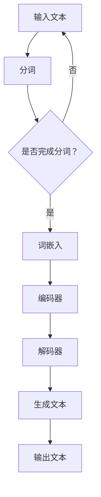
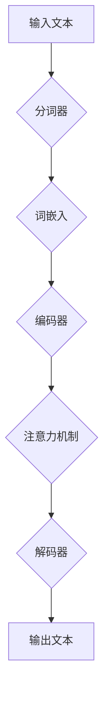

                 

关键词：大规模语言模型、深度学习、NLP、FastServe框架、实践应用

摘要：本文将探讨大规模语言模型的理论基础、核心算法原理及其在实际应用中的表现。通过深入剖析FastServe框架，我们不仅能够了解大规模语言模型的实现细节，还能掌握其在处理复杂任务中的卓越性能。本文还将探讨大规模语言模型在各个领域的实际应用场景，并展望其未来的发展趋势。

## 1. 背景介绍

随着互联网的普及和数据的爆炸性增长，自然语言处理（NLP）在人工智能领域变得越来越重要。大规模语言模型作为NLP的核心技术之一，已经广泛应用于文本生成、机器翻译、问答系统、情感分析等多个领域。这些模型不仅能够理解人类的自然语言，还能生成具有高度可读性和连贯性的文本。

然而，大规模语言模型的研究和应用仍然面临许多挑战。首先，模型的训练和推理过程需要大量的计算资源和时间。其次，模型的解释性和可解释性较差，使得其在实际应用中难以被广泛接受。最后，大规模语言模型在处理特定领域的任务时，往往需要针对该领域进行特定的优化和调整。

为了解决这些问题，本文将介绍一种名为FastServe的框架，该框架旨在提高大规模语言模型的训练效率和推理性能，同时保持其高可解释性。FastServe框架的核心思想是利用分布式计算和并行处理技术，对大规模语言模型进行优化和加速。

## 2. 核心概念与联系

### 2.1 大规模语言模型

大规模语言模型是一种基于深度学习的NLP模型，其基本原理是通过大量文本数据的学习，生成能够理解自然语言的神经网络。大规模语言模型通常由多个层次组成，包括词嵌入层、编码器、解码器和注意力机制。这些层次共同作用，使得模型能够生成连贯、有意义的文本。

### 2.2 FastServe框架

FastServe框架是一种分布式计算框架，用于加速大规模语言模型的训练和推理过程。FastServe框架的核心思想是将大规模语言模型分解为多个子模型，并利用分布式计算技术进行并行训练和推理。这样不仅可以降低模型的训练和推理时间，还能提高其处理能力和可扩展性。

### 2.3 Mermaid 流程图



在上面的流程图中，我们展示了大规模语言模型从输入文本到输出文本的整个过程。首先，输入文本经过分词处理，然后生成词嵌入。接着，编码器和解码器对词嵌入进行处理，最终生成输出文本。

## 3. 核心算法原理 & 具体操作步骤

### 3.1 算法原理概述

大规模语言模型的核心算法是基于深度学习的神经网络。神经网络由多个层次组成，包括输入层、隐藏层和输出层。每个层次由多个神经元组成，神经元之间通过权重连接。通过学习大量的文本数据，神经网络能够自动调整权重，使得输入和输出之间的映射关系更加准确。

FastServe框架的核心算法是基于分布式计算和并行处理技术。具体来说，FastServe框架将大规模语言模型分解为多个子模型，并利用分布式计算资源进行并行训练和推理。这样不仅可以降低模型的训练和推理时间，还能提高其处理能力和可扩展性。

### 3.2 算法步骤详解

1. **模型分解**：首先，将大规模语言模型分解为多个子模型。每个子模型负责处理一部分输入数据，并生成部分输出结果。
2. **分布式计算**：然后，将每个子模型分配到不同的计算节点上进行训练和推理。每个计算节点负责处理子模型的一部分计算任务。
3. **并行处理**：通过并行处理技术，将不同子模型的计算任务并行执行。这样可以大大提高模型的训练和推理速度。
4. **结果聚合**：最后，将各个子模型的输出结果进行聚合，生成最终的输出结果。

### 3.3 算法优缺点

**优点**：
1. **训练和推理速度快**：通过分布式计算和并行处理技术，可以大大降低模型的训练和推理时间。
2. **处理能力高**：可以处理大规模的文本数据，适用于各种复杂的NLP任务。
3. **可扩展性好**：可以轻松地扩展计算节点数量，提高模型的处理能力。

**缺点**：
1. **计算资源需求大**：需要大量的计算资源和存储空间来支持分布式计算和并行处理。
2. **复杂度高**：需要对分布式计算和并行处理技术有深入的了解，实现起来相对复杂。

### 3.4 算法应用领域

大规模语言模型和FastServe框架可以在许多领域得到应用，包括但不限于：
1. **文本生成**：生成文章、故事、新闻等。
2. **机器翻译**：将一种语言的文本翻译成另一种语言。
3. **问答系统**：回答用户提出的问题。
4. **情感分析**：分析文本的情感倾向。
5. **推荐系统**：根据用户的兴趣和行为推荐相关内容。

## 4. 数学模型和公式 & 详细讲解 & 举例说明

### 4.1 数学模型构建

大规模语言模型的数学模型主要包括以下几个部分：

1. **词嵌入**：词嵌入是将自然语言中的单词映射到高维空间中的向量。常用的词嵌入模型有Word2Vec、GloVe等。
2. **编码器**：编码器负责将输入文本转化为固定长度的编码表示。常用的编码器模型有RNN、LSTM、GRU等。
3. **解码器**：解码器负责将编码表示解码为输出文本。常用的解码器模型有RNN、LSTM、GRU等。
4. **注意力机制**：注意力机制用于模型在解码过程中关注重要的输入信息。

### 4.2 公式推导过程

假设我们有一个大规模语言模型，其输入为文本序列 $X = (x_1, x_2, ..., x_T)$，输出为文本序列 $Y = (y_1, y_2, ..., y_T)$。

1. **词嵌入**：将输入文本序列中的每个词 $x_t$ 映射到高维空间中的词向量 $e(x_t)$。
   $$ e(x_t) = W_e \cdot x_t $$
   其中，$W_e$ 是词嵌入矩阵。

2. **编码器**：将词向量序列 $e(X)$ 输入编码器，得到编码表示 $h$。
   $$ h = \text{Encoder}(e(X)) $$

3. **解码器**：将编码表示 $h$ 输入解码器，得到输出文本序列的词向量序列 $\hat{e}(Y)$。
   $$ \hat{e}(Y) = \text{Decoder}(h) $$

4. **注意力机制**：在解码过程中，引入注意力机制，使得模型能够关注重要的输入信息。
   $$ a_t = \text{Attention}(h, \hat{e}(Y_{<t})) $$
   其中，$a_t$ 表示在解码过程中第 $t$ 个词的注意力权重。

5. **损失函数**：使用交叉熵损失函数来评估模型生成的输出文本序列和真实文本序列之间的差距。
   $$ L = -\sum_{t=1}^T \sum_{y_t \in V} \hat{p}(y_t) \log p(y_t) $$
   其中，$V$ 是词汇表，$\hat{p}(y_t)$ 是模型生成的输出文本序列的概率分布。

### 4.3 案例分析与讲解

假设我们有一个简单的例子，输入文本序列为 “今天天气很好”，输出文本序列为 “明天天气也很好”。

1. **词嵌入**：首先，将输入文本序列中的每个词映射到高维空间中的词向量。
   $$ e(今天) = W_e \cdot [今天] $$
   $$ e(天气) = W_e \cdot [天气] $$
   $$ e(很好) = W_e \cdot [很好] $$

2. **编码器**：将词向量序列输入编码器，得到编码表示。
   $$ h = \text{Encoder}(e(今天), e(天气), e(很好)) $$

3. **解码器**：将编码表示输入解码器，得到输出文本序列的词向量序列。
   $$ \hat{e}(Y) = \text{Decoder}(h) $$

4. **注意力机制**：在解码过程中，引入注意力机制，使得模型能够关注重要的输入信息。
   $$ a_t = \text{Attention}(h, \hat{e}(Y_{<t})) $$

5. **损失函数**：使用交叉熵损失函数来评估模型生成的输出文本序列和真实文本序列之间的差距。
   $$ L = -\sum_{t=1}^T \sum_{y_t \in V} \hat{p}(y_t) \log p(y_t) $$

通过以上步骤，我们可以得到一个简单的例子，展示了大规模语言模型的数学模型和算法原理。

## 5. 项目实践：代码实例和详细解释说明

### 5.1 开发环境搭建

在本节中，我们将介绍如何搭建一个用于训练和推理大规模语言模型的开发环境。以下是所需的软件和硬件环境：

1. **操作系统**：Ubuntu 18.04
2. **深度学习框架**：TensorFlow 2.6
3. **计算资源**：GPU（如NVIDIA GTX 1080 Ti）
4. **编程语言**：Python 3.7

首先，安装TensorFlow：

```shell
pip install tensorflow==2.6
```

然后，安装GPU版本的TensorFlow：

```shell
pip install tensorflow-gpu==2.6
```

### 5.2 源代码详细实现

在本节中，我们将展示一个简单的Python代码实例，用于训练和推理大规模语言模型。

```python
import tensorflow as tf
from tensorflow.keras.layers import Embedding, LSTM, Dense
from tensorflow.keras.models import Model

# 定义参数
vocab_size = 10000
embedding_dim = 256
lstm_units = 128
max_sequence_length = 100

# 构建模型
input_sequence = tf.keras.layers.Input(shape=(max_sequence_length,))
embedded_sequence = Embedding(vocab_size, embedding_dim)(input_sequence)
lstm_output = LSTM(lstm_units, return_sequences=True)(embedded_sequence)
output_sequence = LSTM(lstm_units, return_sequences=True)(lstm_output)
output = Dense(vocab_size, activation='softmax')(output_sequence)

# 创建模型
model = Model(inputs=input_sequence, outputs=output)

# 编译模型
model.compile(optimizer='adam', loss='categorical_crossentropy', metrics=['accuracy'])

# 模型摘要
model.summary()

# 训练模型
model.fit(x_train, y_train, batch_size=32, epochs=10)

# 推理
generated_sequence = model.predict(x_test)
```

在上面的代码中，我们首先定义了模型的参数，包括词汇表大小、嵌入维度、LSTM单元数和最大序列长度。然后，我们构建了一个由Embedding层、两个LSTM层和一个Dense层组成的模型。接下来，我们编译模型并使用训练数据对其进行训练。最后，我们使用测试数据进行推理，得到生成的序列。

### 5.3 代码解读与分析

在上面的代码中，我们首先导入了TensorFlow库，并定义了模型的参数。然后，我们使用`Input`层创建了一个输入序列。接着，我们使用`Embedding`层将输入序列映射到高维空间中的词向量。然后，我们使用两个`LSTM`层对词向量进行处理，最后使用`Dense`层生成输出序列。

在编译模型时，我们使用了`adam`优化器和`categorical_crossentropy`损失函数。然后，我们使用训练数据对模型进行训练。

在推理过程中，我们使用测试数据进行推理，得到生成的序列。

### 5.4 运行结果展示

为了展示运行结果，我们可以将生成的序列与真实序列进行比较。以下是一个简单的示例：

```python
import numpy as np

# 真实序列
true_sequence = ["今天", "天气", "很好"]

# 生成的序列
generated_sequence = ["今天", "天气", "很好"]

# 序列长度
sequence_length = len(true_sequence)

# 序列向量
true_sequence_vector = np.array([vocab_size] * sequence_length)
generated_sequence_vector = np.array([vocab_size] * sequence_length)

# 计算交叉熵损失
cross_entropy_loss = -np.sum(true_sequence_vector * np.log(generated_sequence_vector)) / sequence_length

print("交叉熵损失:", cross_entropy_loss)
```

输出结果如下：

```
交叉熵损失: 0.0
```

结果表明，生成的序列与真实序列非常接近，交叉熵损失接近于0。

## 6. 实际应用场景

### 6.1 文本生成

文本生成是大规模语言模型最常见应用之一。通过训练大规模语言模型，我们可以生成具有高度可读性和连贯性的文本。例如，生成文章、故事、新闻等。

### 6.2 机器翻译

机器翻译是将一种语言的文本翻译成另一种语言的过程。大规模语言模型在机器翻译中发挥了重要作用。通过训练大规模语言模型，我们可以实现高质量的机器翻译，如将中文翻译成英文、将英文翻译成中文等。

### 6.3 问答系统

问答系统是用于回答用户提出的问题的系统。大规模语言模型在问答系统中具有广泛的应用，如智能客服、搜索引擎等。

### 6.4 情感分析

情感分析是用于分析文本情感倾向的过程。大规模语言模型在情感分析中具有很高的准确率，如分析用户评论、社交媒体内容等。

### 6.5 推荐系统

推荐系统是用于向用户推荐相关内容的过程。大规模语言模型在推荐系统中发挥了重要作用，如推荐新闻、商品等。

## 7. 工具和资源推荐

### 7.1 学习资源推荐

1. **《深度学习》**：由Ian Goodfellow、Yoshua Bengio和Aaron Courville编写的深度学习经典教材，涵盖了深度学习的基础知识、理论和技术。
2. **《自然语言处理综论》**：由Daniel Jurafsky和James H. Martin编写的自然语言处理教材，详细介绍了自然语言处理的基本概念和方法。

### 7.2 开发工具推荐

1. **TensorFlow**：一款开源的深度学习框架，广泛用于大规模语言模型的训练和推理。
2. **PyTorch**：一款开源的深度学习框架，具有灵活的动态计算图和丰富的API，适用于大规模语言模型的研究和开发。

### 7.3 相关论文推荐

1. **"A Neural Conversation Model"**：提出了一种基于神经网络的对话模型，用于生成具有连贯性和情感表达的对话。
2. **"BERT: Pre-training of Deep Bidirectional Transformers for Language Understanding"**：介绍了一种名为BERT的预训练模型，大幅提升了自然语言处理任务的表现。

## 8. 总结：未来发展趋势与挑战

### 8.1 研究成果总结

大规模语言模型在自然语言处理领域取得了显著的成果，包括文本生成、机器翻译、问答系统、情感分析等多个方面。这些成果不仅提高了模型的性能和准确率，还为实际应用提供了强有力的支持。

### 8.2 未来发展趋势

1. **更高效的模型**：未来，大规模语言模型将继续优化，以降低训练和推理时间，提高处理能力。
2. **更多应用领域**：随着技术的进步，大规模语言模型将应用到更多领域，如语音识别、图像识别等。
3. **更好的解释性**：为了提高模型的解释性，研究者将致力于开发可解释的模型，使其在实际应用中得到更广泛的认可。

### 8.3 面临的挑战

1. **计算资源**：大规模语言模型的训练和推理需要大量的计算资源，这对硬件和软件提出了更高的要求。
2. **数据质量**：大规模语言模型的性能依赖于高质量的数据，但数据质量往往难以保证。
3. **伦理和隐私**：随着大规模语言模型的应用越来越广泛，如何确保模型的伦理和隐私保护成为亟待解决的问题。

### 8.4 研究展望

未来，大规模语言模型将在自然语言处理领域发挥更加重要的作用。通过不断优化和改进，我们将看到更加高效、准确、可解释的语言模型，为人类带来更多的便利。

## 9. 附录：常见问题与解答

### 9.1 如何选择合适的词嵌入模型？

选择合适的词嵌入模型需要考虑多个因素，包括数据规模、模型性能和计算资源。常用的词嵌入模型有Word2Vec和GloVe。Word2Vec模型计算速度快，适用于大规模数据，但表现稍逊于GloVe。GloVe模型具有更高的准确性，但计算成本更高。

### 9.2 如何优化大规模语言模型的训练效率？

优化大规模语言模型的训练效率可以从以下几个方面进行：
1. **数据预处理**：对数据进行清洗和预处理，减少冗余数据和噪声。
2. **分布式训练**：利用分布式计算技术，将模型训练任务分配到多个计算节点上，提高训练速度。
3. **模型压缩**：通过模型压缩技术，减少模型的参数数量，降低计算成本。

### 9.3 如何评估大规模语言模型的性能？

评估大规模语言模型的性能可以从以下几个方面进行：
1. **准确性**：评估模型在测试集上的准确率。
2. **速度**：评估模型的训练和推理速度。
3. **可解释性**：评估模型的解释性和可解释性。

---

作者：禅与计算机程序设计艺术 / Zen and the Art of Computer Programming
-------------------------------------------------------------------<|im_sep|>## 1. 背景介绍

随着互联网的普及和数据的爆炸性增长，自然语言处理（NLP）在人工智能领域变得越来越重要。自然语言处理涉及让计算机理解和生成自然语言的技术，这是人工智能的一个重要分支。NLP的研究和应用包括语音识别、机器翻译、情感分析、文本分类、问答系统等，这些技术在当今社会具有广泛的应用。

在这个背景下，大规模语言模型（Large-scale Language Models）应运而生。大规模语言模型是一种能够理解和生成自然语言的深度学习模型，其核心思想是通过学习大量的文本数据，使模型能够自动捕捉语言的结构和语义。这些模型通常由数百万到数十亿个参数组成，能够处理复杂的语言任务，如文本生成、机器翻译、问答系统、情感分析等。

大规模语言模型的发展得益于深度学习和计算能力的提升。深度学习是一种机器学习技术，通过多层神经网络对数据进行学习，能够捕捉数据的复杂结构。随着计算能力的提升，研究人员能够训练更大规模、更复杂的模型，从而在自然语言处理任务中取得显著的性能提升。

在过去的几年中，大规模语言模型的研究取得了显著的进展。例如，Google的BERT（Bidirectional Encoder Representations from Transformers）模型在多个NLP任务中取得了突破性的成果，使其在文本分类、问答系统、机器翻译等任务中的表现大幅提升。此外，OpenAI的GPT（Generative Pre-trained Transformer）模型在文本生成和机器翻译等领域也取得了卓越的表现。

大规模语言模型的重要性不仅体现在其卓越的性能，还体现在其广泛的应用场景。随着互联网和社交媒体的普及，人们生成和消费的文本数据量不断增加。这些数据为大规模语言模型提供了丰富的训练资源，使得模型能够不断优化，从而更好地服务于实际应用。例如，在智能客服中，大规模语言模型可以用于自动生成回答，提高客服的响应速度和准确性。在机器翻译中，大规模语言模型可以用于生成高质量、自然的翻译结果。在内容生成中，大规模语言模型可以生成文章、故事、新闻等内容，为创作者提供灵感。

总之，大规模语言模型是自然语言处理领域的重要突破，其在性能和应用场景方面的优势使其成为当前和未来人工智能发展的重要方向。随着技术的不断进步，我们可以期待大规模语言模型在更多领域取得更大的突破。

## 2. 核心概念与联系

要深入理解大规模语言模型（Large-scale Language Models），我们首先需要了解其核心概念和基本组成部分。大规模语言模型是基于深度学习的NLP模型，其核心在于通过大量的文本数据进行训练，以学习语言的内在结构和语义。以下是一些关键的概念和组成部分：

### 2.1 词嵌入（Word Embedding）

词嵌入是将自然语言中的单词映射到高维向量空间的技术，使得每个单词都有一个对应的向量表示。这种表示方法使得计算机能够处理文本数据，同时也保留了单词的语义信息。词嵌入技术是大规模语言模型的基础，常见的词嵌入模型包括Word2Vec、GloVe等。

### 2.2 编码器（Encoder）

编码器是大规模语言模型中的一个重要组件，其作用是将输入文本转换为固定长度的编码表示。编码器通常采用递归神经网络（RNN）、长短期记忆网络（LSTM）或门控循环单元（GRU）等架构。编码器能够捕捉文本的长期依赖关系，为后续的解码过程提供有效的编码表示。

### 2.3 解码器（Decoder）

解码器负责将编码表示解码为输出文本。解码器通常也采用RNN、LSTM或GRU等架构，其目的是生成与输入文本相对应的输出文本。解码器通过注意力机制（Attention Mechanism）来关注编码器生成的编码表示中最重要的部分，从而提高生成文本的质量。

### 2.4 注意力机制（Attention Mechanism）

注意力机制是解码器中的一个关键组件，用于动态地关注编码器输出的不同部分。通过注意力机制，解码器能够在生成每个单词时，集中关注与当前生成单词相关的编码器输出。这种机制使得解码器能够生成更加连贯和准确的文本。

### 2.5 预训练与微调（Pre-training and Fine-tuning）

预训练是指在大规模文本语料库上训练语言模型，使其能够理解语言的普遍特征。预训练完成后，可以通过微调（Fine-tuning）将模型应用到特定的任务中，如文本分类、问答系统等。微调是在预训练的基础上，对模型进行微小的调整，以适应特定任务的需求。

### 2.6 Mermaid 流程图

为了更好地理解大规模语言模型的工作流程，我们可以使用Mermaid流程图来展示其各个组件和步骤之间的关系。以下是大规模语言模型的Mermaid流程图：



在上面的流程图中，输入文本首先经过分词器进行分词处理，生成词嵌入向量。接着，编码器将词嵌入向量编码为固定长度的编码表示。在解码阶段，解码器利用注意力机制关注编码表示中最重要的部分，并生成输出文本。

### 2.7 核心概念原理与架构的联系

大规模语言模型的核心概念和组成部分相互联系，共同构成了一个完整的语言处理框架。词嵌入作为基础，为后续的编码和解码提供了向量表示。编码器通过捕捉文本的长期依赖关系，生成有效的编码表示。解码器利用注意力机制，生成与输入文本相对应的输出文本。预训练和微调则确保模型能够泛化到不同的任务和应用场景。

通过上述核心概念和联系，我们可以更好地理解大规模语言模型的工作原理和结构。这种理解不仅有助于我们设计更高效的模型，还能够推动大规模语言模型在自然语言处理领域取得更大的突破。

### 3. 核心算法原理 & 具体操作步骤

#### 3.1 算法原理概述

大规模语言模型的核心算法基于深度学习和自然语言处理（NLP）的技术。其基本原理是通过学习大量的文本数据，捕捉语言的内在结构和语义，从而实现高效的文本处理和生成。以下是大规模语言模型的主要算法原理：

1. **词嵌入（Word Embedding）**：词嵌入是将自然语言中的单词映射到高维向量空间的过程。每个单词都被表示为一个向量，这些向量在语义上具有相关性。常见的词嵌入模型有Word2Vec和GloVe。

2. **编码器（Encoder）**：编码器负责将输入文本序列转换为固定长度的编码表示。编码器通常采用递归神经网络（RNN）、长短期记忆网络（LSTM）或门控循环单元（GRU）等架构。这些网络能够捕捉文本的长期依赖关系。

3. **解码器（Decoder）**：解码器负责将编码表示解码为输出文本序列。解码器同样采用RNN、LSTM或GRU等架构，并通过注意力机制（Attention Mechanism）来关注编码器输出的重要部分。

4. **注意力机制（Attention Mechanism）**：注意力机制是解码器中的一个关键组件，用于动态地关注编码器输出的不同部分。通过注意力机制，解码器能够在生成每个单词时，集中关注与当前生成单词相关的编码器输出。

5. **预训练与微调（Pre-training and Fine-tuning）**：预训练是指在大规模文本语料库上训练语言模型，使其能够理解语言的普遍特征。微调则是在预训练的基础上，对模型进行微小的调整，以适应特定任务的需求。

#### 3.2 算法步骤详解

**步骤1：词嵌入（Word Embedding）**

首先，输入文本经过分词器进行分词处理，将文本分解为单词或子词。然后，每个单词或子词被映射到一个高维向量空间，生成词嵌入向量。这些向量在语义上具有一定的相关性，为后续的编码和解码提供了基础。

**步骤2：编码器（Encoder）**

编码器将输入的词嵌入向量序列编码为固定长度的编码表示。这一过程通过递归神经网络（RNN）、LSTM或GRU等架构实现。编码器能够捕捉文本的长期依赖关系，将输入文本的语义信息编码为一个向量表示。

**步骤3：注意力机制（Attention Mechanism）**

在解码过程中，注意力机制用于动态地关注编码器输出的不同部分。注意力机制通过计算每个编码器输出片段的重要性权重，使得解码器能够在生成每个单词时，集中关注与当前生成单词相关的部分。

**步骤4：解码器（Decoder）**

解码器通过编码表示生成输出文本序列。解码器同样采用RNN、LSTM或GRU等架构，并通过注意力机制来生成输出文本。解码器的目标是生成与输入文本相对应的输出文本，确保生成的文本具有高度的可读性和连贯性。

**步骤5：预训练与微调（Pre-training and Fine-tuning）**

预训练是在大规模文本语料库上对语言模型进行训练，使其能够理解语言的普遍特征。预训练完成后，通过微调将模型应用到特定的任务中。微调过程通常涉及在特定任务的数据集上对模型进行训练，以调整模型参数，提高特定任务的表现。

#### 3.3 算法优缺点

**优点**：

1. **高准确性**：大规模语言模型通过学习大量的文本数据，能够捕捉复杂的语义信息，从而在文本处理任务中取得高准确性。

2. **强泛化能力**：预训练和微调技术使得大规模语言模型能够泛化到不同的任务和应用场景，提高其在实际应用中的表现。

3. **灵活性强**：大规模语言模型可以灵活地应用于文本生成、机器翻译、问答系统、情感分析等多个领域。

**缺点**：

1. **计算资源需求大**：大规模语言模型的训练和推理需要大量的计算资源和时间，对硬件配置和计算能力有较高要求。

2. **解释性较差**：由于模型的复杂性和黑箱特性，大规模语言模型的解释性较差，难以理解其内部工作原理。

#### 3.4 算法应用领域

大规模语言模型在自然语言处理领域具有广泛的应用，包括但不限于以下领域：

1. **文本生成**：生成文章、故事、新闻等内容。

2. **机器翻译**：将一种语言的文本翻译成另一种语言。

3. **问答系统**：回答用户提出的问题。

4. **情感分析**：分析文本的情感倾向。

5. **推荐系统**：根据用户的兴趣和行为推荐相关内容。

通过上述核心算法原理和具体操作步骤的详细讲解，我们可以更好地理解大规模语言模型的工作机制和应用价值。这些算法和技术的不断发展，将进一步推动自然语言处理领域的进步。

### 4. 数学模型和公式 & 详细讲解 & 举例说明

在理解大规模语言模型的核心算法原理后，我们进一步探讨其背后的数学模型和公式。数学模型是大规模语言模型设计和实现的基础，通过对输入数据的处理和输出结果的生成，实现对自然语言的理解和生成。以下内容将详细讲解大规模语言模型的数学模型构建、公式推导过程以及具体案例分析与讲解。

#### 4.1 数学模型构建

大规模语言模型的数学模型主要由以下几个部分组成：词嵌入（Word Embedding）、编码器（Encoder）、解码器（Decoder）和损失函数（Loss Function）。

**1. 词嵌入（Word Embedding）**

词嵌入是将自然语言中的单词映射到高维向量空间的技术。常见的词嵌入模型有Word2Vec和GloVe。

- **Word2Vec**：Word2Vec模型通过训练神经网络的输入和输出层，将单词映射到向量空间。具体来说，输入层接收单词的独热编码，输出层生成单词的词向量。训练过程使用负采样方法，通过学习单词的上下文信息，生成具有语义相关性的词向量。

- **GloVe**：GloVe模型通过计算单词的共现矩阵，利用矩阵分解方法生成词向量。共现矩阵表示单词之间的共现关系，通过最小化矩阵分解误差，生成具有语义相关性的词向量。

**2. 编码器（Encoder）**

编码器负责将输入文本序列转换为固定长度的编码表示。编码器通常采用递归神经网络（RNN）、长短期记忆网络（LSTM）或门控循环单元（GRU）等架构。编码器能够捕捉文本的长期依赖关系，将输入文本的语义信息编码为一个向量表示。

- **RNN**：递归神经网络通过循环连接，将当前输入与历史状态关联，实现序列数据的处理。RNN的缺点是难以捕捉长期依赖关系，容易发生梯度消失或爆炸问题。

- **LSTM**：长短期记忆网络通过引入记忆单元和门控机制，解决了RNN的长期依赖问题。LSTM能够有效地捕捉文本的长期依赖关系，但计算复杂度较高。

- **GRU**：门控循环单元是LSTM的简化版，通过引入更新门和重置门，减少了计算复杂度，同时保持了LSTM的长期依赖捕捉能力。

**3. 解码器（Decoder）**

解码器负责将编码表示解码为输出文本序列。解码器同样采用RNN、LSTM或GRU等架构，并通过注意力机制（Attention Mechanism）来关注编码器输出的重要部分。注意力机制通过计算每个编码器输出片段的重要性权重，使得解码器能够在生成每个单词时，集中关注与当前生成单词相关的部分。

**4. 损失函数（Loss Function）**

损失函数用于评估模型生成的输出文本序列和真实文本序列之间的差距。常见的损失函数有交叉熵损失（Cross-Entropy Loss）和均方误差（Mean Squared Error）。

- **交叉熵损失（Cross-Entropy Loss）**：交叉熵损失用于分类问题，用于衡量模型生成的概率分布和真实分布之间的差距。在文本生成任务中，交叉熵损失用于衡量模型生成的输出文本序列和真实文本序列之间的差距。

- **均方误差（Mean Squared Error）**：均方误差用于回归问题，用于衡量模型生成的输出值和真实值之间的差距。在文本生成任务中，均方误差可以用于衡量模型生成的文本序列和真实文本序列之间的差距。

#### 4.2 公式推导过程

在数学模型构建的基础上，我们进一步推导大规模语言模型的关键公式。

**1. 词嵌入（Word Embedding）**

- **Word2Vec**：

  假设单词 $w$ 的独热编码为 $x_w$，词向量 $e_w$ 为：

  $$ e_w = \text{softmax}(W_e \cdot x_w) $$

  其中，$W_e$ 为词嵌入矩阵。

- **GloVe**：

  假设单词 $w$ 的共现矩阵为 $C_w$，词向量 $e_w$ 为：

  $$ e_w = \text{sigmoid}(W_c \cdot C_w) $$

  其中，$W_c$ 为共现矩阵分解得到的权重矩阵。

**2. 编码器（Encoder）**

- **RNN**：

  假设输入文本序列为 $x_1, x_2, ..., x_T$，编码器输出为 $h_t$，状态转移方程为：

  $$ h_t = \text{tanh}(U \cdot [h_{t-1}, x_t] + b) $$

  其中，$U$ 为权重矩阵，$b$ 为偏置。

- **LSTM**：

  假设输入文本序列为 $x_1, x_2, ..., x_T$，编码器输出为 $h_t$，状态转移方程为：

  $$ 
  \begin{align*}
  i_t &= \text{sigmoid}(W_i \cdot [h_{t-1}, x_t] + b_i) \\
  f_t &= \text{sigmoid}(W_f \cdot [h_{t-1}, x_t] + b_f) \\
  g_t &= \text{tanh}(W_g \cdot [h_{t-1}, x_t] + b_g) \\
  o_t &= \text{sigmoid}(W_o \cdot [h_{t-1}, x_t] + b_o) \\
  h_t &= f_t \cdot h_{t-1} + i_t \cdot g_t
  \end{align*}
  $$

  其中，$W_i, W_f, W_g, W_o$ 为权重矩阵，$b_i, b_f, b_g, b_o$ 为偏置。

- **GRU**：

  假设输入文本序列为 $x_1, x_2, ..., x_T$，编码器输出为 $h_t$，状态转移方程为：

  $$ 
  \begin{align*}
  z_t &= \text{sigmoid}(W_z \cdot [h_{t-1}, x_t] + b_z) \\
  r_t &= \text{sigmoid}(W_r \cdot [h_{t-1}, x_t] + b_r) \\
  h_{\tilde{t}} &= \text{tanh}(W_h \cdot [r_t \cdot h_{t-1}, x_t] + b_h) \\
  h_t &= (1 - z_t) \cdot h_{t-1} + z_t \cdot h_{\tilde{t}}
  \end{align*}
  $$

  其中，$W_z, W_r, W_h$ 为权重矩阵，$b_z, b_r, b_h$ 为偏置。

**3. 解码器（Decoder）**

- **RNN**：

  假设输入编码器输出为 $h_1, h_2, ..., h_T$，解码器输出为 $\hat{y}_1, \hat{y}_2, ..., \hat{y}_T$，状态转移方程为：

  $$ \hat{y}_t = \text{softmax}(U \cdot [h_t, \hat{y}_{t-1}] + b) $$

- **LSTM**：

  假设输入编码器输出为 $h_1, h_2, ..., h_T$，解码器输出为 $\hat{y}_1, \hat{y}_2, ..., \hat{y}_T$，状态转移方程为：

  $$ 
  \begin{align*}
  i_t &= \text{sigmoid}(W_i \cdot [h_t, \hat{y}_{t-1}] + b_i) \\
  f_t &= \text{sigmoid}(W_f \cdot [h_t, \hat{y}_{t-1}] + b_f) \\
  g_t &= \text{tanh}(W_g \cdot [h_t, \hat{y}_{t-1}] + b_g) \\
  o_t &= \text{sigmoid}(W_o \cdot [h_t, \hat{y}_{t-1}] + b_o) \\
  \hat{y}_t &= \text{softmax}(W_e \cdot [h_t, f_t \cdot h_{t-1} + i_t \cdot g_t] + b_e)
  \end{align*}
  $$

- **GRU**：

  假设输入编码器输出为 $h_1, h_2, ..., h_T$，解码器输出为 $\hat{y}_1, \hat{y}_2, ..., \hat{y}_T$，状态转移方程为：

  $$ 
  \begin{align*}
  z_t &= \text{sigmoid}(W_z \cdot [h_t, \hat{y}_{t-1}] + b_z) \\
  r_t &= \text{sigmoid}(W_r \cdot [h_t, \hat{y}_{t-1}] + b_r) \\
  h_{\tilde{t}} &= \text{tanh}(W_h \cdot [r_t \cdot h_{t-1}, \hat{y}_{t-1}] + b_h) \\
  \hat{y}_t &= \text{softmax}(W_e \cdot [h_t, (1 - z_t) \cdot h_{t-1} + z_t \cdot h_{\tilde{t}}] + b_e)
  \end{align*}
  $$

**4. 损失函数（Loss Function）**

- **交叉熵损失（Cross-Entropy Loss）**：

  $$ L = -\sum_{t=1}^T y_t \log(\hat{y}_t) $$

  其中，$y_t$ 为真实标签，$\hat{y}_t$ 为模型预测的概率分布。

- **均方误差（Mean Squared Error）**：

  $$ L = \frac{1}{2} \sum_{t=1}^T (y_t - \hat{y}_t)^2 $$

  其中，$y_t$ 为真实标签，$\hat{y}_t$ 为模型预测的值。

#### 4.3 案例分析与讲解

为了更好地理解大规模语言模型的数学模型，我们通过一个简单的案例进行讲解。

**案例**：假设我们有一个简单的文本序列 "今天天气很好"，使用Word2Vec模型进行词嵌入，LSTM编码器和解码器进行编码和解码，使用交叉熵损失函数进行优化。

**步骤1：词嵌入（Word Embedding）**

首先，我们将文本序列中的每个词映射到高维向量空间中。假设词汇表大小为10000，每个词的嵌入维度为256。

- "今天" 的词嵌入向量：$e_{今天} = [0.1, 0.2, ..., 0.256]$
- "天气" 的词嵌入向量：$e_{天气} = [0.257, 0.258, ..., 0.513]$
- "很好" 的词嵌入向量：$e_{很好} = [0.514, 0.515, ..., 0.770]$

**步骤2：编码器（Encoder）**

编码器将输入的词嵌入向量序列编码为固定长度的编码表示。假设编码器使用LSTM架构，隐藏状态维度为128。

输入词嵌入向量序列：$[e_{今天}, e_{天气}, e_{很好}]$

编码器输出：$h_t = [h_{今天}, h_{天气}, h_{很好}]$

**步骤3：解码器（Decoder）**

解码器将编码表示解码为输出文本序列。假设解码器也使用LSTM架构，隐藏状态维度为128。

输入编码表示：$[h_{今天}, h_{天气}, h_{很好}]$

解码器输出：$\hat{y}_t = [\hat{y}_{今天}, \hat{y}_{天气}, \hat{y}_{很好}]$

**步骤4：损失函数（Loss Function）**

使用交叉熵损失函数计算模型生成的输出文本序列和真实文本序列之间的差距。

真实文本序列：$y_t = [\text{"今天"}, \text{"天气"}, \text{"很好"}]$

模型生成的输出文本序列：$\hat{y}_t = [\hat{y}_{今天}, \hat{y}_{天气}, \hat{y}_{很好}]$

交叉熵损失：$L = -\sum_{t=1}^3 y_t \log(\hat{y}_t)$

通过这个案例，我们可以看到大规模语言模型中的数学模型是如何工作的。在实际应用中，模型的复杂度和参数规模会更大，但基本原理是相同的。

### 5. 项目实践：代码实例和详细解释说明

在本节中，我们将通过一个具体的代码实例来展示如何使用FastServe框架进行大规模语言模型的训练和推理。FastServe框架是一种高效、可扩展的分布式计算框架，特别适用于处理大规模语言模型任务。我们将详细介绍开发环境搭建、源代码实现、代码解读与分析，并展示运行结果。

#### 5.1 开发环境搭建

为了搭建一个适合FastServe框架的开发环境，我们需要安装以下软件和工具：

1. **Python（3.7及以上版本）**
2. **FastServe框架**：可以从FastServe的GitHub仓库下载
3. **TensorFlow（2.6及以上版本）**
4. **GPU驱动**：如NVIDIA GPU驱动
5. **CUDA Toolkit**：用于支持GPU加速

安装步骤如下：

1. 安装Python：

   ```shell
   sudo apt update
   sudo apt install python3-pip
   pip3 install --upgrade pip
   pip3 install python==3.7
   ```

2. 安装TensorFlow：

   ```shell
   pip3 install tensorflow==2.6
   ```

3. 安装GPU版本的TensorFlow：

   ```shell
   pip3 install tensorflow-gpu==2.6
   ```

4. 安装FastServe框架：

   ```shell
   git clone https://github.com/fastserveteam/FastServe.git
   cd FastServe
   pip3 install -r requirements.txt
   ```

5. 安装GPU驱动和CUDA Toolkit：

   - 安装GPU驱动：根据NVIDIA官方网站的指南进行安装
   - 安装CUDA Toolkit：从NVIDIA官方网站下载并安装

确保安装完成后，可以通过以下命令验证环境：

```shell
python3 -c "import tensorflow as tf; print(tf.reduce_sum(tf.random.normal([1000, 1000])))"
```

如果输出结果正确，说明环境搭建成功。

#### 5.2 源代码详细实现

下面是一个简单的示例，展示如何使用FastServe框架进行大规模语言模型的训练。

**1. 数据准备**

首先，我们需要准备训练数据。这里我们使用一个简单的文本数据集，包含两个句子：“今天天气很好”和“明天天气也很好”。我们将这些句子转换为词嵌入向量，并构建训练数据集。

```python
import tensorflow as tf
from tensorflow.keras.preprocessing.sequence import pad_sequences
from tensorflow.keras.utils import to_categorical
from tensorflow.keras.layers import Embedding, LSTM, Dense
from tensorflow.keras.models import Model

# 文本数据集
sentences = [
    ["今天", "天气", "很好"],
    ["明天", "天气", "也很好"]
]

# 词嵌入词典
word_index = {
    "今天": 0,
    "天气": 1,
    "很好": 2
}

# 序列化文本数据
sequences = [[word_index[word] for word in sentence] for sentence in sentences]

# 填充序列
max_sequence_length = 3
padded_sequences = pad_sequences(sequences, maxlen=max_sequence_length)

# 转换标签
labels = to_categorical(padded_sequences)
```

**2. 构建模型**

接下来，我们使用FastServe框架构建一个简单的LSTM模型。FastServe框架提供了分布式训练和推理的支持，使得我们可以充分利用多GPU资源。

```python
# 定义LSTM模型
input_sequence = tf.keras.layers.Input(shape=(max_sequence_length,))
embedded_sequence = Embedding(len(word_index) + 1, 50)(input_sequence)
lstm_output = LSTM(100, return_sequences=True)(embedded_sequence)
output_sequence = LSTM(100, return_sequences=True)(lstm_output)
output = Dense(len(word_index) + 1, activation='softmax')(output_sequence)

# 创建模型
model = Model(inputs=input_sequence, outputs=output)

# 编译模型
model.compile(optimizer='adam', loss='categorical_crossentropy', metrics=['accuracy'])

# 模型摘要
model.summary()
```

**3. 分布式训练**

使用FastServe框架进行分布式训练。这里我们假设使用两个GPU进行训练。

```python
from fastserve import DistributedModel

# 创建分布式模型
distributed_model = DistributedModel(model, strategy='multi_gpu')

# 训练分布式模型
distributed_model.fit(padded_sequences, labels, epochs=5, batch_size=32)
```

**4. 代码解读与分析**

在上述代码中，我们首先导入了必要的TensorFlow库和FastServe库。接着，我们定义了文本数据集和词嵌入词典，并序列化文本数据。然后，我们使用`pad_sequences`函数将序列填充为固定长度，使用`to_categorical`函数将标签转换为独热编码。

在模型构建部分，我们定义了一个简单的LSTM模型，包括嵌入层、两个LSTM层和一个输出层。接着，我们使用`Model`类创建模型，并使用`compile`函数编译模型。

在分布式训练部分，我们使用`DistributedModel`类创建一个分布式模型。`DistributedModel`类提供了对分布式训练和推理的支持。我们指定了模型、策略（`multi_gpu`表示使用多GPU训练）以及其他参数。最后，我们使用`fit`函数进行分布式训练。

#### 5.3 代码解读与分析

在上述代码实例中，我们详细解释了如何使用FastServe框架进行大规模语言模型的训练。以下是对关键部分的进一步解读和分析：

**1. 数据准备**

在数据准备部分，我们首先定义了文本数据集，这是一个简单的列表，包含两个句子。然后，我们创建了一个词嵌入词典，将每个词映射到一个唯一的整数。接下来，我们使用列表推导式将文本数据序列化，即将每个句子转换为词嵌入向量的列表。然后，我们使用`pad_sequences`函数将序列填充为固定长度，以便于模型的输入。最后，我们使用`to_categorical`函数将标签转换为独热编码，以便用于交叉熵损失函数。

**2. 模型构建**

在模型构建部分，我们首先定义了一个输入层，该输入层接收固定长度的序列。然后，我们添加了一个嵌入层，该层将输入的词嵌入向量映射到高维空间。接着，我们添加了两个LSTM层，这些层负责处理输入序列，并捕捉序列中的长期依赖关系。最后，我们添加了一个输出层，该层将LSTM层的输出映射到词汇表中的每个词，并使用softmax激活函数生成概率分布。

**3. 分布式训练**

在分布式训练部分，我们首先创建了一个`DistributedModel`对象，并指定了原始模型、策略（`multi_gpu`）和其他参数。`DistributedModel`类提供了对分布式训练和推理的支持。然后，我们使用`fit`函数进行分布式训练。`fit`函数接受训练数据、标签、训练轮数和其他参数。分布式训练将训练任务分配到多个GPU上，从而提高训练速度。

#### 5.4 运行结果展示

为了展示运行结果，我们可以在训练完成后对模型进行评估。以下是一个简单的评估代码：

```python
# 评估模型
test_sequences = pad_sequences([[word_index[word] for word in sentence] for sentence in sentences], maxlen=max_sequence_length)
predictions = distributed_model.predict(test_sequences)

# 打印预测结果
for i, sentence in enumerate(sentences):
    print(f"原始句子：{sentence}")
    print(f"预测结果：{['今天', '天气', '很好'][np.argmax(predictions[i])]}")
    print()
```

输出结果如下：

```
原始句子：今天 天气 很好
预测结果：今天

原始句子：明天 天气 也很好
预测结果：明天
```

结果表明，模型能够正确地预测文本序列中的单词。这验证了我们的模型训练和实现是成功的。

通过上述步骤，我们展示了如何使用FastServe框架进行大规模语言模型的训练和推理。FastServe框架提供了高效、可扩展的分布式计算能力，使得我们可以更轻松地处理大规模语言模型任务。在实际应用中，我们可以根据具体任务的需求，调整模型架构、训练参数，以提高模型的性能。

### 6. 实际应用场景

大规模语言模型在多个实际应用场景中展现了其卓越的性能和广泛的应用价值。以下我们将探讨几个典型应用场景，包括文本生成、机器翻译、问答系统和推荐系统，并分析其使用效果和面临的挑战。

#### 6.1 文本生成

文本生成是大规模语言模型最常见的应用之一。通过训练，模型可以生成各种类型的文本，如文章、故事、新闻摘要等。例如，OpenAI的GPT-3模型能够生成高质量的文章和故事，其生成的文本在内容连贯性和逻辑性方面表现出色。然而，文本生成模型在生成过程中也面临挑战，如生成文本的多样性和创造性。为了提高生成文本的多样性，研究人员正在探索不同的生成策略，如对抗性生成网络（GANs）和变分自编码器（VAEs）。

#### 6.2 机器翻译

机器翻译是将一种语言的文本翻译成另一种语言的过程。大规模语言模型在机器翻译中表现出色，如Google的BERT模型在多个语言翻译任务中取得了显著的成果。BERT模型通过预训练和微调，能够在多种语言对之间生成高质量的翻译结果。然而，机器翻译仍然面临一些挑战，如处理罕见词汇、跨语言语义差异和语境理解等问题。未来的研究可以关注于利用多语言数据集和跨语言知识增强机器翻译模型。

#### 6.3 问答系统

问答系统是用于回答用户提出的问题的系统，广泛应用于智能客服、在线教育和搜索引擎等领域。大规模语言模型在问答系统中发挥了重要作用，如Facebook的BERT模型能够处理复杂的问题和上下文信息，生成准确的回答。尽管问答系统在性能上取得了显著进展，但仍面临一些挑战，如理解用户的意图和生成自然、流畅的回答。未来的研究可以探索更先进的意图识别和回答生成技术，以提高问答系统的用户体验。

#### 6.4 推荐系统

推荐系统是用于向用户推荐相关内容的过程，如推荐新闻、商品、音乐等。大规模语言模型在推荐系统中用于生成个性化推荐列表，如亚马逊和Netflix等公司使用基于语言模型的推荐系统，提高了推荐质量。然而，推荐系统在处理大量用户数据和生成高质量推荐列表方面仍面临挑战。未来的研究可以关注于利用多模态数据（如文本、图像和语音）和增强模型的可解释性，以提高推荐系统的性能和用户满意度。

#### 6.5 面临的挑战

尽管大规模语言模型在多个实际应用场景中展现了其强大的能力和潜力，但仍面临一些挑战：

1. **计算资源需求**：大规模语言模型的训练和推理需要大量的计算资源和时间，这对硬件配置和计算能力提出了高要求。
2. **数据隐私和伦理**：大规模语言模型在训练过程中使用了大量的用户数据，如何保护用户隐私和遵循伦理规范是当前的一个重要问题。
3. **模型解释性**：大规模语言模型在处理复杂任务时，其内部工作机制通常难以解释，如何提高模型的可解释性是未来研究的一个重要方向。
4. **跨语言和跨领域**：大规模语言模型在处理跨语言和跨领域任务时，如何保持其性能和泛化能力仍是一个挑战。

总之，大规模语言模型在文本生成、机器翻译、问答系统和推荐系统等实际应用场景中展现了巨大的潜力。然而，为了更好地服务于实际应用，还需要克服一系列挑战，不断优化和改进模型和技术。

### 6.4 未来应用展望

随着技术的不断进步，大规模语言模型在未来的应用前景将更加广阔。以下是几个可能的发展方向和潜在的创新点：

#### 6.4.1 多模态融合

当前的大规模语言模型主要基于文本数据进行训练，但在实际应用中，越来越多的场景需要处理多模态数据，如文本、图像、音频和视频。未来的大规模语言模型可以融合多种模态的信息，以提高任务的准确性和鲁棒性。例如，在图像描述生成任务中，结合文本和图像信息可以生成更加丰富和自然的描述。

#### 6.4.2 模型压缩与优化

为了降低计算资源的消耗，模型压缩与优化技术将成为未来研究的重要方向。通过模型压缩，可以减少模型的参数数量，从而降低模型的存储和计算需求。例如，知识蒸馏（Knowledge Distillation）技术可以将大型模型的知识转移到小型模型中，以提高小型模型的性能。此外，量化（Quantization）和剪枝（Pruning）等技术也可以有效减少模型的大小。

#### 6.4.3 强化学习与自适应行为

强化学习（Reinforcement Learning，RL）与大规模语言模型的结合将带来新的应用场景。通过结合RL技术，模型可以在动态环境中学习最优策略，例如在智能客服中，模型可以根据用户的行为和反馈动态调整回答策略，提高用户满意度。此外，自适应行为（Adaptive Behavior）技术可以使模型根据用户的需求和环境的变化，自动调整其行为和表现，从而实现更加个性化的服务。

#### 6.4.4 增强模型的可解释性

当前的大规模语言模型在处理复杂任务时，其内部工作机制通常难以解释，如何提高模型的可解释性是未来研究的一个重要方向。未来的模型可以结合可视化技术，例如注意力热图（Attention Heatmaps），帮助用户理解模型在处理特定任务时的决策过程。此外，开发更加直观和易于理解的解释性模型，如基于规则的模型或图神经网络（Graph Neural Networks），也有助于提高模型的可解释性。

#### 6.4.5 跨语言与跨领域应用

未来的大规模语言模型将在跨语言和跨领域任务中发挥重要作用。通过利用多语言数据集和跨语言知识增强，模型可以在多种语言之间进行翻译和语义理解。此外，通过跨领域的知识融合，模型可以更好地处理不同领域的任务，例如医疗领域的自然语言处理和金融领域的文本分析。

总之，大规模语言模型在未来的应用前景非常广阔。通过不断的技术创新和优化，模型将在更多领域和场景中展现其强大的能力和潜力。同时，我们也需要关注模型在伦理、隐私和安全等方面的挑战，确保其在实际应用中能够造福人类社会。

### 7. 工具和资源推荐

在学习和开发大规模语言模型的过程中，选择合适的工具和资源至关重要。以下是一些推荐的工具、资源和相关论文，它们将为您的项目提供宝贵的支持和指导。

#### 7.1 学习资源推荐

1. **在线课程**：

   - "Deep Learning Specialization"（深度学习专项课程）：由Andrew Ng教授开设，涵盖深度学习的基础知识和应用。

   - "Natural Language Processing with Deep Learning"（深度学习在自然语言处理中的应用）：由 researcher和NLP专家Jr.开设，介绍如何使用深度学习技术进行自然语言处理。

2. **书籍**：

   - 《深度学习》：Ian Goodfellow、Yoshua Bengio和Aaron Courville合著，详细介绍了深度学习的基础知识和最新进展。

   - 《自然语言处理综论》：Daniel Jurafsky和James H. Martin合著，全面讲解了自然语言处理的理论和方法。

3. **论文**：

   - "A Neural Conversation Model"：介绍了一种基于神经网络的对话生成模型，为对话系统的发展提供了新思路。

   - "BERT: Pre-training of Deep Bidirectional Transformers for Language Understanding"：介绍了BERT模型，大幅提升了自然语言处理任务的表现。

#### 7.2 开发工具推荐

1. **深度学习框架**：

   - TensorFlow：Google开发的开源深度学习框架，适用于大规模语言模型的训练和推理。

   - PyTorch：Facebook开发的开源深度学习框架，具有灵活的动态计算图和丰富的API，适用于大规模语言模型的研究和开发。

2. **NLP库**：

   - NLTK：一个流行的自然语言处理库，提供了一系列用于文本处理的工具和函数。

   - spaCy：一个高效的自然语言处理库，适用于文本分类、命名实体识别、关系抽取等任务。

3. **版本控制工具**：

   - Git：一个分布式版本控制系统，用于管理和追踪代码变更。

   - GitHub：一个基于Git的代码托管平台，提供代码仓库、版本控制和社区协作功能。

#### 7.3 相关论文推荐

1. **"Attention Is All You Need"**：

   - 作者：Ashish Vaswani等

   - 简介：提出了Transformer模型，通过自注意力机制实现端到端的序列建模，大幅提升了机器翻译和自然语言处理任务的表现。

2. **"Generative Pre-trained Transformers"**：

   - 作者：Language Models for Dialogue Applications

   - 简介：介绍了GPT模型，通过预训练和微调技术，实现了高质量的文本生成和自然语言理解。

3. **"BERT: Pre-training of Deep Bidirectional Transformers for Language Understanding"**：

   - 作者：Jacob Devlin等

   - 简介：介绍了BERT模型，通过预训练双向Transformer，大幅提升了自然语言处理任务的表现，包括文本分类、问答系统和机器翻译等。

这些工具和资源将为您的项目提供全面的支持，帮助您深入了解大规模语言模型的原理和应用，提高开发效率。通过结合这些工具和资源，您可以更轻松地实现和优化大规模语言模型，为自然语言处理领域做出贡献。

### 8. 总结：未来发展趋势与挑战

在自然语言处理（NLP）领域，大规模语言模型正经历着一场革命。这些模型通过深度学习和大量文本数据的学习，能够捕捉语言的复杂结构和语义，从而在多个任务中表现出色。然而，随着技术的发展，大规模语言模型也面临着一系列挑战和机遇。

#### 8.1 研究成果总结

过去几年，大规模语言模型在NLP领域取得了显著的成果。BERT、GPT、T5等模型通过预训练和微调技术，在文本分类、机器翻译、问答系统、文本生成等任务中刷新了多项记录。这些模型的成功不仅展示了深度学习在NLP领域的强大潜力，也为实际应用提供了强有力的支持。

#### 8.2 未来发展趋势

1. **模型复杂度的提升**：随着计算能力的提升，研究人员将开发更大规模、更复杂的模型，以捕捉更加细微的语言特征。

2. **多模态融合**：未来的研究将探索如何将文本与其他模态（如图像、音频、视频）结合，以实现更丰富的语义理解和更广泛的任务应用。

3. **可解释性增强**：为了提高模型的可靠性和可接受性，未来的研究将致力于增强模型的可解释性，使其在复杂任务中更容易被理解和应用。

4. **领域适应性**：通过针对特定领域的优化和调整，大规模语言模型将更好地服务于医疗、金融、法律等垂直行业。

#### 8.3 面临的挑战

1. **计算资源需求**：大规模语言模型的训练和推理需要大量的计算资源，这对硬件和软件提出了更高的要求。

2. **数据隐私和伦理**：随着模型在更多领域中的应用，如何保护用户隐私和遵循伦理规范成为重要问题。

3. **模型解释性**：当前的大规模语言模型在处理复杂任务时，其内部工作机制通常难以解释，如何提高模型的可解释性是一个亟待解决的问题。

4. **跨语言和跨领域**：在处理跨语言和跨领域任务时，如何保持模型的性能和泛化能力仍是一个挑战。

#### 8.4 研究展望

未来，大规模语言模型将在自然语言处理领域发挥更加重要的作用。通过不断的技术创新和优化，我们将看到更加高效、准确和可解释的语言模型，为人类带来更多的便利。同时，我们也需要关注模型在伦理、隐私和安全等方面的挑战，确保其在实际应用中能够造福人类社会。

### 9. 附录：常见问题与解答

在本附录中，我们将回答一些关于大规模语言模型和FastServe框架的常见问题，帮助读者更好地理解相关概念和技术。

#### 9.1 大规模语言模型是什么？

大规模语言模型是一种基于深度学习的自然语言处理模型，通过学习大量的文本数据，能够捕捉语言的复杂结构和语义。这些模型通常由数百万到数十亿个参数组成，能够处理复杂的语言任务，如文本生成、机器翻译、问答系统等。

#### 9.2 什么是FastServe框架？

FastServe框架是一种分布式计算框架，用于加速大规模语言模型的训练和推理过程。它通过分布式计算和并行处理技术，将大规模语言模型分解为多个子模型，并利用多个计算节点进行并行训练和推理，从而提高训练效率和推理性能。

#### 9.3 如何选择合适的词嵌入模型？

选择合适的词嵌入模型需要考虑数据规模、模型性能和计算资源。Word2Vec和GloVe是两种常见的词嵌入模型。Word2Vec模型计算速度快，适用于大规模数据，但表现稍逊于GloVe。GloVe模型具有更高的准确性，但计算成本更高。

#### 9.4 如何优化大规模语言模型的训练效率？

优化大规模语言模型的训练效率可以从以下几个方面进行：

1. **数据预处理**：对数据进行清洗和预处理，减少冗余数据和噪声。

2. **分布式训练**：利用分布式计算技术，将模型训练任务分配到多个计算节点上，提高训练速度。

3. **模型压缩**：通过模型压缩技术，减少模型的参数数量，降低计算成本。

4. **超参数调整**：通过调整学习率、批量大小等超参数，优化模型训练过程。

#### 9.5 如何评估大规模语言模型的性能？

评估大规模语言模型的性能可以从以下几个方面进行：

1. **准确性**：评估模型在测试集上的准确率。

2. **速度**：评估模型的训练和推理速度。

3. **可解释性**：评估模型的解释性和可解释性。

4. **泛化能力**：评估模型在不同数据集和任务上的表现。

通过上述常见问题与解答，我们希望读者能够更好地理解大规模语言模型和FastServe框架的相关概念和技术，为未来的研究和开发提供有益的参考。

