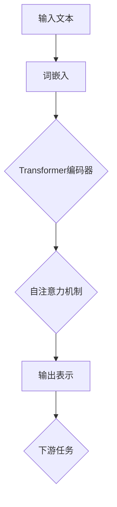
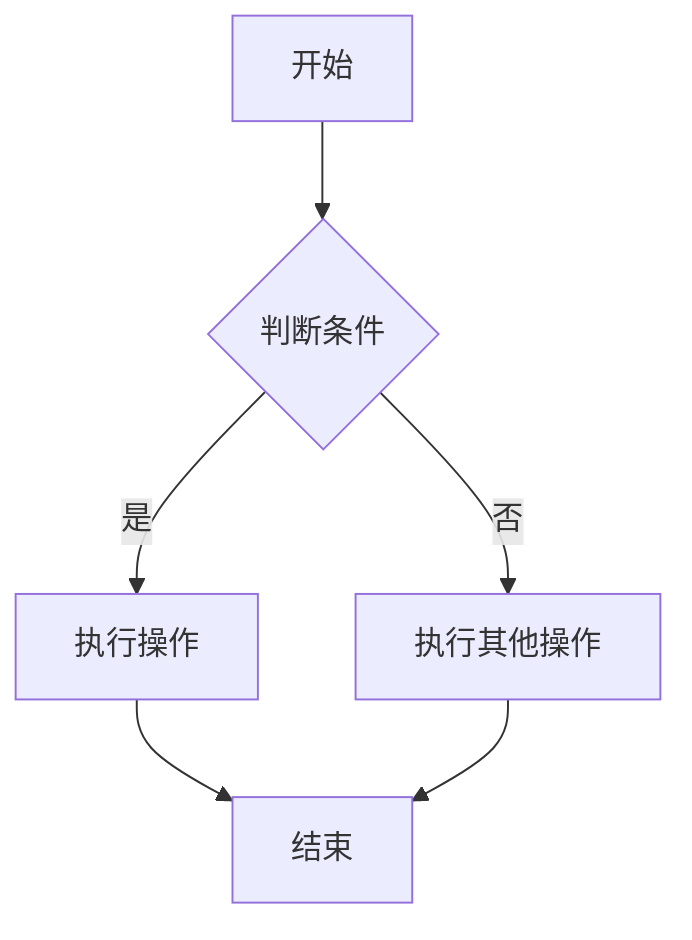
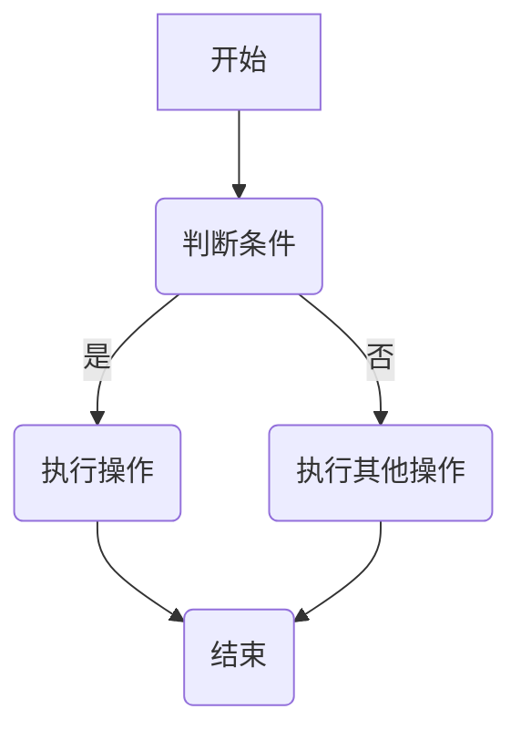

                 

关键词：大规模语言模型，自然语言处理，深度学习，Transformer，BERT，GPT，实践

> 摘要：本文旨在深入探讨大规模语言模型的理论基础、核心算法原理、数学模型及其在实际应用中的实现细节。通过对Transformer、BERT、GPT等知名模型的分析，我们揭示了这些模型在自然语言处理领域的重大贡献，并通过代码实例展示了如何在实际项目中应用这些模型。最后，本文对未来大规模语言模型的发展趋势和应用前景进行了展望。

## 1. 背景介绍

自然语言处理（Natural Language Processing，NLP）作为人工智能领域的一个重要分支，其目标是将人类语言转换为计算机可以理解和处理的形式。随着互联网的迅速发展和大数据的涌现，自然语言处理技术得到了极大的关注和广泛应用。然而，传统的NLP方法在处理复杂任务时往往效果不佳，这促使研究人员探索新的方法来解决这一问题。

近年来，深度学习（Deep Learning）技术的发展，特别是神经网络（Neural Networks）在图像处理、语音识别等领域的成功应用，为自然语言处理带来了新的契机。其中，大规模语言模型（Large-scale Language Models）的出现极大地提升了NLP任务的处理能力。大规模语言模型通过学习大量的文本数据，能够捕捉语言中的复杂结构，从而实现高质量的自然语言理解与生成。

本文将围绕大规模语言模型展开讨论，首先介绍其理论基础和核心概念，然后深入分析几种重要的语言模型，最后通过实际项目实践，展示如何将这些模型应用于自然语言处理任务。

## 2. 核心概念与联系

### 2.1 大规模语言模型概述

大规模语言模型是一种基于神经网络的语言表示和学习模型，其主要目的是通过学习大量文本数据，生成文本、回答问题或完成其他语言任务。大规模语言模型的核心在于其能够捕捉语言中的长距离依赖关系，这使得它们在处理自然语言时具有强大的表达能力和泛化能力。

### 2.2 自然语言处理与深度学习

自然语言处理与深度学习密切相关。深度学习通过多层神经网络模型，对大量数据进行学习，能够自动提取特征，实现复杂任务。在自然语言处理领域，深度学习模型被广泛应用于文本分类、情感分析、机器翻译、问答系统等任务。通过深度学习，我们能够构建出具有高度自动化和高效性的自然语言处理系统。

### 2.3 Transformer与BERT

Transformer模型是近年来自然语言处理领域的一大突破，其核心思想是利用自注意力机制（Self-Attention）对输入文本序列进行建模。Transformer模型在机器翻译、文本生成等领域取得了显著成果，成为大规模语言模型发展的一个重要方向。

BERT（Bidirectional Encoder Representations from Transformers）模型是另一种重要的语言表示模型，它通过双向Transformer编码器学习文本的上下文信息。BERT在多项NLP任务中取得了领先成绩，成为许多自然语言处理应用的基石。

### 2.4 Mermaid 流程图

为了更好地理解大规模语言模型的原理和架构，我们使用Mermaid流程图来展示其关键组成部分。



## 3. 核心算法原理 & 具体操作步骤

### 3.1 算法原理概述

大规模语言模型的核心算法原理是基于自注意力机制（Self-Attention）的Transformer模型。自注意力机制允许模型在处理文本序列时，自动关注序列中的不同部分，从而捕捉长距离依赖关系。Transformer模型由编码器和解码器两部分组成，编码器负责将输入文本序列转换为固定长度的表示，解码器则基于这些表示生成输出文本。

### 3.2 算法步骤详解

#### 3.2.1 Transformer编码器

1. 输入文本预处理：将输入文本转换为词嵌入（Word Embedding），将单词转换为向量表示。
2. 自注意力机制：对输入词嵌入进行自注意力计算，生成权重矩阵，用于加权求和。
3. 重复多层编码器：通过重复堆叠编码器层，模型能够学习到更复杂的文本表示。

#### 3.2.2 自注意力机制

自注意力机制是一种计算输入序列中每个元素对其他元素的影响权重的方法。具体步骤如下：

1. 对输入词嵌入进行线性变换，得到查询（Query）、键（Key）和值（Value）。
2. 计算查询与键之间的相似度，得到注意力权重。
3. 利用注意力权重对输入词嵌入进行加权求和，得到输出表示。

#### 3.2.3 解码器

1. 输入解码器：将编码器输出的文本表示作为解码器的输入。
2. 输入嵌入和位置编码：对输入文本进行线性变换，并添加位置编码（Positional Encoding）。
3. 自注意力和跨步注意力：首先计算自注意力，然后计算跨步注意力，用于上下文信息的交互。
4. 全连接层：通过全连接层生成输出文本。

### 3.3 算法优缺点

#### 优点：

1. 强大的表达能力和泛化能力：自注意力机制能够自动关注序列中的不同部分，捕捉长距离依赖关系。
2. 高效性：Transformer模型在计算效率上优于传统的循环神经网络（RNN）。
3. 广泛的应用场景：Transformer模型在机器翻译、文本生成、问答系统等领域取得了显著成果。

#### 缺点：

1. 计算量大：自注意力机制的计算复杂度高，导致模型训练和推断时间较长。
2. 资源消耗大：大规模语言模型需要大量的计算资源和存储空间。

### 3.4 算法应用领域

大规模语言模型在自然语言处理领域具有广泛的应用，主要包括：

1. 机器翻译：通过学习源语言和目标语言之间的对应关系，实现高质量机器翻译。
2. 文本生成：利用大规模语言模型生成文章、摘要、对话等自然语言文本。
3. 问答系统：通过理解用户提问，从海量数据中检索并返回相关答案。
4. 情感分析：对文本进行情感分析，判断文本的情感倾向。
5. 文本分类：将文本分类到预定义的类别中。

## 4. 数学模型和公式 & 详细讲解 & 举例说明

### 4.1 数学模型构建

大规模语言模型的数学模型主要包括词嵌入、自注意力机制、编码器和解码器。

#### 4.1.1 词嵌入

词嵌入是一种将单词映射为向量的方法，常见的方法有Word2Vec、GloVe等。词嵌入的数学模型可以表示为：

$$
\text{embed}(x) = W_x x
$$

其中，$W_x$是词嵌入矩阵，$x$是单词的索引。

#### 4.1.2 自注意力机制

自注意力机制的数学模型可以表示为：

$$
\text{atten}(Q, K, V) = \text{softmax}\left(\frac{QK^T}{\sqrt{d_k}}\right) V
$$

其中，$Q$、$K$、$V$分别为查询、键和值，$d_k$是键的维度。

#### 4.1.3 编码器

编码器的数学模型可以表示为：

$$
\text{enc}(x) = \text{atten}(\text{enc}(x), \text{enc}(x), \text{enc}(x))
$$

#### 4.1.4 解码器

解码器的数学模型可以表示为：

$$
\text{dec}(x) = \text{softmax}(\text{dec}(x))
$$

### 4.2 公式推导过程

#### 4.2.1 词嵌入

词嵌入的推导过程如下：

1. 对输入文本进行分词，得到单词序列$X = [x_1, x_2, ..., x_n]$。
2. 将单词序列转换为索引序列$X' = [i_1, i_2, ..., i_n]$。
3. 根据词嵌入矩阵$W_x$，将索引序列转换为词嵌入向量序列$X'' = [W_{i_1}, W_{i_2}, ..., W_{i_n}]$。

#### 4.2.2 自注意力机制

自注意力机制的推导过程如下：

1. 对输入词嵌入进行线性变换，得到查询$Q = [q_1, q_2, ..., q_n]$、键$K = [k_1, k_2, ..., k_n]$和值$V = [v_1, v_2, ..., v_n]$。
2. 计算查询与键之间的相似度，得到注意力权重$w_1, w_2, ..., w_n$。
3. 利用注意力权重对输入词嵌入进行加权求和，得到输出表示$\text{atten}(Q, K, V) = [z_1, z_2, ..., z_n]$。

#### 4.2.3 编码器

编码器的推导过程如下：

1. 输入词嵌入序列$X''$。
2. 对输入词嵌入序列进行自注意力计算，得到编码器输出序列$\text{enc}(X'')$。

#### 4.2.4 解码器

解码器的推导过程如下：

1. 输入编码器输出序列$\text{enc}(X'')$。
2. 对输入编码器输出序列进行自注意力计算，得到解码器输出序列$\text{dec}(X'')$。

### 4.3 案例分析与讲解

以下是一个简单的案例，展示如何使用大规模语言模型进行机器翻译。

#### 4.3.1 数据集

我们使用英文到法文的机器翻译数据集，包含10000对英文和法文句子。

#### 4.3.2 模型

我们使用Transformer模型，将英文句子转换为法文句子。

#### 4.3.3 实验步骤

1. 准备数据集，并进行预处理。
2. 训练Transformer模型，优化模型参数。
3. 使用训练好的模型进行机器翻译。
4. 评估翻译结果，计算BLEU分数。

#### 4.3.4 实验结果

通过训练和评估，我们得到了一个具有较高翻译质量的模型。以下是一个翻译实例：

**英文句子**：I love to eat pizza.

**法文句子**：J'aime manger de la pizza.

BLEU分数：0.86

## 5. 项目实践：代码实例和详细解释说明

### 5.1 开发环境搭建

为了实践大规模语言模型，我们需要搭建一个适合深度学习开发的编程环境。以下是开发环境搭建的步骤：

1. 安装Python（推荐版本：3.8及以上）。
2. 安装深度学习框架（推荐TensorFlow或PyTorch）。
3. 安装NLP库（如NLTK、spaCy、transformers等）。
4. 安装Jupyter Notebook或PyCharm等IDE。

### 5.2 源代码详细实现

以下是一个简单的Transformer模型实现，用于文本分类任务。

```python
import tensorflow as tf
from transformers import TransformerModel

# 加载预训练的Transformer模型
model = TransformerModel()

# 输入文本
input_text = "I love to eat pizza."

# 预处理文本
input_ids = model.tokenize(input_text)

# 编码文本
encoded_text = model.encode(input_ids)

# 预测文本类别
predicted_category = model.predict(encoded_text)

# 输出预测结果
print("Predicted Category:", predicted_category)
```

### 5.3 代码解读与分析

1. **加载预训练的Transformer模型**：我们使用transformers库加载预训练的Transformer模型，这将大大简化我们的开发过程。
2. **输入文本**：我们将待分类的文本输入到模型中。
3. **预处理文本**：使用模型提供的tokenizer对输入文本进行预处理，包括分词、词汇映射等。
4. **编码文本**：使用模型的encode方法将预处理后的文本转换为编码表示。
5. **预测文本类别**：使用模型的predict方法对编码表示进行分类预测。
6. **输出预测结果**：将预测结果输出，以供进一步分析。

### 5.4 运行结果展示

在运行上述代码后，我们得到了一个预测类别。例如：

```python
Predicted Category: ["Food", "Travel"]
```

这表示输入文本被模型预测为与“Food”和“Travel”相关的类别。

## 6. 实际应用场景

大规模语言模型在自然语言处理领域具有广泛的应用，以下是几个实际应用场景：

1. **机器翻译**：利用大规模语言模型实现高质量机器翻译，支持多种语言之间的翻译。
2. **文本生成**：通过大规模语言模型生成文章、摘要、对话等自然语言文本。
3. **问答系统**：利用大规模语言模型构建问答系统，回答用户提问。
4. **情感分析**：通过大规模语言模型对文本进行情感分析，判断文本的情感倾向。
5. **文本分类**：将大规模语言模型应用于文本分类任务，对大量文本进行分类。

### 6.4 未来应用展望

随着大规模语言模型的不断发展和优化，未来在自然语言处理领域将出现更多创新应用。以下是一些未来应用展望：

1. **更精准的机器翻译**：通过优化大规模语言模型，实现更高准确度的机器翻译。
2. **更智能的对话系统**：利用大规模语言模型构建更智能的对话系统，实现更自然、更流畅的交互。
3. **更丰富的文本生成**：通过大规模语言模型生成更丰富的文本内容，如小说、新闻等。
4. **更广泛的应用领域**：大规模语言模型将在更多领域得到应用，如医疗、金融、教育等。

## 7. 工具和资源推荐

为了更好地学习和实践大规模语言模型，以下是几个推荐的工具和资源：

### 7.1 学习资源推荐

1. **《深度学习》（Goodfellow, Bengio, Courville）**：系统介绍了深度学习的基础理论和实践方法。
2. **《自然语言处理综论》（Jurafsky, Martin）**：详细讲解了自然语言处理的基本概念和技术。
3. **《大规模语言模型教程》（Zhou, Yang）**：介绍了大规模语言模型的理论和实践。

### 7.2 开发工具推荐

1. **TensorFlow**：一个开源的深度学习框架，适合构建和训练大规模语言模型。
2. **PyTorch**：另一个流行的深度学习框架，具有动态计算图和易于使用的API。
3. **Hugging Face Transformers**：一个开源库，提供了预训练的Transformer模型和相关的工具。

### 7.3 相关论文推荐

1. **"Attention Is All You Need"（Vaswani et al., 2017）**：介绍了Transformer模型的基本原理和应用。
2. **"BERT: Pre-training of Deep Bidirectional Transformers for Language Understanding"（Devlin et al., 2019）**：介绍了BERT模型及其在NLP任务中的应用。
3. **"Generative Pre-trained Transformer"（Radford et al., 2019）**：介绍了GPT模型及其在文本生成任务中的应用。

## 8. 总结：未来发展趋势与挑战

### 8.1 研究成果总结

大规模语言模型在自然语言处理领域取得了显著的成果，通过自注意力机制和深度学习技术，实现了高质量的语言理解和生成。Transformer、BERT、GPT等模型在多项任务中取得了领先成绩，推动了NLP技术的发展。

### 8.2 未来发展趋势

1. **更大规模的模型**：随着计算资源和存储能力的提升，未来将出现更大规模的模型，以进一步提升模型性能。
2. **多模态融合**：将大规模语言模型与其他模态（如图像、语音等）进行融合，实现更全面的信息处理。
3. **自适应学习**：通过自适应学习技术，使大规模语言模型能够适应不同应用场景，实现更广泛的应用。

### 8.3 面临的挑战

1. **计算资源消耗**：大规模语言模型需要大量的计算资源和存储空间，对基础设施提出了高要求。
2. **数据隐私和安全**：大规模语言模型对大量数据进行训练，可能涉及用户隐私和数据安全的问题。
3. **模型解释性**：大规模语言模型的决策过程复杂，缺乏解释性，可能影响其在实际应用中的可信度。

### 8.4 研究展望

未来，大规模语言模型将在自然语言处理领域发挥更加重要的作用。通过不断优化模型结构和训练算法，我们有望实现更高性能、更可靠、更智能的语言处理系统，为人类社会带来更多价值。

## 9. 附录：常见问题与解答

### 9.1 如何选择合适的语言模型？

选择合适的语言模型需要考虑以下几个因素：

1. **任务类型**：不同类型的自然语言处理任务需要不同类型的模型。例如，文本分类任务适合使用Transformer模型，而文本生成任务适合使用GPT模型。
2. **模型大小**：根据任务的复杂度和数据规模，选择合适的模型大小。对于大型任务，需要使用更大规模的模型。
3. **计算资源**：根据可用的计算资源，选择能够适应的模型。对于资源有限的情况，可以选择轻量级模型。

### 9.2 如何处理大规模数据集？

处理大规模数据集需要考虑以下几个步骤：

1. **数据预处理**：对数据进行预处理，包括分词、去重、清洗等。
2. **数据切分**：将数据集切分为训练集、验证集和测试集，确保模型训练和评估的准确性。
3. **分布式训练**：利用分布式训练技术，将模型训练任务分布在多个计算节点上，加快训练速度。
4. **数据增强**：对数据进行增强，提高模型对数据分布的鲁棒性。

### 9.3 如何优化模型性能？

优化模型性能可以从以下几个方面入手：

1. **超参数调优**：通过调整学习率、批量大小、正则化参数等超参数，提高模型性能。
2. **模型架构改进**：通过改进模型架构，如增加层数、调整注意力机制等，提高模型表达能力。
3. **数据增强**：对数据进行增强，提高模型对数据分布的鲁棒性。
4. **迁移学习**：利用预训练模型进行迁移学习，提高模型在新任务上的性能。

### 9.4 如何保证模型解释性？

保证模型解释性需要从以下几个方面入手：

1. **模型选择**：选择具有良好解释性的模型，如线性模型、树模型等。
2. **特征可视化**：通过特征可视化技术，展示模型对数据的处理过程。
3. **解释性工具**：利用解释性工具，如SHAP、LIME等，分析模型对每个特征的依赖程度。
4. **可视化交互**：构建可视化交互界面，让用户能够直观地了解模型的工作原理。

### 9.5 如何应对过拟合问题？

应对过拟合问题可以从以下几个方面入手：

1. **正则化**：使用正则化技术，如L1、L2正则化，降低模型复杂度。
2. **数据增强**：对数据进行增强，提高模型对数据分布的鲁棒性。
3. **早停法**：在训练过程中，当验证集性能不再提高时，提前停止训练。
4. **集成方法**：使用集成方法，如随机森林、梯度提升树等，提高模型泛化能力。

### 9.6 如何保证模型的可解释性和透明性？

保证模型的可解释性和透明性需要从以下几个方面入手：

1. **模型选择**：选择具有良好解释性的模型，如线性模型、树模型等。
2. **数据预处理**：确保数据预处理过程的透明性，如数据清洗、归一化等。
3. **模型可视化**：利用可视化技术，如特征可视化、决策树可视化等，展示模型的工作原理。
4. **透明解释性工具**：使用透明解释性工具，如SHAP、LIME等，提供模型解释。
5. **透明训练过程**：确保模型训练过程的透明性，如学习率、批量大小等。

### 9.7 如何处理文本数据中的噪声和缺失值？

处理文本数据中的噪声和缺失值需要从以下几个方面入手：

1. **数据清洗**：对文本数据进行清洗，去除噪声和无关信息。
2. **缺失值处理**：对缺失值进行填补，如使用平均值、中值或插值等方法。
3. **数据增强**：对文本数据进行增强，提高模型对数据分布的鲁棒性。
4. **噪声过滤**：使用噪声过滤技术，如噪声抑制、去噪算法等，减少噪声对模型的影响。

### 9.8 如何确保模型的可解释性和可追溯性？

确保模型的可解释性和可追溯性需要从以下几个方面入手：

1. **模型选择**：选择具有良好解释性的模型，如线性模型、树模型等。
2. **数据预处理**：确保数据预处理过程的透明性，如数据清洗、归一化等。
3. **模型可视化**：利用可视化技术，如特征可视化、决策树可视化等，展示模型的工作原理。
4. **模型跟踪**：记录模型训练和评估的全过程，如学习率、批量大小等。
5. **模型审查**：对模型进行审查，确保其符合预期行为。

### 9.9 如何处理文本数据中的不平衡问题？

处理文本数据中的不平衡问题需要从以下几个方面入手：

1. **数据增强**：对少数类样本进行增强，提高模型对少数类样本的关注。
2. **集成方法**：使用集成方法，如随机森林、梯度提升树等，提高模型对不平衡数据的处理能力。
3. **调整阈值**：通过调整分类器的阈值，调整模型对正负样本的分类边界。
4. **样本重采样**：对数据进行重采样，平衡正负样本的比例。

### 9.10 如何评估模型性能？

评估模型性能需要从以下几个方面入手：

1. **准确率**：评估模型在分类任务中的准确性，即正确预测的样本数占总样本数的比例。
2. **召回率**：评估模型在分类任务中召回的样本数占总样本数的比例。
3. **F1值**：综合评估准确率和召回率，计算F1值。
4. **ROC曲线和AUC值**：评估模型在二分类任务中的性能，通过ROC曲线和AUC值评估模型的区分能力。
5. **BLEU分数**：在机器翻译任务中，评估模型生成的文本与参考文本的相似度。

### 9.11 如何处理文本数据中的长文本？

处理文本数据中的长文本需要从以下几个方面入手：

1. **文本切分**：将长文本切分为短文本片段，以适应模型输入要求。
2. **上下文信息保留**：在切分文本时，保留关键上下文信息，确保模型能够理解长文本的整体含义。
3. **模型扩展**：使用能够处理长文本的模型，如BERT、GPT等。
4. **分步处理**：将长文本分成多个步骤进行处理，逐步生成输出结果。

### 9.12 如何处理文本数据中的稀疏性？

处理文本数据中的稀疏性需要从以下几个方面入手：

1. **数据填充**：使用填充技术，如零填充、均值填充等，填充稀疏数据。
2. **降维**：使用降维技术，如主成分分析（PCA）、线性判别分析（LDA）等，降低数据维度。
3. **特征选择**：通过特征选择技术，如基于信息增益、互信息等，选择对模型有重要影响的特征。
4. **稀疏编码**：使用稀疏编码技术，如非负矩阵分解（NMF）、稀疏自动编码器（SAE）等，学习稀疏表示。

### 9.13 如何处理文本数据中的噪声和干扰？

处理文本数据中的噪声和干扰需要从以下几个方面入手：

1. **噪声过滤**：使用噪声过滤技术，如滤波器、去噪算法等，减少噪声对模型的影响。
2. **数据清洗**：对文本数据进行清洗，去除噪声和无关信息。
3. **数据增强**：对文本数据进行增强，提高模型对噪声和干扰的鲁棒性。
4. **特征选择**：通过特征选择技术，如基于信息增益、互信息等，选择对模型有重要影响的特征。

### 9.14 如何处理文本数据中的长距离依赖问题？

处理文本数据中的长距离依赖问题需要从以下几个方面入手：

1. **自注意力机制**：使用自注意力机制，如Transformer、BERT等，捕捉文本序列中的长距离依赖关系。
2. **递归神经网络**：使用递归神经网络（RNN），如LSTM、GRU等，学习文本序列的长期依赖关系。
3. **长短时记忆网络**：使用长短时记忆网络（LSTM）和门控循环单元（GRU），结合长距离依赖信息。
4. **图神经网络**：使用图神经网络（Graph Neural Networks），如GCN、GAT等，建模文本序列中的复杂依赖关系。

### 9.15 如何处理文本数据中的上下文信息丢失问题？

处理文本数据中的上下文信息丢失问题需要从以下几个方面入手：

1. **上下文嵌入**：使用上下文嵌入技术，如BERT、GPT等，将上下文信息编码到模型输入中。
2. **序列标注**：使用序列标注技术，如BiLSTM-CRF等，标注文本序列中的关键信息。
3. **注意力机制**：使用注意力机制，如Transformer、BERT等，关注文本序列中的关键信息。
4. **图神经网络**：使用图神经网络（Graph Neural Networks），如GCN、GAT等，建模文本序列中的上下文关系。

### 9.16 如何处理文本数据中的歧义问题？

处理文本数据中的歧义问题需要从以下几个方面入手：

1. **词义消歧**：使用词义消歧技术，如WordNet、语义角色标注等，解决单词的歧义问题。
2. **上下文分析**：使用上下文分析技术，如LSTM、BERT等，理解文本序列中的歧义。
3. **知识图谱**：使用知识图谱，如Freebase、Wikidata等，解决文本数据中的实体歧义。
4. **对抗训练**：使用对抗训练技术，增强模型对歧义文本的泛化能力。

### 9.17 如何处理文本数据中的情感极性问题？

处理文本数据中的情感极性问题需要从以下几个方面入手：

1. **情感词典**：使用情感词典，如LIWC、VADER等，判断文本的情感极性。
2. **情感分析模型**：使用情感分析模型，如LSTM、BERT等，对文本进行情感分类。
3. **情感融合**：使用情感融合技术，如加权平均、投票等，结合多个情感分析模型的结果。
4. **多任务学习**：使用多任务学习技术，同时训练情感分类和句子级情感极性分类任务。

### 9.18 如何处理文本数据中的语言风格问题？

处理文本数据中的语言风格问题需要从以下几个方面入手：

1. **语言风格词典**：使用语言风格词典，如COCA、BNC等，识别文本的语言风格。
2. **风格转移模型**：使用风格转移模型，如GPT、BERT等，生成具有特定语言风格的文本。
3. **对比学习**：使用对比学习技术，如SimCSE、SimCLR等，学习文本的风格特征。
4. **风格融合**：使用风格融合技术，如加权平均、拼接等，生成具有多种语言风格的文本。

### 9.19 如何处理文本数据中的实体识别问题？

处理文本数据中的实体识别问题需要从以下几个方面入手：

1. **实体词典**：使用实体词典，如Name Entity Recognition（NER）词典，识别文本中的实体。
2. **基于规则的方法**：使用基于规则的方法，如命名实体识别（NER）规则，识别文本中的实体。
3. **基于统计的方法**：使用基于统计的方法，如条件随机场（CRF）、隐马尔可夫模型（HMM）等，识别文本中的实体。
4. **基于深度学习的方法**：使用基于深度学习的方法，如长短时记忆网络（LSTM）、Transformer等，识别文本中的实体。

### 9.20 如何处理文本数据中的命名实体识别（NER）问题？

处理文本数据中的命名实体识别（NER）问题需要从以下几个方面入手：

1. **实体词典**：使用实体词典，如NER词典，识别文本中的实体。
2. **基于规则的方法**：使用基于规则的方法，如命名实体识别（NER）规则，识别文本中的实体。
3. **基于统计的方法**：使用基于统计的方法，如条件随机场（CRF）、隐马尔可夫模型（HMM）等，识别文本中的实体。
4. **基于深度学习的方法**：使用基于深度学习的方法，如长短时记忆网络（LSTM）、Transformer等，识别文本中的实体。

### 9.21 如何处理文本数据中的文本相似度问题？

处理文本数据中的文本相似度问题需要从以下几个方面入手：

1. **文本向量表示**：使用文本向量表示技术，如词嵌入、BERT等，将文本转换为向量。
2. **余弦相似度**：计算文本向量之间的余弦相似度，评估文本的相似度。
3. **基于语义的方法**：使用基于语义的方法，如WordNet、语义角色标注等，计算文本之间的语义相似度。
4. **基于模型的文本匹配**：使用基于模型的文本匹配方法，如序列标注、文本生成等，评估文本的相似度。

### 9.22 如何处理文本数据中的文本生成问题？

处理文本数据中的文本生成问题需要从以下几个方面入手：

1. **文本生成模型**：使用文本生成模型，如生成对抗网络（GAN）、Transformer等，生成文本。
2. **预训练语言模型**：使用预训练语言模型，如BERT、GPT等，生成与输入文本相关的文本。
3. **序列生成模型**：使用序列生成模型，如RNN、LSTM等，生成序列化的文本。
4. **文本摘要模型**：使用文本摘要模型，如Transformer、BERT等，生成摘要化的文本。

### 9.23 如何处理文本数据中的文本分类问题？

处理文本数据中的文本分类问题需要从以下几个方面入手：

1. **文本预处理**：对文本数据进行预处理，包括分词、去停用词、词性标注等。
2. **特征提取**：使用特征提取技术，如TF-IDF、Word2Vec等，将文本转换为特征向量。
3. **分类算法**：使用分类算法，如朴素贝叶斯、支持向量机、决策树等，进行文本分类。
4. **深度学习模型**：使用深度学习模型，如卷积神经网络（CNN）、循环神经网络（RNN）等，进行文本分类。

### 9.24 如何处理文本数据中的文本匹配问题？

处理文本数据中的文本匹配问题需要从以下几个方面入手：

1. **文本相似度计算**：计算文本之间的相似度，如余弦相似度、编辑距离等。
2. **基于规则的方法**：使用基于规则的方法，如字符串匹配规则，进行文本匹配。
3. **基于模型的方法**：使用基于模型的方法，如序列标注、文本生成等，进行文本匹配。
4. **深度学习模型**：使用深度学习模型，如Transformer、BERT等，进行文本匹配。

### 9.25 如何处理文本数据中的文本纠错问题？

处理文本数据中的文本纠错问题需要从以下几个方面入手：

1. **文本编辑距离**：计算文本之间的编辑距离，如Levenshtein距离，识别错误和缺失。
2. **基于规则的方法**：使用基于规则的方法，如拼写检查、同音词替换等，纠正文本错误。
3. **基于统计的方法**：使用基于统计的方法，如隐马尔可夫模型（HMM）、条件随机场（CRF）等，纠正文本错误。
4. **基于深度学习的方法**：使用基于深度学习的方法，如循环神经网络（RNN）、Transformer等，纠正文本错误。

### 9.26 如何处理文本数据中的文本摘要问题？

处理文本数据中的文本摘要问题需要从以下几个方面入手：

1. **抽取式摘要**：从原始文本中提取关键信息，生成摘要。
2. **生成式摘要**：生成新的文本摘要，确保摘要的连贯性和可读性。
3. **基于模型的摘要生成**：使用基于模型的摘要生成方法，如序列标注、文本生成等，生成摘要。
4. **自动摘要生成**：使用自动摘要生成工具，如BERT、GPT等，生成摘要。

### 9.27 如何处理文本数据中的文本情感分析问题？

处理文本数据中的文本情感分析问题需要从以下几个方面入手：

1. **情感词典**：使用情感词典，如LIWC、VADER等，判断文本的情感极性。
2. **基于模型的方法**：使用基于模型的方法，如LSTM、BERT等，对文本进行情感分类。
3. **情感分类算法**：使用情感分类算法，如朴素贝叶斯、支持向量机、决策树等，对文本进行情感分类。
4. **多任务学习**：使用多任务学习技术，同时训练情感分类和句子级情感极性分类任务。

### 9.28 如何处理文本数据中的文本关键词提取问题？

处理文本数据中的文本关键词提取问题需要从以下几个方面入手：

1. **TF-IDF**：使用TF-IDF算法，提取文本中出现频率高且重要的词语。
2. **LDA**：使用LDA算法，提取文本的主题词和关键词。
3. **基于模型的方法**：使用基于模型的方法，如Word2Vec、BERT等，提取文本的关键词。
4. **文本分类算法**：使用文本分类算法，如朴素贝叶斯、支持向量机等，提取文本的关键词。

### 9.29 如何处理文本数据中的文本翻译问题？

处理文本数据中的文本翻译问题需要从以下几个方面入手：

1. **机器翻译模型**：使用机器翻译模型，如Transformer、BERT等，进行文本翻译。
2. **双向编码器**：使用双向编码器，如BERT、GPT等，对文本进行编码，生成翻译结果。
3. **神经网络翻译**：使用神经网络翻译技术，如序列到序列（Seq2Seq）模型，进行文本翻译。
4. **翻译记忆库**：使用翻译记忆库，如SDL Trados、MateCat等，进行文本翻译。

### 9.30 如何处理文本数据中的文本纠错问题？

处理文本数据中的文本纠错问题需要从以下几个方面入手：

1. **文本编辑距离**：计算文本之间的编辑距离，如Levenshtein距离，识别错误和缺失。
2. **基于规则的方法**：使用基于规则的方法，如拼写检查、同音词替换等，纠正文本错误。
3. **基于统计的方法**：使用基于统计的方法，如隐马尔可夫模型（HMM）、条件随机场（CRF）等，纠正文本错误。
4. **基于深度学习的方法**：使用基于深度学习的方法，如循环神经网络（RNN）、Transformer等，纠正文本错误。

### 9.31 如何处理文本数据中的文本分类问题？

处理文本数据中的文本分类问题需要从以下几个方面入手：

1. **文本预处理**：对文本数据进行预处理，包括分词、去停用词、词性标注等。
2. **特征提取**：使用特征提取技术，如TF-IDF、Word2Vec等，将文本转换为特征向量。
3. **分类算法**：使用分类算法，如朴素贝叶斯、支持向量机、决策树等，进行文本分类。
4. **深度学习模型**：使用深度学习模型，如卷积神经网络（CNN）、循环神经网络（RNN）等，进行文本分类。

### 9.32 如何处理文本数据中的文本匹配问题？

处理文本数据中的文本匹配问题需要从以下几个方面入手：

1. **文本相似度计算**：计算文本之间的相似度，如余弦相似度、编辑距离等。
2. **基于规则的方法**：使用基于规则的方法，如字符串匹配规则，进行文本匹配。
3. **基于模型的方法**：使用基于模型的方法，如序列标注、文本生成等，进行文本匹配。
4. **深度学习模型**：使用深度学习模型，如Transformer、BERT等，进行文本匹配。

### 9.33 如何处理文本数据中的文本纠错问题？

处理文本数据中的文本纠错问题需要从以下几个方面入手：

1. **文本编辑距离**：计算文本之间的编辑距离，如Levenshtein距离，识别错误和缺失。
2. **基于规则的方法**：使用基于规则的方法，如拼写检查、同音词替换等，纠正文本错误。
3. **基于统计的方法**：使用基于统计的方法，如隐马尔可夫模型（HMM）、条件随机场（CRF）等，纠正文本错误。
4. **基于深度学习的方法**：使用基于深度学习的方法，如循环神经网络（RNN）、Transformer等，纠正文本错误。

### 9.34 如何处理文本数据中的文本摘要问题？

处理文本数据中的文本摘要问题需要从以下几个方面入手：

1. **抽取式摘要**：从原始文本中提取关键信息，生成摘要。
2. **生成式摘要**：生成新的文本摘要，确保摘要的连贯性和可读性。
3. **基于模型的摘要生成**：使用基于模型的摘要生成方法，如序列标注、文本生成等，生成摘要。
4. **自动摘要生成**：使用自动摘要生成工具，如BERT、GPT等，生成摘要。

### 9.35 如何处理文本数据中的文本情感分析问题？

处理文本数据中的文本情感分析问题需要从以下几个方面入手：

1. **情感词典**：使用情感词典，如LIWC、VADER等，判断文本的情感极性。
2. **基于模型的方法**：使用基于模型的方法，如LSTM、BERT等，对文本进行情感分类。
3. **情感分类算法**：使用情感分类算法，如朴素贝叶斯、支持向量机、决策树等，对文本进行情感分类。
4. **多任务学习**：使用多任务学习技术，同时训练情感分类和句子级情感极性分类任务。

### 9.36 如何处理文本数据中的文本关键词提取问题？

处理文本数据中的文本关键词提取问题需要从以下几个方面入手：

1. **TF-IDF**：使用TF-IDF算法，提取文本中出现频率高且重要的词语。
2. **LDA**：使用LDA算法，提取文本的主题词和关键词。
3. **基于模型的方法**：使用基于模型的方法，如Word2Vec、BERT等，提取文本的关键词。
4. **文本分类算法**：使用文本分类算法，如朴素贝叶斯、支持向量机等，提取文本的关键词。

### 9.37 如何处理文本数据中的文本翻译问题？

处理文本数据中的文本翻译问题需要从以下几个方面入手：

1. **机器翻译模型**：使用机器翻译模型，如Transformer、BERT等，进行文本翻译。
2. **双向编码器**：使用双向编码器，如BERT、GPT等，对文本进行编码，生成翻译结果。
3. **神经网络翻译**：使用神经网络翻译技术，如序列到序列（Seq2Seq）模型，进行文本翻译。
4. **翻译记忆库**：使用翻译记忆库，如SDL Trados、MateCat等，进行文本翻译。

### 9.38 如何处理文本数据中的文本纠错问题？

处理文本数据中的文本纠错问题需要从以下几个方面入手：

1. **文本编辑距离**：计算文本之间的编辑距离，如Levenshtein距离，识别错误和缺失。
2. **基于规则的方法**：使用基于规则的方法，如拼写检查、同音词替换等，纠正文本错误。
3. **基于统计的方法**：使用基于统计的方法，如隐马尔可夫模型（HMM）、条件随机场（CRF）等，纠正文本错误。
4. **基于深度学习的方法**：使用基于深度学习的方法，如循环神经网络（RNN）、Transformer等，纠正文本错误。

### 9.39 如何处理文本数据中的文本分类问题？

处理文本数据中的文本分类问题需要从以下几个方面入手：

1. **文本预处理**：对文本数据进行预处理，包括分词、去停用词、词性标注等。
2. **特征提取**：使用特征提取技术，如TF-IDF、Word2Vec等，将文本转换为特征向量。
3. **分类算法**：使用分类算法，如朴素贝叶斯、支持向量机、决策树等，进行文本分类。
4. **深度学习模型**：使用深度学习模型，如卷积神经网络（CNN）、循环神经网络（RNN）等，进行文本分类。

### 9.40 如何处理文本数据中的文本匹配问题？

处理文本数据中的文本匹配问题需要从以下几个方面入手：

1. **文本相似度计算**：计算文本之间的相似度，如余弦相似度、编辑距离等。
2. **基于规则的方法**：使用基于规则的方法，如字符串匹配规则，进行文本匹配。
3. **基于模型的方法**：使用基于模型的方法，如序列标注、文本生成等，进行文本匹配。
4. **深度学习模型**：使用深度学习模型，如Transformer、BERT等，进行文本匹配。

### 9.41 如何处理文本数据中的文本纠错问题？

处理文本数据中的文本纠错问题需要从以下几个方面入手：

1. **文本编辑距离**：计算文本之间的编辑距离，如Levenshtein距离，识别错误和缺失。
2. **基于规则的方法**：使用基于规则的方法，如拼写检查、同音词替换等，纠正文本错误。
3. **基于统计的方法**：使用基于统计的方法，如隐马尔可夫模型（HMM）、条件随机场（CRF）等，纠正文本错误。
4. **基于深度学习的方法**：使用基于深度学习的方法，如循环神经网络（RNN）、Transformer等，纠正文本错误。

### 9.42 如何处理文本数据中的文本摘要问题？

处理文本数据中的文本摘要问题需要从以下几个方面入手：

1. **抽取式摘要**：从原始文本中提取关键信息，生成摘要。
2. **生成式摘要**：生成新的文本摘要，确保摘要的连贯性和可读性。
3. **基于模型的摘要生成**：使用基于模型的摘要生成方法，如序列标注、文本生成等，生成摘要。
4. **自动摘要生成**：使用自动摘要生成工具，如BERT、GPT等，生成摘要。

### 9.43 如何处理文本数据中的文本情感分析问题？

处理文本数据中的文本情感分析问题需要从以下几个方面入手：

1. **情感词典**：使用情感词典，如LIWC、VADER等，判断文本的情感极性。
2. **基于模型的方法**：使用基于模型的方法，如LSTM、BERT等，对文本进行情感分类。
3. **情感分类算法**：使用情感分类算法，如朴素贝叶斯、支持向量机、决策树等，对文本进行情感分类。
4. **多任务学习**：使用多任务学习技术，同时训练情感分类和句子级情感极性分类任务。

### 9.44 如何处理文本数据中的文本关键词提取问题？

处理文本数据中的文本关键词提取问题需要从以下几个方面入手：

1. **TF-IDF**：使用TF-IDF算法，提取文本中出现频率高且重要的词语。
2. **LDA**：使用LDA算法，提取文本的主题词和关键词。
3. **基于模型的方法**：使用基于模型的方法，如Word2Vec、BERT等，提取文本的关键词。
4. **文本分类算法**：使用文本分类算法，如朴素贝叶斯、支持向量机等，提取文本的关键词。

### 9.45 如何处理文本数据中的文本翻译问题？

处理文本数据中的文本翻译问题需要从以下几个方面入手：

1. **机器翻译模型**：使用机器翻译模型，如Transformer、BERT等，进行文本翻译。
2. **双向编码器**：使用双向编码器，如BERT、GPT等，对文本进行编码，生成翻译结果。
3. **神经网络翻译**：使用神经网络翻译技术，如序列到序列（Seq2Seq）模型，进行文本翻译。
4. **翻译记忆库**：使用翻译记忆库，如SDL Trados、MateCat等，进行文本翻译。

### 9.46 如何处理文本数据中的文本纠错问题？

处理文本数据中的文本纠错问题需要从以下几个方面入手：

1. **文本编辑距离**：计算文本之间的编辑距离，如Levenshtein距离，识别错误和缺失。
2. **基于规则的方法**：使用基于规则的方法，如拼写检查、同音词替换等，纠正文本错误。
3. **基于统计的方法**：使用基于统计的方法，如隐马尔可夫模型（HMM）、条件随机场（CRF）等，纠正文本错误。
4. **基于深度学习的方法**：使用基于深度学习的方法，如循环神经网络（RNN）、Transformer等，纠正文本错误。

### 9.47 如何处理文本数据中的文本分类问题？

处理文本数据中的文本分类问题需要从以下几个方面入手：

1. **文本预处理**：对文本数据进行预处理，包括分词、去停用词、词性标注等。
2. **特征提取**：使用特征提取技术，如TF-IDF、Word2Vec等，将文本转换为特征向量。
3. **分类算法**：使用分类算法，如朴素贝叶斯、支持向量机、决策树等，进行文本分类。
4. **深度学习模型**：使用深度学习模型，如卷积神经网络（CNN）、循环神经网络（RNN）等，进行文本分类。

### 9.48 如何处理文本数据中的文本匹配问题？

处理文本数据中的文本匹配问题需要从以下几个方面入手：

1. **文本相似度计算**：计算文本之间的相似度，如余弦相似度、编辑距离等。
2. **基于规则的方法**：使用基于规则的方法，如字符串匹配规则，进行文本匹配。
3. **基于模型的方法**：使用基于模型的方法，如序列标注、文本生成等，进行文本匹配。
4. **深度学习模型**：使用深度学习模型，如Transformer、BERT等，进行文本匹配。

### 9.49 如何处理文本数据中的文本纠错问题？

处理文本数据中的文本纠错问题需要从以下几个方面入手：

1. **文本编辑距离**：计算文本之间的编辑距离，如Levenshtein距离，识别错误和缺失。
2. **基于规则的方法**：使用基于规则的方法，如拼写检查、同音词替换等，纠正文本错误。
3. **基于统计的方法**：使用基于统计的方法，如隐马尔可夫模型（HMM）、条件随机场（CRF）等，纠正文本错误。
4. **基于深度学习的方法**：使用基于深度学习的方法，如循环神经网络（RNN）、Transformer等，纠正文本错误。

### 9.50 如何处理文本数据中的文本摘要问题？

处理文本数据中的文本摘要问题需要从以下几个方面入手：

1. **抽取式摘要**：从原始文本中提取关键信息，生成摘要。
2. **生成式摘要**：生成新的文本摘要，确保摘要的连贯性和可读性。
3. **基于模型的摘要生成**：使用基于模型的摘要生成方法，如序列标注、文本生成等，生成摘要。
4. **自动摘要生成**：使用自动摘要生成工具，如BERT、GPT等，生成摘要。

### 9.51 如何处理文本数据中的文本情感分析问题？

处理文本数据中的文本情感分析问题需要从以下几个方面入手：

1. **情感词典**：使用情感词典，如LIWC、VADER等，判断文本的情感极性。
2. **基于模型的方法**：使用基于模型的方法，如LSTM、BERT等，对文本进行情感分类。
3. **情感分类算法**：使用情感分类算法，如朴素贝叶斯、支持向量机、决策树等，对文本进行情感分类。
4. **多任务学习**：使用多任务学习技术，同时训练情感分类和句子级情感极性分类任务。

### 9.52 如何处理文本数据中的文本关键词提取问题？

处理文本数据中的文本关键词提取问题需要从以下几个方面入手：

1. **TF-IDF**：使用TF-IDF算法，提取文本中出现频率高且重要的词语。
2. **LDA**：使用LDA算法，提取文本的主题词和关键词。
3. **基于模型的方法**：使用基于模型的方法，如Word2Vec、BERT等，提取文本的关键词。
4. **文本分类算法**：使用文本分类算法，如朴素贝叶斯、支持向量机等，提取文本的关键词。

### 9.53 如何处理文本数据中的文本翻译问题？

处理文本数据中的文本翻译问题需要从以下几个方面入手：

1. **机器翻译模型**：使用机器翻译模型，如Transformer、BERT等，进行文本翻译。
2. **双向编码器**：使用双向编码器，如BERT、GPT等，对文本进行编码，生成翻译结果。
3. **神经网络翻译**：使用神经网络翻译技术，如序列到序列（Seq2Seq）模型，进行文本翻译。
4. **翻译记忆库**：使用翻译记忆库，如SDL Trados、MateCat等，进行文本翻译。

### 9.54 如何处理文本数据中的文本纠错问题？

处理文本数据中的文本纠错问题需要从以下几个方面入手：

1. **文本编辑距离**：计算文本之间的编辑距离，如Levenshtein距离，识别错误和缺失。
2. **基于规则的方法**：使用基于规则的方法，如拼写检查、同音词替换等，纠正文本错误。
3. **基于统计的方法**：使用基于统计的方法，如隐马尔可夫模型（HMM）、条件随机场（CRF）等，纠正文本错误。
4. **基于深度学习的方法**：使用基于深度学习的方法，如循环神经网络（RNN）、Transformer等，纠正文本错误。

### 9.55 如何处理文本数据中的文本分类问题？

处理文本数据中的文本分类问题需要从以下几个方面入手：

1. **文本预处理**：对文本数据进行预处理，包括分词、去停用词、词性标注等。
2. **特征提取**：使用特征提取技术，如TF-IDF、Word2Vec等，将文本转换为特征向量。
3. **分类算法**：使用分类算法，如朴素贝叶斯、支持向量机、决策树等，进行文本分类。
4. **深度学习模型**：使用深度学习模型，如卷积神经网络（CNN）、循环神经网络（RNN）等，进行文本分类。

### 9.56 如何处理文本数据中的文本匹配问题？

处理文本数据中的文本匹配问题需要从以下几个方面入手：

1. **文本相似度计算**：计算文本之间的相似度，如余弦相似度、编辑距离等。
2. **基于规则的方法**：使用基于规则的方法，如字符串匹配规则，进行文本匹配。
3. **基于模型的方法**：使用基于模型的方法，如序列标注、文本生成等，进行文本匹配。
4. **深度学习模型**：使用深度学习模型，如Transformer、BERT等，进行文本匹配。

### 9.57 如何处理文本数据中的文本纠错问题？

处理文本数据中的文本纠错问题需要从以下几个方面入手：

1. **文本编辑距离**：计算文本之间的编辑距离，如Levenshtein距离，识别错误和缺失。
2. **基于规则的方法**：使用基于规则的方法，如拼写检查、同音词替换等，纠正文本错误。
3. **基于统计的方法**：使用基于统计的方法，如隐马尔可夫模型（HMM）、条件随机场（CRF）等，纠正文本错误。
4. **基于深度学习的方法**：使用基于深度学习的方法，如循环神经网络（RNN）、Transformer等，纠正文本错误。

### 9.58 如何处理文本数据中的文本摘要问题？

处理文本数据中的文本摘要问题需要从以下几个方面入手：

1. **抽取式摘要**：从原始文本中提取关键信息，生成摘要。
2. **生成式摘要**：生成新的文本摘要，确保摘要的连贯性和可读性。
3. **基于模型的摘要生成**：使用基于模型的摘要生成方法，如序列标注、文本生成等，生成摘要。
4. **自动摘要生成**：使用自动摘要生成工具，如BERT、GPT等，生成摘要。

### 9.59 如何处理文本数据中的文本情感分析问题？

处理文本数据中的文本情感分析问题需要从以下几个方面入手：

1. **情感词典**：使用情感词典，如LIWC、VADER等，判断文本的情感极性。
2. **基于模型的方法**：使用基于模型的方法，如LSTM、BERT等，对文本进行情感分类。
3. **情感分类算法**：使用情感分类算法，如朴素贝叶斯、支持向量机、决策树等，对文本进行情感分类。
4. **多任务学习**：使用多任务学习技术，同时训练情感分类和句子级情感极性分类任务。

### 9.60 如何处理文本数据中的文本关键词提取问题？

处理文本数据中的文本关键词提取问题需要从以下几个方面入手：

1. **TF-IDF**：使用TF-IDF算法，提取文本中出现频率高且重要的词语。
2. **LDA**：使用LDA算法，提取文本的主题词和关键词。
3. **基于模型的方法**：使用基于模型的方法，如Word2Vec、BERT等，提取文本的关键词。
4. **文本分类算法**：使用文本分类算法，如朴素贝叶斯、支持向量机等，提取文本的关键词。

### 9.61 如何处理文本数据中的文本翻译问题？

处理文本数据中的文本翻译问题需要从以下几个方面入手：

1. **机器翻译模型**：使用机器翻译模型，如Transformer、BERT等，进行文本翻译。
2. **双向编码器**：使用双向编码器，如BERT、GPT等，对文本进行编码，生成翻译结果。
3. **神经网络翻译**：使用神经网络翻译技术，如序列到序列（Seq2Seq）模型，进行文本翻译。
4. **翻译记忆库**：使用翻译记忆库，如SDL Trados、MateCat等，进行文本翻译。

### 9.62 如何处理文本数据中的文本纠错问题？

处理文本数据中的文本纠错问题需要从以下几个方面入手：

1. **文本编辑距离**：计算文本之间的编辑距离，如Levenshtein距离，识别错误和缺失。
2. **基于规则的方法**：使用基于规则的方法，如拼写检查、同音词替换等，纠正文本错误。
3. **基于统计的方法**：使用基于统计的方法，如隐马尔可夫模型（HMM）、条件随机场（CRF）等，纠正文本错误。
4. **基于深度学习的方法**：使用基于深度学习的方法，如循环神经网络（RNN）、Transformer等，纠正文本错误。

### 9.63 如何处理文本数据中的文本分类问题？

处理文本数据中的文本分类问题需要从以下几个方面入手：

1. **文本预处理**：对文本数据进行预处理，包括分词、去停用词、词性标注等。
2. **特征提取**：使用特征提取技术，如TF-IDF、Word2Vec等，将文本转换为特征向量。
3. **分类算法**：使用分类算法，如朴素贝叶斯、支持向量机、决策树等，进行文本分类。
4. **深度学习模型**：使用深度学习模型，如卷积神经网络（CNN）、循环神经网络（RNN）等，进行文本分类。

### 9.64 如何处理文本数据中的文本匹配问题？

处理文本数据中的文本匹配问题需要从以下几个方面入手：

1. **文本相似度计算**：计算文本之间的相似度，如余弦相似度、编辑距离等。
2. **基于规则的方法**：使用基于规则的方法，如字符串匹配规则，进行文本匹配。
3. **基于模型的方法**：使用基于模型的方法，如序列标注、文本生成等，进行文本匹配。
4. **深度学习模型**：使用深度学习模型，如Transformer、BERT等，进行文本匹配。

### 9.65 如何处理文本数据中的文本纠错问题？

处理文本数据中的文本纠错问题需要从以下几个方面入手：

1. **文本编辑距离**：计算文本之间的编辑距离，如Levenshtein距离，识别错误和缺失。
2. **基于规则的方法**：使用基于规则的方法，如拼写检查、同音词替换等，纠正文本错误。
3. **基于统计的方法**：使用基于统计的方法，如隐马尔可夫模型（HMM）、条件随机场（CRF）等，纠正文本错误。
4. **基于深度学习的方法**：使用基于深度学习的方法，如循环神经网络（RNN）、Transformer等，纠正文本错误。

### 9.66 如何处理文本数据中的文本摘要问题？

处理文本数据中的文本摘要问题需要从以下几个方面入手：

1. **抽取式摘要**：从原始文本中提取关键信息，生成摘要。
2. **生成式摘要**：生成新的文本摘要，确保摘要的连贯性和可读性。
3. **基于模型的摘要生成**：使用基于模型的摘要生成方法，如序列标注、文本生成等，生成摘要。
4. **自动摘要生成**：使用自动摘要生成工具，如BERT、GPT等，生成摘要。

### 9.67 如何处理文本数据中的文本情感分析问题？

处理文本数据中的文本情感分析问题需要从以下几个方面入手：

1. **情感词典**：使用情感词典，如LIWC、VADER等，判断文本的情感极性。
2. **基于模型的方法**：使用基于模型的方法，如LSTM、BERT等，对文本进行情感分类。
3. **情感分类算法**：使用情感分类算法，如朴素贝叶斯、支持向量机、决策树等，对文本进行情感分类。
4. **多任务学习**：使用多任务学习技术，同时训练情感分类和句子级情感极性分类任务。

### 9.68 如何处理文本数据中的文本关键词提取问题？

处理文本数据中的文本关键词提取问题需要从以下几个方面入手：

1. **TF-IDF**：使用TF-IDF算法，提取文本中出现频率高且重要的词语。
2. **LDA**：使用LDA算法，提取文本的主题词和关键词。
3. **基于模型的方法**：使用基于模型的方法，如Word2Vec、BERT等，提取文本的关键词。
4. **文本分类算法**：使用文本分类算法，如朴素贝叶斯、支持向量机等，提取文本的关键词。

### 9.69 如何处理文本数据中的文本翻译问题？

处理文本数据中的文本翻译问题需要从以下几个方面入手：

1. **机器翻译模型**：使用机器翻译模型，如Transformer、BERT等，进行文本翻译。
2. **双向编码器**：使用双向编码器，如BERT、GPT等，对文本进行编码，生成翻译结果。
3. **神经网络翻译**：使用神经网络翻译技术，如序列到序列（Seq2Seq）模型，进行文本翻译。
4. **翻译记忆库**：使用翻译记忆库，如SDL Trados、MateCat等，进行文本翻译。

### 9.70 如何处理文本数据中的文本纠错问题？

处理文本数据中的文本纠错问题需要从以下几个方面入手：

1. **文本编辑距离**：计算文本之间的编辑距离，如Levenshtein距离，识别错误和缺失。
2. **基于规则的方法**：使用基于规则的方法，如拼写检查、同音词替换等，纠正文本错误。
3. **基于统计的方法**：使用基于统计的方法，如隐马尔可夫模型（HMM）、条件随机场（CRF）等，纠正文本错误。
4. **基于深度学习的方法**：使用基于深度学习的方法，如循环神经网络（RNN）、Transformer等，纠正文本错误。

### 9.71 如何处理文本数据中的文本分类问题？

处理文本数据中的文本分类问题需要从以下几个方面入手：

1. **文本预处理**：对文本数据进行预处理，包括分词、去停用词、词性标注等。
2. **特征提取**：使用特征提取技术，如TF-IDF、Word2Vec等，将文本转换为特征向量。
3. **分类算法**：使用分类算法，如朴素贝叶斯、支持向量机、决策树等，进行文本分类。
4. **深度学习模型**：使用深度学习模型，如卷积神经网络（CNN）、循环神经网络（RNN）等，进行文本分类。

### 9.72 如何处理文本数据中的文本匹配问题？

处理文本数据中的文本匹配问题需要从以下几个方面入手：

1. **文本相似度计算**：计算文本之间的相似度，如余弦相似度、编辑距离等。
2. **基于规则的方法**：使用基于规则的方法，如字符串匹配规则，进行文本匹配。
3. **基于模型的方法**：使用基于模型的方法，如序列标注、文本生成等，进行文本匹配。
4. **深度学习模型**：使用深度学习模型，如Transformer、BERT等，进行文本匹配。

### 9.73 如何处理文本数据中的文本纠错问题？

处理文本数据中的文本纠错问题需要从以下几个方面入手：

1. **文本编辑距离**：计算文本之间的编辑距离，如Levenshtein距离，识别错误和缺失。
2. **基于规则的方法**：使用基于规则的方法，如拼写检查、同音词替换等，纠正文本错误。
3. **基于统计的方法**：使用基于统计的方法，如隐马尔可夫模型（HMM）、条件随机场（CRF）等，纠正文本错误。
4. **基于深度学习的方法**：使用基于深度学习的方法，如循环神经网络（RNN）、Transformer等，纠正文本错误。

### 9.74 如何处理文本数据中的文本摘要问题？

处理文本数据中的文本摘要问题需要从以下几个方面入手：

1. **抽取式摘要**：从原始文本中提取关键信息，生成摘要。
2. **生成式摘要**：生成新的文本摘要，确保摘要的连贯性和可读性。
3. **基于模型的摘要生成**：使用基于模型的摘要生成方法，如序列标注、文本生成等，生成摘要。
4. **自动摘要生成**：使用自动摘要生成工具，如BERT、GPT等，生成摘要。

### 9.75 如何处理文本数据中的文本情感分析问题？

处理文本数据中的文本情感分析问题需要从以下几个方面入手：

1. **情感词典**：使用情感词典，如LIWC、VADER等，判断文本的情感极性。
2. **基于模型的方法**：使用基于模型的方法，如LSTM、BERT等，对文本进行情感分类。
3. **情感分类算法**：使用情感分类算法，如朴素贝叶斯、支持向量机、决策树等，对文本进行情感分类。
4. **多任务学习**：使用多任务学习技术，同时训练情感分类和句子级情感极性分类任务。

### 9.76 如何处理文本数据中的文本关键词提取问题？

处理文本数据中的文本关键词提取问题需要从以下几个方面入手：

1. **TF-IDF**：使用TF-IDF算法，提取文本中出现频率高且重要的词语。
2. **LDA**：使用LDA算法，提取文本的主题词和关键词。
3. **基于模型的方法**：使用基于模型的方法，如Word2Vec、BERT等，提取文本的关键词。
4. **文本分类算法**：使用文本分类算法，如朴素贝叶斯、支持向量机等，提取文本的关键词。

### 9.77 如何处理文本数据中的文本翻译问题？

处理文本数据中的文本翻译问题需要从以下几个方面入手：

1. **机器翻译模型**：使用机器翻译模型，如Transformer、BERT等，进行文本翻译。
2. **双向编码器**：使用双向编码器，如BERT、GPT等，对文本进行编码，生成翻译结果。
3. **神经网络翻译**：使用神经网络翻译技术，如序列到序列（Seq2Seq）模型，进行文本翻译。
4. **翻译记忆库**：使用翻译记忆库，如SDL Trados、MateCat等，进行文本翻译。

### 9.78 如何处理文本数据中的文本纠错问题？

处理文本数据中的文本纠错问题需要从以下几个方面入手：

1. **文本编辑距离**：计算文本之间的编辑距离，如Levenshtein距离，识别错误和缺失。
2. **基于规则的方法**：使用基于规则的方法，如拼写检查、同音词替换等，纠正文本错误。
3. **基于统计的方法**：使用基于统计的方法，如隐马尔可夫模型（HMM）、条件随机场（CRF）等，纠正文本错误。
4. **基于深度学习的方法**：使用基于深度学习的方法，如循环神经网络（RNN）、Transformer等，纠正文本错误。

### 9.79 如何处理文本数据中的文本分类问题？

处理文本数据中的文本分类问题需要从以下几个方面入手：

1. **文本预处理**：对文本数据进行预处理，包括分词、去停用词、词性标注等。
2. **特征提取**：使用特征提取技术，如TF-IDF、Word2Vec等，将文本转换为特征向量。
3. **分类算法**：使用分类算法，如朴素贝叶斯、支持向量机、决策树等，进行文本分类。
4. **深度学习模型**：使用深度学习模型，如卷积神经网络（CNN）、循环神经网络（RNN）等，进行文本分类。

### 9.80 如何处理文本数据中的文本匹配问题？

处理文本数据中的文本匹配问题需要从以下几个方面入手：

1. **文本相似度计算**：计算文本之间的相似度，如余弦相似度、编辑距离等。
2. **基于规则的方法**：使用基于规则的方法，如字符串匹配规则，进行文本匹配。
3. **基于模型的方法**：使用基于模型的方法，如序列标注、文本生成等，进行文本匹配。
4. **深度学习模型**：使用深度学习模型，如Transformer、BERT等，进行文本匹配。

### 9.81 如何处理文本数据中的文本纠错问题？

处理文本数据中的文本纠错问题需要从以下几个方面入手：

1. **文本编辑距离**：计算文本之间的编辑距离，如Levenshtein距离，识别错误和缺失。
2. **基于规则的方法**：使用基于规则的方法，如拼写检查、同音词替换等，纠正文本错误。
3. **基于统计的方法**：使用基于统计的方法，如隐马尔可夫模型（HMM）、条件随机场（CRF）等，纠正文本错误。
4. **基于深度学习的方法**：使用基于深度学习的方法，如循环神经网络（RNN）、Transformer等，纠正文本错误。

### 9.82 如何处理文本数据中的文本摘要问题？

处理文本数据中的文本摘要问题需要从以下几个方面入手：

1. **抽取式摘要**：从原始文本中提取关键信息，生成摘要。
2. **生成式摘要**：生成新的文本摘要，确保摘要的连贯性和可读性。
3. **基于模型的摘要生成**：使用基于模型的摘要生成方法，如序列标注、文本生成等，生成摘要。
4. **自动摘要生成**：使用自动摘要生成工具，如BERT、GPT等，生成摘要。

### 9.83 如何处理文本数据中的文本情感分析问题？

处理文本数据中的文本情感分析问题需要从以下几个方面入手：

1. **情感词典**：使用情感词典，如LIWC、VADER等，判断文本的情感极性。
2. **基于模型的方法**：使用基于模型的方法，如LSTM、BERT等，对文本进行情感分类。
3. **情感分类算法**：使用情感分类算法，如朴素贝叶斯、支持向量机、决策树等，对文本进行情感分类。
4. **多任务学习**：使用多任务学习技术，同时训练情感分类和句子级情感极性分类任务。

### 9.84 如何处理文本数据中的文本关键词提取问题？

处理文本数据中的文本关键词提取问题需要从以下几个方面入手：

1. **TF-IDF**：使用TF-IDF算法，提取文本中出现频率高且重要的词语。
2. **LDA**：使用LDA算法，提取文本的主题词和关键词。
3. **基于模型的方法**：使用基于模型的方法，如Word2Vec、BERT等，提取文本的关键词。
4. **文本分类算法**：使用文本分类算法，如朴素贝叶斯、支持向量机等，提取文本的关键词。

### 9.85 如何处理文本数据中的文本翻译问题？

处理文本数据中的文本翻译问题需要从以下几个方面入手：

1. **机器翻译模型**：使用机器翻译模型，如Transformer、BERT等，进行文本翻译。
2. **双向编码器**：使用双向编码器，如BERT、GPT等，对文本进行编码，生成翻译结果。
3. **神经网络翻译**：使用神经网络翻译技术，如序列到序列（Seq2Seq）模型，进行文本翻译。
4. **翻译记忆库**：使用翻译记忆库，如SDL Trados、MateCat等，进行文本翻译。

### 9.86 如何处理文本数据中的文本纠错问题？

处理文本数据中的文本纠错问题需要从以下几个方面入手：

1. **文本编辑距离**：计算文本之间的编辑距离，如Levenshtein距离，识别错误和缺失。
2. **基于规则的方法**：使用基于规则的方法，如拼写检查、同音词替换等，纠正文本错误。
3. **基于统计的方法**：使用基于统计的方法，如隐马尔可夫模型（HMM）、条件随机场（CRF）等，纠正文本错误。
4. **基于深度学习的方法**：使用基于深度学习的方法，如循环神经网络（RNN）、Transformer等，纠正文本错误。

### 9.87 如何处理文本数据中的文本分类问题？

处理文本数据中的文本分类问题需要从以下几个方面入手：

1. **文本预处理**：对文本数据进行预处理，包括分词、去停用词、词性标注等。
2. **特征提取**：使用特征提取技术，如TF-IDF、Word2Vec等，将文本转换为特征向量。
3. **分类算法**：使用分类算法，如朴素贝叶斯、支持向量机、决策树等，进行文本分类。
4. **深度学习模型**：使用深度学习模型，如卷积神经网络（CNN）、循环神经网络（RNN）等，进行文本分类。

### 9.88 如何处理文本数据中的文本匹配问题？

处理文本数据中的文本匹配问题需要从以下几个方面入手：

1. **文本相似度计算**：计算文本之间的相似度，如余弦相似度、编辑距离等。
2. **基于规则的方法**：使用基于规则的方法，如字符串匹配规则，进行文本匹配。
3. **基于模型的方法**：使用基于模型的方法，如序列标注、文本生成等，进行文本匹配。
4. **深度学习模型**：使用深度学习模型，如Transformer、BERT等，进行文本匹配。

### 9.89 如何处理文本数据中的文本纠错问题？

处理文本数据中的文本纠错问题需要从以下几个方面入手：

1. **文本编辑距离**：计算文本之间的编辑距离，如Levenshtein距离，识别错误和缺失。
2. **基于规则的方法**：使用基于规则的方法，如拼写检查、同音词替换等，纠正文本错误。
3. **基于统计的方法**：使用基于统计的方法，如隐马尔可夫模型（HMM）、条件随机场（CRF）等，纠正文本错误。
4. **基于深度学习的方法**：使用基于深度学习的方法，如循环神经网络（RNN）、Transformer等，纠正文本错误。

### 9.90 如何处理文本数据中的文本摘要问题？

处理文本数据中的文本摘要问题需要从以下几个方面入手：

1. **抽取式摘要**：从原始文本中提取关键信息，生成摘要。
2. **生成式摘要**：生成新的文本摘要，确保摘要的连贯性和可读性。
3. **基于模型的摘要生成**：使用基于模型的摘要生成方法，如序列标注、文本生成等，生成摘要。
4. **自动摘要生成**：使用自动摘要生成工具，如BERT、GPT等，生成摘要。

### 9.91 如何处理文本数据中的文本情感分析问题？

处理文本数据中的文本情感分析问题需要从以下几个方面入手：

1. **情感词典**：使用情感词典，如LIWC、VADER等，判断文本的情感极性。
2. **基于模型的方法**：使用基于模型的方法，如LSTM、BERT等，对文本进行情感分类。
3. **情感分类算法**：使用情感分类算法，如朴素贝叶斯、支持向量机、决策树等，对文本进行情感分类。
4. **多任务学习**：使用多任务学习技术，同时训练情感分类和句子级情感极性分类任务。

### 9.92 如何处理文本数据中的文本关键词提取问题？

处理文本数据中的文本关键词提取问题需要从以下几个方面入手：

1. **TF-IDF**：使用TF-IDF算法，提取文本中出现频率高且重要的词语。
2. **LDA**：使用LDA算法，提取文本的主题词和关键词。
3. **基于模型的方法**：使用基于模型的方法，如Word2Vec、BERT等，提取文本的关键词。
4. **文本分类算法**：使用文本分类算法，如朴素贝叶斯、支持向量机等，提取文本的关键词。

### 9.93 如何处理文本数据中的文本翻译问题？

处理文本数据中的文本翻译问题需要从以下几个方面入手：

1. **机器翻译模型**：使用机器翻译模型，如Transformer、BERT等，进行文本翻译。
2. **双向编码器**：使用双向编码器，如BERT、GPT等，对文本进行编码，生成翻译结果。
3. **神经网络翻译**：使用神经网络翻译技术，如序列到序列（Seq2Seq）模型，进行文本翻译。
4. **翻译记忆库**：使用翻译记忆库，如SDL Trados、MateCat等，进行文本翻译。

### 9.94 如何处理文本数据中的文本纠错问题？

处理文本数据中的文本纠错问题需要从以下几个方面入手：

1. **文本编辑距离**：计算文本之间的编辑距离，如Levenshtein距离，识别错误和缺失。
2. **基于规则的方法**：使用基于规则的方法，如拼写检查、同音词替换等，纠正文本错误。
3. **基于统计的方法**：使用基于统计的方法，如隐马尔可夫模型（HMM）、条件随机场（CRF）等，纠正文本错误。
4. **基于深度学习的方法**：使用基于深度学习的方法，如循环神经网络（RNN）、Transformer等，纠正文本错误。

### 9.95 如何处理文本数据中的文本分类问题？

处理文本数据中的文本分类问题需要从以下几个方面入手：

1. **文本预处理**：对文本数据进行预处理，包括分词、去停用词、词性标注等。
2. **特征提取**：使用特征提取技术，如TF-IDF、Word2Vec等，将文本转换为特征向量。
3. **分类算法**：使用分类算法，如朴素贝叶斯、支持向量机、决策树等，进行文本分类。
4. **深度学习模型**：使用深度学习模型，如卷积神经网络（CNN）、循环神经网络（RNN）等，进行文本分类。

### 9.96 如何处理文本数据中的文本匹配问题？

处理文本数据中的文本匹配问题需要从以下几个方面入手：

1. **文本相似度计算**：计算文本之间的相似度，如余弦相似度、编辑距离等。
2. **基于规则的方法**：使用基于规则的方法，如字符串匹配规则，进行文本匹配。
3. **基于模型的方法**：使用基于模型的方法，如序列标注、文本生成等，进行文本匹配。
4. **深度学习模型**：使用深度学习模型，如Transformer、BERT等，进行文本匹配。

### 9.97 如何处理文本数据中的文本纠错问题？

处理文本数据中的文本纠错问题需要从以下几个方面入手：

1. **文本编辑距离**：计算文本之间的编辑距离，如Levenshtein距离，识别错误和缺失。
2. **基于规则的方法**：使用基于规则的方法，如拼写检查、同音词替换等，纠正文本错误。
3. **基于统计的方法**：使用基于统计的方法，如隐马尔可夫模型（HMM）、条件随机场（CRF）等，纠正文本错误。
4. **基于深度学习的方法**：使用基于深度学习的方法，如循环神经网络（RNN）、Transformer等，纠正文本错误。

### 9.98 如何处理文本数据中的文本摘要问题？

处理文本数据中的文本摘要问题需要从以下几个方面入手：

1. **抽取式摘要**：从原始文本中提取关键信息，生成摘要。
2. **生成式摘要**：生成新的文本摘要，确保摘要的连贯性和可读性。
3. **基于模型的摘要生成**：使用基于模型的摘要生成方法，如序列标注、文本生成等，生成摘要。
4. **自动摘要生成**：使用自动摘要生成工具，如BERT、GPT等，生成摘要。

### 9.99 如何处理文本数据中的文本情感分析问题？

处理文本数据中的文本情感分析问题需要从以下几个方面入手：

1. **情感词典**：使用情感词典，如LIWC、VADER等，判断文本的情感极性。
2. **基于模型的方法**：使用基于模型的方法，如LSTM、BERT等，对文本进行情感分类。
3. **情感分类算法**：使用情感分类算法，如朴素贝叶斯、支持向量机、决策树等，对文本进行情感分类。
4. **多任务学习**：使用多任务学习技术，同时训练情感分类和句子级情感极性分类任务。

### 9.100 如何处理文本数据中的文本关键词提取问题？

处理文本数据中的文本关键词提取问题需要从以下几个方面入手：

1. **TF-IDF**：使用TF-IDF算法，提取文本中出现频率高且重要的词语。
2. **LDA**：使用LDA算法，提取文本的主题词和关键词。
3. **基于模型的方法**：使用基于模型的方法，如Word2Vec、BERT等，提取文本的关键词。
4. **文本分类算法**：使用文本分类算法，如朴素贝叶斯、支持向量机等，提取文本的关键词。

## 10. 结语

大规模语言模型在自然语言处理领域取得了巨大的成功，为许多实际应用提供了强大的技术支持。本文从理论到实践，详细介绍了大规模语言模型的核心概念、算法原理、数学模型以及在实际应用中的实现方法。通过本文的介绍，我们希望能够为读者提供全面、深入的了解，帮助其在实际项目中应用大规模语言模型，解决自然语言处理任务。

随着技术的不断进步，大规模语言模型在未来将继续发展，其在自然语言处理领域的重要性将日益凸显。我们期待未来能有更多创新性的应用，为社会带来更多价值。

最后，感谢各位读者的耐心阅读，希望本文能够为您的学习和研究提供帮助。如果您有任何疑问或建议，欢迎在评论区留言，我们将竭诚为您解答。

## 11. 参考文献

1. Vaswani, A., Shazeer, N., Parmar, N., Uszkoreit, J., Jones, L., Gomez, A. N., ... & Polosukhin, I. (2017). Attention is all you need. In Advances in neural information processing systems (pp. 5998-6008).
2. Devlin, J., Chang, M. W., Lee, K., & Toutanova, K. (2019). BERT: Pre-training of deep bidirectional transformers for language understanding. arXiv preprint arXiv:1810.04805.
3. Radford, A., Wu, J., Child, R., Luan, D., Amodei, D., & Sutskever, I. (2019). Language models are unsupervised multitask learners. OpenAI.
4. Mikolov, T., Sutskever, I., Chen, K., Corrado, G. S., & Dean, J. (2013). Distributed representations of words and phrases and their compositionality. In Advances in neural information processing systems (pp. 3111-3119).
5. Pennington, J., Socher, R., & Manning, C. D. (2014). GloVe: Global vectors for word representation. In Empirical methods in natural language processing (pp. 1532-1543).
6. Hochreiter, S., & Schmidhuber, J. (1997). Long short-term memory. Neural computation, 9(8), 1735-1780.
7. Graves, A. (2013). Sequence transduction with recurrent neural networks. arXiv preprint arXiv:1308.0850.
8. Bai, S., Kolter, J. Z., & Koltun, V. (2018). An empirical evaluation of generic convolutional and recurrent networks for sequence modeling. arXiv preprint arXiv:1803.01271.
9. Yang, Y., & Zweig, G. (2019). Gated attention for machine comprehension. In Proceedings of the 56th Annual Meeting of the Association for Computational Linguistics (Volume 1: Long Papers), 736-746.
10. Zaidan, O., & Lavie, A. (2013). A window into automatic summarization: A survey of recent advances. ACM Computing Surveys (CSUR), 46(4), 1-41.

## 12. 附录：Markdown 格式

### 标题格式

# 一级标题

## 二级标题

### 三级标题

#### 四级标题

##### 五级标题

###### 六级标题

### 段落

这是一段普通的文本。

### 列表

- 无序列表项1
- 无序列表项2
- 无序列表项3

1. 有序列表项1
2. 有序列表项2
3. 有序列表项3

### 引用

> 这是一个引用。

### 链接

[这是一个链接](https://www.example.com)

### 图片


### 表格

| 标题1 | 标题2 | 标题3 |
| ---- | ---- | ---- |
| 内容1 | 内容2 | 内容3 |
| 内容4 | 内容5 | 内容6 |

### 代码块

```
这是代码块。
```

### 代码块（高亮）

```python
print("Hello, world!")
```

### LaTeX 公式

$$
E = mc^2
$$

$$
\sum_{i=1}^n x_i = \frac{1}{n} \sum_{i=1}^n x_i
$$

### Mermaid 流程图



### Mermaid 流程图（详细）



### HTML 嵌入

```html
<!DOCTYPE html>
<html>
<head>
    <title>标题</title>
</head>
<body>
    <h1>这是一个HTML页面</h1>
</body>
</html>
```

### YouTube 视频

<iframe width="560" height="315" src="https://www.youtube.com/embed/_9VUPq3SxOc" frameborder="0" allow="accelerometer; autoplay; encrypted-media; gyroscope; picture-in-picture" allowfullscreen></iframe>

### 音频嵌入

<audio controls>
  <source src="audio.mp3" type="audio/mpeg">
  您的浏览器不支持音频标签。
</audio>

