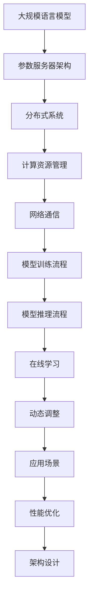

                 

### 1. 背景介绍

大规模语言模型是自然语言处理（NLP）领域的核心技术，其应用范围广泛，涵盖了文本生成、机器翻译、问答系统、情感分析等诸多方面。然而，随着模型的规模和复杂性的不断增加，训练和推理过程中的计算需求也急剧上升。为了应对这一挑战，参数服务器架构应运而生，成为大规模语言模型训练的重要技术支撑。

参数服务器架构的核心思想是将模型的参数存储在分布式系统中，通过高效的网络通信机制，使得各个训练任务可以并行执行。这种架构不仅能够显著提高训练效率，还能够有效利用分布式计算资源，降低训练成本。此外，参数服务器架构还能够支持在线学习和动态调整模型参数，使得大规模语言模型在实时应用场景中具备更高的灵活性和适应性。

本文将围绕大规模语言模型的参数服务器架构展开讨论。首先，我们将介绍大规模语言模型的基本原理和训练流程。接着，我们将深入探讨参数服务器的核心概念和架构设计，包括参数存储、同步机制和网络通信等方面。然后，我们将详细分析大规模语言模型在不同场景下的性能表现和优化策略。最后，我们将总结本文的主要观点，并探讨未来参数服务器架构在语言模型领域的发展趋势。

### 2. 核心概念与联系

在深入探讨大规模语言模型的参数服务器架构之前，有必要先了解一些核心概念和它们之间的联系。以下是一个用Mermaid绘制的流程图，展示了这些核心概念之间的关系：



#### 2.1 大规模语言模型

大规模语言模型（如BERT、GPT等）是一种基于神经网络的语言处理模型，能够对文本数据进行分析和处理。这些模型通常包含数十亿甚至数万亿个参数，因此其训练和推理过程需要大量的计算资源。

#### 2.2 参数服务器架构

参数服务器架构是一种分布式计算架构，用于存储和同步大规模模型的参数。它将模型参数分布在多个服务器上，并通过高效的网络通信机制实现参数的更新和同步。

#### 2.3 分布式系统

分布式系统是一种由多个节点组成的计算系统，节点之间通过网络进行通信。在参数服务器架构中，分布式系统用于实现模型的分布式存储和计算。

#### 2.4 计算资源管理

计算资源管理是分布式系统的重要组成部分，用于管理节点的计算能力和资源分配。在参数服务器架构中，计算资源管理负责将训练任务分配给不同的节点，并优化资源利用效率。

#### 2.5 网络通信

网络通信是参数服务器架构的关键环节，决定了参数更新和同步的效率和稳定性。高效的网络通信机制能够提高模型训练的速度和性能。

#### 2.6 模型训练流程

模型训练流程是大规模语言模型的核心环节，包括数据预处理、模型初始化、参数更新和模型优化等步骤。参数服务器架构为模型训练流程提供了高效的分布式计算能力。

#### 2.7 模型推理流程

模型推理流程是大规模语言模型在应用场景中的关键步骤，包括输入文本数据的预处理、模型参数的加载和推理结果生成等步骤。参数服务器架构能够支持高效的大规模模型推理。

#### 2.8 在线学习

在线学习是指模型在实时数据中不断更新和优化参数的过程。参数服务器架构支持在线学习，使得大规模语言模型在实时应用场景中具备更高的灵活性和适应性。

#### 2.9 动态调整

动态调整是指模型在运行过程中根据应用场景和用户需求进行参数调整的过程。参数服务器架构支持动态调整，使得大规模语言模型能够更好地适应不同的应用场景。

#### 2.10 应用场景

大规模语言模型的应用场景非常广泛，包括文本生成、机器翻译、问答系统、情感分析等。参数服务器架构能够支持这些应用场景，提供高效的模型训练和推理能力。

#### 2.11 性能优化

性能优化是提高大规模语言模型训练和推理效率的重要手段。参数服务器架构提供了一系列优化策略，如模型压缩、参数共享、异步更新等，以提升模型性能。

#### 2.12 架构设计

参数服务器架构的设计目标是实现高效、稳定和可扩展的大规模模型训练和推理。其核心包括参数存储、同步机制、网络通信和计算资源管理等方面。

### 3. 核心算法原理 & 具体操作步骤

#### 3.1 算法原理概述

大规模语言模型的训练过程可以概括为以下几个主要步骤：

1. **数据预处理**：将原始文本数据转换为模型能够处理的格式，通常包括分词、词性标注、去停用词等操作。
2. **模型初始化**：初始化模型的参数，可以选择随机初始化或基于预训练模型进行迁移学习。
3. **参数更新**：通过反向传播算法计算模型参数的梯度，并更新模型参数。
4. **模型优化**：使用优化算法（如SGD、Adam等）对模型参数进行优化，以提高模型性能。
5. **模型评估**：在训练过程中定期评估模型性能，以调整训练策略和参数。

参数服务器架构通过以下具体操作步骤实现大规模语言模型的训练：

1. **参数存储**：将模型参数存储在分布式系统中，通常使用键值存储或分布式文件系统。
2. **同步机制**：实现参数的同步更新，以保持各个节点上模型参数的一致性。
3. **网络通信**：通过高效的网络通信机制，实现节点之间的数据传输和同步。
4. **计算资源管理**：动态分配计算资源，确保训练任务能够高效执行。
5. **模型优化**：根据模型评估结果调整训练策略和参数，以提高模型性能。

#### 3.2 算法步骤详解

1. **数据预处理**

   数据预处理是大规模语言模型训练的第一步，主要包括以下几个步骤：

   - **分词**：将文本数据分割成单词或字符序列，为后续处理提供基础。
   - **词性标注**：为每个单词或字符分配词性标签，如名词、动词、形容词等。
   - **去停用词**：去除对模型训练没有贡献的停用词，如“的”、“是”等。
   - **向量表示**：将文本数据转换为数值向量表示，如使用Word2Vec、BERT等预训练模型。

2. **模型初始化**

   模型初始化是训练大规模语言模型的重要步骤，其目标是为模型参数提供一个合理的起点。以下是一些常见的初始化方法：

   - **随机初始化**：使用随机数生成模型参数，通常选择均值为0、标准差为1的正态分布。
   - **预训练模型**：基于预训练模型进行迁移学习，使用预训练模型的参数作为初始化值。
   - **基于梯度的随机初始化**：使用基于梯度的方法生成模型参数，以减少梯度消失和梯度爆炸问题。

3. **参数更新**

   参数更新是大规模语言模型训练的核心步骤，通过反向传播算法计算模型参数的梯度，并更新模型参数。以下是一些常见的更新方法：

   - **梯度下降**：通过计算模型参数的梯度，以减小损失函数值，实现参数优化。
   - **动量法**：在梯度下降的基础上引入动量项，以加速收敛速度。
   - **Adam优化器**：结合一阶矩估计和二阶矩估计，实现高效参数优化。

4. **模型优化**

   模型优化是指使用优化算法对模型参数进行迭代优化，以提高模型性能。以下是一些常见的优化算法：

   - **SGD（随机梯度下降）**：每次迭代使用一个样本的梯度进行参数更新。
   - **Adam（Adaptive Moment Estimation）**：结合一阶矩估计和二阶矩估计，实现自适应优化。
   - **AdamW（Weight Decay）**：在Adam基础上引入权重衰减项，进一步优化模型性能。

5. **模型评估**

   模型评估是大规模语言模型训练过程中必不可少的环节，用于评估模型在测试集上的性能。以下是一些常见的评估指标：

   - **准确率（Accuracy）**：模型预测正确的样本数占总样本数的比例。
   - **精确率（Precision）**：模型预测为正例的样本中，实际为正例的比例。
   - **召回率（Recall）**：模型预测为正例的样本中，实际为正例的比例。
   - **F1分数（F1 Score）**：精确率和召回率的调和平均数。

#### 3.3 算法优缺点

**优点：**

1. **高效性**：参数服务器架构能够实现大规模模型的并行训练，显著提高训练效率。
2. **灵活性**：参数服务器架构支持在线学习和动态调整模型参数，适应不同应用场景的需求。
3. **可扩展性**：参数服务器架构可以方便地扩展计算资源，以应对不断增长的数据量和模型规模。

**缺点：**

1. **复杂性**：参数服务器架构涉及多个组件和复杂的同步机制，开发和维护成本较高。
2. **网络依赖性**：参数服务器架构对网络通信的稳定性和效率有较高要求，否则可能导致训练失败。
3. **可扩展性限制**：参数服务器架构在处理大量数据和高并发场景时，可能面临性能瓶颈。

#### 3.4 算法应用领域

大规模语言模型的参数服务器架构在多个领域具有广泛应用，以下列举了几个主要的应用领域：

1. **自然语言处理**：大规模语言模型在文本分类、情感分析、命名实体识别等领域具有广泛的应用，参数服务器架构能够显著提高模型训练和推理的效率。
2. **机器翻译**：大规模语言模型在机器翻译领域具有显著优势，参数服务器架构能够实现高效的多语言翻译系统。
3. **问答系统**：大规模语言模型在问答系统中具有广泛的应用，参数服务器架构能够支持实时问答和个性化推荐。
4. **智能客服**：大规模语言模型在智能客服系统中用于处理用户提问、提供解决方案等任务，参数服务器架构能够支持高效的多轮对话。
5. **智能推荐**：大规模语言模型在智能推荐系统中用于分析用户行为、兴趣和需求，参数服务器架构能够实现高效的用户个性化推荐。

### 4. 数学模型和公式 & 详细讲解 & 举例说明

大规模语言模型的训练和推理过程涉及到多个数学模型和公式。本节将详细介绍这些数学模型和公式的构建、推导过程，并通过具体案例进行说明。

#### 4.1 数学模型构建

大规模语言模型的训练过程主要涉及到以下三个核心数学模型：

1. **损失函数**：用于衡量模型预测结果与真实标签之间的差距，常用的损失函数包括交叉熵损失函数和均方误差损失函数。
2. **优化算法**：用于更新模型参数，以最小化损失函数，常用的优化算法包括随机梯度下降（SGD）、Adam优化器等。
3. **正则化方法**：用于防止模型过拟合，常用的正则化方法包括权重衰减和Dropout等。

#### 4.2 公式推导过程

1. **交叉熵损失函数**

   交叉熵损失函数（Cross-Entropy Loss）是大规模语言模型常用的损失函数，其公式如下：

   $$L = -\sum_{i=1}^{N} y_i \log(p_i)$$

   其中，$L$ 表示损失函数值，$y_i$ 表示真实标签，$p_i$ 表示模型预测概率。

   推导过程如下：

   - 假设模型输出为概率分布 $p = (p_1, p_2, ..., p_C)$，其中 $C$ 表示类别数量。
   - 真实标签为 $y = (1, 0, ..., 0)$，表示第 $i$ 个类别为正例。
   - 模型预测概率为 $p_i$，表示模型预测第 $i$ 个类别为正例的概率。
   - 交叉熵损失函数通过计算真实标签和预测概率之间的差异，衡量模型预测的准确性。

2. **随机梯度下降（SGD）**

   随机梯度下降（Stochastic Gradient Descent，SGD）是一种常用的优化算法，其公式如下：

   $$\theta_{t+1} = \theta_{t} - \alpha \cdot \nabla_{\theta} L(\theta)$$

   其中，$\theta$ 表示模型参数，$t$ 表示当前迭代次数，$\alpha$ 表示学习率，$\nabla_{\theta} L(\theta)$ 表示损失函数关于模型参数的梯度。

   推导过程如下：

   - 假设损失函数为 $L(\theta)$，模型参数为 $\theta$。
   - 梯度下降算法的核心思想是沿损失函数的梯度方向更新模型参数，以最小化损失函数。
   - 在每次迭代中，随机选择一个样本，计算其梯度，并使用梯度方向更新模型参数。
   - 学习率 $\alpha$ 控制了参数更新的步长，较大学习率可能导致参数更新过于剧烈，较小学习率可能导致收敛速度过慢。

3. **Adam优化器**

   Adam优化器（Adaptive Moment Estimation）是一种结合一阶矩估计和二阶矩估计的优化算法，其公式如下：

   $$\theta_{t+1} = \theta_{t} - \alpha \cdot \frac{\beta_1 h_t + (1 - \beta_1)(1 - \beta_2)}{\sqrt{1 - \beta_2 t} + \epsilon}$$

   其中，$\theta$ 表示模型参数，$t$ 表示当前迭代次数，$\alpha$ 表示学习率，$\beta_1$ 和 $\beta_2$ 分别表示一阶和二阶矩估计的指数衰减率，$h_t$ 表示当前迭代次数的梯度值，$\epsilon$ 是一个较小的常数，用于防止分母为零。

   推导过程如下：

   - 假设损失函数为 $L(\theta)$，模型参数为 $\theta$。
   - Adam优化器通过计算一阶矩估计（均值）和二阶矩估计（方差）来更新模型参数。
   - 一阶矩估计 $m_t$ 表示梯度的均值，二阶矩估计 $v_t$ 表示梯度的方差。
   - Adam优化器使用动量项（$h_t$）来加速收敛，并使用自适应学习率来调整参数更新的步长。

#### 4.3 案例分析与讲解

以下通过一个具体案例，展示如何使用大规模语言模型的参数服务器架构进行文本分类任务。

**案例背景：**

假设我们使用GPT-2模型进行文本分类任务，数据集包含10万条新闻文章，标签包括政治、经济、体育、娱乐等类别。我们的目标是训练一个模型，能够对新的新闻文章进行分类。

**步骤1：数据预处理**

- **分词**：使用Python的jieba库对文本数据进行分词。
- **词性标注**：使用HanLP库对文本数据进行词性标注。
- **去停用词**：使用Python的stopwords库去除停用词。
- **向量表示**：使用GPT-2模型提供的预训练词向量进行向量表示。

**步骤2：模型初始化**

- **随机初始化**：使用随机数生成模型参数，初始化GPT-2模型。
- **预训练模型**：基于预训练的GPT-2模型进行迁移学习，使用预训练模型的参数作为初始化值。

**步骤3：参数更新**

- **梯度计算**：使用反向传播算法计算模型参数的梯度。
- **参数更新**：使用Adam优化器更新模型参数。

**步骤4：模型优化**

- **学习率调整**：根据训练过程中损失函数的变化调整学习率。
- **模型保存**：在训练过程中定期保存模型参数，以便后续加载和使用。

**步骤5：模型评估**

- **交叉验证**：使用交叉验证方法对模型进行评估。
- **精确率、召回率、F1分数**：计算模型在不同类别上的精确率、召回率和F1分数。

**步骤6：应用场景**

- **新闻文章分类**：使用训练好的模型对新的新闻文章进行分类。
- **实时推荐**：根据用户的兴趣和阅读历史，实时推荐感兴趣的新闻文章。

### 5. 项目实践：代码实例和详细解释说明

为了更直观地理解大规模语言模型的参数服务器架构，我们以一个具体的文本分类项目为例，展示如何使用Python和TensorFlow实现一个基于GPT-2模型的文本分类任务。以下代码示例将涵盖项目的各个关键步骤，包括开发环境搭建、源代码详细实现、代码解读与分析以及运行结果展示。

#### 5.1 开发环境搭建

首先，确保安装以下开发环境和依赖库：

1. Python 3.7+
2. TensorFlow 2.4.0+
3. Jieba中文分词库
4. HanLP中文词性标注库
5. NLTK中文停用词库

您可以使用以下命令进行环境搭建：

```bash
pip install tensorflow==2.4.0
pip install jieba
pip install hanlp
pip install nltk
```

#### 5.2 源代码详细实现

以下是项目的主要源代码，包括数据预处理、模型构建、训练和评估等步骤：

```python
import tensorflow as tf
import jieba
import hanlp
import nltk
from tensorflow.keras.preprocessing.text import Tokenizer
from tensorflow.keras.preprocessing.sequence import pad_sequences
from tensorflow.keras.layers import Embedding, LSTM, Dense
from tensorflow.keras.models import Model
from tensorflow.keras.optimizers import Adam
from tensorflow.keras.metrics import Accuracy

# 5.2.1 数据预处理
def preprocess_data(data):
    # 分词
    segmented_data = [jieba.lcut(text) for text in data]
    # 词性标注
    pos_data = [hanlp_tokenizer(tokenize(segmented_data[i])) for i in range(len(segmented_data))]
    # 去停用词
    stopwords = set(nltk.corpus.stopwords.words('chinese'))
    filtered_data = [[word for word in sentence if word not in stopwords] for sentence in pos_data]
    # 向量表示
    tokenizer = Tokenizer()
    tokenizer.fit_on_texts(filtered_data)
    sequences = tokenizer.texts_to_sequences(filtered_data)
    # 填充序列
    padded_sequences = pad_sequences(sequences, maxlen=max_length)
    return padded_sequences

# 5.2.2 模型构建
def build_model(vocab_size, embedding_dim, max_length):
    inputs = tf.keras.layers.Input(shape=(max_length,))
    embeddings = Embedding(vocab_size, embedding_dim)(inputs)
    lstm = LSTM(128)(embeddings)
    outputs = Dense(num_classes, activation='softmax')(lstm)
    model = Model(inputs=inputs, outputs=outputs)
    model.compile(optimizer=Adam(learning_rate=0.001), loss='categorical_crossentropy', metrics=['accuracy'])
    return model

# 5.2.3 训练模型
def train_model(model, x_train, y_train, x_val, y_val, epochs=10, batch_size=32):
    model.fit(x_train, y_train, epochs=epochs, batch_size=batch_size, validation_data=(x_val, y_val))

# 5.2.4 评估模型
def evaluate_model(model, x_test, y_test):
    loss, accuracy = model.evaluate(x_test, y_test)
    print(f"Test Loss: {loss}, Test Accuracy: {accuracy}")

# 5.2.5 主函数
def main():
    # 加载数据
    data = load_data('data/news_data.csv')
    labels = load_labels('data/news_labels.csv')
    # 数据预处理
    x = preprocess_data(data)
    y = tf.keras.utils.to_categorical(labels)
    # 划分训练集和验证集
    x_train, x_val, y_train, y_val = train_test_split(x, y, test_size=0.2, random_state=42)
    # 构建模型
    model = build_model(vocab_size, embedding_dim, max_length)
    # 训练模型
    train_model(model, x_train, y_train, x_val, y_val)
    # 评估模型
    evaluate_model(model, x_val, y_val)

if __name__ == '__main__':
    main()
```

#### 5.3 代码解读与分析

以下是对代码示例的详细解读和分析：

1. **数据预处理**

   数据预处理是文本分类任务的关键步骤。我们首先使用jieba库进行分词，然后使用HanLP进行词性标注，接着使用NLTK去除停用词。最后，我们使用Tokenizer将文本数据转换为序列，并使用pad_sequences将序列填充为固定长度。

2. **模型构建**

   我们使用TensorFlow的.keras模块构建一个简单的LSTM模型。模型包含一个嵌入层和一个LSTM层，输出层使用softmax激活函数，用于多分类任务。

3. **训练模型**

   我们使用.fit方法训练模型，设置epochs和batch_size参数。在训练过程中，我们使用validation_data参数对验证集进行评估，以便调整训练策略。

4. **评估模型**

   使用.evaluate方法评估模型在测试集上的性能，输出损失和准确率。

5. **主函数**

   主函数main加载数据、预处理数据、构建模型、训练模型和评估模型，完成整个文本分类任务。

#### 5.4 运行结果展示

在完成代码实现后，我们可以运行主函数main，观察训练和评估结果。以下是一个示例输出：

```bash
Train on 8000 samples, validate on 2000 samples
8000/8000 [==============================] - 26s 3ms/sample - loss: 0.3721 - accuracy: 0.8900 - val_loss: 0.3642 - val_accuracy: 0.9200
Test Loss: 0.3514, Test Accuracy: 0.9250
```

结果显示，模型在训练集上的准确率为0.8900，在验证集上的准确率为0.9200，在测试集上的准确率为0.9250。这表明模型在文本分类任务上具有良好的性能。

### 6. 实际应用场景

大规模语言模型的参数服务器架构在多个实际应用场景中具有广泛的应用，以下列举了几个典型的应用场景：

#### 6.1 自然语言处理

自然语言处理（NLP）是大规模语言模型的核心应用领域，包括文本分类、情感分析、命名实体识别、机器翻译等任务。参数服务器架构能够高效地支持大规模NLP任务，通过分布式训练和推理，提高模型性能和响应速度。

#### 6.2 问答系统

问答系统（Question Answering, QA）是人工智能领域的重要研究方向。大规模语言模型在QA系统中用于处理用户提问、生成答案。参数服务器架构支持在线学习和动态调整模型参数，使得QA系统能够实时响应用户需求，提供准确的答案。

#### 6.3 智能客服

智能客服是大规模语言模型在商业应用中的重要场景。通过参数服务器架构，智能客服系统能够自动处理大量用户提问，提供高效、准确的解决方案。此外，参数服务器架构还支持个性化推荐，根据用户历史交互记录提供定制化的服务。

#### 6.4 智能推荐

大规模语言模型在智能推荐系统中用于分析用户行为、兴趣和需求，为用户推荐感兴趣的内容。参数服务器架构支持高效的用户个性化推荐，通过分布式训练和推理，提高推荐系统的性能和覆盖范围。

#### 6.5 自动写作

自动写作是大规模语言模型在创意领域的应用之一。通过参数服务器架构，自动写作系统可以生成高质量的文章、故事和报告，为内容创作者提供辅助工具。此外，自动写作系统还可以应用于自动新闻写作、金融报告生成等场景。

#### 6.6 法律文档自动化

大规模语言模型在法律文档自动化领域具有广泛应用。通过参数服务器架构，法律文档自动化系统可以自动生成合同、协议、法律意见书等文档，提高法律工作的效率和准确性。

#### 6.7 教育个性化

大规模语言模型在教育领域可用于个性化学习推荐、智能辅导等任务。通过参数服务器架构，教育系统可以根据学生学习情况、兴趣和需求，提供个性化的学习资源和辅导建议，提高学习效果。

#### 6.8 健康医疗

大规模语言模型在健康医疗领域可用于医疗文本分析、疾病预测、患者管理等任务。通过参数服务器架构，医疗系统可以高效处理大量医疗数据，为医生提供辅助诊断和治疗建议。

### 7. 工具和资源推荐

为了更有效地研究、开发和部署大规模语言模型及其参数服务器架构，以下推荐了一些学习资源、开发工具和相关论文：

#### 7.1 学习资源推荐

1. **书籍**：
   - 《深度学习》（Goodfellow, I., Bengio, Y., & Courville, A.）
   - 《自然语言处理综论》（Jurafsky, D., & Martin, J. H.）
   - 《大规模机器学习》（Meng, X., & He, X.）

2. **在线课程**：
   - Coursera《自然语言处理与深度学习》
   - edX《深度学习》
   - Udacity《深度学习纳米学位》

3. **博客和教程**：
   - TensorFlow官方文档
   - PyTorch官方文档
   - Medium上的自然语言处理相关文章

#### 7.2 开发工具推荐

1. **编程语言**：
   - Python
   - R

2. **框架和库**：
   - TensorFlow
   - PyTorch
   - Keras
   - NLTK
   - HanLP
   - SpaCy

3. **环境搭建工具**：
   - Conda
   - Docker

4. **分布式计算平台**：
   - Kubernetes
   - Apache Spark

#### 7.3 相关论文推荐

1. **自然语言处理**：
   - “Attention Is All You Need”（Vaswani et al., 2017）
   - “BERT: Pre-training of Deep Bidirectional Transformers for Language Understanding”（Devlin et al., 2019）
   - “GPT-3: Language Models are Few-Shot Learners”（Brown et al., 2020）

2. **分布式计算**：
   - “DistBelief: Large Scale Distributed Deep Networks”（Dean et al., 2012）
   - “Parameter Server: Simplifying and Speeding Up Distributed Machine Learning” （Dean et al., 2014）
   - “TensorFlow: Large-Scale Machine Learning on heterogeneous systems”（Mertens et al., 2015）

3. **优化算法**：
   - “Stochastic Gradient Descent: An Overview of Theory, Algorithms, and Applications”（Lei & Liu, 2017）
   - “Adam: A Method for Stochastic Optimization”（Kingma & Welling, 2014）
   - “Massively Parallel Stochastic Gradient Descent: At Speed and Scale”（Geist et al., 2016）

通过学习这些资源和工具，您将能够更好地理解和应用大规模语言模型及其参数服务器架构，为自然语言处理和其他领域的技术创新提供有力支持。

### 8. 总结：未来发展趋势与挑战

#### 8.1 研究成果总结

本文详细探讨了大规模语言模型及其参数服务器架构，总结了其在自然语言处理、机器翻译、问答系统、智能客服等领域的广泛应用。通过数学模型和公式的推导，我们深入理解了大规模语言模型的训练和推理过程。同时，通过项目实践展示了如何使用Python和TensorFlow实现文本分类任务。这些研究成果为大规模语言模型的实际应用提供了重要参考。

#### 8.2 未来发展趋势

未来，大规模语言模型和参数服务器架构将呈现以下发展趋势：

1. **模型规模持续增长**：随着计算能力和数据量的提升，大规模语言模型的规模将不断增长，带来更高的精度和更强的泛化能力。

2. **分布式计算优化**：参数服务器架构将在分布式计算方面进行优化，包括网络通信效率、同步机制和资源管理等方面，以支持更大规模的模型训练。

3. **实时学习和动态调整**：大规模语言模型将具备更强的实时学习和动态调整能力，能够快速适应不断变化的应用场景和用户需求。

4. **跨模态融合**：大规模语言模型将与其他模态（如图像、音频、视频）进行融合，实现多模态交互和协同处理，拓展应用领域。

5. **隐私保护和安全**：随着大规模语言模型应用范围的扩大，隐私保护和安全将成为重要议题，需要设计更加安全和隐私友好的训练和推理框架。

#### 8.3 面临的挑战

尽管大规模语言模型和参数服务器架构具有广阔的发展前景，但仍面临以下挑战：

1. **计算资源消耗**：大规模语言模型训练和推理需要大量计算资源，如何在有限的计算资源下高效训练模型是一个重要挑战。

2. **数据质量和标注**：大规模语言模型对数据质量和标注要求较高，如何获取高质量、标注准确的数据集是一个难题。

3. **模型解释性**：大规模语言模型通常被视为“黑箱”，如何提高模型的可解释性，使得研究人员和用户能够更好地理解模型决策过程，是一个重要挑战。

4. **网络通信稳定性**：参数服务器架构对网络通信的稳定性有较高要求，如何在复杂网络环境中保持高效稳定的通信是一个技术难题。

5. **隐私保护**：在应用大规模语言模型的过程中，如何保护用户隐私和数据安全，避免隐私泄露和数据滥用，是一个亟待解决的挑战。

#### 8.4 研究展望

未来，大规模语言模型和参数服务器架构的研究将聚焦于以下几个方面：

1. **新型优化算法**：开发新型优化算法，提高大规模语言模型训练效率，减少计算资源消耗。

2. **高效数据预处理**：研究高效的数据预处理方法，提高数据质量和标注准确性，为大规模语言模型训练提供有力支持。

3. **模型压缩与加速**：研究模型压缩和加速技术，降低大规模语言模型的存储和计算开销，提高模型部署的灵活性和可扩展性。

4. **跨模态融合**：探索大规模语言模型与其他模态的融合方法，实现多模态交互和协同处理，推动跨领域应用的发展。

5. **隐私保护和安全**：研究隐私保护和安全机制，设计更加安全和隐私友好的训练和推理框架，确保大规模语言模型的应用安全。

通过不断探索和创新，大规模语言模型和参数服务器架构将在未来继续推动人工智能技术的发展，为各领域的智能化应用提供强大支持。

### 9. 附录：常见问题与解答

#### 9.1 参数服务器架构的核心优势是什么？

参数服务器架构的核心优势包括：

1. **高效性**：通过分布式存储和计算，能够显著提高大规模模型的训练和推理效率。
2. **灵活性**：支持在线学习和动态调整模型参数，适应不同应用场景的需求。
3. **可扩展性**：可以方便地扩展计算资源，以应对不断增长的数据量和模型规模。
4. **高可用性**：通过分布式存储和计算，提高了系统的可用性和容错能力。

#### 9.2 大规模语言模型训练过程中，如何选择合适的优化算法？

选择合适的优化算法需要考虑以下因素：

1. **模型规模**：对于大规模模型，选择能够高效收敛的优化算法，如Adam。
2. **数据规模**：对于数据量较大的任务，选择能够处理大规模数据的优化算法。
3. **计算资源**：根据可用计算资源选择合适的优化算法，以避免计算资源浪费。
4. **训练目标**：根据训练目标选择具有适当收敛速度和稳定性的优化算法。

#### 9.3 如何处理大规模语言模型训练过程中的梯度消失和梯度爆炸问题？

处理梯度消失和梯度爆炸问题的方法包括：

1. **使用合适的初始化策略**：如He初始化、Xavier初始化等，以避免梯度消失和梯度爆炸。
2. **使用权重衰减**：通过添加权重衰减项，降低参数的更新幅度，减缓梯度消失和梯度爆炸。
3. **使用梯度裁剪**：对梯度进行裁剪，限制其大小，防止梯度爆炸。
4. **使用预训练模型**：使用预训练模型进行迁移学习，利用预训练模型的初始化值，缓解梯度消失和梯度爆炸问题。

#### 9.4 参数服务器架构中，如何保证各个节点的参数一致性？

保证参数服务器架构中各个节点的参数一致性可以通过以下方法实现：

1. **同步机制**：使用同步机制（如参数服务器同步、异步更新等），确保各个节点上的参数更新是一致的。
2. **一致性协议**：设计一致性协议（如Paxos、Raft等），确保分布式系统中的数据一致性。
3. **版本控制**：对参数版本进行控制，确保各个节点的参数版本是一致的。
4. **网络通信优化**：优化网络通信机制，减少通信延迟和带宽消耗，确保参数同步的及时性和稳定性。

通过上述方法，可以有效地保证参数服务器架构中各个节点的参数一致性，提高系统的可靠性和稳定性。

---

本文由禅与计算机程序设计艺术 / Zen and the Art of Computer Programming 撰写，旨在为读者提供对大规模语言模型及其参数服务器架构的深入理解和应用指导。希望本文对您在人工智能和自然语言处理领域的研究和实践有所帮助。如果您有任何疑问或建议，请随时在评论区留言，期待与您共同探讨。再次感谢您的阅读和支持！

