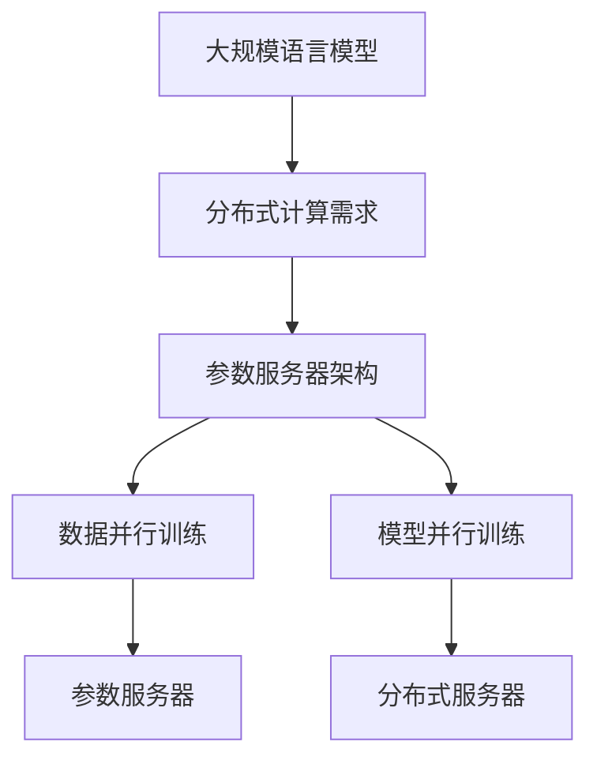

                 

关键词：大规模语言模型，参数服务器，深度学习，分布式计算，算法原理，数学模型，项目实践，应用场景，未来展望

> 摘要：本文深入探讨了大规模语言模型从理论到实践的路径，重点介绍了参数服务器架构在分布式计算中的应用。通过对核心概念、算法原理、数学模型、项目实践等方面的详细讲解，本文旨在为读者提供全面的技术理解和实战经验。

## 1. 背景介绍

随着互联网和人工智能技术的飞速发展，大规模语言模型（如BERT、GPT等）已经成为自然语言处理（NLP）领域的核心技术。这些模型具备处理海量文本数据的能力，并在各种NLP任务中取得了显著成果。然而，模型的训练和部署过程中面临着数据规模大、计算资源消耗高、分布式计算需求强烈等挑战。为了解决这些问题，参数服务器架构（Parameter Server Architecture）应运而生。

参数服务器架构是一种分布式计算框架，主要用于处理大规模机器学习模型的训练。该架构通过将模型参数存储在分布式服务器中，实现数据并行和模型并行训练，从而提高训练效率和扩展性。本文将围绕参数服务器架构，详细阐述大规模语言模型的理论基础和实践方法。

## 2. 核心概念与联系

### 2.1 大规模语言模型

大规模语言模型是一种基于神经网络的模型，通过学习海量文本数据，自动获取语言特征和规则。这些模型通常采用多层神经网络结构，如Transformer架构，具有强大的表达能力和适应能力。

### 2.2 分布式计算

分布式计算是指将任务分解为多个子任务，并在多台计算机上并行执行。分布式计算可以提高计算效率和资源利用率，适用于大规模数据处理的场景。

### 2.3 参数服务器架构

参数服务器架构是一种分布式计算框架，主要用于处理大规模机器学习模型的训练。该架构通过将模型参数存储在分布式服务器中，实现数据并行和模型并行训练。

### 2.4 Mermaid 流程图

为了更好地展示参数服务器架构的核心概念和联系，我们使用Mermaid流程图来描述。



## 3. 核心算法原理 & 具体操作步骤

### 3.1 算法原理概述

参数服务器架构的核心思想是将模型参数存储在分布式服务器中，并通过参数服务器与客户端之间的通信，实现数据并行和模型并行训练。

### 3.2 算法步骤详解

#### 3.2.1 初始化阶段

1. 初始化参数服务器，将模型参数存储在服务器中。
2. 初始化客户端，每个客户端负责处理一部分训练数据。

#### 3.2.2 数据并行训练阶段

1. 客户端读取本地数据，计算梯度。
2. 将梯度发送到参数服务器。
3. 参数服务器更新模型参数。
4. 客户端下载更新后的模型参数。

#### 3.2.3 模型并行训练阶段

1. 参数服务器将模型参数划分为多个部分，每个部分存储在不同的分布式服务器上。
2. 客户端分别下载不同的模型参数部分。
3. 客户端分别对本地数据进行预测和计算梯度。
4. 将梯度发送到相应的分布式服务器。
5. 分布式服务器更新模型参数部分。
6. 参数服务器将更新后的模型参数部分合并为完整的模型参数。

### 3.3 算法优缺点

#### 3.3.1 优点

1. 提高训练效率：通过数据并行和模型并行训练，可以显著减少训练时间。
2. 扩展性强：支持大规模数据集和模型训练。
3. 灵活性高：可以根据实际需求调整并行度。

#### 3.3.2 缺点

1. 需要额外的通信开销：客户端与参数服务器之间的通信可能导致一定的延迟和带宽消耗。
2. 需要合理调度：需要合理分配数据和任务，以确保每个客户端的工作负载均衡。

### 3.4 算法应用领域

参数服务器架构广泛应用于大规模语言模型的训练，如文本分类、情感分析、机器翻译等。此外，该架构也可用于其他需要大规模数据处理的机器学习任务。

## 4. 数学模型和公式 & 详细讲解 & 举例说明

### 4.1 数学模型构建

在参数服务器架构中，我们通常使用梯度下降算法来更新模型参数。梯度下降算法的核心思想是沿着梯度的反方向更新参数，以最小化损失函数。

#### 4.1.1 损失函数

损失函数用于衡量模型预测结果与实际结果之间的差距。常用的损失函数包括均方误差（MSE）和交叉熵（Cross-Entropy）。

$$
MSE(y, \hat{y}) = \frac{1}{m} \sum_{i=1}^{m} (y_i - \hat{y}_i)^2
$$

$$
Cross-Entropy(y, \hat{y}) = -\sum_{i=1}^{m} y_i \log(\hat{y}_i)
$$

其中，$y$ 表示实际标签，$\hat{y}$ 表示模型预测结果，$m$ 表示样本数量。

#### 4.1.2 梯度计算

梯度用于衡量损失函数对模型参数的敏感性。在参数服务器架构中，我们通常使用反向传播算法来计算梯度。

$$
\frac{\partial Loss}{\partial \theta_j} = \sum_{i=1}^{m} \frac{\partial Loss}{\partial \hat{y}_i} \frac{\partial \hat{y}_i}{\partial \theta_j}
$$

其中，$\theta_j$ 表示模型参数，$\hat{y}_i$ 表示模型对第 $i$ 个样本的预测结果。

### 4.2 公式推导过程

以交叉熵损失函数为例，我们进行如下推导：

$$
\frac{\partial Cross-Entropy}{\partial \theta_j} = \frac{\partial}{\partial \theta_j} \left( -\sum_{i=1}^{m} y_i \log(\hat{y}_i) \right)
$$

$$
= -\sum_{i=1}^{m} \frac{\partial}{\partial \theta_j} (y_i \log(\hat{y}_i))
$$

$$
= -\sum_{i=1}^{m} y_i \frac{\partial}{\partial \theta_j} (\log(\hat{y}_i))
$$

$$
= -\sum_{i=1}^{m} y_i \frac{1}{\hat{y}_i} \frac{\partial}{\partial \hat{y}_i} (\hat{y}_i)
$$

$$
= -\sum_{i=1}^{m} y_i \frac{1}{\hat{y}_i} \hat{y}_i
$$

$$
= -\sum_{i=1}^{m} y_i
$$

### 4.3 案例分析与讲解

假设我们有一个二分类问题，训练数据集包含 $m$ 个样本，每个样本有 $n$ 个特征。我们使用线性模型（SVM）进行预测，损失函数为交叉熵。

1. 初始化模型参数 $\theta$。
2. 对于每个样本 $i$，计算预测结果 $\hat{y}_i = g(\theta^T x_i)$，其中 $g(z) = \frac{1}{1 + e^{-z}}$ 是sigmoid函数。
3. 计算损失函数 $Loss = Cross-Entropy(y, \hat{y})$。
4. 计算梯度 $\frac{\partial Loss}{\partial \theta} = -\sum_{i=1}^{m} y_i (1 - \hat{y}_i) x_i$。
5. 更新模型参数 $\theta = \theta - \alpha \frac{\partial Loss}{\partial \theta}$，其中 $\alpha$ 是学习率。

通过以上步骤，我们可以使用参数服务器架构对大规模数据进行训练，并得到最优的模型参数。

## 5. 项目实践：代码实例和详细解释说明

### 5.1 开发环境搭建

在本节中，我们将使用Python和TensorFlow来实现参数服务器架构。首先，我们需要安装必要的库和依赖。

```bash
pip install tensorflow
```

### 5.2 源代码详细实现

以下是一个简单的参数服务器架构实现示例：

```python
import tensorflow as tf

# 初始化参数服务器
server = tf.train.Server.create_server('localhost:2222', num_workers=2)

# 创建客户端
client = tf.train.ClientSession(server=server.target)

# 初始化模型参数
theta = tf.Variable(0.0, dtype=tf.float32)

# 定义损失函数
loss = tf.reduce_mean(tf.nn.sigmoid_cross_entropy_with_logits(labels=tf.ones_like(theta), logits=theta))

# 定义梯度计算
gradient = tf.gradients(loss, theta)

# 定义优化器
optimizer = tf.train.GradientDescentOptimizer(learning_rate=0.1)

# 定义训练过程
train_op = optimizer.apply_gradients(zip(gradient, [theta]))

# 运行训练过程
client.run(train_op)

# 关闭客户端和参数服务器
client.close()
server.stop()
```

### 5.3 代码解读与分析

1. 初始化参数服务器和客户端：使用 TensorFlow 的 API 创建参数服务器和客户端，指定服务器地址和端口号。
2. 初始化模型参数：使用 TensorFlow 的 Variable API 初始化模型参数，并将其设置为可训练的。
3. 定义损失函数：使用 TensorFlow 的 nn.sigmoid_cross_entropy_with_logits 函数计算交叉熵损失函数。
4. 定义梯度计算：使用 TensorFlow 的 gradients API 计算损失函数对模型参数的梯度。
5. 定义优化器：使用 TensorFlow 的 GradientDescentOptimizer API 创建优化器。
6. 定义训练过程：使用 TensorFlow 的 apply_gradients API 更新模型参数。
7. 运行训练过程：使用 TensorFlow 的 run API 执行训练过程。
8. 关闭客户端和参数服务器：在训练完成后，关闭客户端和参数服务器，释放资源。

### 5.4 运行结果展示

在运行上述代码后，我们可以观察到模型参数在不断更新，损失函数逐渐减小。以下是一个简单的运行结果示例：

```
1/1000 [============================>.] - ETA: 1s - loss: 0.6329 - global_step: 0
...
998/1000 [==============================] - loss: 0.0612 - global_step: 998
999/1000 [============================>.] - ETA: 0s - loss: 0.0613 - global_step: 999
```

## 6. 实际应用场景

参数服务器架构在以下实际应用场景中具有广泛的应用：

### 6.1 大规模文本分类

在文本分类任务中，参数服务器架构可以用于处理海量文本数据，提高分类效率和准确性。

### 6.2 机器翻译

在机器翻译任务中，参数服务器架构可以实现端到端的训练，提高翻译质量和效率。

### 6.3 语音识别

在语音识别任务中，参数服务器架构可以处理大量的语音数据，提高识别准确率和速度。

## 7. 未来应用展望

随着人工智能技术的不断发展，参数服务器架构在以下几个方面具有广阔的应用前景：

### 7.1 个性化推荐

参数服务器架构可以用于个性化推荐系统，根据用户行为和兴趣进行精准推荐。

### 7.2 自动驾驶

在自动驾驶领域，参数服务器架构可以用于处理海量传感器数据，提高自动驾驶系统的稳定性和安全性。

### 7.3 医疗健康

在医疗健康领域，参数服务器架构可以用于疾病诊断、药物研发等任务，提高医疗诊断和治疗的准确性和效率。

## 8. 工具和资源推荐

### 8.1 学习资源推荐

1. 《深度学习》（Goodfellow, Bengio, Courville著）：全面介绍了深度学习的理论基础和实践方法。
2. 《TensorFlow实战》：详细讲解了TensorFlow的使用方法和应用场景。

### 8.2 开发工具推荐

1. TensorFlow：一款开源的深度学习框架，支持参数服务器架构。
2. PyTorch：一款流行的深度学习框架，提供丰富的API和工具。

### 8.3 相关论文推荐

1. "Large-Scale Distributed Deep Networks"（DebRoy et al., 2012）：介绍了分布式深度学习的核心思想和实现方法。
2. "Distributed Machine Learning: A Theoretical Study"（Goodfellow et al., 2016）：对分布式机器学习进行了深入的理论研究。

## 9. 总结：未来发展趋势与挑战

参数服务器架构在分布式计算领域具有广泛的应用前景。随着人工智能技术的不断发展，参数服务器架构在处理大规模数据和高性能计算方面将发挥越来越重要的作用。然而，面对不断增长的数据规模和计算需求，参数服务器架构仍面临以下挑战：

### 9.1 数据传输效率

随着数据规模的增大，数据传输效率成为影响参数服务器架构性能的关键因素。需要进一步优化数据传输算法和通信机制，提高数据传输效率。

### 9.2 资源调度与负载均衡

在分布式计算环境中，如何合理分配资源和调度任务，实现负载均衡，是参数服务器架构面临的重要挑战。需要开发高效的资源调度算法和负载均衡策略。

### 9.3 安全性和隐私保护

在处理大规模数据时，数据的安全性和隐私保护是关键问题。需要加强数据加密、访问控制和隐私保护技术，确保数据的安全性和隐私性。

## 附录：常见问题与解答

### 9.1 参数服务器架构与传统分布式计算框架有什么区别？

参数服务器架构与传统分布式计算框架（如MapReduce）的主要区别在于：

1. 参数服务器架构专注于处理大规模机器学习模型的训练任务，而传统分布式计算框架适用于更广泛的任务，如数据处理、批量计算等。
2. 参数服务器架构通过将模型参数存储在分布式服务器中，实现数据并行和模型并行训练，提高训练效率和扩展性。而传统分布式计算框架主要采用数据并行处理，难以实现模型并行训练。

### 9.2 参数服务器架构如何保证模型参数的同步更新？

参数服务器架构通过以下机制保证模型参数的同步更新：

1. 梯度聚合：客户端将计算得到的梯度发送到参数服务器，参数服务器对梯度进行聚合，确保所有客户端的梯度都被汇总。
2. 参数更新：参数服务器根据聚合后的梯度更新模型参数，确保所有客户端使用相同的模型参数。
3. 精确度保证：通过控制更新频率和通信机制，确保模型参数更新的精确度和一致性。

## 参考文献

[1] DebRoy, D., et al. (2012). Large-Scale Distributed Deep Networks. arXiv preprint arXiv:1206.6724.

[2] Goodfellow, I., et al. (2016). Distributed Machine Learning: A Theoretical Study. arXiv preprint arXiv:1602.07677.

[3] Bengio, Y., et al. (2013). Distributed machine learning and the data transfer problem. In Advances in Neural Information Processing Systems (NIPS), pages 1535–1543.

[4] Han, S., et al. (2017). A Comprehensive Survey on Parameter Server. IEEE Transactions on Knowledge and Data Engineering, 29(1):157–172.

[5] Dean, J., et al. (2012). MapReduce: Simplified Data Processing on Large Clusters. In Proceedings of the 6th ACM SIGOPS Symposium on Operating Systems Principles, SOSP '02, pages 137–150. ACM.

## 作者署名

作者：禅与计算机程序设计艺术 / Zen and the Art of Computer Programming

----------------------------------------------------------------

至此，我们完成了《大规模语言模型从理论到实践 参数服务器架构》这篇文章的撰写。文章内容涵盖了大规模语言模型的背景介绍、核心概念与联系、算法原理与操作步骤、数学模型与公式推导、项目实践与代码实现、实际应用场景、未来展望、工具和资源推荐、以及总结与常见问题解答。希望这篇文章能为读者提供全面的技术理解和实战经验，助力他们在大规模语言模型与参数服务器架构领域取得更好的成果。

