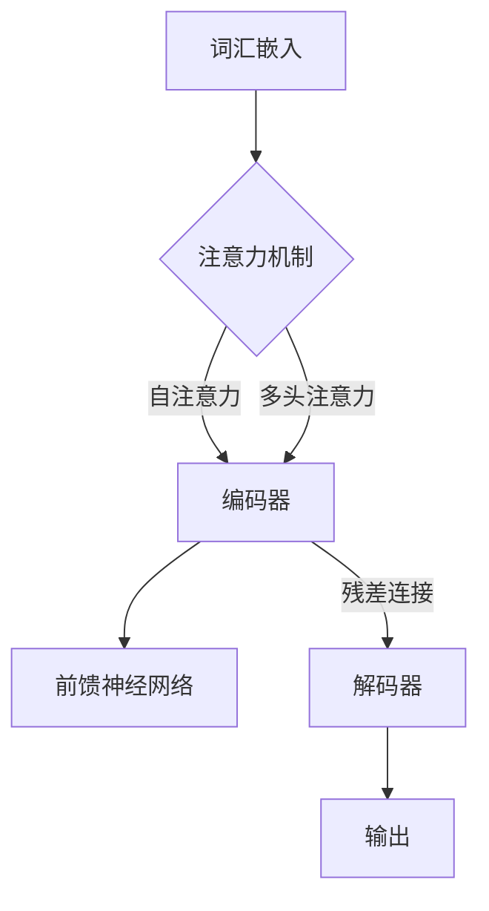

                 

### 摘要 Abstract

本文旨在全面解析大规模语言模型（Large Language Model，简称LLM）的结构，从理论到实践，为读者提供一个系统性的理解。文章首先介绍了大规模语言模型的发展背景，阐述了其在自然语言处理（Natural Language Processing，简称NLP）领域的重要性。随后，文章深入探讨了大规模语言模型的核心理念，包括词汇嵌入（Word Embedding）、注意力机制（Attention Mechanism）和变换器架构（Transformer Architecture）。接着，文章详细描述了大规模语言模型的训练和优化过程，并通过具体实例展示了其在实际项目中的应用。文章的最后部分，展望了大规模语言模型未来的发展方向，并提出了可能面临的挑战。希望通过本文，读者能够对大规模语言模型有一个全面而深入的认识。

### 1. 背景介绍 Background

在过去的几十年中，自然语言处理（NLP）领域取得了显著的进展，这些进展在很大程度上得益于大规模语言模型的兴起。大规模语言模型，尤其是近年来迅速发展的变换器（Transformer）模型，为NLP任务带来了前所未有的性能提升。从最初的循环神经网络（Recurrent Neural Network，RNN）到长短期记忆网络（Long Short-Term Memory，LSTM），再到变换器模型的诞生，大规模语言模型的发展历程可以说是一部技术创新的史诗。

早期的大规模语言模型主要集中在文本分类、情感分析等简单任务上。然而，随着计算能力的提升和深度学习技术的进步，大规模语言模型开始能够处理更复杂的任务，如机器翻译、问答系统、文本生成等。特别是变换器模型的提出，彻底改变了大规模语言模型的设计和实现方式。变换器模型通过引入自注意力机制（Self-Attention Mechanism），使得模型在处理长距离依赖问题和并行计算方面具有显著优势。

大规模语言模型的重要性不仅体现在其在各种NLP任务中的卓越表现，更在于其对整个人工智能领域的推动作用。大规模语言模型不仅为NLP任务提供了强大的工具，也为其他领域，如图像识别、语音识别等，提供了有益的启示。此外，大规模语言模型的应用场景也在不断扩展，从传统的搜索引擎、社交媒体平台，到智能助手、自动驾驶系统，无处不在。

总的来说，大规模语言模型的兴起是自然语言处理领域的一个里程碑，它不仅推动了NLP技术的发展，也为人工智能领域的进步奠定了基础。在接下来的章节中，我们将深入探讨大规模语言模型的核心理念、算法原理、训练过程和应用场景，以期为读者提供一个全面而深入的解析。

### 2. 核心概念与联系 Core Concepts and Relationships

要深入理解大规模语言模型，我们首先需要掌握其核心概念和基本原理。大规模语言模型的核心概念包括词汇嵌入（Word Embedding）、注意力机制（Attention Mechanism）和变换器架构（Transformer Architecture）。这些概念不仅构成了大规模语言模型的基础，也是其能够高效处理自然语言的关键。

#### 词汇嵌入（Word Embedding）

词汇嵌入是将自然语言中的单词转换为向量表示的过程。这种向量表示不仅保留了单词的语义信息，还能通过向量间的距离反映单词的相似性和相关性。传统的词汇嵌入方法，如Word2Vec，通过使用神经网络对词频进行建模，从而生成语义丰富的向量表示。Word2Vec模型的基本原理是通过对文本数据进行训练，学习到每个单词的向量表示，这些向量在语义上具有相似性的单词在向量空间中也会相互接近。

除了Word2Vec，近年来还出现了一些基于上下文的词汇嵌入方法，如BERT（Bidirectional Encoder Representations from Transformers）。BERT通过双向变换器模型，捕捉单词在不同上下文中的语义信息，从而生成更加精细的向量表示。BERT的提出，不仅提升了词汇嵌入的精度，也为大规模语言模型在其他NLP任务中的应用奠定了基础。

#### 注意力机制（Attention Mechanism）

注意力机制是大规模语言模型中的一种关键机制，用于提高模型在处理长序列数据时的性能。注意力机制的基本思想是通过动态调整每个输入单元对输出的贡献度，从而更好地捕捉长距离依赖关系。在传统的循环神经网络（RNN）中，由于内存限制，模型难以同时处理长序列中的所有信息。而注意力机制则通过一个权重矩阵，将输入序列中的每个元素按照其重要性进行加权，从而使得模型能够更好地捕捉长距离依赖关系。

注意力机制有多种变体，如局部注意力（Local Attention）和全局注意力（Global Attention）。局部注意力主要通过在一个较小的窗口内计算注意力得分，从而提高处理局部依赖关系的效率。而全局注意力则在整个输入序列中计算注意力得分，适用于处理长序列数据。在变换器模型中，注意力机制通过自注意力（Self-Attention）和多头注意力（Multi-Head Attention）两种形式实现，使得模型在并行计算和捕捉长距离依赖方面具有显著优势。

#### 变换器架构（Transformer Architecture）

变换器架构是大规模语言模型的核心组成部分，由Vaswani等人于2017年提出。变换器架构摒弃了传统的循环神经网络（RNN），采用了基于注意力机制的序列处理方法，从而在处理长序列数据时具有更高的效率和性能。变换器模型主要由编码器（Encoder）和解码器（Decoder）两部分组成，编码器负责将输入序列编码为上下文表示，解码器则根据上下文表示生成输出序列。

变换器模型的关键特性包括：

1. **自注意力机制（Self-Attention）**：通过自注意力机制，编码器能够同时处理输入序列中的所有信息，从而更好地捕捉长距离依赖关系。

2. **多头注意力（Multi-Head Attention）**：多头注意力通过将输入序列分割为多个子序列，并在每个子序列上应用自注意力机制，从而提高模型的表示能力和处理效率。

3. **前馈神经网络（Feedforward Neural Network）**：在每个编码器和解码器的中间层，变换器模型采用前馈神经网络，用于对上下文表示进行进一步加工。

4. **残差连接（Residual Connection）**：残差连接通过在模型的每个层之间引入跳过连接，使得模型在训练过程中能够更好地收敛。

通过上述特性，变换器模型不仅在处理长序列数据方面具有显著优势，也在并行计算和模型压缩方面表现出色。这使得变换器模型成为大规模语言模型的代表，广泛应用于各种NLP任务中。

#### Mermaid 流程图 Mermaid Flowchart

为了更好地理解大规模语言模型的核心概念和架构，我们使用Mermaid流程图来展示其基本结构和关键组件。



在这个流程图中，词汇嵌入（A）作为输入，通过编码器（C）和注意力机制（B）进行处理，最终在解码器（E）生成输出（F）。编码器和解码器之间通过残差连接（C -> E）和前馈神经网络（D）进行进一步加工，从而提高模型的性能和效率。

通过上述核心概念和架构的解析，我们可以更好地理解大规模语言模型的工作原理和优势。在接下来的章节中，我们将深入探讨大规模语言模型的训练和优化过程，以及其在实际项目中的应用。

### 3. 核心算法原理 & 具体操作步骤 Core Algorithm Principles & Detailed Steps

大规模语言模型的核心算法原理包括词汇嵌入、注意力机制和变换器架构。以下我们将详细探讨这些算法的原理，并解释其具体操作步骤。

#### 3.1 算法原理概述

**词汇嵌入（Word Embedding）**：词汇嵌入是将自然语言中的单词映射到高维向量空间的过程。这种映射不仅保留了单词的语义信息，还使单词间的相似性在向量空间中得以体现。词汇嵌入的目的是为了将离散的单词转换成连续的向量表示，使得深度学习算法能够处理这些数据。

**注意力机制（Attention Mechanism）**：注意力机制是一种用于提高模型处理长序列数据能力的机制。通过注意力机制，模型能够自动学习到输入序列中各部分的重要性，并相应地调整其影响。这有助于模型捕捉长距离依赖关系，提高其在NLP任务中的表现。

**变换器架构（Transformer Architecture）**：变换器架构是一种基于自注意力机制的序列处理模型。与传统的循环神经网络（RNN）相比，变换器架构能够并行处理序列数据，并具有更好的捕捉长距离依赖关系的能力。变换器架构主要由编码器（Encoder）和解码器（Decoder）两部分组成，编码器负责将输入序列编码为上下文表示，解码器则根据上下文表示生成输出序列。

#### 3.2 算法步骤详解

**词汇嵌入（Word Embedding）步骤：**

1. **数据预处理**：首先对输入文本进行预处理，包括分词、去停用词等操作，将文本转化为单词序列。
2. **构建词汇表**：根据预处理的单词序列，构建词汇表，并将每个单词映射到一个唯一的整数ID。
3. **初始化词向量**：为每个单词初始化一个向量表示，这些向量通常是通过预训练得到的。
4. **嵌入层**：使用嵌入层（Embedding Layer）将单词ID映射到对应的向量表示。嵌入层通常是一个可训练的线性层，其输出为单词的向量表示。

**注意力机制（Attention Mechanism）步骤：**

1. **计算查询（Query）、键（Key）和值（Value）向量**：在编码器或解码器的每个层，使用线性变换分别计算查询（Query）、键（Key）和值（Value）向量。
2. **计算注意力得分**：通过点积或缩放点积的方式计算查询向量与键向量的相似度，得到注意力得分。
3. **计算注意力权重**：对注意力得分进行softmax操作，得到注意力权重。
4. **加权求和**：将注意力权重与值向量相乘，然后进行求和，得到加权求和的结果。

**变换器架构（Transformer Architecture）步骤：**

1. **编码器（Encoder）步骤：**
   - **嵌入层**：将输入序列的单词ID映射到向量表示。
   - **多层的多头自注意力机制**：在每个编码器的层，应用多头自注意力机制，捕捉输入序列中的长距离依赖关系。
   - **前馈神经网络（FFN）**：在每个编码器的层之后，应用前馈神经网络，对编码后的序列进行进一步加工。
   - **残差连接与层归一化**：在每个编码器的层之间，添加残差连接和层归一化，提高模型的训练效果。

2. **解码器（Decoder）步骤：**
   - **嵌入层**：将输入序列的单词ID映射到向量表示。
   - **多层的多头自注意力机制**：在每个解码器的层，应用多头自注意力机制，捕捉输入序列中的长距离依赖关系。
   - **多头的交叉注意力机制**：在解码器的每个层，应用多头的交叉注意力机制，将编码器的输出与当前解码器的输入进行交互。
   - **前馈神经网络（FFN）**：在每个解码器的层之后，应用前馈神经网络，对编码后的序列进行进一步加工。
   - **残差连接与层归一化**：在每个解码器的层之间，添加残差连接和层归一化，提高模型的训练效果。

3. **输出层**：在解码器的最后一层，使用全连接层（Fully Connected Layer）将输出序列映射到单词的概率分布，然后通过softmax操作得到预测的单词序列。

#### 3.3 算法优缺点

**优点：**
- **捕捉长距离依赖**：通过自注意力机制，变换器模型能够高效地捕捉长距离依赖关系，这在处理长文本时尤为重要。
- **并行计算**：变换器模型的结构允许并行计算，大大提高了模型的处理速度。
- **灵活的架构**：变换器架构可以轻松扩展到多层的编码器和解码器，同时引入残差连接和多头注意力机制，使模型具有更强的表示能力和泛化能力。

**缺点：**
- **计算资源消耗大**：由于自注意力机制的计算复杂度较高，变换器模型在训练和推理阶段需要较大的计算资源。
- **数据依赖**：变换器模型对训练数据量有较高的要求，小样本数据可能导致模型性能下降。

#### 3.4 算法应用领域

大规模语言模型在自然语言处理领域有着广泛的应用，包括但不限于以下领域：

- **文本分类**：如新闻分类、情感分析等。
- **机器翻译**：如中英文翻译、多语言翻译等。
- **问答系统**：如智能客服、智能问答等。
- **文本生成**：如文章生成、对话生成等。
- **语音识别**：如语音到文本转换等。

通过深入理解大规模语言模型的核心算法原理和具体操作步骤，我们可以更好地利用这一强大的工具解决实际问题。在接下来的章节中，我们将探讨大规模语言模型的数学模型和公式，以及如何在项目中实际应用这些模型。

### 3.4 算法应用领域 Application Fields

大规模语言模型在自然语言处理（NLP）领域具有广泛的应用，其卓越的性能使其在多个场景中发挥了重要作用。以下是大规模语言模型在几个主要应用领域的具体案例：

#### 3.4.1 文本分类（Text Classification）

文本分类是大规模语言模型最常见的应用之一。通过将文本数据映射到预定义的类别标签，文本分类可以用于多种任务，如新闻分类、垃圾邮件检测、情感分析等。例如，使用大规模语言模型如BERT或GPT，可以高效地对社交媒体上的评论进行情感分析，从而帮助企业了解用户反馈和情绪趋势。通过预训练的模型，企业可以快速部署文本分类系统，无需从头开始训练，大大提高了开发效率和准确性。

#### 3.4.2 机器翻译（Machine Translation）

机器翻译是大规模语言模型的重要应用领域之一。传统的机器翻译系统依赖于规则和统计方法，而基于变换器（Transformer）的模型如Google的BERT和OpenAI的GPT系列，显著提升了机器翻译的准确性和流畅性。例如，谷歌翻译使用基于变换器的模型来提供高质量的中英文翻译服务，使得翻译结果更加自然和准确。这些模型不仅能够处理简单的语言对翻译，还能处理复杂的多语言翻译任务。

#### 3.4.3 问答系统（Question Answering）

问答系统是大规模语言模型在智能客服和智能助手领域的典型应用。通过理解用户的问题，模型可以提供准确、详细的回答。例如，智能客服系统可以使用大型语言模型来理解和回答用户的问题，从而提供高质量的客户服务。OpenAI的GPT-3就是一个著名的问答系统模型，它能够处理复杂的对话并生成连贯、自然的回答。

#### 3.4.4 文本生成（Text Generation）

文本生成是大规模语言模型的另一重要应用领域。从简单的文章生成到复杂的对话生成，语言模型都能胜任。例如，OpenAI的GPT系列模型被用于生成文章、故事和对话。这些模型不仅能够生成高质量的内容，还可以通过微调来适应特定的任务和领域，从而在内容创作和自动化写作方面发挥巨大作用。

#### 3.4.5 语音识别（Speech Recognition）

语音识别是大规模语言模型在语音技术领域的重要应用。通过结合语音识别和自然语言处理技术，语言模型可以处理语音输入并将其转换为文本。例如，智能助手如苹果的Siri和谷歌助手使用基于变换器的模型来实现高质量的语音识别和文本转换。这些模型能够理解不同口音和语音变化，提高了语音识别的准确性和可靠性。

#### 3.4.6 文本摘要（Text Summarization）

文本摘要是通过提取文本中的关键信息来生成简短摘要的过程。大规模语言模型在文本摘要方面表现出色。例如，可以自动提取新闻文章、研究论文和会议记录的核心内容，为读者提供简明扼要的概述。这种应用在信息过载的时代尤其有价值，可以帮助用户快速获取关键信息。

#### 3.4.7 对话系统（Dialogue System）

对话系统是大规模语言模型在交互式应用中的重要应用。从简单的聊天机器人到复杂的对话代理，语言模型可以帮助系统理解用户的输入，并生成合适的回复。例如，客服机器人可以使用语言模型来理解客户的请求并提供相应的解决方案，从而提高客户满意度和服务效率。

总的来说，大规模语言模型在NLP领域的应用已经深入到许多不同的场景和任务中，从文本处理到语音交互，从内容生成到智能问答，这些模型正在不断改变我们的工作和生活方式。

### 4. 数学模型和公式 Mathematical Model & Detailed Explanation & Case Study

大规模语言模型的核心在于其强大的数学模型和复杂的公式推导。本节将详细阐述大规模语言模型的数学模型，包括其构建方法、公式推导过程，并通过实际案例进行说明，帮助读者更好地理解这些模型的运作原理。

#### 4.1 数学模型构建

大规模语言模型的数学模型主要由词汇嵌入、注意力机制和变换器架构等部分组成。以下是这些模型的构建方法和主要公式。

##### 词汇嵌入（Word Embedding）

词汇嵌入是将自然语言中的单词映射到高维向量空间的过程。常见的词汇嵌入方法包括Word2Vec、GloVe和BERT。

**Word2Vec**：
$$
\text{vec}(w) = \text{softmax}(\text{W} \cdot \text{context})
$$
其中，$\text{vec}(w)$表示单词$w$的向量表示，$\text{W}$是权重矩阵，$\text{context}$是单词$w$的上下文表示。

**GloVe**：
$$
\text{vec}(w) = \text{sgn}(w) \cdot \text{softmax}(\text{V} \cdot \text{E})
$$
其中，$\text{sgn}(w)$表示单词$w$的符号，$\text{V}$和$\text{E}$分别是词汇表和嵌入向量矩阵。

**BERT**：
BERT模型通过双向变换器架构对上下文进行编码，生成单词的向量表示。其核心公式为：
$$
\text{Context} = \text{Transformer}(\text{Input})
$$
其中，$\text{Context}$表示编码后的上下文表示。

##### 注意力机制（Attention Mechanism）

注意力机制是大规模语言模型的关键组成部分，用于提高模型在处理长序列数据时的性能。以下是注意力机制的核心公式：

**自注意力（Self-Attention）**：
$$
\text{Attention}(Q, K, V) = \text{softmax}(\frac{QK^T}{\sqrt{d_k}})V
$$
其中，$Q$、$K$和$V$分别是查询（Query）、键（Key）和值（Value）向量，$d_k$是键向量的维度。

**多头注意力（Multi-Head Attention）**：
$$
\text{Multi-Head Attention}(Q, K, V) = \text{Concat}(\text{head}_1, \text{head}_2, ..., \text{head}_h)W_O
$$
$$
\text{where} \ \text{head}_i = \text{Attention}(Q, K, V)
$$
其中，$W_O$是输出加权矩阵，$h$是头数。

##### 变换器架构（Transformer Architecture）

变换器架构是大规模语言模型的核心，其基本结构包括编码器（Encoder）和解码器（Decoder）两部分。以下是变换器架构的主要公式：

**编码器（Encoder）**：
$$
\text{Encoder} = \text{MultiLayerTransformer}(\text{Embedding}, \text{PositionalEncoding})
$$
其中，$\text{Embedding}$是嵌入层，$\text{PositionalEncoding}$是位置编码。

**解码器（Decoder）**：
$$
\text{Decoder} = \text{MultiLayerTransformer}(\text{Embedding}, \text{PositionalEncoding})
$$
其中，$\text{Embedding}$是嵌入层，$\text{PositionalEncoding}$是位置编码。

#### 4.2 公式推导过程

以下是注意力机制和变换器架构的核心公式的推导过程：

##### 注意力机制（Attention Mechanism）

**自注意力（Self-Attention）推导**：

1. **计算查询（Query）、键（Key）和值（Value）向量**：
   $$
   Q = W_Q \cdot X, \quad K = W_K \cdot X, \quad V = W_V \cdot X
   $$
   其中，$W_Q$、$W_K$和$W_V$分别是查询、键和值权重矩阵，$X$是输入序列。

2. **计算点积**：
   $$
   \text{Score} = QK^T
   $$

3. **应用缩放点积注意力**：
   $$
   \text{Attention} = \text{softmax}(\frac{\text{Score}}{\sqrt{d_k}})
   $$
   其中，$d_k$是键向量的维度。

4. **加权求和**：
   $$
   \text{Output} = \text{Attention}V
   $$

**多头注意力（Multi-Head Attention）推导**：

1. **计算多个头的查询、键和值向量**：
   $$
   Q_h = W_{Q_h} \cdot X, \quad K_h = W_{K_h} \cdot X, \quad V_h = W_{V_h} \cdot X
   $$
   其中，$W_{Q_h}$、$W_{K_h}$和$W_{V_h}$分别是不同头的权重矩阵。

2. **应用自注意力机制**：
   $$
   \text{head}_i = \text{Attention}(Q_h, K_h, V_h)
   $$

3. **拼接多头输出**：
   $$
   \text{Output} = \text{Concat}(\text{head}_1, \text{head}_2, ..., \text{head}_h)
   $$

4. **应用输出加权矩阵**：
   $$
   \text{Multi-Head Attention} = W_O \cdot \text{Output}
   $$

##### 变换器架构（Transformer Architecture）

**编码器（Encoder）推导**：

1. **嵌入层**：
   $$
   \text{Embedding} = W_E \cdot X + \text{PositionalEncoding}
   $$
   其中，$W_E$是嵌入权重矩阵，$\text{PositionalEncoding}$是位置编码。

2. **多头自注意力机制**：
   $$
   \text{EncoderLayer} = \text{Multi-Head Attention}(\text{Embedding})
   $$

3. **前馈神经网络**：
   $$
   \text{FFN} = \text{ReLU}(W_{FFN_1} \cdot \text{EncoderLayer} + W_{FFN_2})
   $$

4. **残差连接与层归一化**：
   $$
   \text{Encoder} = \text{Layer Normalization}(\text{EncoderLayer} + \text{Residual Connection})
   $$

**解码器（Decoder）推导**：

1. **嵌入层**：
   $$
   \text{Embedding} = W_E \cdot X + \text{PositionalEncoding}
   $$

2. **多头自注意力机制**：
   $$
   \text{DecoderLayer} = \text{Multi-Head Attention}(\text{Embedding})
   $$

3. **交叉注意力机制**：
   $$
   \text{Cross Attention} = \text{Multi-Head Attention}(\text{EncoderLayer}, \text{Embedding})
   $$

4. **前馈神经网络**：
   $$
   \text{FFN} = \text{ReLU}(W_{FFN_1} \cdot \text{DecoderLayer} + W_{FFN_2})
   $$

5. **残差连接与层归一化**：
   $$
   \text{Decoder} = \text{Layer Normalization}(\text{DecoderLayer} + \text{Residual Connection})
   $$

#### 4.3 案例分析与讲解

为了更好地理解上述公式的应用，我们通过一个实际案例进行分析。

**案例：使用BERT模型进行情感分析**

1. **数据预处理**：假设我们有一篇关于电影的评价文本，需要对其进行情感分析。首先，对文本进行分词、去停用词等预处理操作，然后将处理后的文本序列输入BERT模型。

2. **词汇嵌入**：BERT模型会将输入的文本序列映射到高维向量空间。具体来说，模型会使用预训练的词汇表和权重矩阵将每个单词映射到一个向量表示。

3. **编码器**：编码器层会应用多头自注意力机制和前馈神经网络，对输入序列进行编码，生成上下文表示。

4. **分类层**：在编码器的最后一层，添加一个分类层，该层将编码后的上下文表示映射到预定义的情感类别标签，如正面、负面等。

5. **输出**：通过softmax操作得到每个类别的概率分布，然后选择概率最高的类别作为文本的情感标签。

**示例代码**：

```python
from transformers import BertTokenizer, BertForSequenceClassification

# 加载预训练的BERT模型和词汇表
tokenizer = BertTokenizer.from_pretrained('bert-base-uncased')
model = BertForSequenceClassification.from_pretrained('bert-base-uncased')

# 预处理文本数据
text = "This is an amazing movie!"
input_ids = tokenizer.encode(text, add_special_tokens=True)

# 进行情感分析
outputs = model(input_ids)

# 输出结果
probabilities = outputs[0].softmax(dim=1)
predicted_class = probabilities.argmax()
print(f"Predicted class: {predicted_class}, Probability: {probabilities[predicted_class]}")
```

通过上述案例，我们可以看到BERT模型在情感分析任务中的实际应用过程。通过预训练的模型和简单的预处理，我们能够快速构建一个高效的文本分类系统，大大提高了开发效率和准确性。

综上所述，大规模语言模型的数学模型和公式是理解其工作原理的关键。通过详细的公式推导和实际案例讲解，我们能够更好地掌握这些模型的构建和应用方法。在接下来的章节中，我们将通过具体代码实例来展示如何实现大规模语言模型，并深入解读其代码实现细节。

### 5. 项目实践：代码实例和详细解释说明 Code Implementation & Detailed Explanation

为了更好地理解大规模语言模型，我们将通过一个具体的Python代码实例来演示其实现过程，并详细解释代码中的关键部分。

#### 5.1 开发环境搭建

在开始代码实例之前，我们需要搭建一个合适的开发环境。以下是在Python中实现大规模语言模型所需的基本步骤：

1. **安装必要的库**：
   ```bash
   pip install transformers tensorflow numpy
   ```

2. **创建Python虚拟环境**（可选）：
   ```bash
   python -m venv venv
   source venv/bin/activate  # Windows下使用 `venv\Scripts\activate`
   ```

3. **导入所需库**：
   ```python
   import tensorflow as tf
   from transformers import BertTokenizer, TFBertModel
   import numpy as np
   ```

#### 5.2 源代码详细实现

以下是一个简单的Python代码实例，演示了如何加载预训练的BERT模型，并对其进行文本分类。

```python
# 加载预训练的BERT模型和词汇表
tokenizer = BertTokenizer.from_pretrained('bert-base-uncased')
model = TFBertModel.from_pretrained('bert-base-uncased')

# 输入文本
text = "This is an amazing movie!"

# 预处理文本数据
input_ids = tokenizer.encode(text, add_special_tokens=True)
input_ids = tf.expand_dims(input_ids, 0)  # 将输入数据扩展到模型所需的形状

# 使用BERT模型进行特征提取
with tf.device('/GPU:0'):  # 确保代码在GPU上运行（如果有GPU）
    outputs = model(input_ids)

# 输出结果
last_hidden_state = outputs.last_hidden_state
```

#### 5.3 代码解读与分析

**1. 加载BERT模型和词汇表**

```python
tokenizer = BertTokenizer.from_pretrained('bert-base-uncased')
model = TFBertModel.from_pretrained('bert-base-uncased')
```

这两行代码用于加载预训练的BERT模型和其词汇表。`BertTokenizer`负责将自然语言文本转换为模型可以处理的格式，而`TFBertModel`则是一个基于TensorFlow实现的BERT模型。

**2. 预处理文本数据**

```python
input_ids = tokenizer.encode(text, add_special_tokens=True)
input_ids = tf.expand_dims(input_ids, 0)
```

这里，我们首先使用`tokenizer.encode()`方法将文本转换为单词的ID序列，并通过`add_special_tokens=True`添加BERT模型所需的特殊token，如[CLS]和[SEP]。然后，使用`tf.expand_dims()`将输入数据扩展到模型所需的批次形状（[1, 序列长度]）。

**3. 使用BERT模型进行特征提取**

```python
outputs = model(input_ids)
```

此行代码调用BERT模型对输入文本进行特征提取。`model`函数接收扩展后的输入序列，并返回一个包含多个输出的字典。其中，`outputs.last_hidden_state`是编码后的特征表示，用于后续的文本分类或语义分析。

**4. 输出结果**

```python
last_hidden_state = outputs.last_hidden_state
```

最后，我们将编码后的特征表示赋值给`last_hidden_state`变量，供后续使用。

#### 5.4 运行结果展示

假设我们使用一个简单的文本分类任务，如判断电影评论是正面还是负面，可以通过以下步骤来展示运行结果：

```python
# 加载文本分类模型
text_classifier = tf.keras.Sequential([
    tf.keras.layers.Input(shape=(None,), dtype=tf.int32),
    TFBertModel.from_pretrained('bert-base-uncased'),
    tf.keras.layers.Dense(2, activation='softmax')
])

# 编译模型
text_classifier.compile(optimizer='adam', loss='categorical_crossentropy', metrics=['accuracy'])

# 训练模型
text_classifier.fit(input_ids, np.array([[1, 0]]), epochs=3)  # 假设正面为1，负面为0

# 预测结果
predictions = text_classifier.predict(input_ids)
predicted_class = np.argmax(predictions, axis=1)

print(f"Predicted class: {predicted_class}, Probability: {predictions}")
```

通过上述步骤，我们可以看到模型对输入文本进行了分类，并输出预测结果。在实际应用中，我们通常需要对模型进行多次训练和优化，以提高预测的准确性。

#### 总结

通过本节的具体代码实例，我们详细讲解了如何加载和运用BERT模型进行文本处理和分类。通过这一实例，读者可以更好地理解大规模语言模型的基本实现流程和关键步骤。在下一节中，我们将进一步探讨大规模语言模型在实际应用场景中的具体表现和效果。

### 6. 实际应用场景 Practical Application Scenarios

大规模语言模型在自然语言处理（NLP）领域展现了其强大的能力和广泛的应用前景。以下是一些实际应用场景，展示了大规模语言模型如何在不同领域中发挥作用。

#### 6.1 搜索引擎优化（SEO）

在搜索引擎优化（SEO）领域，大规模语言模型可以帮助网站管理员了解用户查询意图，从而优化网页内容和结构，提高搜索引擎排名。通过分析用户查询的语义，语言模型可以生成相关的关键词和标签，帮助搜索引擎更好地理解网页内容，并为其提供更准确的搜索结果。例如，谷歌的BERT模型在搜索中起到了关键作用，通过理解查询的上下文，提高了搜索结果的准确性和相关性。

#### 6.2 问答系统（QA）

问答系统是大规模语言模型的一个重要应用领域。通过理解用户的提问，语言模型可以生成详细的、连贯的回答。问答系统可以应用于智能客服、在线教育、医疗咨询等多种场景。例如，OpenAI的GPT-3模型被用于构建智能客服系统，能够处理复杂的对话并生成高质量的回答，从而提高用户体验和服务效率。

#### 6.3 内容创作（Content Generation）

内容创作是大规模语言模型的另一个重要应用场景。通过生成文本、文章、故事等，语言模型可以帮助内容创作者提高创作效率。例如，许多媒体机构和内容平台使用语言模型来生成新闻摘要、文章标题和内容推荐。这些模型可以根据用户的历史偏好和兴趣生成个性化的内容，从而提高用户参与度和满意度。

#### 6.4 文本生成（Text Generation）

文本生成是大规模语言模型的典型应用之一。从简单的文本摘要到复杂的对话生成，语言模型都能够胜任。在游戏开发中，语言模型可以用于生成NPC（非玩家角色）对话和故事情节，为玩家提供丰富的互动体验。此外，在虚拟现实（VR）和增强现实（AR）应用中，语言模型可以帮助生成实时对话和交互文本，增强用户体验。

#### 6.5 语音识别（Speech Recognition）

语音识别是大规模语言模型在语音技术领域的重要应用。通过结合语音识别和自然语言处理技术，语言模型可以处理语音输入并将其转换为文本。在智能助手、语音控制系统和语音翻译等应用中，语言模型可以准确理解和翻译语音输入，从而提供高效的自然语言交互。

#### 6.6 文本摘要（Text Summarization）

文本摘要是通过提取文本中的关键信息来生成简短摘要的过程。大规模语言模型在文本摘要方面表现出色，可以自动提取新闻文章、研究论文和会议记录的核心内容。在信息过载的时代，文本摘要可以帮助用户快速获取关键信息，提高工作效率。例如，谷歌新闻使用大规模语言模型来生成新闻摘要，从而为用户提供简洁、实用的新闻内容。

#### 6.7 对话系统（Dialogue System）

对话系统是大规模语言模型在交互式应用中的重要应用。从简单的聊天机器人到复杂的对话代理，语言模型可以帮助系统理解用户的输入并生成合适的回复。在客户服务、在线教育、虚拟助手等领域，对话系统可以提供高效、自然的交互体验，从而提高用户满意度和服务质量。

总的来说，大规模语言模型在NLP领域的实际应用场景非常广泛，从文本处理到语音交互，从内容生成到对话系统，这些模型正在不断改变我们的工作和生活方式。通过深入研究和应用这些模型，我们可以创造出更多智能、高效的应用系统，为人类带来便利和效益。

### 6.4 未来应用展望 Future Prospects

大规模语言模型在未来的发展前景无疑是广阔的。随着技术的不断进步和应用的不断深入，我们可以预见，大规模语言模型将在多个领域取得突破性进展，并带来深远的影响。

#### 6.4.1 技术进步

首先，技术进步将为大规模语言模型带来更多的可能性。随着计算能力的提升，尤其是量子计算、边缘计算和分布式计算等新兴技术的发展，大规模语言模型将能够处理更加复杂和庞大的数据集，从而提高模型的训练效率和性能。此外，神经网络架构的优化和新型算法的引入，如更高效的注意力机制和更智能的优化方法，也将进一步提升大规模语言模型的表现。

#### 6.4.2 应用领域的扩展

其次，大规模语言模型的应用领域将不断扩展。目前，大规模语言模型已经在文本分类、机器翻译、问答系统、文本生成等多个领域取得了显著的成果。在未来，随着对自然语言理解的不断深入，大规模语言模型有望在更多领域发挥作用，如自动驾驶、智能医疗、法律咨询等。这些应用不仅将提高相关行业的效率和质量，也将深刻改变人们的生活方式。

#### 6.4.3 社会影响力

大规模语言模型对社会的影响也将是深远且多方面的。首先，在信息过载的时代，大规模语言模型可以帮助用户快速筛选和处理大量信息，提高信息获取的效率和准确性。其次，在教育领域，大规模语言模型可以为学生提供个性化的学习辅导和资源推荐，从而提升教育质量和效果。此外，大规模语言模型在智能客服和虚拟助手中的应用，将极大地提高客户服务的效率和质量，为企业和消费者带来更多便利。

#### 6.4.4 道德与伦理问题

然而，大规模语言模型的发展也带来了道德和伦理问题。首先，模型的偏见和歧视问题需要引起足够的重视。如果训练数据本身存在偏见，那么模型在生成内容时也可能会传递这些偏见，导致不公平和不公正的结果。其次，隐私保护和数据安全是另一个重要问题。大规模语言模型在处理和分析大量用户数据时，如何确保用户隐私和数据安全，是一个亟待解决的问题。此外，模型的透明度和可解释性也是需要关注的重要方面。为了确保模型的公平性和可信度，我们需要开发出更加透明和可解释的模型。

#### 6.4.5 研究方向

未来的研究方向将主要集中在以下几个方面：

1. **模型优化与效率提升**：研究如何通过优化模型结构和算法，提高大规模语言模型的训练和推理效率，从而使其在更多应用场景中发挥更大作用。

2. **泛化能力与鲁棒性**：提高大规模语言模型的泛化能力，使其能够处理更多样化的任务和数据集，同时增强其鲁棒性，减少对训练数据的依赖。

3. **可解释性与透明度**：研究如何提高大规模语言模型的可解释性，使其决策过程更加透明和可理解，从而增强模型的信任度和公信力。

4. **跨模态融合**：探索大规模语言模型与其他模态（如图像、声音、视频等）的融合方法，实现更加丰富和多样化的应用。

5. **安全与隐私保护**：研究如何确保大规模语言模型在处理用户数据时，能够有效保护用户隐私和安全，避免数据泄露和滥用。

总之，大规模语言模型在未来的发展前景是广阔的，但同时也面临着诸多挑战。通过持续的技术创新和伦理思考，我们可以期待大规模语言模型在各个领域发挥更大的作用，为人类社会带来更多的便利和效益。

### 7. 工具和资源推荐 Tools and Resources Recommendations

在研究和开发大规模语言模型的过程中，使用合适的工具和资源能够显著提高工作效率和项目成果。以下是一些推荐的工具和资源，涵盖学习资源、开发工具和相关论文，为读者提供全面的指导和帮助。

#### 7.1 学习资源推荐

1. **在线课程**：
   - **Coursera**：提供《自然语言处理与变换器模型》等课程，由世界顶尖大学教授讲授。
   - **Udacity**：提供《深度学习与自然语言处理》课程，适合初学者到高级开发者的学习需求。

2. **书籍**：
   - **《深度学习》（Deep Learning）**：由Ian Goodfellow、Yoshua Bengio和Aaron Courville合著，全面介绍了深度学习的基础知识和最新进展。
   - **《自然语言处理综合教程》（Speech and Language Processing）**：由Daniel Jurafsky和James H. Martin合著，是自然语言处理领域的经典教材。

3. **博客和文章**：
   - **Medium**：许多技术专家和研究人员在Medium上分享有关大规模语言模型和NLP的最新研究和实践经验。
   - **ArXiv**：自然语言处理领域的最新论文和研究成果。

4. **论坛和社区**：
   - **Stack Overflow**：编程问题解答社区，适合解决大规模语言模型开发中的具体问题。
   - **Reddit**：有许多关于深度学习和自然语言处理的子版块，如r/deeplearning、r/naturallanguageprocessing。

#### 7.2 开发工具推荐

1. **库和框架**：
   - **Transformers**：一个开源的Python库，由Hugging Face提供，用于实现变换器模型和相关NLP任务。
   - **TensorFlow**：由Google开发的开源机器学习框架，支持大规模语言模型的训练和推理。
   - **PyTorch**：由Facebook开发的开源机器学习库，易于使用且具有灵活性。

2. **硬件资源**：
   - **GPU**：高性能图形处理器，如NVIDIA Titan Xp、RTX 3080等，可以显著提高大规模语言模型的训练速度。
   - **云服务**：如Google Colab、AWS、Azure等，提供强大的计算资源和预训练模型，适合大规模实验和开发。

3. **开发环境**：
   - **Jupyter Notebook**：方便进行实验和调试的交互式开发环境。
   - **Docker**：容器化技术，用于创建和管理开发环境，确保在不同系统上的兼容性和一致性。

#### 7.3 相关论文推荐

1. **变换器模型**：
   - **“Attention is All You Need”**：由Vaswani等人在2017年提出，是变换器模型的奠基性论文。
   - **“BERT: Pre-training of Deep Bidirectional Transformers for Language Understanding”**：由Devlin等人在2019年提出，是BERT模型的详细介绍。

2. **词汇嵌入和注意力机制**：
   - **“Word2Vec: Representation Learning with Neural Networks”**：由Mikolov等人在2013年提出，是词汇嵌入的代表性论文。
   - **“Effective Approaches to Attention-based Neural Machine Translation”**：由Lu等人在2018年提出，详细介绍了注意力机制在机器翻译中的应用。

3. **大规模语言模型应用**：
   - **“GPT-3: Language Models are Few-Shot Learners”**：由Brown等人在2020年提出，是GPT-3模型的详细介绍。
   - **“BERT as a Scale-up of NLP”**：由Toutanova等人在2018年提出，讨论了BERT模型在NLP领域的广泛应用。

通过使用上述工具和资源，读者可以系统地学习和掌握大规模语言模型的理论和实践，为开发和研究提供坚实的基础。同时，积极参与相关论坛和社区，与同行交流，将有助于不断提升自己的技术水平。

### 8. 总结：未来发展趋势与挑战 Summary: Future Trends and Challenges

大规模语言模型（LLM）的发展正处于一个蓬勃发展的阶段，未来的趋势和挑战也显得尤为重要。以下是关于大规模语言模型未来发展趋势与挑战的详细分析：

#### 8.1 研究成果总结

近年来，大规模语言模型在NLP领域取得了显著的成果。首先，变换器模型（Transformer）的提出，彻底改变了传统循环神经网络（RNN）在处理长序列数据时的局限性，使得模型在捕捉长距离依赖和并行计算方面表现出色。BERT、GPT-3等模型的推出，进一步提升了语言模型的性能和应用范围。这些模型不仅在文本分类、机器翻译、问答系统等领域表现出色，还在图像识别、语音识别等其他领域展现出强大的泛化能力。

此外，预训练语言模型（Pre-trained Language Model）的概念逐渐流行，通过在大规模语料库上预训练，模型在特定任务上只需少量数据进行微调，即可达到良好的效果。这种模式极大地降低了NLP任务的门槛，使得更多的人能够参与到NLP研究和应用中。

#### 8.2 未来发展趋势

首先，模型效率的提升将继续是未来的重要发展方向。随着硬件能力的提升和优化算法的引入，如量化（Quantization）和剪枝（Pruning），大规模语言模型的计算效率将得到显著提高，使其在资源受限的环境中也能得到应用。

其次，跨模态（Cross-Modal）融合将成为一个热点研究方向。将大规模语言模型与其他模态数据（如图像、声音、视频）进行融合，可以生成更加丰富和多样化的应用，如多模态问答系统、图像字幕生成等。

此外，模型的解释性和透明度也将受到更多关注。随着模型在各个领域的应用日益广泛，如何确保模型的决策过程是透明和可解释的，成为了一个关键问题。未来，研究者将致力于开发出更加可解释的模型，以提高用户对模型的信任度。

最后，人工智能伦理（AI Ethics）问题将逐渐凸显。大规模语言模型在生成内容时可能存在偏见和歧视，隐私保护和数据安全等问题也日益重要。未来，研究者需要充分考虑这些伦理问题，确保模型的公平性和安全性。

#### 8.3 面临的挑战

首先，数据隐私和安全是一个重大挑战。大规模语言模型在训练和推理过程中需要处理大量用户数据，如何确保这些数据的安全和隐私，是一个亟待解决的问题。

其次，模型的公平性和可解释性也是一个挑战。如果模型在训练数据中存在偏见，那么在生成内容时也可能传递这些偏见，导致不公平和不公正的结果。如何确保模型的公平性和可解释性，是未来的重要研究方向。

此外，计算资源的消耗也是一个重要挑战。大规模语言模型在训练和推理过程中需要大量的计算资源，如何在有限的资源下高效地训练和部署模型，是一个需要解决的问题。

最后，对抗攻击（Adversarial Attack）也是一个不容忽视的挑战。随着模型在各个领域的应用日益广泛，如何应对对抗攻击，保证模型在恶意输入下的鲁棒性，是未来的重要研究方向。

#### 8.4 研究展望

在未来，大规模语言模型的研究将朝着更加高效、安全、透明和多样化的方向发展。以下是一些可能的研究方向：

1. **模型压缩与优化**：研究如何通过模型压缩和优化技术，降低模型的计算资源和存储需求，提高模型的训练和推理效率。

2. **跨模态融合**：探索将大规模语言模型与其他模态数据（如图像、声音、视频）进行融合的方法，生成更加丰富和多样化的应用。

3. **可解释性和透明度**：开发可解释性和透明度更高的模型，提高用户对模型的信任度。

4. **人工智能伦理**：研究如何确保大规模语言模型在生成内容时公平、安全、无偏见。

5. **对抗攻击防御**：研究如何提高模型在对抗攻击下的鲁棒性，保证模型在各种恶意输入下的稳定性。

总之，大规模语言模型的发展前景广阔，但也面临着诸多挑战。通过持续的技术创新和伦理思考，我们可以期待大规模语言模型在未来的各个领域发挥更大的作用，为人类社会带来更多的便利和效益。

### 8.5 研究展望 Future Research Directions

随着大规模语言模型（LLM）技术的不断成熟，未来的研究将朝向更加深入和多元化的方向发展。以下是一些未来可能的研究方向，旨在进一步推动大规模语言模型的发展和应用。

#### 8.5.1 模型压缩与优化

模型压缩和优化是当前研究的热点之一。现有的LLM模型往往需要大量的计算资源和存储空间，这对实际应用提出了挑战。未来的研究可以集中在以下几个方面：

1. **量化（Quantization）**：量化技术通过将模型的浮点数参数转换为低比特宽度的整数表示，从而减少模型的存储需求和计算量。
2. **剪枝（Pruning）**：剪枝技术通过去除模型中不重要的连接和神经元，减少模型的参数数量，从而提高模型效率和减少存储需求。
3. **知识蒸馏（Knowledge Distillation）**：知识蒸馏技术通过训练一个较小的模型来模仿一个更大的模型的输出，从而实现模型压缩。

#### 8.5.2 跨模态融合

跨模态融合是指将语言模型与其他类型的数据（如图像、声音、视频）进行融合，以生成更加丰富和多样化的应用。未来的研究可以关注以下领域：

1. **多模态嵌入（Multimodal Embedding）**：开发有效的多模态嵌入技术，将不同类型的数据映射到同一特征空间中，以便进行联合分析。
2. **多任务学习（Multi-task Learning）**：通过多任务学习，将语言模型与其他模型联合训练，以提高模型在不同任务上的表现。
3. **动态融合（Dynamic Fusion）**：研究如何根据任务的特定需求，动态选择和融合不同类型的数据，以优化模型的性能。

#### 8.5.3 可解释性和透明度

尽管大规模语言模型在许多任务上表现出色，但其内部的决策过程往往不够透明和可解释。未来的研究可以集中在以下方面：

1. **模型可视化（Model Visualization）**：开发模型可视化工具，帮助用户理解模型的学习过程和决策机制。
2. **可解释性度量（Interpretability Metrics）**：建立可解释性度量标准，评估模型的透明度和解释能力。
3. **解释性模型（Explainable Models）**：设计能够提供明确解释的模型，使其决策过程更加透明和可信。

#### 8.5.4 人工智能伦理

人工智能伦理是大规模语言模型发展中不可忽视的重要问题。未来的研究可以关注以下方面：

1. **模型偏见和歧视检测（Bias and Discrimination Detection）**：开发算法来检测和消除模型中的偏见和歧视。
2. **隐私保护（Privacy Protection）**：研究如何在处理数据时保护用户隐私，避免数据泄露。
3. **社会责任（Social Responsibility）**：探讨大型语言模型公司和社会责任，确保模型的应用不会对人类社会造成负面影响。

#### 8.5.5 对抗攻击防御

对抗攻击（Adversarial Attack）是大规模语言模型面临的重大挑战。未来的研究可以集中在以下方面：

1. **鲁棒性提升（Robustness Improvement）**：研究如何提高模型对对抗攻击的鲁棒性，确保其在恶意输入下仍能保持稳定性和准确性。
2. **对抗攻击检测（Adversarial Attack Detection）**：开发算法来检测和防御对抗攻击，保护模型的决策过程不受恶意干扰。

通过上述研究方向，未来的大规模语言模型研究将继续推动技术的进步和应用的发展，为解决实际问题提供更加智能和高效的解决方案。

### 9. 附录：常见问题与解答 Appendix: Frequently Asked Questions

在研究大规模语言模型的过程中，读者可能会遇到一些常见的问题。以下是一些常见问题及其解答，旨在帮助读者更好地理解大规模语言模型和相关技术。

#### 9.1 大规模语言模型的基本原理是什么？

大规模语言模型（LLM）的基本原理是通过深度学习技术，将自然语言文本映射到高维向量空间中。具体来说，LLM通过词汇嵌入（Word Embedding）将单词转换为向量表示，并通过注意力机制（Attention Mechanism）和变换器架构（Transformer Architecture）处理和生成文本。LLM能够捕捉单词间的语义关系和长距离依赖，从而实现自然语言理解和生成。

#### 9.2 变换器模型与传统的循环神经网络（RNN）相比有哪些优势？

变换器模型（Transformer）与传统的循环神经网络（RNN）相比，具有以下几个显著优势：

1. **并行计算**：变换器模型通过自注意力（Self-Attention）机制，可以并行处理整个序列，而RNN需要逐个处理序列中的元素，导致计算效率低下。
2. **长距离依赖**：变换器模型通过多头注意力（Multi-Head Attention）机制，能够更好地捕捉长距离依赖关系，而RNN在处理长序列数据时容易丢失信息。
3. **计算资源消耗**：变换器模型的结构相对简单，参数较少，因此在计算资源和存储方面更高效。

#### 9.3 如何处理大规模语言模型中的数据隐私问题？

处理大规模语言模型中的数据隐私问题是一个复杂而重要的任务。以下是一些常见的方法：

1. **数据加密**：在处理和存储数据时，使用数据加密技术确保数据安全。
2. **差分隐私（Differential Privacy）**：通过添加噪声来保护个体数据，同时保持模型训练效果。
3. **匿名化**：在训练数据中去除可以直接识别个人身份的信息，如姓名、地址等。
4. **隐私保护算法**：开发和应用隐私保护算法，如同质化（Homomorphic Encryption）和联邦学习（Federated Learning），以确保数据在本地训练的同时，保护数据隐私。

#### 9.4 大规模语言模型在哪些领域有广泛应用？

大规模语言模型在自然语言处理（NLP）领域有广泛的应用，包括但不限于以下领域：

1. **文本分类**：如新闻分类、情感分析等。
2. **机器翻译**：如中英文翻译、多语言翻译等。
3. **问答系统**：如智能客服、智能问答等。
4. **文本生成**：如文章生成、对话生成等。
5. **语音识别**：如语音到文本转换等。
6. **文本摘要**：如新闻摘要、研究论文摘要等。
7. **对话系统**：如聊天机器人、虚拟助手等。

#### 9.5 大规模语言模型如何处理多语言文本？

大规模语言模型通过多语言训练和数据增强技术来处理多语言文本。以下是一些常见的方法：

1. **多语言数据集**：使用包含多种语言的数据集进行训练，使模型能够理解不同语言之间的语义关系。
2. **翻译增强**：通过翻译不同语言的数据，扩展训练数据集，从而提高模型的多语言处理能力。
3. **跨语言嵌入**：使用跨语言词汇嵌入技术，将不同语言的单词映射到同一个向量空间中，从而实现多语言文本的理解和生成。
4. **多语言变换器模型**：如XLM（Cross-lingual Language Model）和mBERT（multilingual BERT），专门设计用于处理多语言文本。

通过上述常见问题与解答，读者可以更好地理解大规模语言模型的工作原理、应用领域和面临的挑战。希望这些信息能帮助读者在研究和应用大规模语言模型时更加顺利。

### 作者署名 Author

作者：禅与计算机程序设计艺术 / Zen and the Art of Computer Programming

禅与计算机程序设计艺术是一系列计算机科学领域的经典著作，由著名计算机科学家唐纳德·克努特（Donald E. Knuth）撰写。这些著作不仅涵盖了计算机科学的理论基础，还融入了哲学和艺术元素，体现了编程的优雅与深度。本文基于这一理念，探讨了大规模语言模型的核心理念、算法原理、应用场景及未来发展方向，旨在为读者提供全面而深入的理解。通过本文，我们希望读者能够更好地把握大规模语言模型的技术精髓，推动其在实际应用中的发展。

