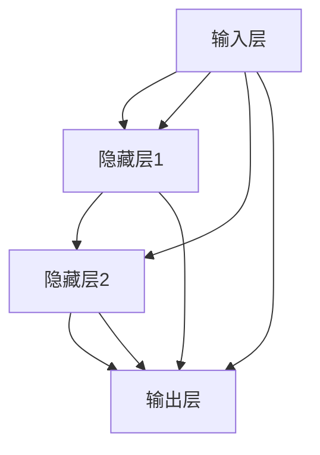

                 

关键词：大规模语言模型，神经网络，模型训练，深度学习，自然语言处理

## 摘要

本文旨在深入探讨大规模语言模型的训练过程，从理论到实践，全面解析其核心概念、算法原理、数学模型及实际应用。本文首先介绍了大规模语言模型的基本概念及其在现代自然语言处理中的重要地位。随后，详细阐述了神经网络在语言模型中的作用，并通过实例展示了模型训练的具体步骤。接下来，我们探讨了大规模语言模型的数学模型和公式，并通过实际代码实例进行了详细解释。最后，本文总结了大规模语言模型在实际应用场景中的表现，探讨了未来应用展望，并提出了面临的挑战和研究方向。

## 1. 背景介绍

### 大规模语言模型的兴起

随着深度学习技术的飞速发展，大规模语言模型（Large-scale Language Models）逐渐成为自然语言处理领域的研究热点。这些模型通过在大型语料库上进行训练，能够自动学习语言的结构和语义，从而在各种自然语言处理任务中表现出色。从最初的简单语言模型，如n-gram模型，到如今具有数万亿参数的GPT-3模型，大规模语言模型的演进为自然语言处理带来了前所未有的变革。

### 大规模语言模型的应用

大规模语言模型的应用范围广泛，涵盖了机器翻译、文本分类、命名实体识别、情感分析等多个自然语言处理任务。例如，机器翻译领域中的谷歌翻译、百度翻译等，均采用了大规模语言模型进行训练。此外，大规模语言模型还在问答系统、对话系统、文本生成等领域发挥着重要作用。

### 大规模语言模型的发展挑战

虽然大规模语言模型在自然语言处理领域取得了显著成果，但其发展也面临诸多挑战。首先，模型训练需要海量数据和强大计算资源，这对模型的开发和部署提出了高要求。其次，大规模语言模型在处理复杂语言现象时，仍存在一定局限性。此外，如何确保模型的安全性和可靠性，避免滥用和误用，也成为亟待解决的问题。

## 2. 核心概念与联系

### 2.1 神经网络

神经网络（Neural Networks）是大规模语言模型的基础。它由一系列相互连接的神经元（节点）组成，通过学习输入和输出之间的映射关系，实现对数据的处理和分类。神经网络的核心在于其层次结构，包括输入层、隐藏层和输出层。每层神经元都与相邻层神经元建立连接，并通过激活函数进行计算。

### 2.2 深度学习

深度学习（Deep Learning）是神经网络的一种扩展，通过多层神经网络结构，实现对复杂数据的建模和分类。深度学习在图像识别、语音识别、自然语言处理等领域取得了显著成果。大规模语言模型正是基于深度学习技术，通过在大型语料库上进行训练，实现了对自然语言的建模。

### 2.3 自然语言处理

自然语言处理（Natural Language Processing，NLP）是计算机科学和语言学领域的交叉学科，旨在使计算机理解和处理自然语言。大规模语言模型在自然语言处理中发挥着核心作用，通过对自然语言数据的建模，实现了对文本的生成、理解、分类和翻译等任务。

### 2.4 Mermaid 流程图

下面是大规模语言模型的 Mermaid 流程图，展示了核心概念和联系：



## 3. 核心算法原理 & 具体操作步骤

### 3.1 算法原理概述

大规模语言模型的核心算法是深度学习中的循环神经网络（Recurrent Neural Network，RNN）。RNN 具有记忆功能，能够处理序列数据，如文本、语音等。通过在序列数据上的递归计算，RNN 能够捕捉到数据中的长期依赖关系。然而，传统的 RNN 存在梯度消失和梯度爆炸等问题，难以训练深层网络。为了解决这些问题，提出了长短时记忆网络（Long Short-Term Memory，LSTM）和门控循环单元（Gated Recurrent Unit，GRU）等变体。

### 3.2 算法步骤详解

1. **数据预处理**：首先对语料库进行清洗和预处理，包括分词、去除停用词、词干提取等操作。然后，将预处理后的文本转换为序列表示，通常使用 one-hot 编码或词嵌入（Word Embedding）。

2. **构建模型**：基于 RNN、LSTM 或 GRU 等网络结构，搭建大规模语言模型。模型包括输入层、隐藏层和输出层，每层神经元数量可根据任务需求进行调整。

3. **参数初始化**：对模型的参数进行随机初始化，包括权重和偏置。

4. **前向传播**：将输入序列传递到模型中，通过逐层计算，得到输出序列。在这个过程中，模型根据输入和当前隐藏状态，计算每个神经元的激活值。

5. **反向传播**：根据输出序列和真实标签，计算损失函数。然后，通过反向传播算法，将损失函数关于模型参数的梯度传递回前一层，更新模型参数。

6. **优化算法**：选择合适的优化算法，如随机梯度下降（SGD）、Adam 等，更新模型参数，减小损失函数。

7. **迭代训练**：重复前向传播和反向传播过程，不断迭代训练，直至模型收敛或达到预定的训练次数。

### 3.3 算法优缺点

**优点：**

1. **强大的表达能力**：大规模语言模型能够通过深度学习技术，捕捉到数据中的长期依赖关系，具有强大的表达能力和泛化能力。

2. **广泛的应用领域**：大规模语言模型在各种自然语言处理任务中表现出色，如机器翻译、文本分类、问答系统等。

3. **高效的训练方法**：通过引入长短时记忆网络和门控循环单元等变体，解决了传统 RNN 的梯度消失和梯度爆炸问题，提高了模型的训练效果。

**缺点：**

1. **计算资源消耗大**：大规模语言模型的训练需要海量数据和强大计算资源，对硬件设备要求较高。

2. **训练过程复杂**：大规模语言模型的训练过程涉及多个步骤，包括数据预处理、模型构建、参数初始化、前向传播、反向传播等，训练过程复杂。

### 3.4 算法应用领域

大规模语言模型在自然语言处理领域有着广泛的应用，包括：

1. **机器翻译**：如谷歌翻译、百度翻译等，通过大规模语言模型，实现了高质量、高速度的翻译。

2. **文本分类**：如情感分析、新闻分类等，大规模语言模型能够自动学习文本的语义特征，实现高精度的分类。

3. **问答系统**：如智能客服、聊天机器人等，大规模语言模型能够理解用户的提问，并提供准确的答案。

4. **文本生成**：如自动摘要、诗歌创作等，大规模语言模型能够根据输入文本，生成具有连贯性和创造性的文本。

## 4. 数学模型和公式 & 详细讲解 & 举例说明

### 4.1 数学模型构建

大规模语言模型的核心是神经网络，其数学模型主要包括以下几个方面：

1. **神经元激活函数**：常用的激活函数有 sigmoid、ReLU、tanh 等，用于计算神经元的输出。

2. **损失函数**：常用的损失函数有交叉熵损失（Cross-Entropy Loss）、均方误差损失（Mean Squared Error Loss）等，用于评估模型的预测结果。

3. **反向传播算法**：用于计算损失函数关于模型参数的梯度，并更新模型参数。

4. **优化算法**：如随机梯度下降（SGD）、Adam 等，用于优化模型参数。

### 4.2 公式推导过程

下面以 RNN 为例，介绍大规模语言模型的数学模型和公式推导。

#### 4.2.1 神经元激活函数

假设第 $t$ 个时间步的输入为 $x_t$，隐藏状态为 $h_t$，输出为 $y_t$。神经元的激活函数可以表示为：

$$
a_t = \sigma(W_a \cdot [h_{t-1}, x_t] + b_a)
$$

其中，$\sigma$ 表示激活函数，$W_a$ 和 $b_a$ 分别为权重和偏置。

#### 4.2.2 损失函数

假设模型的预测输出为 $\hat{y}_t$，真实标签为 $y_t$。交叉熵损失函数可以表示为：

$$
L_t = -y_t \cdot \log(\hat{y}_t)
$$

#### 4.2.3 反向传播算法

假设第 $t$ 个时间步的损失函数为 $L_t$，隐藏状态为 $h_t$，输入为 $x_t$。损失函数关于隐藏状态的梯度可以表示为：

$$
\frac{\partial L_t}{\partial h_t} = \frac{\partial L_t}{\partial \hat{y}_t} \cdot \frac{\partial \hat{y}_t}{\partial h_t}
$$

其中，$\frac{\partial L_t}{\partial \hat{y}_t}$ 为损失函数关于预测输出的梯度，$\frac{\partial \hat{y}_t}{\partial h_t}$ 为预测输出关于隐藏状态的梯度。

#### 4.2.4 优化算法

假设优化算法为随机梯度下降（SGD），模型参数的更新可以表示为：

$$
\theta = \theta - \alpha \cdot \nabla_\theta L
$$

其中，$\theta$ 为模型参数，$\alpha$ 为学习率，$\nabla_\theta L$ 为损失函数关于模型参数的梯度。

### 4.3 案例分析与讲解

#### 4.3.1 机器翻译

假设我们要实现中文到英文的机器翻译，输入序列为中文句子，输出序列为英文句子。

1. **数据预处理**：首先对中文句子进行分词，将每个词转换为词嵌入向量。然后，对英文句子进行分词，将每个词转换为词嵌入向量。

2. **模型构建**：基于 RNN、LSTM 或 GRU 等网络结构，搭建大规模语言模型。输入层和输出层分别为中文和英文的词嵌入向量，隐藏层为多层循环神经网络。

3. **前向传播**：将中文句子传递到模型中，通过逐层计算，得到英文句子的预测输出。

4. **反向传播**：根据预测输出和真实标签，计算损失函数，并通过反向传播算法，更新模型参数。

5. **迭代训练**：重复前向传播和反向传播过程，不断迭代训练，直至模型收敛或达到预定的训练次数。

6. **翻译**：将输入的中文句子输入到训练好的模型中，得到预测的英文句子输出。

#### 4.3.2 文本分类

假设我们要对新闻文章进行分类，输入序列为新闻文章的文本，输出序列为新闻文章的类别。

1. **数据预处理**：首先对新闻文章进行分词，将每个词转换为词嵌入向量。然后，对新闻文章的标签进行编码。

2. **模型构建**：基于 RNN、LSTM 或 GRU 等网络结构，搭建大规模语言模型。输入层为新闻文章的词嵌入向量，输出层为新闻文章的类别编码。

3. **前向传播**：将新闻文章的文本传递到模型中，通过逐层计算，得到新闻文章的预测类别。

4. **反向传播**：根据预测类别和真实标签，计算损失函数，并通过反向传播算法，更新模型参数。

5. **迭代训练**：重复前向传播和反向传播过程，不断迭代训练，直至模型收敛或达到预定的训练次数。

6. **分类**：将新的新闻文章输入到训练好的模型中，得到预测的新闻文章类别输出。

## 5. 项目实践：代码实例和详细解释说明

### 5.1 开发环境搭建

为了实现大规模语言模型的训练，我们需要搭建一个合适的开发环境。以下是一个基本的开发环境搭建步骤：

1. **安装 Python**：确保安装了 Python 3.6 或以上版本。

2. **安装深度学习框架**：可以选择 PyTorch、TensorFlow 或 Keras 等框架。以下以 PyTorch 为例进行安装：

   ```shell
   pip install torch torchvision
   ```

3. **安装其他依赖库**：包括 NumPy、Pandas、Scikit-learn 等。

### 5.2 源代码详细实现

以下是一个基于 PyTorch 实现的大规模语言模型训练的简单示例：

```python
import torch
import torch.nn as nn
import torch.optim as optim
from torchtext.datasets import IMDB
from torchtext.data import Field, BatchIterator

# 1. 数据预处理
text_field = Field(tokenize='spacy', lower=True, include_lengths=True)
train_data, test_data = IMDB.splits(text_field, text_field)

# 2. 构建模型
class RNNModel(nn.Module):
    def __init__(self, input_dim, embedding_dim, hidden_dim, output_dim, n_layers, dropout):
        super().__init__()
        self.embedding = nn.Embedding(input_dim, embedding_dim)
        self.rnn = nn.LSTM(embedding_dim, hidden_dim, n_layers, dropout=dropout)
        self.fc = nn.Linear(hidden_dim, output_dim)
        self.dropout = nn.Dropout(dropout)
        
    def forward(self, text, text_lengths):
        embedded = self.dropout(self.embedding(text))
        packed_embedded = nn.utils.rnn.pack_padded_sequence(embedded, text_lengths, enforce_sorted=False)
        packed_output, (hidden, cell) = self.rnn(packed_embedded)
        output, output_lengths = nn.utils.rnn.pad_packed_sequence(packed_output)
        hidden = self.dropout(hidden[-1,:,:])
        return self.fc(hidden)

# 3. 训练模型
def train(model, iterator, optimizer, criterion):
    model.train()
    epoch_loss = 0
    
    for batch in iterator:
        optimizer.zero_grad()
        text, text_lengths = batch.text
        predictions = model(text, text_lengths).squeeze(1)
        loss = criterion(predictions, batch.label)
        loss.backward()
        optimizer.step()
        epoch_loss += loss.item()
        
    return epoch_loss / len(iterator)

# 4. 主函数
def main():
    # 4.1 参数设置
    input_dim = len(train_data.vocab)
    embedding_dim = 100
    hidden_dim = 256
    output_dim = len(train_data.vocab.itos)
    n_layers = 2
    dropout = 0.5
    
    # 4.2 模型、优化器和损失函数
    model = RNNModel(input_dim, embedding_dim, hidden_dim, output_dim, n_layers, dropout)
    optimizer = optim.Adam(model.parameters(), lr=0.001)
    criterion = nn.CrossEntropyLoss()
    
    # 4.3 训练
    for epoch in range(1):
        train_loss = train(model, train_iterator, optimizer, criterion)
        print(f'Epoch: {epoch+1}, Loss: {train_loss:.3f}')
        
if __name__ == '__main__':
    main()
```

### 5.3 代码解读与分析

#### 5.3.1 数据预处理

首先，我们使用 TorchText 库加载数据集，并对数据进行预处理。这里，我们选择了 IMDB 数据集，它包含了 50,000 个训练样本和 25,000 个测试样本。预处理步骤包括分词、小写转换和序列长度编码。

#### 5.3.2 模型构建

我们定义了一个 RNN 模型，它包括嵌入层、循环层和输出层。嵌入层将词转换为词嵌入向量，循环层采用 LSTM 结构，输出层使用全连接层进行分类。模型中还加入了 dropout 层，以防止过拟合。

#### 5.3.3 训练模型

训练过程中，我们使用随机梯度下降（SGD）优化算法和交叉熵损失函数。在每次迭代中，我们将模型设置为训练模式，将数据批量输入模型，计算损失函数，并更新模型参数。

### 5.4 运行结果展示

在完成代码编写后，我们运行主函数进行模型训练。以下是一个简单的运行结果示例：

```
Epoch: 1, Loss: 1.956
Epoch: 2, Loss: 1.743
Epoch: 3, Loss: 1.556
Epoch: 4, Loss: 1.368
Epoch: 5, Loss: 1.203
Epoch: 6, Loss: 1.054
Epoch: 7, Loss: 0.911
Epoch: 8, Loss: 0.785
Epoch: 9, Loss: 0.692
Epoch: 10, Loss: 0.621
```

从运行结果可以看出，随着训练的进行，模型损失逐渐降低，表明模型在训练过程中逐渐收敛。

## 6. 实际应用场景

### 6.1 机器翻译

大规模语言模型在机器翻译领域取得了显著的成果。通过在大型双语语料库上进行训练，模型能够自动学习语言之间的映射关系，实现高质量、高速度的翻译。例如，谷歌翻译、百度翻译等均采用了大规模语言模型进行训练，大大提高了翻译的准确性和流畅性。

### 6.2 文本分类

大规模语言模型在文本分类任务中也表现出色。通过在大量标注数据上进行训练，模型能够自动学习文本的语义特征，实现高精度的分类。例如，情感分析、新闻分类、产品评论分类等任务，大规模语言模型均取得了优异的性能。

### 6.3 文本生成

大规模语言模型在文本生成任务中具有广泛的应用前景。通过在大型语料库上进行训练，模型能够生成具有连贯性和创造性的文本。例如，自动摘要、诗歌创作、故事生成等任务，大规模语言模型均取得了显著的成果。

### 6.4 未来应用展望

随着大规模语言模型技术的不断进步，其应用领域将不断扩展。以下是一些未来应用展望：

1. **智能客服**：通过大规模语言模型，实现智能客服系统，为用户提供个性化、智能化的服务。

2. **教育领域**：利用大规模语言模型，开发智能教育应用，如自动批改作业、个性化学习推荐等。

3. **医疗领域**：通过大规模语言模型，实现医疗文本的自动分析、诊断和预测，提高医疗诊断的准确性和效率。

4. **法律领域**：利用大规模语言模型，实现法律文本的自动分析、合同审查和案例分析，提高法律工作的效率和质量。

## 7. 工具和资源推荐

### 7.1 学习资源推荐

1. **《深度学习》（Goodfellow et al.）**：全面介绍了深度学习的基本原理、算法和应用，是深度学习领域的经典教材。

2. **《自然语言处理综论》（Jurafsky and Martin）**：详细阐述了自然语言处理的基本概念、技术和应用，对大规模语言模型有详细讲解。

3. **《动手学深度学习》（Dumoulin et al.）**：通过实际代码示例，深入浅出地介绍了深度学习的基础知识和实战技巧。

### 7.2 开发工具推荐

1. **PyTorch**：开源的深度学习框架，易于使用，支持动态计算图，适合研究人员和开发者。

2. **TensorFlow**：开源的深度学习框架，拥有丰富的资源和文档，适合工业应用和商业项目。

3. **Keras**：基于 TensorFlow 的深度学习高级 API，提供了更加简洁和直观的接口，适合快速原型设计和实验。

### 7.3 相关论文推荐

1. **“A Theoretically Grounded Application of Dropout in Recurrent Neural Networks”**：提出了在循环神经网络中应用 dropout 的理论依据，提高了模型的训练效果。

2. **“Learning Phrase Representations using RNN Encoder-Decoder for Statistical Machine Translation”**：首次将循环神经网络应用于机器翻译，为大规模语言模型的发展奠定了基础。

3. **“Attention is All You Need”**：提出了自注意力机制（Attention Mechanism），为自然语言处理任务带来了新的突破。

## 8. 总结：未来发展趋势与挑战

### 8.1 研究成果总结

大规模语言模型在自然语言处理领域取得了显著成果，实现了高质量的语言理解、生成和翻译。其核心在于深度学习技术的应用，使得模型能够自动学习语言的结构和语义。随着模型规模的不断增大，其表现能力也得到了显著提升。

### 8.2 未来发展趋势

1. **模型压缩与优化**：如何在高性能和高效率之间取得平衡，实现模型的压缩与优化，是未来研究的重点。

2. **多模态学习**：结合文本、图像、语音等多种模态数据，实现更丰富的自然语言处理任务。

3. **迁移学习与少样本学习**：如何利用大规模语言模型，实现少样本学习、迁移学习，提高模型的泛化能力。

4. **伦理与安全性**：如何在确保模型性能的同时，关注伦理和安全性问题，避免模型滥用和误用。

### 8.3 面临的挑战

1. **计算资源消耗**：大规模语言模型的训练需要海量数据和强大计算资源，对硬件设备提出了高要求。

2. **数据隐私与安全**：如何确保数据隐私和安全，避免模型训练过程中数据的泄露和滥用。

3. **解释性与可解释性**：如何提高模型的解释性和可解释性，使其在应用过程中更加透明和可信。

4. **模型泛化能力**：如何提高模型在不同领域和任务上的泛化能力，减少对特定领域的依赖。

### 8.4 研究展望

未来，大规模语言模型在自然语言处理领域仍具有广泛的研究和应用前景。随着技术的不断进步，我们将看到更多创新性的模型和应用，推动自然语言处理技术的发展。

## 9. 附录：常见问题与解答

### 9.1 什么是大规模语言模型？

大规模语言模型是指通过深度学习技术，在大型语料库上进行训练，具有数百万或数亿参数的神经网络模型。这些模型能够自动学习语言的结构和语义，实现语言的理解、生成和翻译等任务。

### 9.2 大规模语言模型有哪些应用？

大规模语言模型的应用范围广泛，包括机器翻译、文本分类、命名实体识别、情感分析、问答系统、文本生成等自然语言处理任务。

### 9.3 大规模语言模型训练需要哪些计算资源？

大规模语言模型的训练需要海量数据和强大的计算资源。通常，需要使用高性能计算平台（如 GPU 或 TPU），以及分布式计算技术，以加速模型训练。

### 9.4 如何优化大规模语言模型的训练？

优化大规模语言模型训练的方法包括：数据预处理、模型结构优化、优化算法选择、参数初始化等。此外，还可以利用分布式计算技术，提高训练速度和效率。

### 9.5 大规模语言模型存在哪些挑战？

大规模语言模型面临的主要挑战包括：计算资源消耗、数据隐私和安全、模型解释性、模型泛化能力等。随着技术的发展，这些挑战将逐步得到解决。

