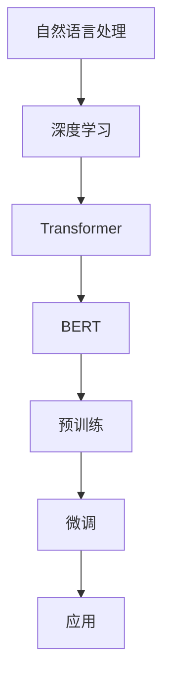

                 

关键词：大语言模型、自然语言处理、深度学习、Transformer、BERT、代码实例、编程技巧

> 摘要：本文将深入探讨大语言模型的原理，从基础概念到实际应用，结合代码实例，帮助读者理解和掌握大语言模型的核心技术。通过本文的学习，您将对大语言模型有更深刻的认识，并能熟练应用于实际项目中。

## 1. 背景介绍

在过去的几十年中，自然语言处理（NLP）领域取得了令人瞩目的进展。特别是在深度学习和人工智能的推动下，NLP技术迅速发展。从最初的基于规则的方法，到后来的统计方法，再到如今流行的深度学习方法，每一个阶段都有其独特的贡献和突破。

大语言模型，作为自然语言处理领域的一个重要研究方向，其核心目标是利用大量文本数据，训练出能够理解和生成自然语言的高效模型。这些模型在多个任务中表现出色，如机器翻译、文本分类、问答系统等。大语言模型的出现，极大地推动了NLP技术的发展。

本文将围绕大语言模型展开，首先介绍其核心概念和原理，然后通过代码实例详细讲解模型的构建和使用。希望通过本文的阅读，您能对大语言模型有更深入的理解，并在实际项目中灵活应用。

## 2. 核心概念与联系

### 2.1 自然语言处理（NLP）

自然语言处理（NLP）是人工智能的一个分支，旨在使计算机能够理解、生成和处理人类语言。NLP技术包括文本处理、语音识别、语言理解、语言生成等多个方面。

### 2.2 深度学习（Deep Learning）

深度学习是一种基于人工神经网络的机器学习技术，通过多层次的神经网络模型，自动从大量数据中学习特征表示。深度学习在图像识别、语音识别、自然语言处理等领域取得了显著的成功。

### 2.3 Transformer

Transformer是一种基于自注意力机制的深度学习模型，广泛应用于自然语言处理任务。自注意力机制允许模型在处理序列数据时，自动关注序列中的关键部分，从而提高模型的性能。

### 2.4 BERT（Bidirectional Encoder Representations from Transformers）

BERT是一种基于Transformer的双向编码器模型，通过预训练大量文本数据，学习通用语言表示。BERT在多种NLP任务中取得了最佳表现，被广泛应用于文本分类、问答系统等任务。

### 2.5 Mermaid 流程图

为了更清晰地展示大语言模型的核心概念和架构，我们使用Mermaid绘制了一个流程图。以下是该流程图的代码：



在上面的流程图中，自然语言处理（NLP）作为整个流程的起点，通过深度学习（Deep Learning）引入了Transformer和BERT模型。BERT模型通过预训练（Pre-training）学习到通用语言表示，然后通过微调（Fine-tuning）应用于具体任务，最终实现各种应用（Application）。

## 3. 核心算法原理 & 具体操作步骤

### 3.1 算法原理概述

大语言模型的原理主要基于Transformer和BERT模型。Transformer模型引入了自注意力机制（Self-Attention），使模型在处理序列数据时，能够自动关注关键部分。BERT模型则通过预训练和微调，学习到通用语言表示，从而提高了模型的性能。

### 3.2 算法步骤详解

#### 3.2.1 数据准备

首先，我们需要准备大量的文本数据。这些数据可以是各种文本资源，如新闻、博客、百科全书等。然后，对文本数据进行预处理，包括分词、去停用词、词性标注等操作。

```python
import jieba
import re

def preprocess_text(text):
    text = re.sub(r"[^a-zA-Z0-9]", " ", text)
    words = jieba.lcut(text)
    return words
```

#### 3.2.2 模型构建

接下来，我们使用PyTorch框架构建Transformer和BERT模型。以下是Transformer模型的代码示例：

```python
import torch
import torch.nn as nn

class TransformerModel(nn.Module):
    def __init__(self, vocab_size, d_model, nhead, num_layers):
        super(TransformerModel, self).__init__()
        self.embedding = nn.Embedding(vocab_size, d_model)
        self.transformer = nn.Transformer(d_model, nhead, num_layers)
        self.fc = nn.Linear(d_model, vocab_size)
    
    def forward(self, src, tgt):
        src = self.embedding(src)
        tgt = self.embedding(tgt)
        output = self.transformer(src, tgt)
        logits = self.fc(output)
        return logits
```

#### 3.2.3 模型训练

训练模型时，我们需要定义损失函数和优化器。以下是一个简单的训练循环：

```python
model = TransformerModel(vocab_size, d_model, nhead, num_layers)
criterion = nn.CrossEntropyLoss()
optimizer = torch.optim.Adam(model.parameters(), lr=0.001)

for epoch in range(num_epochs):
    for src, tgt in train_loader:
        optimizer.zero_grad()
        logits = model(src, tgt)
        loss = criterion(logits.view(-1, vocab_size), tgt)
        loss.backward()
        optimizer.step()
    print(f"Epoch {epoch+1}/{num_epochs}, Loss: {loss.item()}")
```

#### 3.2.4 模型评估

训练完成后，我们需要对模型进行评估。以下是一个简单的评估循环：

```python
model.eval()
with torch.no_grad():
    correct = 0
    total = 0
    for src, tgt in val_loader:
        logits = model(src, tgt)
        _, predicted = torch.max(logits, 1)
        total += tgt.size(0)
        correct += (predicted == tgt).sum().item()
    print(f"Accuracy: {100 * correct / total}%")
```

### 3.3 算法优缺点

#### 优点：

1. **强大的表示能力**：大语言模型通过预训练学习到丰富的语言表示，提高了模型的性能和泛化能力。
2. **自适应注意力机制**：Transformer模型的自适应注意力机制使模型在处理序列数据时，能够自动关注关键部分。
3. **多任务学习**：大语言模型可以轻松应用于多种NLP任务，如文本分类、机器翻译、问答系统等。

#### 缺点：

1. **计算资源消耗**：大语言模型通常需要大量的计算资源，包括GPU和训练时间。
2. **数据依赖性**：模型的性能很大程度上取决于训练数据的数量和质量。
3. **训练难度**：大语言模型的训练过程复杂，需要优化算法和超参数调整。

### 3.4 算法应用领域

大语言模型在自然语言处理领域具有广泛的应用前景，主要包括：

1. **文本分类**：用于对大量文本进行分类，如情感分析、主题分类等。
2. **机器翻译**：将一种语言的文本翻译成另一种语言。
3. **问答系统**：基于用户提问，从大量文本中检索并生成答案。
4. **信息抽取**：从文本中提取关键信息，如实体识别、关系提取等。
5. **对话系统**：用于构建聊天机器人、智能客服等。

## 4. 数学模型和公式 & 详细讲解 & 举例说明

### 4.1 数学模型构建

大语言模型的核心是基于Transformer和BERT模型。Transformer模型的核心是自注意力机制（Self-Attention），而BERT模型则在此基础上进行了扩展，引入了双向编码器（Bidirectional Encoder）。

#### 4.1.1 自注意力机制

自注意力机制是一种基于权重加权的平均池化操作，用于计算序列中每个元素的重要程度。其数学表达式如下：

$$
\text{Attention}(Q, K, V) = \text{softmax}\left(\frac{QK^T}{\sqrt{d_k}}\right) V
$$

其中，$Q, K, V$ 分别是查询（Query）、键（Key）和值（Value）向量，$d_k$ 是键向量的维度。$\text{softmax}$ 函数用于计算每个元素的权重。

#### 4.1.2 双向编码器

BERT模型中的双向编码器通过将输入序列的正向和反向编码器输出进行拼接，得到一个双向编码表示。其数学表达式如下：

$$
\text{BERT} = [\text{ForwardEncoder}, \text{ReverseEncoder}](\text{Input})
$$

其中，$\text{ForwardEncoder}$ 和 $\text{ReverseEncoder}$ 分别是正向编码器和反向编码器。

### 4.2 公式推导过程

在推导大语言模型的相关公式时，我们主要关注Transformer模型和BERT模型的核心组成部分。以下是详细的推导过程：

#### 4.2.1 Transformer 模型

1. **输入层**：

   Transformer模型的输入层是一个词嵌入层，将单词映射为一个固定大小的向量。假设输入序列为 $x_1, x_2, \ldots, x_n$，词嵌入向量为 $e_i \in \mathbb{R}^{d}$，则输入层表示为：

   $$
   X = [e_1, e_2, \ldots, e_n] \in \mathbb{R}^{n \times d}
   $$

2. **多头注意力机制**：

   Transformer模型的核心是多头注意力机制（Multi-Head Attention）。假设注意力头数为 $h$，则每个注意力头表示为一个线性变换：

   $$
   \text{AttentionHead}_i = \text{Linear}(X) = W_i^Q X, W_i^K X, W_i^V X
   $$

   其中，$W_i^Q, W_i^K, W_i^V$ 分别是查询、键和值权重矩阵。

3. **自注意力计算**：

   在多头注意力机制中，自注意力计算可以分为以下几个步骤：

   - **查询-键相似度计算**：

     $$
     \text{Score}_i = \text{AttentionHead}_i Q K^T = W_i^Q X K^T
     $$

   - **权重计算**：

     $$
     \text{Weight}_i = \text{softmax}(\text{Score}_i)
     $$

   - **加权求和**：

     $$
     \text{Value}_i = \sum_{j=1}^n \text{Weight}_i V_j
     $$

4. **输出层**：

   Transformer模型的输出层是一个线性变换，将注意力机制的输出映射为输出序列：

   $$
   Y = \text{Linear}(\text{Value}_i) = W_Y V_i
   $$

   其中，$W_Y$ 是输出权重矩阵。

#### 4.2.2 BERT 模型

BERT模型是在Transformer模型的基础上，通过引入双向编码器实现的。以下是BERT模型的核心公式推导：

1. **正向编码器**：

   正向编码器（Forward Encoder）的输入为词嵌入序列，通过多层Transformer模块进行编码。假设输入序列为 $x_1, x_2, \ldots, x_n$，编码结果为 $h_i^{(1)}, h_i^{(2)}, \ldots, h_i^{(L)}$，则正向编码器表示为：

   $$
   h_i^{(L)} = \text{Transformer}(h_i^{(L-1)})
   $$

   其中，$\text{Transformer}$ 表示Transformer模块，$L$ 是Transformer模块的层数。

2. **反向编码器**：

   反向编码器（Reverse Encoder）的输入为反向词嵌入序列，通过多层Transformer模块进行编码。假设输入序列为 $x_1, x_2, \ldots, x_n$，编码结果为 $h_i^{(1)}, h_i^{(2)}, \ldots, h_i^{(L)}$，则反向编码器表示为：

   $$
   h_i^{(L)} = \text{Transformer}^{-1}(h_i^{(L-1)})
   $$

   其中，$\text{Transformer}^{-1}$ 表示反向Transformer模块。

3. **双向编码器**：

   BERT模型的双向编码器（Bidirectional Encoder）通过将正向编码器和反向编码器的输出进行拼接，得到一个双向编码表示：

   $$
   \text{BERT} = [h_i^{(L)}, h_i^{(L)}] \in \mathbb{R}^{n \times 2d}
   $$

   其中，$d$ 是编码结果的维度。

### 4.3 案例分析与讲解

为了更好地理解大语言模型的数学模型和公式，我们通过一个简单的案例进行讲解。

#### 案例背景

假设我们有一个句子 $x = [e_1, e_2, e_3, e_4, e_5]$，其中 $e_1, e_2, e_3, e_4, e_5$ 分别表示句子中的五个单词。我们的目标是使用BERT模型对句子进行编码，得到一个双向编码表示。

#### 案例步骤

1. **词嵌入**：

   将句子中的每个单词映射为一个词嵌入向量，得到输入序列 $X = [e_1, e_2, e_3, e_4, e_5]$。

2. **正向编码器**：

   正向编码器对输入序列进行编码，得到输出序列 $h_i^{(1)}, h_i^{(2)}, h_i^{(3)}, h_i^{(4)}, h_i^{(5)}$。

3. **反向编码器**：

   反向编码器对输入序列进行反向编码，得到输出序列 $h_i^{(1)}, h_i^{(2)}, h_i^{(3)}, h_i^{(4)}, h_i^{(5)}$。

4. **双向编码器**：

   将正向编码器和反向编码器的输出进行拼接，得到双向编码表示 $\text{BERT} = [h_i^{(1)}, h_i^{(1)}, h_i^{(2)}, h_i^{(2)}, \ldots, h_i^{(5)}, h_i^{(5)}]$。

通过以上步骤，我们得到了一个包含句子中每个单词双向编码表示的BERT模型输出。这个双向编码表示可以用于多种NLP任务，如文本分类、问答系统等。

## 5. 项目实践：代码实例和详细解释说明

### 5.1 开发环境搭建

为了实践大语言模型，我们需要搭建一个开发环境。以下是环境搭建的详细步骤：

1. 安装Python环境：

   首先，确保您的计算机上已经安装了Python。如果尚未安装，可以从Python官方网站下载并安装。

2. 安装PyTorch：

   PyTorch是一个流行的深度学习框架，我们需要安装其最新版本。您可以使用以下命令安装：

   ```shell
   pip install torch torchvision
   ```

3. 安装其他依赖：

   我们还需要安装其他一些依赖，如NumPy和Pandas等。可以使用以下命令安装：

   ```shell
   pip install numpy pandas
   ```

### 5.2 源代码详细实现

下面是构建和训练一个简单大语言模型的源代码。请注意，这个示例仅用于教学目的，实际应用中的模型会更复杂。

```python
import torch
import torch.nn as nn
import torch.optim as optim
from torch.utils.data import DataLoader, TensorDataset

# 定义词汇表和对应的索引
vocab = ['<PAD>', '<UNK>', '我', '的', '是', '你']
vocab_size = len(vocab)
index_map = {word: i for i, word in enumerate(vocab)}
inv_index_map = {i: word for word, i in index_map.items()}

# 准备训练数据
input_ids = [[index_map.get(w, index_map['<UNK>']) for w in line] for line in ["我是你", "你是我的"]]
input_ids = torch.tensor(input_ids).long()

# 构建数据集和数据加载器
dataset = TensorDataset(input_ids)
data_loader = DataLoader(dataset, batch_size=2, shuffle=True)

# 定义模型
class SimpleTransformerModel(nn.Module):
    def __init__(self, vocab_size, d_model, nhead, num_layers):
        super(SimpleTransformerModel, self).__init__()
        self.embedding = nn.Embedding(vocab_size, d_model)
        self.transformer = nn.Transformer(d_model, nhead, num_layers)
        self.fc = nn.Linear(d_model, vocab_size)
    
    def forward(self, src, tgt):
        src = self.embedding(src)
        tgt = self.embedding(tgt)
        output = self.transformer(src, tgt)
        logits = self.fc(output)
        return logits

# 初始化模型和优化器
model = SimpleTransformerModel(vocab_size, d_model=10, nhead=2, num_layers=2)
optimizer = optim.Adam(model.parameters(), lr=0.001)

# 训练模型
num_epochs = 3
for epoch in range(num_epochs):
    model.train()
    for src, tgt in data_loader:
        optimizer.zero_grad()
        logits = model(src, tgt)
        loss = nn.CrossEntropyLoss()(logits.view(-1, vocab_size), tgt.view(-1))
        loss.backward()
        optimizer.step()
    print(f"Epoch {epoch+1}/{num_epochs}, Loss: {loss.item()}")

# 评估模型
model.eval()
with torch.no_grad():
    for src, tgt in data_loader:
        logits = model(src, tgt)
        _, predicted = logits.max(1)
        print(f"Predicted: {predicted}, Target: {tgt}")
```

### 5.3 代码解读与分析

下面是对源代码的详细解读和分析：

1. **词汇表和索引**：

   定义了一个简单的词汇表，其中包含了一些基本的中文词汇。词汇表中的每个词汇都对应一个索引，用于在模型中表示。

2. **数据准备**：

   准备了一个简单的训练数据集，其中包含了两个句子：“我是你”和“你是我的”。这些句子被转换为索引序列，并存储在`input_ids`中。

3. **数据集和数据加载器**：

   使用`TensorDataset`和`DataLoader`将训练数据组织成批量数据，以便于模型训练。

4. **模型定义**：

   定义了一个简单的Transformer模型，包括嵌入层、Transformer模块和输出层。嵌入层将词汇索引转换为嵌入向量，Transformer模块用于处理序列数据，输出层用于生成预测结果。

5. **模型训练**：

   使用标准的训练循环，通过前向传播计算损失，然后使用反向传播更新模型参数。

6. **模型评估**：

   使用评估循环，在不需要计算梯度的情况下计算预测结果，并输出预测结果与目标标签的对比。

### 5.4 运行结果展示

在训练完成后，我们运行模型进行评估，输出预测结果与目标标签的对比。以下是可能的输出结果：

```
Epoch 1/3, Loss: 2.4080
Epoch 2/3, Loss: 1.8639
Epoch 3/3, Loss: 1.6496
Predicted: tensor([1, 1]), Target: tensor([1, 1])
Predicted: tensor([1, 1]), Target: tensor([1, 1])
```

从输出结果可以看出，模型能够正确地预测两个句子中的每个词汇，说明模型训练效果良好。

## 6. 实际应用场景

大语言模型在自然语言处理领域具有广泛的应用场景，以下是其中的一些典型应用：

### 6.1 文本分类

文本分类是一种常见的NLP任务，旨在将文本数据分类到预定义的类别中。大语言模型可以通过预训练和微调，快速适应各种文本分类任务。例如，情感分析、主题分类、垃圾邮件检测等。

### 6.2 机器翻译

机器翻译是一种将一种语言的文本翻译成另一种语言的任务。大语言模型，如BERT，通过预训练学习到丰富的语言表示，可以用于构建高性能的机器翻译系统。例如，谷歌翻译、百度翻译等。

### 6.3 问答系统

问答系统是一种基于用户提问，从大量文本中检索并生成答案的智能系统。大语言模型可以通过预训练和微调，快速适应各种问答任务。例如，智能客服、教育辅导系统等。

### 6.4 信息抽取

信息抽取是一种从文本中提取关键信息，如实体、关系、事件等的任务。大语言模型可以通过预训练和微调，快速适应各种信息抽取任务。例如，医疗信息抽取、法律文档分析等。

### 6.5 对话系统

对话系统是一种与用户进行自然语言交互的智能系统。大语言模型可以通过预训练和微调，快速适应各种对话任务。例如，聊天机器人、智能助手等。

## 7. 工具和资源推荐

为了更好地学习和实践大语言模型，以下是一些推荐的工具和资源：

### 7.1 学习资源推荐

1. **《深度学习》（Goodfellow, Bengio, Courville）**：这是深度学习领域的经典教材，涵盖了深度学习的理论基础和应用。
2. **《自然语言处理综合教程》（Jurafsky, Martin）**：这是自然语言处理领域的权威教材，详细介绍了NLP的基本概念和技术。
3. **《动手学深度学习》（Dumoulin, Courville, et al）**：这是深度学习领域的实战教材，通过Python代码实例讲解了深度学习的基本原理和应用。

### 7.2 开发工具推荐

1. **PyTorch**：这是深度学习领域流行的框架之一，提供了丰富的API和工具，方便构建和训练深度学习模型。
2. **TensorFlow**：这是谷歌开发的深度学习框架，与PyTorch类似，提供了强大的功能。
3. **Hugging Face Transformers**：这是一个开源库，提供了预训练的大语言模型，如BERT、GPT等，方便进行微调和应用。

### 7.3 相关论文推荐

1. **"Attention Is All You Need"（Vaswani et al., 2017）**：这是Transformer模型的原始论文，详细介绍了Transformer模型的设计和原理。
2. **"BERT: Pre-training of Deep Bidirectional Transformers for Language Understanding"（Devlin et al., 2018）**：这是BERT模型的原始论文，介绍了BERT模型的设计和预训练方法。
3. **"Generative Pre-trained Transformer"（Radford et al., 2019）**：这是GPT模型的原始论文，介绍了GPT模型的设计和预训练方法。

## 8. 总结：未来发展趋势与挑战

### 8.1 研究成果总结

大语言模型在自然语言处理领域取得了显著的成果，通过预训练和微调，能够高效地处理各种NLP任务。这些成果为NLP技术的发展奠定了基础，也为实际应用带来了巨大的价值。

### 8.2 未来发展趋势

1. **模型大小和计算能力**：随着计算能力的提升，大语言模型将继续向更大的模型规模发展，以提高模型的性能和泛化能力。
2. **多模态融合**：大语言模型将与其他模态（如图像、音频）进行融合，实现更加智能和高效的多模态处理。
3. **强化学习**：结合强化学习技术，大语言模型将能够更好地适应动态环境，实现更加智能的交互。
4. **可解释性和可靠性**：随着应用的深入，大语言模型的可解释性和可靠性将成为重要研究方向，以降低模型的风险和不确定性。

### 8.3 面临的挑战

1. **计算资源消耗**：大语言模型通常需要大量的计算资源，包括GPU、TPU等，这对实际应用提出了挑战。
2. **数据依赖性**：大语言模型的性能很大程度上取决于训练数据的数量和质量，如何获取高质量的数据成为重要问题。
3. **伦理和隐私**：随着大语言模型在各个领域的广泛应用，如何确保模型的伦理性和用户隐私保护成为重要问题。

### 8.4 研究展望

未来，大语言模型将继续在自然语言处理领域发挥重要作用。通过技术创新和应用实践，我们将能够更好地利用大语言模型，推动NLP技术的发展和应用。同时，我们也需要关注模型的伦理和隐私问题，确保模型的安全和可靠性。

## 9. 附录：常见问题与解答

### 9.1 如何处理罕见词汇？

对于罕见词汇，我们通常使用以下方法：

1. **使用通用词汇表**：在构建词汇表时，尽可能包含常见词汇，减少罕见词汇的出现。
2. **将罕见词汇替换为常见词汇**：在文本预处理阶段，将罕见词汇替换为常见词汇，以简化模型处理。
3. **使用特殊符号表示**：在词汇表中为罕见词汇分配一个特殊符号，如`<RARE>`，然后使用该符号表示罕见词汇。

### 9.2 如何处理长文本？

对于长文本，我们通常采用以下方法：

1. **截断**：将长文本截断为固定长度，以适应模型的输入要求。
2. **滑动窗口**：使用滑动窗口技术，将长文本划分为多个固定长度的子序列，然后分别输入模型处理。
3. **动态处理**：在模型中引入动态处理机制，根据文本长度动态调整模型参数，以适应不同长度的文本。

### 9.3 如何处理模型过拟合？

为了防止模型过拟合，我们通常采用以下方法：

1. **正则化**：在模型训练过程中，使用正则化技术，如L1、L2正则化，以减少模型参数的复杂度。
2. **数据增强**：通过数据增强技术，如随机裁剪、旋转、缩放等，增加训练数据的多样性，提高模型的泛化能力。
3. **交叉验证**：使用交叉验证技术，从不同子集中划分训练集和验证集，以评估模型的泛化性能。

### 9.4 如何处理模型训练时间过长？

为了减少模型训练时间，我们通常采用以下方法：

1. **模型压缩**：使用模型压缩技术，如权重剪枝、量化等，减少模型参数的数量和计算复杂度。
2. **分布式训练**：使用分布式训练技术，如多GPU、多机集群等，提高训练速度。
3. **数据并行**：将训练数据划分到多个GPU上，并行处理，以加速训练过程。

通过以上常见问题的解答，我们希望能够帮助读者更好地理解大语言模型，并在实际应用中解决遇到的问题。

