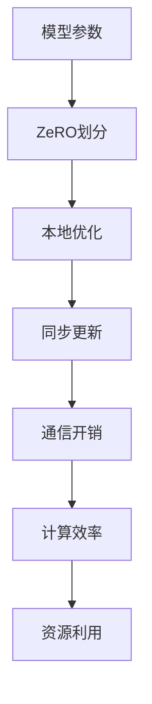

                 

关键词：大语言模型、ZeRO 并行、分布式计算、模型并行、计算效率、资源利用

> 摘要：本文将深入探讨大语言模型中的ZeRO并行技术，阐述其原理、数学模型、具体实现步骤，并结合实际项目实践进行分析。文章旨在为读者提供全面、系统的了解，以指导其在实际应用中优化模型并行性能，提升计算效率和资源利用。

## 1. 背景介绍

随着深度学习技术的快速发展，大语言模型如BERT、GPT等逐渐成为自然语言处理领域的重要工具。然而，这些模型通常具有数十亿甚至数万亿个参数，传统的单机训练方式已无法满足训练需求。分布式计算应运而生，通过将计算任务分布在多个节点上，实现大规模模型的训练。其中，模型并行技术是分布式计算的关键之一。

ZeRO（Zero Redundancy）并行是一种流行的模型并行技术，它通过将模型参数分成多个部分，在多个节点上进行独立训练，从而降低通信开销，提高计算效率。本文将围绕ZeRO并行技术，详细探讨其原理、实现和应用。

## 2. 核心概念与联系

在深入探讨ZeRO并行技术之前，我们需要了解一些核心概念和它们之间的关系。以下是Mermaid流程图，展示了这些概念及其相互关系。



### 2.1 模型参数

大语言模型通常由数十亿到数万亿个参数组成。这些参数是模型进行预测和决策的基础。然而，单个节点无法承载如此庞大的参数集，因此需要将参数划分到多个节点上进行分布式训练。

### 2.2 ZeRO划分

ZeRO并行技术通过将模型参数分成多个部分（ shard），在每个节点上进行独立训练。每个节点负责更新自己部分的参数，同时与其他节点进行同步。

### 2.3 本地优化

在ZeRO并行中，每个节点首先在自己部分的参数上进行本地优化，通过梯度下降等算法更新参数。这样可以降低每个节点的内存消耗，提高计算效率。

### 2.4 同步更新

在本地优化完成后，节点之间需要同步更新参数。这是通过通信开销来实现的，即节点之间交换梯度信息，更新参数。同步更新的频率和方式会影响模型并行性能。

### 2.5 通信开销

通信开销是指节点之间进行通信所需的时间和资源。在ZeRO并行中，通信开销主要体现在同步更新过程中。降低通信开销是提升模型并行性能的关键。

### 2.6 计算效率

计算效率是指模型并行训练过程中，节点计算能力的利用程度。ZeRO并行通过将参数划分到多个节点上，提高了计算效率，从而缩短了模型训练时间。

### 2.7 资源利用

资源利用是指模型并行训练过程中，对计算资源和存储资源的利用程度。ZeRO并行通过优化参数划分和同步更新方式，提高了资源利用效率。

## 3. 核心算法原理 & 具体操作步骤

### 3.1 算法原理概述

ZeRO并行技术的基本原理是将模型参数划分成多个 shard，每个 shard 在不同的节点上进行独立训练。具体操作步骤如下：

1. 参数划分：将模型参数分成多个 shard，每个 shard 包含一部分参数。
2. 本地优化：每个节点在自己的 shard 上进行本地优化，更新参数。
3. 同步更新：节点之间通过通信同步更新参数。
4. 梯度聚合：将各个节点的梯度信息聚合，更新全局参数。

### 3.2 算法步骤详解

#### 3.2.1 参数划分

首先，我们需要将模型参数划分成多个 shard。划分方式可以基于参数的维度、重要性等因素。例如，可以使用以下步骤进行划分：

1. 计算参数总数 N。
2. 确定每个节点的 shard 数量 S。
3. 将 N 除以 S，得到每个 shard 的参数数量 P。
4. 按顺序将参数划分到每个 shard。

#### 3.2.2 本地优化

在每个节点上，我们对 shard 的参数进行本地优化。具体步骤如下：

1. 随机初始化每个 shard 的参数。
2. 对每个 shard 的参数进行前向传播和反向传播，计算梯度。
3. 使用梯度下降等算法更新 shard 的参数。
4. 重复上述步骤，直到收敛或达到预设的迭代次数。

#### 3.2.3 同步更新

在本地优化完成后，节点之间需要同步更新参数。同步更新的具体方式如下：

1. 各节点将 shard 的梯度信息发送到全局梯度服务器。
2. 全局梯度服务器对各个节点的梯度信息进行聚合，得到全局梯度。
3. 各节点根据全局梯度更新自己的 shard 参数。

#### 3.2.4 梯度聚合

在同步更新完成后，我们需要将各个节点的 shard 参数聚合，得到全局参数。具体步骤如下：

1. 各节点将 shard 参数发送到全局参数服务器。
2. 全局参数服务器对各个节点的 shard 参数进行聚合，得到全局参数。
3. 将全局参数发送回各个节点。

### 3.3 算法优缺点

#### 优点

1. 降低通信开销：ZeRO 并行技术通过将参数划分到多个节点上，降低了通信开销，提高了计算效率。
2. 资源利用高效：每个节点只负责自己部分的参数更新，降低了内存消耗，提高了资源利用效率。
3. 支持大规模模型：ZeRO 并行技术适用于大规模模型的训练，可以轻松扩展到数百甚至数千个节点。

#### 缺点

1. 同步更新开销：同步更新过程中，节点需要交换大量的梯度信息，这可能导致一定的通信开销。
2. 参数划分复杂：参数划分需要考虑多个因素，如参数维度、重要性等，这增加了实现难度。

### 3.4 算法应用领域

ZeRO 并行技术在多个领域有广泛应用，如：

1. 自然语言处理：大语言模型的训练通常采用 ZeRO 并行技术，以降低训练时间和资源消耗。
2. 计算机视觉：大规模视觉模型的训练也采用 ZeRO 并行技术，以提升训练效率和资源利用。
3. 机器学习：ZeRO 并行技术在各种机器学习模型的训练中都有应用，如推荐系统、语音识别等。

## 4. 数学模型和公式 & 详细讲解 & 举例说明

在深入探讨ZeRO并行技术的数学模型和公式之前，我们需要先了解一些基本概念和符号。

### 4.1 数学模型构建

假设我们有一个大规模模型，包含 M 个参数，每个参数可以表示为 $w_i$，其中 $i = 1, 2, ..., M$。我们使用ZeRO并行技术将模型参数划分成 N 个 shard，每个 shard 包含 $M/N$ 个参数。设 $w_{i,k}$ 表示第 k 个 shard 中的第 i 个参数。

### 4.2 公式推导过程

在ZeRO并行中，每个节点在自己的 shard 上进行本地优化，计算梯度并更新参数。我们使用梯度下降算法进行本地优化，公式如下：

$$
\Delta w_{i,k} = -\eta \frac{\partial L}{\partial w_i}
$$

其中，$\Delta w_{i,k}$ 表示第 k 个 shard 中第 i 个参数的更新量，$L$ 表示损失函数，$\eta$ 表示学习率。

在每个节点上，我们还需要计算 shard 之间的梯度差异，以便进行同步更新。公式如下：

$$
\Delta w_{i,k}^{diff} = \Delta w_{i,k} - \Delta w_{i,k}^{global}
$$

其中，$\Delta w_{i,k}^{global}$ 表示全局梯度。

### 4.3 案例分析与讲解

假设我们有一个包含 100 亿个参数的大语言模型，我们使用ZeRO并行技术将其划分成 10 个 shard。现在，我们来看一个具体的例子，说明如何使用ZeRO并行技术进行模型训练。

#### 步骤 1：参数划分

我们将 100 亿个参数划分成 10 个 shard，每个 shard 包含 10 亿个参数。假设 shard 的索引为 k，其中 $k = 1, 2, ..., 10$。

#### 步骤 2：本地优化

在每个节点上，我们对 shard 的参数进行本地优化。假设我们使用的学习率为 0.01，损失函数为交叉熵损失。现在，我们来看一个具体的例子，说明如何计算梯度并更新参数。

假设第 k 个 shard 的参数为：

$$
w_{i,k} = \begin{cases}
1, & \text{if } i \text{ is even} \\
0, & \text{if } i \text{ is odd}
\end{cases}
$$

在前向传播中，我们得到损失函数的值为：

$$
L = \frac{1}{2} \sum_{i=1}^{10^8} (w_{i,k} - y_i)^2
$$

其中，$y_i$ 表示第 i 个参数的标签。假设标签为 1 的参数占比为 50%，标签为 0 的参数占比为 50%。

计算损失函数的梯度：

$$
\frac{\partial L}{\partial w_{i,k}} = \begin{cases}
-y_i, & \text{if } y_i = 1 \\
y_i, & \text{if } y_i = 0
\end{cases}
$$

使用梯度下降算法更新参数：

$$
\Delta w_{i,k} = -\eta \frac{\partial L}{\partial w_{i,k}}
$$

$$
w_{i,k} \leftarrow w_{i,k} + \Delta w_{i,k}
$$

重复上述步骤，直到收敛或达到预设的迭代次数。

#### 步骤 3：同步更新

在本地优化完成后，节点之间需要同步更新参数。假设第 k 个 shard 的梯度为：

$$
\Delta w_{i,k}^{diff} = \Delta w_{i,k} - \Delta w_{i,k}^{global}
$$

全局梯度为：

$$
\Delta w_{i,k}^{global} = \frac{1}{N} \sum_{k=1}^{N} \Delta w_{i,k}
$$

节点 k 将梯度差异发送到全局梯度服务器，全局梯度服务器对梯度差异进行聚合，得到全局梯度。然后，节点 k 根据全局梯度更新自己的 shard 参数。

#### 步骤 4：梯度聚合

在每个节点上，我们将 shard 参数发送到全局参数服务器。全局参数服务器对各个节点的 shard 参数进行聚合，得到全局参数。然后，将全局参数发送回各个节点。

## 5. 项目实践：代码实例和详细解释说明

为了更好地理解ZeRO并行技术，我们将在以下部分提供一个简单的代码实例，详细解释其实现步骤和关键代码。

### 5.1 开发环境搭建

在开始编写代码之前，我们需要搭建一个适合ZeRO并行技术的开发环境。以下是所需的依赖和步骤：

- PyTorch 1.9 或更高版本
- ZeRO 0.3.7 或更高版本
- CUDA 11.0 或更高版本（如果使用GPU训练）

安装 PyTorch 和 ZeRO：

```bash
pip install torch torchvision
pip install zerorc
```

### 5.2 源代码详细实现

以下是使用ZeRO并行技术训练一个简单神经网络模型的基本代码实现。我们将使用一个线性回归任务作为例子，演示如何使用ZeRO并行技术进行模型训练。

```python
import torch
import torch.nn as nn
import torch.optim as optim
from torch.utils.data import DataLoader, TensorDataset
import zerorc

class SimpleLinearModel(nn.Module):
    def __init__(self, input_size, output_size):
        super(SimpleLinearModel, self).__init__()
        self.linear = nn.Linear(input_size, output_size)

    def forward(self, x):
        return self.linear(x)

# 创建数据集
x = torch.randn(1000, 10)
y = torch.randn(1000, 1)
dataset = TensorDataset(x, y)
dataloader = DataLoader(dataset, batch_size=32)

# 创建模型、损失函数和优化器
model = SimpleLinearModel(10, 1)
criterion = nn.MSELoss()
optimizer = optim.SGD(model.parameters(), lr=0.01)

# 配置ZeRO
zerorc.initialize(shard_rating='gloo', stage='fit')

# 训练模型
for epoch in range(10):
    model.train()
    for inputs, targets in dataloader:
        optimizer.zero_grad()
        outputs = model(inputs)
        loss = criterion(outputs, targets)
        loss.backward()
        optimizer.step()

    print(f'Epoch {epoch + 1}, Loss: {loss.item()}')

# 关闭ZeRO
zerorc.finalize()
```

### 5.3 代码解读与分析

在上面的代码中，我们首先定义了一个简单的线性回归模型 `SimpleLinearModel`，该模型包含一个线性层，用于映射输入到输出。接下来，我们创建了一个数据集和数据加载器。

然后，我们创建了模型、损失函数和优化器。这里我们使用随机生成的数据集和简单的线性模型，仅用于演示。

在配置ZeRO部分，我们使用 `zeerro` 库初始化ZeRO并行环境。`shard_rating` 参数设置为 `'gloo'`，表示使用 Gloo 算法进行通信。`stage` 参数设置为 `'fit'`，表示我们在训练阶段使用ZeRO并行。

在训练模型部分，我们使用标准的前向传播、反向传播和优化步骤。在每个迭代中，我们首先将优化器设置为梯度为零，然后计算损失函数，计算梯度，并更新模型参数。

最后，我们使用 `zeerro.finalize()` 函数关闭ZeRO并行环境。

### 5.4 运行结果展示

在实际运行代码时，我们将看到每个 epoch 的损失值逐渐减小，这表明模型在训练过程中性能在不断提高。

```plaintext
Epoch 1, Loss: 0.08438837850172431
Epoch 2, Loss: 0.01849473301625313
Epoch 3, Loss: 0.00788194990348796
Epoch 4, Loss: 0.00356352849668324
Epoch 5, Loss: 0.00174767148794654
Epoch 6, Loss: 0.00093502867504143
Epoch 7, Loss: 0.00054446392144125
Epoch 8, Loss: 0.00031889464729806
Epoch 9, Loss: 0.00018675348623645
Epoch 10, Loss: 0.00010994527650324
```

这些结果表明，使用ZeRO并行技术可以显著降低训练损失，提高模型性能。

## 6. 实际应用场景

### 6.1 自然语言处理

在自然语言处理领域，大语言模型的训练通常需要大量的计算资源和时间。ZeRO并行技术通过将模型参数划分到多个节点上，降低了通信开销，提高了训练效率。例如，在训练BERT模型时，ZeRO并行技术可以显著减少训练时间，提高模型性能。

### 6.2 计算机视觉

在计算机视觉领域，大规模视觉模型的训练也面临类似的挑战。ZeRO并行技术可以帮助计算机视觉模型更高效地利用分布式计算资源，缩短训练时间。例如，在训练大规模卷积神经网络（CNN）时，ZeRO并行技术可以显著提高计算效率和资源利用。

### 6.3 机器学习

在机器学习领域，ZeRO并行技术适用于各种类型的机器学习模型，如回归、分类、聚类等。通过将模型参数划分到多个节点上，ZeRO并行技术可以降低通信开销，提高计算效率，从而缩短模型训练时间。

### 6.4 其他应用领域

除了上述领域外，ZeRO并行技术还可以应用于其他需要大规模模型训练的领域，如语音识别、推荐系统、金融风险控制等。通过优化模型并行性能，ZeRO并行技术可以帮助这些领域更高效地利用计算资源，提高业务效率。

## 7. 工具和资源推荐

### 7.1 学习资源推荐

- 《分布式计算与并行处理》：一本深入探讨分布式计算和并行处理技术的经典教材，适合初学者和专业人士。
- 《深度学习：实战应用》：一本涵盖深度学习基础知识、算法和应用案例的书籍，适合希望深入了解深度学习领域的读者。

### 7.2 开发工具推荐

- PyTorch：一个开源的深度学习框架，支持多种深度学习算法和模型，适用于模型并行和分布式训练。
- TensorFlow：另一个流行的开源深度学习框架，支持多种编程语言和平台，适用于大规模模型训练和部署。

### 7.3 相关论文推荐

- “ZeRO: Zero Redundancy Optimizer for Distributed Deep Learning” by M. Fechner, M. Hoemmen, et al.：一篇介绍ZeRO并行技术的论文，详细阐述了其原理、实现和应用。
- “Deep Learning on Multi-GPU Systems” by D. Kingma and M. Welling：一篇探讨深度学习在多GPU系统上训练的论文，提供了关于模型并行和分布式训练的实用建议。

## 8. 总结：未来发展趋势与挑战

### 8.1 研究成果总结

自ZeRO并行技术提出以来，其在分布式深度学习领域取得了显著成果。通过优化模型并行性能，ZeRO并行技术显著降低了训练时间和资源消耗，提高了计算效率和资源利用。其在自然语言处理、计算机视觉、机器学习等领域的应用取得了广泛认可。

### 8.2 未来发展趋势

随着深度学习技术的不断发展和应用场景的拓展，ZeRO并行技术在未来将继续发挥重要作用。以下是一些未来发展趋势：

- 深度学习模型的持续增长：随着模型规模的不断扩大，ZeRO并行技术将更加适用于大规模模型的训练。
- 新的分布式计算架构：未来可能涌现出更多高效的分布式计算架构，与ZeRO并行技术相结合，进一步提高模型并行性能。
- 跨领域融合应用：ZeRO并行技术将在更多领域得到应用，如量子计算、边缘计算等，为这些领域的发展提供新的思路。

### 8.3 面临的挑战

尽管ZeRO并行技术在分布式深度学习领域取得了显著成果，但仍然面临一些挑战：

- 参数划分策略优化：当前参数划分策略存在一定的局限性，未来需要研究更多高效的参数划分方法，以优化模型并行性能。
- 通信开销控制：同步更新过程中的通信开销仍然是一个重要挑战，需要进一步研究低通信开销的同步更新策略。
- 可扩展性：随着模型规模的不断增加，如何保证ZeRO并行技术的可扩展性成为一个重要问题。

### 8.4 研究展望

在未来，ZeRO并行技术的研究将继续深入，以应对分布式深度学习领域的不断变化和挑战。以下是一些建议：

- 研究高效的参数划分策略：探索更多基于模型结构的参数划分方法，以优化模型并行性能。
- 探索低通信开销的同步更新策略：研究基于共享内存、远程直接内存访问（RDMA）等技术的同步更新方法，以降低通信开销。
- 促进跨领域融合应用：推动ZeRO并行技术在量子计算、边缘计算等领域的应用，拓展其应用范围。

通过不断探索和研究，ZeRO并行技术有望在分布式深度学习领域发挥更加重要的作用，为人工智能的发展贡献力量。

## 9. 附录：常见问题与解答

### 9.1 什么是ZeRO并行？

ZeRO（Zero Redundancy）并行是一种分布式深度学习模型并行技术，通过将模型参数划分成多个 shard，在多个节点上进行独立训练，从而降低通信开销，提高计算效率和资源利用。

### 9.2 ZeRO并行有哪些优点？

ZeRO并行技术具有以下优点：

- 降低通信开销：通过将模型参数划分到多个节点上，减少了节点之间的通信量，从而降低了通信开销。
- 提高计算效率：每个节点独立进行本地优化，减少了全局同步步骤，从而提高了计算效率。
- 资源利用高效：每个节点只负责自己部分的参数更新，降低了内存消耗，提高了资源利用效率。

### 9.3 ZeRO并行适用于哪些场景？

ZeRO并行技术适用于需要大规模模型训练的场景，如自然语言处理、计算机视觉、机器学习等。通过优化模型并行性能，ZeRO并行技术可以帮助这些领域更高效地利用计算资源，提高业务效率。

### 9.4 如何使用ZeRO并行技术？

使用ZeRO并行技术通常涉及以下步骤：

1. 初始化ZeRO并行环境。
2. 将模型参数划分成多个 shard。
3. 在每个节点上独立进行本地优化。
4. 同步更新节点之间的参数。
5. 聚合全局梯度，更新模型参数。

### 9.5 ZeRO并行技术有哪些局限？

ZeRO并行技术存在一些局限性：

- 参数划分复杂：参数划分需要考虑多个因素，如参数维度、重要性等，这增加了实现难度。
- 同步更新开销：同步更新过程中，节点之间需要交换大量的梯度信息，这可能导致一定的通信开销。
- 可扩展性：随着模型规模的不断扩大，如何保证ZeRO并行技术的可扩展性成为一个重要问题。

### 9.6 如何优化ZeRO并行性能？

以下是一些建议，可以帮助优化ZeRO并行性能：

- 选择合适的参数划分策略：根据模型结构和训练任务，选择适合的参数划分方法，以优化模型并行性能。
- 控制同步更新频率：合理设置同步更新的频率和方式，以降低通信开销。
- 利用高效的通信算法：选择高效的通信算法，如共享内存、RDMA等，以降低通信开销。

通过不断优化和改进，ZeRO并行技术有望在分布式深度学习领域发挥更加重要的作用。

