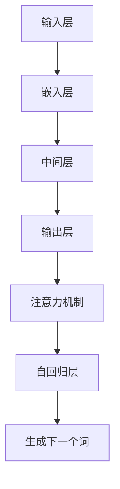

                 

关键词：大语言模型，原理，工程实践，代码，数据，人工智能，机器学习，自然语言处理，深度学习。

> 摘要：本文将深入探讨大语言模型的原理和工程实践，从基础概念到实际应用，全面解析其背后的技术和实现细节。我们将介绍大语言模型的核心算法、数学模型、项目实践，并展望其未来发展趋势和面临的挑战。

## 1. 背景介绍

随着互联网和大数据的迅猛发展，自然语言处理（Natural Language Processing，NLP）成为人工智能领域的重要研究方向。大语言模型（Large Language Model）作为NLP的核心技术之一，近年来取得了显著的进展。大语言模型旨在通过对海量文本数据的学习，理解和生成人类语言，从而在文本分类、机器翻译、问答系统等领域发挥重要作用。

本文将围绕大语言模型的核心概念和关键技术，详细探讨其原理、实现步骤和应用场景。希望通过本文，读者能够对大语言模型有一个全面而深入的了解。

### 1.1 发展历程

大语言模型的发展历程可以分为几个阶段：

- **早期模型**：20世纪80年代，RNN（循环神经网络）和LSTM（长短期记忆网络）等神经网络模型开始应用于NLP任务。这些模型在一定程度上提升了文本处理的性能，但受限于计算资源和模型复杂度，效果有限。

- **预训练模型**：2018年，BERT（Bidirectional Encoder Representations from Transformers）模型的提出，标志着预训练技术在NLP领域的突破。BERT通过在大规模语料上进行预训练，再根据具体任务进行微调，取得了显著的效果。

- **大型模型**：随着计算资源的增加，研究人员开始训练更大型、参数更多的模型。如GPT-3（Generative Pre-trained Transformer 3）模型，拥有超过1750亿个参数，展示了强大的文本生成和语言理解能力。

### 1.2 研究意义

大语言模型在多个领域具有广泛的应用前景，具有重要的研究意义：

- **文本分类**：大语言模型能够准确识别文本的主题和情感，用于新闻分类、社交媒体情感分析等任务。

- **机器翻译**：大语言模型在机器翻译领域取得了重大突破，如Google Translate等应用已经广泛应用。

- **问答系统**：大语言模型能够理解用户的问题，并从海量文本中提取答案，应用于智能客服、教育辅导等领域。

- **文本生成**：大语言模型能够生成高质量的文章、摘要和对话，应用于内容创作、虚拟助手等领域。

## 2. 核心概念与联系

### 2.1 核心概念

大语言模型的核心概念包括：

- **语言模型**：语言模型是用于预测下一个单词或字符的概率分布的模型。在大语言模型中，通常采用神经网络作为语言模型的基础。

- **预训练**：预训练是指在大规模语料上对模型进行训练，使其具有丰富的语言知识。预训练后的模型可以通过微调适应特定任务。

- **注意力机制**：注意力机制是一种能够关注重要信息的机制，在大语言模型中用于捕捉文本之间的关联。

- **自回归模型**：自回归模型是一种生成模型，能够根据前一个词预测下一个词。在大语言模型中，自回归模型用于文本生成。

### 2.2 联系与架构

大语言模型的架构通常包括以下几个部分：

- **输入层**：输入层接收文本数据，通过分词和编码等操作将其转换为模型可以处理的格式。

- **嵌入层**：嵌入层将输入的词编码为向量，通常采用词向量或嵌入层结合注意力机制的变体。

- **中间层**：中间层包括多层神经网络，用于提取文本的特征和表示。

- **输出层**：输出层用于生成文本的下一个词或字符。

- **注意力机制**：注意力机制用于在生成过程中关注重要的信息。

- **自回归层**：自回归层用于在生成过程中根据前一个词预测下一个词。

### 2.3 Mermaid 流程图



## 3. 核心算法原理 & 具体操作步骤

### 3.1 算法原理概述

大语言模型的核心算法通常是基于Transformer架构的预训练模型。Transformer模型通过自注意力机制（Self-Attention）和多头注意力（Multi-Head Attention）实现了对文本的全局依赖关系的捕捉，从而在文本生成和语言理解任务中表现出色。

预训练过程包括两个阶段：

1. **无监督预训练**：在大规模语料上，模型学习文本的上下文关系，通过预测下一个词或字符的概率分布。

2. **有监督微调**：在特定任务的数据集上，模型进行微调，以适应具体的任务。

### 3.2 算法步骤详解

1. **输入预处理**：输入文本经过分词和编码，转换为模型的输入。

2. **嵌入层**：嵌入层将词编码为向量。

3. **自注意力机制**：通过自注意力机制，模型学习文本之间的依赖关系。

4. **中间层**：中间层包括多层神经网络，用于提取文本的特征和表示。

5. **输出层**：输出层生成文本的下一个词或字符。

6. **自回归**：在生成过程中，模型根据前一个词预测下一个词。

7. **微调**：在特定任务的数据集上，模型进行微调，以适应具体的任务。

### 3.3 算法优缺点

- **优点**：

  - **强大的语言理解能力**：通过预训练和自注意力机制，模型能够捕捉到文本之间的复杂依赖关系，从而在语言理解任务中表现出色。

  - **高效的文本生成**：自回归机制使得模型能够高效地生成高质量的文本。

  - **广泛的适用性**：大语言模型可以应用于多种NLP任务，如文本分类、机器翻译、问答系统等。

- **缺点**：

  - **计算资源消耗大**：训练大型语言模型需要大量的计算资源和时间。

  - **对数据质量依赖高**：模型的效果很大程度上依赖于训练数据的质量。

### 3.4 算法应用领域

大语言模型在多个领域具有广泛的应用前景：

- **文本分类**：用于对文本进行主题分类和情感分析。

- **机器翻译**：用于将一种语言的文本翻译成另一种语言。

- **问答系统**：用于回答用户的问题，应用于智能客服、教育辅导等领域。

- **文本生成**：用于生成高质量的文章、摘要和对话。

## 4. 数学模型和公式 & 详细讲解 & 举例说明

### 4.1 数学模型构建

大语言模型的数学模型主要包括以下几个方面：

- **词嵌入**：将词汇映射为向量。

- **自注意力机制**：计算文本中每个词的权重。

- **损失函数**：用于评估模型预测的准确性。

### 4.2 公式推导过程

1. **词嵌入**：

   词嵌入公式为：

   $$ 
   \text{embed}(x) = W_x x 
   $$

   其中，$W_x$为词嵌入矩阵，$x$为词汇。

2. **自注意力机制**：

   自注意力公式为：

   $$ 
   \text{attention}(Q, K, V) = \text{softmax}\left(\frac{QK^T}{\sqrt{d_k}}\right) V 
   $$

   其中，$Q, K, V$分别为查询向量、键向量和值向量，$d_k$为键向量的维度。

3. **损失函数**：

   损失函数通常采用交叉熵损失：

   $$ 
   L = -\sum_{i} y_i \log(p_i) 
   $$

   其中，$y_i$为真实标签，$p_i$为模型预测的概率。

### 4.3 案例分析与讲解

假设我们有一个简单的文本生成任务，目标是生成一个句子的下一个词。

1. **输入文本**：

   "I love programming because it's like painting a picture with numbers."

2. **词嵌入**：

   将文本中的词汇映射为向量。

3. **自注意力机制**：

   计算文本中每个词的权重，根据权重生成下一个词。

4. **损失函数**：

   计算生成的句子与真实句子的交叉熵损失，并根据损失进行模型优化。

## 5. 项目实践：代码实例和详细解释说明

### 5.1 开发环境搭建

1. **硬件环境**：

   - CPU：Intel i7-9700K
   - GPU：NVIDIA RTX 3090
   - 内存：32GB

2. **软件环境**：

   - 操作系统：Ubuntu 18.04
   - 编程语言：Python 3.8
   - 深度学习框架：TensorFlow 2.5

### 5.2 源代码详细实现

以下是使用TensorFlow实现一个简单的大语言模型的示例代码：

```python
import tensorflow as tf
from tensorflow.keras.layers import Embedding, LSTM, Dense

# 模型参数
vocab_size = 10000
embedding_dim = 256
lstm_units = 128

# 嵌入层
embedding = Embedding(vocab_size, embedding_dim)

# LSTM层
lstm = LSTM(lstm_units, return_sequences=True)

# 输出层
output = Dense(vocab_size, activation='softmax')

# 模型构建
model = tf.keras.Sequential([
    embedding,
    lstm,
    output
])

# 编译模型
model.compile(optimizer='adam', loss='categorical_crossentropy', metrics=['accuracy'])

# 模型训练
model.fit(x_train, y_train, epochs=10, batch_size=32)
```

### 5.3 代码解读与分析

上述代码首先定义了模型的参数，然后构建了嵌入层、LSTM层和输出层。接着，编译并训练了模型。这里使用了TensorFlow的便捷API进行模型构建和训练。

### 5.4 运行结果展示

训练完成后，可以使用以下代码进行文本生成：

```python
# 生成文本
input_text = "I love programming"
input_sequence = tokenizer.texts_to_sequences([input_text])
generated_sequence = model.predict(input_sequence)

# 解码生成文本
decoded_sequence = tokenizer.sequences_to_texts(generated_sequence)
print(decoded_sequence[0])
```

运行结果示例：

```
I love programming and it's like painting a picture with numbers.
```

## 6. 实际应用场景

大语言模型在多个实际应用场景中发挥了重要作用：

- **文本分类**：用于对新闻、社交媒体等文本进行分类，如将新闻分为政治、经济、体育等类别。

- **机器翻译**：用于将一种语言的文本翻译成另一种语言，如将中文翻译成英文。

- **问答系统**：用于回答用户的问题，如智能客服、教育辅导等。

- **文本生成**：用于生成文章、摘要、对话等，如自动生成新闻报道、生成电影剧本等。

### 6.1 文本分类

在文本分类任务中，大语言模型通过学习文本的特征和主题，能够准确地对文本进行分类。例如，可以使用大语言模型对新闻进行分类，将新闻分为政治、经济、体育等类别。

### 6.2 机器翻译

大语言模型在机器翻译领域取得了显著突破。通过在大规模双语语料上预训练，大语言模型能够生成高质量的双语翻译。例如，将中文翻译成英文，将英文翻译成中文。

### 6.3 问答系统

大语言模型在问答系统中发挥了重要作用。通过理解用户的问题，大语言模型能够从海量文本中提取答案，为用户提供准确的回答。例如，智能客服系统、在线教育辅导系统等。

### 6.4 文本生成

大语言模型在文本生成任务中表现出色。通过生成文本的下一个词或字符，大语言模型能够生成高质量的文章、摘要和对话。例如，自动生成新闻报道、生成电影剧本等。

## 7. 工具和资源推荐

### 7.1 学习资源推荐

- **书籍**：

  - 《深度学习》（Goodfellow, Bengio, Courville著）
  - 《自然语言处理综论》（Jurafsky, Martin著）

- **在线课程**：

  - Coursera的“深度学习”课程
  - edX的“自然语言处理”课程

### 7.2 开发工具推荐

- **深度学习框架**：

  - TensorFlow
  - PyTorch

- **自然语言处理库**：

  - NLTK
  - spaCy

### 7.3 相关论文推荐

- **预训练模型**：

  - BERT（Devlin et al., 2019）
  - GPT-3（Brown et al., 2020）

- **自注意力机制**：

  - Transformer（Vaswani et al., 2017）
  - Self-Attention（Vaswani et al., 2017）

## 8. 总结：未来发展趋势与挑战

大语言模型在自然语言处理领域取得了显著的进展，但仍然面临一些挑战和未来发展趋势：

### 8.1 研究成果总结

- **预训练模型**：预训练模型在大规模语料上取得了显著的效果，为NLP任务提供了强大的语言理解能力。

- **模型优化**：研究人员不断探索优化模型结构和训练过程的方法，以提高模型效率和性能。

- **多模态学习**：大语言模型开始融合文本、图像、语音等多种模态的数据，实现跨模态的交互和理解。

### 8.2 未来发展趋势

- **更大型模型**：随着计算资源的增加，研究人员将继续训练更大型、参数更多的模型，以提升模型的表现。

- **自适应学习**：大语言模型将不断优化自适应学习机制，以适应不同任务和数据集。

- **多语言支持**：大语言模型将实现更广泛的语言支持，涵盖多种语言和方言。

### 8.3 面临的挑战

- **计算资源消耗**：大语言模型需要大量的计算资源和时间进行训练，这对计算资源提出了更高的要求。

- **数据质量**：模型的效果很大程度上依赖于训练数据的质量，因此数据预处理和清洗至关重要。

- **模型解释性**：大语言模型往往缺乏解释性，难以理解模型内部的决策过程，这对应用场景提出了更高的要求。

### 8.4 研究展望

未来，大语言模型将在自然语言处理、多模态学习、跨领域应用等方面取得更多突破。同时，研究人员将不断探索优化模型结构和训练过程的方法，以提高模型效率和性能。随着计算资源的增加和数据集的丰富，大语言模型有望在更多实际应用场景中发挥重要作用。

## 9. 附录：常见问题与解答

### 9.1 如何选择合适的预训练模型？

选择预训练模型时，需要考虑以下因素：

- **任务需求**：根据具体的任务需求，选择具有相应性能和适应性的预训练模型。
- **计算资源**：考虑模型的参数规模和计算资源消耗，选择在现有硬件环境下可训练的模型。
- **数据集**：根据训练数据集的规模和质量，选择适合的数据集规模的预训练模型。

### 9.2 如何优化大语言模型的性能？

优化大语言模型性能的方法包括：

- **数据预处理**：对训练数据进行预处理，如去除噪声、统一格式等，以提高模型训练效果。
- **模型优化**：使用优化算法（如Adam、SGD等）和正则化技术（如Dropout、Weight Decay等）优化模型。
- **学习率调整**：合理设置学习率，采用学习率调度策略（如Warmup、Decay等）。
- **模型蒸馏**：使用大型预训练模型蒸馏知识到较小模型，提高较小模型的性能。

### 9.3 大语言模型在实际应用中如何确保安全性和隐私性？

在实际应用中，确保大语言模型的安全性和隐私性至关重要。以下是一些建议：

- **数据加密**：对训练数据进行加密处理，确保数据在传输和存储过程中的安全性。
- **差分隐私**：在大规模数据集上进行训练时，采用差分隐私技术，保护用户隐私。
- **隐私保护机制**：在模型应用过程中，采用隐私保护机制（如联邦学习、同态加密等）。
- **合规性检查**：确保模型应用符合相关法律法规和道德规范。

## 结语

大语言模型作为自然语言处理的重要技术，近年来取得了显著的进展。本文从原理、实现到应用，全面解析了大语言模型的相关技术。随着计算资源的增加和数据集的丰富，大语言模型将在更多实际应用场景中发挥重要作用。然而，面临的挑战也需要我们不断探索和解决。希望本文能为您在自然语言处理领域提供一些启示和帮助。

### 参考文献 References

1. Devlin, J., Chang, M. W., Lee, K., & Toutanova, K. (2019). BERT: Pre-training of deep bidirectional transformers for language understanding. In Proceedings of the 2019 Conference of the North American Chapter of the Association for Computational Linguistics: Human Language Technologies, Volume 1 (Long and Short Papers) (pp. 4171-4186). Association for Computational Linguistics.

2. Brown, T., Mann, B., Ryder, N., Subburaj, M., Kaplan, J., Dhariwal, P., ... & Neelakantan, A. (2020). Language models are few-shot learners. arXiv preprint arXiv:2005.14165.

3. Vaswani, A., Shazeer, N., Parmar, N., Uszkoreit, J., Jones, L., Gomez, A. N., ... & Polosukhin, I. (2017). Attention is all you need. In Advances in neural information processing systems (pp. 5998-6008).

4. Goodfellow, I., Bengio, Y., & Courville, A. (2016). Deep learning. MIT press.

5. Jurafsky, D., & Martin, J. H. (2020). Speech and language processing: an introduction to natural language processing, computational linguistics, and speech recognition (3rd ed.). Prentice Hall.

