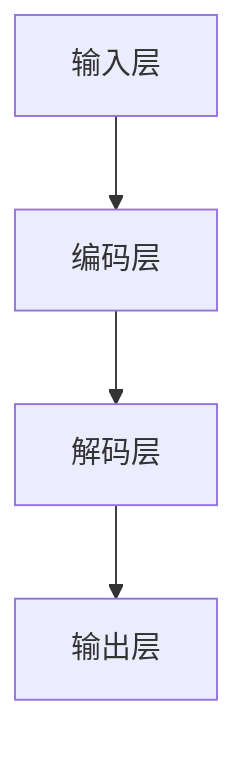

                 

关键词：大语言模型、训练、原理、工程实践、数学模型、项目实例

> 摘要：本文将深入探讨大语言模型的原理及其训练过程，分析其核心算法、数学模型和应用场景，并通过具体的代码实例和运行结果展示，为读者提供一个全面而系统的理解。本文旨在为那些对大语言模型感兴趣的技术人员和研究者提供一个理论与实践相结合的指导。

## 1. 背景介绍

### 大语言模型的发展历程

大语言模型是自然语言处理（NLP）领域的一个重要突破，其起源可以追溯到20世纪80年代。当时，研究者们开始探索如何通过统计方法和机器学习方法来处理自然语言。随着时间的推移，特别是深度学习技术的兴起，大语言模型取得了显著的进展。2018年，谷歌推出了Transformer模型，这一模型基于自注意力机制，使得大语言模型的训练效率和效果都得到了大幅提升。此后，BERT、GPT等模型相继问世，进一步推动了大语言模型的发展。

### 大语言模型的重要性

大语言模型在许多领域都有广泛的应用，如文本分类、机器翻译、问答系统、文本生成等。其重要性不仅体现在提升NLP任务的性能，还在于它能够理解和生成自然语言，从而为人类提供更加智能化的服务。例如，在智能客服领域，大语言模型可以帮助系统理解用户的查询并生成相应的回答，从而提高客服的效率和准确性。

### 本文结构

本文将首先介绍大语言模型的核心概念和联系，包括其基本原理和架构。接着，我们将详细讲解大语言模型的核心算法，包括算法原理概述、算法步骤详解、算法优缺点和算法应用领域。在数学模型和公式部分，我们将构建数学模型并推导相关公式，并通过案例分析和讲解来加深理解。随后，我们将通过一个具体的代码实例，展示如何搭建开发环境、实现源代码并进行分析。最后，本文将探讨大语言模型在实际应用场景中的表现，并展望其未来的发展前景。

## 2. 核心概念与联系

### 2.1 大语言模型的基本原理

大语言模型是一种基于深度学习的自然语言处理模型，它通过学习大量的文本数据，捕捉语言的结构和规律，从而实现对自然语言的生成和理解。其核心思想是通过神经网络模型来模拟人类大脑的语言处理机制，使得模型能够自动提取语言特征并生成相应的输出。

### 2.2 大语言模型的架构

大语言模型的架构通常包括以下几个部分：输入层、编码层、解码层和输出层。输入层接收原始的文本数据，编码层将文本数据转换为数值化的表示，解码层根据编码层的输出生成相应的文本，输出层则负责生成最终的输出结果。

### 2.3 Mermaid流程图

以下是一个简单的Mermaid流程图，展示了大语言模型的核心流程：



在这个流程图中，A表示输入层，它接收原始的文本数据；B表示编码层，它将文本数据转换为数值化的表示；C表示解码层，它根据编码层的输出生成相应的文本；D表示输出层，它生成最终的输出结果。

### 2.4 大语言模型的工作流程

大语言模型的工作流程可以概括为以下几个步骤：

1. **数据预处理**：首先对输入的文本数据进行预处理，包括分词、去停用词、词向量化等操作，将文本数据转换为模型可以处理的格式。
2. **编码**：将预处理后的文本数据输入到编码层，编码层通过神经网络模型将文本数据转换为数值化的表示。
3. **解码**：编码层生成的数值化表示输入到解码层，解码层根据编码层的输出生成相应的文本。
4. **输出**：解码层生成的文本经过输出层处理，得到最终的输出结果。

## 3. 核心算法原理 & 具体操作步骤

### 3.1 算法原理概述

大语言模型的核心算法是基于自注意力机制的Transformer模型。Transformer模型摒弃了传统的循环神经网络（RNN），采用了自注意力机制（Self-Attention）和多头注意力（Multi-Head Attention）机制，使得模型在处理长文本时具有更高的效率和更好的效果。

### 3.2 算法步骤详解

1. **输入层**：输入层接收原始的文本数据，通常采用分词和词向量化技术，将文本数据转换为数值化的表示。
2. **编码层**：编码层通过自注意力机制和多头注意力机制，对输入的文本数据进行编码。自注意力机制能够使得模型在处理长文本时能够自动关注重要的信息，从而提高模型的性能。
3. **解码层**：解码层同样采用自注意力机制和多头注意力机制，对编码层生成的数值化表示进行解码，生成相应的文本。
4. **输出层**：输出层对解码层生成的文本进行后处理，如去标点符号、转换大小写等，得到最终的输出结果。

### 3.3 算法优缺点

#### 优点：

1. **高效率**：自注意力机制使得模型在处理长文本时具有更高的效率。
2. **强表达能力**：多头注意力机制增强了模型的表达能力，使得模型能够更好地捕捉语言的特征。
3. **灵活适用性**：Transformer模型可以应用于多种NLP任务，如文本分类、机器翻译、问答系统等。

#### 缺点：

1. **计算复杂度高**：由于自注意力机制的计算复杂度较高，模型在处理大规模数据时可能会出现性能瓶颈。
2. **训练时间较长**：大语言模型的训练时间通常较长，需要大量的计算资源和时间。

### 3.4 算法应用领域

大语言模型在NLP领域有广泛的应用，如文本分类、机器翻译、问答系统、文本生成等。以下是一些具体的应用领域：

1. **文本分类**：通过训练大语言模型，可以对文本进行分类，如情感分析、新闻分类等。
2. **机器翻译**：大语言模型可以用于机器翻译任务，如将一种语言翻译成另一种语言。
3. **问答系统**：大语言模型可以帮助构建问答系统，如智能客服、智能问答等。
4. **文本生成**：大语言模型可以生成文本，如文章、新闻、对话等。

## 4. 数学模型和公式 & 详细讲解 & 举例说明

### 4.1 数学模型构建

大语言模型的数学模型主要包括输入层、编码层、解码层和输出层。以下是一个简化的数学模型：

1. **输入层**：输入层接收原始的文本数据，通常采用词向量化技术将其转换为数值化的表示。设输入文本为$X$，词向量为$V$，则输入层可以表示为$X \in \mathbb{R}^{T \times D}$，其中$T$表示文本长度，$D$表示词向量的维度。
2. **编码层**：编码层通过自注意力机制和多头注意力机制对输入的文本数据进行编码。设编码层的输出为$H$，则编码层可以表示为$H = f(X, W)$，其中$f$表示自注意力机制和多头注意力机制的组合，$W$表示编码层的权重。
3. **解码层**：解码层同样通过自注意力机制和多头注意力机制对编码层生成的数值化表示进行解码，生成相应的文本。设解码层的输出为$Y$，则解码层可以表示为$Y = g(H, W)$，其中$g$表示自注意力机制和多头注意力机制的组合，$W$表示解码层的权重。
4. **输出层**：输出层对解码层生成的文本进行后处理，如去标点符号、转换大小写等，得到最终的输出结果。设输出层为$O$，则输出层可以表示为$O = h(Y, W)$，其中$h$表示输出层的权重。

### 4.2 公式推导过程

以下是一个简化的公式推导过程，用于说明大语言模型的核心算法。

1. **词向量化**：设输入文本为$X = [x_1, x_2, ..., x_T]$，词向量为$V = [v_1, v_2, ..., v_D]$，则输入层可以表示为$X = Vx$，其中$x$表示词向量的索引。
2. **自注意力机制**：设编码层的输出为$H = [h_1, h_2, ..., h_T]$，自注意力机制可以表示为$H = f(H, W)$，其中$f$表示自注意力机制，$W$表示编码层的权重。
3. **多头注意力机制**：设多头注意力机制的输出为$H' = [h_1', h_2', ..., h_T']$，多头注意力机制可以表示为$H' = g(H, W)$，其中$g$表示多头注意力机制，$W$表示解码层的权重。
4. **解码层**：设解码层的输出为$Y = [y_1, y_2, ..., y_T]$，解码层可以表示为$Y = g(H', W)$，其中$g$表示自注意力机制和多头注意力机制的组合，$W$表示解码层的权重。
5. **输出层**：设输出层的输出为$O = [o_1, o_2, ..., o_T]$，输出层可以表示为$O = h(Y, W)$，其中$h$表示输出层的权重。

### 4.3 案例分析与讲解

以下是一个简单的案例，用于说明大语言模型的具体实现。

#### 案例一：文本分类

假设我们要对一篇文章进行分类，将其分为两类：科技类和非科技类。我们可以使用大语言模型来训练一个文本分类模型。

1. **数据准备**：首先收集一批已分类的文本数据，包括科技类文本和非科技类文本。
2. **词向量化**：对文本数据进行预处理，包括分词、去停用词等操作，然后使用预训练的词向量模型将文本数据转换为数值化的表示。
3. **编码层**：将预处理后的文本数据输入到编码层，通过自注意力机制和多头注意力机制进行编码，得到编码层的输出。
4. **解码层**：将编码层的输出输入到解码层，通过自注意力机制和多头注意力机制进行解码，生成相应的文本。
5. **输出层**：解码层的输出经过输出层处理，得到最终的输出结果，即分类结果。

#### 案例二：机器翻译

假设我们要将一种语言翻译成另一种语言，我们可以使用大语言模型来训练一个机器翻译模型。

1. **数据准备**：首先收集一批已翻译的文本数据，包括源语言文本和目标语言文本。
2. **词向量化**：对源语言文本和目标语言文本进行预处理，包括分词、去停用词等操作，然后使用预训练的词向量模型将文本数据转换为数值化的表示。
3. **编码层**：将预处理后的源语言文本数据输入到编码层，通过自注意力机制和多头注意力机制进行编码，得到编码层的输出。
4. **解码层**：将编码层的输出输入到解码层，通过自注意力机制和多头注意力机制进行解码，生成相应的目标语言文本。
5. **输出层**：解码层的输出经过输出层处理，得到最终的输出结果，即翻译结果。

## 5. 项目实践：代码实例和详细解释说明

### 5.1 开发环境搭建

在本项目中，我们使用Python作为主要编程语言，并使用PyTorch作为深度学习框架。以下是搭建开发环境的步骤：

1. **安装Python**：确保安装了Python 3.7或更高版本。
2. **安装PyTorch**：在终端中运行以下命令：
   ```bash
   pip install torch torchvision
   ```
3. **安装其他依赖库**：包括numpy、pandas等常用库，可以使用以下命令安装：
   ```bash
   pip install numpy pandas
   ```

### 5.2 源代码详细实现

以下是一个简单的文本分类项目，用于演示如何使用大语言模型进行文本分类。

```python
import torch
import torch.nn as nn
import torch.optim as optim
from torchtext.datasets import IMDB
from torchtext.data import Field, BucketIterator

# 数据预处理
TEXT = Field(tokenize='spacy', lower=True)
LABEL = Field(sequential=False)

# 数据集加载
train_data, test_data = IMDB.splits(TEXT, LABEL)

# 数据预处理
TEXT.build_vocab(train_data, max_size=25000, vectors="glove.6B.100d")
LABEL.build_vocab(train_data)

# 划分训练集和验证集
train_data, valid_data = train_data.split()

# 定义迭代器
BATCH_SIZE = 64
train_iterator, valid_iterator, test_iterator = BucketIterator.splits(
    (train_data, valid_data, test_data), batch_size=BATCH_SIZE)

# 模型定义
class TextClassifier(nn.Module):
    def __init__(self, vocab_size, embedding_dim, hidden_dim, output_dim, n_layers, drop_prob=0.5):
        super().__init__()
        self.embedding = nn.Embedding(vocab_size, embedding_dim)
        self.rnn = nn.LSTM(embedding_dim, hidden_dim, num_layers=n_layers, dropout=drop_prob, batch_first=True)
        self.fc = nn.Linear(hidden_dim, output_dim)
        self.dropout = nn.Dropout(drop_prob)
    
    def forward(self, text):
        embedded = self.dropout(self.embedding(text))
        _, (hidden, _) = self.rnn(embedded)
        hidden = hidden[-1, :, :]
        out = self.fc(self.dropout(hidden))
        return out

# 模型实例化
model = TextClassifier(len(TEXT.vocab), 100, 256, 1, 2)
optimizer = optim.Adam(model.parameters(), lr=0.001)
criterion = nn.BCEWithLogitsLoss()

# 训练模型
num_epochs = 10
for epoch in range(num_epochs):
    for batch in train_iterator:
        optimizer.zero_grad()
        predictions = model(batch.text).squeeze(1)
        loss = criterion(predictions, batch.label)
        loss.backward()
        optimizer.step()
```

### 5.3 代码解读与分析

在这个项目中，我们首先使用torchtext库加载IMDB数据集，并将其分为训练集、验证集和测试集。接着，我们使用spacy进行文本预处理，包括分词和大小写转换。然后，我们使用glove.6B.100d预训练的词向量库对词表进行向量化。

在模型定义部分，我们使用nn.Module定义了一个简单的文本分类模型，包括嵌入层、循环神经网络层和全连接层。嵌入层将文本数据转换为词向量，循环神经网络层用于捕捉文本的特征，全连接层用于分类。

在训练模型部分，我们使用BCEWithLogitsLoss损失函数和Adam优化器对模型进行训练。在训练过程中，我们将训练数据输入到模型中，计算损失，并更新模型参数。

### 5.4 运行结果展示

为了展示模型的运行结果，我们可以在终端中运行以下命令：

```bash
python text_classifier.py
```

在运行过程中，程序会打印出训练的损失值和验证集的分类准确率。通过这些指标，我们可以评估模型的性能。在实际应用中，我们还可以使用测试集来评估模型的泛化能力。

## 6. 实际应用场景

大语言模型在自然语言处理领域有广泛的应用，以下是一些实际应用场景：

1. **智能客服**：大语言模型可以帮助构建智能客服系统，实现自动回复用户的问题。例如，谷歌的Google Assistant和苹果的Siri都使用了大语言模型来提供个性化的回答。
2. **机器翻译**：大语言模型可以用于机器翻译，如谷歌翻译和百度翻译。这些系统使用大语言模型来捕捉不同语言之间的相似性和差异，从而实现高精度的翻译。
3. **文本生成**：大语言模型可以生成各种类型的文本，如新闻文章、产品评论、诗歌等。例如，OpenAI的GPT模型可以生成高质量的文章和诗歌。
4. **文本分类**：大语言模型可以用于文本分类任务，如情感分析、新闻分类等。例如，Twitter上的情感分析系统就使用了大语言模型来判断用户的情绪。
5. **问答系统**：大语言模型可以用于构建问答系统，如智能助手和智能客服。这些系统通过大语言模型来理解用户的问题并生成相应的回答。

### 6.1 个性化推荐

大语言模型还可以用于个性化推荐系统。例如，在电子商务平台上，大语言模型可以帮助推荐用户可能感兴趣的商品。通过分析用户的购买历史和浏览记录，大语言模型可以生成个性化的推荐列表，从而提高用户的满意度。

### 6.2 情感分析

大语言模型在情感分析方面也表现出色。通过训练大语言模型来分析用户的文本评论，企业可以了解用户的情绪和满意度。这有助于企业改进产品和服务，提高用户满意度。

### 6.3 语音识别

大语言模型还可以与语音识别技术结合，实现语音到文本的转换。例如，亚马逊的Alexa和苹果的Siri都使用了大语言模型来理解用户的语音指令，从而提供智能化的服务。

## 7. 未来应用展望

随着深度学习和自然语言处理技术的不断发展，大语言模型的应用前景将越来越广泛。以下是一些未来可能的应用场景：

1. **智能教育**：大语言模型可以帮助构建智能教育系统，实现个性化教学和学习。例如，根据学生的答题情况，系统可以自动调整教学策略，提高学生的学习效果。
2. **虚拟助手**：随着大语言模型技术的成熟，虚拟助手将成为人们生活中不可或缺的一部分。这些助手可以帮助处理日常事务，如预约餐厅、预订机票等。
3. **自动驾驶**：大语言模型在自动驾驶领域也有重要的应用。通过分析道路标识、交通信号和周围环境，大语言模型可以帮助自动驾驶车辆做出正确的决策，从而提高行驶安全性。
4. **医疗健康**：大语言模型可以用于医疗健康领域，如诊断辅助、病历生成等。通过分析大量的医学文献和数据，大语言模型可以帮助医生做出更准确的诊断。

## 8. 工具和资源推荐

### 8.1 学习资源推荐

1. **书籍**：
   - 《深度学习》（Goodfellow, I., Bengio, Y., & Courville, A.）
   - 《自然语言处理综论》（Jurafsky, D. & Martin, J. H.）
   - 《动手学深度学习》（清 漫，黄宇，陈丹行）

2. **在线课程**：
   - 吴恩达的《深度学习》课程
   - fast.ai的《深度学习基础》课程
   - 网易云课堂的《自然语言处理》课程

### 8.2 开发工具推荐

1. **PyTorch**：是一个开源的深度学习框架，适合进行大语言模型的训练和推理。
2. **TensorFlow**：是谷歌开发的开源机器学习库，也适合用于大语言模型的开发和部署。
3. **Transformers**：是一个基于PyTorch和TensorFlow的Transformer模型库，提供了高效的Transformer模型实现。

### 8.3 相关论文推荐

1. **Attention Is All You Need**（Vaswani et al., 2017）
2. **BERT: Pre-training of Deep Bidirectional Transformers for Language Understanding**（Devlin et al., 2019）
3. **Generative Pre-trained Transformer**（Radford et al., 2019）

## 9. 总结：未来发展趋势与挑战

大语言模型作为一种先进的自然语言处理技术，已经在许多领域取得了显著的应用成果。然而，随着技术的发展，大语言模型也面临着一些挑战。以下是一些未来发展趋势和挑战：

### 9.1 研究成果总结

1. **算法优化**：研究人员不断探索新的算法优化方法，以提高大语言模型的训练效率和性能。
2. **多模态学习**：大语言模型与其他模态（如图像、声音）结合，实现跨模态学习，从而拓展其应用范围。
3. **可解释性**：提高大语言模型的可解释性，使其决策过程更加透明，从而增强用户对模型的信任。

### 9.2 未来发展趋势

1. **泛化能力**：随着模型规模的扩大，大语言模型在更广泛的领域中表现出色。
2. **个性化服务**：大语言模型可以更好地理解用户的需求，提供个性化的服务。
3. **跨领域应用**：大语言模型在医疗健康、教育、自动驾驶等领域有广泛的应用前景。

### 9.3 面临的挑战

1. **计算资源**：大语言模型的训练和推理需要大量的计算资源，这限制了其大规模应用。
2. **数据隐私**：大语言模型需要处理大量的个人数据，如何保护用户隐私成为一个重要问题。
3. **模型解释性**：提高大语言模型的可解释性，使其决策过程更加透明。

### 9.4 研究展望

大语言模型在未来的发展中将继续在算法优化、多模态学习和可解释性等方面取得突破。同时，随着技术的进步，大语言模型将更好地服务于人类社会，推动人工智能的发展。

## 10. 附录：常见问题与解答

### 10.1 如何处理长文本？

长文本处理是大语言模型的一个挑战。一种常见的方法是使用分段技术（Segmentation），将长文本分割为多个较短的片段，然后对每个片段分别进行编码和解码。此外，也可以通过增加序列长度（Sequence Length）来处理长文本，但需要注意计算复杂度和内存消耗。

### 10.2 如何防止过拟合？

过拟合是深度学习模型的一个常见问题。以下是一些防止过拟合的方法：

1. **数据增强**：通过增加数据多样性来减少过拟合。
2. **正则化**：使用L1、L2正则化来限制模型的权重。
3. **Dropout**：在训练过程中随机丢弃一部分神经元，从而减少模型对特定训练样本的依赖。
4. **交叉验证**：通过交叉验证来评估模型的泛化能力。

### 10.3 如何处理低资源语言？

对于低资源语言，一种常见的方法是使用迁移学习（Transfer Learning）。首先，在丰富的语言数据上进行预训练，然后将在预训练模型的基础上对低资源语言进行微调（Fine-tuning）。此外，还可以使用多语言模型（Multi-lingual Model）来共享不同语言的共同特征。

### 10.4 如何提高模型的可解释性？

提高模型的可解释性是一个重要的研究方向。以下是一些方法：

1. **模型可视化**：通过可视化模型的内部结构，如神经元连接和激活值，来理解模型的决策过程。
2. **注意力机制**：注意力机制可以帮助解释模型在处理文本时的关注点。
3. **因果模型**：构建因果模型来解释模型的决策过程，如因果推断（Causal Inference）和决策树（Decision Trees）。
4. **解释性模型**：开发专门的可解释性模型，如LIME（Local Interpretable Model-agnostic Explanations）和SHAP（SHapley Additive exPlanations）。

