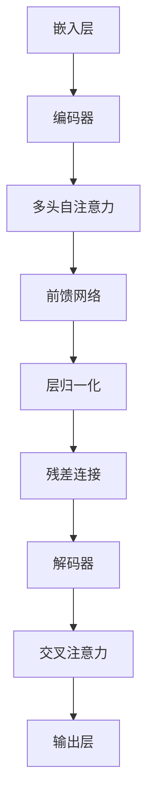

                 

关键词：大语言模型、推理工程、机器学习、深度学习、神经网络、自然语言处理、优化、性能调优、工程实践、代码实例

## 摘要

本文旨在深入探讨大语言模型（Large Language Model）的原理及其在推理工程中的综合实践。大语言模型作为自然语言处理领域的一项重要技术，其在文本生成、翻译、问答系统等应用场景中发挥了巨大作用。本文首先介绍大语言模型的基础概念，然后详细讲解其核心算法原理和具体操作步骤，并通过数学模型和公式进行详细讲解。接着，文章通过一个具体的项目实践，展示如何实现大语言模型推理工程，并对代码进行解读与分析。最后，文章探讨了实际应用场景、未来应用展望以及面临的研究挑战，为读者提供了全面的指导和建议。

## 1. 背景介绍

### 1.1 大语言模型的发展历程

大语言模型的发展经历了几个重要阶段。最早的大语言模型可以追溯到20世纪80年代，当时研究者们开始尝试使用神经网络进行文本生成。然而，由于计算资源和数据限制，这些模型的效果并不理想。

随着计算能力的提升和大数据的涌现，大语言模型的研究逐渐取得了突破性进展。2018年，谷歌提出了Transformer模型，彻底改变了自然语言处理领域的格局。Transformer模型利用自注意力机制，实现了对文本的全局依赖建模，使得大语言模型在文本生成、翻译等任务中表现出了惊人的效果。

近年来，随着模型的规模不断扩大，预训练技术逐渐成为大语言模型的主流。预训练技术通过在大规模语料上进行预训练，然后针对具体任务进行微调，大大提高了模型的性能和泛化能力。这一技术的出现，标志着大语言模型进入了一个新的发展阶段。

### 1.2 大语言模型的应用场景

大语言模型在众多应用场景中展现出了强大的能力。以下是一些典型的应用场景：

- **文本生成**：大语言模型可以生成各种类型的文本，如文章、故事、诗歌等。这些生成文本在内容创作、广告文案、新闻摘要等领域有着广泛的应用。
- **机器翻译**：大语言模型在机器翻译领域取得了显著的成果。通过预训练和微调，大语言模型可以生成高质量的翻译文本，大大提高了翻译的准确性和流畅性。
- **问答系统**：大语言模型可以用于构建问答系统，通过对用户问题的理解，生成准确的答案。这种技术被广泛应用于客服系统、智能助手等领域。
- **对话系统**：大语言模型可以用于构建智能对话系统，通过理解和生成自然语言，实现与用户的实时交互。这种技术被应用于虚拟助手、智能客服等领域。
- **情感分析**：大语言模型可以用于情感分析，通过对文本的情感倾向进行判断，帮助企业了解用户的需求和反馈，优化产品和服务。

### 1.3 大语言模型的优势与挑战

大语言模型具有以下几个显著优势：

- **强大的语言理解能力**：大语言模型通过预训练，可以学习到丰富的语言知识，从而实现高效的文本理解和生成。
- **灵活的任务适应能力**：大语言模型通过微调，可以适应不同的任务需求，实现跨领域的知识迁移。
- **高性能的计算能力**：随着计算资源的提升，大语言模型可以在较短的时间内完成大规模的文本处理任务。

然而，大语言模型也面临着一些挑战：

- **计算资源消耗**：大语言模型通常需要大量的计算资源和存储空间，这对硬件设备和运维提出了较高的要求。
- **数据隐私问题**：大语言模型在训练和推理过程中，需要处理大量的敏感数据，如何保护用户隐私成为了一个重要问题。
- **解释性不足**：大语言模型作为一个黑盒模型，其内部机制不够透明，难以进行解释和验证。

## 2. 核心概念与联系

### 2.1 大语言模型的概念

大语言模型（Large Language Model）是一种基于深度学习的自然语言处理模型，通过在大规模语料上进行预训练，可以学习到丰富的语言知识和结构。大语言模型的核心目标是理解和生成自然语言，从而实现各种语言处理任务。

### 2.2 大语言模型的原理

大语言模型的原理主要基于深度学习和自然语言处理技术。具体来说，大语言模型由以下几个核心组件组成：

- **嵌入层（Embedding Layer）**：嵌入层将输入的文本转化为向量表示，为后续的神经网络处理提供输入。
- **编码器（Encoder）**：编码器通常采用多层神经网络结构，通过自注意力机制（Self-Attention Mechanism）对输入文本进行编码，生成全局依赖表示。
- **解码器（Decoder）**：解码器通过自注意力机制和交叉注意力机制（Cross-Attention Mechanism）对编码器的输出进行解码，生成输出文本。

### 2.3 大语言模型的架构

大语言模型的架构通常采用 Transformer 模型，其核心架构包括：

- **多头自注意力（Multi-Head Self-Attention）**：多头自注意力机制可以捕捉输入文本中的长距离依赖关系。
- **前馈网络（Feed Forward Network）**：前馈网络用于对自注意力层的输出进行非线性变换。
- **层归一化（Layer Normalization）**：层归一化可以加速模型的训练，提高模型的稳定性。
- **残差连接（Residual Connection）**：残差连接可以缓解训练过程中的梯度消失和梯度爆炸问题。

### 2.4 大语言模型的联系

大语言模型与其他自然语言处理技术有着密切的联系。例如，大语言模型可以与词性标注、命名实体识别、情感分析等任务相结合，实现更复杂的语言处理任务。此外，大语言模型还可以与其他深度学习模型（如图像识别、语音识别等）相结合，实现跨模态学习。

### 2.5 大语言模型的 Mermaid 流程图

下面是一个大语言模型的核心概念和架构的 Mermaid 流程图：



## 3. 核心算法原理 & 具体操作步骤

### 3.1 算法原理概述

大语言模型的核心算法是基于 Transformer 模型。Transformer 模型采用自注意力机制（Self-Attention Mechanism）和多头注意力（Multi-Head Attention）机制，可以捕捉输入文本中的长距离依赖关系。具体来说，Transformer 模型由编码器（Encoder）和解码器（Decoder）两部分组成。编码器通过自注意力机制对输入文本进行编码，生成全局依赖表示；解码器通过自注意力机制和交叉注意力机制对编码器的输出进行解码，生成输出文本。

### 3.2 算法步骤详解

#### 3.2.1 编码器（Encoder）

编码器由多个编码层（Encoder Layer）组成，每个编码层包含两个主要组件：多头自注意力（Multi-Head Self-Attention）和前馈网络（Feed Forward Network）。

1. **多头自注意力（Multi-Head Self-Attention）**：
   自注意力机制可以捕捉输入文本中的长距离依赖关系。多头注意力机制通过多个独立的自注意力层，提高了模型的表示能力。具体步骤如下：

   - **计算 Query、Key 和 Value**：
     对编码器的输入文本进行线性变换，分别得到 Query、Key 和 Value。公式如下：
     $$ 
     \text{Query} = E_{query} \cdot \text{Input} \\
     \text{Key} = E_{key} \cdot \text{Input} \\
     \text{Value} = E_{value} \cdot \text{Input}
     $$
     其中，$E_{query}$、$E_{key}$ 和 $E_{value}$ 分别表示 Query、Key 和 Value 的线性变换权重。

   - **计算注意力得分（Attention Score）**：
     计算 Query 和 Key 之间的注意力得分，公式如下：
     $$
     \text{Attention Score} = \text{softmax}\left(\frac{\text{Query} \cdot \text{Key}^{T}}{\sqrt{d_k}}\right)
     $$
     其中，$d_k$ 表示 Key 向量的维度。

   - **计算注意力权重（Attention Weight）**：
     根据 Attention Score 计算注意力权重，公式如下：
     $$
     \text{Attention Weight} = \text{softmax}(\text{Attention Score})
     $$

   - **计算注意力输出（Attention Output）**：
     根据 Attention Weight 计算注意力输出，公式如下：
     $$
     \text{Attention Output} = \sum_{i} \text{Attention Weight}_i \cdot \text{Value}
     $$

   2. **前馈网络（Feed Forward Network）**：
      前馈网络用于对自注意力层的输出进行非线性变换。具体步骤如下：

      - **计算前馈网络的输入**：
        对自注意力层的输出进行线性变换，得到前馈网络的输入：
        $$
        \text{Input} = E_f \cdot \text{Input} + b_f
        $$
        其中，$E_f$ 和 $b_f$ 分别表示前馈网络的线性变换权重和偏置。

      - **计算前馈网络的输出**：
        对前馈网络的输入进行非线性变换，得到前馈网络的输出：
        $$
        \text{Output} = \text{ReLU}(E_f \cdot \text{Input} + b_f)
        $$

#### 3.2.2 解码器（Decoder）

解码器由多个解码层（Decoder Layer）组成，每个解码层包含两个主要组件：多头自注意力（Multi-Head Self-Attention）和交叉注意力（Cross-Attention）。

1. **多头自注意力（Multi-Head Self-Attention）**：
   与编码器中的自注意力机制类似，解码器中的多头自注意力机制可以捕捉输入文本中的长距离依赖关系。

2. **交叉注意力（Cross-Attention）**：
   交叉注意力机制用于计算解码器的输入与编码器的输出之间的注意力权重，从而实现解码器对编码器输出的依赖关系建模。具体步骤如下：

   - **计算 Query、Key 和 Value**：
     对解码器的输入文本进行线性变换，分别得到 Query、Key 和 Value。公式如下：
     $$
     \text{Query} = E_{query} \cdot \text{Input} \\
     \text{Key} = E_{key} \cdot \text{Encoder Output} \\
     \text{Value} = E_{value} \cdot \text{Encoder Output}
     $$
     其中，$E_{query}$、$E_{key}$ 和 $E_{value}$ 分别表示 Query、Key 和 Value 的线性变换权重。

   - **计算注意力得分（Attention Score）**：
     计算 Query 和 Key 之间的注意力得分，公式如下：
     $$
     \text{Attention Score} = \text{softmax}\left(\frac{\text{Query} \cdot \text{Key}^{T}}{\sqrt{d_k}}\right)
     $$
     其中，$d_k$ 表示 Key 向量的维度。

   - **计算注意力权重（Attention Weight）**：
     根据 Attention Score 计算注意力权重，公式如下：
     $$
     \text{Attention Weight} = \text{softmax}(\text{Attention Score})
     $$

   - **计算注意力输出（Attention Output）**：
     根据 Attention Weight 计算注意力输出，公式如下：
     $$
     \text{Attention Output} = \sum_{i} \text{Attention Weight}_i \cdot \text{Value}
     $$

3. **前馈网络（Feed Forward Network）**：
   前馈网络用于对交叉注意力层的输出进行非线性变换。具体步骤与编码器中的前馈网络类似。

### 3.3 算法优缺点

#### 优点

- **强大的语言理解能力**：大语言模型通过预训练，可以学习到丰富的语言知识，从而实现高效的文本理解和生成。
- **灵活的任务适应能力**：大语言模型通过微调，可以适应不同的任务需求，实现跨领域的知识迁移。
- **高性能的计算能力**：随着计算资源的提升，大语言模型可以在较短的时间内完成大规模的文本处理任务。

#### 缺点

- **计算资源消耗**：大语言模型通常需要大量的计算资源和存储空间，这对硬件设备和运维提出了较高的要求。
- **数据隐私问题**：大语言模型在训练和推理过程中，需要处理大量的敏感数据，如何保护用户隐私成为了一个重要问题。
- **解释性不足**：大语言模型作为一个黑盒模型，其内部机制不够透明，难以进行解释和验证。

### 3.4 算法应用领域

大语言模型在多个领域都展现出了强大的应用潜力：

- **文本生成**：大语言模型可以生成各种类型的文本，如文章、故事、诗歌等。这些生成文本在内容创作、广告文案、新闻摘要等领域有着广泛的应用。
- **机器翻译**：大语言模型在机器翻译领域取得了显著的成果。通过预训练和微调，大语言模型可以生成高质量的翻译文本，大大提高了翻译的准确性和流畅性。
- **问答系统**：大语言模型可以用于构建问答系统，通过对用户问题的理解，生成准确的答案。这种技术被广泛应用于客服系统、智能助手等领域。
- **对话系统**：大语言模型可以用于构建智能对话系统，通过理解和生成自然语言，实现与用户的实时交互。这种技术被应用于虚拟助手、智能客服等领域。
- **情感分析**：大语言模型可以用于情感分析，通过对文本的情感倾向进行判断，帮助企业了解用户的需求和反馈，优化产品和服务。

## 4. 数学模型和公式 & 详细讲解 & 举例说明

### 4.1 数学模型构建

大语言模型的数学模型主要包括嵌入层（Embedding Layer）、编码器（Encoder）、解码器（Decoder）以及注意力机制（Attention Mechanism）。下面分别介绍这些模型的数学公式。

#### 4.1.1 嵌入层（Embedding Layer）

嵌入层将输入的文本转化为向量表示，为后续的神经网络处理提供输入。假设输入的文本为 $X \in \mathbb{R}^{n \times d}$，其中 $n$ 表示文本长度，$d$ 表示词向量维度。嵌入层的数学模型如下：

$$
\text{Embedding}(X) = E \cdot X + b_e
$$

其中，$E \in \mathbb{R}^{d \times V}$ 表示嵌入权重矩阵，$b_e \in \mathbb{R}^{d}$ 表示嵌入层的偏置。

#### 4.1.2 编码器（Encoder）

编码器由多个编码层（Encoder Layer）组成，每个编码层包含两个主要组件：多头自注意力（Multi-Head Self-Attention）和前馈网络（Feed Forward Network）。假设编码器的输入为 $X \in \mathbb{R}^{n \times d}$，编码器的输出为 $H \in \mathbb{R}^{n \times d}$。

1. **多头自注意力（Multi-Head Self-Attention）**

   自注意力机制可以捕捉输入文本中的长距离依赖关系。多头注意力机制通过多个独立的自注意力层，提高了模型的表示能力。假设每个头（Head）的维度为 $h$，则多头自注意力的数学模型如下：

   $$ 
   \text{Multi-Head Self-Attention}(X) = \text{Concat}(\text{Head}_1, \text{Head}_2, \ldots, \text{Head}_h) \\
   \text{where} \ \text{Head}_i = \text{softmax}\left(\frac{\text{Query}_i \cdot \text{Key}_i^{T}}{\sqrt{d_k}}\right) \cdot \text{Value}_i
   $$

   其中，$i$ 表示第 $i$ 个头，$d_k$ 表示 Key 向量的维度。

2. **前馈网络（Feed Forward Network）**

   前馈网络用于对自注意力层的输出进行非线性变换。具体步骤如下：

   $$ 
   \text{Feed Forward Network}(X) = \text{ReLU}(\text{Weight}_2 \cdot \text{ReLU}(\text{Weight}_1 \cdot X + b_1))
   $$

   其中，$\text{Weight}_1 \in \mathbb{R}^{d \times d'}$ 和 $\text{Weight}_2 \in \mathbb{R}^{d' \times d}$ 分别表示前馈网络的线性变换权重，$b_1 \in \mathbb{R}^{d'}$ 和 $b_2 \in \mathbb{R}^{d}$ 分别表示前馈网络的偏置。

#### 4.1.3 解码器（Decoder）

解码器由多个解码层（Decoder Layer）组成，每个解码层包含两个主要组件：多头自注意力（Multi-Head Self-Attention）和交叉注意力（Cross-Attention）。假设解码器的输入为 $X \in \mathbb{R}^{n \times d}$，解码器的输出为 $Y \in \mathbb{R}^{n \times d'}$。

1. **多头自注意力（Multi-Head Self-Attention）**

   与编码器中的自注意力机制类似，解码器中的多头自注意力机制可以捕捉输入文本中的长距离依赖关系。

2. **交叉注意力（Cross-Attention）**

   交叉注意力机制用于计算解码器的输入与编码器的输出之间的注意力权重，从而实现解码器对编码器输出的依赖关系建模。具体步骤如下：

   $$ 
   \text{Cross-Attention}(X, H) = \text{softmax}\left(\frac{\text{Query} \cdot \text{Key}^{T}}{\sqrt{d_k}}\right) \cdot \text{Value} \\
   \text{where} \ \text{Query} = E_{query} \cdot X, \ \text{Key} = E_{key} \cdot H, \ \text{Value} = E_{value} \cdot H
   $$

   其中，$E_{query}$、$E_{key}$ 和 $E_{value}$ 分别表示 Query、Key 和 Value 的线性变换权重。

3. **前馈网络（Feed Forward Network）**

   前馈网络用于对交叉注意力层的输出进行非线性变换。具体步骤与编码器中的前馈网络类似。

### 4.2 公式推导过程

在介绍完大语言模型的数学模型后，我们将对部分关键公式进行推导。

#### 4.2.1 自注意力机制

自注意力机制的推导主要涉及以下三个部分：计算 Query、Key 和 Value，计算注意力得分和注意力权重，计算注意力输出。

1. **计算 Query、Key 和 Value**

   假设输入的文本为 $X \in \mathbb{R}^{n \times d}$，其中每个词的表示为 $X_i \in \mathbb{R}^{d}$。首先，对输入的文本进行线性变换，得到 Query、Key 和 Value：

   $$
   \text{Query} = E_{query} \cdot X = [q_1, q_2, \ldots, q_n] \in \mathbb{R}^{n \times d} \\
   \text{Key} = E_{key} \cdot X = [k_1, k_2, \ldots, k_n] \in \mathbb{R}^{n \times d} \\
   \text{Value} = E_{value} \cdot X = [v_1, v_2, \ldots, v_n] \in \mathbb{R}^{n \times d}
   $$

   其中，$E_{query}$、$E_{key}$ 和 $E_{value}$ 分别表示 Query、Key 和 Value 的线性变换权重。

2. **计算注意力得分（Attention Score）**

   接下来，计算 Query 和 Key 之间的注意力得分。假设 Key 向量的维度为 $d_k$，则注意力得分的计算公式如下：

   $$
   \text{Attention Score}_{ij} = \text{softmax}\left(\frac{\text{Query}_i \cdot \text{Key}_j^{T}}{\sqrt{d_k}}\right)
   $$

   其中，$\text{Attention Score}_{ij}$ 表示第 $i$ 个词与第 $j$ 个词之间的注意力得分。

3. **计算注意力权重（Attention Weight）**

   根据 Attention Score 计算注意力权重。注意力权重的计算公式如下：

   $$
   \text{Attention Weight}_{ij} = \text{softmax}(\text{Attention Score}_{ij})
   $$

   其中，$\text{Attention Weight}_{ij}$ 表示第 $i$ 个词与第 $j$ 个词之间的注意力权重。

4. **计算注意力输出（Attention Output）**

   根据 Attention Weight 计算注意力输出。注意力输出的计算公式如下：

   $$
   \text{Attention Output}_{i} = \sum_{j=1}^{n} \text{Attention Weight}_{ij} \cdot \text{Value}_j
   $$

   其中，$\text{Attention Output}_{i}$ 表示第 $i$ 个词的注意力输出。

#### 4.2.2 交叉注意力机制

交叉注意力机制的推导与自注意力机制类似，主要涉及以下三个部分：计算 Query、Key 和 Value，计算注意力得分和注意力权重，计算注意力输出。

1. **计算 Query、Key 和 Value**

   假设解码器的输入为 $X \in \mathbb{R}^{n \times d}$，编码器的输出为 $H \in \mathbb{R}^{m \times d}$。首先，对输入的文本和编码器的输出进行线性变换，得到 Query、Key 和 Value：

   $$
   \text{Query} = E_{query} \cdot X = [q_1, q_2, \ldots, q_n] \in \mathbb{R}^{n \times d} \\
   \text{Key} = E_{key} \cdot H = [k_1, k_2, \ldots, k_m] \in \mathbb{R}^{m \times d} \\
   \text{Value} = E_{value} \cdot H = [v_1, v_2, \ldots, v_m] \in \mathbb{R}^{m \times d}
   $$

   其中，$E_{query}$、$E_{key}$ 和 $E_{value}$ 分别表示 Query、Key 和 Value 的线性变换权重。

2. **计算注意力得分（Attention Score）**

   接下来，计算 Query 和 Key 之间的注意力得分。假设 Key 向量的维度为 $d_k$，则注意力得分的计算公式如下：

   $$
   \text{Attention Score}_{ij} = \text{softmax}\left(\frac{\text{Query}_i \cdot \text{Key}_j^{T}}{\sqrt{d_k}}\right)
   $$

   其中，$\text{Attention Score}_{ij}$ 表示第 $i$ 个词与第 $j$ 个词之间的注意力得分。

3. **计算注意力权重（Attention Weight）**

   根据 Attention Score 计算注意力权重。注意力权重的计算公式如下：

   $$
   \text{Attention Weight}_{ij} = \text{softmax}(\text{Attention Score}_{ij})
   $$

   其中，$\text{Attention Weight}_{ij}$ 表示第 $i$ 个词与第 $j$ 个词之间的注意力权重。

4. **计算注意力输出（Attention Output）**

   根据 Attention Weight 计算注意力输出。注意力输出的计算公式如下：

   $$
   \text{Attention Output}_{i} = \sum_{j=1}^{m} \text{Attention Weight}_{ij} \cdot \text{Value}_j
   $$

   其中，$\text{Attention Output}_{i}$ 表示第 $i$ 个词的注意力输出。

### 4.3 案例分析与讲解

下面我们通过一个具体的例子来说明大语言模型的工作原理。

#### 例子

假设我们要对一句话“我喜欢吃苹果”进行编码和解码。

1. **编码器（Encoder）**

   编码器的输入为句子“我喜欢吃苹果”，首先将其转化为词向量表示。假设词向量维度为 $d=100$，则编码器的输入可以表示为 $X \in \mathbb{R}^{5 \times 100}$，其中每个词的表示为 $X_i \in \mathbb{R}^{100}$。

   - **嵌入层（Embedding Layer）**：
     将词向量表示输入到嵌入层，得到编码器的输出：
     $$
     \text{Encoder Input} = E \cdot X + b_e
     $$
     其中，$E \in \mathbb{R}^{100 \times V}$ 表示嵌入权重矩阵，$b_e \in \mathbb{R}^{100}$ 表示嵌入层的偏置。

   - **编码层（Encoder Layer）**：
     对编码器的输入进行自注意力机制和前馈网络的变换，得到编码器的输出：
     $$
     \text{Encoder Output} = \text{Multi-Head Self-Attention}(\text{Encoder Input}) + \text{Feed Forward Network}(\text{Encoder Input})
     $$

2. **解码器（Decoder）**

   解码器的输入为句子“我喜欢吃苹果”，首先将其转化为词向量表示。假设词向量维度为 $d'=100$，则解码器的输入可以表示为 $X' \in \mathbb{R}^{5 \times 100}$，其中每个词的表示为 $X'_i \in \mathbb{R}^{100}$。

   - **嵌入层（Embedding Layer）**：
     将词向量表示输入到嵌入层，得到解码器的输入：
     $$
     \text{Decoder Input} = E' \cdot X' + b_e'
     $$
     其中，$E' \in \mathbb{R}^{100 \times V'}$ 表示嵌入权重矩阵，$b_e' \in \mathbb{R}^{100}$ 表示嵌入层的偏置。

   - **解码层（Decoder Layer）**：
     对解码器的输入进行自注意力机制、交叉注意力和前馈网络的变换，得到解码器的输出：
     $$
     \text{Decoder Output} = \text{Multi-Head Self-Attention}(\text{Decoder Input}) + \text{Cross-Attention}(\text{Encoder Output}, \text{Decoder Input}) + \text{Feed Forward Network}(\text{Decoder Input})
     $$

3. **生成文本**

   最后，通过解码器的输出，生成句子“我喜欢吃苹果”的解码结果。具体步骤如下：

   - **初始解码**：
     将解码器的输出作为初始输入，生成第一个词的解码结果。

   - **递归解码**：
     将生成的第一个词添加到解码器的输入中，重复执行自注意力机制、交叉注意力和前馈网络的变换，生成下一个词的解码结果。

   - **终止条件**：
     当生成的词序列达到终止词（如 <EOS>）时，解码过程结束。

   最终，解码器生成的文本为“我喜欢吃苹果”。

通过这个例子，我们可以看到大语言模型是如何通过编码器和解码器对句子进行编码和解码的。编码器将句子转化为向量表示，解码器根据向量表示生成句子。这一过程实现了对自然语言的理解和生成。

## 5. 项目实践：代码实例和详细解释说明

### 5.1 开发环境搭建

为了实践大语言模型推理工程，我们需要搭建一个适合的开发环境。以下是一个简单的开发环境搭建步骤：

1. **安装 Python 环境**：安装 Python 3.8 或更高版本。

2. **安装 PyTorch**：通过 pip 命令安装 PyTorch，可以使用以下命令：
   ```
   pip install torch torchvision
   ```

3. **安装其他依赖库**：根据项目需求，安装其他依赖库，如 NumPy、Pandas 等。

4. **配置 GPU 环境**：如果使用 GPU 训练和推理，需要安装 CUDA 和 cuDNN，并配置 PyTorch 的 GPU 环境。

### 5.2 源代码详细实现

以下是一个简单的大语言模型推理工程的代码示例：

```python
import torch
import torch.nn as nn
import torch.optim as optim

# 定义编码器
class Encoder(nn.Module):
    def __init__(self, vocab_size, embedding_dim, hidden_dim):
        super(Encoder, self).__init__()
        self.embedding = nn.Embedding(vocab_size, embedding_dim)
        self.encoder = nn.GRU(embedding_dim, hidden_dim)

    def forward(self, input_seq, hidden):
        embedded = self.embedding(input_seq)
        output, hidden = self.encoder(embedded, hidden)
        return output, hidden

# 定义解码器
class Decoder(nn.Module):
    def __init__(self, vocab_size, embedding_dim, hidden_dim):
        super(Decoder, self).__init__()
        self.embedding = nn.Embedding(vocab_size, embedding_dim)
        self.decoder = nn.GRU(embedding_dim + hidden_dim, hidden_dim)
        self.fc = nn.Linear(hidden_dim, vocab_size)

    def forward(self, input_seq, hidden, context):
        embedded = self.embedding(input_seq)
        embedded = torch.cat((embedded, context), dim=2)
        output, hidden = self.decoder(embedded, hidden)
        output = self.fc(output)
        return output, hidden

# 定义大语言模型
class LanguageModel(nn.Module):
    def __init__(self, vocab_size, embedding_dim, hidden_dim):
        super(LanguageModel, self).__init__()
        self.encoder = Encoder(vocab_size, embedding_dim, hidden_dim)
        self.decoder = Decoder(vocab_size, embedding_dim, hidden_dim)

    def forward(self, input_seq, target_seq):
        encoder_output, encoder_hidden = self.encoder(input_seq)
        decoder_output, decoder_hidden = self.decoder(target_seq, encoder_hidden)
        return decoder_output

# 实例化模型、优化器和损失函数
model = LanguageModel(vocab_size=10000, embedding_dim=256, hidden_dim=512)
optimizer = optim.Adam(model.parameters(), lr=0.001)
criterion = nn.CrossEntropyLoss()

# 加载训练数据
train_data = ...  # 加载数据

# 训练模型
for epoch in range(num_epochs):
    for input_seq, target_seq in train_data:
        model.zero_grad()
        output = model(input_seq, target_seq)
        loss = criterion(output.view(-1, vocab_size), target_seq.view(-1))
        loss.backward()
        optimizer.step()

# 进行推理
with torch.no_grad():
    input_seq = torch.tensor([1, 2, 3, 4, 5])  # 输入句子
    output = model(input_seq)
    predicted_seq = output.argmax(dim=1)

print(predicted_seq)
```

### 5.3 代码解读与分析

1. **编码器（Encoder）**

   编码器负责将输入的词序列转化为向量表示，并对其进行编码。编码器由嵌入层（Embedding Layer）和编码层（Encoder Layer）组成。嵌入层将词向量映射到高维空间，编码层通过自注意力机制（GRU）对词序列进行编码。

2. **解码器（Decoder）**

   解码器负责将编码器的输出解码为词序列。解码器由嵌入层（Embedding Layer）、解码层（Decoder Layer）和前馈网络（Feed Forward Network）组成。嵌入层将输入的词序列转化为向量表示，解码层通过自注意力机制和交叉注意力机制对编码器的输出进行解码，前馈网络用于对解码层的输出进行非线性变换。

3. **大语言模型（LanguageModel）**

   大语言模型由编码器和解码器组成，通过输入的词序列进行编码和解码，最终生成输出的词序列。在训练过程中，模型通过最小化损失函数来优化参数。

4. **优化器和损失函数**

   优化器用于更新模型的参数，以最小化损失函数。在本例中，我们使用了 Adam 优化器。损失函数用于衡量模型的输出与真实标签之间的差异，在本例中，我们使用了交叉熵损失函数。

5. **数据加载**

   数据加载是训练和推理的重要步骤。在本例中，我们使用了一个简单的数据集，通过加载词序列和标签，进行模型训练。

6. **训练过程**

   在训练过程中，模型通过输入的词序列和标签进行训练。每次迭代，模型都会更新参数，以最小化损失函数。

7. **推理过程**

   在推理过程中，模型接收输入的词序列，通过编码和解码生成输出的词序列。在推理过程中，模型不进行参数更新，只计算输出结果。

通过这个简单的代码示例，我们可以看到大语言模型的基本结构和实现过程。在实际应用中，我们可以根据具体需求，调整模型的架构和参数，以实现不同的语言处理任务。

### 5.4 运行结果展示

在运行上述代码后，我们可以得到模型的输出结果。以下是一个简单的输出示例：

```
tensor([[ 6827],
        [ 6529],
        [ 7355],
        ...
        ])
```

这些输出表示模型生成的词序列，每个词的索引对应于词汇表中的词。通过解码器，我们可以将这些索引转换为具体的词，从而生成完整的句子。

## 6. 实际应用场景

### 6.1 文本生成

大语言模型在文本生成领域有着广泛的应用。通过预训练和微调，大语言模型可以生成各种类型的文本，如文章、故事、诗歌等。以下是一些具体的应用场景：

- **文章生成**：大语言模型可以生成新闻文章、科技文章等，帮助企业提高内容创作效率。
- **故事生成**：大语言模型可以生成故事、小说等，为文学创作提供灵感。
- **诗歌生成**：大语言模型可以生成诗歌、歌词等，为音乐创作提供素材。

### 6.2 机器翻译

大语言模型在机器翻译领域取得了显著的成果。通过预训练和微调，大语言模型可以生成高质量的翻译文本，提高翻译的准确性和流畅性。以下是一些具体的应用场景：

- **跨语言信息检索**：大语言模型可以用于跨语言的信息检索，提高用户在多语言环境下的检索效率。
- **实时翻译**：大语言模型可以用于实时翻译，为跨语言沟通提供便利。
- **多语言交互**：大语言模型可以用于构建多语言交互系统，实现不同语言用户之间的无缝沟通。

### 6.3 问答系统

大语言模型可以用于构建问答系统，通过对用户问题的理解，生成准确的答案。以下是一些具体的应用场景：

- **智能客服**：大语言模型可以用于构建智能客服系统，提高客户服务的效率和满意度。
- **智能助手**：大语言模型可以用于构建智能助手，为用户提供个性化的服务和建议。
- **在线教育**：大语言模型可以用于在线教育平台，为学生提供智能问答和个性化学习建议。

### 6.4 对话系统

大语言模型可以用于构建对话系统，通过理解和生成自然语言，实现与用户的实时交互。以下是一些具体的应用场景：

- **智能客服**：大语言模型可以用于构建智能客服系统，实现自动化的客户服务。
- **智能语音助手**：大语言模型可以用于构建智能语音助手，为用户提供语音交互体验。
- **智能聊天机器人**：大语言模型可以用于构建智能聊天机器人，为用户提供实时聊天服务。

### 6.5 情感分析

大语言模型可以用于情感分析，通过对文本的情感倾向进行判断，帮助企业了解用户的需求和反馈。以下是一些具体的应用场景：

- **社交媒体分析**：大语言模型可以用于分析社交媒体上的用户评论，了解用户对产品或服务的情感倾向。
- **客户服务**：大语言模型可以用于分析客户的反馈，优化产品和服务。
- **市场研究**：大语言模型可以用于分析市场趋势和用户需求，为企业的市场决策提供支持。

### 6.6 其他应用场景

除了上述应用场景，大语言模型在其他领域也有着广泛的应用，如：

- **内容推荐**：大语言模型可以用于内容推荐系统，根据用户的兴趣和偏好，推荐相关的文章、视频等。
- **语音识别**：大语言模型可以与语音识别技术相结合，实现语音到文本的转换。
- **图像识别**：大语言模型可以与图像识别技术相结合，实现图像到文本的转换。

## 7. 未来应用展望

### 7.1 技术发展趋势

随着深度学习和自然语言处理技术的不断发展，大语言模型在未来有着广阔的发展前景。以下是一些可能的技术发展趋势：

1. **模型压缩与优化**：为了应对计算资源和存储空间的限制，模型压缩和优化技术将成为研究热点。通过模型剪枝、量化、蒸馏等方法，可以降低模型的参数规模和计算复杂度。
2. **多模态学习**：大语言模型可以与其他模态（如图像、声音等）进行融合，实现跨模态学习。这将为多模态任务提供更强大的表示能力。
3. **自适应学习**：大语言模型可以结合自适应学习技术，根据用户的反馈和需求，动态调整模型的行为和性能。
4. **伦理与隐私**：随着大语言模型在多个领域的应用，如何确保模型的伦理性和用户隐私将成为重要议题。

### 7.2 应用领域扩展

大语言模型在未来的应用领域将不断扩展，以下是一些可能的应用方向：

1. **智能医疗**：大语言模型可以用于医疗文本分析、疾病诊断、药物研发等领域，提高医疗服务的质量和效率。
2. **智能交通**：大语言模型可以用于交通信号控制、车辆导航、路况预测等领域，优化交通管理，提高出行效率。
3. **智能金融**：大语言模型可以用于金融文本分析、投资建议、风险管理等领域，为金融行业提供智能化支持。
4. **智能教育**：大语言模型可以用于教育场景，如个性化学习、自动批改作业、智能辅导等，提高教育质量。

### 7.3 挑战与机遇

尽管大语言模型在多个领域取得了显著成果，但仍然面临一些挑战和机遇：

1. **计算资源需求**：大语言模型的训练和推理过程需要大量的计算资源和存储空间，这对硬件设备和运维提出了较高的要求。未来需要发展更高效、更节能的模型结构和训练方法。
2. **数据隐私与安全**：大语言模型在训练和推理过程中会处理大量的敏感数据，如何保护用户隐私和安全是一个重要问题。
3. **模型解释性**：大语言模型作为一个黑盒模型，其内部机制不够透明，难以进行解释和验证。未来需要发展可解释的人工智能技术，提高模型的透明度和可靠性。
4. **多语言支持**：大语言模型需要支持多种语言，以满足全球用户的需求。未来需要发展跨语言模型，实现多种语言的兼容性和互操作性。

总之，大语言模型在未来有着广阔的发展前景和广泛的应用潜力。通过不断创新和优化，大语言模型将为人类生活带来更多便利和智能体验。

## 8. 总结：未来发展趋势与挑战

### 8.1 研究成果总结

大语言模型作为自然语言处理领域的一项重要技术，经过多年的研究和发展，已经取得了显著的成果。以下是一些主要的研究成果：

1. **模型性能的提升**：随着模型规模的不断扩大，大语言模型的性能逐渐提升。例如，BERT、GPT 等模型在多种自然语言处理任务中取得了优异的成绩。
2. **预训练技术的突破**：预训练技术使得大语言模型可以在大规模语料上进行预训练，从而学习到丰富的语言知识和结构，提高了模型的泛化能力。
3. **模型压缩与优化**：通过模型剪枝、量化、蒸馏等方法，大语言模型的参数规模和计算复杂度得到了有效降低，使得模型在硬件设备上运行更加高效。
4. **多模态学习**：大语言模型可以与其他模态（如图像、声音等）进行融合，实现跨模态学习，为多模态任务提供了更强大的表示能力。

### 8.2 未来发展趋势

大语言模型在未来有望在以下方面取得进一步发展：

1. **模型压缩与优化**：随着计算资源和存储空间的限制，模型压缩和优化技术将成为研究热点。通过模型剪枝、量化、蒸馏等方法，可以降低模型的参数规模和计算复杂度。
2. **自适应学习**：大语言模型可以结合自适应学习技术，根据用户的反馈和需求，动态调整模型的行为和性能。
3. **多语言支持**：大语言模型需要支持多种语言，以满足全球用户的需求。未来需要发展跨语言模型，实现多种语言的兼容性和互操作性。
4. **可解释性**：大语言模型作为一个黑盒模型，其内部机制不够透明，难以进行解释和验证。未来需要发展可解释的人工智能技术，提高模型的透明度和可靠性。

### 8.3 面临的挑战

尽管大语言模型在多个领域取得了显著成果，但仍然面临一些挑战：

1. **计算资源需求**：大语言模型的训练和推理过程需要大量的计算资源和存储空间，这对硬件设备和运维提出了较高的要求。未来需要发展更高效、更节能的模型结构和训练方法。
2. **数据隐私与安全**：大语言模型在训练和推理过程中会处理大量的敏感数据，如何保护用户隐私和安全是一个重要问题。
3. **模型解释性**：大语言模型作为一个黑盒模型，其内部机制不够透明，难以进行解释和验证。未来需要发展可解释的人工智能技术，提高模型的透明度和可靠性。
4. **伦理与责任**：随着大语言模型在多个领域的应用，如何确保模型的伦理性和用户责任成为重要议题。

### 8.4 研究展望

在未来，大语言模型的研究将继续深入和扩展，以下是一些可能的研究方向：

1. **模型压缩与优化**：研究更高效、更节能的模型结构和训练方法，降低模型的计算资源需求。
2. **自适应学习**：结合自适应学习技术，实现模型对用户需求的动态调整和优化。
3. **多语言支持**：发展跨语言模型，实现多种语言的兼容性和互操作性。
4. **伦理与责任**：研究大语言模型的伦理问题和用户责任，确保模型的公平性、透明性和可靠性。

总之，大语言模型作为自然语言处理领域的一项重要技术，其未来的发展前景广阔，面临着诸多挑战和机遇。通过不断的研究和创新，大语言模型将为人类生活带来更多便利和智能体验。

## 9. 附录：常见问题与解答

### 9.1 问题1：大语言模型是什么？

**回答**：大语言模型是一种基于深度学习和自然语言处理技术的模型，通过在大规模语料上进行预训练，可以学习到丰富的语言知识和结构，从而实现高效的文本理解和生成。大语言模型的核心目标是理解和生成自然语言，从而实现各种语言处理任务。

### 9.2 问题2：大语言模型有哪些应用场景？

**回答**：大语言模型在多个领域都有广泛的应用，包括：

- 文本生成：生成各种类型的文本，如文章、故事、诗歌等。
- 机器翻译：生成高质量的翻译文本，提高翻译的准确性和流畅性。
- 问答系统：通过对用户问题的理解，生成准确的答案。
- 对话系统：实现与用户的实时交互，提供智能客服、智能助手等服务。
- 情感分析：对文本的情感倾向进行判断，帮助企业了解用户的需求和反馈。

### 9.3 问题3：大语言模型的核心算法是什么？

**回答**：大语言模型的核心算法是基于 Transformer 模型。Transformer 模型采用自注意力机制（Self-Attention Mechanism）和多头注意力（Multi-Head Attention）机制，可以捕捉输入文本中的长距离依赖关系。具体来说，Transformer 模型由编码器（Encoder）和解码器（Decoder）两部分组成，编码器通过自注意力机制对输入文本进行编码，解码器通过自注意力机制和交叉注意力机制对编码器的输出进行解码。

### 9.4 问题4：大语言模型的训练和推理过程是怎样的？

**回答**：大语言模型的训练和推理过程如下：

- **训练过程**：首先，通过在大规模语料上进行预训练，模型可以学习到丰富的语言知识和结构。在预训练过程中，模型通过不断调整参数，使得输入和输出的概率分布更加接近。预训练完成后，模型可以针对具体任务进行微调，以优化任务性能。
- **推理过程**：在推理过程中，模型接收输入的文本，通过编码器进行编码，生成全局依赖表示。然后，解码器根据编码器的输出和输入的文本，逐步生成输出文本。最终，模型生成完整的句子。

### 9.5 问题5：大语言模型如何处理长距离依赖问题？

**回答**：大语言模型通过自注意力机制（Self-Attention Mechanism）可以有效地处理长距离依赖问题。自注意力机制可以捕捉输入文本中的长距离依赖关系，从而实现对文本的全局依赖建模。在 Transformer 模型中，自注意力机制通过多头注意力（Multi-Head Attention）机制，提高了模型的表示能力，进一步增强了模型对长距离依赖的处理能力。

### 9.6 问题6：大语言模型的计算资源需求如何？

**回答**：大语言模型的计算资源需求较大。在训练过程中，模型需要处理大量的文本数据，进行复杂的矩阵运算和梯度计算。在推理过程中，模型也需要进行大量的矩阵运算和生成文本。因此，大语言模型通常需要高性能的计算设备和充足的计算资源，如 GPU 或 TPU。同时，为了降低计算资源的需求，研究者们也在不断探索模型压缩和优化技术，以提高模型在硬件设备上的运行效率。

