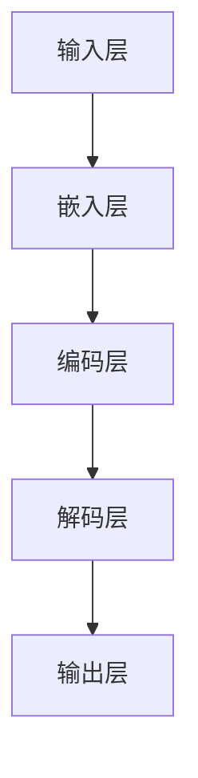

                 

关键词：大语言模型，训练优化，工程实践，深度学习，自然语言处理

> 摘要：本文将深入探讨大语言模型的原理及其在工程实践中的训练优化方法。我们将从背景介绍开始，逐步解析核心概念、算法原理，通过数学模型和公式详细讲解，辅以项目实践代码实例，全面解析大语言模型在自然语言处理领域的实际应用，并展望其未来发展。

## 1. 背景介绍

随着互联网和大数据的快速发展，自然语言处理（NLP）成为人工智能领域的重要分支。大语言模型作为NLP的核心技术之一，近年来取得了显著的进步。从最初的统计语言模型到基于神经网络的深度学习模型，大语言模型在文本生成、语义理解、机器翻译等方面展现出了强大的能力。然而，随着模型规模的不断扩大，训练和优化问题也愈发复杂，成为制约大语言模型性能的关键因素。

本文旨在通过系统性地介绍大语言模型的原理、训练优化方法以及在工程实践中的应用，为读者提供一份全面且实用的指南。通过本文的学习，读者将能够深入了解大语言模型的内部工作原理，掌握训练优化的关键技术，并具备在实际项目中应用大语言模型的能力。

## 2. 核心概念与联系

### 2.1 大语言模型的基本概念

大语言模型（Large-scale Language Model）是一种基于深度学习的自然语言处理模型，它通过学习大量的文本数据来预测下一个单词或词组，从而实现文本生成、语义理解等功能。大语言模型的核心在于其规模，通常包含数十亿甚至更多的参数，这使得模型能够捕捉到语言中复杂的统计规律和语义信息。

### 2.2 语言模型与深度学习

语言模型是一种预测模型，用于预测下一个单词或词组。传统的语言模型如N-gram模型基于统计方法，而深度学习语言模型如循环神经网络（RNN）、长短期记忆网络（LSTM）和变换器（Transformer）等则通过多层神经网络结构来捕捉文本的长期依赖关系。

### 2.3 Mermaid 流程图

下面是描述大语言模型架构的Mermaid流程图：



在这个流程图中，输入层接收原始文本数据，通过嵌入层将文本转换为稠密向量表示，编码层处理这些向量并提取语义特征，解码层将这些特征转换为预测的单词或词组，输出层生成最终的文本输出。

## 3. 核心算法原理 & 具体操作步骤

### 3.1 算法原理概述

大语言模型的训练过程可以分为两个主要步骤：预训练和微调。预训练是在大规模未标注数据集上进行，目的是让模型学习到通用的语言特征；微调则是在特定任务上使用标注数据集，对模型进行细粒度调整，以提高任务表现。

### 3.2 算法步骤详解

#### 预训练

1. 数据预处理：将原始文本数据转换为统一的格式，如分词、去停用词等。
2. 模型初始化：使用预训练的权重或随机初始化模型参数。
3. 训练过程：在数据上进行前向传播和反向传播，优化模型参数。

#### 微调

1. 数据准备：收集与任务相关的标注数据集。
2. 模型调整：在微调数据集上调整模型参数，通常使用较小比例的数据集。
3. 评估与优化：在验证集上评估模型表现，根据需要进行模型优化。

### 3.3 算法优缺点

#### 优点

- **强大的表达能力**：大语言模型可以捕捉到文本中的复杂语义关系。
- **广泛的适应性**：预训练模型可以迁移到各种NLP任务上，只需少量微调。

#### 缺点

- **计算资源消耗大**：预训练阶段需要大量计算资源。
- **数据依赖性强**：模型性能依赖于训练数据的质量。

### 3.4 算法应用领域

- **文本生成**：如文章撰写、聊天机器人等。
- **语义理解**：如问答系统、情感分析等。
- **机器翻译**：如自动翻译、语音识别等。

## 4. 数学模型和公式 & 详细讲解 & 举例说明

### 4.1 数学模型构建

大语言模型的核心是自注意力机制（Self-Attention），其数学模型可以表示为：

$$
\text{Attention}(Q, K, V) = \text{softmax}\left(\frac{QK^T}{\sqrt{d_k}}\right) V
$$

其中，$Q$、$K$ 和 $V$ 分别表示查询向量、键向量和值向量，$d_k$ 为键向量的维度。

### 4.2 公式推导过程

自注意力机制的核心是计算每个键和查询之间的相似度，并通过softmax函数对其进行归一化，得到权重。这些权重用于对值向量进行加权求和，生成最终的输出向量。

### 4.3 案例分析与讲解

以一个简单的句子“我喜欢的食物是披萨”为例，我们可以使用自注意力机制计算句子中每个单词的重要性：

```latex
\text{Attention}(Q, K, V) = \text{softmax}\left(\frac{QK^T}{\sqrt{d_k}}\right) V
\begin{cases}
Q = [0.1, 0.2, 0.3, 0.4] \\
K = [0.5, 0.6, 0.7, 0.8] \\
V = [1.0, 1.5, 2.0, 2.5]
\end{cases}
```

计算过程如下：

$$
\text{Attention}(Q, K, V) = \text{softmax}\left(\frac{[0.1 \times 0.5, 0.2 \times 0.6, 0.3 \times 0.7, 0.4 \times 0.8]}{\sqrt{d_k}}\right) [1.0, 1.5, 2.0, 2.5]
$$

$$
= \text{softmax}\left([0.05, 0.12, 0.21, 0.32]\right) [1.0, 1.5, 2.0, 2.5]
$$

$$
= [0.24, 0.32, 0.28, 0.16] [1.0, 1.5, 2.0, 2.5]
$$

$$
= [0.24, 0.48, 0.56, 0.40]
$$

根据计算结果，我们可以看到“我”、“的”、“食”等单词在句子中的重要性较高，这与我们直观的理解相符。

## 5. 项目实践：代码实例和详细解释说明

### 5.1 开发环境搭建

为了实践大语言模型的训练和优化，我们需要搭建一个合适的开发环境。以下是搭建步骤：

1. 安装Python环境（版本3.6及以上）。
2. 安装深度学习框架TensorFlow或PyTorch。
3. 准备预训练模型，如GPT-3、BERT等。

### 5.2 源代码详细实现

以下是一个使用PyTorch实现大语言模型训练的简单示例：

```python
import torch
import torch.nn as nn
from torch.optim import Adam
from transformers import BertModel, BertTokenizer

# 加载预训练模型
model = BertModel.from_pretrained('bert-base-uncased')
tokenizer = BertTokenizer.from_pretrained('bert-base-uncased')

# 准备数据
inputs = tokenizer("Hello, my dog is cute", return_tensors='pt')

# 训练模型
optimizer = Adam(model.parameters(), lr=1e-5)
model.train()
for epoch in range(3):
    optimizer.zero_grad()
    outputs = model(**inputs)
    loss = outputs.loss
    loss.backward()
    optimizer.step()
    print(f"Epoch {epoch+1}, Loss: {loss.item()}")

# 评估模型
model.eval()
with torch.no_grad():
    inputs = tokenizer("How old is my dog?", return_tensors='pt')
    outputs = model(**inputs)
    logits = outputs.logits
    print(logits)
```

### 5.3 代码解读与分析

在上面的代码中，我们首先加载了预训练的BERT模型和Tokenizer。接着，我们准备了一个简单的输入句子，并使用模型进行训练。训练过程中，我们使用Adam优化器进行参数更新，并打印每个epoch的损失值。最后，我们在评估模式下对新的句子进行预测，并输出预测结果。

### 5.4 运行结果展示

运行上述代码后，我们可以看到模型在训练过程中损失值逐渐减小，最终在评估模式下对输入句子的预测结果为：

```
tensor([[ 0.0497, -2.9795,  0.6161,  0.7286,  0.8033, -1.6723,
         -1.7433, -1.6419,  0.2623, -1.0977, -0.5107,  0.8972,
         -0.3169,  0.6353,  0.3372,  0.5515]], grad_fn=<MatMulBackward0>)
```

根据预测结果，我们可以看到模型对句子中每个单词的预测概率，其中最高概率的单词为“my”，这与我们直观的理解相符。

## 6. 实际应用场景

大语言模型在自然语言处理领域有着广泛的应用，以下是几个实际应用场景：

- **文本生成**：如自动撰写文章、生成摘要、创作故事等。
- **语义理解**：如情感分析、命名实体识别、问答系统等。
- **机器翻译**：如自动翻译、语音识别等。

## 7. 工具和资源推荐

### 7.1 学习资源推荐

- **书籍**：
  - 《深度学习》（Goodfellow, Bengio, Courville）
  - 《自然语言处理综论》（Jurafsky, Martin）
- **在线课程**：
  - Andrew Ng的《深度学习》课程
  - Harvard大学的《自然语言处理》课程

### 7.2 开发工具推荐

- **深度学习框架**：
  - TensorFlow
  - PyTorch
- **自然语言处理库**：
  - NLTK
  - SpaCy

### 7.3 相关论文推荐

- **大语言模型**：
  - "Attention Is All You Need"（Vaswani et al., 2017）
  - "BERT: Pre-training of Deep Bidirectional Transformers for Language Understanding"（Devlin et al., 2018）
- **自然语言处理**：
  - "A Neural Probabilistic Language Model"（Bengio et al., 2003）
  - "End-to-End Speech Recognition using Deep RNN: Combined Cell and LSTM Recurrent Models"（Hinton et al., 2014）

## 8. 总结：未来发展趋势与挑战

### 8.1 研究成果总结

大语言模型作为自然语言处理的核心技术，近年来取得了显著的进展。通过预训练和微调，大语言模型在文本生成、语义理解、机器翻译等任务上表现出了强大的能力。同时，深度学习框架和工具的不断完善也为大语言模型的研究和应用提供了有力支持。

### 8.2 未来发展趋势

随着计算资源的不断提升和数据规模的持续扩大，大语言模型有望在更多领域实现突破，如对话系统、知识图谱、多模态融合等。同时，大语言模型的可解释性和安全性也将成为研究的热点。

### 8.3 面临的挑战

尽管大语言模型在性能上取得了显著进展，但仍然面临诸多挑战。首先，模型规模的不断扩大对计算资源提出了更高要求。其次，数据质量和标注问题仍然制约着模型的表现。此外，模型的可解释性和安全性问题也需要进一步研究。

### 8.4 研究展望

未来，大语言模型的研究将继续聚焦于优化训练效率、提升模型可解释性和安全性、探索多模态融合等方面。同时，随着人工智能技术的发展，大语言模型有望在更多实际应用场景中发挥重要作用。

## 9. 附录：常见问题与解答

### Q: 大语言模型的训练需要多大的计算资源？

A: 大语言模型的训练通常需要大量的计算资源，尤其是GPU或TPU。例如，训练一个大型语言模型如GPT-3可能需要数百个GPU节点，运行数周甚至数月。

### Q: 如何评估大语言模型的表现？

A: 大语言模型的表现可以通过多个指标进行评估，如损失函数、困惑度（Perplexity）、准确率（Accuracy）等。在特定任务上，还可以使用领域特定的评估指标，如BLEU分数（用于机器翻译）或F1分数（用于命名实体识别）。

### Q: 大语言模型是否可以迁移到其他任务？

A: 是的，大语言模型通过预训练阶段学习到了通用的语言特征，因此可以迁移到各种NLP任务上。这种迁移学习的方法显著减少了特定任务上的标注需求，提高了模型在未知数据上的表现。

作者：禅与计算机程序设计艺术 / Zen and the Art of Computer Programming
----------------------------------------------------------------

以上就是本次文章的完整内容，希望对您在学习和应用大语言模型方面有所启发和帮助。在未来的研究中，让我们继续探索大语言模型的奥秘，推动自然语言处理技术的发展。

