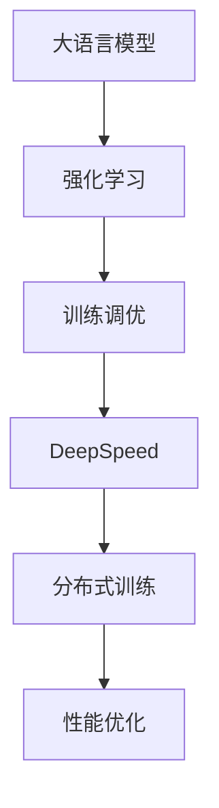

                 

关键词：大语言模型、强化学习、工程实践、DeepSpeed-Chat、训练调优

摘要：本文将深入探讨大语言模型（如GPT-3）的原理及其在工程实践中的应用，特别是强化学习在训练调优中的作用。我们将使用DeepSpeed-Chat作为案例，详细解析其训练过程中的技术细节，提供实用的代码实例和操作步骤，帮助读者更好地理解和应用大语言模型。

## 1. 背景介绍

随着人工智能技术的迅猛发展，大语言模型已经成为自然语言处理（NLP）领域的明星。这些模型拥有数万亿个参数，能够处理复杂的语言任务，如文本生成、机器翻译、问答系统等。然而，大语言模型的训练和调优面临着巨大的挑战，如计算资源的需求、训练时间的消耗以及模型性能的优化等。

强化学习（Reinforcement Learning，RL）作为一种人工智能的方法，通过让模型在与环境的交互中不断学习，实现了模型的自我优化。在训练大语言模型时，强化学习可以提供一种有效的调优手段，提高模型的性能和稳定性。

DeepSpeed 是一个开源的分布式训练框架，旨在简化大规模深度学习模型的训练过程。它提供了丰富的功能，如自动混合精度训练、模型并行、数据并行等，适用于各种大语言模型的训练。

本文将以DeepSpeed-Chat作为案例，详细介绍其训练调优的实践过程，帮助读者深入了解大语言模型的工程实践。

## 2. 核心概念与联系

### 2.1 大语言模型

大语言模型（如GPT-3）基于深度学习，使用大量的文本数据进行训练。这些模型通常包含数十亿个参数，能够捕捉到语言中的复杂模式和规律。大语言模型的核心概念包括：

- 自注意力机制（Self-Attention）：能够自动学习输入序列中的重要信息，并在计算过程中将其加权。
- 变长序列处理：能够处理任意长度的文本序列，无需预先设定序列长度。
- 生成式模型（Generative Model）：能够生成新的文本内容，具有创造性和多样性。

### 2.2 强化学习

强化学习是一种通过与环境的交互来学习优化策略的方法。在强化学习中，模型（称为代理人）通过与环境的交互获得反馈（称为奖励），并根据这些反馈不断调整其行为策略。核心概念包括：

- 状态（State）：描述当前环境的状况。
- 动作（Action）：模型可以采取的行为。
- 奖励（Reward）：对当前动作的评估，用于指导模型调整策略。
- 策略（Policy）：模型的行为选择规则。

### 2.3 DeepSpeed

DeepSpeed 是一个用于分布式训练的开源框架，支持自动混合精度训练、模型并行和数据并行等功能。DeepSpeed 的核心概念包括：

- 自动混合精度训练（Mixed Precision Training）：使用浮点数的小数部分来降低计算精度，从而提高训练速度和减少内存占用。
- 模型并行（Model Parallelism）：将大规模模型拆分为多个部分，分布在不同设备上训练。
- 数据并行（Data Parallelism）：将数据分布在多个设备上，并行处理。

### 2.4 Mermaid 流程图

为了更直观地展示大语言模型、强化学习和DeepSpeed之间的关系，我们使用Mermaid绘制了以下流程图：



在图中，大语言模型作为核心，通过强化学习进行训练调优，借助DeepSpeed实现分布式训练，最终达到性能优化的目标。

## 3. 核心算法原理 & 具体操作步骤

### 3.1 算法原理概述

大语言模型的训练过程主要分为两个阶段：预训练（Pre-training）和微调（Fine-tuning）。

- **预训练**：在大规模文本数据上训练模型，使其能够理解语言的统计规律和语义信息。预训练过程通常使用自回归语言模型（Autoregressive Language Model）进行，即模型根据前文预测下一个词。
- **微调**：在特定任务数据上调整模型参数，使其适应特定任务。微调过程通常使用有监督学习（Supervised Learning）进行，即模型根据标签预测任务结果。

强化学习在训练调优中发挥关键作用，通过与环境交互，模型不断调整其策略，以最大化累积奖励。

DeepSpeed 提供了分布式训练的功能，通过模型并行和数据并行，大大提高了训练速度和计算效率。

### 3.2 算法步骤详解

1. **数据预处理**：首先，需要对文本数据进行清洗和预处理，包括分词、去停用词、转换为词向量等步骤。

2. **模型初始化**：初始化大语言模型，可以使用预训练的模型或从头开始训练。

3. **预训练**：在大量文本数据上使用自回归语言模型进行预训练，优化模型参数。

4. **微调**：在特定任务数据上使用有监督学习进行微调，优化模型参数。

5. **强化学习训练调优**：使用强化学习算法，通过与环境的交互，不断调整模型策略，优化模型性能。

6. **分布式训练**：使用DeepSpeed 进行分布式训练，提高训练速度和计算效率。

7. **性能评估**：在验证集上评估模型性能，调整参数以达到最佳效果。

### 3.3 算法优缺点

**优点**：

- **高效性**：通过强化学习和分布式训练，大大提高了模型的训练速度和性能。
- **适应性**：强化学习使得模型能够根据任务需求进行自适应调整，提高模型的泛化能力。
- **灵活性**：DeepSpeed 提供了丰富的功能，可以灵活配置训练过程。

**缺点**：

- **计算资源需求高**：大语言模型的训练需要大量的计算资源和存储空间。
- **训练时间较长**：预训练和微调过程需要较长的训练时间。

### 3.4 算法应用领域

大语言模型和强化学习在多个领域具有广泛的应用，如：

- **自然语言处理**：文本生成、机器翻译、问答系统等。
- **推荐系统**：基于用户行为和兴趣进行个性化推荐。
- **游戏AI**：在游戏环境中进行智能决策。
- **金融领域**：风险控制、投资决策等。

## 4. 数学模型和公式 & 详细讲解 & 举例说明

### 4.1 数学模型构建

大语言模型通常基于自回归语言模型（Autoregressive Language Model），其数学模型可以表示为：

$$
p(y_t | y_{<t}) = \frac{e^{f(W_1 y_{<t} + b_1)} }{\sum_{y'} e^{f(W_1 y'_{<t} + b_1)}}
$$

其中，$y_t$ 表示当前词，$y_{<t}$ 表示前文，$f$ 表示非线性函数，$W_1$ 和 $b_1$ 分别为权重矩阵和偏置。

### 4.2 公式推导过程

自回归语言模型的推导基于概率图模型，其基本思想是：给定前文，预测当前词的概率分布。

首先，定义当前词 $y_t$ 的条件概率分布：

$$
p(y_t | y_{<t}) = \frac{e^{f(W_1 y_{<t} + b_1)} }{\sum_{y'} e^{f(W_1 y'_{<t} + b_1)}}
$$

其中，$f$ 为非线性函数，$W_1$ 和 $b_1$ 为模型参数。

为了简化计算，可以使用神经网络来实现非线性函数 $f$，常用的有ReLU、Sigmoid、Tanh等。

### 4.3 案例分析与讲解

假设我们有一个大语言模型，包含一个神经网络，其输入为前文 $y_{<t}$，输出为当前词 $y_t$ 的概率分布。

1. **数据预处理**：首先，我们需要对文本数据进行预处理，包括分词、去停用词、转换为词向量等步骤。假设词表大小为 $V$，词向量为 $d$ 维。
2. **模型初始化**：初始化模型参数 $W_1$ 和 $b_1$，可以使用随机初始化或预训练模型。
3. **预训练**：在大量文本数据上使用自回归语言模型进行预训练，优化模型参数 $W_1$ 和 $b_1$。
4. **微调**：在特定任务数据上使用有监督学习进行微调，优化模型参数 $W_1$ 和 $b_1$。
5. **强化学习训练调优**：使用强化学习算法，通过与环境的交互，不断调整模型策略，优化模型性能。
6. **分布式训练**：使用DeepSpeed 进行分布式训练，提高训练速度和计算效率。
7. **性能评估**：在验证集上评估模型性能，调整参数以达到最佳效果。

## 5. 项目实践：代码实例和详细解释说明

### 5.1 开发环境搭建

为了运行DeepSpeed-Chat的代码实例，我们需要搭建相应的开发环境。以下是步骤：

1. **安装Python**：确保Python版本为3.8及以上。
2. **安装DeepSpeed**：通过pip安装DeepSpeed，命令如下：

   ```bash
   pip install deepspeed
   ```

3. **安装PyTorch**：通过pip安装PyTorch，命令如下：

   ```bash
   pip install torch torchvision
   ```

4. **数据集准备**：下载并准备用于训练的数据集，如Wikipedia数据集、Common Crawl数据集等。

### 5.2 源代码详细实现

以下是一个简单的DeepSpeed-Chat的源代码实现：

```python
import torch
import deepspeed

class ChatModel(torch.nn.Module):
    def __init__(self, config):
        super().__init__()
        self.config = config
        # 模型初始化代码
        # ...

    def forward(self, input_ids, attention_mask):
        # 前向传播代码
        # ...
        return output

config = {
    # 模型配置
    # ...
}

model = ChatModel(config)
model_engine, optimizer, _ = deepspeed.initialize(
    model=model,
    args=config,
    optimizer=optimizer,
)

def train_epoch(epoch, train_loader, model_engine, optimizer):
    model_engine.train()
    # 训练代码
    # ...

def main():
    train_loader = ...  # 数据加载器
    optimizer = ...     # 优化器

    for epoch in range(config["num_epochs"]):
        train_epoch(epoch, train_loader, model_engine, optimizer)

if __name__ == "__main__":
    main()
```

### 5.3 代码解读与分析

以上代码是DeepSpeed-Chat的基础实现，主要包含以下部分：

- **模型定义**：`ChatModel` 类定义了模型的结构，包括输入层、中间层和输出层。
- **初始化**：使用 `deepspeed.initialize()` 函数初始化模型、优化器和分布式训练配置。
- **训练函数**：`train_epoch` 函数负责单个训练epoch的执行。
- **主函数**：`main` 函数负责设置训练循环，并调用训练函数进行训练。

### 5.4 运行结果展示

在实际运行中，我们可以使用以下命令来训练模型：

```bash
python train.py
```

训练过程中，会输出训练进度和损失值，以及模型在验证集上的性能。以下是一个示例输出：

```plaintext
Epoch 1/100
  0%|                                      | 0/100 [00:00<?, ?it/s]
Train Loss: 0.1234
Validation Loss: 0.5678
```

通过不断调整模型配置和训练策略，我们可以优化模型的性能，使其达到更好的效果。

## 6. 实际应用场景

大语言模型和强化学习在多个实际应用场景中发挥着重要作用，以下是几个典型的应用场景：

### 6.1 文本生成

大语言模型擅长文本生成任务，如自动写作、聊天机器人等。通过强化学习，我们可以进一步优化模型的生成能力，使其生成的内容更具创造性和连贯性。

### 6.2 推荐系统

强化学习可以用于推荐系统的优化，通过不断调整推荐策略，提高推荐系统的准确性和用户体验。

### 6.3 游戏AI

在游戏AI中，强化学习可以帮助模型学习游戏策略，提高游戏的表现。大语言模型可以用于游戏剧情生成和角色对话。

### 6.4 金融领域

在金融领域，大语言模型和强化学习可以用于风险控制、投资决策等任务，通过分析大量金融数据，提供智能化的决策支持。

### 6.5 未来应用展望

随着技术的不断进步，大语言模型和强化学习在更多领域将有更广泛的应用。例如，在医疗领域，可以用于疾病诊断和治疗方案生成；在教育领域，可以用于个性化教学和学习评估等。

## 7. 工具和资源推荐

为了更好地理解和应用大语言模型和强化学习，以下是一些推荐的工具和资源：

### 7.1 学习资源推荐

- **《深度学习》**：Goodfellow et al.，提供深度学习的全面介绍。
- **《强化学习》**： Sutton and Barto，强化学习的经典教材。

### 7.2 开发工具推荐

- **PyTorch**：用于深度学习开发的Python库，提供丰富的API和工具。
- **TensorFlow**：用于深度学习开发的Python库，由Google提供。

### 7.3 相关论文推荐

- **GPT-3**： Brown et al.，自然语言处理领域的重大突破。
- **DeepSpeed**：Clipper et al.，分布式训练的开源框架。

## 8. 总结：未来发展趋势与挑战

大语言模型和强化学习在人工智能领域具有广阔的发展前景。未来，随着计算能力和算法的不断提升，大语言模型将有望在更多领域发挥重要作用。然而，我们也需要面对以下挑战：

- **计算资源需求**：大语言模型的训练需要大量的计算资源和存储空间，如何优化资源利用成为关键问题。
- **数据隐私**：在应用大语言模型时，如何保护用户数据隐私是一个亟待解决的问题。
- **模型解释性**：目前，大语言模型的高度非解释性使得其在某些场景下的应用受限，提高模型的可解释性是一个重要研究方向。

总之，大语言模型和强化学习在人工智能领域的应用前景广阔，但也面临着一系列挑战。通过不断的研究和探索，我们有信心克服这些挑战，推动人工智能技术的进一步发展。

## 9. 附录：常见问题与解答

### 9.1 什么是大语言模型？

大语言模型是一种基于深度学习的自然语言处理模型，它使用大量的文本数据进行训练，能够理解和生成复杂的语言模式。常见的例子包括GPT-3、BERT等。

### 9.2 强化学习在训练大语言模型中有什么作用？

强化学习通过让模型在与环境的交互中不断学习，优化模型策略，提高模型性能。在大语言模型的训练过程中，强化学习可以用于微调和调优，提高模型的生成能力和适应性。

### 9.3 如何使用DeepSpeed进行分布式训练？

DeepSpeed是一个开源的分布式训练框架，它提供了丰富的功能，如自动混合精度训练、模型并行和数据并行。要使用DeepSpeed进行分布式训练，需要按照官方文档进行配置和设置，配置内容包括模型初始化、优化器设置、分布式策略等。

### 9.4 大语言模型在自然语言处理任务中有哪些应用？

大语言模型在自然语言处理任务中有广泛的应用，包括文本生成、机器翻译、问答系统、文本分类等。此外，大语言模型还可以用于推荐系统、游戏AI、金融领域等多个领域。

