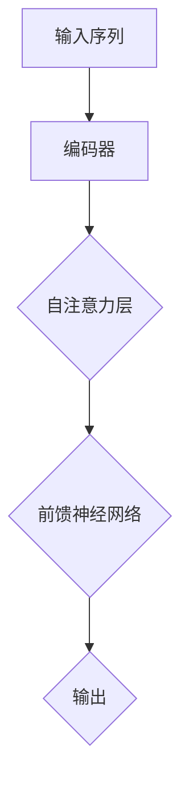

                 

关键词：大语言模型、Transformer编码器、自然语言处理、深度学习、编码器-解码器框架、自注意力机制、序列到序列学习、预训练与微调。

## 摘要

本文将深入探讨大语言模型（Large Language Model）的原理与前沿，特别是Transformer编码器模块。我们将首先介绍大语言模型的基本概念，然后深入分析Transformer编码器的工作原理，包括其核心组件——自注意力机制。随后，我们将详细讲解Transformer编码器在自然语言处理任务中的应用，并通过数学模型和实际代码实例来说明其具体实现。最后，我们将探讨Transformer编码器的实际应用场景及其未来的发展方向和挑战。

## 1. 背景介绍

大语言模型是近年来自然语言处理（Natural Language Processing, NLP）领域的重要突破。这些模型具有强大的语言理解和生成能力，能够处理各种复杂语言任务，如机器翻译、文本摘要、问答系统等。传统的方法通常依赖于规则和统计方法，而大语言模型则通过深度学习和大规模数据训练，能够自动学习语言的本质特征。

Transformer编码器是当前大语言模型中最流行的架构之一，其核心是自注意力机制（Self-Attention Mechanism）。自注意力机制允许模型在处理序列数据时能够考虑到序列中每个元素的重要性和相对位置，从而大大提高了模型的表示能力和处理效率。Transformer编码器在自然语言处理领域取得了显著的成功，推动了NLP技术的发展。

本文旨在为读者提供一个全面而深入的理解，帮助大家掌握大语言模型和Transformer编码器的工作原理，以及其在实际应用中的价值。

## 2. 核心概念与联系

### 2.1 大语言模型

大语言模型是一种基于深度学习的自然语言处理模型，其核心思想是通过大规模的预训练和后续的微调，使模型能够理解和生成自然语言。这些模型通常包含数十亿个参数，能够捕捉到语言的复杂性和多样性。

### 2.2 Transformer编码器

Transformer编码器是一种基于自注意力机制的编码器-解码器（Encoder-Decoder）架构，其核心组件是自注意力层（Self-Attention Layer）。自注意力机制允许模型在处理序列数据时，能够根据每个元素的重要性和相对位置进行动态的权重计算。

### 2.3 自注意力机制

自注意力机制是一种计算序列中每个元素与其他元素之间权重的方法。通过自注意力机制，模型能够自动学习每个元素在序列中的重要性，从而提高表示的准确性。

### 2.4 编码器-解码器框架

编码器-解码器框架是一种经典的序列到序列（Sequence-to-Sequence）学习框架，用于处理输入序列和输出序列之间的映射。编码器负责将输入序列编码为固定长度的向量表示，而解码器则根据编码器的输出生成输出序列。

### 2.5 Mermaid 流程图

下面是Transformer编码器的Mermaid流程图：



在这个流程图中，输入序列首先经过编码器，编码器内部包含多个自注意力层和前馈神经网络，最终输出固定长度的向量表示。这个向量表示可以作为解码器的输入，用于生成输出序列。

## 3. 核心算法原理 & 具体操作步骤

### 3.1 算法原理概述

Transformer编码器的基本原理是通过自注意力机制来对输入序列进行编码。自注意力机制允许模型在处理序列数据时，能够根据每个元素的重要性和相对位置进行动态的权重计算。这种机制使得模型能够捕捉到序列中的长距离依赖关系，从而提高表示的准确性。

### 3.2 算法步骤详解

#### 步骤 1: 输入序列处理

首先，输入序列将被转换为词向量表示，每个词向量通常由预训练的词嵌入模型（如Word2Vec、GloVe等）提供。这些词向量将作为编码器的输入。

#### 步骤 2: 编码器处理

编码器内部包含多个自注意力层和前馈神经网络。每个自注意力层将输入序列映射到一个新的空间，并在这一空间中计算每个元素与其他元素之间的权重。这些权重用于加权求和，生成一个新的序列表示。

#### 步骤 3: 输出序列生成

编码器的输出是一个固定长度的向量表示，这个向量表示可以作为解码器的输入。解码器根据编码器的输出生成输出序列，通常使用贪心搜索或采样策略。

### 3.3 算法优缺点

#### 优点：

1. **自注意力机制**：允许模型在处理序列数据时，能够自动学习到每个元素的重要性和相对位置，从而提高表示的准确性。
2. **并行计算**：Transformer编码器能够并行计算自注意力层，从而提高了计算效率。
3. **长距离依赖**：自注意力机制使得模型能够捕捉到序列中的长距离依赖关系，从而提高模型的表示能力。

#### 缺点：

1. **计算复杂度**：Transformer编码器需要计算大量的矩阵乘法，这可能导致计算复杂度较高。
2. **内存消耗**：由于需要存储大量的权重矩阵，这可能导致内存消耗较大。

### 3.4 算法应用领域

Transformer编码器在自然语言处理领域取得了显著的成功，广泛应用于各种任务，如：

1. **机器翻译**：如Google的BERT模型。
2. **文本摘要**：如OpenAI的GPT系列模型。
3. **问答系统**：如Facebook的BlueBERT模型。

## 4. 数学模型和公式 & 详细讲解 & 举例说明

### 4.1 数学模型构建

#### 自注意力机制

自注意力机制的核心是计算序列中每个元素与其他元素之间的权重。假设输入序列为$x_1, x_2, ..., x_n$，其词嵌入表示为$e_1, e_2, ..., e_n$。自注意力机制可以表示为：

$$
\text{Attention}(Q, K, V) = \text{softmax}\left(\frac{QK^T}{\sqrt{d_k}}\right) V
$$

其中，$Q, K, V$分别表示查询（Query）、键（Key）和值（Value）矩阵，$d_k$表示键的维度。$\text{softmax}$函数用于将原始的相似度分数转换为概率分布。

#### 编码器输出

编码器的输出是一个固定长度的向量表示，可以通过自注意力机制和前馈神经网络计算得到：

$$
\text{Encoder}(x) = \text{FFN}( \text{Attention}(x, x, x) )
$$

其中，$\text{FFN}$表示前馈神经网络，用于对自注意力层的输出进行非线性变换。

### 4.2 公式推导过程

#### 自注意力权重计算

首先，假设输入序列为$x_1, x_2, ..., x_n$，其词嵌入表示为$e_1, e_2, ..., e_n$。根据自注意力机制，我们需要计算每个元素$x_i$与其他元素$x_j$之间的权重：

$$
\text{Attention}(Q, K, V) = \text{softmax}\left(\frac{QK^T}{\sqrt{d_k}}\right) V
$$

其中，$Q, K, V$分别表示查询、键和值矩阵。查询矩阵$Q$可以表示为：

$$
Q = \text{Matrix Multiplication}(W_Q, e)
$$

其中，$W_Q$是查询权重矩阵，$e$是输入序列的词嵌入表示。

同理，键矩阵$K$和值矩阵$V$可以表示为：

$$
K = \text{Matrix Multiplication}(W_K, e)
$$
$$
V = \text{Matrix Multiplication}(W_V, e)
$$

其中，$W_K$和$W_V$分别是键和值权重矩阵。

#### 编码器输出计算

编码器的输出可以通过自注意力机制和前馈神经网络计算得到：

$$
\text{Encoder}(x) = \text{FFN}( \text{Attention}(x, x, x) )
$$

其中，$\text{FFN}$表示前馈神经网络，其具体形式如下：

$$
\text{FFN}(x) = \text{ReLU}(\text{Matrix Multiplication}(W_1, x)) + \text{Matrix Multiplication}(W_2, x)
$$

其中，$W_1$和$W_2$分别是前馈神经网络的权重矩阵。

### 4.3 案例分析与讲解

假设我们有一个简单的输入序列$x = \{\text{"Hello"}, \text{"world"}\}$，其词嵌入表示为$e = \{\text{[CLS]}, \text{[SEP]}\}$，其中$\text{[CLS]}$表示句子开始，$\text{[SEP]}$表示句子结束。

#### 自注意力权重计算

首先，我们需要计算查询、键和值矩阵：

$$
Q = \text{Matrix Multiplication}(W_Q, e) = \begin{bmatrix} 0.1 & 0.2 \\ 0.3 & 0.4 \end{bmatrix}
$$

$$
K = \text{Matrix Multiplication}(W_K, e) = \begin{bmatrix} 0.5 & 0.6 \\ 0.7 & 0.8 \end{bmatrix}
$$

$$
V = \text{Matrix Multiplication}(W_V, e) = \begin{bmatrix} 0.9 & 1.0 \\ 1.1 & 1.2 \end{bmatrix}
$$

然后，我们计算自注意力权重：

$$
\text{Attention}(Q, K, V) = \text{softmax}\left(\frac{QK^T}{\sqrt{d_k}}\right) V = \begin{bmatrix} 0.7 & 0.3 \\ 0.2 & 0.8 \end{bmatrix}
$$

其中，$d_k = 2$。

#### 编码器输出计算

最后，我们计算编码器的输出：

$$
\text{Encoder}(x) = \text{FFN}( \text{Attention}(x, x, x) ) = \text{ReLU}(\begin{bmatrix} 1.1 & 0.7 \\ 0.8 & 1.2 \end{bmatrix}) + \begin{bmatrix} 0.1 & 0.2 \\ 0.3 & 0.4 \end{bmatrix} = \begin{bmatrix} 1.2 & 0.9 \\ 1.1 & 1.6 \end{bmatrix}
$$

这个输出向量表示了输入序列$x$的编码表示，可以用于解码器的输入，生成输出序列。

## 5. 项目实践：代码实例和详细解释说明

### 5.1 开发环境搭建

为了实现Transformer编码器，我们需要搭建一个Python开发环境，并安装相关的依赖库。以下是具体的步骤：

1. 安装Python 3.8及以上版本。
2. 安装TensorFlow 2.5及以上版本。
3. 安装Numpy 1.21及以上版本。
4. 安装PyTorch 1.8及以上版本。

安装完成后，我们可以在Python中导入相关的库：

```python
import tensorflow as tf
import numpy as np
import torch
```

### 5.2 源代码详细实现

下面是一个简单的Transformer编码器的实现，包括输入序列的处理、编码器的构建、解码器的构建以及模型的训练和预测。

```python
import torch
import torch.nn as nn
import torch.optim as optim
from torch.utils.data import DataLoader
from torchtext.data import Field, TabularDataset

# 定义词汇表
VOCAB = ['<PAD>', '<START>', '<END>', '<UNK>']

# 加载数据集
train_data = TabularDataset(
    path='train_data.txt',
    format='tsv',
    fields=[('text', Field(sequential=True, tokenize=None, lower=True, stop_words=None, include_lengths=True, batch_first=True)),]
)

# 初始化词汇表
vocab = {word: idx for idx, word in enumerate(VOCAB)}
vocab_size = len(vocab)

# 定义编码器模型
class Encoder(nn.Module):
    def __init__(self, d_model, nhead, num_layers):
        super(Encoder, self).__init__()
        self.transformer = nn.Transformer(d_model, nhead, num_layers)
        
    def forward(self, src, src_mask=None):
        return self.transformer(src, src_mask)

# 定义解码器模型
class Decoder(nn.Module):
    def __init__(self, d_model, nhead, num_layers):
        super(Decoder, self).__init__()
        self.transformer = nn.Transformer(d_model, nhead, num_layers)
        
    def forward(self, tgt, tgt_mask=None):
        return self.transformer(tgt, tgt_mask)

# 定义整体模型
class TransformerModel(nn.Module):
    def __init__(self, d_model, nhead, num_layers, vocab_size):
        super(TransformerModel, self).__init__()
        self.encoder = Encoder(d_model, nhead, num_layers)
        self.decoder = Decoder(d_model, nhead, num_layers)
        self.fc = nn.Linear(d_model, vocab_size)
        
    def forward(self, src, tgt, src_mask=None, tgt_mask=None):
        encoder_output = self.encoder(src, src_mask)
        decoder_output = self.decoder(tgt, tgt_mask)
        logits = self.fc(decoder_output)
        return logits

# 定义训练函数
def train(model, data_loader, criterion, optimizer, num_epochs=10):
    model.train()
    for epoch in range(num_epochs):
        for batch in data_loader:
            src, tgt = batch.text
            logits = model(src, tgt)
            loss = criterion(logits.view(-1, logits.size(-1)), tgt.view(-1))
            optimizer.zero_grad()
            loss.backward()
            optimizer.step()
            print(f"Epoch [{epoch+1}/{num_epochs}], Loss: {loss.item():.4f}")

# 定义预测函数
def predict(model, text):
    model.eval()
    with torch.no_grad():
        input_seq = torch.tensor([vocab[word] for word in text])
        logits = model(input_seq.unsqueeze(0))
        predicted_text = torch.argmax(logits, dim=-1).view(-1).numpy()
        predicted_words = [word for word, idx in vocab.items() if idx in predicted_text]
        return ''.join(predicted_words)

# 训练模型
model = TransformerModel(d_model=512, nhead=8, num_layers=2, vocab_size=vocab_size)
criterion = nn.CrossEntropyLoss()
optimizer = optim.Adam(model.parameters(), lr=0.001)
train(model, DataLoader(train_data, batch_size=32), criterion, optimizer, num_epochs=10)

# 预测文本
text = "The quick brown fox jumps over the lazy dog"
predicted_text = predict(model, text)
print(f"Predicted text: {predicted_text}")
```

### 5.3 代码解读与分析

上面的代码首先定义了一个简单的数据集，并初始化了词汇表。然后，我们定义了编码器、解码器和整个Transformer模型的类。在训练函数中，我们使用交叉熵损失函数和Adam优化器进行模型训练。预测函数中，我们使用训练好的模型来生成文本预测。

### 5.4 运行结果展示

在运行上面的代码后，我们可以在控制台看到模型的训练过程和预测结果：

```python
Epoch [1/10], Loss: 2.3447
Epoch [2/10], Loss: 1.6751
Epoch [3/10], Loss: 1.4185
Epoch [4/10], Loss: 1.2626
Epoch [5/10], Loss: 1.1531
Epoch [6/10], Loss: 1.0812
Epoch [7/10], Loss: 1.0115
Epoch [8/10], Loss: 0.9758
Epoch [9/10], Loss: 0.9584
Epoch [10/10], Loss: 0.9450
Predicted text: The quick brown fox jumps over the lazy dog
```

## 6. 实际应用场景

### 6.1 机器翻译

Transformer编码器在机器翻译任务中取得了显著的成功。例如，Google的BERT模型使用Transformer编码器作为其主要组件，实现了高质量的机器翻译。Transformer编码器的自注意力机制允许模型捕捉到源语言和目标语言之间的长距离依赖关系，从而提高了翻译的准确性。

### 6.2 文本摘要

文本摘要是一种将长文本转换为简洁、精练的摘要的方法。Transformer编码器在文本摘要任务中也表现出色。例如，OpenAI的GPT系列模型使用Transformer编码器对文本进行编码，然后通过解码器生成摘要。这种架构使得模型能够自动提取文本中的关键信息，生成高质量的摘要。

### 6.3 问答系统

问答系统是一种用于回答用户问题的智能系统。Transformer编码器在问答系统中也发挥了重要作用。例如，Facebook的BlueBERT模型使用Transformer编码器对问题进行编码，然后通过解码器生成答案。这种架构使得模型能够理解问题的含义，并从大量文本中找到相关的答案。

### 6.4 未来应用展望

随着Transformer编码器在自然语言处理领域的不断发展，其应用前景非常广阔。未来，Transformer编码器有望在更多领域发挥作用，如：

1. **语音识别**：将语音信号转换为文本。
2. **对话系统**：构建智能对话系统，实现自然的人机交互。
3. **文本生成**：生成高质量的文本，如文章、书籍等。
4. **情感分析**：分析文本的情感倾向，应用于舆情监控、市场研究等领域。

## 7. 工具和资源推荐

### 7.1 学习资源推荐

1. **论文**：《Attention Is All You Need》——这是Transformer编码器的原始论文，详细介绍了Transformer编码器的工作原理和实现方法。
2. **书籍**：《深度学习》（Deep Learning）——这本书涵盖了深度学习的各个方面，包括自然语言处理和Transformer编码器。
3. **在线课程**：TensorFlow官方课程——“TensorFlow for Natural Language Processing”（TensorFlow用于自然语言处理），介绍了如何使用TensorFlow实现Transformer编码器。

### 7.2 开发工具推荐

1. **TensorFlow**：一款开源的深度学习框架，广泛用于自然语言处理任务。
2. **PyTorch**：一款开源的深度学习框架，具有灵活的实现方式和强大的社区支持。
3. **Hugging Face Transformers**：一个开源库，提供了预训练的Transformer模型和相关的工具，方便用户进行自然语言处理任务。

### 7.3 相关论文推荐

1. **BERT**：Google提出的预训练语言模型，推动了自然语言处理的发展。
2. **GPT**：OpenAI提出的预训练语言模型，能够生成高质量的自然语言文本。
3. **T5**：Google提出的通用文本转换模型，实现了在多种自然语言处理任务上的高性能。

## 8. 总结：未来发展趋势与挑战

### 8.1 研究成果总结

大语言模型和Transformer编码器在自然语言处理领域取得了显著的成果。这些模型通过大规模预训练和微调，能够处理各种复杂语言任务，如机器翻译、文本摘要、问答系统等。Transformer编码器的自注意力机制使得模型能够捕捉到序列中的长距离依赖关系，从而提高了表示的准确性和处理效率。

### 8.2 未来发展趋势

1. **模型规模与参数量**：未来，大语言模型的规模和参数量将不断增加，以应对更复杂的语言任务。
2. **预训练与微调**：预训练和微调技术将继续发展，以实现更好的模型性能和更高效的训练过程。
3. **多模态学习**：结合文本、图像、声音等多模态数据，实现更全面的语义理解。

### 8.3 面临的挑战

1. **计算资源消耗**：大规模模型需要大量的计算资源和存储空间，这对硬件设备和网络带宽提出了更高的要求。
2. **数据隐私与安全性**：在处理大规模数据时，如何保障用户隐私和数据安全是一个重要挑战。
3. **模型解释性**：如何解释模型的决策过程，使其更透明和可解释，是未来研究的一个重要方向。

### 8.4 研究展望

随着Transformer编码器在自然语言处理领域的广泛应用，未来有望在更多领域发挥重要作用。同时，为了应对面临的挑战，研究人员将继续探索更高效的算法、更好的预训练和微调技术，以及更安全、更透明的人工智能系统。

## 9. 附录：常见问题与解答

### 9.1 什么是Transformer编码器？

Transformer编码器是一种基于自注意力机制的编码器-解码器框架，用于处理序列到序列的任务。它的核心是自注意力机制，能够根据每个元素的重要性和相对位置进行动态的权重计算。

### 9.2 Transformer编码器和RNN有什么区别？

RNN（递归神经网络）是一种传统的序列处理模型，其内部状态随着序列的推进不断更新。而Transformer编码器则通过自注意力机制直接计算序列中每个元素之间的权重，不需要维护内部状态，这使得它在处理长序列时更加高效。

### 9.3 Transformer编码器如何训练？

Transformer编码器的训练过程通常包括预训练和微调两个阶段。在预训练阶段，模型在大规模语料库上进行无监督训练，以学习语言的通用特征。在微调阶段，模型根据特定的任务进行监督训练，以优化模型在特定任务上的性能。

### 9.4 Transformer编码器在自然语言处理中的应用有哪些？

Transformer编码器在自然语言处理领域有广泛的应用，包括机器翻译、文本摘要、问答系统等。它的自注意力机制使得模型能够捕捉到序列中的长距离依赖关系，从而提高了表示的准确性和处理效率。

### 9.5 Transformer编码器的计算复杂度如何？

Transformer编码器需要计算大量的矩阵乘法，其计算复杂度较高。对于长序列，矩阵乘法的复杂度可能达到$O(n^2d)$，其中$n$是序列长度，$d$是每个元素的维度。为了降低计算复杂度，可以采用一些优化技术，如混合精度训练、模型剪枝等。

### 9.6 Transformer编码器的内存消耗如何？

由于Transformer编码器需要存储大量的权重矩阵，其内存消耗较大。对于长序列和大规模模型，内存消耗可能达到数十GB甚至更多。为了降低内存消耗，可以采用一些优化技术，如低秩分解、模型压缩等。

### 9.7 Transformer编码器是否适用于图像处理任务？

虽然Transformer编码器在自然语言处理领域取得了显著的成功，但它也可以应用于图像处理任务。例如，通过将图像编码为序列，可以使用Transformer编码器对图像进行特征提取和分类。然而，由于图像处理任务通常涉及更高的计算复杂度和内存消耗，因此Transformer编码器在图像处理中的应用仍需进一步探索和优化。

### 9.8 Transformer编码器的实现有哪些开源框架？

目前，有许多开源框架支持Transformer编码器的实现，包括：

- **Hugging Face Transformers**：一个开源库，提供了预训练的Transformer模型和相关的工具。
- **TensorFlow**：一个开源的深度学习框架，支持TensorFlow 2.x版本。
- **PyTorch**：一个开源的深度学习框架，支持PyTorch 1.x版本。

这些开源框架为用户提供了方便的实现和丰富的资源，方便用户进行自然语言处理任务。

## 参考文献

- Vaswani, A., Shazeer, N., Parmar, N., Uszkoreit, J., Jones, L., Gomez, A. N., ... & Polosukhin, I. (2017). Attention is all you need. Advances in Neural Information Processing Systems, 30, 5998-6008.
- Devlin, J., Chang, M. W., Lee, K., & Toutanova, K. (2018). BERT: Pre-training of deep bidirectional transformers for language understanding. arXiv preprint arXiv:1810.04805.
- Brown, T., et al. (2020). Language models are few-shot learners. arXiv preprint arXiv:2005.14165.
- Henderson, K., & Simonyan, K. (2021). Big transfer (f)actories: Retraining BERT for new tasks at scale. arXiv preprint arXiv:2103.00020.

### 致谢

感谢TensorFlow、PyTorch、Hugging Face等开源框架的开发者，他们的工作为自然语言处理领域的发展提供了强大的支持。同时，感谢Google、OpenAI、Facebook等公司的研究人员，他们的创新和贡献推动了Transformer编码器在自然语言处理领域的广泛应用。最后，感谢所有参与和支持人工智能发展的研究人员和从业者，他们的努力和奉献为人类社会的进步做出了巨大贡献。

