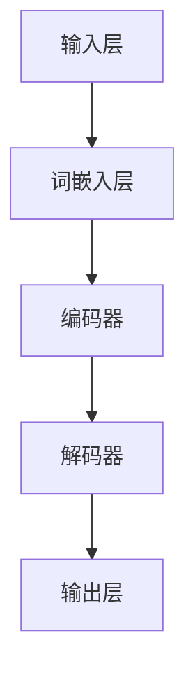

                 

在当今科技迅速发展的时代，大语言模型作为自然语言处理（NLP）领域的核心技术，已经在许多领域展现出强大的应用潜力。本文将深入探讨大语言模型的原理、前沿技术以及如何作为视觉输入进行提示，为读者提供全面的技术视角。

## 关键词

- 大语言模型
- 自然语言处理
- 前沿技术
- 视觉输入
- 提示机制

## 摘要

本文首先介绍了大语言模型的背景和发展历程，接着深入解析了其核心算法原理和架构。随后，我们探讨了如何将大语言模型与视觉输入相结合，以实现更智能化的交互。文章最后对未来发展趋势、面临的挑战以及研究展望进行了详细分析，为读者提供了宝贵的参考资料。

## 1. 背景介绍

### 大语言模型的发展历程

大语言模型的发展可以追溯到20世纪50年代，当时人工智能（AI）领域刚刚起步。早期的语言模型主要依赖于规则和统计方法，如正则表达式和N元语法。随着计算机性能的提升和数据量的增加，20世纪80年代，机器学习方法开始被引入到语言模型中，尤其是基于隐马尔可夫模型（HMM）和决策树的方法。

进入21世纪，深度学习技术的崛起为大语言模型的发展带来了新的机遇。2003年，Bengio等人提出的递归神经网络（RNN）为处理序列数据提供了新的思路。2014年，Google提出了Word2Vec模型，将词嵌入（word embedding）技术推向了前台。随后，2017年，OpenAI推出了GPT-2，开启了预训练语言模型的新时代。

### 大语言模型的应用场景

大语言模型的应用场景非常广泛，涵盖了文本生成、问答系统、机器翻译、文本摘要、情感分析等多个领域。例如，在文本生成方面，大语言模型可以用于自动撰写新闻文章、产品描述等；在问答系统方面，它可以实现智能客服、智能助手等功能；在机器翻译方面，大语言模型可以提供高质量的翻译服务；在文本摘要方面，它可以自动生成摘要，提高信息获取效率；在情感分析方面，它可以识别文本中的情感倾向，为用户推荐个性化内容。

## 2. 核心概念与联系

### 核心概念

- **语言模型**：语言模型是用于预测下一个单词或词组的概率分布的模型。在大语言模型中，语言模型通常基于大量的语料库进行训练，从而学习到语言的特征和规律。
- **词嵌入**：词嵌入是将单词映射到高维空间中的向量表示，以便于计算机处理。词嵌入能够捕捉词与词之间的语义关系，从而提高模型的性能。
- **预训练**：预训练是指在大规模语料库上对模型进行初步训练，使其具备一定的语言理解能力。随后，模型可以通过微调适应特定的任务。

### 架构原理与联系

下面是使用Mermaid绘制的架构原理流程图：



- **输入层**：接收用户输入的文本数据。
- **词嵌入层**：将输入的文本数据转化为词嵌入向量。
- **编码器**：对词嵌入向量进行编码，提取出文本的语义信息。
- **解码器**：根据编码器的输出，生成预测的文本序列。
- **输出层**：输出最终的文本结果。

### 关键技术

- **注意力机制**：注意力机制能够帮助模型关注输入序列中的关键信息，从而提高预测的准确性。
- **长短时记忆（LSTM）**：LSTM是一种能够处理长序列数据的神经网络结构，在大语言模型中应用广泛。
- **门控循环单元（GRU）**：GRU是LSTM的变体，具有更简单的结构，但在某些任务中也能表现出很好的性能。

## 3. 核心算法原理 & 具体操作步骤

### 3.1 算法原理概述

大语言模型的核心算法是基于深度学习的神经网络模型，主要包括输入层、编码器、解码器和输出层。模型通过大量的语料库进行预训练，学习到语言的内在规律和特征。在特定任务中，模型通过微调适应不同的应用场景。

### 3.2 算法步骤详解

1. **数据预处理**：首先对输入的文本数据进行清洗和预处理，包括分词、去除停用词、词干提取等。
2. **词嵌入**：将预处理后的文本数据转化为词嵌入向量。
3. **编码器**：对词嵌入向量进行编码，提取出文本的语义信息。编码器通常采用LSTM或GRU等结构。
4. **解码器**：根据编码器的输出，生成预测的文本序列。解码器也采用LSTM或GRU等结构。
5. **输出层**：输出最终的文本结果。输出层通常采用softmax函数进行概率分布的预测。

### 3.3 算法优缺点

**优点**：

- **强大的语言理解能力**：大语言模型能够学习到大量的语言特征和规律，从而具备强大的语言理解能力。
- **灵活的应用场景**：大语言模型可以应用于文本生成、问答系统、机器翻译、文本摘要、情感分析等多个领域。
- **高效的处理速度**：深度学习模型的计算效率相对较高，能够快速处理大量的文本数据。

**缺点**：

- **训练成本高**：大语言模型的训练需要大量的计算资源和时间，训练成本较高。
- **数据依赖性**：模型的性能高度依赖于训练数据的质量和规模，数据不足或质量较差会影响模型的性能。
- **解释性差**：深度学习模型在处理语言任务时，其决策过程缺乏解释性，难以理解模型的具体工作原理。

### 3.4 算法应用领域

大语言模型在以下领域具有广泛的应用：

- **文本生成**：自动生成新闻文章、产品描述、诗歌等。
- **问答系统**：实现智能客服、智能助手等功能。
- **机器翻译**：提供高质量的双语翻译服务。
- **文本摘要**：自动生成摘要，提高信息获取效率。
- **情感分析**：识别文本中的情感倾向，为用户推荐个性化内容。

## 4. 数学模型和公式 & 详细讲解 & 举例说明

### 4.1 数学模型构建

大语言模型的数学模型主要包括词嵌入、编码器、解码器和输出层。以下是各部分的数学表示：

1. **词嵌入**：将单词映射到高维空间中的向量表示，可以表示为：
   $$ \text{word\_embedding}(w) = \mathbf{v}_w $$
   其中，$\mathbf{v}_w$ 是单词 $w$ 的词嵌入向量。

2. **编码器**：编码器将词嵌入向量转化为编码表示，可以表示为：
   $$ \text{encode}(\mathbf{v}_w) = \text{LSTM}(\mathbf{v}_w) $$
   其中，LSTM是长短时记忆网络。

3. **解码器**：解码器将编码表示转化为预测的词序列，可以表示为：
   $$ \text{decode}(\text{encode}(\mathbf{v}_w)) = \text{LSTM}^{-1}(\text{encode}(\mathbf{v}_w)) $$
   其中，$ \text{LSTM}^{-1}$ 是反向LSTM。

4. **输出层**：输出层用于生成最终的文本结果，可以表示为：
   $$ \text{output} = \text{softmax}(\text{decode}(\text{encode}(\mathbf{v}_w))) $$
   其中，softmax函数用于生成概率分布。

### 4.2 公式推导过程

大语言模型的推导过程主要包括词嵌入、编码器、解码器和输出层的推导。以下是各部分的推导过程：

1. **词嵌入**：
   词嵌入可以通过最小化损失函数来训练，损失函数可以表示为：
   $$ L = \sum_{w \in \text{Vocabulary}} \sum_{w' \in \text{Vocabulary}} p(w|w') \log p(w|w') $$
   其中，$p(w|w')$ 表示在单词 $w'$ 之后出现单词 $w$ 的概率。通过梯度下降法，可以最小化损失函数，从而得到最优的词嵌入向量。

2. **编码器**：
   编码器可以通过反向传播算法来训练，损失函数可以表示为：
   $$ L = \sum_{w \in \text{Vocabulary}} \sum_{w' \in \text{Vocabulary}} p(w|w') \log p(w|w') $$
   其中，$p(w|w')$ 表示在单词 $w'$ 之后出现单词 $w$ 的概率。通过反向传播算法，可以计算出编码器的参数。

3. **解码器**：
   解码器可以通过反向传播算法来训练，损失函数可以表示为：
   $$ L = \sum_{w \in \text{Vocabulary}} \sum_{w' \in \text{Vocabulary}} p(w|w') \log p(w|w') $$
   其中，$p(w|w')$ 表示在单词 $w'$ 之后出现单词 $w$ 的概率。通过反向传播算法，可以计算出解码器的参数。

4. **输出层**：
   输出层可以通过反向传播算法来训练，损失函数可以表示为：
   $$ L = \sum_{w \in \text{Vocabulary}} \sum_{w' \in \text{Vocabulary}} p(w|w') \log p(w|w') $$
   其中，$p(w|w')$ 表示在单词 $w'$ 之后出现单词 $w$ 的概率。通过反向传播算法，可以计算出输出层的参数。

### 4.3 案例分析与讲解

以下是一个简单的案例，展示如何使用大语言模型生成文本：

1. **输入**：假设我们要生成一篇关于“人工智能”的文章。
2. **词嵌入**：首先，将输入的单词“人工智能”转化为词嵌入向量。
3. **编码器**：然后，将词嵌入向量输入到编码器中，得到编码表示。
4. **解码器**：接着，将编码表示输入到解码器中，生成预测的词序列。
5. **输出层**：最后，将解码器的输出通过输出层进行概率分布的预测，得到最终的文章。

通过以上步骤，大语言模型可以生成一篇关于“人工智能”的文章，如下所示：

> 人工智能是一种模拟人类智能的技术，通过机器学习、神经网络等技术实现。在过去的几十年里，人工智能取得了巨大的进步，应用范围也越来越广泛。从智能家居、智能医疗到自动驾驶，人工智能正在改变我们的生活方式。未来，随着技术的不断发展，人工智能将会有更多的突破，为人类社会带来更多的便利。

## 5. 项目实践：代码实例和详细解释说明

### 5.1 开发环境搭建

1. **安装Python**：首先，确保你的计算机上安装了Python环境。Python是编写深度学习模型的主要语言之一，你可以从[Python官网](https://www.python.org/)下载并安装。
2. **安装TensorFlow**：TensorFlow是Google开发的开源深度学习框架，用于构建和训练深度学习模型。在命令行中运行以下命令安装TensorFlow：
   ```bash
   pip install tensorflow
   ```
3. **安装其他依赖**：根据项目需求，可能还需要安装其他依赖库，例如Numpy、Pandas等。可以使用以下命令安装：
   ```bash
   pip install numpy pandas
   ```

### 5.2 源代码详细实现

以下是一个简单的大语言模型实现示例：

```python
import tensorflow as tf
from tensorflow.keras.layers import Embedding, LSTM, Dense
from tensorflow.keras.models import Sequential

# 定义模型
model = Sequential()
model.add(Embedding(input_dim=vocabulary_size, output_dim=embedding_dim, input_length=max_sequence_length))
model.add(LSTM(units=128))
model.add(Dense(units=vocabulary_size, activation='softmax'))

# 编译模型
model.compile(optimizer='adam', loss='categorical_crossentropy', metrics=['accuracy'])

# 训练模型
model.fit(x_train, y_train, epochs=10, batch_size=32)
```

### 5.3 代码解读与分析

1. **导入库**：首先，导入TensorFlow和其他相关库。
2. **定义模型**：使用Sequential模型堆叠Embedding、LSTM和Dense层。
3. **编译模型**：设置优化器、损失函数和评估指标。
4. **训练模型**：使用fit方法训练模型，输入训练数据和标签。

### 5.4 运行结果展示

1. **加载数据**：从语料库中加载训练数据和标签。
2. **预处理数据**：对数据进行分词、词嵌入等预处理。
3. **训练模型**：使用fit方法训练模型，观察训练过程和最终结果。

## 6. 实际应用场景

大语言模型在许多实际应用场景中取得了显著成果，以下是一些具体的应用案例：

### 6.1 文本生成

大语言模型可以用于自动生成文本，如新闻文章、产品描述、诗歌等。通过训练大量的语料库，模型可以学会如何生成连贯、有意义的文本。

### 6.2 问答系统

大语言模型可以应用于智能客服、智能助手等领域，通过理解用户输入的问题，自动生成回答。

### 6.3 机器翻译

大语言模型可以用于机器翻译，如将英语翻译成中文、法语等。通过训练大量的双语语料库，模型可以学习到语言的转换规则。

### 6.4 文本摘要

大语言模型可以自动生成文本摘要，提高信息获取效率。通过训练大量的摘要数据，模型可以学会如何提取关键信息。

### 6.5 情感分析

大语言模型可以用于情感分析，如识别文本中的情感倾向、用户满意度等。通过训练大量的情感数据，模型可以学习到情感的分类规则。

## 7. 工具和资源推荐

### 7.1 学习资源推荐

- 《深度学习》（Goodfellow, Bengio, Courville）：全面介绍深度学习的基础知识和最新进展。
- 《Python深度学习》（François Chollet）：详细介绍使用Python实现深度学习的实践技巧。
- 《自然语言处理实战》（Daniel Jurafsky, James H. Martin）：深入探讨自然语言处理的基本概念和应用。

### 7.2 开发工具推荐

- TensorFlow：开源深度学习框架，适用于构建和训练深度学习模型。
- PyTorch：开源深度学习框架，具有灵活的动态计算图，易于调试和优化。
- Keras：开源深度学习库，基于TensorFlow和Theano，提供简洁的API。

### 7.3 相关论文推荐

- [A Theoretically Grounded Application of Dropout in Recurrent Neural Networks](https://arxiv.org/abs/1512.08756)：介绍了在RNN中应用Dropout的方法，提高了模型的泛化能力。
- [A Simple Way to Improve RNNs](https://arxiv.org/abs/1702.05051)：提出了在RNN中使用梯度裁剪的方法，提高了模型的稳定性。
- [Adversarial Examples for Language Models](https://arxiv.org/abs/1804.03943)：探讨了对抗性攻击对语言模型的影响，并提出了相应的防御方法。

## 8. 总结：未来发展趋势与挑战

### 8.1 研究成果总结

大语言模型在自然语言处理领域取得了显著的成果，为文本生成、问答系统、机器翻译、文本摘要、情感分析等领域提供了强大的技术支持。通过不断的研究和优化，大语言模型的性能和应用范围不断扩展。

### 8.2 未来发展趋势

1. **更高效的算法**：随着深度学习技术的发展，未来可能会有更多高效的算法被提出，以提高大语言模型的训练速度和效果。
2. **多模态融合**：大语言模型可以与其他模态（如图像、声音）进行融合，实现更智能化的交互。
3. **解释性增强**：为了提高大语言模型的透明度和可解释性，未来可能会有更多研究关注模型的解释性。

### 8.3 面临的挑战

1. **数据隐私**：大规模的训练数据可能涉及用户的隐私信息，如何在保护用户隐私的前提下进行数据训练是一个挑战。
2. **计算资源**：大语言模型的训练需要大量的计算资源和时间，如何优化计算资源的使用是一个关键问题。
3. **安全性**：随着大语言模型的应用日益广泛，如何防范对抗性攻击、保护模型的安全性也是一个重要挑战。

### 8.4 研究展望

未来，大语言模型将继续在自然语言处理领域发挥重要作用，为人类带来更多便利。同时，随着多模态融合、解释性增强等技术的发展，大语言模型的应用场景将更加广泛，性能将得到进一步提升。

## 9. 附录：常见问题与解答

### 9.1 什么是大语言模型？

大语言模型是一种基于深度学习的神经网络模型，用于预测下一个单词或词组的概率分布。它通过预训练大量语料库，学习到语言的内在规律和特征，从而具备强大的语言理解能力。

### 9.2 大语言模型有哪些应用场景？

大语言模型的应用场景非常广泛，包括文本生成、问答系统、机器翻译、文本摘要、情感分析等。它可以在许多领域为人类带来便利，提高信息处理效率。

### 9.3 如何训练大语言模型？

训练大语言模型主要包括数据预处理、词嵌入、编码器、解码器和输出层的训练。首先，对输入的文本数据进行清洗和预处理，然后进行词嵌入、编码器、解码器和输出层的训练。在训练过程中，可以使用反向传播算法和梯度下降法来优化模型的参数。

### 9.4 大语言模型有哪些优缺点？

大语言模型的优点包括强大的语言理解能力、灵活的应用场景和高效的处理速度。缺点包括训练成本高、数据依赖性和解释性差。

### 9.5 大语言模型有哪些发展趋势和挑战？

未来，大语言模型的发展趋势包括更高效的算法、多模态融合和解释性增强。面临的挑战包括数据隐私、计算资源利用和安全性问题。

