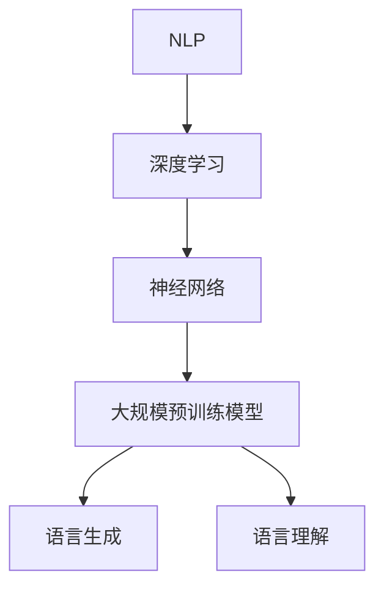

                 

关键词：大语言模型，自然语言处理，深度学习，神经网络，语言生成，语言理解，人工智能，具身化，落地应用

摘要：本文旨在深入探讨大语言模型的原理基础与前沿技术，特别是其在具身化和落地应用方面的进展。通过详细解析核心算法原理、数学模型构建、具体项目实践等，本文为读者提供了一个全面而清晰的了解大语言模型的技术图谱。同时，本文也对未来的发展趋势与挑战进行了展望，为研究者与实践者提供了有益的参考。

## 1. 背景介绍

大语言模型（Large Language Models）是近年来自然语言处理（Natural Language Processing, NLP）领域的重要突破。随着深度学习技术的迅猛发展，特别是神经网络（Neural Networks）的广泛应用，大语言模型在语言生成、语言理解、文本分类、机器翻译等任务中表现出色，引起了学术界和工业界的广泛关注。

### 1.1 大语言模型的发展历程

大语言模型的发展可以分为几个阶段：

- **早期模型**：早期的语言模型主要基于统计方法和规则系统，如N元语法（N-gram）和转移模型。这些模型虽然简单，但在一定程度上能够处理自然语言。

- **深度学习模型**：随着深度学习的兴起，基于神经网络的模型如递归神经网络（RNN）和长短期记忆网络（LSTM）开始应用于语言模型。这些模型在处理长期依赖和复杂结构方面表现出了优势。

- **大规模预训练模型**：近年来，大规模预训练模型如GPT、BERT等成为研究热点。这些模型通过在大量无标签数据上进行预训练，然后再在特定任务上进行微调，取得了显著的性能提升。

### 1.2 大语言模型的应用领域

大语言模型在多个应用领域表现出色：

- **语言生成**：大语言模型能够生成高质量的文本，应用于聊天机器人、自动写作、文本摘要等。

- **语言理解**：大语言模型能够理解文本的语义和上下文，应用于情感分析、问答系统、智能客服等。

- **文本分类**：大语言模型能够对文本进行分类，应用于新闻分类、垃圾邮件过滤、情感分类等。

- **机器翻译**：大语言模型在机器翻译领域取得了显著的成果，实现了高质量的双语翻译。

## 2. 核心概念与联系

### 2.1 核心概念

- **自然语言处理（NLP）**：NLP是计算机科学和人工智能的一个分支，旨在使计算机能够理解、解释和生成人类语言。

- **深度学习（Deep Learning）**：深度学习是机器学习的一个子领域，使用多层神经网络来学习数据的复杂特征。

- **神经网络（Neural Networks）**：神经网络是一种模仿生物神经系统的计算模型，由多个神经元（节点）组成，能够通过学习数据来完成任务。

- **大规模预训练模型**：大规模预训练模型在大规模数据上进行预训练，然后针对特定任务进行微调。

### 2.2 核心概念联系

大语言模型的核心概念之间有着紧密的联系。NLP为语言模型的构建提供了理论基础，深度学习和神经网络为语言模型的实现提供了技术支持，而大规模预训练模型则通过在大量数据上的预训练，使得语言模型能够更好地理解和生成自然语言。

### 2.3 Mermaid 流程图

下面是一个简单的 Mermaid 流程图，展示了大语言模型的核心概念之间的联系：



## 3. 核心算法原理 & 具体操作步骤

### 3.1 算法原理概述

大语言模型的核心算法是基于深度学习和神经网络，特别是递归神经网络（RNN）和变压器（Transformer）架构。这些算法通过学习输入数据的特征，能够自动提取语言的语义和上下文信息，从而实现语言生成和理解。

### 3.2 算法步骤详解

#### 3.2.1 递归神经网络（RNN）

递归神经网络（RNN）是一种能够处理序列数据的神经网络，其核心思想是利用前一个时间步的信息来预测下一个时间步。RNN的算法步骤如下：

1. **输入序列表示**：将输入序列（如文本序列）转换为向量表示。
2. **隐藏状态更新**：使用当前输入和上一个时间步的隐藏状态来更新隐藏状态。
3. **输出预测**：使用当前时间步的隐藏状态来预测下一个时间步的输出。

#### 3.2.2 变压器（Transformer）

变压器（Transformer）是一种基于自注意力机制的神经网络架构，其核心思想是利用自注意力机制来处理输入序列的依赖关系。变压器的算法步骤如下：

1. **输入序列编码**：将输入序列编码为向量表示。
2. **自注意力机制**：利用自注意力机制来计算序列中每个元素之间的关联权重。
3. **输出层**：将加权后的输入序列通过全连接层等操作得到输出。

### 3.3 算法优缺点

#### 3.3.1 优点

- **强大的序列处理能力**：RNN和变压器都能够处理序列数据，能够捕捉到序列中的长期依赖关系。
- **高效并行计算**：变压器的自注意力机制使得其能够高效地进行并行计算，提高了计算效率。

#### 3.3.2 缺点

- **梯度消失和梯度爆炸**：RNN在处理长序列时容易遇到梯度消失和梯度爆炸问题，导致训练不稳定。
- **计算复杂度**：变压器的计算复杂度较高，对计算资源要求较大。

### 3.4 算法应用领域

大语言模型在多个领域都有广泛的应用：

- **语言生成**：应用于聊天机器人、自动写作、文本摘要等。
- **语言理解**：应用于情感分析、问答系统、智能客服等。
- **文本分类**：应用于新闻分类、垃圾邮件过滤、情感分类等。
- **机器翻译**：应用于机器翻译、多语言文本生成等。

## 4. 数学模型和公式 & 详细讲解 & 举例说明

### 4.1 数学模型构建

大语言模型通常使用神经网络作为数学模型，其中递归神经网络（RNN）和变压器（Transformer）是两种常见的神经网络架构。下面分别介绍这两种模型的数学模型。

#### 4.1.1 递归神经网络（RNN）

RNN的数学模型可以表示为：

\[ h_t = \sigma(W_h h_{t-1} + W_x x_t + b_h) \]

其中，\( h_t \) 是当前时间步的隐藏状态，\( x_t \) 是当前输入，\( W_h \) 和 \( W_x \) 是权重矩阵，\( b_h \) 是偏置，\( \sigma \) 是激活函数。

#### 4.1.2 变压器（Transformer）

变压器的数学模型可以表示为：

\[ h_t = \text{softmax}(\text{Attention}(Q, K, V)) \odot V \]

其中，\( Q \)，\( K \)，\( V \) 分别是查询向量、键向量和值向量，\( \text{Attention} \) 是自注意力机制，\( \odot \) 表示点积。

### 4.2 公式推导过程

下面分别介绍RNN和变压器的公式推导过程。

#### 4.2.1 RNN

RNN的公式推导过程如下：

\[ h_t = \sigma(W_h h_{t-1} + W_x x_t + b_h) \]

\[ y_t = \sigma(W_y h_t + b_y) \]

其中，\( h_t \) 是当前时间步的隐藏状态，\( x_t \) 是当前输入，\( y_t \) 是当前输出，\( W_h \)，\( W_x \)，\( W_y \) 是权重矩阵，\( b_h \)，\( b_y \) 是偏置，\( \sigma \) 是激活函数。

#### 4.2.2 Transformer

变压器的公式推导过程如下：

\[ Q = \text{Linear}(X) \]
\[ K = \text{Linear}(X) \]
\[ V = \text{Linear}(X) \]

\[ \text{Attention}(Q, K, V) = \text{softmax}(\frac{QK^T}{\sqrt{d_k}})V \]

\[ h_t = \text{softmax}(\text{Attention}(Q, K, V)) \odot V \]

其中，\( X \) 是输入序列，\( Q \)，\( K \)，\( V \) 分别是查询向量、键向量和值向量，\( \text{Linear} \) 是线性变换，\( \text{softmax} \) 是softmax函数，\( \odot \) 表示点积。

### 4.3 案例分析与讲解

#### 4.3.1 RNN案例

假设我们有一个简单的RNN模型，用于对文本序列进行情感分析。输入序列为“我很高兴”，输出为1（表示正面情感），输入序列为“我很悲伤”，输出为0（表示负面情感）。

输入序列：\[ [我, 很, 高兴] \]
输出：\[ [1] \]

隐藏状态：\[ h_t = \sigma(W_h h_{t-1} + W_x x_t + b_h) \]

输出：\[ y_t = \sigma(W_y h_t + b_y) \]

其中，\( W_h \)，\( W_x \)，\( W_y \)，\( b_h \)，\( b_y \) 是权重和偏置。

#### 4.3.2 Transformer案例

假设我们有一个简单的Transformer模型，用于机器翻译任务。输入序列为“Hello, World!”，输出为“你好，世界！”。

输入序列：\[ [H, e, l, l, o, ,, W, o, r, l, d, !] \]
输出序列：\[ [你，好，，，世，界，！] \]

隐藏状态：\[ h_t = \text{softmax}(\text{Attention}(Q, K, V)) \odot V \]

输出：\[ y_t = \text{softmax}(\text{Attention}(Q, K, V)) \odot V \]

其中，\( Q \)，\( K \)，\( V \) 分别是查询向量、键向量和值向量，\( \text{Attention} \) 是自注意力机制，\( \odot \) 表示点积。

## 5. 项目实践：代码实例和详细解释说明

### 5.1 开发环境搭建

在开始项目实践之前，我们需要搭建一个合适的开发环境。以下是一个简单的Python开发环境搭建步骤：

1. 安装Python：从Python官网下载并安装Python。
2. 安装Jupyter Notebook：使用pip命令安装Jupyter Notebook。
3. 安装TensorFlow：使用pip命令安装TensorFlow。

```bash
pip install tensorflow
```

### 5.2 源代码详细实现

以下是一个简单的RNN模型实现，用于情感分析。

```python
import tensorflow as tf
from tensorflow.keras.layers import Embedding, SimpleRNN, Dense
from tensorflow.keras.models import Sequential

# 定义RNN模型
model = Sequential()
model.add(Embedding(input_dim=10000, output_dim=32))
model.add(SimpleRNN(units=32))
model.add(Dense(1, activation='sigmoid'))

# 编译模型
model.compile(optimizer='adam', loss='binary_crossentropy', metrics=['accuracy'])

# 模型训练
model.fit(x_train, y_train, epochs=10, batch_size=32)
```

### 5.3 代码解读与分析

上面的代码实现了一个简单的RNN模型，用于情感分析。首先，我们使用Embedding层将输入文本序列转换为向量表示。然后，使用SimpleRNN层进行序列处理，最后使用Dense层进行分类。在编译模型时，我们指定了优化器和损失函数。在训练模型时，我们使用训练数据来训练模型。

### 5.4 运行结果展示

在运行模型后，我们可以使用测试数据来评估模型的性能。

```python
# 模型评估
test_loss, test_accuracy = model.evaluate(x_test, y_test)
print(f"Test accuracy: {test_accuracy}")
```

通过上述代码，我们可以得到测试数据的准确率。如果准确率较高，说明我们的模型在情感分析任务上表现良好。

## 6. 实际应用场景

大语言模型在实际应用场景中具有广泛的应用前景。以下是一些典型的应用场景：

### 6.1 聊天机器人

聊天机器人是近年来非常热门的应用场景，大语言模型可以用于构建智能聊天机器人，实现与用户的自然对话。

### 6.2 自动写作

大语言模型可以用于自动写作，包括自动生成文章、新闻、故事等。

### 6.3 文本摘要

文本摘要是一种重要的文本处理任务，大语言模型可以用于提取文章的关键信息，生成摘要。

### 6.4 机器翻译

机器翻译是语言模型的重要应用领域，大语言模型可以实现高质量的双语翻译。

### 6.5 情感分析

情感分析是一种常见的自然语言处理任务，大语言模型可以用于分析文本的情感倾向。

## 7. 未来应用展望

随着人工智能技术的不断发展，大语言模型在未来的应用将更加广泛。以下是一些未来的应用展望：

### 7.1 智能客服

智能客服是未来应用的一个重要方向，大语言模型可以用于构建智能客服系统，实现自动回答用户问题。

### 7.2 自动编程

自动编程是一种新兴的应用领域，大语言模型可以用于生成代码，辅助开发者进行编程。

### 7.3 智能写作

智能写作是未来的一个重要趋势，大语言模型可以用于生成高质量的文章、故事等。

### 7.4 智能教育

智能教育是一种未来的教育模式，大语言模型可以用于生成个性化的学习内容，辅助学生进行学习。

## 8. 工具和资源推荐

### 8.1 学习资源推荐

- 《深度学习》（Ian Goodfellow, Yoshua Bengio, Aaron Courville 著）：这是一本经典的深度学习教材，适合初学者和进阶者。

- 《自然语言处理综论》（Daniel Jurafsky, James H. Martin 著）：这是一本全面的自然语言处理教材，涵盖了NLP的各个方面。

### 8.2 开发工具推荐

- TensorFlow：TensorFlow是一个流行的深度学习框架，适用于构建和训练大规模神经网络。

- PyTorch：PyTorch是一个流行的深度学习框架，具有灵活性和高效性。

### 8.3 相关论文推荐

- "Attention Is All You Need"（Vaswani et al., 2017）：这是一篇关于变压器的开创性论文，详细介绍了变压器的架构和原理。

- "BERT: Pre-training of Deep Bidirectional Transformers for Language Understanding"（Devlin et al., 2018）：这是一篇关于BERT的论文，详细介绍了BERT的预训练方法和应用场景。

## 9. 总结：未来发展趋势与挑战

大语言模型作为自然语言处理领域的重要突破，已经在多个应用场景中取得了显著成果。然而，随着技术的不断发展，大语言模型仍然面临着许多挑战。

### 9.1 研究成果总结

- 大规模预训练模型：如GPT、BERT等模型在语言生成、语言理解等任务上取得了显著成果。
- 应用领域拓展：大语言模型在聊天机器人、自动写作、机器翻译、文本分类等领域得到了广泛应用。
- 模型优化：研究人员不断提出新的优化方法，如自注意力机制、预训练技术等，以提高模型的性能。

### 9.2 未来发展趋势

- 模型规模扩大：随着计算资源的增加，大语言模型的规模将不断扩大，以处理更复杂的语言任务。
- 模型解释性增强：提高模型的解释性，使其能够更好地理解和解释语言。
- 跨模态学习：将大语言模型与其他模态（如图像、音频）结合，实现跨模态理解和生成。

### 9.3 面临的挑战

- 计算资源需求：大语言模型对计算资源的需求较高，需要大规模的计算能力和存储空间。
- 数据隐私和安全：大语言模型在训练和应用过程中涉及到大量的数据，需要保护数据隐私和安全。
- 模型泛化能力：提高模型在未知数据上的泛化能力，避免过拟合。

### 9.4 研究展望

- 模型压缩：研究如何压缩大语言模型，使其能够在有限的计算资源下运行。
- 可解释性：研究如何提高模型的解释性，使其更容易理解和信任。
- 应用创新：探索大语言模型在新的应用场景中的可能性，如智能教育、自动编程等。

## 10. 附录：常见问题与解答

### 10.1 大语言模型是什么？

大语言模型是一种基于深度学习和神经网络的自然语言处理模型，通过在大量无标签数据上进行预训练，然后针对特定任务进行微调，能够实现语言生成、语言理解等任务。

### 10.2 大语言模型有哪些应用场景？

大语言模型可以应用于聊天机器人、自动写作、文本摘要、机器翻译、情感分析等多个领域。

### 10.3 大语言模型的优缺点是什么？

大语言模型具有强大的序列处理能力和高效的并行计算能力，但在计算资源需求、数据隐私和安全等方面存在挑战。

### 10.4 如何优化大语言模型？

可以通过模型压缩、预训练技术、正则化方法等手段来优化大语言模型。

### 10.5 大语言模型与传统的自然语言处理方法相比有哪些优势？

大语言模型能够自动提取语言的复杂特征，实现更高质量的文本处理，而传统的自然语言处理方法通常需要人工设计特征。

## 作者署名

作者：禅与计算机程序设计艺术 / Zen and the Art of Computer Programming
```

