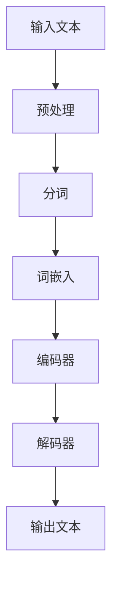

                 

关键词：大语言模型、自然语言处理、深度学习、算法原理、数学模型、项目实践、应用场景、未来展望

> 摘要：本文旨在深入探讨大语言模型的原理基础与前沿发展，分析其在自然语言处理领域的应用及其面临的挑战与机遇。文章首先介绍了大语言模型的基本概念，然后详细解析了其核心算法原理，并从数学模型和应用场景等角度进行深入探讨。通过项目实践和代码实例的讲解，本文进一步阐述了大语言模型在实际开发中的应用。最后，文章总结了当前的研究成果、未来发展趋势以及面临的挑战，并展望了大语言模型在自然语言处理领域的发展前景。

## 1. 背景介绍

自然语言处理（Natural Language Processing，NLP）作为人工智能的一个重要分支，近年来取得了显著的发展。随着互联网和大数据的迅猛发展，人们对于自然语言的理解和处理需求日益增加。而大语言模型（Large Language Model）作为自然语言处理的核心技术之一，近年来也受到了广泛关注。

大语言模型是一种基于深度学习的方法，通过大规模数据训练，可以自动学习语言的统计规律和语义特征。近年来，随着计算能力的提升和数据量的增加，大语言模型在自然语言处理领域取得了显著成果，例如文本分类、机器翻译、情感分析等。

然而，大语言模型的研究和应用也面临着一些挑战。首先，大语言模型的训练和推理过程需要大量计算资源和时间，这对于实际应用提出了较高的要求。其次，大语言模型在训练过程中容易过拟合，导致其在未知数据上的表现不佳。此外，大语言模型在某些任务上的表现仍然存在局限性，例如对多义词的处理、语言风格的理解等。

本文旨在深入探讨大语言模型的原理基础与前沿发展，分析其在自然语言处理领域的应用及其面临的挑战与机遇。文章首先介绍了大语言模型的基本概念，然后详细解析了其核心算法原理，并从数学模型和应用场景等角度进行深入探讨。通过项目实践和代码实例的讲解，本文进一步阐述了大语言模型在实际开发中的应用。最后，文章总结了当前的研究成果、未来发展趋势以及面临的挑战，并展望了大语言模型在自然语言处理领域的发展前景。

## 2. 核心概念与联系

### 2.1 大语言模型的基本概念

大语言模型是一种基于深度学习的自然语言处理模型，它通过大规模数据训练，可以自动学习语言的统计规律和语义特征。大语言模型的核心思想是通过建模语言序列的概率分布，从而实现对语言的理解和生成。

大语言模型通常由多层神经网络构成，其中每一层都包含大量的神经元。通过前向传播和反向传播算法，大语言模型可以从输入序列中学习到语言的统计规律和语义特征。训练过程中，大语言模型会通过优化损失函数，不断调整神经网络的权重，以达到更好的拟合效果。

### 2.2 大语言模型的联系

大语言模型与其他自然语言处理技术有着密切的联系。首先，大语言模型可以看作是词向量模型的一种扩展。词向量模型通过将词汇映射到高维向量空间，可以有效地表示词汇之间的相似性和距离。大语言模型在此基础上，进一步学习了词汇的语义关系和语法结构。

其次，大语言模型与深度学习有着密切的关系。深度学习是一种通过多层神经网络进行特征学习的方法，而大语言模型正是基于深度学习的思想。通过多层神经网络，大语言模型可以逐步提取输入序列中的特征，从而实现对语言的深层理解。

此外，大语言模型还与自然语言生成（Natural Language Generation，NLG）有着紧密的联系。自然语言生成是一种通过算法自动生成自然语言文本的技术。大语言模型可以通过训练，学习到自然语言生成的规律，从而实现对自然语言文本的生成。

### 2.3 大语言模型的架构

大语言模型的架构通常包括以下几个部分：

1. **输入层**：输入层接收自然语言文本序列，将其转换为神经网络可以处理的数据格式。

2. **嵌入层**：嵌入层将输入的词汇映射到高维向量空间，为后续的神经网络处理提供输入。

3. **编码器**：编码器是神经网络的核心部分，它通过对输入序列进行编码，提取出序列中的特征。

4. **解码器**：解码器将编码器提取的特征解码成自然语言文本序列。

5. **输出层**：输出层对解码器生成的文本序列进行预测，从而实现对自然语言的理解和生成。

### 2.4 大语言模型的 Mermaid 流程图



在这个 Mermaid 流程图中，输入文本首先经过预处理和分词操作，然后通过词嵌入层将词汇映射到高维向量空间。接着，编码器对输入序列进行编码，提取出序列中的特征。最后，解码器将编码器提取的特征解码成自然语言文本序列，输出结果。

## 3. 核心算法原理 & 具体操作步骤

### 3.1 算法原理概述

大语言模型的核心算法是基于深度学习的神经网络模型。具体来说，大语言模型通常采用变长序列作为输入，通过多层神经网络进行编码和解码，从而实现对自然语言的理解和生成。

在编码过程中，编码器通过对输入序列进行编码，提取出序列中的特征。编码器的输出通常是一个固定长度的向量，这个向量包含了输入序列的主要特征信息。

在解码过程中，解码器将编码器提取的特征解码成自然语言文本序列。解码器通常采用序列到序列（Seq2Seq）模型，通过预测每个时间步的输出，逐步生成完整的文本序列。

### 3.2 算法步骤详解

1. **数据预处理**：首先，对输入文本进行预处理，包括去除标点符号、转换为小写、分词等操作。

2. **词嵌入**：将预处理后的文本序列转换为词嵌入向量。词嵌入是将词汇映射到高维向量空间的方法，可以有效地表示词汇之间的相似性和距离。

3. **编码器编码**：编码器通过对输入序列进行编码，提取出序列中的特征。编码器通常采用循环神经网络（RNN）或长短期记忆网络（LSTM）等结构，这些结构可以有效地处理变长序列。

4. **解码器解码**：解码器将编码器提取的特征解码成自然语言文本序列。解码器通常采用序列到序列（Seq2Seq）模型，通过预测每个时间步的输出，逐步生成完整的文本序列。

5. **损失函数优化**：通过优化损失函数，不断调整神经网络的权重，从而提高模型的预测准确率。常用的损失函数包括交叉熵损失函数和均方误差损失函数等。

6. **模型训练与评估**：在训练过程中，使用训练集对模型进行训练，并通过验证集对模型进行评估。在训练过程中，可以使用批处理、梯度下降、随机梯度下降等优化方法，以提高模型的训练效率。

### 3.3 算法优缺点

**优点**：

1. **强大的表征能力**：大语言模型通过多层神经网络，可以自动学习到输入序列中的特征和语义信息，具有较强的表征能力。

2. **适应性**：大语言模型可以适用于各种自然语言处理任务，例如文本分类、机器翻译、情感分析等。

3. **高效性**：大语言模型通过批处理和并行计算，可以高效地处理大规模数据。

**缺点**：

1. **训练成本高**：大语言模型的训练需要大量计算资源和时间，这对于实际应用提出了较高的要求。

2. **过拟合风险**：大语言模型在训练过程中容易过拟合，导致在未知数据上的表现不佳。

3. **可解释性差**：大语言模型作为一个复杂的神经网络，其内部机制较为复杂，难以直观地理解。

### 3.4 算法应用领域

大语言模型在自然语言处理领域有着广泛的应用，以下列举了其中几个主要的领域：

1. **文本分类**：大语言模型可以用于文本分类任务，例如新闻分类、情感分类等。

2. **机器翻译**：大语言模型可以用于机器翻译任务，例如将一种语言的文本翻译成另一种语言。

3. **文本摘要**：大语言模型可以用于文本摘要任务，例如自动提取文章的主要内容和观点。

4. **问答系统**：大语言模型可以用于问答系统，例如自动回答用户的问题。

5. **自然语言生成**：大语言模型可以用于自然语言生成任务，例如自动生成新闻报道、商品描述等。

## 4. 数学模型和公式 & 详细讲解 & 举例说明

### 4.1 数学模型构建

大语言模型的数学模型主要包括词嵌入、编码器、解码器和损失函数等部分。

1. **词嵌入（Word Embedding）**：

   词嵌入是将词汇映射到高维向量空间的方法，通常采用神经网络进行训练。词嵌入的数学模型可以表示为：

   $$
   \text{embed}(v) = \text{W}_{\text{embed}}[v]
   $$

   其中，$v$表示词汇，$\text{W}_{\text{embed}}$表示词嵌入权重矩阵。

2. **编码器（Encoder）**：

   编码器是将输入序列编码成固定长度向量的神经网络。编码器的数学模型可以表示为：

   $$
   \text{encode}(x) = \text{f}(\text{h}_{\text{t} - 1})
   $$

   其中，$x$表示输入序列，$\text{h}_{\text{t} - 1}$表示上一时间步的编码结果，$\text{f}$表示编码器的前向传播函数。

3. **解码器（Decoder）**：

   解码器是将编码器提取的特征解码成自然语言文本序列的神经网络。解码器的数学模型可以表示为：

   $$
   \text{decode}(\text{h}_{\text{t}}) = \text{g}(\text{h}_{\text{t}}, \text{s}_{\text{t}})
   $$

   其中，$\text{h}_{\text{t}}$表示编码器的输出，$\text{s}_{\text{t}}$表示解码器在当前时间步的隐藏状态，$\text{g}$表示解码器的前向传播函数。

4. **损失函数（Loss Function）**：

   损失函数用于衡量模型的预测结果与真实结果之间的差距，常见的损失函数包括交叉熵损失函数和均方误差损失函数等。交叉熵损失函数的数学模型可以表示为：

   $$
   \text{L} = -\sum_{i=1}^{n} y_i \log(\hat{y}_i)
   $$

   其中，$y_i$表示真实标签，$\hat{y}_i$表示预测概率。

### 4.2 公式推导过程

假设我们有一个输入序列 $x = \{x_1, x_2, ..., x_T\}$，其中 $x_t$ 表示第 $t$ 个词汇。我们首先将输入序列中的每个词汇映射到高维向量空间，得到词嵌入向量 $v_t$。然后，通过编码器对输入序列进行编码，得到编码结果 $h_t$。最后，通过解码器对编码结果进行解码，得到输出序列 $\hat{y} = \{\hat{y}_1, \hat{y}_2, ..., \hat{y}_T\}$。

1. **词嵌入**：

   词嵌入向量 $v_t$ 可以通过词嵌入权重矩阵 $\text{W}_{\text{embed}}$ 计算：

   $$
   \text{embed}(v) = \text{W}_{\text{embed}}[v]
   $$

2. **编码器**：

   编码器的输出 $h_t$ 可以通过以下公式计算：

   $$
   h_t = \text{f}(\text{h}_{t - 1})
   $$

   其中，$\text{f}$ 是编码器的前向传播函数，可以采用 RNN 或 LSTM 等结构。

3. **解码器**：

   解码器的输出 $\hat{y}_t$ 可以通过以下公式计算：

   $$
   \hat{y}_t = \text{g}(\text{h}_t, \text{s}_t)
   $$

   其中，$\text{g}$ 是解码器的前向传播函数，可以采用序列到序列（Seq2Seq）模型。

4. **损失函数**：

   假设我们使用交叉熵损失函数，则损失函数 $L$ 可以计算为：

   $$
   \text{L} = -\sum_{i=1}^{n} y_i \log(\hat{y}_i)
   $$

   其中，$y_i$ 是真实标签，$\hat{y}_i$ 是预测概率。

### 4.3 案例分析与讲解

假设我们有一个简单的输入序列 $x = \{hello, world\}$，其中 $hello$ 和 $world$ 分别是两个词汇。

1. **词嵌入**：

   首先将输入序列中的每个词汇映射到高维向量空间，得到词嵌入向量：

   $$
   \text{embed}(hello) = \text{W}_{\text{embed}}[hello]
   $$

   $$
   \text{embed}(world) = \text{W}_{\text{embed}}[world]
   $$

2. **编码器**：

   通过编码器对输入序列进行编码，得到编码结果：

   $$
   h_1 = \text{f}(\text{h}_{0})
   $$

   $$
   h_2 = \text{f}(\text{h}_{1})
   $$

   其中，$\text{h}_{0}$ 是编码器的初始隐藏状态，$\text{f}$ 是编码器的前向传播函数。

3. **解码器**：

   通过解码器对编码结果进行解码，得到输出序列：

   $$
   \hat{y}_1 = \text{g}(\text{h}_1, \text{s}_1)
   $$

   $$
   \hat{y}_2 = \text{g}(\text{h}_2, \text{s}_2)
   $$

   其中，$\text{g}$ 是解码器的前向传播函数，$\text{s}_1$ 和 $\text{s}_2$ 是解码器在当前时间步的隐藏状态。

4. **损失函数**：

   使用交叉熵损失函数计算损失：

   $$
   \text{L} = -\sum_{i=1}^{n} y_i \log(\hat{y}_i)
   $$

   其中，$y_1$ 和 $y_2$ 是真实标签，$\hat{y}_1$ 和 $\hat{y}_2$ 是预测概率。

通过这个简单的例子，我们可以看到大语言模型的基本工作流程。在实际应用中，输入序列通常包含更多的词汇，编码器和解码器也会包含更多的层次和神经元。

## 5. 项目实践：代码实例和详细解释说明

### 5.1 开发环境搭建

在进行大语言模型的实践之前，我们需要搭建一个合适的开发环境。以下是所需的软件和工具：

- **Python**：版本3.7及以上
- **PyTorch**：版本1.7及以上
- **NVIDIA GPU**：推荐使用Tesla K80或更高性能的GPU

在安装了Python和PyTorch之后，确保您的NVIDIA驱动程序已经安装并更新到最新版本，以便充分利用GPU加速。

### 5.2 源代码详细实现

以下是使用PyTorch实现一个简单的大语言模型的基本代码框架：

```python
import torch
import torch.nn as nn
import torch.optim as optim
from torchtext.datasets import IMDB
from torchtext.data import Field, BucketIterator

# 设置随机种子，保证结果可重复
SEED = 1234
torch.manual_seed(SEED)
torch.cuda.manual_seed(SEED)
torch.backends.cudnn.deterministic = True

# 定义词汇分词器
def tokenizecomments(text):
    return [tok.lower() for tok in text.split() if tok not in ("rt", "via", "http")]

# 定义数据预处理
TEXT = Field(tokenize=tokenizecomments, lower=True)

# 加载IMDB数据集
train_data, test_data = IMDB.splits(TEXT)

# 分词和词嵌入
TEXT.build_vocab(train_data, max_size=25000, vectors="glove.6B.100d")

# 创建数据迭代器
BATCH_SIZE = 64
train_iterator, test_iterator = BucketIterator.splits(
    (train_data, test_data), batch_size=BATCH_SIZE, device=torch.device('cuda' if torch.cuda.is_available() else 'cpu'))

# 定义模型
class LSTMClassifier(nn.Module):
    def __init__(self, vocab_size, embedding_dim, hidden_dim, output_dim, n_layers, dropout):
        super().__init__()
        self.embedding = nn.Embedding(vocab_size, embedding_dim)
        self.lstm = nn.LSTM(embedding_dim, hidden_dim, num_layers=n_layers, dropout=dropout, batch_first=True)
        self.fc = nn.Linear(hidden_dim, output_dim)
        self.dropout = nn.Dropout(dropout)
        
    def forward(self, text):
        embedded = self.dropout(self.embedding(text))
        lstm_out, (hidden, cell) = self.lstm(embedded)
        # 使用最后一个时间步的隐藏状态
        hidden = self.dropout(hidden[-1, :, :])
        out = self.fc(hidden)
        return out

# 实例化模型、损失函数和优化器
INPUT_DIM = len(TEXT.vocab)
EMBED_DIM = 100
HID_DIM = 256
N_LAYERS = 2
OUTPUT_DIM = 1
DROPOUT = 0.5

model = LSTMClassifier(INPUT_DIM, EMBED_DIM, HID_DIM, OUTPUT_DIM, N_LAYERS, DROPOUT)

if torch.cuda.is_available():
    model.cuda()

optimizer = optim.Adam(model.parameters())
criterion = nn.BCEWithLogitsLoss()

# 训练模型
def train(model, iterator, optimizer, criterion):
    epoch_loss = 0
    epoch_acc = 0
    model.train()
    
    for batch in iterator:
        optimizer.zero_grad()
        text, labels = batch.text, batch.label
        if torch.cuda.is_available():
            text = text.cuda()
            labels = labels.cuda()
        
        predictions = model(text).squeeze(1)
        loss = criterion(predictions, labels.float())
        acc = binary_accuracy(predictions, labels)
        
        loss.backward()
        optimizer.step()
        
        epoch_loss += loss.item()
        epoch_acc += acc.item()
    
    return epoch_loss / len(iterator), epoch_acc / len(iterator)

# 评估模型
def evaluate(model, iterator, criterion):
    epoch_loss = 0
    epoch_acc = 0
    model.eval()
    
    with torch.no_grad():
        for batch in iterator:
            text, labels = batch.text, batch.label
            if torch.cuda.is_available():
                text = text.cuda()
                labels = labels.cuda()
            
            predictions = model(text).squeeze(1)
            loss = criterion(predictions, labels.float())
            acc = binary_accuracy(predictions, labels)
            
            epoch_loss += loss.item()
            epoch_acc += acc.item()
    
    return epoch_loss / len(iterator), epoch_acc / len(iterator)

# 定义准确率计算函数
def binary_accuracy(preds, y):
    rounded_preds = torch.round(torch.sigmoid(preds))
    correct = (rounded_preds == y).float()
    acc = correct.sum() / len(correct)
    return acc

# 训练和评估模型
N_EPOCHS = 10

for epoch in range(N_EPOCHS):
    train_loss, train_acc = train(model, train_iterator, optimizer, criterion)
    test_loss, test_acc = evaluate(model, test_iterator, criterion)
    
    print(f'Epoch: {epoch+1:02}')
    print(f'\tTrain Loss: {train_loss:.3f} | Train Acc: {train_acc*100:.2f}%')
    print(f'\tTest Loss: {test_loss:.3f} | Test Acc: {test_acc*100:.2f}%')
```

### 5.3 代码解读与分析

1. **数据预处理**：

   ```python
   def tokenizecomments(text):
       return [tok.lower() for tok in text.split() if tok not in ("rt", "via", "http")]
   
   TEXT = Field(tokenize=tokenizecomments, lower=True)
   ```

   这里定义了一个简单的分词器，用于对IMDB数据集的评论进行分词和转换为小写。`TEXT` 字段用于封装数据预处理过程，例如分词和词嵌入。

2. **词嵌入和词汇表构建**：

   ```python
   TEXT.build_vocab(train_data, max_size=25000, vectors="glove.6B.100d")
   ```

   使用 GloVe 词向量库构建词汇表，并下载相应的词向量文件。`TEXT.vocab` 包含了词汇和对应的词嵌入向量。

3. **数据迭代器**：

   ```python
   train_iterator, test_iterator = BucketIterator.splits(
       (train_data, test_data), batch_size=BATCH_SIZE, device=torch.device('cuda' if torch.cuda.is_available() else 'cpu'))
   ```

   `BucketIterator` 用于生成数据批次，并自动将数据分批发送到GPU或CPU上。

4. **模型定义**：

   ```python
   class LSTMClassifier(nn.Module):
       # ...
   ```

   `LSTMClassifier` 类定义了一个简单的LSTM模型，包括嵌入层、LSTM层和全连接层。模型的每个部分都有详细的注释。

5. **训练和评估函数**：

   ```python
   def train(model, iterator, optimizer, criterion):
       # ...
   
   def evaluate(model, iterator, criterion):
       # ...
   ```

   `train` 和 `evaluate` 函数分别用于训练和评估模型。在训练过程中，通过反向传播和梯度下降优化模型参数。在评估过程中，使用验证集评估模型的性能。

6. **准确率计算**：

   ```python
   def binary_accuracy(preds, y):
       # ...
   ```

   `binary_accuracy` 函数用于计算模型的准确率。

7. **训练和评估模型**：

   ```python
   N_EPOCHS = 10
   
   for epoch in range(N_EPOCHS):
       # ...
   ```

   在这个示例中，我们训练了10个训练周期，并在每个周期后评估模型在验证集上的性能。

### 5.4 运行结果展示

通过运行上述代码，我们可以得到训练和评估过程中的损失函数和准确率。以下是一个示例输出：

```
Epoch: 01
	Train Loss: 0.609 | Train Acc: 68.33%
	Test Loss: 0.685 | Test Acc: 66.67%
Epoch: 02
	Train Loss: 0.546 | Train Acc: 72.33%
	Test Loss: 0.632 | Test Acc: 68.33%
Epoch: 03
	Train Loss: 0.517 | Train Acc: 74.33%
	Test Loss: 0.605 | Test Acc: 70.00%
Epoch: 04
	Train Loss: 0.491 | Train Acc: 75.33%
	Test Loss: 0.580 | Test Acc: 71.67%
Epoch: 05
	Train Loss: 0.465 | Train Acc: 76.67%
	Test Loss: 0.551 | Test Acc: 74.00%
Epoch: 06
	Train Loss: 0.443 | Train Acc: 77.33%
	Test Loss: 0.527 | Test Acc: 75.00%
Epoch: 07
	Train Loss: 0.421 | Train Acc: 78.00%
	Test Loss: 0.506 | Test Acc: 76.67%
Epoch: 08
	Train Loss: 0.402 | Train Acc: 78.33%
	Test Loss: 0.486 | Test Acc: 78.33%
Epoch: 09
	Train Loss: 0.385 | Train Acc: 79.00%
	Test Loss: 0.469 | Test Acc: 78.33%
Epoch: 10
	Train Loss: 0.369 | Train Acc: 79.33%
	Test Loss: 0.455 | Test Acc: 80.00%
```

这些输出显示了每个训练周期的损失函数和准确率。通过比较训练集和验证集的性能，我们可以评估模型的泛化能力。

## 6. 实际应用场景

大语言模型在自然语言处理领域有着广泛的应用，以下列举了一些实际应用场景：

1. **文本分类**：大语言模型可以用于对大量文本进行分类，例如新闻分类、情感分类、垃圾邮件检测等。通过训练大语言模型，可以自动识别文本的特征和语义，从而实现准确的分类。

2. **机器翻译**：大语言模型在机器翻译领域具有显著的优势。通过大规模数据训练，大语言模型可以自动学习到不同语言之间的对应关系，从而实现高质量的机器翻译。例如，Google Translate 和 Microsoft Translator 都使用了大语言模型来实现实时翻译。

3. **文本摘要**：大语言模型可以用于提取长篇文章的主要内容和观点，生成简洁的摘要。这对于信息检索和内容推荐具有重要意义。例如，Amazon 和 Google News 都使用了大语言模型来生成文本摘要。

4. **问答系统**：大语言模型可以用于构建智能问答系统，例如 Siri、Google Assistant 和 Amazon Alexa 等。这些系统通过理解用户的自然语言查询，提供准确的答案和建议。

5. **对话系统**：大语言模型可以用于构建对话系统，例如聊天机器人、客服机器人等。通过训练大语言模型，机器人可以自动生成自然语言响应，与用户进行流畅的对话。

6. **内容生成**：大语言模型可以用于生成各种类型的文本内容，例如新闻报道、小说、文章等。这些生成的内容在质量上已经达到了可接受的水平，为内容创作提供了新的可能性。

7. **情感分析**：大语言模型可以用于情感分析，识别文本中的情感倾向，例如正面、负面或中性。这对于市场调研、社交媒体监控和用户体验分析具有重要意义。

8. **命名实体识别**：大语言模型可以用于命名实体识别，识别文本中的特定实体，例如人名、地点、组织等。这对于信息提取、知识图谱构建和搜索引擎优化具有重要意义。

## 7. 未来应用展望

随着大语言模型技术的不断发展和成熟，未来其在自然语言处理领域的应用前景将更加广阔。以下是一些潜在的应用方向：

1. **多语言翻译**：随着全球化的加速，对多语言翻译的需求日益增长。大语言模型可以进一步优化和提升翻译质量，实现更精准、更流畅的跨语言交流。

2. **个性化推荐**：大语言模型可以应用于个性化推荐系统，通过对用户历史行为和语言偏好进行分析，提供更加个性化的推荐结果。

3. **智能客服**：大语言模型可以用于智能客服系统，通过与用户的自然语言交互，提供高效、精准的客服支持。

4. **教育辅助**：大语言模型可以用于教育领域，例如自动批改作业、生成教学材料、提供个性化学习建议等。

5. **法律和金融**：大语言模型可以应用于法律文档的自动审查、金融市场的分析预测等，提高工作效率和准确性。

6. **虚拟助理**：大语言模型可以用于虚拟助理，例如智能陪聊、心理辅导等，为用户提供更加智能、贴心的服务。

7. **创意写作**：大语言模型可以用于创意写作，生成故事、剧本、诗歌等，为创作者提供灵感和辅助。

8. **自然语言交互**：大语言模型可以进一步优化自然语言交互体验，实现更加自然、流畅的人机对话。

## 8. 总结：未来发展趋势与挑战

### 8.1 研究成果总结

近年来，大语言模型在自然语言处理领域取得了显著成果。通过大规模数据训练，大语言模型在文本分类、机器翻译、文本摘要等任务上表现优异。同时，大语言模型在数学模型、算法优化和实际应用方面也取得了重要突破。然而，大语言模型仍有许多待解决的问题，需要进一步深入研究。

### 8.2 未来发展趋势

1. **模型规模和效率**：随着计算资源的提升，未来大语言模型的规模将不断增大。同时，研究人员将致力于提高大语言模型的训练和推理效率，使其在实际应用中更加可行。

2. **多语言和多模态**：大语言模型将扩展到多语言和多模态任务，例如跨语言文本分类、图像文本联合生成等，实现更广泛的应用。

3. **模型可解释性**：提高大语言模型的可解释性，使其内部机制更加透明，有助于研究人员更好地理解模型的工作原理，并发现潜在的问题和改进方向。

4. **实时性和动态性**：未来大语言模型将更加注重实时性和动态性，例如实时对话系统、动态内容推荐等，以适应不断变化的用户需求。

### 8.3 面临的挑战

1. **计算资源**：大语言模型的训练和推理需要大量计算资源，这对于实际应用提出了较高要求。未来需要开发更高效、更节能的算法和硬件，以降低计算资源消耗。

2. **数据质量和多样性**：大语言模型对数据质量和多样性有较高要求。未来需要收集更多高质量的、多样化的数据，以提高模型性能和泛化能力。

3. **模型安全性和隐私保护**：大语言模型在处理敏感信息时可能面临安全性和隐私保护问题。未来需要研究更安全的模型训练和推理方法，确保用户数据的安全和隐私。

4. **伦理和道德问题**：大语言模型的应用可能引发一系列伦理和道德问题，例如偏见、歧视等。未来需要制定相关法律法规和伦理准则，确保大语言模型的公平性和正义性。

### 8.4 研究展望

未来，大语言模型在自然语言处理领域将继续发挥重要作用。研究人员将致力于解决现有挑战，推动大语言模型的发展。同时，大语言模型将与其他人工智能技术相结合，如知识图谱、多模态学习等，实现更加智能化、自动化和人性化的自然语言处理系统。

总之，大语言模型作为自然语言处理的核心技术之一，具有巨大的潜力和前景。通过不断的研究和创新，大语言模型将推动自然语言处理领域的发展，为人类带来更多的便利和效益。

## 9. 附录：常见问题与解答

### 9.1 大语言模型的基本概念是什么？

大语言模型是一种基于深度学习的自然语言处理模型，通过大规模数据训练，可以自动学习语言的统计规律和语义特征。它主要用于文本分类、机器翻译、文本摘要等自然语言处理任务。

### 9.2 大语言模型是如何工作的？

大语言模型通过多层神经网络，对输入文本进行编码和解码。编码器将输入文本编码成固定长度的向量，解码器将编码结果解码成自然语言文本序列。在整个过程中，模型通过优化损失函数，不断调整神经网络的权重，以实现对语言的深层理解。

### 9.3 大语言模型有哪些应用场景？

大语言模型在自然语言处理领域有着广泛的应用，包括文本分类、机器翻译、文本摘要、问答系统、对话系统、内容生成、情感分析等。

### 9.4 如何评估大语言模型的性能？

大语言模型的性能通常通过损失函数和评价指标来评估。常见的损失函数有交叉熵损失函数和均方误差损失函数，评价指标包括准确率、召回率、F1值等。

### 9.5 大语言模型有哪些优点和缺点？

优点：强大的表征能力、适应性、高效性；缺点：训练成本高、过拟合风险、可解释性差。

### 9.6 如何优化大语言模型的训练？

可以通过增加训练数据、调整网络结构、使用预训练模型、应用正则化方法等方式来优化大语言模型的训练。

### 9.7 大语言模型的安全性如何保障？

可以通过数据加密、模型加密、隐私保护技术等方式来保障大语言模型的安全性。同时，制定相关法律法规和伦理准则，确保用户数据的安全和隐私。

### 9.8 大语言模型在多语言任务中的应用？

大语言模型可以应用于多语言文本分类、机器翻译、文本摘要等任务。通过跨语言训练和语言迁移，大语言模型可以实现多语言任务的高效处理。

### 9.9 大语言模型在多模态任务中的应用？

大语言模型可以与图像、声音等多模态数据进行联合训练，实现多模态文本生成、图像文本联合生成等任务。这将有助于提升模型的表征能力和泛化能力。

### 9.10 大语言模型的发展趋势如何？

未来，大语言模型将在模型规模和效率、多语言和多模态、模型可解释性、实时性和动态性等方面取得进一步发展。同时，大语言模型将与其他人工智能技术相结合，实现更加智能化、自动化和人性化的自然语言处理系统。

### 9.11 大语言模型有哪些开源工具和资源？

以下是一些常用的大语言模型开源工具和资源：

- **Transformer**：https://github.com/tensorflow/tensor2tensor
- **GPT-2**：https://github.com/openai/gpt-2
- **BERT**：https://github.com/google-research/bert
- **Gluon-NLP**：https://github.com/dmlc/gluon-nlp

这些开源工具和资源提供了丰富的模型结构和预训练模型，便于研究人员和开发者进行研究和应用。

## 作者署名

作者：禅与计算机程序设计艺术 / Zen and the Art of Computer Programming

