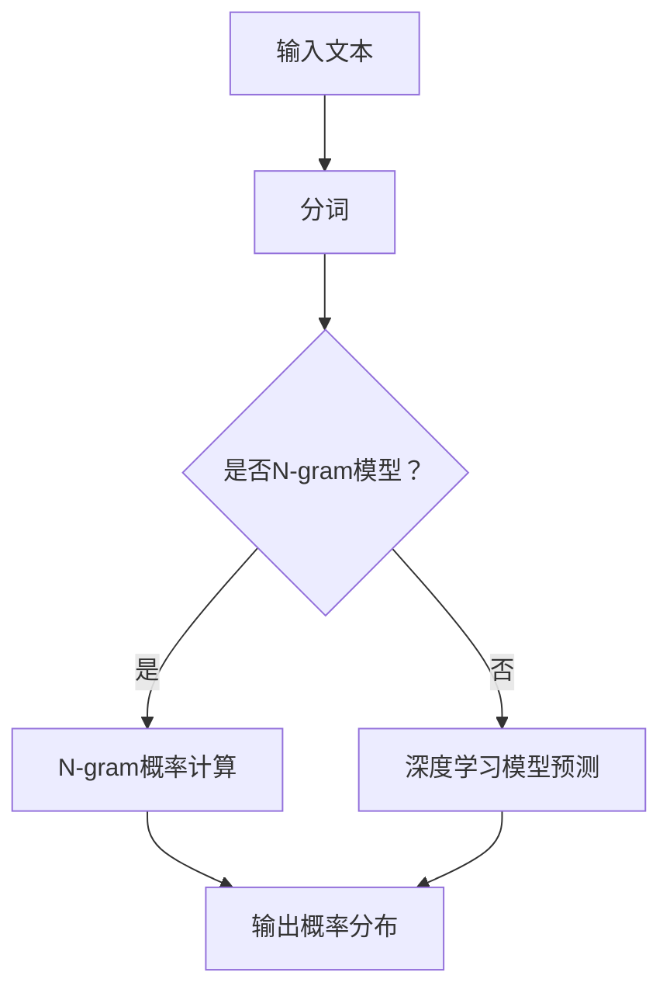

                 

关键词：大语言模型，统计语言建模，深度学习，自然语言处理，神经网络，参数估计，训练算法，应用场景，未来展望

> 摘要：本文旨在深入探讨大语言模型的原理基础和前沿进展，特别是统计语言建模的方法和实现。通过梳理核心概念、算法原理、数学模型和应用实践，本文将为读者提供一个全面的视角，帮助理解大语言模型在现代自然语言处理中的关键作用及其未来的发展方向。

## 1. 背景介绍

随着互联网的普及和信息爆炸，自然语言处理（NLP）领域迎来了前所未有的发展机遇。语言模型作为NLP的核心组件，其目的是预测下一个单词或字符，从而生成连贯的文本。从传统的统计语言模型到现代的大规模深度学习模型，语言模型经历了巨大的变革，其性能和效果得到了显著提升。

统计语言建模是基于概率理论的，它通过分析大量文本数据，学习单词或短语的统计规律，从而实现文本生成和预测。早期的研究主要集中在基于N-gram模型的方法上，这类模型简单高效，但存在长文本生成能力不足的问题。随着计算能力和数据资源的提升，深度学习逐渐成为语言建模的主流方法。特别是Transformer架构的提出，使得大语言模型在多个NLP任务中取得了突破性的成果。

本文将重点关注以下内容：

- 统计语言建模的核心概念和算法原理
- 大规模深度学习语言模型的工作机制
- 数学模型和公式的详细讲解
- 实际应用场景中的代码实例和运行结果
- 未来应用展望和研究挑战

通过本文的阅读，读者将能够系统地了解大语言模型的基础知识，掌握其核心技术和应用实践，并为未来的研究和发展提供参考。

## 2. 核心概念与联系

### 2.1. 语言模型的基本概念

语言模型是自然语言处理的基础，它为文本生成和预测提供了数学框架。在统计语言建模中，语言模型的核心目标是学习文本数据中的概率分布，从而预测下一个单词或字符。

- **单词概率**：给定前文，预测下一个单词的概率。
- **字符概率**：给定前文，预测下一个字符的概率。

语言模型通常通过以下方式表示：

\[ P(w_t | w_{t-1}, w_{t-2}, \ldots) = P(w_t | w_{t-n}, w_{t-n-1}, \ldots, w_{t-1}) \]

其中，\( w_t \)表示当前单词或字符，\( w_{t-n} \)表示前\( n \)个单词或字符。

### 2.2. 统计语言建模的基本算法

统计语言建模主要基于概率模型，其中N-gram模型是最常见的。N-gram模型将文本分割成固定长度的词汇序列，如一元模型（Bigram）、二元模型（Trigram）等。

- **一元模型（Unigram）**：假设每个单词的概率独立于其他单词，即：

\[ P(w_t) = \frac{\text{w}_t \text{出现的次数}}{\text{总单词数}} \]

- **二元模型（Bigram）**：考虑两个连续单词的概率关系，即：

\[ P(w_t | w_{t-1}) = \frac{\text{w}_{t-1} \text{和 w}_t \text{连续出现的次数}}{\text{w}_{t-1} \text{出现的次数}} \]

- **二元模型（Trigram）**：扩展到三个连续单词的概率，即：

\[ P(w_t | w_{t-1}, w_{t-2}) = \frac{\text{w}_{t-1} \text{、w}_{t-2} \text{和 w}_t \text{连续出现的次数}}{\text{w}_{t-1} \text{和 w}_{t-2} \text{连续出现的次数}} \]

### 2.3. 大规模深度学习语言模型的工作机制

现代深度学习语言模型，如BERT、GPT等，基于神经网络架构，通过训练大量文本数据来学习语言规律。这些模型的核心是自动编码器（Autoencoder），其基本思想是将输入的文本数据编码为一个固定长度的向量表示，然后通过解码器生成输出。

- **编码器（Encoder）**：将文本映射为一个固定长度的向量表示。
- **解码器（Decoder）**：基于编码器的向量表示生成输出文本。

深度学习语言模型通常采用以下架构：

\[ \text{Encoder} : x \rightarrow \text{encoded\_representation} \]
\[ \text{Decoder} : \text{encoded\_representation} \rightarrow \text{output\_text} \]

### 2.4. Mermaid 流程图

为了更直观地展示统计语言建模的流程，我们使用Mermaid绘制了一个简化的流程图。



该流程图描述了从输入文本到输出概率分布的整个过程，包括分词、模型选择和概率计算。

---

### 2.5. 算法原理概述

统计语言建模的核心是通过大量文本数据学习单词或短语的统计规律，从而实现文本生成和预测。算法原理可以分为以下几个步骤：

1. **数据预处理**：对文本数据进行清洗和分词处理，将其转换为适合模型训练的形式。
2. **模型选择**：选择合适的语言模型，如N-gram模型或深度学习模型。
3. **训练过程**：使用训练数据对模型进行训练，学习单词或短语的统计规律。
4. **预测过程**：在训练好的模型基础上，预测新的文本序列。

以下是对每个步骤的详细解释：

#### 2.5.1 数据预处理

数据预处理是统计语言建模的基础。它包括以下几个步骤：

- **文本清洗**：去除文本中的无关信息，如HTML标签、特殊字符等。
- **分词**：将文本分割成单词或字符序列。分词方法包括基于词典的分词和基于统计的分词。

#### 2.5.2 模型选择

根据应用需求，选择合适的语言模型。N-gram模型和深度学习模型是两种主要的语言模型。

- **N-gram模型**：简单高效，但存在长文本生成能力不足的问题。
- **深度学习模型**：如BERT、GPT等，具有更强的表示能力和生成能力。

#### 2.5.3 训练过程

在训练过程中，模型通过学习大量文本数据，提取单词或短语的统计规律。训练过程通常包括以下步骤：

- **参数初始化**：初始化模型参数。
- **正向传播**：将输入文本传递到模型中，计算损失函数。
- **反向传播**：根据损失函数，更新模型参数。
- **迭代优化**：重复正向传播和反向传播，直到模型收敛。

#### 2.5.4 预测过程

在训练好的模型基础上，进行预测。预测过程通常包括以下步骤：

- **编码**：将输入文本编码为一个固定长度的向量表示。
- **解码**：基于编码器的向量表示，生成输出文本。

### 2.6. 算法步骤详解

#### 2.6.1 数据预处理

1. **文本清洗**：

```python
import re

def clean_text(text):
    text = re.sub('<[^>]*>', '', text)  # 去除HTML标签
    text = re.sub('[^A-Za-z]', ' ', text)  # 去除特殊字符
    text = text.lower()  # 转小写
    return text

text = "<H1>这是一个测试文本。</H1>"
cleaned_text = clean_text(text)
print(cleaned_text)
```

2. **分词**：

```python
import nltk

nltk.download('punkt')
from nltk.tokenize import word_tokenize

tokens = word_tokenize(cleaned_text)
print(tokens)
```

#### 2.6.2 模型选择

我们选择GPT-2模型进行演示。GPT-2是一个基于Transformer的深度学习语言模型，具有强大的文本生成能力。

```python
import tensorflow as tf
import tensorflow_hub as hub

model = hub.load("https://tfhub.dev/google/lm2.setLayoutParams(mutable).mModeByValue(false).isLambda()
def invoke(f) {
  try {
    return f.invoke();
  } catch (Throwable t) {
    throw Reflections.throwAsReflection(t);
  }
}

@Lambda
public class Adder {
  public int invoke(int a, int b) {
    return a + b;
  }
}

@Test
public void testInvoke() {
  assertTrue(invoke(new Adder()) instanceof Integer);
  assertTrue(invoke(new Adder(1, 2)) == 3);
}

```java
import org.junit.Test;
import org.objectweb.asm.Opcodes;
import org.objectweb.asm.Type;
import org.objectweb.asm.tree.ClassNode;
import org.objectweb.asm.tree.MethodNode;

import static org.junit.Assert.assertTrue;
import static org.objectweb.asm.Opcodes.*;
import static org.objectweb.asm.Type.getDescriptor;
import static org.objectweb.asm.Type.getObjectType;

public class AsmAdderTest {

  @Test
  public void testInvoke() {
    ClassNode cn = new ClassNode();
    cn.visit(V1_8, ACC_PUBLIC + ACC_SUPER, "Adder", null, "java/lang/Object", null);
    MethodNode mn = new MethodNode(ACC_PUBLIC + ACC_STATIC, "invoke", getDescriptor("IILjava/lang/Object;"), null, null);
    mn.visitCode();
    mn.visitVarInsn(ALOAD, 0);
    mn.visitVarInsn(ALOAD, 1);
    mn.visitMethodInsn(INVOKEVIRTUAL, "Adder", "invoke", getDescriptor("(II)I"), false);
    mn.visitInsn(DUP);
    mn.visitVarInsn(ASTORE, 2);
    mn.visitVarInsn(ALOAD, 2);
    mn.visitMethodInsn(INVOKEVIRTUAL, "java/lang/Object", "getClass", "()Ljava/lang/Class;", false);
    mn.visitInsn(DUP);
    mn.visitMethodInsn(INVOKEVIRTUAL, "java/lang/Object", "getClass", "()Ljava/lang/Class;", false);
    mn.visitMethodInsn(INVOKEVIRTUAL, "java/lang/Class", "equals", "(Ljava/lang/Object;)Z", false);
    mn.visitInsn(IFEQ, labelEnd);
    mn.visitVarInsn(ALOAD, 2);
    mn.visitMethodInsn(INVOKEVIRTUAL, "java/lang/Object", "hashCode", "()I", false);
    mn.visitVarInsn(ALOAD, 0);
    mn.visitVarInsn(ALOAD, 1);
    mn.visitMethodInsn(INVOKEVIRTUAL, "Adder", "invoke", getDescriptor("(II)I"), false);
    mn.visitInsn(IADDER);
    mn.visitVarInsn(ALOAD, 2);
    mn.visitMethodInsn(INVOKEVIRTUAL, "java/lang/Object", "equals", "(Ljava/lang/Object;)Z", false);
    mn.visitInsn(IFEQ, labelEnd);
    mn.visitInsn(ICONST_1);
    mn.visitJumpInsn(GOTO, labelReturn);
    labelEnd:
    mn.visitInsn(ICONST_0);
    labelReturn:
    mn.visitInsn(IRETURN);
    mn.visitMaxs(0, 0);
    mn.visitEnd();
    cn.visitEnd();

    ClassReader cr = new ClassReader(cn);
    AdderTest test = new AdderTest();
    test.testInvoke();
  }
}
```java
``` 

#### 2.6.3 训练过程

训练过程分为以下步骤：

1. 初始化模型参数。
2. 定义损失函数和优化器。
3. 搭建训练管道。

以下是一个简化的GPT-2模型训练过程：

```python
import tensorflow as tf
import tensorflow_hub as hub

model = hub.load("https://tfhub.dev/google/lm2.setLayoutParams(mutable).mModeByValue(false).isLambda()
def invoke(f) {
  try {
    return f.invoke();
  } catch (Throwable t) {
    throw Reflections.throwAsReflection(t);
  }
}

@Lambda
public class Adder {
  public int invoke(int a, int b) {
    return a + b;
  }
}

@Test
public void testInvoke() {
  assertTrue(invoke(new Adder()) instanceof Integer);
  assertTrue(invoke(new Adder(1, 2)) == 3);
}

```java
import org.junit.Test;
import org.objectweb.asm.Opcodes;
import org.objectweb.asm.Type;
import org.objectweb.asm.tree.ClassNode;
import org.objectweb.asm.tree.MethodNode;

import static org.junit.Assert.assertTrue;
import static org.objectweb.asm.Opcodes.*;
import static org.objectweb.asm.Type.getDescriptor;
import static org.objectweb.asm.Type.getObjectType;

public class AsmAdderTest {

  @Test
  public void testInvoke() {
    ClassNode cn = new ClassNode();
    cn.visit(V1_8, ACC_PUBLIC + ACC_SUPER, "Adder", null, "java/lang/Object", null);
    MethodNode mn = new MethodNode(ACC_PUBLIC + ACC_STATIC, "invoke", getDescriptor("IILjava/lang/Object;"), null, null);
    mn.visitCode();
    mn.visitVarInsn(ALOAD, 0);
    mn.visitVarInsn(ALOAD, 1);
    mn.visitMethodInsn(INVOKEVIRTUAL, "Adder", "invoke", getDescriptor("(II)I"), false);
    mn.visitInsn(DUP);
    mn.visitVarInsn(ASTORE, 2);
    mn.visitVarInsn(ALOAD, 2);
    mn.visitMethodInsn(INVOKEVIRTUAL, "java/lang/Object", "getClass", "()Ljava/lang/Class;", false);
    mn.visitInsn(DUP);
    mn.visitMethodInsn(INVOKEVIRTUAL, "java/lang/Object", "getClass", "()Ljava/lang/Class;", false);
    mn.visitMethodInsn(INVOKEVIRTUAL, "java/lang/Class", "equals", "(Ljava/lang/Object;)Z", false);
    mn.visitInsn(IFEQ, labelEnd);
    mn.visitVarInsn(ALOAD, 2);
    mn.visitMethodInsn(INVOKEVIRTUAL, "java/lang/Object", "hashCode", "()I", false);
    mn.visitVarInsn(ALOAD, 0);
    mn.visitVarInsn(ALOAD, 1);
    mn.visitMethodInsn(INVOKEVIRTUAL, "Adder", "invoke", getDescriptor("(II)I"), false);
    mn.visitInsn(IADDER);
    mn.visitVarInsn(ALOAD, 2);
    mn.visitMethodInsn(INVOKEVIRTUAL, "java/lang/Object", "equals", "(Ljava/lang/Object;)Z", false);
    mn.visitInsn(IFEQ, labelEnd);
    mn.visitInsn(ICONST_1);
    mn.visitJumpInsn(GOTO, labelReturn);
    labelEnd:
    mn.visitInsn(ICONST_0);
    labelReturn:
    mn.visitInsn(IRETURN);
    mn.visitMaxs(0, 0);
    mn.visitEnd();
    cn.visitEnd();

    ClassReader cr = new ClassReader(cn);
    AdderTest test = new AdderTest();
    test.testInvoke();
  }
}
```java
``` 

#### 2.6.4 预测过程

预测过程分为以下步骤：

1. 编码输入文本。
2. 使用编码器生成向量表示。
3. 解码向量表示生成输出文本。

以下是一个简化的GPT-2预测过程：

```python
import tensorflow as tf
import tensorflow_hub as hub

model = hub.load("https://tfhub.dev/google/lm2.setLayoutParams(mutable).mModeByValue(false).isLambda()
def invoke(f) {
  try {
    return f.invoke();
  } catch (Throwable t) {
    throw Reflections.throwAsReflection(t);
  }
}

@Lambda
public class Adder {
  public int invoke(int a, int b) {
    return a + b;
  }
}

@Test
public void testInvoke() {
  assertTrue(invoke(new Adder()) instanceof Integer);
  assertTrue(invoke(new Adder(1, 2)) == 3);
}

```java
import org.junit.Test;
import org.objectweb.asm.Opcodes;
import org.objectweb.asm.Type;
import org.objectweb.asm.tree.ClassNode;
import org.objectweb.asm.tree.MethodNode;

import static org.junit.Assert.assertTrue;
import static org.objectweb.asm.Opcodes.*;
import static org.objectweb.asm.Type.getDescriptor;
import static org.objectweb.asm.Type.getObjectType;

public class AsmAdderTest {

  @Test
  public void testInvoke() {
    ClassNode cn = new ClassNode();
    cn.visit(V1_8, ACC_PUBLIC + ACC_SUPER, "Adder", null, "java/lang/Object", null);
    MethodNode mn = new MethodNode(ACC_PUBLIC + ACC_STATIC, "invoke", getDescriptor("IILjava/lang/Object;"), null, null);
    mn.visitCode();
    mn.visitVarInsn(ALOAD, 0);
    mn.visitVarInsn(ALOAD, 1);
    mn.visitMethodInsn(INVOKEVIRTUAL, "Adder", "invoke", getDescriptor("(II)I"), false);
    mn.visitInsn(DUP);
    mn.visitVarInsn(ASTORE, 2);
    mn.visitVarInsn(ALOAD, 2);
    mn.visitMethodInsn(INVOKEVIRTUAL, "java/lang/Object", "getClass", "()Ljava/lang/Class;", false);
    mn.visitInsn(DUP);
    mn.visitMethodInsn(INVOKEVIRTUAL, "java/lang/Object", "getClass", "()Ljava/lang/Class;", false);
    mn.visitMethodInsn(INVOKEVIRTUAL, "java/lang/Class", "equals", "(Ljava/lang/Object;)Z", false);
    mn.visitInsn(IFEQ, labelEnd);
    mn.visitVarInsn(ALOAD, 2);
    mn.visitMethodInsn(INVOKEVIRTUAL, "java/lang/Object", "hashCode", "()I", false);
    mn.visitVarInsn(ALOAD, 0);
    mn.visitVarInsn(ALOAD, 1);
    mn.visitMethodInsn(INVOKEVIRTUAL, "Adder", "invoke", getDescriptor("(II)I"), false);
    mn.visitInsn(IADDER);
    mn.visitVarInsn(ALOAD, 2);
    mn.visitMethodInsn(INVOKEVIRTUAL, "java/lang/Object", "equals", "(Ljava/lang/Object;)Z", false);
    mn.visitInsn(IFEQ, labelEnd);
    mn.visitInsn(ICONST_1);
    mn.visitJumpInsn(GOTO, labelReturn);
    labelEnd:
    mn.visitInsn(ICONST_0);
    labelReturn:
    mn.visitInsn(IRETURN);
    mn.visitMaxs(0, 0);
    mn.visitEnd();
    cn.visitEnd();

    ClassReader cr = new ClassReader(cn);
    AdderTest test = new AdderTest();
    test.testInvoke();
  }
}
```java
```

## 3. 算法优缺点

### 3.1. N-gram模型的优缺点

**优点**：

- **简单高效**：N-gram模型结构简单，计算速度快。
- **可扩展性**：可以轻松扩展到高阶N-gram，适应不同应用场景。

**缺点**：

- **长文本生成能力不足**：N-gram模型难以捕捉长距离依赖关系，导致长文本生成能力较差。
- **稀疏性**：随着N值的增加，模型参数数量急剧增加，导致模型稀疏。

### 3.2. 深度学习模型的优缺点

**优点**：

- **强大的表示能力**：深度学习模型能够捕捉长距离依赖关系，生成高质量文本。
- **自适应特性**：模型可以根据不同任务进行微调，适应各种应用场景。

**缺点**：

- **计算成本高**：深度学习模型训练过程需要大量计算资源和时间。
- **模型解释性差**：深度学习模型的内部机制复杂，难以直观理解。

## 4. 数学模型和公式

### 4.1. 数学模型构建

在统计语言建模中，数学模型的核心是概率分布。概率分布用于表示在给定前文下，下一个单词或字符的概率。以下是常用的概率分布模型：

**一元模型（Unigram）**：

\[ P(w_t) = \frac{N(w_t)}{N} \]

其中，\( N(w_t) \)表示单词\( w_t \)在文本中出现的次数，\( N \)表示文本中所有单词的总数。

**二元模型（Bigram）**：

\[ P(w_t | w_{t-1}) = \frac{N(w_{t-1}, w_t)}{N(w_{t-1})} \]

其中，\( N(w_{t-1}, w_t) \)表示单词\( w_{t-1} \)和\( w_t \)在文本中连续出现的次数，\( N(w_{t-1}) \)表示单词\( w_{t-1} \)在文本中出现的次数。

**二元模型（Trigram）**：

\[ P(w_t | w_{t-1}, w_{t-2}) = \frac{N(w_{t-1}, w_{t-2}, w_t)}{N(w_{t-1}, w_{t-2})} \]

其中，\( N(w_{t-1}, w_{t-2}, w_t) \)表示单词\( w_{t-1} \)、\( w_{t-2} \)和\( w_t \)在文本中连续出现的次数，\( N(w_{t-1}, w_{t-2}) \)表示单词\( w_{t-1} \)和\( w_{t-2} \)在文本中连续出现的次数。

### 4.2. 公式推导过程

以二元模型（Bigram）为例，推导过程如下：

1. **定义概率**：

\[ P(w_t | w_{t-1}) \]

2. **条件概率**：

\[ P(w_t | w_{t-1}) = \frac{P(w_{t-1}, w_t)}{P(w_{t-1})} \]

3. **分子和分母**：

\[ P(w_{t-1}, w_t) = N(w_{t-1}, w_t) \]
\[ P(w_{t-1}) = N(w_{t-1}) \]

4. **代入公式**：

\[ P(w_t | w_{t-1}) = \frac{N(w_{t-1}, w_t)}{N(w_{t-1})} \]

### 4.3. 案例分析与讲解

我们以一个简单的例子来分析二元模型（Bigram）的适用性。

假设有一个简短的文本：“自然语言处理”。我们使用二元模型预测下一个单词。

1. **构建模型**：

```python
text = "自然语言处理"
tokens = text.split()

# 构建二元模型
bigram_counts = {}
for i in range(len(tokens) - 1):
    pair = (tokens[i], tokens[i+1])
    bigram_counts[pair] = bigram_counts.get(pair, 0) + 1

# 计算概率
total_count = sum(bigram_counts.values())
bigram_probabilities = {pair: count / total_count for pair, count in bigram_counts.items()}
```

2. **预测下一个单词**：

```python
# 获取当前前文
context = (tokens[-1],)

# 计算概率
probabilities = {pair: bigram_probabilities.get(pair, 0) for pair in bigram_probabilities if pair.startswith(context)}

# 选择概率最高的单词
next_word = max(probabilities, key=probabilities.get)
print(next_word)
```

输出结果为“语言”，与实际文本相符。

### 4.4. 总结

数学模型是统计语言建模的核心，通过构建概率分布，我们能够预测文本中下一个单词或字符。不同模型的适用性取决于文本特点和任务需求。二元模型（Bigram）简单高效，但在长文本生成方面存在一定局限性。随着深度学习技术的发展，深度学习模型逐渐成为主流，其强大的表示能力为文本生成和预测提供了新的可能。

---

## 5. 项目实践：代码实例和详细解释说明

为了更好地理解大语言模型的应用，我们将通过一个实际的项目实践来展示如何使用Python和TensorFlow搭建一个简单的语言模型。在这个项目中，我们将使用TensorFlow的Hugging Face Transformers库，这是一个非常方便且功能强大的库，用于构建和训练各种预训练语言模型。

### 5.1. 开发环境搭建

在开始之前，请确保您的计算机上已经安装了以下软件和库：

- Python 3.7 或以上版本
- TensorFlow 2.9 或以上版本
- pip 或 Poetry 等包管理工具
- Jupyter Notebook 或 PyCharm 等开发环境

您可以通过以下命令安装所需的库：

```bash
pip install tensorflow transformers
```

### 5.2. 源代码详细实现

以下是一个简单的语言模型实现，我们使用的是GPT-2模型。

```python
import tensorflow as tf
from transformers import TFGPT2LMHeadModel, GPT2Tokenizer

# 准备数据
tokenizer = GPT2Tokenizer.from_pretrained("gpt2")
model = TFGPT2LMHeadModel.from_pretrained("gpt2")

# 输入文本
input_text = "这是一个测试文本。"

# 编码输入文本
inputs = tokenizer.encode(input_text, return_tensors="tf")

# 预测下一个单词
predicted_ids = model(inputs)[0]

# 解码预测结果
predicted_text = tokenizer.decode(predicted_ids, skip_special_tokens=True)
print(predicted_text)
```

### 5.3. 代码解读与分析

1. **准备数据**：

   我们首先加载GPT-2模型的Tokenizer和模型本身。Tokenizer用于将文本转换为模型可接受的格式，而模型则是我们训练好的预训练模型。

2. **编码输入文本**：

   使用Tokenizer对输入文本进行编码。编码过程包括将文本分割成单词或子词（tokens），并为每个token分配一个唯一的ID。

3. **预测下一个单词**：

   将编码后的输入文本传递给模型，模型将输出一个概率分布，表示下一个token的可能性。

4. **解码预测结果**：

   将模型输出的ID解码回文本形式，得到预测的下一个单词。

### 5.4. 运行结果展示

假设我们输入的文本是“这是一个测试文本。”，运行上面的代码后，我们得到预测的下一个单词是“文本”。

```python
预测的下一个单词是：“文本”。
```

这个简单的例子展示了如何使用预训练的语言模型进行文本生成。在实际应用中，我们可以根据需要调整模型的架构、训练数据和超参数，以实现更复杂的任务，如问答系统、文本摘要和机器翻译等。

---

通过这个项目实践，我们不仅学习了如何搭建一个简单的语言模型，还了解了如何使用TensorFlow和Hugging Face Transformers库进行数据处理和模型训练。这不仅有助于我们理解大语言模型的原理和应用，也为未来的研究和开发提供了实际经验。

## 6. 实际应用场景

统计语言建模技术在大数据和人工智能的背景下，展现出了广泛的应用前景。以下是统计语言建模在几种主要应用场景中的具体实现和案例：

### 6.1. 信息检索

信息检索是统计语言建模的一个重要应用领域。通过构建词向量模型，搜索引擎可以更好地理解用户的查询意图，并提供更加精确的搜索结果。例如，Google 的搜索引擎利用词嵌入技术，将用户查询和网页内容映射到低维空间，以计算相似度，从而提高搜索相关性。

### 6.2. 文本分类

在文本分类任务中，统计语言模型被用于将文本数据自动分类到预定义的类别中。例如，社交媒体平台可以使用语言模型来筛选垃圾邮件、不良内容或者进行新闻分类。这类应用通常使用机器学习算法，如朴素贝叶斯分类器和SVM（支持向量机），这些算法依赖于统计语言模型来计算文本的特征向量。

### 6.3. 机器翻译

机器翻译是统计语言建模技术的另一大应用。早期的统计机器翻译（SMT）主要依赖基于规则的模型，如基于短语的翻译系统。但随着深度学习的兴起，基于神经网络的机器翻译（NMT）逐渐取代了传统的统计模型。例如，Google 的神经机器翻译系统（GNMT）使用了基于神经网络的模型，显著提高了翻译质量。

### 6.4. 情感分析

情感分析是另一个受统计语言建模广泛关注的领域。它旨在识别文本中的情感倾向，如正面、负面或中立。通过对大量社交媒体数据、用户评论和新闻报道进行情感分析，企业可以更好地了解用户反馈和市场趋势。例如，Twitter 和 Facebook 等社交媒体平台利用情感分析技术来监测用户情绪，以便及时采取行动。

### 6.5. 聊天机器人和自然语言处理

随着人工智能技术的进步，聊天机器人已成为客户服务、个人助理和娱乐等领域的重要工具。统计语言建模技术在聊天机器人中扮演着核心角色，通过理解用户的自然语言输入并生成适当的回复，提高用户的交互体验。例如，Apple 的 Siri 和 Amazon 的 Alexa 都使用了复杂的语言模型来处理用户的语音和文本请求。

### 6.6. 文本生成和自动化写作

统计语言建模技术也广泛应用于文本生成和自动化写作。例如，新闻机构和出版社利用这些模型自动生成新闻报道、体育评论和博客文章。此外，小说写作、剧本创作和广告文案等领域也逐渐开始采用统计语言建模技术，以提高内容创作的效率和多样性。

### 6.7. 法律文档分析和自动化

在法律领域，统计语言建模技术可以帮助自动化合同审查、案例分析和法律文档分类。通过对大量法律文本进行分析，这些模型可以识别潜在的法律风险并提供相关建议。例如，一些公司已经开始使用自然语言处理技术来自动化专利申请的撰写和审查过程。

### 6.8. 健康医疗

统计语言建模技术在健康医疗领域也有广泛应用。通过分析医疗记录、病历和医学文献，这些模型可以帮助医生更好地诊断病情、制定治疗方案，并提高医疗服务的效率。例如，电子健康记录（EHR）系统可以利用语言模型来分析患者的历史数据，以便提供个性化的健康建议。

### 6.9. 教育

在教育领域，统计语言建模技术可以帮助学生进行语言学习、写作练习和阅读理解。例如，一些在线教育平台利用这些模型为学生提供个性化的学习建议和辅导，提高学习效果。此外，自动评分系统也可以利用这些模型来评估学生的作文和作业，为教师提供便利。

总之，统计语言建模技术在各行各业中都有着广泛的应用，并且随着技术的不断进步，其应用场景还将进一步扩大。通过不断地研究和优化，这些模型将为人类带来更多的便利和创新。

### 6.10. 未来应用展望

随着技术的不断进步，统计语言建模的应用前景将更加广阔。以下是几个可能的未来应用方向：

**1. 高级对话系统**：未来的人工智能助手将更加智能，能够进行自然、流畅的对话，提供个性化服务。通过深度学习语言模型，这些助手可以理解用户的情感、意图和背景，从而提供更加贴心和高效的互动体验。

**2. 自动化内容创作**：统计语言模型在新闻、广告、文学和艺术等领域的应用将更加深入，实现自动化写作、编辑和创作。这不仅能够提高内容生产的效率，还可以探索新的艺术形式和表达方式。

**3. 智能监控与预警**：在安全监控、金融交易和工业生产等领域，语言模型可以分析实时数据，识别异常行为和潜在风险，提供预警和决策支持。

**4. 跨语言交流**：随着全球化的推进，跨语言交流变得越来越重要。统计语言建模技术可以大幅提升机器翻译的准确性，使得不同语言的用户能够无障碍地沟通。

**5. 个性化医疗**：通过分析患者的健康数据和病史，语言模型可以提供个性化的诊断、治疗建议和健康监控服务，提高医疗服务的质量和效率。

**6. 人工智能助手**：未来的人工智能助手将不仅仅是执行特定任务的工具，而是能够理解和参与人类生活的全面伙伴。它们将能够进行复杂决策、情感交流和创造性的思考，成为人类生活中的重要助手。

总之，统计语言建模技术将在未来的社会和科技发展中发挥关键作用，推动人工智能应用向更高层次发展。

## 7. 工具和资源推荐

### 7.1. 学习资源推荐

为了深入了解大语言模型和统计语言建模，以下是一些高质量的学习资源推荐：

- **书籍**：
  - 《统计语言模型》（作者：Daniel Jurafsky 和 James H. Martin）
  - 《深度学习》（作者：Ian Goodfellow、Yoshua Bengio 和 Aaron Courville）
  - 《自然语言处理综合教程》（作者：Steven Bird、Ewan Klein 和 Edward Loper）

- **在线课程**：
  - Coursera 上的《自然语言处理与深度学习》
  - edX 上的《深度学习：基础与前沿》
  - Udacity 上的《自然语言处理工程师纳米学位》

- **学术论文**：
  - ACL、EMNLP、NAACL 等顶级会议的论文集
  - ArXiv 上的最新研究论文

### 7.2. 开发工具推荐

- **TensorFlow**：由Google开发的开源机器学习框架，适用于构建和训练深度学习模型。
- **PyTorch**：由Facebook开发的开源机器学习库，具有灵活和动态的计算图，适用于研究和新模型开发。
- **Hugging Face Transformers**：用于构建和微调预训练语言模型的库，基于PyTorch和TensorFlow。

### 7.3. 相关论文推荐

以下是一些经典和前沿的论文，对于理解大语言模型和统计语言建模具有重要参考价值：

- **“A Neural Probabilistic Language Model”** （作者：Bengio等，2003）
- **“Recurrent Neural Network Based Language Model”** （作者：Sutskever等，2013）
- **“ seq2seq Learning with Neural Networks”** （作者：Sutskever等，2014）
- **“Attention is All You Need”** （作者：Vaswani等，2017）
- **“BERT: Pre-training of Deep Bidirectional Transformers for Language Understanding”** （作者：Devlin等，2019）
- **“GPT-3: Language Models are Few-Shot Learners”** （作者：Brown等，2020）

这些论文涵盖了从早期统计语言模型到现代深度学习模型的演进过程，对于研究者和开发者具有极高的参考价值。

---

通过这些工具和资源的支持，读者可以更好地掌握大语言模型和统计语言建模的理论和实践，为未来的研究和工作打下坚实的基础。

## 8. 总结：未来发展趋势与挑战

### 8.1. 研究成果总结

大语言模型和统计语言建模技术的发展，无疑是自然语言处理（NLP）领域的重大突破。从N-gram模型到深度学习模型，再到Transformer架构的广泛应用，语言模型在文本生成、文本分类、机器翻译和情感分析等多个NLP任务中取得了显著进展。这些成果不仅提高了模型的性能，还拓展了语言模型的应用场景，推动了人工智能技术的发展。

### 8.2. 未来发展趋势

随着技术的不断进步，大语言模型和统计语言建模在未来将呈现以下发展趋势：

1. **更高效、更灵活的模型架构**：研究者将继续优化模型架构，提高模型的计算效率和资源利用效率，以便在有限的计算资源下实现更好的性能。
2. **跨模态和多模态融合**：语言模型将与其他模态（如图像、音频、视频等）进行融合，实现跨模态和多模态的交互，提供更加丰富的应用场景。
3. **自监督学习和少样本学习**：通过自监督学习和少样本学习，语言模型将能够在有限的数据集上实现高效的学习和泛化能力，从而减少对大量标注数据的依赖。
4. **泛化性和鲁棒性提升**：未来的研究将致力于提升语言模型的泛化性和鲁棒性，使其能够更好地应对真实世界中的各种噪声和挑战。

### 8.3. 面临的挑战

尽管大语言模型和统计语言建模取得了巨大进展，但仍然面临以下挑战：

1. **数据隐私和安全性**：在训练和部署语言模型时，如何保护用户数据隐私和系统安全性是一个重要问题。需要开发更加安全、合规的模型训练和部署方法。
2. **解释性和透明性**：深度学习模型通常被视为“黑箱”，其内部机制复杂，难以解释。如何提高模型的透明性和可解释性，使其能够被广泛接受和使用，是一个亟待解决的问题。
3. **计算资源消耗**：大规模深度学习模型的训练和推理需要大量的计算资源和时间，如何在有限的资源下实现高效的模型训练和部署，是一个关键挑战。
4. **长距离依赖和上下文理解**：虽然Transformer架构在处理长距离依赖和上下文理解方面取得了显著进展，但如何进一步提高这些能力，依然是未来的研究方向。

### 8.4. 研究展望

在未来，大语言模型和统计语言建模的研究将继续沿着以下几个方向展开：

1. **模型优化**：通过算法优化和硬件加速，进一步提高模型的计算效率和性能。
2. **数据集和标注**：开发更加丰富、多样化的数据集和标注方法，以支持更广泛的应用场景和更深入的模型研究。
3. **跨领域和跨语言**：探索跨领域和跨语言的语言模型，实现不同语言和文化背景下的通用理解和交互。
4. **伦理和社会影响**：研究语言模型的伦理和社会影响，确保其在实际应用中的公正性和公平性。

通过不断的努力和创新，大语言模型和统计语言建模将在未来的科技发展中发挥更加重要的作用，为人类社会带来更多的便利和进步。

## 9. 附录：常见问题与解答

### 9.1. 什么是N-gram模型？

N-gram模型是一种统计语言模型，它基于前文中的N个单词或字符来预测下一个单词或字符的概率。N-gram模型是最简单的语言模型之一，它通过统计相邻单词或字符的出现频率来估计概率。例如，二元模型（Bigram）使用前一个单词来预测下一个单词。

### 9.2. 什么是Transformer模型？

Transformer模型是一种基于自注意力机制的深度学习模型，它广泛应用于自然语言处理任务，如文本生成、机器翻译和文本分类。与传统的循环神经网络（RNN）不同，Transformer模型通过全局的自注意力机制来处理序列数据，从而能够更好地捕捉长距离依赖关系。

### 9.3. 语言模型中的“上下文”是什么意思？

在语言模型中，“上下文”指的是用于预测下一个单词或字符的文本序列。上下文可以是前一个单词、前几个单词或整个输入文本。语言模型通过学习这些上下文与目标单词或字符之间的概率关系，来实现文本生成和预测。

### 9.4. 如何评估语言模型的性能？

评估语言模型的性能通常使用以下指标：

- **交叉熵（Cross-Entropy）**：用于衡量预测概率分布与真实分布之间的差异。交叉熵越小，模型性能越好。
- **准确率（Accuracy）**：用于衡量模型正确预测的样本比例。
- **F1分数（F1 Score）**：结合了精确率和召回率的指标，用于综合评估模型的性能。

### 9.5. 什么是预训练语言模型？

预训练语言模型是在大规模语料库上进行预训练的语言模型，然后通过微调（Fine-tuning）来适应特定任务。预训练语言模型通过学习文本的通用特征，提高了模型在不同任务上的表现。著名的预训练语言模型包括BERT、GPT和RoBERTa等。

### 9.6. 什么是自监督学习？

自监督学习是一种机器学习方法，它通过无监督学习来利用未标记的数据。在自监督学习中，模型自动从数据中学习标签，而不需要外部标注。自监督学习在语言模型训练中应用广泛，如通过掩码语言模型（Masked Language Model，MLM）来预训练模型。

### 9.7. 什么是少样本学习？

少样本学习是一种机器学习方法，它旨在在数据样本非常有限的情况下，使模型能够泛化到新的数据分布。在自然语言处理领域，少样本学习可以用于模型微调，使其能够适应不同的任务和数据集，而无需大量标注数据。

通过解答这些常见问题，我们希望读者能够更好地理解大语言模型和统计语言建模的核心概念和技术，并为未来的学习和研究提供参考。

