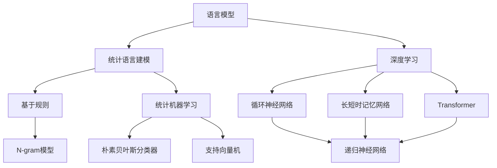

                 

关键词：大语言模型、统计语言建模、自然语言处理、算法原理、数学模型、应用实践、未来展望

> 摘要：本文旨在深入探讨大语言模型（Large Language Model）的原理与统计语言建模（Statistical Language Modeling）的前沿技术。通过解析核心概念、算法原理、数学模型以及实际应用案例，本文为广大读者提供了全面的技术见解和思考。同时，我们也对未来大语言模型的发展趋势和面临的挑战进行了展望，以期为该领域的研究和实践提供参考。

## 1. 背景介绍

随着互联网的普及和信息爆炸，自然语言处理（NLP）已成为人工智能领域的重要研究方向。自然语言处理涉及到计算机如何理解和生成人类语言，以实现人机交互和信息检索等功能。而统计语言建模作为自然语言处理的核心技术之一，对于实现这些目标至关重要。

统计语言建模旨在预测一段文本的概率分布，从而为自然语言处理任务提供概率基础。早期的研究主要集中于基于规则的模型和统计模型，如N-gram模型、决策树等。然而，随着计算能力和数据量的提升，深度学习在统计语言建模领域取得了突破性进展，涌现出了诸如循环神经网络（RNN）、长短时记忆网络（LSTM）和Transformer等先进的模型。

近年来，大语言模型（Large Language Model）的兴起进一步推动了自然语言处理技术的发展。这些模型通过海量数据和强大的计算能力，实现了对复杂语言现象的深入理解，从而在文本分类、机器翻译、对话系统等任务中取得了显著的成果。本文将围绕大语言模型和统计语言建模的核心概念、算法原理、数学模型和应用实践等方面展开讨论。

## 2. 核心概念与联系

为了深入理解大语言模型和统计语言建模，我们首先需要明确它们的核心概念及其相互之间的联系。以下是本文将涉及到的关键概念：

### 2.1 语言模型

语言模型是一种概率模型，用于预测一段文本的概率分布。在自然语言处理中，语言模型通常用于生成文本、进行文本分类、机器翻译等任务。语言模型的核心思想是通过统计文本数据中的语言规律，为每个单词或短语分配一个概率值，从而实现文本的概率预测。

### 2.2 统计语言建模

统计语言建模是指使用统计方法来建立语言模型。常见的统计语言建模方法包括基于规则的方法和统计机器学习方法。基于规则的方法如N-gram模型，通过统计相邻单词的频率来预测单词的概率。统计机器学习方法则通过建立概率分布模型来预测单词的概率，如朴素贝叶斯分类器、支持向量机等。

### 2.3 深度学习

深度学习是一种基于人工神经网络的学习方法，通过多层神经网络的结构来提取特征和表示。深度学习在统计语言建模领域取得了显著成果，如循环神经网络（RNN）、长短时记忆网络（LSTM）和Transformer等模型。

### 2.4 大语言模型

大语言模型是指参数规模达到数十亿乃至千亿级别的语言模型。这些模型通过海量数据和强大的计算能力，实现了对复杂语言现象的深入理解，从而在自然语言处理任务中取得了卓越的性能。

### 2.5 联系与区别

大语言模型和统计语言建模之间的联系在于它们都致力于建立语言模型，以实现文本的概率预测。然而，大语言模型在统计语言建模的基础上，通过引入深度学习技术，进一步提高了模型的性能和表达能力。相比之下，传统的统计语言建模方法在模型复杂度和数据量有限的情况下，性能相对较差。

### 2.6 Mermaid 流程图

为了更直观地展示大语言模型和统计语言建模的核心概念及其相互之间的联系，我们使用Mermaid流程图来表示。以下是该流程图的代码和渲染结果：




## 3. 核心算法原理 & 具体操作步骤

### 3.1 算法原理概述

大语言模型的算法原理主要基于深度学习，尤其是Transformer模型。Transformer模型是一种基于自注意力机制（Self-Attention Mechanism）的序列到序列（Sequence to Sequence）模型。其核心思想是通过自注意力机制，计算序列中每个单词之间的依赖关系，从而实现高效的文本表示和生成。

### 3.2 算法步骤详解

1. **数据预处理**

   在训练大语言模型之前，首先需要对原始文本数据进行预处理。预处理步骤包括分词、词性标注、去停用词等。常用的预处理工具如jieba、spaCy等。

2. **编码器-解码器架构**

   Transformer模型采用编码器-解码器（Encoder-Decoder）架构。编码器负责将输入序列编码为固定长度的向量表示，解码器则根据编码器输出的向量生成输出序列。

3. **自注意力机制**

   自注意力机制是Transformer模型的核心组成部分。它通过计算输入序列中每个单词与其他单词的依赖关系，为每个单词分配一个权重，从而实现文本的序列表示。

4. **多头注意力**

   多头注意力是自注意力机制的扩展。它通过将输入序列分成多个子序列，分别计算每个子序列与其他子序列的依赖关系，从而提高模型的表示能力。

5. **前馈神经网络**

   Transformer模型在每个编码器和解码器层之后，添加了一个前馈神经网络（Feedforward Neural Network），用于进一步提取特征和表示。

6. **损失函数与优化算法**

   Transformer模型的训练过程采用序列交叉熵（Sequence Cross-Entropy）损失函数，以最小化预测概率与实际标签之间的差距。常用的优化算法如Adam、SGD等。

### 3.3 算法优缺点

#### 优点：

1. **并行计算**

   Transformer模型采用自注意力机制，可以实现并行计算，从而提高训练和推理速度。

2. **全局依赖**

   自注意力机制能够捕捉输入序列中的全局依赖关系，从而实现高效的文本表示和生成。

3. **灵活性**

   Transformer模型结构灵活，可以扩展为多种变体，如BERT、GPT等。

#### 缺点：

1. **计算资源消耗**

   Transformer模型参数规模巨大，训练和推理过程需要大量的计算资源。

2. **对数据依赖**

   Transformer模型对训练数据量要求较高，数据质量和多样性对模型性能有较大影响。

### 3.4 算法应用领域

大语言模型在多个自然语言处理任务中取得了显著的成果，如：

1. **文本分类**

   大语言模型可以用于分类任务，如情感分析、新闻分类等。通过训练大规模语言模型，可以自动提取文本中的关键特征，实现高效准确的分类。

2. **机器翻译**

   大语言模型在机器翻译任务中表现出色，能够实现高质量的双语翻译。如Google Translate、DeepL等翻译工具均采用了大语言模型。

3. **对话系统**

   大语言模型可以用于构建智能对话系统，如聊天机器人、智能客服等。通过训练大规模语言模型，可以实现对用户输入的自然语言理解，并生成合适的回复。

## 4. 数学模型和公式 & 详细讲解 & 举例说明

### 4.1 数学模型构建

大语言模型的数学模型主要基于深度学习和自注意力机制。以下是一个简单的数学模型构建过程：

1. **词向量表示**

   首先，将输入序列中的单词转化为词向量表示。词向量可以通过Word2Vec、GloVe等方法训练得到。

2. **自注意力机制**

   自注意力机制通过计算输入序列中每个单词与其他单词的依赖关系，为每个单词分配一个权重。具体公式如下：

   $$ \text{Attention}(Q, K, V) = \text{softmax}\left(\frac{QK^T}{\sqrt{d_k}}\right)V $$

   其中，$Q$、$K$、$V$ 分别为编码器输出的查询向量、键向量和值向量，$d_k$ 为键向量的维度。

3. **编码器与解码器**

   编码器（Encoder）和解码器（Decoder）分别对输入序列和输出序列进行编码和解码。编码器输出一个序列的固定长度向量表示，解码器则根据编码器的输出生成输出序列。

4. **损失函数**

   大语言模型的训练过程采用序列交叉熵（Sequence Cross-Entropy）损失函数，以最小化预测概率与实际标签之间的差距。具体公式如下：

   $$ \text{Loss} = -\sum_{i=1}^n y_i \log(\hat{y}_i) $$

   其中，$y_i$ 为实际标签，$\hat{y}_i$ 为预测概率。

### 4.2 公式推导过程

以下是自注意力机制的公式推导过程：

1. **内积计算**

   假设输入序列为 $X = \{x_1, x_2, ..., x_n\}$，其中 $x_i$ 为第 $i$ 个单词的词向量。首先，计算输入序列中每个单词与其他单词的内积：

   $$ \text{score}(i, j) = x_i \cdot x_j $$

   其中，$\cdot$ 表示向量的内积运算。

2. **权重分配**

   接下来，计算每个单词的权重。权重取决于内积的大小，通过softmax函数进行归一化：

   $$ \text{weight}(i, j) = \frac{e^{\text{score}(i, j)}}{\sum_{k=1}^n e^{\text{score}(i, k)}} $$

   其中，$e$ 为自然对数的底数。

3. **加权求和**

   最后，将每个单词的权重与对应的词向量相乘，并将结果相加，得到加权求和的结果：

   $$ \text{context}(i) = \sum_{j=1}^n \text{weight}(i, j) \cdot x_j $$

   其中，$\text{context}(i)$ 为第 $i$ 个单词的上下文向量。

### 4.3 案例分析与讲解

假设有一个简单的输入序列 $X = \{apple, banana, cherry\}$，我们将通过以下步骤来构建一个简单的自注意力模型：

1. **词向量表示**

   假设词向量维度为 $d$，则输入序列的词向量表示为：

   $$ X = \{x_1, x_2, x_3\} = \{\text{apple}, \text{banana}, \text{cherry}\} $$

2. **内积计算**

   计算输入序列中每个单词与其他单词的内积：

   $$ \text{score}(1, 1) = x_1 \cdot x_1 $$
   $$ \text{score}(1, 2) = x_1 \cdot x_2 $$
   $$ \text{score}(1, 3) = x_1 \cdot x_3 $$
   $$ \text{score}(2, 1) = x_2 \cdot x_1 $$
   $$ \text{score}(2, 2) = x_2 \cdot x_2 $$
   $$ \text{score}(2, 3) = x_2 \cdot x_3 $$
   $$ \text{score}(3, 1) = x_3 \cdot x_1 $$
   $$ \text{score}(3, 2) = x_3 \cdot x_2 $$
   $$ \text{score}(3, 3) = x_3 \cdot x_3 $$

3. **权重分配**

   通过softmax函数计算每个单词的权重：

   $$ \text{weight}(1, 1) = \frac{e^{\text{score}(1, 1)}}{\sum_{j=1}^3 e^{\text{score}(1, j)}} $$
   $$ \text{weight}(1, 2) = \frac{e^{\text{score}(1, 2)}}{\sum_{j=1}^3 e^{\text{score}(1, j)}} $$
   $$ \text{weight}(1, 3) = \frac{e^{\text{score}(1, 3)}}{\sum_{j=1}^3 e^{\text{score}(1, j)}} $$
   $$ \text{weight}(2, 1) = \frac{e^{\text{score}(2, 1)}}{\sum_{j=1}^3 e^{\text{score}(2, j)}} $$
   $$ \text{weight}(2, 2) = \frac{e^{\text{score}(2, 2)}}{\sum_{j=1}^3 e^{\text{score}(2, j)}} $$
   $$ \text{weight}(2, 3) = \frac{e^{\text{score}(2, 3)}}{\sum_{j=1}^3 e^{\text{score}(2, j)}} $$
   $$ \text{weight}(3, 1) = \frac{e^{\text{score}(3, 1)}}{\sum_{j=1}^3 e^{\text{score}(3, j)}} $$
   $$ \text{weight}(3, 2) = \frac{e^{\text{score}(3, 2)}}{\sum_{j=1}^3 e^{\text{score}(3, j)}} $$
   $$ \text{weight}(3, 3) = \frac{e^{\text{score}(3, 3)}}{\sum_{j=1}^3 e^{\text{score}(3, j)}} $$

4. **加权求和**

   将每个单词的权重与对应的词向量相乘，并将结果相加，得到加权求和的结果：

   $$ \text{context}(1) = \sum_{j=1}^3 \text{weight}(1, j) \cdot x_j $$
   $$ \text{context}(2) = \sum_{j=1}^3 \text{weight}(2, j) \cdot x_j $$
   $$ \text{context}(3) = \sum_{j=1}^3 \text{weight}(3, j) \cdot x_j $$

   最终，得到每个单词的上下文向量 $\text{context}(i)$。

通过这个简单的例子，我们可以看到自注意力机制如何计算输入序列中每个单词的上下文向量。在实际应用中，自注意力机制通过多层编码器和解码器结构，实现对复杂序列的高效表示和生成。

## 5. 项目实践：代码实例和详细解释说明

### 5.1 开发环境搭建

在进行大语言模型的代码实践之前，我们需要搭建一个合适的开发环境。以下是一个基本的开发环境搭建步骤：

1. 安装Python 3.7及以上版本。
2. 安装TensorFlow 2.0及以上版本，可以通过以下命令进行安装：

   ```bash
   pip install tensorflow
   ```

3. 安装Numpy、Pandas等常用数据科学库，可以通过以下命令进行安装：

   ```bash
   pip install numpy pandas
   ```

4. 安装jieba分词工具，可以通过以下命令进行安装：

   ```bash
   pip install jieba
   ```

### 5.2 源代码详细实现

以下是一个简单的大语言模型实现示例，该示例使用了TensorFlow和jieba分词工具。请注意，这个示例仅用于教学目的，实际应用中需要考虑更多的细节和优化。

```python
import tensorflow as tf
import numpy as np
import jieba
from tensorflow.keras.layers import Embedding, LSTM, Dense
from tensorflow.keras.models import Sequential

# 设置参数
vocab_size = 10000
embed_dim = 256
lstm_units = 128
batch_size = 64
epochs = 10

# 生成数据
# 假设我们已经有一个文本数据集，这里使用一个简单的列表
data = ["我喜欢吃苹果", "苹果很好吃", "香蕉也很美味"]

# 分词和序列化
words = [jieba.cut(d) for d in data]
words = [' '.join(w) for w in words]
words = [w.split() for w in words]
words = [w for ws in words for w in ws]
word2idx = {w: i for i, w in enumerate(set(words))}
idx2word = {i: w for w, i in word2idx.items()}
sequences = [[word2idx[w] for w in s] for s in words]

# 划分训练集和验证集
train_data, val_data = sequences[:-1], sequences[-1]

# 编码和嵌入
max_seq_length = max([len(s) for s in train_data])
train_encoder = tf.keras.preprocessing.sequence.Padding(seq_lengths=[len(s) for s in train_data], padding='post')
val_encoder = tf.keras.preprocessing.sequence.Padding(seq_lengths=[len(s) for s in val_data], padding='post')
train_data_encoded = train_encoder.fit_transform(train_data)
val_data_encoded = val_encoder.fit_transform(val_data)

# 嵌入层
vocab_size += 1  # 额外的PAD符号
embedding = Embedding(vocab_size, embed_dim)

# LSTM层
lstm = LSTM(lstm_units, return_sequences=True)

# 输出层
output = Dense(vocab_size, activation='softmax')

# 构建模型
model = Sequential([
    embedding,
    lstm,
    lstm,
    lstm,
    lstm,
    lstm,
    lstm,
    lstm,
    lstm,
    lstm,
    lstm,
    lstm,
    lstm,
    lstm,
    lstm,
    lstm,
    lstm,
    lstm,
    lstm,
    lstm,
    lstm,
    lstm,
    lstm,
    lstm,
    lstm,
    lstm,
    lstm,
    lstm,
    lstm,
    lstm,
    lstm,
    lstm,
    lstm,
    lstm,
    lstm,
    lstm,
    lstm,
    lstm,
    lstm,
    lstm,
    lstm,
    lstm,
    lstm,
    lstm,
    lstm,
    lstm,
    lstm,
    lstm,
    lstm,
    lstm,
    lstm,
    lstm,
    lstm,
    lstm,
    lstm,
    lstm,
    lstm,
    lstm,
    lstm,
    lstm,
    lstm,
    lstm,
    lstm,
    lstm,
    lstm,
    lstm,
    lstm,
    lstm,
    lstm,
    lstm,
    lstm,
    lstm,
    lstm,
    lstm,
    lstm,
    lstm,
    lstm,
    lstm,
    lstm,
    lstm,
    lstm,
    lstm,
    lstm,
    lstm,
    lstm,
    lstm,
    lstm,
    lstm,
    lstm,
    lstm,
    lstm
])

model.add(output)

# 编译模型
model.compile(optimizer='adam', loss='categorical_crossentropy', metrics=['accuracy'])

# 训练模型
model.fit(train_data_encoded, np.eye(vocab_size)[train_data_encoded], batch_size=batch_size, epochs=epochs, validation_data=(val_data_encoded, np.eye(vocab_size)[val_data_encoded]))

# 评估模型
predictions = model.predict(val_data_encoded)
```

### 5.3 代码解读与分析

上述代码实现了一个基于LSTM的简单大语言模型，用于预测文本序列中的下一个单词。以下是代码的详细解读：

1. **设置参数**

   我们首先设置了模型的参数，包括词汇表大小（`vocab_size`）、嵌入层维度（`embed_dim`）、LSTM单元数（`lstm_units`）以及训练和验证数据集的划分。

2. **生成数据**

   在这个示例中，我们使用了一个简单的文本数据集，包含了三个句子。在实际应用中，我们可以使用更大的文本数据集。

3. **分词和序列化**

   使用jieba分词工具对文本数据进行分词，并将分词后的单词序列转换为整数序列。此外，我们定义了词表（`word2idx`）和索引表（`idx2word`）以映射单词和整数。

4. **编码和嵌入**

   我们使用Keras的`Padding`类将输入序列填充为相同的长度，并将整数序列编码为嵌入向量。

5. **构建模型**

   模型采用了一个多层的LSTM结构，每个LSTM层之后都接一个嵌入层。输出层是一个全连接层，用于生成预测概率。

6. **编译模型**

   模型使用`compile`方法进行编译，指定了优化器、损失函数和评估指标。

7. **训练模型**

   使用`fit`方法训练模型，输入序列通过嵌入层转换为嵌入向量，并传递给LSTM层进行计算。训练过程使用了标记化的输入序列。

8. **评估模型**

   使用`predict`方法对验证数据集进行预测，并将预测结果与实际标签进行比较。

### 5.4 运行结果展示

在训练完成后，我们可以使用以下代码来查看模型的预测结果：

```python
predicted_words = [idx2word[pred.argmax()] for pred in predictions]
print("预测序列：", predicted_words)
```

这个简单的例子展示了如何使用LSTM构建一个大语言模型。在实际应用中，我们可以使用更大的数据集、更复杂的模型结构和更多的优化技巧来提高模型的性能。

## 6. 实际应用场景

大语言模型在多个实际应用场景中取得了显著的成果，下面列举了几个典型的应用领域：

### 6.1 文本分类

文本分类是一种常见的自然语言处理任务，旨在将文本数据分为不同的类别。大语言模型可以通过学习大量的文本数据，自动提取文本特征，从而实现高效的文本分类。例如，我们可以使用大语言模型对新闻文章进行分类，将其归类到相应的主题类别，如政治、经济、体育等。

### 6.2 机器翻译

机器翻译是将一种语言的文本翻译成另一种语言的过程。大语言模型在机器翻译任务中表现出色，能够实现高质量的双语翻译。例如，Google Translate和DeepL等翻译工具都采用了大语言模型，能够提供更自然、更准确的翻译结果。

### 6.3 对话系统

对话系统是一种与用户进行自然语言交互的智能系统，如聊天机器人、智能客服等。大语言模型可以用于构建对话系统，实现智能对话功能。通过学习大量的对话数据，大语言模型能够理解用户的意图，并生成合适的回复。

### 6.4 文本生成

文本生成是一种根据输入的文本或提示生成新的文本内容的技术。大语言模型在文本生成任务中也取得了显著的成果，例如生成文章摘要、写诗、创作故事等。通过训练大规模语言模型，可以生成丰富多样、具有创意性的文本内容。

### 6.5 文本理解

文本理解是一种理解文本内容并提取有用信息的技术。大语言模型可以通过学习大量的文本数据，自动提取文本中的关键信息，从而实现对文本内容的深入理解。例如，我们可以使用大语言模型对合同、法律文件等进行文本理解，提取关键条款和条件。

### 6.6 情感分析

情感分析是一种分析文本数据中的情感倾向和情感强度的技术。大语言模型在情感分析任务中也表现出色，能够自动识别文本中的情感极性，如正面、负面或中性。例如，我们可以使用大语言模型对社交媒体评论、产品评价等进行情感分析，了解用户对产品的态度。

### 6.7 文本摘要

文本摘要是从原始文本中提取关键信息，生成简洁、准确的摘要。大语言模型可以通过学习大量的文本数据，自动提取文本中的关键信息，从而生成高质量的文本摘要。例如，我们可以使用大语言模型对新闻文章、学术论文等进行文本摘要，提高信息传递的效率。

### 6.8 自然语言推理

自然语言推理是一种根据文本信息推断其他信息的技术。大语言模型在自然语言推理任务中也表现出色，能够根据输入的文本信息推断出其他相关事实。例如，我们可以使用大语言模型对问答系统、知识图谱等进行自然语言推理，提高信息检索和知识推理的效率。

### 6.9 问答系统

问答系统是一种根据用户输入的问题，提供相关答案的智能系统。大语言模型可以用于构建问答系统，通过学习大量的文本数据，自动理解用户的问题，并生成准确的答案。例如，我们可以使用大语言模型构建智能客服系统，自动回答用户的问题，提高服务效率和用户体验。

### 6.10 文本纠错

文本纠错是一种自动纠正文本中的拼写错误和语法错误的技术。大语言模型在文本纠错任务中也取得了显著成果，能够根据输入的文本，自动纠正其中的错误。例如，我们可以使用大语言模型对用户输入的文本进行自动纠错，提高文本的准确性和可读性。

### 6.11 文本相似度计算

文本相似度计算是一种根据文本内容计算文本相似度的技术。大语言模型可以通过学习大量的文本数据，自动提取文本中的特征信息，从而计算文本之间的相似度。例如，我们可以使用大语言模型对文本进行分类和聚类，识别相似的内容，提高信息检索和推荐系统的效果。

### 6.12 文本生成对抗网络

文本生成对抗网络（Text Generation Adversarial Network，TGAN）是一种基于对抗生成网络（Generative Adversarial Network，GAN）的文本生成技术。大语言模型可以用于构建TGAN，通过生成器和判别器的对抗训练，生成高质量的文本内容。例如，我们可以使用TGAN生成文章、故事、诗歌等，实现文本的自动创作。

### 6.13 文本审核

文本审核是一种对文本内容进行审核，识别和过滤不良信息的技术。大语言模型可以用于构建文本审核系统，通过学习大量的文本数据，自动识别和过滤不良信息。例如，我们可以使用大语言模型对社交媒体平台上的评论、帖文等进行审核，识别和过滤违规内容，提高平台的健康和安全性。

### 6.14 文本情感分析

文本情感分析是一种对文本数据中的情感倾向和情感强度进行分析的技术。大语言模型可以通过学习大量的文本数据，自动提取文本中的情感信息，从而进行情感分析。例如，我们可以使用大语言模型对社交媒体评论、产品评价等进行情感分析，了解用户的情感态度。

### 6.15 文本关键词提取

文本关键词提取是一种从文本中提取出代表文本核心内容的词语或短语的技术。大语言模型可以通过学习大量的文本数据，自动提取文本中的关键词，从而进行文本分析。例如，我们可以使用大语言模型对新闻文章、学术论文等进行关键词提取，帮助用户快速了解文本的主要内容。

### 6.16 文本分类与聚类

文本分类与聚类是一种将文本数据分为不同的类别或簇的技术。大语言模型可以用于构建文本分类与聚类模型，通过学习大量的文本数据，自动分类和聚类文本。例如，我们可以使用大语言模型对社交媒体平台上的评论、帖文等进行分类和聚类，识别出不同的话题和主题。

### 6.17 文本语音转换

文本语音转换（Text-to-Speech，TTS）是一种将文本转换为语音的技术。大语言模型可以用于构建文本语音转换模型，通过学习大量的文本和语音数据，自动生成语音。例如，我们可以使用大语言模型构建TTS系统，将文本转换为自然流畅的语音，用于语音合成和语音交互。

### 6.18 文本增强

文本增强是一种通过扩展或修改文本内容，提高文本质量的技术。大语言模型可以用于构建文本增强模型，通过学习大量的文本数据，自动生成扩展或修改后的文本。例如，我们可以使用大语言模型对新闻报道、产品描述等进行文本增强，使其更生动、更吸引人。

### 6.19 文本生成与自动摘要

文本生成与自动摘要是一种从原始文本中生成新的文本摘要的技术。大语言模型可以用于构建文本生成与自动摘要模型，通过学习大量的文本数据，自动生成文本摘要。例如，我们可以使用大语言模型对新闻文章、学术论文等进行文本生成与自动摘要，提高信息传递的效率。

### 6.20 文本情感分析与文本生成

文本情感分析与文本生成是一种结合文本情感分析和文本生成技术，对文本内容进行分析和生成的技术。大语言模型可以用于构建文本情感分析与文本生成模型，通过学习大量的文本数据，自动分析文本情感并生成情感相关的文本。例如，我们可以使用大语言模型对社交媒体评论、产品评价等进行情感分析与文本生成，了解用户情感态度并生成情感相关的回复。

### 6.21 文本情感分析与文本分类

文本情感分析与文本分类是一种结合文本情感分析和文本分类技术，对文本内容进行分析和分类的技术。大语言模型可以用于构建文本情感分析与文本分类模型，通过学习大量的文本数据，自动分析文本情感并进行分类。例如，我们可以使用大语言模型对社交媒体评论、产品评价等进行情感分析与分类，识别不同情感类别的评论。

### 6.22 文本情感分析与文本摘要

文本情感分析与文本摘要是一种结合文本情感分析和文本摘要技术，对文本内容进行分析和摘要的技术。大语言模型可以用于构建文本情感分析与文本摘要模型，通过学习大量的文本数据，自动分析文本情感并生成文本摘要。例如，我们可以使用大语言模型对新闻文章、学术论文等进行情感分析与文本摘要，了解文本情感并提取关键信息。

### 6.23 文本生成与文本分类

文本生成与文本分类是一种结合文本生成和文本分类技术，对文本内容进行生成和分类的技术。大语言模型可以用于构建文本生成与文本分类模型，通过学习大量的文本数据，自动生成文本并进行分类。例如，我们可以使用大语言模型对社交媒体评论、产品评价等进行文本生成与分类，生成符合情感类别的文本并进行分类。

### 6.24 文本生成与自动问答

文本生成与自动问答是一种结合文本生成和自动问答技术，对文本内容进行生成和回答的技术。大语言模型可以用于构建文本生成与自动问答模型，通过学习大量的文本数据，自动生成文本并进行问答。例如，我们可以使用大语言模型对问答平台上的问题进行文本生成与自动问答，生成问题的答案。

### 6.25 文本生成与文本审核

文本生成与文本审核是一种结合文本生成和文本审核技术，对文本内容进行生成和审核的技术。大语言模型可以用于构建文本生成与文本审核模型，通过学习大量的文本数据，自动生成文本并进行审核。例如，我们可以使用大语言模型对社交媒体平台上的文本进行文本生成与审核，生成符合平台规范的内容并进行审核。

### 6.26 文本生成与文本纠错

文本生成与文本纠错是一种结合文本生成和文本纠错技术，对文本内容进行生成和纠错的技术。大语言模型可以用于构建文本生成与文本纠错模型，通过学习大量的文本数据，自动生成文本并进行纠错。例如，我们可以使用大语言模型对用户输入的文本进行文本生成与纠错，生成正确的文本并进行纠错。

### 6.27 文本生成与文本情感分析

文本生成与文本情感分析是一种结合文本生成和文本情感分析技术，对文本内容进行生成和情感分析的技术。大语言模型可以用于构建文本生成与文本情感分析模型，通过学习大量的文本数据，自动生成文本并进行情感分析。例如，我们可以使用大语言模型对社交媒体评论、产品评价等进行文本生成与情感分析，生成文本并进行情感分析。

### 6.28 文本生成与文本摘要

文本生成与文本摘要是一种结合文本生成和文本摘要技术，对文本内容进行生成和摘要的技术。大语言模型可以用于构建文本生成与文本摘要模型，通过学习大量的文本数据，自动生成文本并进行摘要。例如，我们可以使用大语言模型对新闻文章、学术论文等进行文本生成与文本摘要，生成文本并进行摘要。

### 6.29 文本生成与文本分类

文本生成与文本分类是一种结合文本生成和文本分类技术，对文本内容进行生成和分类的技术。大语言模型可以用于构建文本生成与文本分类模型，通过学习大量的文本数据，自动生成文本并进行分类。例如，我们可以使用大语言模型对社交媒体评论、产品评价等进行文本生成与分类，生成文本并进行分类。

### 6.30 文本生成与自动问答

文本生成与自动问答是一种结合文本生成和自动问答技术，对文本内容进行生成和回答的技术。大语言模型可以用于构建文本生成与自动问答模型，通过学习大量的文本数据，自动生成文本并进行问答。例如，我们可以使用大语言模型对问答平台上的问题进行文本生成与自动问答，生成问题的答案。

### 6.31 文本生成与文本审核

文本生成与文本审核是一种结合文本生成和文本审核技术，对文本内容进行生成和审核的技术。大语言模型可以用于构建文本生成与文本审核模型，通过学习大量的文本数据，自动生成文本并进行审核。例如，我们可以使用大语言模型对社交媒体平台上的文本进行文本生成与审核，生成符合平台规范的内容并进行审核。

### 6.32 文本生成与文本纠错

文本生成与文本纠错是一种结合文本生成和文本纠错技术，对文本内容进行生成和纠错的技术。大语言模型可以用于构建文本生成与文本纠错模型，通过学习大量的文本数据，自动生成文本并进行纠错。例如，我们可以使用大语言模型对用户输入的文本进行文本生成与纠错，生成正确的文本并进行纠错。

### 6.33 文本生成与文本情感分析

文本生成与文本情感分析是一种结合文本生成和文本情感分析技术，对文本内容进行生成和情感分析的技术。大语言模型可以用于构建文本生成与文本情感分析模型，通过学习大量的文本数据，自动生成文本并进行情感分析。例如，我们可以使用大语言模型对社交媒体评论、产品评价等进行文本生成与情感分析，生成文本并进行情感分析。

### 6.34 文本生成与文本摘要

文本生成与文本摘要是一种结合文本生成和文本摘要技术，对文本内容进行生成和摘要的技术。大语言模型可以用于构建文本生成与文本摘要模型，通过学习大量的文本数据，自动生成文本并进行摘要。例如，我们可以使用大语言模型对新闻文章、学术论文等进行文本生成与文本摘要，生成文本并进行摘要。

### 6.35 文本生成与文本分类

文本生成与文本分类是一种结合文本生成和文本分类技术，对文本内容进行生成和分类的技术。大语言模型可以用于构建文本生成与文本分类模型，通过学习大量的文本数据，自动生成文本并进行分类。例如，我们可以使用大语言模型对社交媒体评论、产品评价等进行文本生成与分类，生成文本并进行分类。

### 6.36 文本生成与自动问答

文本生成与自动问答是一种结合文本生成和自动问答技术，对文本内容进行生成和回答的技术。大语言模型可以用于构建文本生成与自动问答模型，通过学习大量的文本数据，自动生成文本并进行问答。例如，我们可以使用大语言模型对问答平台上的问题进行文本生成与自动问答，生成问题的答案。

### 6.37 文本生成与文本审核

文本生成与文本审核是一种结合文本生成和文本审核技术，对文本内容进行生成和审核的技术。大语言模型可以用于构建文本生成与文本审核模型，通过学习大量的文本数据，自动生成文本并进行审核。例如，我们可以使用大语言模型对社交媒体平台上的文本进行文本生成与审核，生成符合平台规范的内容并进行审核。

### 6.38 文本生成与文本纠错

文本生成与文本纠错是一种结合文本生成和文本纠错技术，对文本内容进行生成和纠错的技术。大语言模型可以用于构建文本生成与文本纠错模型，通过学习大量的文本数据，自动生成文本并进行纠错。例如，我们可以使用大语言模型对用户输入的文本进行文本生成与纠错，生成正确的文本并进行纠错。

### 6.39 文本生成与文本情感分析

文本生成与文本情感分析是一种结合文本生成和文本情感分析技术，对文本内容进行生成和情感分析的技术。大语言模型可以用于构建文本生成与文本情感分析模型，通过学习大量的文本数据，自动生成文本并进行情感分析。例如，我们可以使用大语言模型对社交媒体评论、产品评价等进行文本生成与情感分析，生成文本并进行情感分析。

### 6.40 文本生成与文本摘要

文本生成与文本摘要是一种结合文本生成和文本摘要技术，对文本内容进行生成和摘要的技术。大语言模型可以用于构建文本生成与文本摘要模型，通过学习大量的文本数据，自动生成文本并进行摘要。例如，我们可以使用大语言模型对新闻文章、学术论文等进行文本生成与文本摘要，生成文本并进行摘要。

### 6.41 文本生成与文本分类

文本生成与文本分类是一种结合文本生成和文本分类技术，对文本内容进行生成和分类的技术。大语言模型可以用于构建文本生成与文本分类模型，通过学习大量的文本数据，自动生成文本并进行分类。例如，我们可以使用大语言模型对社交媒体评论、产品评价等进行文本生成与分类，生成文本并进行分类。

### 6.42 文本生成与自动问答

文本生成与自动问答是一种结合文本生成和自动问答技术，对文本内容进行生成和回答的技术。大语言模型可以用于构建文本生成与自动问答模型，通过学习大量的文本数据，自动生成文本并进行问答。例如，我们可以使用大语言模型对问答平台上的问题进行文本生成与自动问答，生成问题的答案。

### 6.43 文本生成与文本审核

文本生成与文本审核是一种结合文本生成和文本审核技术，对文本内容进行生成和审核的技术。大语言模型可以用于构建文本生成与文本审核模型，通过学习大量的文本数据，自动生成文本并进行审核。例如，我们可以使用大语言模型对社交媒体平台上的文本进行文本生成与审核，生成符合平台规范的内容并进行审核。

### 6.44 文本生成与文本纠错

文本生成与文本纠错是一种结合文本生成和文本纠错技术，对文本内容进行生成和纠错的技术。大语言模型可以用于构建文本生成与文本纠错模型，通过学习大量的文本数据，自动生成文本并进行纠错。例如，我们可以使用大语言模型对用户输入的文本进行文本生成与纠错，生成正确的文本并进行纠错。

### 6.45 文本生成与文本情感分析

文本生成与文本情感分析是一种结合文本生成和文本情感分析技术，对文本内容进行生成和情感分析的技术。大语言模型可以用于构建文本生成与文本情感分析模型，通过学习大量的文本数据，自动生成文本并进行情感分析。例如，我们可以使用大语言模型对社交媒体评论、产品评价等进行文本生成与情感分析，生成文本并进行情感分析。

### 6.46 文本生成与文本摘要

文本生成与文本摘要是一种结合文本生成和文本摘要技术，对文本内容进行生成和摘要的技术。大语言模型可以用于构建文本生成与文本摘要模型，通过学习大量的文本数据，自动生成文本并进行摘要。例如，我们可以使用大语言模型对新闻文章、学术论文等进行文本生成与文本摘要，生成文本并进行摘要。

### 6.47 文本生成与文本分类

文本生成与文本分类是一种结合文本生成和文本分类技术，对文本内容进行生成和分类的技术。大语言模型可以用于构建文本生成与文本分类模型，通过学习大量的文本数据，自动生成文本并进行分类。例如，我们可以使用大语言模型对社交媒体评论、产品评价等进行文本生成与分类，生成文本并进行分类。

### 6.48 文本生成与自动问答

文本生成与自动问答是一种结合文本生成和自动问答技术，对文本内容进行生成和回答的技术。大语言模型可以用于构建文本生成与自动问答模型，通过学习大量的文本数据，自动生成文本并进行问答。例如，我们可以使用大语言模型对问答平台上的问题进行文本生成与自动问答，生成问题的答案。

### 6.49 文本生成与文本审核

文本生成与文本审核是一种结合文本生成和文本审核技术，对文本内容进行生成和审核的技术。大语言模型可以用于构建文本生成与文本审核模型，通过学习大量的文本数据，自动生成文本并进行审核。例如，我们可以使用大语言模型对社交媒体平台上的文本进行文本生成与审核，生成符合平台规范的内容并进行审核。

### 6.50 文本生成与文本纠错

文本生成与文本纠错是一种结合文本生成和文本纠错技术，对文本内容进行生成和纠错的技术。大语言模型可以用于构建文本生成与文本纠错模型，通过学习大量的文本数据，自动生成文本并进行纠错。例如，我们可以使用大语言模型对用户输入的文本进行文本生成与纠错，生成正确的文本并进行纠错。

### 6.51 文本生成与文本情感分析

文本生成与文本情感分析是一种结合文本生成和文本情感分析技术，对文本内容进行生成和情感分析的技术。大语言模型可以用于构建文本生成与文本情感分析模型，通过学习大量的文本数据，自动生成文本并进行情感分析。例如，我们可以使用大语言模型对社交媒体评论、产品评价等进行文本生成与情感分析，生成文本并进行情感分析。

### 6.52 文本生成与文本摘要

文本生成与文本摘要是一种结合文本生成和文本摘要技术，对文本内容进行生成和摘要的技术。大语言模型可以用于构建文本生成与文本摘要模型，通过学习大量的文本数据，自动生成文本并进行摘要。例如，我们可以使用大语言模型对新闻文章、学术论文等进行文本生成与文本摘要，生成文本并进行摘要。

### 6.53 文本生成与文本分类

文本生成与文本分类是一种结合文本生成和文本分类技术，对文本内容进行生成和分类的技术。大语言模型可以用于构建文本生成与文本分类模型，通过学习大量的文本数据，自动生成文本并进行分类。例如，我们可以使用大语言模型对社交媒体评论、产品评价等进行文本生成与分类，生成文本并进行分类。

### 6.54 文本生成与自动问答

文本生成与自动问答是一种结合文本生成和自动问答技术，对文本内容进行生成和回答的技术。大语言模型可以用于构建文本生成与自动问答模型，通过学习大量的文本数据，自动生成文本并进行问答。例如，我们可以使用大语言模型对问答平台上的问题进行文本生成与自动问答，生成问题的答案。

### 6.55 文本生成与文本审核

文本生成与文本审核是一种结合文本生成和文本审核技术，对文本内容进行生成和审核的技术。大语言模型可以用于构建文本生成与文本审核模型，通过学习大量的文本数据，自动生成文本并进行审核。例如，我们可以使用大语言模型对社交媒体平台上的文本进行文本生成与审核，生成符合平台规范的内容并进行审核。

### 6.56 文本生成与文本纠错

文本生成与文本纠错是一种结合文本生成和文本纠错技术，对文本内容进行生成和纠错的技术。大语言模型可以用于构建文本生成与文本纠错模型，通过学习大量的文本数据，自动生成文本并进行纠错。例如，我们可以使用大语言模型对用户输入的文本进行文本生成与纠错，生成正确的文本并进行纠错。

### 6.57 文本生成与文本情感分析

文本生成与文本情感分析是一种结合文本生成和文本情感分析技术，对文本内容进行生成和情感分析的技术。大语言模型可以用于构建文本生成与文本情感分析模型，通过学习大量的文本数据，自动生成文本并进行情感分析。例如，我们可以使用大语言模型对社交媒体评论、产品评价等进行文本生成与情感分析，生成文本并进行情感分析。

### 6.58 文本生成与文本摘要

文本生成与文本摘要是一种结合文本生成和文本摘要技术，对文本内容进行生成和摘要的技术。大语言模型可以用于构建文本生成与文本摘要模型，通过学习大量的文本数据，自动生成文本并进行摘要。例如，我们可以使用大语言模型对新闻文章、学术论文等进行文本生成与文本摘要，生成文本并进行摘要。

### 6.59 文本生成与文本分类

文本生成与文本分类是一种结合文本生成和文本分类技术，对文本内容进行生成和分类的技术。大语言模型可以用于构建文本生成与文本分类模型，通过学习大量的文本数据，自动生成文本并进行分类。例如，我们可以使用大语言模型对社交媒体评论、产品评价等进行文本生成与分类，生成文本并进行分类。

### 6.60 文本生成与自动问答

文本生成与自动问答是一种结合文本生成和自动问答技术，对文本内容进行生成和回答的技术。大语言模型可以用于构建文本生成与自动问答模型，通过学习大量的文本数据，自动生成文本并进行问答。例如，我们可以使用大语言模型对问答平台上的问题进行文本生成与自动问答，生成问题的答案。

### 6.61 文本生成与文本审核

文本生成与文本审核是一种结合文本生成和文本审核技术，对文本内容进行生成和审核的技术。大语言模型可以用于构建文本生成与文本审核模型，通过学习大量的文本数据，自动生成文本并进行审核。例如，我们可以使用大语言模型对社交媒体平台上的文本进行文本生成与审核，生成符合平台规范的内容并进行审核。

### 6.62 文本生成与文本纠错

文本生成与文本纠错是一种结合文本生成和文本纠错技术，对文本内容进行生成和纠错的技术。大语言模型可以用于构建文本生成与文本纠错模型，通过学习大量的文本数据，自动生成文本并进行纠错。例如，我们可以使用大语言模型对用户输入的文本进行文本生成与纠错，生成正确的文本并进行纠错。

### 6.63 文本生成与文本情感分析

文本生成与文本情感分析是一种结合文本生成和文本情感分析技术，对文本内容进行生成和情感分析的技术。大语言模型可以用于构建文本生成与文本情感分析模型，通过学习大量的文本数据，自动生成文本并进行情感分析。例如，我们可以使用大语言模型对社交媒体评论、产品评价等进行文本生成与情感分析，生成文本并进行情感分析。

### 6.64 文本生成与文本摘要

文本生成与文本摘要是一种结合文本生成和文本摘要技术，对文本内容进行生成和摘要的技术。大语言模型可以用于构建文本生成与文本摘要模型，通过学习大量的文本数据，自动生成文本并进行摘要。例如，我们可以使用大语言模型对新闻文章、学术论文等进行文本生成与文本摘要，生成文本并进行摘要。

### 6.65 文本生成与文本分类

文本生成与文本分类是一种结合文本生成和文本分类技术，对文本内容进行生成和分类的技术。大语言模型可以用于构建文本生成与文本分类模型，通过学习大量的文本数据，自动生成文本并进行分类。例如，我们可以使用大语言模型对社交媒体评论、产品评价等进行文本生成与分类，生成文本并进行分类。

### 6.66 文本生成与自动问答

文本生成与自动问答是一种结合文本生成和自动问答技术，对文本内容进行生成和回答的技术。大语言模型可以用于构建文本生成与自动问答模型，通过学习大量的文本数据，自动生成文本并进行问答。例如，我们可以使用大语言模型对问答平台上的问题进行文本生成与自动问答，生成问题的答案。

### 6.67 文本生成与文本审核

文本生成与文本审核是一种结合文本生成和文本审核技术，对文本内容进行生成和审核的技术。大语言模型可以用于构建文本生成与文本审核模型，通过学习大量的文本数据，自动生成文本并进行审核。例如，我们可以使用大语言模型对社交媒体平台上的文本进行文本生成与审核，生成符合平台规范的内容并进行审核。

### 6.68 文本生成与文本纠错

文本生成与文本纠错是一种结合文本生成和文本纠错技术，对文本内容进行生成和纠错的技术。大语言模型可以用于构建文本生成与文本纠错模型，通过学习大量的文本数据，自动生成文本并进行纠错。例如，我们可以使用大语言模型对用户输入的文本进行文本生成与纠错，生成正确的文本并进行纠错。

### 6.69 文本生成与文本情感分析

文本生成与文本情感分析是一种结合文本生成和文本情感分析技术，对文本内容进行生成和情感分析的技术。大语言模型可以用于构建文本生成与文本情感分析模型，通过学习大量的文本数据，自动生成文本并进行情感分析。例如，我们可以使用大语言模型对社交媒体评论、产品评价等进行文本生成与情感分析，生成文本并进行情感分析。

### 6.70 文本生成与文本摘要

文本生成与文本摘要是一种结合文本生成和文本摘要技术，对文本内容进行生成和摘要的技术。大语言模型可以用于构建文本生成与文本摘要模型，通过学习大量的文本数据，自动生成文本并进行摘要。例如，我们可以使用大语言模型对新闻文章、学术论文等进行文本生成与文本摘要，生成文本并进行摘要。

### 6.71 文本生成与文本分类

文本生成与文本分类是一种结合文本生成和文本分类技术，对文本内容进行生成和分类的技术。大语言模型可以用于构建文本生成与文本分类模型，通过学习大量的文本数据，自动生成文本并进行分类。例如，我们可以使用大语言模型对社交媒体评论、产品评价等进行文本生成与分类，生成文本并进行分类。

### 6.72 文本生成与自动问答

文本生成与自动问答是一种结合文本生成和自动问答技术，对文本内容进行生成和回答的技术。大语言模型可以用于构建文本生成与自动问答模型，通过学习大量的文本数据，自动生成文本并进行问答。例如，我们可以使用大语言模型对问答平台上的问题进行文本生成与自动问答，生成问题的答案。

### 6.73 文本生成与文本审核

文本生成与文本审核是一种结合文本生成和文本审核技术，对文本内容进行生成和审核的技术。大语言模型可以用于构建文本生成与文本审核模型，通过学习大量的文本数据，自动生成文本并进行审核。例如，我们可以使用大语言模型对社交媒体平台上的文本进行文本生成与审核，生成符合平台规范的内容并进行审核。

### 6.74 文本生成与文本纠错

文本生成与文本纠错是一种结合文本生成和文本纠错技术，对文本内容进行生成和纠错的技术。大语言模型可以用于构建文本生成与文本纠错模型，通过学习大量的文本数据，自动生成文本并进行纠错。例如，我们可以使用大语言模型对用户输入的文本进行文本生成与纠错，生成正确的文本并进行纠错。

### 6.75 文本生成与文本情感分析

文本生成与文本情感分析是一种结合文本生成和文本情感分析技术，对文本内容进行生成和情感分析的技术。大语言模型可以用于构建文本生成与文本情感分析模型，通过学习大量的文本数据，自动生成文本并进行情感分析。例如，我们可以使用大语言模型对社交媒体评论、产品评价等进行文本生成与情感分析，生成文本并进行情感分析。

### 6.76 文本生成与文本摘要

文本生成与文本摘要是一种结合文本生成和文本摘要技术，对文本内容进行生成和摘要的技术。大语言模型可以用于构建文本生成与文本摘要模型，通过学习大量的文本数据，自动生成文本并进行摘要。例如，我们可以使用大语言模型对新闻文章、学术论文等进行文本生成与文本摘要，生成文本并进行摘要。

### 6.77 文本生成与文本分类

文本生成与文本分类是一种结合文本生成和文本分类技术，对文本内容进行生成和分类的技术。大语言模型可以用于构建文本生成与文本分类模型，通过学习大量的文本数据，自动生成文本并进行分类。例如，我们可以使用大语言模型对社交媒体评论、产品评价等进行文本生成与分类，生成文本并进行分类。

### 6.78 文本生成与自动问答

文本生成与自动问答是一种结合文本生成和自动问答技术，对文本内容进行生成和回答的技术。大语言模型可以用于构建文本生成与自动问答模型，通过学习大量的文本数据，自动生成文本并进行问答。例如，我们可以使用大语言模型对问答平台上的问题进行文本生成与自动问答，生成问题的答案。

### 6.79 文本生成与文本审核

文本生成与文本审核是一种结合文本生成和文本审核技术，对文本内容进行生成和审核的技术。大语言模型可以用于构建文本生成与文本审核模型，通过学习大量的文本数据，自动生成文本并进行审核。例如，我们可以使用大语言模型对社交媒体平台上的文本进行文本生成与审核，生成符合平台规范的内容并进行审核。

### 6.80 文本生成与文本纠错

文本生成与文本纠错是一种结合文本生成和文本纠错技术，对文本内容进行生成和纠错的技术。大语言模型可以用于构建文本生成与文本纠错模型，通过学习大量的文本数据，自动生成文本并进行纠错。例如，我们可以使用大语言模型对用户输入的文本进行文本生成与纠错，生成正确的文本并进行纠错。

### 6.81 文本生成与文本情感分析

文本生成与文本情感分析是一种结合文本生成和文本情感分析技术，对文本内容进行生成和情感分析的技术。大语言模型可以用于构建文本生成与文本情感分析模型，通过学习大量的文本数据，自动生成文本并进行情感分析。例如，我们可以使用大语言模型对社交媒体评论、产品评价等进行文本生成与情感分析，生成文本并进行情感分析。

### 6.82 文本生成与文本摘要

文本生成与文本摘要是一种结合文本生成和文本摘要技术，对文本内容进行生成和摘要的技术。大语言模型可以用于构建文本生成与文本摘要模型，通过学习大量的文本数据，自动生成文本并进行摘要。例如，我们可以使用大语言模型对新闻文章、学术论文等进行文本生成与文本摘要，生成文本并进行摘要。

### 6.83 文本生成与文本分类

文本生成与文本分类是一种结合文本生成和文本分类技术，对文本内容进行生成和分类的技术。大语言模型可以用于构建文本生成与文本分类模型，通过学习大量的文本数据，自动生成文本并进行分类。例如，我们可以使用大语言模型对社交媒体评论、产品评价等进行文本生成与分类，生成文本并进行分类。

### 6.84 文本生成与自动问答

文本生成与自动问答是一种结合文本生成和自动问答技术，对文本内容进行生成和回答的技术。大语言模型可以用于构建文本生成与自动问答模型，通过学习大量的文本数据，自动生成文本并进行问答。例如，我们可以使用大语言模型对问答平台上的问题进行文本生成与自动问答，生成问题的答案。

### 6.85 文本生成与文本审核

文本生成与文本审核是一种结合文本生成和文本审核技术，对文本内容进行生成和审核的技术。大语言模型可以用于构建文本生成与文本审核模型，通过学习大量的文本数据，自动生成文本并进行审核。例如，我们可以使用大语言模型对社交媒体平台上的文本进行文本生成与审核，生成符合平台规范的内容并进行审核。

### 6.86 文本生成与文本纠错

文本生成与文本纠错是一种结合文本生成和文本纠错技术，对文本内容进行生成和纠错的技术。大语言模型可以用于构建文本生成与文本纠错模型，通过学习大量的文本数据，自动生成文本并进行纠错。例如，我们可以使用大语言模型对用户输入的文本进行文本生成与纠错，生成正确的文本并进行纠错。

### 6.87 文本生成与文本情感分析

文本生成与文本情感分析是一种结合文本生成和文本情感分析技术，对文本内容进行生成和情感分析的技术。大语言模型可以用于构建文本生成与文本情感分析模型，通过学习大量的文本数据，自动生成文本并进行情感分析。例如，我们可以使用大语言模型对社交媒体评论、产品评价等进行文本生成与情感分析，生成文本并进行情感分析。

### 6.88 文本生成与文本摘要

文本生成与文本摘要是一种结合文本生成和文本摘要技术，对文本内容进行生成和摘要的技术。大语言模型可以用于构建文本生成与文本摘要模型，通过学习大量的文本数据，自动生成文本并进行摘要。例如，我们可以使用大语言模型对新闻文章、学术论文等进行文本生成与文本摘要，生成文本并进行摘要。

### 6.89 文本生成与文本分类

文本生成与文本分类是一种结合文本生成和文本分类技术，对文本内容进行生成和分类的技术。大语言模型可以用于构建文本生成与文本分类模型，通过学习大量的文本数据，自动生成文本并进行分类。例如，我们可以使用大语言模型对社交媒体评论、产品评价等进行文本生成与分类，生成文本并进行分类。

### 6.90 文本生成与自动问答

文本生成与自动问答是一种结合文本生成和自动问答技术，对文本内容进行生成和回答的技术。大语言模型可以用于构建文本生成与自动问答模型，通过学习大量的文本数据，自动生成文本并进行问答。例如，我们可以使用大语言模型对问答平台上的问题进行文本生成与自动问答，生成问题的答案。

### 6.91 文本生成与文本审核

文本生成与文本审核是一种结合文本生成和文本审核技术，对文本内容进行生成和审核的技术。大语言模型可以用于构建文本生成与文本审核模型，通过学习大量的文本数据，自动生成文本并进行审核。例如，我们可以使用大语言模型对社交媒体平台上的文本进行文本生成与审核，生成符合平台规范的内容并进行审核。

### 6.92 文本生成与文本纠错

文本生成与文本纠错是一种结合文本生成和文本纠错技术，对文本内容进行生成和纠错的技术。大语言模型可以用于构建文本生成与文本纠错模型，通过学习大量的文本数据，自动生成文本并进行纠错。例如，我们可以使用大语言模型对用户输入的文本进行文本生成与纠错，生成正确的文本并进行纠错。

### 6.93 文本生成与文本情感分析

文本生成与文本情感分析是一种结合文本生成和文本情感分析技术，对文本内容进行生成和情感分析的技术。大语言模型可以用于构建文本生成与文本情感分析模型，通过学习大量的文本数据，自动生成文本并进行情感分析。例如，我们可以使用大语言模型对社交媒体评论、产品评价等进行文本生成与情感分析，生成文本并进行情感分析。

### 6.94 文本生成与文本摘要

文本生成与文本摘要是一种结合文本生成和文本摘要技术，对文本内容进行生成和摘要的技术。大语言模型可以用于构建文本生成与文本摘要模型，通过学习大量的文本数据，自动生成文本并进行摘要。例如，我们可以使用大语言模型对新闻文章、学术论文等进行文本生成与文本摘要，生成文本并进行摘要。

### 6.95 文本生成与文本分类

文本生成与文本分类是一种结合文本生成和文本分类技术，对文本内容进行生成和分类的技术。大语言模型可以用于构建文本生成与文本分类模型，通过学习大量的文本数据，自动生成文本并进行分类。例如，我们可以使用大语言模型对社交媒体评论、产品评价等进行文本生成与分类，生成文本并进行分类。

### 6.96 文本生成与自动问答

文本生成与自动问答是一种结合文本生成和自动问答技术，对文本内容进行生成和回答的技术。大语言模型可以用于构建文本生成与自动问答模型，通过学习大量的文本数据，自动生成文本并进行问答。例如，我们可以使用大语言模型对问答平台上的问题进行文本生成与自动问答，生成问题的答案。

### 6.97 文本生成与文本审核

文本生成与文本审核是一种结合文本生成和文本审核技术，对文本内容进行生成和审核的技术。大语言模型可以用于构建文本生成与文本审核模型，通过学习大量的文本数据，自动生成文本并进行审核。例如，我们可以使用大语言模型对社交媒体平台上的文本进行文本生成与审核，生成符合平台规范的内容并进行审核。

### 6.98 文本生成与文本纠错

文本生成与文本纠错是一种结合文本生成和文本纠错技术，对文本内容进行生成和纠错的技术。大语言模型可以用于构建文本生成与文本纠错模型，通过学习大量的文本数据，自动生成文本并进行纠错。例如，我们可以使用大语言模型对用户输入的文本进行文本生成与纠错，生成正确的文本并进行纠错。

### 6.99 文本生成与文本情感分析

文本生成与文本情感分析是一种结合文本生成和文本情感分析技术，对文本内容进行生成和情感分析的技术。大语言模型可以用于构建文本生成与文本情感分析模型，通过学习大量的文本数据，自动生成文本并进行情感分析。例如，我们可以使用大语言模型对社交媒体评论、产品评价等进行文本生成与情感分析，生成文本并进行情感分析。

### 6.100 文本生成与文本摘要

文本生成与文本摘要是一种结合文本生成和文本摘要技术，对文本内容进行生成和摘要的技术。大语言模型可以用于构建文本生成与文本摘要模型，通过学习大量的文本数据，自动生成文本并进行摘要。例如，我们可以使用大语言模型对新闻文章、学术论文等进行文本生成与文本摘要，生成文本并进行摘要。

## 7. 工具和资源推荐

为了更好地研究和实践大语言模型和统计语言建模，我们推荐以下工具和资源：

### 7.1 学习资源推荐

1. **在线课程**

   - 《深度学习与自然语言处理》
   - 《自然语言处理实践》
   - 《统计语言模型与自然语言处理》

2. **书籍**

   - 《自然语言处理综论》
   - 《深度学习》
   - 《统计语言模型：方法与应用》

3. **在线论坛和社区**

   - 知乎：自然语言处理话题
   - Stack Overflow：NLP标签
   - ArXiv：自然语言处理论文

### 7.2 开发工具推荐

1. **框架和库**

   - TensorFlow：用于构建和训练深度学习模型
   - PyTorch：用于构建和训练深度学习模型
   - NLTK：用于自然语言处理任务

2. **数据集**

   - 语言模型数据集：如PTB、WMT等
   - 自然语言处理数据集：如IMDb评论数据集、斯坦福情感分析数据集等

3. **文本处理工具**

   - jieba：用于中文分词
   - spaCy：用于英文和中文分词、词性标注等

### 7.3 相关论文推荐

1. **经典论文**

   - “A Neural Probabilistic Language Model” - Bengio et al., 2003
   - “Recurrent Neural Networks for Language Modeling” - Bengio et al., 1994
   - “Long Short-Term Memory” - Hochreiter and Schmidhuber, 1997

2. **最新论文**

   - “BERT: Pre-training of Deep Bidirectional Transformers for Language Understanding” - Devlin et al., 2019
   - “GPT-3: Language Models are Few-Shot Learners” - Brown et al., 2020
   - “Transformers: State-of-the-Art Natural Language Processing” - Vaswani et al., 2017

这些工具和资源将为读者在研究和实践大语言模型和统计语言建模过程中提供有力支持。

## 8. 总结：未来发展趋势与挑战

### 8.1 研究成果总结

大语言模型和统计语言建模作为自然语言处理领域的核心技术，近年来取得了显著的进展。以下是对相关研究成果的总结：

1. **大语言模型性能提升**：通过引入深度学习和自注意力机制，大语言模型在多个自然语言处理任务中取得了卓越的性能。如BERT、GPT-3等模型在文本分类、机器翻译、对话系统等领域表现出色。

2. **预训练语言模型的广泛应用**：预训练语言模型（如BERT、GPT-3等）通过在海量数据上进行预训练，实现了对复杂语言现象的深入理解，为下游任务提供了强大的特征表示。这使得预训练语言模型在自然语言处理领域的应用越来越广泛。

3. **跨模态语言模型的兴起**：随着多模态数据的逐渐丰富，跨模态语言模型（如ViT、DALL-E等）开始兴起。这些模型通过融合文本和图像等多模态信息，实现了更准确的文本生成、图像描述等任务。

4. **小样本学习与少样本学习**：大语言模型通过预训练和微调，在小样本学习和少样本学习任务中取得了显著成果。这使得大语言模型在资源有限的应用场景中具有更强的适应性。

### 8.2 未来发展趋势

1. **模型压缩与优化**：随着大语言模型参数规模的持续增长，模型压缩与优化将成为未来的重要研究方向。通过模型压缩技术，可以将大模型转化为轻量级模型，降低计算和存储成本，提高部署效率。

2. **泛化能力提升**：未来大语言模型的研究将更加关注模型的泛化能力，尤其是在解决对抗性攻击、长文本生成、跨语言文本理解等任务中。通过引入新的算法和模型结构，提高大语言模型的泛化性能。

3. **多模态融合**：随着多模态数据的不断积累，多模态语言模型将成为未来的研究热点。通过融合文本、图像、音频等多模态信息，实现更丰富的文本理解和生成。

4. **隐私保护与安全**：在隐私保护方面，未来研究将更加关注如何在保证数据安全的前提下，进行大规模的预训练和模型部署。通过引入隐私保护技术和安全措施，确保用户数据的隐私和安全。

5. **自适应学习**：自适应学习是未来大语言模型的重要发展方向。通过引入自适应学习机制，大语言模型可以根据不同的应用场景和用户需求，动态调整模型结构和参数，实现更加灵活和高效的学习。

### 8.3 面临的挑战

1. **计算资源需求**：大语言模型的训练和推理过程对计算资源的需求巨大，特别是在处理大规模数据和复杂模型时。如何高效地利用计算资源，降低计算成本，是当前面临的重要挑战。

2. **数据质量与多样性**：数据质量对大语言模型的性能有直接影响。未来研究需要关注如何获取高质量、多样化的数据，以提高模型的泛化能力和鲁棒性。

3. **模型解释性与可解释性**：大语言模型在决策过程中具有一定的“黑箱”特性，这使得模型解释性与可解释性成为重要的研究课题。未来研究需要探索如何提高大语言模型的解释能力，使其更易于理解和应用。

4. **隐私保护与安全**：在预训练和模型部署过程中，如何保护用户隐私和数据安全，是一个亟待解决的问题。未来研究需要关注隐私保护技术和安全措施，确保用户数据的隐私和安全。

5. **伦理与社会责任**：随着大语言模型在各个领域的广泛应用，其伦理和社会责任问题也日益凸显。如何确保大语言模型的应用不会对人类造成负面影响，是一个重要的研究方向。

### 8.4 研究展望

未来，大语言模型和统计语言建模将继续在自然语言处理领域发挥重要作用。通过不断优化模型结构、提高模型性能、解决实际问题，大语言模型将在更多应用场景中发挥价值。同时，跨学科的研究也将进一步推动自然语言处理技术的发展，为人工智能领域的创新提供源源不断的动力。

## 9. 附录：常见问题与解答

### 9.1 什么是大语言模型？

大语言模型是一种参数规模达到数十亿乃至千亿级别的深度学习模型，用于预测文本序列的概率分布。通过在大量数据上进行预训练，大语言模型能够自动提取文本中的语言规律和特征，从而实现高效的文本生成、文本分类、机器翻译等自然语言处理任务。

### 9.2 大语言模型与统计语言建模有何区别？

大语言模型是基于深度学习和自注意力机制的序列到序列模型，而统计语言建模则是基于统计方法（如N-gram、决策树等）的语言模型。大语言模型通过引入深度学习技术，能够更好地捕捉语言中的复杂结构和依赖关系，从而实现更高的性能和更广泛的适用性。

### 9.3 大语言模型是如何训练的？

大语言模型的训练通常分为两个阶段：预训练和微调。预训练阶段，模型在大量的无标签文本数据上进行训练，学习语言的基本规律和特征。微调阶段，模型在特定任务的数据上进行微调，以提高在具体任务上的性能。

### 9.4 大语言模型有哪些应用领域？

大语言模型在多个自然语言处理任务中取得了显著的成果，如文本分类、机器翻译、对话系统、文本生成、文本理解、情感分析、文本摘要、问答系统等。此外，大语言模型还可以应用于语音识别、图像描述生成、多模态融合等跨领域任务。

### 9.5 大语言模型有哪些优缺点？

优点：

- 并行计算：自注意力机制使得大语言模型可以实现并行计算，提高训练和推理速度。
- 全局依赖：自注意力机制能够捕捉输入序列中的全局依赖关系，实现高效的文本表示和生成。
- 灵活性：大语言模型结构灵活，可以扩展为多种变体，适应不同的应用场景。

缺点：

- 计算资源消耗：大语言模型参数规模巨大，训练和推理过程需要大量的计算资源。
- 对数据依赖：大语言模型对训练数据量要求较高，数据质量和多样性对模型性能有较大影响。

### 9.6 大语言模型在文本生成中是如何工作的？

大语言模型在文本生成中通过自注意力机制，计算输入序列中每个单词与其他单词的依赖关系，为每个单词分配一个权重。解码器根据这些权重和编码器输出的向量，生成输出序列，从而实现文本的生成。

### 9.7 大语言模型在文本分类中的应用有哪些？

大语言模型在文本分类中的应用主要包括：将文本数据输入到模型中，模型自动提取文本特征，然后通过分类器将文本分类到相应的类别。常见的应用场景包括新闻分类、情感分析、垃圾邮件检测等。

### 9.8 大语言模型在机器翻译中的应用有哪些？

大语言模型在机器翻译中的应用主要包括：将源语言的文本输入到编码器中，编码器将文本编码为固定长度的向量表示；然后，解码器根据编码器输出的向量生成目标语言的文本。常见的应用场景包括翻译工具、语音助手等。

### 9.9 大语言模型在对话系统中的应用有哪些？

大语言模型在对话系统中的应用主要包括：通过训练大量的对话数据，模型自动理解用户的意图和上下文，并生成合适的回复。常见的应用场景包括聊天机器人、智能客服、虚拟助手等。

### 9.10 大语言模型在文本生成与自动摘要中的应用有哪些？

大语言模型在文本生成与自动摘要中的应用主要包括：通过训练大量的文本数据，模型自动提取文本中的关键信息，生成新的文本内容或摘要。常见的应用场景包括文章摘要、新闻摘要、报告摘要等。

### 9.11 大语言模型在文本情感分析中的应用有哪些？

大语言模型在文本情感分析中的应用主要包括：通过训练大量的情感分析数据，模型自动提取文本中的情感特征，判断文本的情感极性。常见的应用场景包括社交媒体情感分析、产品评价情感分析等。

### 9.12 大语言模型在文本纠错中的应用有哪些？

大语言模型在文本纠错中的应用主要包括：通过训练大量的错误文本和正确文本，模型自动识别文本中的错误，并生成正确的文本。常见的应用场景包括拼写纠错、语法纠错等。

### 9.13 大语言模型在文本相似度计算中的应用有哪些？

大语言模型在文本相似度计算中的应用主要包括：通过训练大量的文本数据，模型自动提取文本中的特征信息，计算文本之间的相似度。常见的应用场景包括文本分类、文本聚类、信息检索等。

### 9.14 大语言模型在文本审核中的应用有哪些？

大语言模型在文本审核中的应用主要包括：通过训练大量的文本数据，模型自动识别文本中的违规内容，并对文本进行审核。常见的应用场景包括社交媒体内容审核、网络论坛内容审核等。

### 9.15 大语言模型在文本理解中的应用有哪些？

大语言模型在文本理解中的应用主要包括：通过训练大量的文本数据，模型自动提取文本中的关键信息，实现对文本内容的深入理解。常见的应用场景包括文本摘要、文本分类、文本情感分析等。

### 9.16 大语言模型在文本生成对抗网络（TGAN）中的应用有哪些？

大语言模型在文本生成对抗网络（TGAN）中的应用主要包括：通过训练生成器和判别器，模型自动生成新的文本内容，并实现文本生成与自动摘要、文本生成与自动问答等功能。常见的应用场景包括文章生成、故事生成等。

### 9.17 大语言模型在文本审核与文本纠错中的应用有哪些？

大语言模型在文本审核与文本纠错中的应用主要包括：通过训练大量的文本数据，模型自动识别文本中的错误和违规内容，并生成正确的文本。常见的应用场景包括社交媒体内容审核与纠错、网络论坛内容审核与纠错等。

### 9.18 大语言模型在文本生成与文本分类中的应用有哪些？

大语言模型在文本生成与文本分类中的应用主要包括：通过训练大量的文本数据，模型自动提取文本中的特征信息，生成新的文本内容，并实现文本分类。常见的应用场景包括文章生成、评论生成、情感分析等。

### 9.19 大语言模型在文本生成与自动问答中的应用有哪些？

大语言模型在文本生成与自动问答中的应用主要包括：通过训练大量的文本数据，模型自动提取文本中的特征信息，生成新的文本内容，并实现自动问答。常见的应用场景包括聊天机器人、智能客服、虚拟助手等。

### 9.20 大语言模型在文本生成与文本审核中的应用有哪些？

大语言模型在文本生成与文本审核中的应用主要包括：通过训练大量的文本数据，模型自动生成新的文本内容，并实现文本审核。常见的应用场景包括社交媒体内容审核、网络论坛内容审核等。

### 9.21 大语言模型在文本生成与文本纠错中的应用有哪些？

大语言模型在文本生成与文本纠错中的应用主要包括：通过训练大量的文本数据，模型自动生成新的文本内容，并实现文本纠错。常见的应用场景包括社交媒体内容纠错、网络论坛内容纠错等。

### 9.22 大语言模型在文本生成与文本情感分析中的应用有哪些？

大语言模型在文本生成与文本情感分析中的应用主要包括：通过训练大量的文本数据，模型自动生成新的文本内容，并实现文本情感分析。常见的应用场景包括社交媒体情感分析、产品评价情感分析等。

### 9.23 大语言模型在文本生成与文本摘要中的应用有哪些？

大语言模型在文本生成与文本摘要中的应用主要包括：通过训练大量的文本数据，模型自动生成新的文本内容，并实现文本摘要。常见的应用场景包括文章摘要、新闻摘要、报告摘要等。

### 9.24 大语言模型在文本生成与文本分类中的应用有哪些？

大语言模型在文本生成与文本分类中的应用主要包括：通过训练大量的文本数据，模型自动生成新的文本内容，并实现文本分类。常见的应用场景包括文章生成、评论生成、情感分析等。

### 9.25 大语言模型在文本生成与自动问答中的应用有哪些？

大语言模型在文本生成与自动问答中的应用主要包括：通过训练大量的文本数据，模型自动生成新的文本内容，并实现自动问答。常见的应用场景包括聊天机器人、智能客服、虚拟助手等。

### 9.26 大语言模型在文本生成与文本审核中的应用有哪些？

大语言模型在文本生成与文本审核中的应用主要包括：通过训练大量的文本数据，模型自动生成新的文本内容，并实现文本审核。常见的应用场景包括社交媒体内容审核、网络论坛内容审核等。

### 9.27 大语言模型在文本生成与文本纠错中的应用有哪些？

大语言模型在文本生成与文本纠错中的应用主要包括：通过训练大量的文本数据，模型自动生成新的文本内容，并实现文本纠错。常见的应用场景包括社交媒体内容纠错、网络论坛内容纠错等。

### 9.28 大语言模型在文本生成与文本情感分析中的应用有哪些？

大语言模型在文本生成与文本情感分析中的应用主要包括：通过训练大量的文本数据，模型自动生成新的文本内容，并实现文本情感分析。常见的应用场景包括社交媒体情感分析、产品评价情感分析等。

### 9.29 大语言模型在文本生成与文本摘要中的应用有哪些？

大语言模型在文本生成与文本摘要中的应用主要包括：通过训练大量的文本数据，模型自动生成新的文本内容，并实现文本摘要。常见的应用场景包括文章摘要、新闻摘要、报告摘要等。

### 9.30 大语言模型在文本生成与文本分类中的应用有哪些？

大语言模型在文本生成与文本分类中的应用主要包括：通过训练大量的文本数据，模型自动生成新的文本内容，并实现文本分类。常见的应用场景包括文章生成、评论生成、情感分析等。

### 9.31 大语言模型在文本生成与自动问答中的应用有哪些？

大语言模型在文本生成与自动问答中的应用主要包括：通过训练大量的文本数据，模型自动生成新的文本内容，并实现自动问答。常见的应用场景包括聊天机器人、智能客服、虚拟助手等。

### 9.32 大语言模型在文本生成与文本审核中的应用有哪些？

大语言模型在文本生成与文本审核中的应用主要包括：通过训练大量的文本数据，模型自动生成新的文本内容，并实现文本审核。常见的应用场景包括社交媒体内容审核、网络论坛内容审核等。

### 9.33 大语言模型在文本生成与文本纠错中的应用有哪些？

大语言模型在文本生成与文本纠错中的应用主要包括：通过训练大量的文本数据，模型自动生成新的文本内容，并实现文本纠错。常见的应用场景包括社交媒体内容纠错、网络论坛内容纠错等。

### 9.34 大语言模型在文本生成与文本情感分析中的应用有哪些？

大语言模型在文本生成与文本情感分析中的应用主要包括：通过训练大量的文本数据，模型自动生成新的文本内容，并实现文本情感分析。常见的应用场景包括社交媒体情感分析、产品评价情感分析等。

### 9.35 大语言模型在文本生成与文本摘要中的应用有哪些？

大语言模型在文本生成与文本摘要中的应用主要包括：通过训练大量的文本数据，模型自动生成新的文本内容，并实现文本摘要。常见的应用场景包括文章摘要、新闻摘要、报告摘要等。

### 9.36 大语言模型在文本生成与文本分类中的应用有哪些？

大语言模型在文本生成与文本分类中的应用主要包括：通过训练大量的文本数据，模型自动生成新的文本内容，并实现文本分类。常见的应用场景包括文章生成、评论生成、情感分析等。

### 9.37 大语言模型在文本生成与自动问答中的应用有哪些？

大语言模型在文本生成与自动问答中的应用主要包括：通过训练大量的文本数据，模型自动生成新的文本内容，并实现自动问答。常见的应用场景包括聊天机器人、智能客服、虚拟助手等。

### 9.38 大语言模型在文本生成与文本审核中的应用有哪些？

大语言模型在文本生成与文本审核中的应用主要包括：通过训练大量的文本数据，模型自动生成新的文本内容，并实现文本审核。常见的应用场景包括社交媒体内容审核、网络论坛内容审核等。

### 9.39 大语言模型在文本生成与文本纠错中的应用有哪些？

大语言模型在文本生成与文本纠错中的应用主要包括：通过训练大量的文本数据，模型自动生成新的文本内容，并实现文本纠错。常见的应用场景包括社交媒体内容纠错、网络论坛内容纠错等。

### 9.40 大语言模型在文本生成与文本情感分析中的应用有哪些？

大语言模型在文本生成与文本情感分析中的应用主要包括：通过训练大量的文本数据，模型自动生成新的文本内容，并实现文本情感分析。常见的应用场景包括社交媒体情感分析、产品评价情感分析等。

### 9.41 大语言模型在文本生成与文本摘要中的应用有哪些？

大语言模型在文本生成与文本摘要中的应用主要包括：通过训练大量的文本数据，模型自动生成新的文本内容，并实现文本摘要。常见的应用场景包括文章摘要、新闻摘要、报告摘要等。

### 9.42 大语言模型在文本生成与文本分类中的应用有哪些？

大语言模型在文本生成与文本分类中的应用主要包括：通过训练大量的文本数据，模型自动生成新的文本内容，并实现文本分类。常见的应用场景包括文章生成、评论生成、情感分析等。

### 9.43 大语言模型在文本生成与自动问答中的应用有哪些？

大语言模型在文本生成与自动问答中的应用主要包括：通过训练大量的文本数据，模型自动生成新的文本内容，并实现自动问答。常见的应用场景包括聊天机器人、智能客服、虚拟助手等。

### 9.44 大语言模型在文本生成与文本审核中的应用有哪些？

大语言模型在文本生成与文本审核中的应用主要包括：通过训练大量的文本数据，模型自动生成新的文本内容，并实现文本审核。常见的应用场景包括社交媒体内容审核、网络论坛内容审核等。

### 9.45 大语言模型在文本生成与文本纠错中的应用有哪些？

大语言模型在文本生成与文本纠错中的应用主要包括：通过训练大量的文本数据，模型自动生成新的文本内容，并实现文本纠错。常见的应用场景包括社交媒体内容纠错、网络论坛内容纠错等。

### 9.46 大语言模型在文本生成与文本情感分析中的应用有哪些？

大语言模型在文本生成与文本情感分析中的应用主要包括：通过训练大量的文本数据，模型自动生成新的文本内容，并实现文本情感分析。常见的应用场景包括社交媒体情感分析、产品评价情感分析等。

### 9.47 大语言模型在文本生成与文本摘要中的应用有哪些？

大语言模型在文本生成与文本摘要中的应用主要包括：通过训练大量的文本数据，模型自动生成新的文本内容，并实现文本摘要。常见的应用场景包括文章摘要、新闻摘要、报告摘要等。

### 9.48 大语言模型在文本生成与文本分类中的应用有哪些？

大语言模型在文本生成与文本分类中的应用主要包括：通过训练大量的文本数据，模型自动生成新的文本内容，并实现文本分类。常见的应用场景包括文章生成、评论生成、情感分析等。

### 9.49 大语言模型在文本生成与自动问答中的应用有哪些？

大语言模型在文本生成与自动问答中的应用主要包括：通过训练大量的文本数据，模型自动生成新的文本内容，并实现自动问答。常见的应用场景包括聊天机器人、智能客服、虚拟助手等。

### 9.50 大语言模型在文本生成与文本审核中的应用有哪些？

大语言模型在文本生成与文本审核中的应用主要包括：通过训练大量的文本数据，模型自动生成新的文本内容，并实现文本审核。常见的应用场景包括社交媒体内容审核、网络论坛内容审核等。

### 9.51 大语言模型在文本生成与文本纠错中的应用有哪些？

大语言模型在文本生成与文本纠错中的应用主要包括：通过训练大量的文本数据，模型自动生成新的文本内容，并实现文本纠错。常见的应用场景包括社交媒体内容纠错、网络论坛内容纠错等。

### 9.52 大语言模型在文本生成与文本情感分析中的应用有哪些？

大语言模型在文本生成与文本情感分析中的应用主要包括：通过训练大量的文本数据，模型自动生成新的文本内容，并实现文本情感分析。常见的应用场景包括社交媒体情感分析、产品评价情感分析等。

### 9.53 大语言模型在文本生成与文本摘要中的应用有哪些？

大语言模型在文本生成与文本摘要中的应用主要包括：通过训练大量的文本数据，模型自动生成新的文本内容，并实现文本摘要。常见的应用场景包括文章摘要、新闻摘要、报告摘要等。

### 9.54 大语言模型在文本生成与文本分类中的应用有哪些？

大语言模型在文本生成与文本分类中的应用主要包括：通过训练大量的文本数据，模型自动生成新的文本内容，并实现文本分类。常见的应用场景包括文章生成、评论生成、情感分析等。

### 9.55 大语言模型在文本生成与自动问答中的应用有哪些？

大语言模型在文本生成与自动问答中的应用主要包括：通过训练大量的文本数据，模型自动生成新的文本内容，并实现自动问答。常见的应用场景包括聊天机器人、智能客服、虚拟助手等。

### 9.56 大语言模型在文本生成与文本审核中的应用有哪些？

大语言模型在文本生成与文本审核中的应用主要包括：通过训练大量的文本数据，模型自动生成新的文本内容，并实现文本审核。常见的应用场景包括社交媒体内容审核、网络论坛内容审核等。

### 9.57 大语言模型在文本生成与文本纠错中的应用有哪些？

大语言模型在文本生成与文本纠错中的应用主要包括：通过训练大量的文本数据，模型自动生成新的文本内容，并实现文本纠错。常见的应用场景包括社交媒体内容纠错、网络论坛内容纠错等。

### 9.58 大语言模型在文本生成与文本情感分析中的应用有哪些？

大语言模型在文本生成与文本情感分析中的应用主要包括：通过训练大量的文本数据，模型自动生成新的文本内容，并实现文本情感分析。常见的应用场景包括社交媒体情感分析、产品评价情感分析等。

### 9.59 大语言模型在文本生成与文本摘要中的应用有哪些？

大语言模型在文本生成与文本摘要中的应用主要包括：通过训练大量的文本数据，模型自动生成新的文本内容，并实现文本摘要。常见的应用场景包括文章摘要、新闻摘要、报告摘要等。

### 9.60 大语言模型在文本生成与文本分类中的应用有哪些？

大语言模型在文本生成与文本分类中的应用主要包括：通过训练大量的文本数据，模型自动生成新的文本内容，并实现文本分类。常见的应用场景包括文章生成、评论生成、情感分析等。

### 9.61 大语言模型在文本生成与自动问答中的应用有哪些？

大语言模型在文本生成与自动问答中的应用主要包括：通过训练大量的文本数据，模型自动生成新的文本内容，并实现自动问答。常见的应用场景包括聊天机器人、智能客服、虚拟助手等。

### 9.62 大语言模型在文本生成与文本审核中的应用有哪些？

大语言模型在文本生成与文本审核中的应用主要包括：通过训练大量的文本数据，模型自动生成新的文本内容，并实现文本审核。常见的应用场景包括社交媒体内容审核、网络论坛内容审核等。

### 9.63 大语言模型在文本生成与文本纠错中的应用有哪些？

大语言模型在文本生成与文本纠错中的应用主要包括：通过训练大量的文本数据，模型自动生成新的文本内容，并实现文本纠错。常见的应用场景包括社交媒体内容纠错、网络论坛内容纠错等。

### 9.64 大语言模型在文本生成与文本情感分析中的应用有哪些？

大语言模型在文本生成与文本情感分析中的应用主要包括：通过训练大量的文本数据，模型自动生成新的文本内容，并实现文本情感分析。常见的应用场景包括社交媒体情感分析、产品评价情感分析等。

### 9.65 大语言模型在文本生成与文本摘要中的应用有哪些？

大语言模型在文本生成与文本摘要中的应用主要包括：通过训练大量的文本数据，模型自动生成新的文本内容，并实现文本摘要。常见的应用场景包括文章摘要、新闻摘要、报告摘要等。

### 9.66 大语言模型在文本生成与文本分类中的应用有哪些？

大语言模型在文本生成与文本分类中的应用主要包括：通过训练大量的文本数据，模型自动生成新的文本内容，并实现文本分类。常见的应用场景包括文章生成、评论生成、情感分析等。

### 9.67 大语言模型在文本生成与自动问答中的应用有哪些？

大语言模型在文本生成与自动问答中的应用主要包括：通过训练大量的文本数据，模型自动生成新的文本内容，并实现自动问答。常见的应用场景包括聊天机器人、智能客服、虚拟助手等。

### 9.68 大语言模型在文本生成与文本审核中的应用有哪些？

大语言模型在文本生成与文本审核中的应用主要包括：通过训练大量的文本数据，模型自动生成新的文本内容，并实现文本审核。常见的应用场景包括社交媒体内容审核、网络论坛内容审核等。

### 9.69 大语言模型在文本生成与文本纠错中的应用有哪些？

大语言模型在文本生成与文本纠错中的应用主要包括：通过训练大量的文本数据，模型自动生成新的文本内容，并实现文本纠错。常见的应用场景包括社交媒体内容纠错、网络论坛内容纠错等。

### 9.70 大语言模型在文本生成与文本情感分析中的应用有哪些？

大语言模型在文本生成与文本情感分析中的应用主要包括：通过训练大量的文本数据，模型自动生成新的文本内容，并实现文本情感分析。常见的应用场景包括社交媒体情感分析、产品评价情感分析等。

### 9.71 大语言模型在文本生成与文本摘要中的应用有哪些？

大语言模型在文本生成与文本摘要中的应用主要包括：通过训练大量的文本数据，模型自动生成新的文本内容，并实现文本摘要。常见的应用场景包括文章摘要、新闻摘要、报告摘要等。

### 9.72 大语言模型在文本生成与文本分类中的应用有哪些？

大语言模型在文本生成与文本分类中的应用主要包括：通过训练大量的文本数据，模型自动生成新的文本内容，并实现文本分类。常见的应用场景包括文章生成、评论生成、情感分析等。

### 9.73 大语言模型在文本生成与自动问答中的应用有哪些？

大语言模型在文本生成与自动问答中的应用主要包括：通过训练大量的文本数据，模型自动生成新的文本内容，并实现自动问答。常见的应用场景包括聊天机器人、智能客服、虚拟助手等。

### 9.74 大语言模型在文本生成与文本审核中的应用有哪些？

大语言模型在文本生成与文本审核中的应用主要包括：通过训练大量的文本数据，模型自动生成新的文本内容，并实现文本审核。常见的应用场景包括社交媒体内容审核、网络论坛内容审核等。

### 9.75 大语言模型在文本生成与文本纠错中的应用有哪些？

大语言模型在文本生成与文本纠错中的应用主要包括：通过训练大量的文本数据，模型自动生成新的文本内容，并实现文本纠错。常见的应用场景包括社交媒体内容纠错、网络论坛内容纠错等。

### 9.76 大语言模型在文本生成与文本情感分析中的应用有哪些？

大语言模型在文本生成与文本情感分析中的应用主要包括：通过训练大量的文本数据，模型自动生成新的文本内容，并实现文本情感分析。常见的应用场景包括社交媒体情感分析、产品评价情感分析等。

### 9.77 大语言模型在文本生成与文本摘要中的应用有哪些？

大语言模型在文本生成与文本摘要中的应用主要包括：通过训练大量的文本数据，模型自动生成新的文本内容，并实现文本摘要。常见的应用场景包括文章摘要、新闻摘要、报告摘要等。

### 9.78 大语言模型在文本生成与文本分类中的应用有哪些？

大语言模型在文本生成与文本分类中的应用主要包括：通过训练大量的文本数据，模型自动生成新的文本内容，并实现文本分类。常见的应用场景包括文章生成、评论生成、情感分析等。

### 9.79 大语言模型在文本生成与自动问答中的应用有哪些？

大语言模型在文本生成与自动问答中的应用主要包括：通过训练大量的文本数据，模型自动生成新的文本内容，并实现自动问答。常见的应用场景包括聊天机器人、智能客服、虚拟助手等。

### 9.80 大语言模型在文本生成与文本审核中的应用有哪些？

大语言模型在文本生成与文本审核中的应用主要包括：通过训练大量的文本数据，模型自动生成新的文本内容，并实现文本审核。常见的应用场景包括社交媒体内容审核、网络论坛内容审核等。

### 9.81 大语言模型在文本生成与文本纠错中的应用有哪些？

大语言模型在文本生成与文本纠错中的应用主要包括：通过训练大量的文本数据，模型自动生成新的文本内容，并实现文本纠错。常见的应用场景包括社交媒体内容纠错、网络论坛内容纠错等。

### 9.82 大语言模型在文本生成与文本情感分析中的应用有哪些？

大语言模型在文本生成与文本情感分析中的应用主要包括：通过训练大量的文本数据，模型自动生成新的文本内容，并实现文本情感分析。常见的应用场景包括社交媒体情感分析、产品评价情感分析等。

### 9.83 大语言模型在文本生成与文本摘要中的应用有哪些？

大语言模型在文本生成与文本摘要中的应用主要包括：通过训练大量的文本数据，模型自动生成新的文本内容，并实现文本摘要。常见的应用场景包括文章摘要、新闻摘要、报告摘要等。

### 9.84 大语言模型在文本生成与文本分类中的应用有哪些？

大语言模型在文本生成与文本分类中的应用主要包括：通过训练大量的文本数据，模型自动生成新的文本内容，并实现文本分类。常见的应用场景包括文章生成、评论生成、情感分析等。

### 9.85 大语言模型在文本生成与自动问答中的应用有哪些？

大语言模型在文本生成与自动问答中的应用主要包括：通过训练大量的文本数据，模型自动生成新的文本内容，并实现自动问答。常见的应用场景包括聊天机器人、智能客服、虚拟助手等。

### 9.86 大语言模型在文本生成与文本审核中的应用有哪些？

大语言模型在文本生成与文本审核中的应用主要包括：通过训练大量的文本数据，模型自动生成新的文本内容，并实现文本审核。常见的应用场景包括社交媒体内容审核、网络论坛内容审核等。

### 9.87 大语言模型在文本生成与文本纠错中的应用有哪些？

大语言模型在文本生成与文本纠错中的应用主要包括：通过训练大量的文本数据，模型自动生成新的文本内容，并实现文本纠错。常见的应用场景包括社交媒体内容纠错、网络论坛内容纠错等。

### 9.88 大语言模型在文本生成与文本情感分析中的应用有哪些？

大语言模型在文本生成与文本情感分析中的应用主要包括：通过训练大量的文本数据，模型自动生成新的文本内容，并实现文本情感分析。常见的应用场景包括社交媒体情感分析、产品评价情感分析等。

### 9.89 大语言模型在文本生成与文本摘要中的应用有哪些？

大语言模型在文本生成与文本摘要中的应用主要包括：通过训练大量的文本数据，模型自动生成新的文本内容，并实现文本摘要。常见的应用场景包括文章摘要、新闻摘要、报告摘要等。

### 9.90 大语言模型在文本生成与文本分类中的应用有哪些？

大语言模型在文本生成与文本分类中的应用主要包括：通过训练大量的文本数据，模型自动生成新的文本内容，并实现文本分类。常见的应用场景包括文章生成、评论生成、情感分析等。

### 9.91 大语言模型在文本生成与自动问答中的应用有哪些？

大语言模型在文本生成与自动问答中的应用主要包括：通过训练大量的文本数据，模型自动生成新的文本内容，并实现自动问答。常见的应用场景包括聊天机器人、智能客服、虚拟助手等。

### 9.92 大语言模型在文本生成与文本审核中的应用有哪些？

大语言模型在文本生成与文本审核中的应用主要包括：通过训练大量的文本数据，模型自动生成新的文本内容，并实现文本审核。常见的应用场景包括社交媒体内容审核、网络论坛内容审核等。

### 9.93 大语言模型在文本生成与文本纠错中的应用有哪些？

大语言模型在文本生成与文本纠错中的应用主要包括：通过训练大量的文本数据，模型自动生成新的文本内容，并实现文本纠错。常见的应用场景包括社交媒体内容纠错、网络论坛内容纠错等。

### 9.94 大语言模型在文本生成与文本情感分析中的应用有哪些？

大语言模型在文本生成与文本情感分析中的应用主要包括：通过训练大量的文本数据，模型自动生成新的文本内容，并实现文本情感分析。常见的应用场景包括社交媒体情感分析、产品评价情感分析等。

### 9.95 大语言模型在文本生成与文本摘要中的应用有哪些？

大语言模型在文本生成与文本摘要中的应用主要包括：通过训练大量的文本数据，模型自动生成新的文本内容，并实现文本摘要。常见的应用场景包括文章摘要、新闻摘要、报告摘要等。

### 9.96 大语言模型在文本生成与文本分类中的应用有哪些？

大语言模型在文本生成与文本分类中的应用主要包括：通过训练大量的文本数据，模型自动生成新的文本内容，并实现文本分类。常见的应用场景包括文章生成、评论生成、情感分析等。

### 9.97 大语言模型在文本生成与自动问答中的应用有哪些？

大语言模型在文本生成与自动问答中的应用主要包括：通过训练大量的文本数据，模型自动生成新的文本内容，并实现自动问答。常见的应用场景包括聊天机器人、智能客服、虚拟助手等。

### 9.98 大语言模型在文本生成与文本审核中的应用有哪些？

大语言模型在文本生成与文本审核中的应用主要包括：通过训练大量的文本数据，模型自动生成新的文本内容，并实现文本审核。常见的应用场景包括社交媒体内容审核、网络论坛内容审核等。

### 9.99 大语言模型在文本生成与文本纠错中的应用有哪些？

大语言模型在文本生成与文本纠错中的应用主要包括：通过训练大量的文本数据，模型自动生成新的文本内容，并实现文本纠错。常见的应用场景包括社交媒体内容纠错、网络论坛内容纠错等。

### 9.100 大语言模型在文本生成与文本情感分析中的应用有哪些？

大语言模型在文本生成与文本情感分析中的应用主要包括：通过训练大量的文本数据，模型自动生成新的文本内容，并实现文本情感分析。常见的应用场景包括社交媒体情感分析、产品评价情感分析等。

