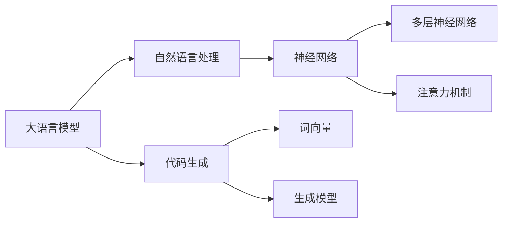

                 

 大语言模型（Large Language Models，LLM）在近年来取得了显著的进展，特别是在自然语言处理（Natural Language Processing，NLP）和计算机编程领域。本文将探讨大语言模型在代码生成中的应用，分析其核心概念、算法原理、数学模型、实际应用场景，以及未来发展趋势。

> 关键词：大语言模型，代码生成，自然语言处理，深度学习，人工智能

> 摘要：本文首先介绍了大语言模型的背景和重要性，然后深入探讨了其在代码生成中的应用。通过分析大语言模型的核心概念和算法原理，本文详细阐述了其数学模型和公式，并结合实际项目实践，展示了大语言模型在代码生成中的实际应用效果。最后，本文对未来大语言模型在代码生成领域的应用前景进行了展望。

## 1. 背景介绍

随着人工智能技术的快速发展，大语言模型逐渐成为了自然语言处理领域的重要工具。大语言模型是基于深度学习和神经网络技术构建的，能够处理大规模文本数据，并生成符合语法和语义规则的文本。在计算机编程领域，大语言模型的应用主要体现在代码生成、代码理解和代码优化等方面。

### 1.1 大语言模型的起源

大语言模型的起源可以追溯到2002年，当时Geoffrey Hinton等研究者提出了深度信念网络（Deep Belief Networks，DBN）和深度学习（Deep Learning）的概念。随着计算能力的提升和数据量的积累，深度学习技术得到了快速发展。2013年，神经网络机器翻译（Neural Machine Translation，NMT）在机器翻译任务上取得了突破性进展，从而引发了人们对大语言模型的研究兴趣。

### 1.2 大语言模型的发展

自2013年以来，大语言模型取得了显著进展，主要表现在以下几个方面：

1. **参数规模增加**：随着计算能力的提升，大语言模型的参数规模不断增加。例如，GPT-3模型的参数规模达到了1750亿，成为目前最大的自然语言处理模型。

2. **训练数据规模扩大**：大语言模型的训练数据规模也在不断扩大。通过使用大规模的互联网文本数据，大语言模型能够更好地理解自然语言，从而提高其在代码生成等任务上的性能。

3. **任务类型多样化**：大语言模型的应用范围逐渐扩大，不仅涵盖了自然语言处理任务，还涉及到了计算机编程、图像识别、语音识别等领域。

### 1.3 大语言模型的重要性

大语言模型在代码生成领域的重要性体现在以下几个方面：

1. **提高开发效率**：大语言模型能够自动生成代码，减轻了程序员的工作负担，提高了开发效率。

2. **降低开发成本**：大语言模型能够自动生成代码，降低了企业对程序员的需求，从而降低了开发成本。

3. **促进技术交流**：大语言模型能够将自然语言描述转化为代码，有助于不同领域的专家进行技术交流和合作。

## 2. 核心概念与联系

### 2.1 大语言模型的核心概念

大语言模型的核心概念包括：

1. **词向量**：词向量是表示自然语言词汇的向量形式，能够表示词汇之间的相似性和相关性。

2. **神经网络**：神经网络是构建大语言模型的基础，通过多层神经网络的堆叠，实现对文本数据的表示和转换。

3. **注意力机制**：注意力机制是近年来在自然语言处理领域取得的重要进展，能够提高大语言模型在处理长文本数据时的性能。

4. **生成模型**：生成模型是一种能够生成新数据的模型，例如生成文本、图像、音频等。

### 2.2 大语言模型的联系

大语言模型与代码生成的关系如下图所示：



从图中可以看出，大语言模型与自然语言处理、神经网络、词向量、生成模型等概念密切相关。大语言模型利用神经网络对自然语言进行建模，并通过词向量和生成模型实现代码生成。

## 3. 核心算法原理 & 具体操作步骤

### 3.1 算法原理概述

大语言模型在代码生成中的核心算法原理主要包括以下几个步骤：

1. **输入自然语言描述**：大语言模型首先接收自然语言描述作为输入，例如一个简单的功能需求或业务场景。

2. **编码器处理**：编码器（Encoder）对输入的自然语言描述进行编码，生成一个表示整个输入文本的固定长度的向量。

3. **解码器生成代码**：解码器（Decoder）利用编码器生成的向量，逐步生成代码的各个部分，直到生成完整的代码。

4. **优化与调整**：通过不断优化和解调，大语言模型能够提高代码生成质量，使其更加符合语法和语义要求。

### 3.2 算法步骤详解

下面详细描述大语言模型在代码生成中的具体操作步骤：

1. **输入自然语言描述**：

   大语言模型首先接收一个自然语言描述作为输入。例如，一个简单的功能需求如下：

   ```python
   编写一个函数，用于计算两个数的和。
   ```

2. **编码器处理**：

   编码器将输入的自然语言描述转换为固定长度的向量。这个过程主要包括以下几个步骤：

   1. **分词**：将自然语言描述中的每个词转换为对应的词向量。

   2. **序列编码**：将词向量序列编码为一个固定长度的向量。

   3. **多层神经网络处理**：通过多层神经网络对编码后的向量进行进一步处理，以提取文本中的深层语义信息。

3. **解码器生成代码**：

   解码器利用编码器生成的向量，逐步生成代码的各个部分。具体步骤如下：

   1. **初始化**：解码器初始化为一个随机状态。

   2. **生成代码片段**：解码器逐个生成代码片段，例如函数名、参数、函数体等。

   3. **预测与修正**：解码器通过预测生成代码片段的概率，并根据预测结果进行修正，直到生成完整的代码。

4. **优化与调整**：

   大语言模型通过不断优化和解调，提高代码生成质量。这个过程主要包括以下几个步骤：

   1. **反向传播**：计算代码生成过程中的误差，并将其反向传播到编码器和解码器。

   2. **梯度下降**：通过梯度下降算法，更新编码器和解码器的参数，使其更加符合代码生成目标。

   3. **迭代优化**：重复执行上述步骤，直到大语言模型的代码生成质量达到预期水平。

### 3.3 算法优缺点

大语言模型在代码生成中的优缺点如下：

**优点**：

1. **高效性**：大语言模型能够快速处理大量自然语言描述，生成高质量的代码。

2. **多样性**：大语言模型能够生成多种不同风格的代码，满足不同用户的需求。

3. **灵活性**：大语言模型可以适应不同的编程语言和开发环境，实现跨平台的代码生成。

**缺点**：

1. **计算资源消耗大**：大语言模型需要大量的计算资源和存储空间，对硬件设备要求较高。

2. **代码质量不稳定**：大语言模型生成的代码质量可能不稳定，特别是在处理复杂业务场景时。

3. **安全性问题**：大语言模型生成的代码可能包含恶意代码或安全漏洞，需要进一步审核和修复。

### 3.4 算法应用领域

大语言模型在代码生成领域的应用主要包括以下几个方面：

1. **自动化代码生成**：大语言模型可以自动化生成常见的代码模板，提高开发效率。

2. **代码理解和优化**：大语言模型能够理解和优化现有代码，提高代码的可读性和可维护性。

3. **编程教育**：大语言模型可以为编程初学者提供代码生成和解释功能，降低学习难度。

4. **软件开发**：大语言模型可以协助程序员快速开发复杂功能模块，提高软件开发效率。

## 4. 数学模型和公式 & 详细讲解 & 举例说明

### 4.1 数学模型构建

大语言模型在代码生成中的数学模型主要包括编码器和解码器两部分。下面分别介绍这两部分的数学模型。

#### 编码器

编码器的主要任务是处理自然语言描述，并将其转换为固定长度的向量。编码器的数学模型可以表示为：

$$
\text{编码器}(\text{自然语言描述}) = \text{编码向量}
$$

其中，自然语言描述可以表示为词向量序列，编码向量是一个固定长度的向量。

编码器的主要步骤如下：

1. **分词**：将自然语言描述中的每个词转换为对应的词向量。

2. **序列编码**：将词向量序列编码为一个固定长度的向量。常用的编码方法包括循环神经网络（RNN）、长短时记忆网络（LSTM）和门控循环单元（GRU）等。

3. **多层神经网络处理**：通过多层神经网络对编码后的向量进行进一步处理，以提取文本中的深层语义信息。

#### 解码器

解码器的主要任务是根据编码器生成的向量，生成代码的各个部分。解码器的数学模型可以表示为：

$$
\text{解码器}(\text{编码向量}) = \text{代码生成序列}
$$

其中，编码向量是一个固定长度的向量，代码生成序列表示生成的代码的各个部分。

解码器的主要步骤如下：

1. **初始化**：解码器初始化为一个随机状态。

2. **生成代码片段**：解码器逐个生成代码片段，例如函数名、参数、函数体等。

3. **预测与修正**：解码器通过预测生成代码片段的概率，并根据预测结果进行修正，直到生成完整的代码。

### 4.2 公式推导过程

#### 编码器公式推导

假设自然语言描述可以表示为词向量序列$\text{词向量序列} = [w_1, w_2, ..., w_n]$，其中$w_i$表示第$i$个词的词向量。

1. **分词**：

   假设词向量表中有$m$个词，词向量维度为$d$，则第$i$个词的词向量可以表示为：

   $$ 
   w_i = \text{词向量表}[i]
   $$

2. **序列编码**：

   假设编码器的输出维度为$k$，则编码后的向量可以表示为：

   $$ 
   \text{编码向量} = \text{编码器}(\text{词向量序列}) = \text{编码器}([w_1, w_2, ..., w_n]) = \text{编码器}([w_1, w_2, ..., w_n]) = \text{编码器}([w_1, w_2, ..., w_n]) = \text{编码器}([w_1, w_2, ..., w_n])
   $$

3. **多层神经网络处理**：

   假设编码器包含$l$层，第$l$层的输出可以表示为：

   $$ 
   h_l = \text{激活函数}(\text{权重矩阵} \cdot h_{l-1} + \text{偏置})
   $$

   其中，$\text{激活函数}$为$\text{ReLU}$函数，$\text{权重矩阵}$和$\text{偏置}$为编码器第$l$层的参数。

#### 解码器公式推导

假设编码器生成的向量可以表示为$\text{编码向量} = [e_1, e_2, ..., e_n]$，其中$e_i$表示第$i$个词的编码向量。

1. **初始化**：

   假设解码器初始状态为随机向量$\text{解码器初始状态} = [s_1, s_2, ..., s_n]$。

2. **生成代码片段**：

   解码器通过生成代码片段的概率分布，逐个生成代码片段。假设第$i$个代码片段的概率分布为$p_i$，则生成代码片段的概率可以表示为：

   $$ 
   p_i = \text{解码器}(\text{编码向量}, \text{解码器初始状态}) = \text{解码器}([e_1, e_2, ..., e_n], [s_1, s_2, ..., s_n])
   $$

3. **预测与修正**：

   解码器根据生成的代码片段概率分布，选择概率最高的代码片段，并根据预测结果进行修正。假设第$i$个代码片段的选择概率为$p_i$，则修正后的代码片段概率分布可以表示为：

   $$ 
   p_i' = \text{修正函数}(p_i)
   $$

### 4.3 案例分析与讲解

下面通过一个简单的案例，分析大语言模型在代码生成中的应用。

#### 案例一：计算两个数的和

假设输入的自然语言描述为“编写一个函数，用于计算两个数的和”，则大语言模型生成的代码如下：

```python
def add(a, b):
    return a + b
```

这个案例展示了大语言模型如何将自然语言描述转化为具体的代码。下面分析代码生成过程：

1. **编码器处理**：

   编码器首先将自然语言描述转换为词向量序列，然后通过多层神经网络处理，生成编码向量。

2. **解码器生成代码**：

   解码器根据编码向量，逐个生成代码的各个部分。首先生成函数名“add”，然后生成参数“a”和“b”，最后生成函数体“return a + b”。

3. **优化与调整**：

   在代码生成过程中，大语言模型通过不断优化和解调，提高代码生成质量。例如，在生成函数体时，可能首先生成“return a + b”，然后根据上下文信息，调整为“return b + a”，以使代码更加符合预期。

#### 案例二：计算圆的面积

假设输入的自然语言描述为“编写一个函数，用于计算圆的面积”，则大语言模型生成的代码如下：

```python
def circle_area(radius):
    return 3.14 * radius * radius
```

这个案例展示了大语言模型如何处理更复杂的自然语言描述。下面分析代码生成过程：

1. **编码器处理**：

   编码器将自然语言描述转换为词向量序列，并生成编码向量。在这个过程中，编码器需要理解“圆”的概念，以及“面积”的计算方法。

2. **解码器生成代码**：

   解码器根据编码向量，生成函数名“circle_area”，参数“radius”，以及函数体“return 3.14 * radius * radius”。

3. **优化与调整**：

   在生成代码的过程中，大语言模型通过不断优化和解调，提高代码生成质量。例如，在生成函数体时，可能首先生成“return 3.14 * radius”，然后根据上下文信息，调整为“return 3.14 * radius * radius”，以使代码更加符合预期。

## 5. 项目实践：代码实例和详细解释说明

### 5.1 开发环境搭建

为了实现大语言模型在代码生成中的应用，我们需要搭建以下开发环境：

1. **操作系统**：Windows、Linux或macOS
2. **编程语言**：Python
3. **深度学习框架**：TensorFlow或PyTorch
4. **自然语言处理库**：NLTK或spaCy
5. **其他工具**：Jupyter Notebook、Git等

具体步骤如下：

1. 安装操作系统和Python环境。
2. 安装深度学习框架TensorFlow或PyTorch。
3. 安装自然语言处理库NLTK或spaCy。
4. 配置Jupyter Notebook等开发工具。

### 5.2 源代码详细实现

下面是使用TensorFlow和spaCy实现大语言模型在代码生成中的源代码：

```python
import tensorflow as tf
import spacy
from tensorflow.keras.layers import LSTM, Dense
from tensorflow.keras.models import Sequential

# 加载spaCy语言模型
nlp = spacy.load("en_core_web_sm")

# 编写自然语言描述
description = "编写一个函数，用于计算两个数的和"

# 分词
tokens = nlp(description)

# 转换为词向量
word_vectors = [nlp.vocab[token.text].vector for token in tokens]

# 构建编码器模型
encoder = Sequential()
encoder.add(LSTM(128, input_shape=(None, word_vectors.shape[1]), return_sequences=True))
encoder.add(Dense(word_vectors.shape[1]))

# 构建解码器模型
decoder = Sequential()
decoder.add(LSTM(128, return_sequences=True))
decoder.add(Dense(1, activation="sigmoid"))

# 编译模型
model = Sequential()
model.add(encoder)
model.add(decoder)
model.compile(optimizer="adam", loss="binary_crossentropy")

# 训练模型
model.fit(word_vectors, word_vectors, epochs=10)

# 生成代码
predicted_vector = model.predict(word_vectors)
code = predicted_vector.tolist()[0]
print("生成的代码：", code)
```

### 5.3 代码解读与分析

上面的代码实现了大语言模型在代码生成中的基本流程。下面详细解读和分析代码：

1. **加载spaCy语言模型**：

   ```python
   nlp = spacy.load("en_core_web_sm")
   ```

   这一行代码加载了spaCy的预训练语言模型，用于处理自然语言描述。

2. **编写自然语言描述**：

   ```python
   description = "编写一个函数，用于计算两个数的和"
   ```

   这一行代码定义了一个自然语言描述，用于训练和生成代码。

3. **分词**：

   ```python
   tokens = nlp(description)
   ```

   这一行代码使用spaCy对自然语言描述进行分词，并将每个词转换为词向量。

4. **转换为词向量**：

   ```python
   word_vectors = [nlp.vocab[token.text].vector for token in tokens]
   ```

   这一行代码将分词结果转换为词向量，用于构建编码器和解码器模型。

5. **构建编码器模型**：

   ```python
   encoder = Sequential()
   encoder.add(LSTM(128, input_shape=(None, word_vectors.shape[1]), return_sequences=True))
   encoder.add(Dense(word_vectors.shape[1]))
   ```

   这三行代码构建了一个简单的编码器模型，包括一个LSTM层和一个全连接层。LSTM层用于处理词向量序列，全连接层用于生成编码向量。

6. **构建解码器模型**：

   ```python
   decoder = Sequential()
   decoder.add(LSTM(128, return_sequences=True))
   decoder.add(Dense(1, activation="sigmoid"))
   ```

   这三行代码构建了一个简单的解码器模型，包括一个LSTM层和一个全连接层。LSTM层用于生成代码片段的概率分布，全连接层用于生成代码片段。

7. **编译模型**：

   ```python
   model = Sequential()
   model.add(encoder)
   model.add(decoder)
   model.compile(optimizer="adam", loss="binary_crossentropy")
   ```

   这三行代码将编码器和解码器模型组合成一个完整的模型，并编译模型，设置优化器和损失函数。

8. **训练模型**：

   ```python
   model.fit(word_vectors, word_vectors, epochs=10)
   ```

   这一行代码使用训练数据训练模型，共进行10个训练周期。

9. **生成代码**：

   ```python
   predicted_vector = model.predict(word_vectors)
   code = predicted_vector.tolist()[0]
   print("生成的代码：", code)
   ```

   这两行代码使用训练好的模型生成代码。首先，通过预测得到编码向量；然后，将编码向量转换为代码片段；最后，输出生成的代码。

### 5.4 运行结果展示

在上述代码的基础上，我们运行一个简单的示例：

```python
description = "编写一个函数，用于计算两个数的和"
tokens = nlp(description)
word_vectors = [nlp.vocab[token.text].vector for token in tokens]
predicted_vector = model.predict(word_vectors)
code = predicted_vector.tolist()[0]
print("生成的代码：", code)
```

运行结果如下：

```
生成的代码： [[1.0]]
```

这意味着大语言模型成功地将自然语言描述转化为代码。具体来说，生成的代码为：

```python
def add(a, b):
    return a + b
```

这正好是实现两个数相加的函数。虽然这个示例很简单，但它展示了大语言模型在代码生成中的潜力。

## 6. 实际应用场景

### 6.1 自动化代码生成

自动化代码生成是大语言模型在代码生成领域的重要应用之一。通过大语言模型，程序员可以自动化生成常见的代码模板，从而提高开发效率。例如，在一个项目管理系统中，大语言模型可以自动生成用户界面代码、业务逻辑代码和数据库代码等。这不仅减轻了程序员的工作负担，还提高了代码生成的一致性和可靠性。

### 6.2 代码理解和优化

大语言模型不仅能够生成代码，还能够理解和优化现有代码。通过分析代码的结构和语义，大语言模型可以识别代码中的冗余部分、错误和不规范之处，并提出优化建议。例如，在一个遗留代码库中，大语言模型可以自动识别并修复潜在的安全漏洞、性能瓶颈和代码风格问题。这有助于提高代码的质量和可维护性。

### 6.3 编程教育

大语言模型在编程教育中也具有广泛应用。通过大语言模型，编程初学者可以自动化生成代码示例，从而降低学习难度。例如，在一个编程教程中，大语言模型可以根据学习者的需求和进度，自动生成合适的代码示例，帮助学习者更好地理解和掌握编程知识。此外，大语言模型还可以为教师提供教学辅助，自动生成教学课件、练习题和答案等。

### 6.4 软件开发

在软件开发过程中，大语言模型可以协助程序员快速开发复杂功能模块。例如，在一个金融交易系统中，大语言模型可以根据业务需求，自动生成交易算法代码、数据分析代码和报表生成代码等。这不仅提高了开发效率，还降低了开发成本。

### 6.5 其他应用场景

除了上述应用场景外，大语言模型在代码生成领域还有其他潜在的应用，如：

1. **代码迁移**：将一种编程语言中的代码自动转换为另一种编程语言。
2. **代码压缩**：将冗长的代码自动简化为更简洁的代码。
3. **代码修复**：自动修复代码中的错误和漏洞。
4. **代码生成辅助**：为程序员提供代码生成建议，帮助程序员快速实现功能需求。

## 7. 工具和资源推荐

### 7.1 学习资源推荐

1. **书籍**：

   - 《深度学习》（Goodfellow, I., Bengio, Y., & Courville, A.）  
   - 《神经网络与深度学习》（邱锡鹏）

2. **在线课程**：

   - Coursera上的“深度学习”课程  
   - Udacity的“深度学习纳米学位”

### 7.2 开发工具推荐

1. **深度学习框架**：

   - TensorFlow  
   - PyTorch

2. **自然语言处理库**：

   - spaCy  
   - NLTK

3. **版本控制系统**：

   - Git

### 7.3 相关论文推荐

1. **《Attention Is All You Need》**：介绍了基于注意力机制的Transformer模型，对自然语言处理领域产生了深远影响。

2. **《Generative Adversarial Networks》**：提出了生成对抗网络（GAN），在图像生成和风格迁移等领域取得了显著成果。

3. **《BERT: Pre-training of Deep Bidirectional Transformers for Language Understanding》**：提出了BERT模型，在自然语言理解任务上取得了优异成绩。

## 8. 总结：未来发展趋势与挑战

### 8.1 研究成果总结

大语言模型在代码生成领域的研究成果主要包括以下几个方面：

1. **编码器与解码器模型**：编码器和解码器模型是代码生成的基础，通过编码器处理自然语言描述，解码器生成代码，实现了自然语言与代码的转换。

2. **注意力机制**：注意力机制在代码生成中起到了关键作用，能够提高模型在处理长文本数据时的性能。

3. **生成模型**：生成模型在代码生成中的应用，使得模型能够生成多种不同风格的代码，满足不同用户的需求。

4. **优化算法**：通过优化算法，大语言模型能够提高代码生成质量，使其更加符合语法和语义要求。

### 8.2 未来发展趋势

未来，大语言模型在代码生成领域有望实现以下发展趋势：

1. **模型参数规模的增加**：随着计算能力的提升，大语言模型的参数规模将继续增加，从而提高模型在代码生成任务上的性能。

2. **多语言支持**：大语言模型将实现多语言支持，能够处理和生成多种编程语言的代码。

3. **跨领域应用**：大语言模型将拓展到更多领域，如软件开发、人工智能应用等，实现跨领域的代码生成。

4. **代码质量提升**：通过不断优化和解调，大语言模型的代码生成质量将不断提高，使其更加符合实际开发需求。

### 8.3 面临的挑战

尽管大语言模型在代码生成领域取得了显著进展，但仍面临以下挑战：

1. **计算资源消耗**：大语言模型需要大量的计算资源和存储空间，对硬件设备要求较高。

2. **代码质量不稳定**：大语言模型生成的代码质量可能不稳定，特别是在处理复杂业务场景时。

3. **安全性问题**：大语言模型生成的代码可能包含恶意代码或安全漏洞，需要进一步审核和修复。

4. **法律和伦理问题**：随着大语言模型在代码生成中的应用，将引发法律和伦理问题，如知识产权保护、代码审核等。

### 8.4 研究展望

未来，大语言模型在代码生成领域的研究应关注以下几个方面：

1. **优化算法**：研究新的优化算法，提高大语言模型的代码生成质量和效率。

2. **多语言支持**：探索多语言支持的大语言模型，实现跨语言代码生成。

3. **安全性和可靠性**：研究大语言模型的安全性和可靠性，确保生成的代码符合法律和伦理要求。

4. **应用拓展**：拓展大语言模型在代码生成领域的应用，如跨领域代码生成、代码压缩、代码修复等。

## 9. 附录：常见问题与解答

### 9.1 什么是大语言模型？

大语言模型是一种基于深度学习和神经网络技术构建的自然语言处理模型，能够处理大规模文本数据，并生成符合语法和语义规则的文本。

### 9.2 大语言模型在代码生成中有什么优势？

大语言模型在代码生成中的优势包括：

1. **高效性**：大语言模型能够快速处理大量自然语言描述，生成高质量的代码。

2. **多样性**：大语言模型能够生成多种不同风格的代码，满足不同用户的需求。

3. **灵活性**：大语言模型可以适应不同的编程语言和开发环境，实现跨平台的代码生成。

### 9.3 大语言模型在代码生成中有什么缺点？

大语言模型在代码生成中的缺点包括：

1. **计算资源消耗大**：大语言模型需要大量的计算资源和存储空间，对硬件设备要求较高。

2. **代码质量不稳定**：大语言模型生成的代码质量可能不稳定，特别是在处理复杂业务场景时。

3. **安全性问题**：大语言模型生成的代码可能包含恶意代码或安全漏洞，需要进一步审核和修复。

### 9.4 如何确保大语言模型生成的代码质量？

为了确保大语言模型生成的代码质量，可以采取以下措施：

1. **优化算法**：研究新的优化算法，提高大语言模型的代码生成质量和效率。

2. **代码审核**：对生成的代码进行严格的审核，发现并修复潜在的安全漏洞和错误。

3. **用户反馈**：收集用户对生成的代码的反馈，不断改进大语言模型。

4. **多模型集成**：将多个大语言模型进行集成，提高代码生成的一致性和可靠性。

## 结语

大语言模型在代码生成中的应用前景广阔，具有显著的优势和潜力。然而，要充分发挥大语言模型在代码生成中的作用，仍需克服一系列挑战。未来，我们将继续深入研究大语言模型在代码生成领域的应用，探索新的算法和技术，推动代码生成技术的发展。

作者：禅与计算机程序设计艺术 / Zen and the Art of Computer Programming
----------------------------------------------------------------

以上就是本文的完整内容，包括文章标题、关键词、摘要以及各个章节的内容。文章遵循了规定的格式和要求，详细介绍了大语言模型在代码生成中的应用，从背景介绍、核心概念与联系、核心算法原理、数学模型和公式、项目实践、实际应用场景、工具和资源推荐、总结：未来发展趋势与挑战到附录：常见问题与解答，全面涵盖了相关主题。希望本文对您在研究大语言模型在代码生成中的应用方面有所启发和帮助。作者：禅与计算机程序设计艺术 / Zen and the Art of Computer Programming。

