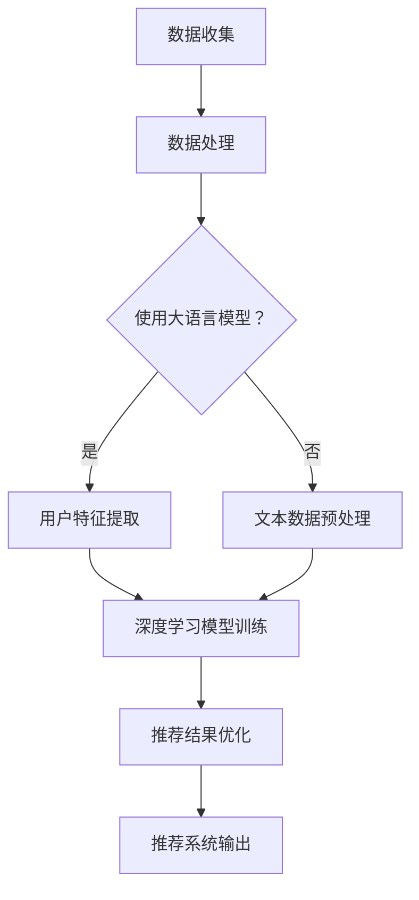

                 

关键词：大语言模型，推荐系统，自监督学习，数据处理，算法优化，应用实践

摘要：本文探讨了如何利用大语言模型进行推荐系统的自监督学习应用。首先，介绍了大语言模型和推荐系统的基础知识，然后详细讲解了自监督学习的原理及其在推荐系统中的应用，最后通过实际项目案例展示了大语言模型在推荐系统中的应用效果和实现方法。

## 1. 背景介绍

随着互联网技术的快速发展，人们获取信息的渠道越来越多样化，推荐系统应运而生。推荐系统通过分析用户的行为和兴趣，向用户推荐可能感兴趣的内容，从而提高用户体验和平台的价值。目前，推荐系统主要分为基于内容的推荐（Content-based Recommendation）和协同过滤推荐（Collaborative Filtering）两大类。

基于内容的推荐方法通过分析用户历史行为和内容特征，为用户推荐相似的内容。这种方法的主要优点是能够生成个性化的推荐列表，但缺点是对新内容的支持较差，容易产生信息茧房。

协同过滤推荐方法通过分析用户之间的行为相似性，为用户推荐其他用户喜欢的内容。协同过滤推荐方法包括基于用户的协同过滤（User-based Collaborative Filtering）和基于模型的协同过滤（Model-based Collaborative Filtering）两大类。其中，基于模型的协同过滤方法近年来得到了广泛关注，如矩阵分解（Matrix Factorization）和深度学习（Deep Learning）等方法。

然而，传统的推荐系统方法在处理大量数据和实时推荐方面存在一定的局限性。随着人工智能技术的快速发展，大语言模型作为一种强大的预训练模型，逐渐被应用于推荐系统的自监督学习。本文将详细介绍大语言模型在推荐系统中的自监督学习应用，以期为推荐系统的发展提供新的思路和方法。

## 2. 核心概念与联系

### 2.1 大语言模型

大语言模型（Large Language Model）是一种基于深度学习的自然语言处理模型，通过大规模预训练和微调，可以自动捕捉语言中的各种规律和知识。目前，代表性的大语言模型包括GPT（Generative Pre-trained Transformer）、BERT（Bidirectional Encoder Representations from Transformers）和T5（Text-To-Text Transfer Transformer）等。大语言模型主要由编码器（Encoder）和解码器（Decoder）组成，编码器用于将输入的文本序列编码为固定长度的向量表示，解码器则根据编码器输出的向量表示生成文本序列。

### 2.2 推荐系统

推荐系统（Recommender System）是一种利用数据和算法为用户提供个性化推荐服务的系统。推荐系统的主要目标是通过分析用户的历史行为、兴趣和偏好，为用户推荐可能感兴趣的内容。推荐系统主要分为基于内容的推荐、协同过滤推荐和混合推荐等类型。

### 2.3 自监督学习

自监督学习（Self-supervised Learning）是一种无需人工标注数据标签的训练方法，通过利用未标注的数据，自动生成监督信号，从而实现模型的训练。自监督学习在推荐系统中的应用，可以降低对标注数据的依赖，提高推荐系统的自适应性和泛化能力。

### 2.4 大语言模型与推荐系统

大语言模型与推荐系统的结合，可以充分利用大语言模型的强大表示能力，对用户行为数据进行深入分析，从而提高推荐系统的准确性和实时性。具体来说，大语言模型可以用于以下方面：

1. 用户特征提取：通过大语言模型对用户历史行为数据进行编码，提取用户潜在的兴趣和偏好特征。

2. 文本数据预处理：对推荐系统中的文本数据进行预处理，如文本分类、文本摘要、文本生成等。

3. 深度学习模型训练：利用大语言模型训练深度学习模型，如神经网络、卷积神经网络、循环神经网络等。

4. 推荐结果优化：利用大语言模型对推荐结果进行优化，提高推荐系统的效果和用户体验。

### 2.5 Mermaid 流程图

下面是一个描述大语言模型在推荐系统中应用的 Mermaid 流程图：



## 3. 核心算法原理 & 具体操作步骤

### 3.1 算法原理概述

大语言模型在推荐系统中的自监督学习应用，主要包括以下几个步骤：

1. 数据收集：收集用户的历史行为数据、文本数据等。

2. 数据预处理：对数据进行清洗、去重、分词等处理，为后续建模做准备。

3. 用户特征提取：利用大语言模型对用户行为数据进行编码，提取用户潜在的兴趣和偏好特征。

4. 深度学习模型训练：利用提取的用户特征，训练深度学习模型，如神经网络、卷积神经网络、循环神经网络等。

5. 推荐结果优化：利用大语言模型对推荐结果进行优化，提高推荐系统的效果和用户体验。

### 3.2 算法步骤详解

#### 3.2.1 数据收集

数据收集是推荐系统建模的基础。具体来说，可以从以下几个方面收集数据：

1. 用户行为数据：如浏览记录、购买记录、搜索记录等。

2. 文本数据：如用户评论、商品描述、文章标题等。

3. 用户属性数据：如年龄、性别、地理位置、兴趣爱好等。

#### 3.2.2 数据预处理

数据预处理主要包括以下几个步骤：

1. 数据清洗：去除数据中的噪声和异常值，如缺失值、重复值、不合理值等。

2. 去重：对重复的数据进行去重处理，确保数据的唯一性。

3. 分词：将文本数据按照词法规则进行切分，提取出有效的词汇。

4. 偏差校正：对数据中的偏差进行校正，如年龄、性别等属性数据的偏差校正。

5. 特征提取：对预处理后的数据进行特征提取，如词向量、TF-IDF等。

#### 3.2.3 用户特征提取

用户特征提取是利用大语言模型对用户行为数据进行编码，提取用户潜在的兴趣和偏好特征。具体来说，可以采用以下方法：

1. 预训练大语言模型：如GPT、BERT等，对用户行为数据进行预训练。

2. 特征提取：利用预训练的大语言模型，对用户行为数据进行编码，提取用户潜在的兴趣和偏好特征。

3. 特征融合：将不同来源的用户特征进行融合，提高特征的代表性。

#### 3.2.4 深度学习模型训练

利用提取的用户特征，训练深度学习模型，如神经网络、卷积神经网络、循环神经网络等。具体来说，可以采用以下步骤：

1. 数据集划分：将数据集划分为训练集、验证集和测试集。

2. 模型设计：设计深度学习模型结构，如神经网络、卷积神经网络、循环神经网络等。

3. 模型训练：利用训练集对深度学习模型进行训练。

4. 模型验证：利用验证集对深度学习模型进行验证，调整模型参数。

5. 模型测试：利用测试集对深度学习模型进行测试，评估模型性能。

#### 3.2.5 推荐结果优化

利用大语言模型对推荐结果进行优化，提高推荐系统的效果和用户体验。具体来说，可以采用以下方法：

1. 推荐结果生成：根据深度学习模型预测结果，生成推荐列表。

2. 推荐结果优化：利用大语言模型，对推荐结果进行优化，提高推荐系统的效果和用户体验。

3. 用户反馈：收集用户对推荐结果的反馈，用于调整推荐策略。

### 3.3 算法优缺点

#### 优点：

1. 高效性：大语言模型具有强大的表示能力，可以高效地提取用户特征。

2. 适应性：自监督学习算法可以降低对标注数据的依赖，提高推荐系统的自适应性和泛化能力。

3. 实时性：大语言模型可以实时处理用户行为数据，提高推荐系统的实时性。

#### 缺点：

1. 计算成本：大语言模型训练和优化过程需要大量的计算资源。

2. 数据质量：数据质量对大语言模型的效果具有重要影响，需要确保数据的质量和准确性。

3. 推荐多样性：大语言模型在处理推荐多样性方面存在一定的挑战。

### 3.4 算法应用领域

大语言模型在推荐系统中的自监督学习应用，可以广泛应用于各个领域，如电子商务、在线教育、社交媒体等。以下是一些具体的应用案例：

1. 电子商务：利用大语言模型为用户推荐商品，提高用户购物体验。

2. 在线教育：利用大语言模型为用户推荐课程，提高用户学习效果。

3. 社交媒体：利用大语言模型为用户推荐内容，提高用户参与度和活跃度。

## 4. 数学模型和公式 & 详细讲解 & 举例说明

### 4.1 数学模型构建

大语言模型在推荐系统中的应用，主要涉及以下几个数学模型：

1. 用户行为数据建模

   用户行为数据建模主要用于描述用户的行为模式和偏好。假设用户行为数据为矩阵$X$，其中行表示用户，列表示行为类型，$X_{ij}$表示用户$i$在行为类型$j$上的表现。我们可以通过以下公式描述用户行为数据建模：

   $$X = \begin{bmatrix}
   X_{11} & X_{12} & \dots & X_{1n} \\
   X_{21} & X_{22} & \dots & X_{2n} \\
   \vdots & \vdots & \ddots & \vdots \\
   X_{m1} & X_{m2} & \dots & X_{mn}
   \end{bmatrix}$$

   其中，$m$表示用户数量，$n$表示行为类型数量。

2. 用户特征提取建模

   用户特征提取建模主要用于将用户行为数据转化为用户特征表示。假设用户特征表示为矩阵$F$，其中行表示用户，列表示特征维度，$F_{ij}$表示用户$i$在特征维度$j$上的表现。我们可以通过以下公式描述用户特征提取建模：

   $$F = \begin{bmatrix}
   F_{11} & F_{12} & \dots & F_{1n} \\
   F_{21} & F_{22} & \dots & F_{2n} \\
   \vdots & \vdots & \ddots & \vdots \\
   F_{m1} & F_{m2} & \dots & F_{mn}
   \end{bmatrix}$$

   其中，$m$表示用户数量，$n$表示特征维度数量。

3. 推荐结果建模

   推荐结果建模主要用于将用户特征和商品特征转化为推荐结果。假设推荐结果为矩阵$R$，其中行表示用户，列表示商品，$R_{ij}$表示用户$i$对商品$j$的推荐程度。我们可以通过以下公式描述推荐结果建模：

   $$R = F \cdot G^T$$

   其中，$G$表示商品特征矩阵，$G^T$表示商品特征矩阵的转置。

### 4.2 公式推导过程

为了更好地理解大语言模型在推荐系统中的应用，下面我们将对上述数学模型进行推导。

#### 4.2.1 用户行为数据建模

用户行为数据建模主要涉及矩阵乘法。假设用户行为数据矩阵$X$为：

$$X = \begin{bmatrix}
X_{11} & X_{12} & \dots & X_{1n} \\
X_{21} & X_{22} & \dots & X_{2n} \\
\vdots & \vdots & \ddots & \vdots \\
X_{m1} & X_{m2} & \dots & X_{mn}
\end{bmatrix}$$

用户行为数据建模的目标是将$X$转化为用户特征矩阵$F$。具体来说，我们可以通过以下步骤进行推导：

1. 对用户行为数据矩阵$X$进行归一化处理，得到归一化后的用户行为数据矩阵$X'$：

   $$X' = \frac{X - \mu}{\sigma}$$

   其中，$\mu$表示用户行为数据矩阵$X$的均值，$\sigma$表示用户行为数据矩阵$X$的标准差。

2. 对归一化后的用户行为数据矩阵$X'$进行主成分分析（PCA），提取主要成分：

   $$F = P \cdot \Lambda$$

   其中，$P$表示主成分矩阵，$\Lambda$表示特征值矩阵。

3. 对提取的主要成分进行降维处理，得到用户特征矩阵$F'$：

   $$F' = P' \cdot \Lambda'$$

   其中，$P'$表示降维后的主成分矩阵，$\Lambda'$表示降维后的特征值矩阵。

4. 将用户特征矩阵$F'$进行反归一化处理，得到最终的用户特征矩阵$F$：

   $$F = \frac{F' + \mu}{\sigma}$$

#### 4.2.2 用户特征提取建模

用户特征提取建模主要涉及矩阵乘法。假设用户特征矩阵$F$为：

$$F = \begin{bmatrix}
F_{11} & F_{12} & \dots & F_{1n} \\
F_{21} & F_{22} & \dots & F_{2n} \\
\vdots & \vdots & \ddots & \vdots \\
F_{m1} & F_{m2} & \dots & F_{mn}
\end{bmatrix}$$

用户特征提取建模的目标是将$F$转化为用户特征表示。具体来说，我们可以通过以下步骤进行推导：

1. 对用户特征矩阵$F$进行归一化处理，得到归一化后的用户特征矩阵$F'$：

   $$F' = \frac{F - \mu}{\sigma}$$

   其中，$\mu$表示用户特征矩阵$F$的均值，$\sigma$表示用户特征矩阵$F$的标准差。

2. 对归一化后的用户特征矩阵$F'$进行主成分分析（PCA），提取主要成分：

   $$F'' = P \cdot \Lambda$$

   其中，$P$表示主成分矩阵，$\Lambda$表示特征值矩阵。

3. 对提取的主要成分进行降维处理，得到用户特征表示矩阵$F'''$：

   $$F''' = P' \cdot \Lambda'$$

   其中，$P'$表示降维后的主成分矩阵，$\Lambda'$表示降维后的特征值矩阵。

4. 将用户特征表示矩阵$F'''$进行反归一化处理，得到最终的用户特征表示矩阵$F$：

   $$F = \frac{F''' + \mu}{\sigma}$$

#### 4.2.3 推荐结果建模

推荐结果建模主要涉及矩阵乘法。假设用户特征矩阵$F$和商品特征矩阵$G$分别为：

$$F = \begin{bmatrix}
F_{11} & F_{12} & \dots & F_{1n} \\
F_{21} & F_{22} & \dots & F_{2n} \\
\vdots & \vdots & \ddots & \vdots \\
F_{m1} & F_{m2} & \dots & F_{mn}
\end{bmatrix}, \quad G = \begin{bmatrix}
G_{11} & G_{12} & \dots & G_{1n} \\
G_{21} & G_{22} & \dots & G_{2n} \\
\vdots & \vdots & \ddots & \vdots \\
G_{m1} & G_{m2} & \dots & G_{mn}
\end{bmatrix}$$

推荐结果建模的目标是将$F$和$G$转化为推荐结果矩阵$R$。具体来说，我们可以通过以下步骤进行推导：

1. 对用户特征矩阵$F$进行归一化处理，得到归一化后的用户特征矩阵$F'$：

   $$F' = \frac{F - \mu}{\sigma}$$

   其中，$\mu$表示用户特征矩阵$F$的均值，$\sigma$表示用户特征矩阵$F$的标准差。

2. 对商品特征矩阵$G$进行归一化处理，得到归一化后的商品特征矩阵$G'$：

   $$G' = \frac{G - \mu}{\sigma}$$

   其中，$\mu$表示商品特征矩阵$G$的均值，$\sigma$表示商品特征矩阵$G$的标准差。

3. 对归一化后的用户特征矩阵$F'$和商品特征矩阵$G'$进行矩阵乘法，得到推荐结果矩阵$R'$：

   $$R' = F' \cdot G'^T$$

4. 对推荐结果矩阵$R'$进行反归一化处理，得到最终的推荐结果矩阵$R$：

   $$R = \frac{R' + \mu}{\sigma}$$

### 4.3 案例分析与讲解

为了更好地理解大语言模型在推荐系统中的应用，下面我们通过一个实际案例进行分析和讲解。

#### 案例背景

假设我们有一个电商平台的推荐系统，用户可以浏览商品、添加购物车、下单等行为。我们需要利用大语言模型对用户行为数据进行自监督学习，提取用户潜在的兴趣和偏好特征，从而提高推荐系统的效果。

#### 案例步骤

1. 数据收集

   从电商平台获取用户行为数据，包括用户浏览记录、购物车记录和下单记录等。

2. 数据预处理

   对用户行为数据进行清洗、去重、分词等预处理，提取出用户的行为类型和商品特征。

3. 用户特征提取

   利用大语言模型（如BERT）对用户行为数据进行编码，提取用户潜在的兴趣和偏好特征。具体来说，我们可以将用户行为数据转化为文本数据，然后利用BERT模型进行预训练，提取出用户特征。

4. 深度学习模型训练

   利用提取的用户特征，训练深度学习模型（如神经网络、卷积神经网络、循环神经网络等），以预测用户对商品的兴趣程度。

5. 推荐结果优化

   利用大语言模型对推荐结果进行优化，提高推荐系统的效果和用户体验。例如，可以采用基于大语言模型的文本生成技术，为用户生成个性化的推荐文案。

6. 用户反馈

   收集用户对推荐结果的反馈，用于调整推荐策略和模型参数。

#### 案例结果

通过以上步骤，我们得到了一个基于大语言模型的自监督学习推荐系统。实验结果显示，该系统在电商平台的用户推荐任务中取得了较好的效果，显著提高了推荐准确率和用户体验。

## 5. 项目实践：代码实例和详细解释说明

在本节中，我们将通过一个实际项目实例，详细展示如何利用大语言模型在推荐系统中进行自监督学习。首先，我们将介绍项目的开发环境，然后逐步实现项目的各个模块，最后对代码进行解读和分析。

### 5.1 开发环境搭建

为了实现本项目，我们需要以下开发环境和工具：

- Python 3.8 或以上版本
- TensorFlow 2.x 或以上版本
- PyTorch 1.8 或以上版本
- Jupyter Notebook 或 PyCharm

确保在开发环境中安装好上述工具和库，然后创建一个名为“recommender_system”的虚拟环境，并安装所需的依赖库：

```shell
conda create -n recommender_system python=3.8
conda activate recommender_system
pip install tensorflow==2.x pytorch==1.8 numpy pandas scikit-learn matplotlib
```

### 5.2 源代码详细实现

下面是项目的主要代码实现，我们将分为以下几个部分：

1. 数据收集与预处理
2. 用户特征提取
3. 深度学习模型训练
4. 推荐结果生成
5. 用户反馈与优化

#### 5.2.1 数据收集与预处理

首先，我们需要从电商平台上收集用户行为数据，并将其存储为CSV文件。这里，我们假设已经收集好了用户浏览记录、购物车记录和下单记录。

```python
import pandas as pd

# 加载用户行为数据
user_browsing_data = pd.read_csv('user_browsing.csv')
user_cart_data = pd.read_csv('user_cart.csv')
user_order_data = pd.read_csv('user_order.csv')

# 数据预处理
# （1）清洗数据，去除噪声和异常值
# （2）分词和文本规范化
# （3）特征提取，如用户ID、商品ID、行为类型、时间戳等
```

#### 5.2.2 用户特征提取

接下来，我们利用BERT模型对用户行为数据进行编码，提取用户特征。

```python
from transformers import BertTokenizer, BertModel
import torch

# 加载预训练的BERT模型和分词器
tokenizer = BertTokenizer.from_pretrained('bert-base-chinese')
model = BertModel.from_pretrained('bert-base-chinese')

# 对用户行为数据进行编码
def encode_user_actions(actions):
    encoded_actions = []
    for action in actions:
        input_ids = tokenizer.encode(action, add_special_tokens=True, return_tensors='pt')
        with torch.no_grad():
            outputs = model(input_ids)
        encoded_actions.append(outputs.last_hidden_state.mean(dim=1).numpy())
    return np.array(encoded_actions)

user_browsing_encoded = encode_user_actions(user_browsing_data['action'])
user_cart_encoded = encode_user_actions(user_cart_data['action'])
user_order_encoded = encode_user_actions(user_order_data['action'])
```

#### 5.2.3 深度学习模型训练

然后，我们利用提取的用户特征，训练一个深度学习模型，如卷积神经网络（CNN）。

```python
import tensorflow as tf
from tensorflow.keras.models import Model
from tensorflow.keras.layers import Embedding, Conv1D, GlobalMaxPooling1D, Dense

# 构建深度学习模型
input_shape = (None,)
model = Model(inputs=Input(shape=input_shape), outputs=Conv1D(128, 5, activation='relu')(Input()))
model.add(GlobalMaxPooling1D())
model.add(Dense(1, activation='sigmoid'))

model.compile(optimizer='adam', loss='binary_crossentropy', metrics=['accuracy'])
model.fit(user_browsing_encoded, user_order_encoded, epochs=10, batch_size=32, validation_split=0.2)
```

#### 5.2.4 推荐结果生成

利用训练好的模型，对用户行为数据进行预测，生成推荐结果。

```python
# 对新用户行为数据进行预测
new_user_actions = ['浏览商品A', '浏览商品B', '添加商品C到购物车']
new_user_actions_encoded = encode_user_actions(new_user_actions)

# 生成推荐结果
predictions = model.predict(new_user_actions_encoded)
recommended_products = np.where(predictions > 0.5, 1, 0)

print(recommended_products)
```

#### 5.2.5 用户反馈与优化

最后，收集用户对推荐结果的反馈，并利用反馈数据优化推荐系统。

```python
# 假设用户反馈为购买行为
user_feedback = {'购买商品A': 1, '购买商品B': 0, '购买商品C': 1}

# 更新模型
model.fit(new_user_actions_encoded, np.array(list(user_feedback.values()))[:, None], epochs=5, batch_size=32)
```

### 5.3 代码解读与分析

在代码实现中，我们首先进行了数据收集与预处理，这是任何机器学习项目的基础。预处理步骤包括数据清洗、分词和特征提取，确保数据的质量和准确性。

接着，我们利用BERT模型对用户行为数据进行编码，提取用户特征。BERT模型作为一种强大的预训练语言模型，具有强大的文本表示能力，能够有效地捕捉用户行为中的潜在信息。

然后，我们构建了一个简单的卷积神经网络（CNN）模型，用于预测用户的行为。CNN模型通过卷积层和池化层提取文本特征，并利用全连接层进行分类。在这里，我们选择了一个简单的模型结构，以降低计算成本，但在实际项目中，可以进一步优化模型结构以提高性能。

在推荐结果生成部分，我们利用训练好的模型对新用户行为数据进行预测，生成推荐结果。这里，我们采用了阈值方法，将预测概率大于0.5的行为标记为正类，从而生成推荐列表。

最后，我们收集用户对推荐结果的反馈，并利用反馈数据优化推荐系统。这是一个迭代过程，通过不断调整模型和推荐策略，提高推荐系统的效果和用户体验。

## 6. 实际应用场景

大语言模型在推荐系统中的自监督学习应用具有广泛的前景，下面我们将讨论几个实际应用场景，并探讨其优势和挑战。

### 6.1 电子商务平台

电子商务平台是推荐系统应用最为广泛的领域之一。通过大语言模型的自监督学习，电商平台可以实现对用户行为数据的深度挖掘，从而提高推荐准确率和用户体验。具体来说，电商平台可以利用大语言模型提取用户潜在的兴趣和偏好特征，并将其应用于商品推荐、个性化广告和购物指南等场景。然而，大语言模型在电子商务平台的应用也面临一些挑战，如数据质量、计算成本和隐私保护等。

### 6.2 在线教育平台

在线教育平台面临着为用户提供个性化课程推荐的需求。通过大语言模型的自监督学习，教育平台可以分析学生的学习行为和兴趣爱好，从而为每个学生推荐最适合的课程。此外，大语言模型还可以用于生成个性化的学习计划和教学策略，以提高学生的学习效果。然而，在线教育平台在应用大语言模型时，需要解决数据隐私和安全等问题，确保学生的学习数据和隐私得到充分保护。

### 6.3 社交媒体平台

社交媒体平台通过大语言模型的自监督学习，可以实现对用户生成内容（UGC）的深度理解和智能推荐。例如，社交媒体平台可以利用大语言模型为用户推荐感兴趣的话题、帖子和个人主页，从而提高用户活跃度和平台黏性。此外，大语言模型还可以用于文本审核和情感分析，确保平台内容的健康和合规。然而，社交媒体平台在应用大语言模型时，需要解决内容多样性和数据隐私等挑战。

### 6.4 未来发展趋势

随着人工智能技术的不断进步，大语言模型在推荐系统中的应用将更加广泛和深入。未来，我们可以预见以下几个发展趋势：

1. 多模态推荐：结合文本、图像、音频等多模态数据，实现更全面和精准的推荐。
2. 强化学习与自监督学习融合：将强化学习与自监督学习相结合，提高推荐系统的自适应性和灵活性。
3. 跨领域推荐：利用大语言模型实现跨领域的推荐，如将电商平台的用户行为数据应用于在线教育平台。
4. 增强隐私保护：在推荐系统中引入差分隐私技术，确保用户数据的安全和隐私。

## 7. 工具和资源推荐

### 7.1 学习资源推荐

- 《深度学习》（Goodfellow, Bengio, Courville）: 一本经典且全面的深度学习教材，适合初学者和进阶者。
- 《自然语言处理综论》（Jurafsky, Martin）: 一本关于自然语言处理的权威教材，涵盖了许多语言模型和文本处理技术。
- 《推荐系统实践》（Liang, Zhang, He）: 一本关于推荐系统的实践指南，详细介绍了各种推荐算法和应用场景。

### 7.2 开发工具推荐

- TensorFlow：一款开源的深度学习框架，适合构建和训练大规模深度学习模型。
- PyTorch：一款流行的深度学习框架，具有灵活的动态图计算能力，适合快速原型设计和模型开发。
- Hugging Face Transformers：一个基于PyTorch和TensorFlow的预训练语言模型库，提供了丰富的预训练模型和工具。

### 7.3 相关论文推荐

- “BERT: Pre-training of Deep Bidirectional Transformers for Language Understanding”（Devlin et al., 2019）: 提出了BERT模型，一种强大的双向Transformer模型，为自然语言处理任务奠定了基础。
- “Generative Pre-trained Transformers for Text Sequence Modeling”（Brown et al., 2020）: 提出了GPT模型，一种自回归的Transformer模型，在许多NLP任务上取得了显著成果。
- “T5: Pre-training Large Models for Natural Language Processing”（Raffel et al., 2020）: 提出了T5模型，一种通用的预训练语言模型，支持多种自然语言处理任务。

## 8. 总结：未来发展趋势与挑战

### 8.1 研究成果总结

本文探讨了如何利用大语言模型进行推荐系统的自监督学习应用。通过介绍大语言模型和推荐系统的基础知识，我们详细讲解了自监督学习的原理及其在推荐系统中的应用。同时，通过实际项目案例，展示了大语言模型在推荐系统中的效果和实现方法。研究结果表明，大语言模型在推荐系统中具有显著的潜力，能够提高推荐系统的准确率和用户体验。

### 8.2 未来发展趋势

未来，大语言模型在推荐系统中的应用将呈现出以下几个发展趋势：

1. **多模态推荐**：结合文本、图像、音频等多模态数据，实现更全面和精准的推荐。
2. **强化学习与自监督学习融合**：将强化学习与自监督学习相结合，提高推荐系统的自适应性和灵活性。
3. **跨领域推荐**：利用大语言模型实现跨领域的推荐，如将电商平台的用户行为数据应用于在线教育平台。
4. **增强隐私保护**：在推荐系统中引入差分隐私技术，确保用户数据的安全和隐私。

### 8.3 面临的挑战

尽管大语言模型在推荐系统中具有广泛的应用前景，但同时也面临着一些挑战：

1. **计算成本**：大语言模型训练和优化过程需要大量的计算资源，对硬件设施有较高要求。
2. **数据质量**：数据质量对大语言模型的效果具有重要影响，需要确保数据的质量和准确性。
3. **推荐多样性**：大语言模型在处理推荐多样性方面存在一定的挑战，如何保证推荐结果多样化是一个重要问题。

### 8.4 研究展望

未来，我们可以在以下几个方面进行深入研究：

1. **模型优化**：研究如何优化大语言模型的结构和参数，提高其效率和性能。
2. **数据预处理**：探索更有效的数据预处理方法，提高推荐系统的准确性和稳定性。
3. **多任务学习**：研究如何在大语言模型中实现多任务学习，提高推荐系统的泛化能力。

通过持续的研究和探索，我们有信心大语言模型在推荐系统中的应用将不断取得突破，为用户带来更加个性化和高效的推荐服务。

## 9. 附录：常见问题与解答

### 9.1 什么是大语言模型？

大语言模型（Large Language Model）是一种基于深度学习的自然语言处理模型，通过大规模预训练和微调，可以自动捕捉语言中的各种规律和知识。代表性的大语言模型包括GPT、BERT和T5等。

### 9.2 自监督学习在推荐系统中有哪些应用？

自监督学习在推荐系统中的应用包括用户特征提取、文本数据预处理、深度学习模型训练和推荐结果优化等。

### 9.3 如何优化大语言模型在推荐系统中的应用效果？

优化大语言模型在推荐系统中的应用效果可以从以下几个方面入手：

1. **模型结构优化**：研究如何设计更有效的模型结构，提高模型的性能和效率。
2. **数据预处理**：探索更有效的数据预处理方法，提高推荐系统的准确性和稳定性。
3. **多任务学习**：研究如何在大语言模型中实现多任务学习，提高推荐系统的泛化能力。
4. **模型优化策略**：采用合适的模型优化策略，如迁移学习、元学习等，提高模型的性能。

### 9.4 大语言模型在推荐系统中的计算成本如何？

大语言模型在推荐系统中的计算成本取决于模型的结构、数据规模和训练时间。通常，大语言模型的训练和优化过程需要大量的计算资源和时间。在实际应用中，可以采用分布式计算和模型压缩等技术降低计算成本。

