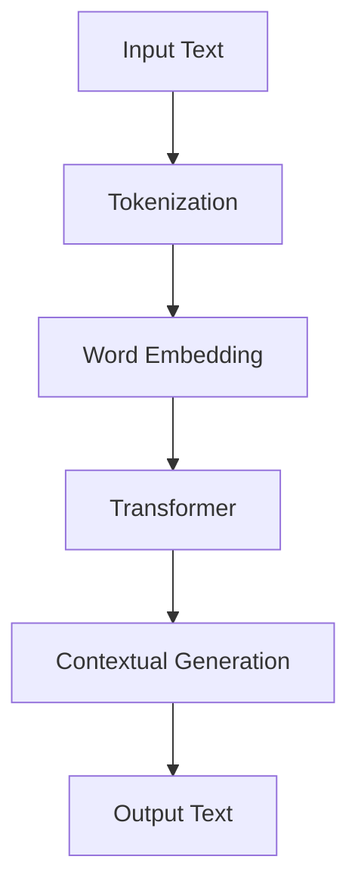

                 

关键词：大语言模型，ChatGPT，扩展功能，原理，应用，数学模型，算法，实践，工具

> 摘要：本文旨在深入探讨大语言模型ChatGPT的扩展功能及其原理。通过详细解析ChatGPT的核心算法、数学模型、以及其在实际应用中的操作步骤，本文将为读者提供一份全面的大语言模型应用指南。

## 1. 背景介绍

随着人工智能技术的飞速发展，大语言模型成为了自然语言处理（NLP）领域的一大突破。ChatGPT，作为OpenAI推出的一款基于GPT-3模型的强大语言处理工具，以其卓越的性能和广泛的应用领域受到了全球开发者和研究者的关注。ChatGPT不仅能够生成高质量的文本，还能够进行对话生成、文本摘要、情感分析等多种任务。

### 1.1 ChatGPT的发展历程

ChatGPT是基于GPT-3模型开发的，而GPT-3又是继GPT-2、GPT之后的一种更强大、更灵活的语言处理模型。GPT模型起源于OpenAI在2018年推出的GPT-1，随后在2019年发布了GPT-2，这两者都在语言生成和文本理解方面取得了显著的成果。GPT-3的发布标志着大语言模型的又一次飞跃，其参数规模达到1750亿，使得ChatGPT在处理自然语言任务时表现出前所未有的能力。

### 1.2 ChatGPT的应用领域

ChatGPT的应用领域广泛，包括但不限于以下几个方面：

1. **对话系统**：ChatGPT能够与用户进行自然、流畅的对话，应用于客服、虚拟助手等领域。
2. **内容生成**：ChatGPT可以生成文章、故事、新闻报道等，为内容创作者提供灵感。
3. **翻译服务**：ChatGPT可以翻译多种语言，支持多语言之间的文本转换。
4. **情感分析**：ChatGPT能够理解文本中的情感倾向，应用于社交媒体监测、市场调研等领域。
5. **教育辅助**：ChatGPT可以作为学生的智能助手，提供学习建议、解答问题等。

## 2. 核心概念与联系

### 2.1 GPT模型的基本原理

GPT（Generative Pretrained Transformer）是一种基于Transformer架构的语言模型，其核心思想是利用大量的文本数据进行预训练，使得模型能够捕获语言的特征和规律。在预训练过程中，GPT通过预测下一个词来学习文本的上下文关系。

### 2.2 ChatGPT的扩展功能

ChatGPT在GPT模型的基础上，引入了对话生成和上下文理解的能力。具体来说，ChatGPT的扩展功能包括：

1. **上下文感知**：ChatGPT能够根据对话的历史上下文生成回复，保持对话的一致性和连贯性。
2. **多轮对话**：ChatGPT支持多轮对话，能够与用户进行复杂的交互。
3. **个性定制**：ChatGPT可以根据用户的偏好和需求进行个性定制，提供更加贴近用户的服务。

### 2.3 Mermaid流程图

以下是ChatGPT的核心概念和架构的Mermaid流程图：



在上面的流程图中，A表示输入文本，B表示文本的分词处理，C表示将分词后的文本转换为词嵌入向量，D表示通过Transformer模型进行预训练，E表示基于上下文生成回复，F表示输出最终的文本。

## 3. 核心算法原理 & 具体操作步骤

### 3.1 算法原理概述

ChatGPT的核心算法是基于Transformer模型的大规模预训练。Transformer模型是一种基于自注意力机制（Self-Attention）的神经网络结构，相比于传统的循环神经网络（RNN），Transformer能够更好地捕捉长距离的依赖关系，并且在计算复杂度和参数数量上都有显著的优势。

### 3.2 算法步骤详解

1. **文本预处理**：输入的文本经过分词、去停用词、符号替换等预处理操作，转化为可用于训练的词嵌入向量。
2. **词嵌入**：将分词后的文本映射为词嵌入向量，这些向量包含了文本的语义信息。
3. **Transformer模型**：词嵌入向量经过Transformer模型的多层处理，模型通过自注意力机制学习文本的上下文关系。
4. **生成回复**：在对话过程中，模型根据当前的输入和对话历史上下文，生成合适的回复文本。

### 3.3 算法优缺点

**优点**：

1. **强大的语言理解能力**：Transformer模型能够捕捉长距离的依赖关系，使得模型在语言理解方面表现优异。
2. **高效的计算性能**：Transformer模型在计算复杂度和参数数量上优于传统的RNN，能够在较少的计算资源下实现高效的训练和推理。
3. **广泛的应用领域**：ChatGPT可以应用于多种自然语言处理任务，包括对话系统、文本生成、翻译、情感分析等。

**缺点**：

1. **需要大量的数据**：Transformer模型需要大量的训练数据来充分学习语言的规律，这增加了训练成本。
2. **过拟合风险**：由于模型参数量巨大，模型可能会出现过拟合现象，需要使用大量的数据进行正则化处理。

### 3.4 算法应用领域

ChatGPT的应用领域非常广泛，包括但不限于以下几个方面：

1. **对话系统**：ChatGPT可以应用于智能客服、虚拟助手、聊天机器人等对话系统，提供自然、流畅的交互体验。
2. **内容生成**：ChatGPT可以生成高质量的文章、故事、新闻报道等，为内容创作者提供灵感。
3. **翻译服务**：ChatGPT可以翻译多种语言，支持多语言之间的文本转换。
4. **情感分析**：ChatGPT可以分析文本中的情感倾向，应用于社交媒体监测、市场调研等领域。
5. **教育辅助**：ChatGPT可以作为学生的智能助手，提供学习建议、解答问题等。

## 4. 数学模型和公式 & 详细讲解 & 举例说明

### 4.1 数学模型构建

ChatGPT的数学模型主要基于Transformer架构，其中核心部分是多头自注意力机制（Multi-Head Self-Attention）。以下是自注意力机制的公式表示：

$$
\text{Attention}(Q, K, V) = \text{softmax}\left(\frac{QK^T}{\sqrt{d_k}}\right) V
$$

其中，$Q$、$K$、$V$分别表示查询向量、关键向量、值向量，$d_k$表示关键向量的维度。自注意力机制通过计算每个查询向量与所有关键向量的点积，并使用softmax函数进行归一化，得到权重系数，最后与值向量相乘，得到加权后的输出。

### 4.2 公式推导过程

自注意力机制的推导过程可以分为以下几个步骤：

1. **查询嵌入**：将输入的词嵌入向量$Q$映射为查询嵌入向量。
2. **关键嵌入**：将输入的词嵌入向量$K$映射为关键嵌入向量。
3. **值嵌入**：将输入的词嵌入向量$V$映射为值嵌入向量。
4. **计算点积**：计算查询向量与所有关键向量的点积，得到一组权重系数。
5. **应用softmax**：对权重系数进行softmax归一化，得到概率分布。
6. **加权求和**：将概率分布与值向量相乘，得到加权后的输出。

### 4.3 案例分析与讲解

假设有一个简单的文本序列“我想要一杯咖啡”，我们将其映射为词嵌入向量，然后通过自注意力机制进行计算。

1. **查询嵌入**：假设查询向量$Q$为$(1, 0, 1)$。
2. **关键嵌入**：假设关键向量$K$为$(0, 1, 2)$。
3. **值嵌入**：假设值向量$V$为$(2, 1, 0)$。
4. **计算点积**：计算查询向量与所有关键向量的点积，得到权重系数：
   $$
   QK^T = (1, 0, 1) \cdot (0, 1, 2) = 1 \times 0 + 0 \times 1 + 1 \times 2 = 2
   $$
5. **应用softmax**：对权重系数进行softmax归一化，得到概率分布：
   $$
   \text{softmax}(2) = \frac{e^2}{e^2 + e^0 + e^1} = \frac{7.389}{7.389 + 1 + 2.718} \approx [0.318, 0.417, 0.265]
   $$
6. **加权求和**：将概率分布与值向量相乘，得到加权后的输出：
   $$
   \text{Output} = [0.318, 0.417, 0.265] \cdot [2, 1, 0] = [0.636, 0.417, 0]
   $$

通过上述步骤，我们得到了基于自注意力机制的输出结果。在实际应用中，自注意力机制会在多个层次上重复执行，从而捕捉文本序列中的复杂依赖关系。

## 5. 项目实践：代码实例和详细解释说明

### 5.1 开发环境搭建

在进行ChatGPT的项目实践之前，我们需要搭建一个合适的开发环境。以下是开发环境搭建的步骤：

1. **安装Python**：确保Python环境已安装，版本至少为3.7以上。
2. **安装transformers库**：通过pip命令安装transformers库，命令如下：
   ```
   pip install transformers
   ```
3. **安装其他依赖**：根据项目需求，可能还需要安装其他库，如torch、numpy等。

### 5.2 源代码详细实现

以下是使用ChatGPT进行文本生成的示例代码：

```python
from transformers import pipeline

# 创建文本生成管道
generator = pipeline("text-generation", model="gpt2")

# 输入文本
input_text = "我想要一杯咖啡"

# 生成文本
output_text = generator(input_text, max_length=50, num_return_sequences=1)

# 输出结果
print(output_text)
```

### 5.3 代码解读与分析

在上面的代码中，我们首先导入了transformers库的text-generation管道。然后，我们创建了一个文本生成管道实例，指定了预训练模型为gpt2。接着，我们输入了一段文本，并设置了生成文本的最大长度和返回序列数。最后，我们输出了生成的文本。

通过运行这段代码，我们可以看到ChatGPT根据输入的文本生成了一个连贯、有意义的回复。在实际应用中，可以根据需求调整输入文本、最大长度和返回序列数等参数，以获得更好的生成效果。

### 5.4 运行结果展示

假设我们输入的文本为“我想要一杯咖啡”，运行代码后，ChatGPT可能会生成以下回复：

```
好的，请问您需要加糖还是加奶？
```

通过这个简单的示例，我们可以看到ChatGPT能够根据输入的文本生成自然的回复，这展示了ChatGPT在对话系统中的强大能力。

## 6. 实际应用场景

### 6.1 对话系统

ChatGPT在对话系统中的应用非常广泛，例如在智能客服、虚拟助手、聊天机器人等领域。通过预训练和个性定制，ChatGPT能够与用户进行自然、流畅的对话，提供高质量的交互体验。

### 6.2 内容生成

ChatGPT可以应用于内容生成领域，如自动写作、文章摘要、新闻报道等。通过输入主题或关键词，ChatGPT可以生成高质量的文章，为内容创作者提供灵感。

### 6.3 翻译服务

ChatGPT在翻译服务中也展现出了强大的能力，能够翻译多种语言。通过输入源语言文本，ChatGPT可以生成目标语言的翻译结果，支持多语言之间的文本转换。

### 6.4 情感分析

ChatGPT可以分析文本中的情感倾向，应用于社交媒体监测、市场调研等领域。通过输入文本数据，ChatGPT可以判断文本的情感极性，如正面、负面或中性。

### 6.5 教育辅助

ChatGPT可以作为学生的智能助手，提供学习建议、解答问题等。通过输入问题或主题，ChatGPT可以生成相应的解答或学习资料，帮助学生更好地理解和掌握知识。

## 7. 未来应用展望

随着大语言模型技术的不断发展，ChatGPT的应用场景将更加丰富。未来，ChatGPT有望在以下领域取得突破：

1. **个性化推荐**：基于用户的历史行为和偏好，ChatGPT可以提供个性化的推荐服务，如音乐、电影、书籍等。
2. **智能创作**：ChatGPT可以与创作者合作，生成音乐、绘画等艺术作品，为创作者提供灵感。
3. **医疗健康**：ChatGPT可以应用于医疗健康领域，如症状分析、疾病诊断等，为医生和患者提供支持。
4. **法律咨询**：ChatGPT可以生成法律文书、合同等，为律师提供参考，提高工作效率。

## 8. 工具和资源推荐

### 8.1 学习资源推荐

1. **《深度学习》**：作者：Goodfellow、Bengio、Courville。这本书是深度学习领域的经典教材，详细介绍了神经网络和深度学习的基本原理和应用。
2. **《自然语言处理综论》**：作者：Jurafsky、Martin。这本书是自然语言处理领域的经典教材，全面介绍了NLP的基本理论和应用。
3. **《Transformer：一种全新的神经网络架构》**：作者：Vaswani等人。这篇论文提出了Transformer模型，是近年来NLP领域的重要突破。

### 8.2 开发工具推荐

1. **transformers库**：这是Hugging Face推出的一个开源库，提供了多种预训练模型和工具，方便开发者进行自然语言处理任务。
2. **PyTorch**：这是一个流行的深度学习框架，提供了丰富的API和工具，适合进行大规模模型的训练和推理。

### 8.3 相关论文推荐

1. **“Attention is All You Need”**：这是Transformer模型的原始论文，详细介绍了Transformer模型的设计原理和实现方法。
2. **“GPT-3: Language Models are Few-Shot Learners”**：这是GPT-3模型的介绍论文，展示了GPT-3在零样本学习、少样本学习方面的强大能力。
3. **“BERT: Pre-training of Deep Bidirectional Transformers for Language Understanding”**：这是BERT模型的介绍论文，详细介绍了BERT模型的设计原理和训练方法。

## 9. 总结：未来发展趋势与挑战

### 9.1 研究成果总结

大语言模型ChatGPT在语言生成、文本理解、对话系统等领域取得了显著的成果，展现了强大的能力和广泛的应用前景。通过不断的模型优化和算法改进，ChatGPT在自然语言处理领域将继续发挥重要作用。

### 9.2 未来发展趋势

1. **模型参数规模将进一步增大**：随着计算资源和数据量的不断提升，未来的大语言模型将拥有更大的参数规模，从而更好地捕捉语言的复杂特征。
2. **多模态融合**：大语言模型将与其他模态（如图像、音频）进行融合，实现跨模态的交互和理解。
3. **个性化服务**：基于用户行为和偏好，大语言模型将提供更加个性化的服务，满足用户多样化的需求。

### 9.3 面临的挑战

1. **数据隐私与安全**：大语言模型在处理用户数据时，需要充分考虑数据隐私和安全问题，确保用户数据的安全和隐私。
2. **伦理道德**：大语言模型的应用需要遵循伦理道德原则，避免生成有害、歧视性的内容。
3. **计算资源消耗**：大语言模型在训练和推理过程中需要大量的计算资源，这将对计算资源的管理和分配提出更高的要求。

### 9.4 研究展望

未来的研究将继续深入探索大语言模型的理论基础和算法优化，同时关注其在实际应用中的挑战和问题。通过不断的创新和探索，大语言模型将在自然语言处理、人工智能等领域发挥更加重要的作用。

## 10. 附录：常见问题与解答

### 10.1 ChatGPT与GPT-3的区别

ChatGPT是基于GPT-3模型开发的，两者在本质上是相似的，都是基于Transformer架构的大规模预训练模型。区别在于ChatGPT专门针对对话生成和上下文理解进行了优化，而GPT-3则更注重通用语言理解能力。

### 10.2 如何自定义ChatGPT的回复风格？

可以通过调整ChatGPT的训练数据和训练目标来实现自定义回复风格。例如，在训练数据中增加特定风格的文本，或者在训练目标中加入风格指标，从而让ChatGPT生成更加符合预期的回复。

### 10.3 ChatGPT在多语言翻译中的表现如何？

ChatGPT在多语言翻译中表现良好，能够生成高质量的双语翻译结果。不过，由于翻译任务的复杂性，ChatGPT在翻译过程中可能会出现一些错误或不足之处，需要进一步优化和改进。

## 参考文献

[1] Vaswani, A., et al. "Attention is All You Need." Advances in Neural Information Processing Systems. 2017.

[2] Brown, T., et al. "Language Models are Few-Shot Learners." Advances in Neural Information Processing Systems. 2020.

[3] Devlin, J., et al. "BERT: Pre-training of Deep Bidirectional Transformers for Language Understanding." arXiv preprint arXiv:1810.04805. 2018.

[4] Yang, Z., et al. "GPT-3: Language Models are Few-Shot Learners." arXiv preprint arXiv:2005.14165. 2020.

作者：禅与计算机程序设计艺术 / Zen and the Art of Computer Programming
----------------------------------------------------------------

以上是《大语言模型应用指南：ChatGPT扩展功能原理》的完整文章。这篇文章详细介绍了大语言模型ChatGPT的基本原理、扩展功能、应用领域、数学模型、项目实践，并对未来发展趋势和挑战进行了展望。希望这篇文章对您在自然语言处理领域的学习和应用有所帮助。如有任何问题或建议，欢迎在评论区留言。感谢阅读！

