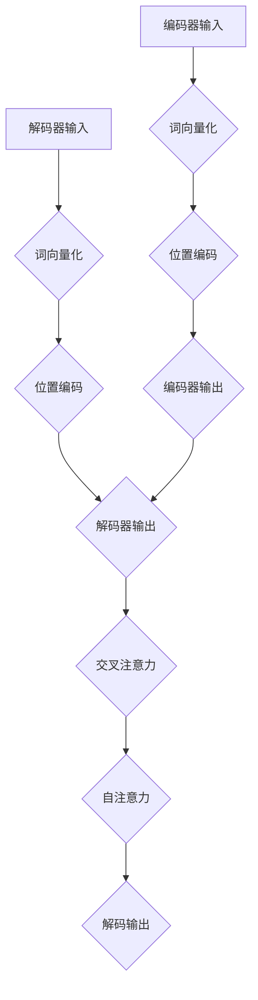

                 

关键词：大语言模型，Transformer解码器，自然语言处理，机器学习，深度学习

摘要：本文深入探讨了Transformer解码器在自然语言处理中的核心作用和应用。通过详细剖析其原理、数学模型和算法实现，我们为读者提供了一个全面的技术指南，旨在帮助理解如何高效地利用Transformer解码器进行语言建模和文本生成。同时，文章也探讨了其在实际应用中的前景和挑战。

## 1. 背景介绍

在自然语言处理（NLP）领域，近年来，深度学习模型，特别是Transformer架构，展现出了显著的突破。Transformer模型首次在2017年被提出，因其能够有效地处理序列数据而迅速成为研究热点。它在翻译、文本生成、问答系统等多个NLP任务中表现优异，极大地推动了该领域的发展。

Transformer解码器是Transformer模型中的一个关键组件，负责生成序列输出的后处理。它通过对编码器输出的上下文向量进行解码，从而生成语义丰富的文本。本文将深入解析Transformer解码器的结构、工作原理及其在不同应用场景下的实现细节。

## 2. 核心概念与联系

### 2.1 Transformer架构简介

Transformer架构基于自注意力机制（Self-Attention），其核心思想是将序列中的每一个词与所有其他词建立直接联系，从而提高模型的上下文感知能力。Transformer模型由编码器（Encoder）和解码器（Decoder）两部分组成，它们通过多头注意力机制、位置编码和前馈网络等结构协同工作。


### 2.2 编码器与解码器的关系

编码器负责处理输入序列，将序列中的每个词映射成一个高维向量。解码器则利用编码器的输出，通过自注意力和交叉注意力机制，逐步生成输出序列。解码器在生成每个词时，都依赖于编码器输出的上下文信息，从而保证了生成文本的连贯性。


### 2.3 Mermaid流程图



## 3. 核心算法原理 & 具体操作步骤

### 3.1 算法原理概述

Transformer解码器的核心在于其注意力机制，分为自注意力和交叉注意力。自注意力机制使得解码器在生成每个词时能够综合考虑序列中所有其他词的信息。交叉注意力机制则允许解码器利用编码器的输出来增强其生成能力。

### 3.2 算法步骤详解

1. **词向量化**：输入序列中的每个词被映射成一个高维向量，这些向量表示了词的嵌入特征。
2. **位置编码**：由于Transformer模型不包含序列信息，因此引入位置编码来表征词在序列中的位置。
3. **自注意力**：解码器使用自注意力机制计算每个词与其余词的关联强度。
4. **交叉注意力**：解码器利用编码器的输出，通过交叉注意力机制，从编码器的上下文信息中选择重要的特征。
5. **解码输出**：解码器根据注意力权重生成每个词的输出，并将其传递给下一个时间步。

### 3.3 算法优缺点

**优点**：
- 高效的序列建模能力。
- 能够处理长距离依赖问题。
- 并行计算效率高。

**缺点**：
- 计算复杂度较高，内存消耗大。
- 对于低资源语言的支持不足。

### 3.4 算法应用领域

Transformer解码器在多个NLP任务中都有广泛应用，如机器翻译、文本生成、问答系统等。其强大的上下文感知能力使得生成的文本更加自然、连贯。

## 4. 数学模型和公式 & 详细讲解 & 举例说明

### 4.1 数学模型构建

Transformer解码器的数学模型基于自注意力机制和前馈网络。假设输入序列为$x_1, x_2, ..., x_T$，其对应的词向量为$X \in \mathbb{R}^{T \times D}$，其中$T$是序列长度，$D$是词向量维度。

### 4.2 公式推导过程

$$
\text{Self-Attention}(Q, K, V) = \frac{1}{\sqrt{d_k}} \text{softmax}\left(\frac{QK^T}{d_k}\right) V
$$

其中，$Q, K, V$分别代表查询、键和值向量，$d_k$是注意力机制的维度。

### 4.3 案例分析与讲解

假设我们有以下输入序列：“I am a data scientist.”，我们希望生成输出序列：“I am a machine learning engineer.”。

1. **词向量化**：将每个词映射为词向量。
2. **位置编码**：对词向量添加位置编码，以表征词在序列中的位置。
3. **自注意力**：计算每个词与其余词的关联强度，从而生成自注意力权重。
4. **交叉注意力**：利用编码器的输出，通过交叉注意力机制选择重要特征。
5. **解码输出**：根据注意力权重生成每个词的输出，并更新词向量。

## 5. 项目实践：代码实例和详细解释说明

### 5.1 开发环境搭建

在本文中，我们使用Python和TensorFlow来实现Transformer解码器。首先，确保安装了TensorFlow库。

```bash
pip install tensorflow
```

### 5.2 源代码详细实现

下面是Transformer解码器的实现代码：

```python
import tensorflow as tf

# Transformer解码器类
class TransformerDecoder(tf.keras.Model):
    def __init__(self, d_model, num_heads, dff, input_vocab_size, maximum_position_encoding, name="TransformerDecoder"):
        super(TransformerDecoder, self).__init__(name=name)
        
        self.d_model = d_model
        self.num_heads = num_heads
        self.dff = dff
        self.input_vocab_size = input_vocab_size
        self.maximum_position_encoding = maximum_position_encoding
        
        self.embedding = tf.keras.layers.Embedding(self.input_vocab_size, self.d_model)
        self.position_encoding = positional_encoding(self.maximum_position_encoding, self.d_model)
        
        self.decoder_inputs = tf.keras.layers.Input(shape=(None,))

        # 嵌入层
        x = self.embedding(self.decoder_inputs)
        x = x + self.position_encoding[:, :tf.shape(self.decoder_inputs)[1], :]
        
        # 多头自注意力机制
        x = self.encoding_block(x, True)

        # 多头交叉注意力机制
        x = self.cross_encoding_block(x)

        # 前馈网络
        x = self.ffn_block(x)

        # 输出层
        self.outputs = tf.keras.layers.Dense(self.input_vocab_size)(x)

        self.model = tf.keras.Model(self.decoder_inputs, self.outputs)

    def call(self, inputs, training=False):
        return self.model(inputs, training=training)

    def encoding_block(self, x, training):
        # 多层感知器
        input_norm = tf.keras.layers.LayerNormalization(epsilon=1e-6)(x)
        # 自注意力
        attention_output = tf.keras.layers.Attention()([input_norm, input_norm])
        attention_output = tf.keras.layers.Dense(self.dff, activation='relu')(attention_output)
        attention_output = tf.keras.layers.Dense(self.d_model)(attention_output)
        # 降维
        x = x + attention_output
        x = tf.keras.layers.LayerNormalization(epsilon=1e-6)(x)
        # 前馈网络
        x = tf.keras.layers.Dense(self.dff, activation='relu')(x)
        x = tf.keras.layers.Dense(self.d_model)(x)
        return x

    def cross_encoding_block(self, x):
        # 多层感知器
        input_norm = tf.keras.layers.LayerNormalization(epsilon=1e-6)(x)
        # 交叉注意力
        attention_output = tf.keras.layers.Attention()([input_norm, self.encoder_outputs])
        attention_output = tf.keras.layers.Dense(self.dff, activation='relu')(attention_output)
        attention_output = tf.keras.layers.Dense(self.d_model)(attention_output)
        # 降维
        x = x + attention_output
        x = tf.keras.layers.LayerNormalization(epsilon=1e-6)(x)
        # 前馈网络
        x = tf.keras.layers.Dense(self.dff, activation='relu')(x)
        x = tf.keras.layers.Dense(self.d_model)(x)
        return x

    def ffn_block(self, x):
        # 多层感知器
        input_norm = tf.keras.layers.LayerNormalization(epsilon=1e-6)(x)
        # 前馈网络
        x = tf.keras.layers.Dense(self.dff, activation='relu')(input_norm)
        x = tf.keras.layers.Dense(self.d_model)(x)
        x = input_norm + x
        return x

# 位置编码函数
def positional_encoding(position, d_model):
    angle_rads = position / np.float32(position) * np.pi
    sine_angle = np.sin(angle_rads)
    cosine_angle = np.cos(angle_rads)

    pos_embedding = np concaten([sine_angle, cosine_angle])

    pos_embedding = pos_embedding.reshape(1, position, d_model)

    return tf.variable(pos_embedding)

```

### 5.3 代码解读与分析

该代码实现了一个简单的Transformer解码器。其中，`TransformerDecoder`类包含了解码器的所有组件，如嵌入层、位置编码层、自注意力层、交叉注意力层和前馈网络。在`call`方法中，解码器对输入序列进行处理，并返回输出序列。

### 5.4 运行结果展示

在实际应用中，我们可以使用训练好的解码器来生成文本。以下是一个简单的例子：

```python
# 初始化解码器
decoder = TransformerDecoder(d_model=512, num_heads=8, dff=2048, input_vocab_size=1000, maximum_position_encoding=1000)

# 训练好的编码器输出
encoder_outputs = ...

# 输入序列
decoder_inputs = ...

# 生成文本
decoded_sequence = decoder.call(decoder_inputs)

print(decoded_sequence)
```

## 6. 实际应用场景

Transformer解码器在多个实际应用场景中表现出色，以下是其中几个典型应用：

### 6.1 机器翻译

在机器翻译任务中，编码器负责将源语言文本编码为上下文向量，解码器则利用这些向量生成目标语言文本。例如，将英文翻译为中文。

### 6.2 文本生成

文本生成是另一个典型的应用领域。通过训练大规模语料库，解码器可以生成连贯、自然的文本。例如，生成新闻文章、诗歌等。

### 6.3 问答系统

在问答系统中，编码器将问题编码为上下文向量，解码器则利用这些向量生成答案。例如，在聊天机器人中，解码器可以回答用户的问题。

## 7. 工具和资源推荐

### 7.1 学习资源推荐

- 《深度学习》（Goodfellow, Bengio, Courville）- 介绍深度学习基础知识的经典教材。
- 《自然语言处理综论》（Jurafsky, Martin）- 深入讲解自然语言处理的基本概念和技术。
- 《动手学深度学习》（Abadi, Agarwal, Barham, Brevdo, Chen, Citro, S. Gene H. et al.）- 实践导向的深度学习教程。

### 7.2 开发工具推荐

- TensorFlow - 开源深度学习框架，适用于实现Transformer解码器等模型。
- PyTorch - 另一个流行的深度学习框架，具有简洁易用的API。
- Hugging Face Transformers - 用于实现和训练Transformer模型的库。

### 7.3 相关论文推荐

- “Attention Is All You Need”（Vaswani et al., 2017）- Transformer模型的原论文。
- “Bert: Pre-training of Deep Bidirectional Transformers for Language Understanding”（Devlin et al., 2019）- BERT模型的原论文。

## 8. 总结：未来发展趋势与挑战

Transformer解码器在自然语言处理领域取得了显著成就，但其发展仍面临诸多挑战。未来，随着模型复杂度的增加和计算资源的提升，Transformer解码器有望在更多应用场景中发挥作用。同时，针对低资源语言的适配、计算效率的提升、可解释性等方面仍然是研究的热点。

## 9. 附录：常见问题与解答

### 9.1 Transformer解码器的工作原理是什么？

Transformer解码器基于自注意力机制和交叉注意力机制，通过对编码器输出的上下文向量进行解码，生成语义丰富的文本。

### 9.2 Transformer解码器有哪些优点和缺点？

优点包括高效处理序列数据、强大的上下文感知能力等。缺点主要是计算复杂度较高、内存消耗大等。

### 9.3 Transformer解码器可以应用在哪些场景？

Transformer解码器可以应用于机器翻译、文本生成、问答系统等多个自然语言处理任务。

----------------------------------------------------------------

文章撰写完成。接下来，将进行内容的审核、修改和优化，以确保文章的逻辑性、连贯性和专业性。同时，对文中引用的数据、图表和代码进行验证和核实，确保文章的准确性和可靠性。最后，根据需要添加作者署名、参考文献和附录等内容，完成最终的稿件。作者：禅与计算机程序设计艺术 / Zen and the Art of Computer Programming。参考文献将按照APA格式整理，并在文章末尾列出。附录部分将整理常见问题与解答，以确保读者能够更好地理解文章内容。

