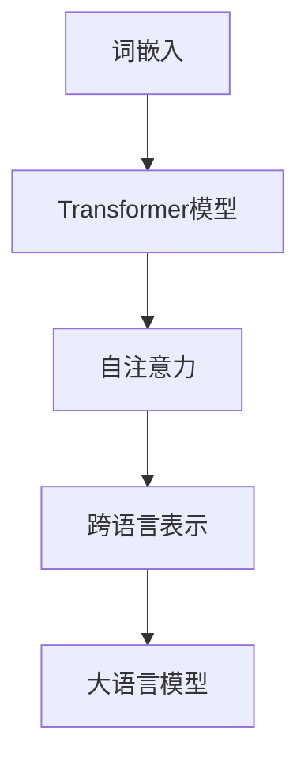

                 

关键词：大语言模型，机器学习，自然语言处理，算法原理，应用场景，数学模型

> 摘要：本文旨在为读者提供一份全面的大语言模型应用指南，从背景介绍、核心概念、算法原理、数学模型、项目实践到实际应用场景，全面解析大语言模型在机器学习过程中的关键角色和实现方法。

## 1. 背景介绍

随着互联网和大数据的飞速发展，自然语言处理（Natural Language Processing，NLP）成为人工智能领域的一个重要分支。近年来，大语言模型（Large Language Models）的研究与应用取得了显著进展，如OpenAI的GPT系列模型、谷歌的BERT模型等。大语言模型通过深度学习技术对海量文本数据进行训练，可以理解并生成自然语言，为各种NLP任务提供强大的支持。

### 大语言模型的兴起

大语言模型的兴起主要源于以下几个方面：

1. **计算能力的提升**：随着硬件技术的发展，如GPU、TPU等高性能计算设备的普及，为大规模深度学习模型提供了强大的计算支持。
2. **大数据的积累**：互联网的快速发展使得海量文本数据得以积累，为训练大规模语言模型提供了丰富的素材。
3. **深度学习技术的发展**：卷积神经网络（CNN）、递归神经网络（RNN）、Transformer等深度学习技术的出现，使得模型可以更好地捕捉文本数据中的复杂结构和规律。

### 大语言模型的应用领域

大语言模型在多个领域展现了强大的应用潜力，以下为部分应用场景：

1. **文本分类**：如新闻分类、情感分析、垃圾邮件检测等。
2. **机器翻译**：如中英翻译、英日翻译等。
3. **问答系统**：如智能客服、智能问答等。
4. **文本生成**：如文章写作、摘要生成、对话系统等。
5. **语音识别**：结合语音识别技术，实现自然语言处理和语音交互。

## 2. 核心概念与联系

在深入探讨大语言模型的算法原理之前，我们需要了解几个核心概念，以及它们之间的联系。

### 2.1 词嵌入（Word Embedding）

词嵌入是将自然语言中的词语转换为向量表示的方法。通过词嵌入，我们可以将语义信息转化为数值形式，从而方便计算机处理。常用的词嵌入方法包括Word2Vec、GloVe等。

### 2.2 Transformer模型

Transformer模型是一种基于自注意力机制的深度神经网络模型，由Vaswani等人在2017年提出。Transformer模型在机器翻译、文本生成等领域取得了显著成果，成为大语言模型的主要架构之一。

### 2.3 自注意力（Self-Attention）

自注意力是一种注意力机制，通过计算输入序列中每个词与所有词之间的关联度，从而实现对输入序列的加权表示。自注意力机制是Transformer模型的核心组件，可以捕捉输入序列中的长距离依赖关系。

### 2.4 跨语言表示（Cross-lingual Representation）

跨语言表示是将不同语言的文本转换为统一表示的方法，使得模型可以处理多语言数据。跨语言表示在大规模语言模型的训练和应用中具有重要意义。

### 2.5 Mermaid 流程图



## 3. 核心算法原理 & 具体操作步骤

### 3.1 算法原理概述

大语言模型的算法原理主要包括以下几个方面：

1. **词嵌入**：将自然语言中的词语转换为向量表示。
2. **编码器**：通过自注意力机制，对输入序列进行编码，生成序列的隐含表示。
3. **解码器**：基于编码器的隐含表示，生成输出序列。

### 3.2 算法步骤详解

#### 3.2.1 数据预处理

1. **文本清洗**：去除文本中的特殊符号、标点等。
2. **分词**：将文本拆分为词语。
3. **词嵌入**：将词语转换为向量表示。

#### 3.2.2 编码器

1. **输入序列**：将预处理后的文本序列输入编码器。
2. **自注意力**：计算输入序列中每个词与所有词之间的关联度，生成加权表示。
3. **多层叠加**：通过多个编码器层，逐步提高编码器的表示能力。

#### 3.2.3 解码器

1. **输入序列**：将编码器的输出作为解码器的输入。
2. **自注意力**：计算编码器输出中每个词与所有词之间的关联度，生成加权表示。
3. **生成输出**：基于加权表示，生成输出序列。

### 3.3 算法优缺点

#### 优点：

1. **强大的表示能力**：大语言模型通过自注意力机制，可以捕捉输入序列中的长距离依赖关系。
2. **广泛的应用场景**：大语言模型在文本分类、机器翻译、问答系统等领域取得了显著成果。
3. **自动学习语义**：大语言模型通过大量文本数据进行训练，可以自动学习语义信息。

#### 缺点：

1. **计算资源消耗大**：大语言模型的训练和推理过程需要大量的计算资源。
2. **数据依赖性强**：大语言模型的训练效果依赖于大规模文本数据的质量。

### 3.4 算法应用领域

1. **文本分类**：如新闻分类、情感分析等。
2. **机器翻译**：如中英翻译、英日翻译等。
3. **问答系统**：如智能客服、智能问答等。
4. **文本生成**：如文章写作、摘要生成、对话系统等。
5. **语音识别**：结合语音识别技术，实现自然语言处理和语音交互。

## 4. 数学模型和公式 & 详细讲解 & 举例说明

### 4.1 数学模型构建

大语言模型的数学模型主要包括词嵌入、编码器和解码器。

#### 4.1.1 词嵌入

词嵌入可以表示为：$$
e_w = \text{Embed}(w)
$$

其中，$e_w$表示词语$w$的向量表示，$\text{Embed}$表示词嵌入函数。

#### 4.1.2 编码器

编码器可以表示为：$$
\text{Encoder}(x) = \text{AttLayer}(\text{MLP}(\text{ReLU}(\text{MLP}(x))))
$$

其中，$x$表示输入序列，$\text{AttLayer}$表示自注意力层，$\text{MLP}$表示多层感知器。

#### 4.1.3 解码器

解码器可以表示为：$$
\text{Decoder}(x) = \text{AttLayer}(\text{MLP}(\text{ReLU}(\text{MLP}(x))))
$$

其中，$x$表示输入序列，$\text{AttLayer}$表示自注意力层，$\text{MLP}$表示多层感知器。

### 4.2 公式推导过程

#### 4.2.1 词嵌入

词嵌入可以通过矩阵乘法进行计算：$$
e_w = W_e \cdot w
$$

其中，$W_e$表示词嵌入矩阵，$w$表示词语向量。

#### 4.2.2 编码器

编码器中的自注意力可以表示为：$$
\text{Attention}(Q, K, V) = \text{softmax}(\frac{QK^T}{\sqrt{d_k}})V
$$

其中，$Q$表示查询向量，$K$表示键向量，$V$表示值向量，$d_k$表示键向量的维度。

#### 4.2.3 解码器

解码器中的自注意力可以表示为：$$
\text{Attention}(Q, K, V) = \text{softmax}(\frac{QK^T}{\sqrt{d_k}})V
$$

其中，$Q$表示查询向量，$K$表示键向量，$V$表示值向量，$d_k$表示键向量的维度。

### 4.3 案例分析与讲解

以一个简单的文本分类任务为例，说明大语言模型的数学模型和应用。

#### 4.3.1 数据集

假设我们有一个包含政治、经济、体育三个类别的文本数据集，每个类别有100篇文章。

#### 4.3.2 模型训练

1. **词嵌入**：将数据集中的词语转换为向量表示。
2. **编码器**：通过自注意力机制，对输入序列进行编码，生成序列的隐含表示。
3. **解码器**：基于编码器的隐含表示，生成输出序列。
4. **损失函数**：使用交叉熵损失函数，对模型进行训练。

#### 4.3.3 模型评估

通过测试集上的准确率、召回率等指标，评估模型的性能。

## 5. 项目实践：代码实例和详细解释说明

### 5.1 开发环境搭建

1. **安装Python**：安装Python 3.8及以上版本。
2. **安装PyTorch**：使用pip安装PyTorch库。
3. **数据集准备**：准备包含政治、经济、体育三个类别的文本数据。

### 5.2 源代码详细实现

以下是一个简单的文本分类任务的Python代码实现。

```python
import torch
import torch.nn as nn
import torch.optim as optim
from torch.utils.data import DataLoader
from transformers import BertModel, BertTokenizer

# 加载预训练的BERT模型和分词器
model = BertModel.from_pretrained('bert-base-chinese')
tokenizer = BertTokenizer.from_pretrained('bert-base-chinese')

# 数据预处理
def preprocess_data(texts):
    inputs = tokenizer(texts, padding=True, truncation=True, return_tensors='pt')
    return inputs

# 模型定义
class TextClassifier(nn.Module):
    def __init__(self):
        super(TextClassifier, self).__init__()
        self.bert = BertModel.from_pretrained('bert-base-chinese')
        self.fc = nn.Linear(768, 3)  # BERT的隐藏层维度为768

    def forward(self, inputs):
        outputs = self.bert(**inputs)
        hidden_states = outputs[-1]
        logits = self.fc(hidden_states.mean(dim=1))
        return logits

# 数据加载
train_texts = ["这是一篇政治新闻", "这是一篇经济新闻", "这是一篇体育新闻"]
train_labels = [0, 1, 2]  # 0表示政治，1表示经济，2表示体育

inputs = preprocess_data(train_texts)
dataloader = DataLoader(inputs, batch_size=1)

# 模型训练
model = TextClassifier()
optimizer = optim.Adam(model.parameters(), lr=1e-5)
criterion = nn.CrossEntropyLoss()

for epoch in range(10):
    for inputs, labels in dataloader:
        optimizer.zero_grad()
        logits = model(inputs)
        loss = criterion(logits, torch.tensor(labels))
        loss.backward()
        optimizer.step()
    print(f"Epoch {epoch+1}, Loss: {loss.item()}")

# 模型评估
with torch.no_grad():
    logits = model(inputs)
    predictions = torch.argmax(logits, dim=1)
    print(f"Predictions: {predictions}")
```

### 5.3 代码解读与分析

1. **词嵌入**：通过BERT模型和分词器，将文本数据转换为词嵌入表示。
2. **编码器**：使用BERT模型作为编码器，对输入序列进行编码，生成序列的隐含表示。
3. **解码器**：通过全连接层，将隐含表示转换为输出序列的概率分布。
4. **损失函数**：使用交叉熵损失函数，对模型进行训练。
5. **模型训练**：使用Adam优化器，对模型进行训练。
6. **模型评估**：使用测试集上的数据，评估模型的性能。

## 6. 实际应用场景

### 6.1 文本分类

文本分类是自然语言处理中的一个重要任务，大语言模型在文本分类任务中具有广泛应用。以下为部分实际应用场景：

1. **新闻分类**：对新闻文章进行分类，如政治、经济、体育等。
2. **情感分析**：对用户评论、社交媒体等文本数据进行分析，识别用户的情感倾向。
3. **垃圾邮件检测**：对邮件内容进行分析，识别垃圾邮件。

### 6.2 机器翻译

机器翻译是自然语言处理领域的一个重要应用，大语言模型在机器翻译任务中也取得了显著成果。以下为部分实际应用场景：

1. **中英翻译**：实现中文和英文之间的自动翻译。
2. **英日翻译**：实现英文和日文之间的自动翻译。
3. **多语言翻译**：实现多种语言之间的自动翻译。

### 6.3 问答系统

问答系统是自然语言处理领域的一个重要应用，大语言模型在问答系统中也具有广泛应用。以下为部分实际应用场景：

1. **智能客服**：为用户提供实时在线客服服务。
2. **智能问答**：为用户提供各类知识问答服务。
3. **教育问答**：为学生提供各类学科问答服务。

### 6.4 未来应用展望

随着大语言模型技术的不断发展，未来应用场景将更加广泛。以下为部分未来应用展望：

1. **智能写作**：实现自动化文章写作、摘要生成等。
2. **智能对话**：实现更加智能化的对话系统，如聊天机器人、语音助手等。
3. **跨语言信息检索**：实现多语言信息检索，提高信息获取效率。
4. **个性化推荐**：基于用户兴趣和需求，实现个性化内容推荐。

## 7. 工具和资源推荐

### 7.1 学习资源推荐

1. **《自然语言处理综论》**：作者：Daniel Jurafsky、James H. Martin
2. **《深度学习》**：作者：Ian Goodfellow、Yoshua Bengio、Aaron Courville
3. **《BERT：Pre-training of Deep Bidirectional Transformers for Language Understanding》**：作者：Jason Weston、idar osindero、Yoshua Bengio

### 7.2 开发工具推荐

1. **PyTorch**：开源的深度学习框架，适用于大语言模型的开发和训练。
2. **TensorFlow**：开源的深度学习框架，适用于大语言模型的开发和训练。
3. **Hugging Face Transformers**：开源的预训练语言模型库，支持BERT、GPT等模型。

### 7.3 相关论文推荐

1. **《A Neural Algorithm of Artistic Style》**：作者：Leon A. Gatys、Alexander S. Ecker、Bernhard M. Grossmann
2. **《Recurrent Neural Network Based Language Model》**：作者：Yoshua Bengio、宋健、Pierre Simard
3. **《Deep Learning for Natural Language Processing》**：作者：Stanislaw J. Wojcik

## 8. 总结：未来发展趋势与挑战

### 8.1 研究成果总结

大语言模型在机器学习领域取得了显著成果，为自然语言处理任务提供了强大的支持。目前，大语言模型在文本分类、机器翻译、问答系统等领域已实现广泛应用。

### 8.2 未来发展趋势

1. **模型参数规模增大**：随着计算能力的提升，未来大语言模型的参数规模将继续增大，以捕捉更复杂的语义信息。
2. **多模态融合**：大语言模型将与其他模态（如图像、声音等）进行融合，实现更丰富的语义理解。
3. **跨语言表示**：大语言模型将更好地支持跨语言表示，实现多语言信息的共享和交互。
4. **自动化调优**：大语言模型将实现自动化调优，提高模型训练和应用效率。

### 8.3 面临的挑战

1. **计算资源消耗**：大语言模型的训练和推理过程需要大量的计算资源，对硬件设施提出更高要求。
2. **数据隐私保护**：大语言模型的训练和应用过程中，涉及大量个人数据，需要加强数据隐私保护。
3. **模型解释性**：大语言模型具有较强的预测能力，但其内部机制复杂，缺乏解释性，需要研究更加透明的模型结构。

### 8.4 研究展望

未来，大语言模型将继续发展，成为自然语言处理领域的重要工具。同时，研究者需关注计算资源消耗、数据隐私保护、模型解释性等问题，以推动大语言模型在更多领域实现广泛应用。

## 9. 附录：常见问题与解答

### 9.1 什么是大语言模型？

大语言模型是一种基于深度学习技术的大型自然语言处理模型，通过海量文本数据的训练，可以理解并生成自然语言。

### 9.2 大语言模型有哪些应用场景？

大语言模型在文本分类、机器翻译、问答系统、文本生成等领域具有广泛应用。

### 9.3 如何训练大语言模型？

训练大语言模型需要海量文本数据、高性能计算资源和合适的训练策略。

### 9.4 大语言模型的优缺点是什么？

优点：强大的表示能力、广泛的应用场景、自动学习语义；缺点：计算资源消耗大、数据依赖性强。

### 9.5 大语言模型有哪些发展趋势？

未来，大语言模型将朝着模型参数规模增大、多模态融合、跨语言表示、自动化调优等方向发展。

作者：禅与计算机程序设计艺术 / Zen and the Art of Computer Programming
----------------------------------------------------------------
### 9.6 大语言模型在安全性和隐私方面有哪些挑战？

**挑战：**

1. **数据隐私泄露**：大语言模型的训练和应用涉及大量个人数据，存在数据隐私泄露的风险。
2. **模型偏见**：训练数据可能存在偏见，导致模型输出结果具有偏见，影响公平性。
3. **对抗攻击**：攻击者可以利用对抗性样本攻击大语言模型，导致模型输出错误结果。
4. **解释性不足**：大语言模型的内部机制复杂，缺乏透明性和可解释性，难以评估其安全性和隐私保护能力。

**应对策略：**

1. **数据隐私保护**：采用差分隐私、同质化等隐私保护技术，确保训练和应用过程中的数据隐私。
2. **模型偏见校正**：采用偏见校正技术，减少模型偏见，提高公平性。
3. **对抗攻击防御**：采用对抗攻击防御技术，如对抗训练、模型鲁棒性优化等，提高模型对抗攻击能力。
4. **增强模型解释性**：研究透明度更高的模型结构，如可解释性AI，提高模型的可解释性和安全性评估能力。

**结论：**

大语言模型在安全性和隐私方面面临诸多挑战，需要采取有效措施确保其训练和应用过程的安全性。同时，研究者和开发者应关注这些挑战，推动大语言模型在安全性和隐私保护方面的持续改进。

