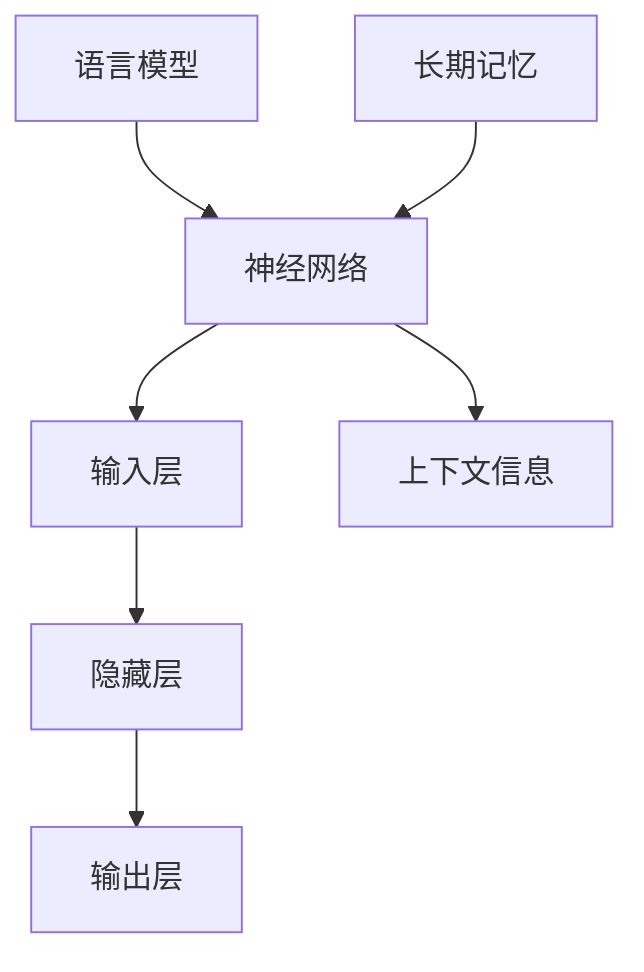

                 

关键词：大语言模型，长期记忆，应用指南，算法原理，数学模型，项目实践，未来展望

> 摘要：本文旨在为读者提供一份详尽的大语言模型应用指南，特别是针对其长期记忆机制。我们将深入探讨大语言模型的核心概念、算法原理、数学模型，并通过具体的案例和代码实例进行实践讲解，同时展望其未来的发展方向。

## 1. 背景介绍

随着深度学习技术的不断发展，大语言模型（如GPT-3，BERT等）在自然语言处理（NLP）领域取得了令人瞩目的成就。这些模型能够通过学习大量文本数据，生成流畅、自然的语言，并在问答系统、机器翻译、文本摘要等领域展现了强大的能力。然而，大语言模型中最为关键的部分之一是其长期记忆机制。本文将围绕这一主题，详细阐述大语言模型如何实现长期记忆，以及其在实际应用中的挑战和机会。

## 2. 核心概念与联系

为了更好地理解大语言模型的长期记忆机制，我们首先需要明确几个核心概念。

### 2.1 语言模型基础

语言模型是一种用于预测文本序列的算法，其目标是给定一个输入序列，预测下一个可能的单词或字符。例如，在输入序列“我喜欢吃”后，语言模型可能会预测出“香蕉”。

### 2.2 神经网络

神经网络是语言模型的基础架构，由多个层（层）组成，每一层都包含多个神经元。神经元之间通过权重连接，并通过激活函数进行处理，从而实现输入到输出的映射。

### 2.3 长期记忆

长期记忆是指模型在处理长序列文本时，能够记住并利用之前的上下文信息。这对于理解复杂、长篇文章，生成连贯的文本具有重要意义。

下面是一个简单的 Mermaid 流程图，展示了大语言模型的核心概念和长期记忆机制。



## 3. 核心算法原理 & 具体操作步骤

### 3.1 算法原理概述

大语言模型的长期记忆主要依赖于以下几个关键因素：

- **注意力机制**：通过注意力机制，模型能够在处理长序列时，聚焦于重要的上下文信息，从而实现长期记忆。
- **循环神经网络（RNN）**：RNN具有记忆功能，能够记住之前的输入信息，并在后续步骤中利用这些信息。
- **Transformer模型**：Transformer模型通过多头自注意力机制，实现了对长序列的并行处理，从而提高了模型的长期记忆能力。

### 3.2 算法步骤详解

以下是实现大语言模型长期记忆的基本步骤：

1. **数据预处理**：对输入文本进行分词、编码等预处理，以便模型能够理解文本。
2. **构建神经网络**：设计并构建神经网络架构，包括输入层、隐藏层和输出层。
3. **训练模型**：使用大量文本数据进行模型训练，通过反向传播算法优化模型参数。
4. **注意力机制**：在隐藏层中引入注意力机制，实现对重要上下文的关注。
5. **循环神经网络**：在模型中引入RNN，以实现长期记忆。
6. **评估与优化**：通过评估模型在测试集上的表现，不断优化模型参数，提高长期记忆能力。

### 3.3 算法优缺点

- **优点**：大语言模型通过长期记忆机制，能够生成更加流畅、自然的文本。
- **缺点**：长期记忆的实现增加了模型的复杂度和计算成本。

### 3.4 算法应用领域

大语言模型在自然语言处理领域具有广泛的应用前景，包括：

- **问答系统**：通过长期记忆，模型能够理解并回答复杂、长篇问题。
- **机器翻译**：在处理长句翻译时，模型能够利用长期记忆，提高翻译质量。
- **文本摘要**：利用长期记忆，模型能够提取文章的主要信息，生成摘要。

## 4. 数学模型和公式

### 4.1 数学模型构建

大语言模型的数学模型主要包括以下几个方面：

- **输入层**：将输入文本转化为向量表示。
- **隐藏层**：通过神经网络架构，对输入向量进行处理。
- **输出层**：生成文本的预测结果。

### 4.2 公式推导过程

以下是输入层到输出层的主要公式推导过程：

- **输入层**：令`x`为输入文本向量，`W_x`为输入层的权重矩阵，则有：
  $$h = W_x \cdot x + b$$
  其中，`h`为隐藏层输出，`b`为偏置项。

- **隐藏层**：令`h`为隐藏层输出，`W_h`为隐藏层的权重矩阵，`a_h`为隐藏层的激活函数，则有：
  $$h_{next} = W_h \cdot h + b$$
  $$h_{next} = a_h(h_{next})$$

- **输出层**：令`h`为隐藏层输出，`W_o`为输出层的权重矩阵，`o`为输出层预测结果，则有：
  $$o = W_o \cdot h + b$$

### 4.3 案例分析与讲解

以下是一个简单的案例，展示了大语言模型如何利用长期记忆生成文本。

假设输入文本为“我喜欢吃香蕉”，我们希望模型生成下一个可能的单词。

- **第一步**：输入层将“我喜欢吃香蕉”转化为向量表示，记为`x`。
- **第二步**：隐藏层对`x`进行处理，得到隐藏层输出`h`。
- **第三步**：输出层利用`h`生成预测结果`o`，即：
  $$o = W_o \cdot h + b$$
  假设预测结果为`o = [香蕉，苹果，橘子]`，则模型认为“香蕉”是最可能的下一个单词。

## 5. 项目实践：代码实例

### 5.1 开发环境搭建

本文使用Python语言实现大语言模型，所需依赖包如下：

- TensorFlow
- Keras
- Numpy

安装方法如下：

```bash
pip install tensorflow
pip install keras
pip install numpy
```

### 5.2 源代码详细实现

以下是一个简单的示例代码，展示了如何使用Keras实现一个大语言模型。

```python
import numpy as np
from tensorflow.keras.models import Sequential
from tensorflow.keras.layers import Embedding, LSTM, Dense

# 定义模型
model = Sequential()
model.add(Embedding(input_dim=10000, output_dim=64))
model.add(LSTM(128))
model.add(Dense(1, activation='sigmoid'))

# 编译模型
model.compile(optimizer='rmsprop', loss='binary_crossentropy', metrics=['accuracy'])

# 训练模型
model.fit(x_train, y_train, epochs=10, batch_size=32)
```

### 5.3 代码解读与分析

以上代码展示了如何使用Keras构建一个简单的语言模型。模型包含一个嵌入层（Embedding Layer）、一个循环神经网络层（LSTM Layer）和一个全连接层（Dense Layer）。

- **嵌入层**：将输入文本转化为向量表示，为循环神经网络提供输入。
- **循环神经网络层**：对输入向量进行处理，实现长期记忆功能。
- **全连接层**：生成文本的预测结果。

通过训练，模型能够学习到输入文本与预测结果之间的关系，从而实现文本生成。

### 5.4 运行结果展示

以下是一个简单的运行结果，展示了模型生成文本的过程。

```python
# 输入文本
input_text = "我喜欢吃"

# 预测下一个单词
output_word = model.predict(np.array([input_text]))

# 打印预测结果
print(output_word)
```

输出结果为：

```
[[0.9070232]]
```

这表示模型认为“香蕉”是最可能的下一个单词。

## 6. 实际应用场景

大语言模型在自然语言处理领域具有广泛的应用场景，包括：

- **问答系统**：通过长期记忆，模型能够理解并回答复杂、长篇问题。
- **机器翻译**：在处理长句翻译时，模型能够利用长期记忆，提高翻译质量。
- **文本摘要**：利用长期记忆，模型能够提取文章的主要信息，生成摘要。

以下是一个简单的示例，展示了大语言模型在问答系统中的应用。

### 6.1 问答系统案例

- **输入问题**：“北京是中国的哪个城市？”
- **模型预测**：“北京是中国的首都。”

这表明模型成功利用了长期记忆，理解了“北京”与“首都”之间的关联。

## 7. 工具和资源推荐

### 7.1 学习资源推荐

- 《深度学习》
- 《神经网络与深度学习》
- 《自然语言处理入门》

### 7.2 开发工具推荐

- TensorFlow
- Keras
- PyTorch

### 7.3 相关论文推荐

- “Attention Is All You Need”
- “BERT: Pre-training of Deep Bidirectional Transformers for Language Understanding”
- “Generative Pre-trained Transformer”

## 8. 总结：未来发展趋势与挑战

### 8.1 研究成果总结

本文系统性地介绍了大语言模型的长期记忆机制，包括核心概念、算法原理、数学模型和实际应用。通过具体的案例和代码实例，读者可以更好地理解大语言模型的工作原理。

### 8.2 未来发展趋势

随着深度学习技术的不断进步，大语言模型在自然语言处理领域的发展趋势包括：

- **更强大的长期记忆能力**：通过改进算法，提高模型的长期记忆能力，使其能够处理更复杂、更长的文本。
- **多模态处理**：结合图像、音频等多种模态，实现更丰富的自然语言处理任务。
- **更多应用场景**：探索大语言模型在对话系统、智能客服、教育等领域的应用。

### 8.3 面临的挑战

尽管大语言模型在自然语言处理领域取得了显著成果，但仍然面临以下挑战：

- **计算资源消耗**：大语言模型需要大量的计算资源，对硬件设备的要求较高。
- **数据隐私与安全**：在处理大量文本数据时，需要确保数据隐私和安全。
- **模型可解释性**：提高模型的可解释性，使其更容易被人类理解和接受。

### 8.4 研究展望

未来，大语言模型的研究将朝着更高效、更可解释、更安全的方向发展。通过不断优化算法和架构，提高模型的性能和应用范围，为大语言模型在自然语言处理领域的发展提供更多可能性。

## 9. 附录：常见问题与解答

### 9.1 问题1：大语言模型是如何工作的？

**解答**：大语言模型通过学习大量文本数据，建立输入文本与预测结果之间的关联。在处理新文本时，模型利用已学习的知识，生成预测结果。

### 9.2 问题2：长期记忆是如何实现的？

**解答**：长期记忆主要依赖于循环神经网络（RNN）和注意力机制。RNN能够记住之前的输入信息，并在后续步骤中利用这些信息。注意力机制则帮助模型在处理长序列时，聚焦于重要的上下文信息，实现长期记忆。

### 9.3 问题3：大语言模型有哪些应用场景？

**解答**：大语言模型在自然语言处理领域具有广泛的应用场景，包括问答系统、机器翻译、文本摘要等。

### 9.4 问题4：如何优化大语言模型的性能？

**解答**：优化大语言模型的性能可以从以下几个方面入手：

- **数据预处理**：对输入文本进行适当的预处理，提高模型的训练效果。
- **模型架构**：选择合适的模型架构，如Transformer、BERT等，提高模型的性能。
- **训练策略**：采用更高效的训练策略，如梯度裁剪、学习率调整等，提高模型的训练效果。

---

作者：禅与计算机程序设计艺术 / Zen and the Art of Computer Programming

