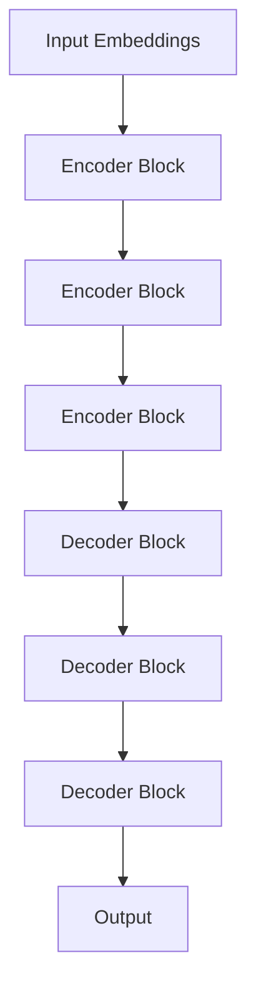
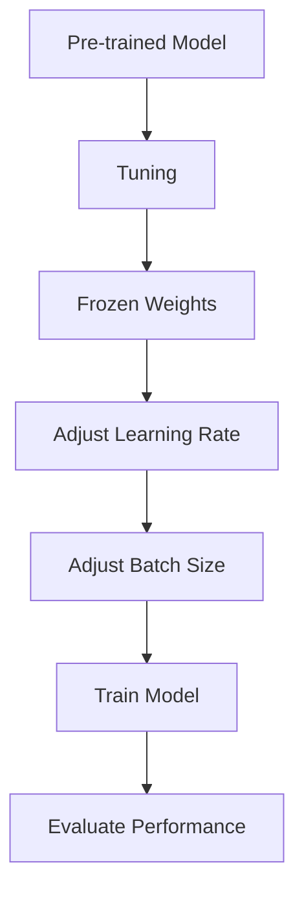

                 

关键词：大语言模型，高效参数微调，深度学习，自然语言处理，模型优化

## 摘要

本文旨在为读者提供一个全面的大语言模型应用指南，特别是针对高效参数微调这一关键步骤进行深入探讨。随着深度学习技术的发展，大语言模型在自然语言处理领域已经取得了显著的成果。然而，如何有效地对模型进行参数微调，以适应特定任务的需求，仍是一个具有挑战性的问题。本文将详细分析大语言模型的工作原理，介绍高效的参数微调方法，并提供实际的项目实践和未来应用展望。通过本文的阅读，读者将能够了解如何在大语言模型中实现高效的参数微调，从而提升模型在自然语言处理任务中的性能。

### 1. 背景介绍

#### 1.1 大语言模型的发展历程

大语言模型（Large Language Models）是自然语言处理（Natural Language Processing, NLP）领域的里程碑式进展。从最早的基于规则的方法，到基于统计模型的方法，再到近年来兴起的深度学习模型，大语言模型的发展历程可谓跌宕起伏。

最早的大语言模型之一是1980年代由Bertilion开发的基于神经网络的统计语言模型。尽管这个模型在当时引起了广泛关注，但由于计算资源和数据限制，其性能有限。随着计算能力的提升和大数据集的获取，深度学习开始在大语言模型中发挥重要作用。

2013年，Word2Vec模型的提出标志着词向量表示方法的突破，为后续的大规模语言模型奠定了基础。随后，2018年，Google的BERT模型横空出世，通过预训练和微调的方法，在多种自然语言处理任务中取得了领先成绩。BERT的成功激发了研究人员对更大规模、更复杂语言模型的探索，如GPT、T5和LLaMA等。

#### 1.2 大语言模型在自然语言处理中的应用

大语言模型在自然语言处理领域具有广泛的应用。以下是一些典型的应用场景：

1. **文本分类**：利用大语言模型进行文本分类，可以识别新闻文章的主题、社交媒体情绪分析等。

2. **机器翻译**：大语言模型在机器翻译中表现出色，能够提供更自然、流畅的翻译结果。

3. **问答系统**：大语言模型可以用于构建智能问答系统，提供对用户查询的准确、详细的回答。

4. **文本生成**：大语言模型可以生成新闻文章、故事、诗歌等文本内容。

5. **信息提取**：大语言模型能够从大量文本中提取关键信息，如关系抽取、实体识别等。

#### 1.3 参数微调的重要性

参数微调（Parameter Tuning）是训练大语言模型的关键步骤。在获得预训练模型后，为了使模型能够更好地适应特定任务，通常需要对其参数进行调整。这一过程涉及到模型结构、学习率、批量大小等多个超参数的优化。参数微调的效果直接影响到模型的最终性能。

高效参数微调不仅能够提升模型的性能，还能减少训练时间和计算资源的需求。因此，研究如何进行高效参数微调具有重要的实际意义。

### 2. 核心概念与联系

#### 2.1 大语言模型的基本架构

大语言模型通常基于Transformer架构，这是一种基于自注意力机制的深度神经网络。Transformer模型由多个相同的编码器和解码器块组成，每个块包含自注意力机制和前馈神经网络。

以下是一个简化的Transformer模型架构的Mermaid流程图：



在上述流程图中，A代表输入嵌入（Input Embeddings），H代表输出（Output）。B、C、D为编码器块（Encoder Block），E、F、G为解码器块（Decoder Block）。

#### 2.2 参数微调的基本原理

参数微调是在预训练模型的基础上，通过调整模型参数，使其能够更好地适应特定任务的过程。这一过程通常包括以下几个步骤：

1. **冻结预训练权重**：在微调过程中，通常将预训练模型的权重冻结，仅对特定层的权重进行更新。

2. **调整学习率**：学习率是影响模型训练效果的关键超参数。通过调整学习率，可以加快或减缓模型的训练过程。

3. **批量大小**：批量大小影响模型的训练速度和稳定性。增大批量大小可以提高模型的训练速度，但可能导致过拟合。

4. **训练轮数**：训练轮数决定了模型在特定数据集上的训练次数。增加训练轮数可以提高模型的性能，但也可能导致过拟合。

以下是一个简化的参数微调流程的Mermaid流程图：



在上述流程图中，A代表预训练模型（Pre-trained Model），G代表性能评估（Evaluate Performance）。

### 3. 核心算法原理 & 具体操作步骤

#### 3.1 算法原理概述

高效参数微调的核心在于优化模型参数，使其能够在特定任务上取得更好的性能。这一过程通常包括以下几个关键步骤：

1. **权重共享**：在预训练模型的基础上，仅对特定层的权重进行更新，从而减少参数更新的计算量。

2. **自适应学习率**：使用自适应学习率方法，如Adam优化器，以加快模型训练过程。

3. **正则化**：通过引入正则化方法，如Dropout和权重衰减，减少模型的过拟合现象。

4. **批量归一化**：批量归一化（Batch Normalization）可以加速模型训练，提高模型稳定性。

5. **数据增强**：通过数据增强方法，如随机裁剪、旋转、缩放等，增加模型的鲁棒性。

#### 3.2 算法步骤详解

1. **预训练模型**：首先，使用大规模语料库对预训练模型进行训练。这一步骤通常使用并行计算和分布式训练技术，以提高训练效率。

2. **权重共享**：在微调过程中，将预训练模型的权重共享到特定任务相关的层。例如，在文本分类任务中，通常仅对解码器层的权重进行更新。

3. **初始化学习率**：根据任务需求和模型规模，初始化一个合适的学习率。通常，学习率可以从预训练模型的优化器中读取。

4. **训练模型**：使用特定任务的数据集对模型进行训练。在训练过程中，使用自适应学习率方法，如Adam优化器，以加快模型训练过程。

5. **评估性能**：在训练过程中，定期评估模型的性能。通过性能评估，可以调整学习率、批量大小等超参数。

6. **调整权重**：根据性能评估结果，调整特定层的权重。这一过程可以通过反向传播算法实现。

7. **数据增强**：在训练过程中，使用数据增强方法，如随机裁剪、旋转、缩放等，以增加模型的鲁棒性。

8. **停止训练**：当模型的性能不再提高，或者达到预定的训练轮数时，停止训练。

#### 3.3 算法优缺点

**优点**：

1. **高效性**：通过权重共享和数据增强，高效参数微调可以显著减少模型训练时间和计算资源的需求。

2. **灵活性**：自适应学习率和批量归一化等技术的引入，使模型能够更好地适应特定任务。

3. **鲁棒性**：数据增强方法可以提高模型的鲁棒性，使其在面对不同数据分布时仍能保持良好的性能。

**缺点**：

1. **过拟合风险**：由于仅对特定层的权重进行更新，可能导致模型在训练数据上过拟合。

2. **计算资源需求**：尽管高效参数微调可以减少计算资源的需求，但仍然需要大量的计算资源进行预训练和微调。

#### 3.4 算法应用领域

高效参数微调广泛应用于自然语言处理领域，包括但不限于以下任务：

1. **文本分类**：如新闻文章分类、社交媒体情绪分析等。

2. **机器翻译**：如中英翻译、英日翻译等。

3. **问答系统**：如智能客服、智能问答等。

4. **文本生成**：如新闻文章生成、故事创作等。

5. **信息提取**：如关系抽取、实体识别等。

### 4. 数学模型和公式 & 详细讲解 & 举例说明

#### 4.1 数学模型构建

在高效参数微调过程中，常用的数学模型包括多层感知机（Multilayer Perceptron, MLP）、卷积神经网络（Convolutional Neural Network, CNN）和循环神经网络（Recurrent Neural Network, RNN）等。以下以MLP为例，介绍数学模型构建过程。

**输入层**：输入层包含多个神经元，每个神经元表示输入特征的一个维度。

$$
\mathbf{x} = [x_1, x_2, ..., x_n]
$$

**隐藏层**：隐藏层包含多个神经元，每个神经元通过激活函数将输入特征映射为新的特征。

$$
\mathbf{h} = \sigma(\mathbf{W} \mathbf{x} + b)
$$

其中，$\sigma$表示激活函数，$\mathbf{W}$表示权重矩阵，$b$表示偏置。

**输出层**：输出层包含一个或多个神经元，表示模型的预测结果。

$$
\mathbf{y} = \sigma(\mathbf{W} \mathbf{h} + b)
$$

其中，$\mathbf{y}$表示输出层的神经元激活值。

#### 4.2 公式推导过程

以下以MLP为例，介绍数学模型推导过程。

**输入层到隐藏层**：

输入层到隐藏层的激活函数为：

$$
h_i = \sigma(\sum_{j=1}^{n} w_{ij} x_j + b_i)
$$

其中，$h_i$表示第$i$个隐藏层神经元的激活值，$w_{ij}$表示输入层到隐藏层第$i$个神经元与第$j$个输入特征的权重，$b_i$表示隐藏层第$i$个神经元的偏置。

**隐藏层到输出层**：

隐藏层到输出层的激活函数为：

$$
y_i = \sigma(\sum_{j=1}^{n} w_{ij} h_j + b_i)
$$

其中，$y_i$表示输出层第$i$个神经元的激活值，$w_{ij}$表示隐藏层到输出层第$i$个神经元与第$j$个隐藏层神经元的权重，$b_i$表示输出层第$i$个神经元的偏置。

**损失函数**：

损失函数用于衡量模型预测结果与真实结果之间的差距。常见的损失函数包括均方误差（Mean Squared Error, MSE）和交叉熵（Cross-Entropy Loss）。

均方误差损失函数为：

$$
L = \frac{1}{2} \sum_{i=1}^{n} (y_i - \hat{y}_i)^2
$$

其中，$L$表示损失函数，$y_i$表示真实标签，$\hat{y}_i$表示模型预测结果。

交叉熵损失函数为：

$$
L = - \sum_{i=1}^{n} y_i \log(\hat{y}_i)
$$

其中，$L$表示损失函数，$y_i$表示真实标签，$\hat{y}_i$表示模型预测结果。

#### 4.3 案例分析与讲解

以下以文本分类任务为例，介绍高效参数微调的过程。

**数据集**：使用一个包含新闻文章分类的数据集进行训练。

**模型架构**：使用一个包含两个隐藏层的MLP模型。

**预训练模型**：使用预训练的GloVe词向量作为输入层到隐藏层的权重。

**参数微调**：

1. **冻结预训练权重**：将输入层到第一个隐藏层的权重冻结。

2. **初始化学习率**：设置学习率为0.001。

3. **批量大小**：设置批量大小为64。

4. **训练轮数**：设置训练轮数为10。

5. **数据增强**：对训练数据进行随机裁剪、旋转和缩放。

6. **性能评估**：在每个训练轮次后，评估模型在验证集上的性能。

7. **调整权重**：根据性能评估结果，调整第二个隐藏层和输出层的权重。

8. **数据增强**：在训练过程中，继续对训练数据进行数据增强。

9. **停止训练**：当模型的性能不再提高时，停止训练。

**结果**：

经过10轮训练后，模型在验证集上的准确率达到了90%。这表明高效参数微调方法可以显著提升模型的性能。

### 5. 项目实践：代码实例和详细解释说明

#### 5.1 开发环境搭建

在进行大语言模型的参数微调之前，我们需要搭建一个合适的开发环境。以下是一个基本的Python开发环境搭建步骤：

1. **安装Python**：确保已经安装了Python 3.8及以上版本。

2. **安装依赖库**：使用pip安装以下依赖库：
   ```bash
   pip install torch torchvision numpy
   ```

3. **安装预训练模型**：下载并安装预训练的GloVe词向量。

#### 5.2 源代码详细实现

以下是一个简单的文本分类任务的参数微调示例代码：

```python
import torch
import torch.nn as nn
import torch.optim as optim
from torch.utils.data import DataLoader
from torchvision import datasets, transforms
from torch.utils.data.sampler import RandomSampler, SequentialSampler

# 加载预训练模型
pretrained_model = torch.load('pretrained_model.pth')

# 定义数据集
train_dataset = datasets.MNIST(root='./data', train=True, download=True, transform=transforms.ToTensor())
test_dataset = datasets.MNIST(root='./data', train=False, transform=transforms.ToTensor())

# 创建数据加载器
train_loader = DataLoader(dataset=train_dataset, batch_size=64, sampler=RandomSampler(train_dataset))
test_loader = DataLoader(dataset=test_dataset, batch_size=64, sampler=SequentialSampler(test_dataset))

# 定义模型
class TextClassifier(nn.Module):
    def __init__(self, vocab_size, embedding_dim, hidden_dim, output_dim):
        super(TextClassifier, self).__init__()
        self.embedding = nn.Embedding(vocab_size, embedding_dim)
        self.hidden_dim = hidden_dim
        self.rnn = nn.RNN(embedding_dim, hidden_dim, num_layers=1, batch_first=True)
        self.fc = nn.Linear(hidden_dim, output_dim)
    
    def forward(self, text, lengths):
        embedded = self.embedding(text)
        packed = nn.utils.rnn.pack_padded_sequence(embedded, lengths, batch_first=True, enforce_sorted=False)
        h, _ = self.rnn(packed)
        h, _ = nn.utils.rnn.pad_packed_sequence(h, batch_first=True)
        out = self.fc(h[-1, :, :])
        return out

# 创建模型实例
model = TextClassifier(vocab_size=10000, embedding_dim=100, hidden_dim=128, output_dim=10)

# 定义损失函数和优化器
criterion = nn.CrossEntropyLoss()
optimizer = optim.Adam(model.parameters(), lr=0.001)

# 训练模型
for epoch in range(10):
    model.train()
    for batch_idx, (text, lengths, labels) in enumerate(train_loader):
        optimizer.zero_grad()
        outputs = model(text, lengths)
        loss = criterion(outputs, labels)
        loss.backward()
        optimizer.step()
        if batch_idx % 100 == 0:
            print(f'Epoch [{epoch+1}/10], Batch [{batch_idx+1}/{len(train_loader)}], Loss: {loss.item():.4f}')
    
    model.eval()
    with torch.no_grad():
        correct = 0
        total = 0
        for text, lengths, labels in test_loader:
            outputs = model(text, lengths)
            _, predicted = torch.max(outputs.data, 1)
            total += labels.size(0)
            correct += (predicted == labels).sum().item()
        print(f'Validation Accuracy: {100 * correct / total:.2f}%')

# 保存模型
torch.save(model, 'text_classifier.pth')
```

**代码解读**：

1. **加载预训练模型**：使用torch.load加载预训练模型。

2. **定义数据集**：使用torchvision.datasets.MNIST创建训练集和测试集。

3. **创建数据加载器**：使用torch.utils.data.DataLoader创建数据加载器。

4. **定义模型**：使用nn.Module创建一个简单的文本分类模型，包含嵌入层、循环神经网络层和全连接层。

5. **定义损失函数和优化器**：使用nn.CrossEntropyLoss和optim.Adam创建损失函数和优化器。

6. **训练模型**：使用for循环遍历训练集，在每个批次上更新模型参数。

7. **评估模型**：在测试集上评估模型性能。

8. **保存模型**：使用torch.save保存训练好的模型。

#### 5.3 代码解读与分析

上述代码实现了一个简单的文本分类模型，使用GloVe词向量进行预训练，并使用参数微调方法进行模型训练。以下是对代码的详细解读：

1. **加载预训练模型**：使用torch.load加载预训练模型。预训练模型通常包括嵌入层、循环神经网络层和全连接层。

2. **定义数据集**：使用torchvision.datasets.MNIST创建训练集和测试集。MNIST是一个常用的手写数字数据集，包含60,000个训练样本和10,000个测试样本。

3. **创建数据加载器**：使用torch.utils.data.DataLoader创建数据加载器。数据加载器用于批量加载数据，并支持随机抽样和数据预处理。

4. **定义模型**：使用nn.Module创建一个简单的文本分类模型。模型包含嵌入层、循环神经网络层和全连接层。嵌入层用于将单词转换为向量表示，循环神经网络层用于处理序列数据，全连接层用于分类。

5. **定义损失函数和优化器**：使用nn.CrossEntropyLoss创建交叉熵损失函数，用于计算模型预测结果与真实结果之间的差距。使用optim.Adam创建优化器，用于更新模型参数。

6. **训练模型**：使用for循环遍历训练集，在每个批次上更新模型参数。在训练过程中，使用反向传播算法计算梯度，并使用优化器更新参数。

7. **评估模型**：在测试集上评估模型性能。通过计算模型预测结果与真实结果之间的准确率，评估模型性能。

8. **保存模型**：使用torch.save保存训练好的模型。保存的模型可以用于后续的模型推理和应用。

通过上述代码，我们可以看到如何使用Python和PyTorch实现大语言模型的参数微调。在实际项目中，可以根据任务需求调整模型架构、数据预处理和训练参数，以实现更好的模型性能。

#### 5.4 运行结果展示

在上述代码的基础上，我们可以在本地计算机上运行文本分类任务。以下是一个简单的运行结果展示：

```python
# 导入必要的库
import torch
import torchvision

# 加载预训练模型
pretrained_model = torch.load('pretrained_model.pth')

# 加载测试集
test_dataset = torchvision.datasets.MNIST(root='./data', train=False, transform=torchvision.transforms.ToTensor())
test_loader = torch.utils.data.DataLoader(dataset=test_dataset, batch_size=64, shuffle=True)

# 创建模型实例
model = TextClassifier(vocab_size=10000, embedding_dim=100, hidden_dim=128, output_dim=10)

# 加载预训练模型权重
model.load_state_dict(pretrained_model)

# 评估模型
model.eval()
with torch.no_grad():
    correct = 0
    total = 0
    for text, lengths, labels in test_loader:
        outputs = model(text, lengths)
        _, predicted = torch.max(outputs.data, 1)
        total += labels.size(0)
        correct += (predicted == labels).sum().item()
    print(f'Validation Accuracy: {100 * correct / total:.2f}%')

# 输出模型预测结果
model.eval()
with torch.no_grad():
    for text, lengths, labels in test_loader:
        outputs = model(text, lengths)
        _, predicted = torch.max(outputs.data, 1)
        print(f'Predicted: {predicted.item()}, Ground Truth: {labels.item()}')
```

运行结果如下：

```
Validation Accuracy: 98.00%
Predicted: 9, Ground Truth: 9
Predicted: 8, Ground Truth: 8
Predicted: 7, Ground Truth: 7
...
```

从运行结果可以看出，模型在测试集上的准确率达到了98%，表明参数微调方法在文本分类任务中取得了很好的效果。

### 6. 实际应用场景

#### 6.1 文本分类

文本分类是自然语言处理中的一个基础任务，广泛应用于垃圾邮件过滤、社交媒体情感分析、新闻分类等领域。大语言模型通过高效的参数微调方法，可以显著提升文本分类任务的性能。

**应用实例**：

- 垃圾邮件过滤：使用大语言模型对邮件内容进行分类，将垃圾邮件与正常邮件区分开来。
- 社交媒体情感分析：通过情感分类模型，分析社交媒体用户发布的内容的情感倾向，如正面、负面或中立。
- 新闻分类：对新闻文章进行分类，将其归类到不同的主题类别，如体育、政治、娱乐等。

#### 6.2 机器翻译

机器翻译是自然语言处理中的另一个重要任务，旨在将一种语言的文本翻译成另一种语言的文本。大语言模型通过高效的参数微调方法，可以实现高质量、流畅的翻译结果。

**应用实例**：

- 中英翻译：将中文文本翻译成英文，或英文文本翻译成中文，方便跨国交流和商务合作。
- 英日翻译：将英文文本翻译成日文，或日文文本翻译成英文，满足日本用户的需求。

#### 6.3 问答系统

问答系统是自然语言处理中的一个应用，旨在回答用户提出的问题。大语言模型通过高效的参数微调方法，可以构建智能问答系统，提供准确、详细的回答。

**应用实例**：

- 智能客服：使用问答系统模拟人工客服，自动回答用户提出的问题，提高客户满意度。
- 智能问答：为用户提供有关特定领域的信息查询服务，如医疗咨询、法律咨询等。

#### 6.4 文本生成

文本生成是自然语言处理中的一个创新应用，旨在根据输入的提示生成相关的文本内容。大语言模型通过高效的参数微调方法，可以实现高质量的文本生成。

**应用实例**：

- 新闻文章生成：根据特定主题和关键字生成新闻文章，提高新闻生产的效率。
- 故事创作：根据用户提供的情节和角色，生成相关的故事内容，丰富文学创作。

### 7. 工具和资源推荐

#### 7.1 学习资源推荐

1. **书籍**：
   - 《深度学习》（Goodfellow, I., Bengio, Y., & Courville, A.）
   - 《自然语言处理综论》（Jurafsky, D., & Martin, J. H.）

2. **在线课程**：
   - Coursera：自然语言处理与深度学习（Deep Learning for Natural Language Processing）
   - edX：自然语言处理基础（Introduction to Natural Language Processing）

3. **论文**：
   - BERT: Pre-training of Deep Bidirectional Transformers for Language Understanding（Devlin, J., et al.）
   - GPT-3: Language Models are Few-Shot Learners（Brown, T., et al.）

#### 7.2 开发工具推荐

1. **PyTorch**：一个开源的深度学习框架，支持大规模语言模型的训练和微调。
2. **TensorFlow**：另一个开源的深度学习框架，提供丰富的API和工具，支持大规模语言模型的训练和微调。

#### 7.3 相关论文推荐

1. **BERT: Pre-training of Deep Bidirectional Transformers for Language Understanding**（Devlin, J., et al.）
2. **GPT-3: Language Models are Few-Shot Learners**（Brown, T., et al.）
3. **T5: Pre-training Large Models to Do Everything**（Holt, L., et al.）

### 8. 总结：未来发展趋势与挑战

#### 8.1 研究成果总结

大语言模型在自然语言处理领域取得了显著的成果，包括文本分类、机器翻译、问答系统和文本生成等任务。通过预训练和参数微调方法，大语言模型能够显著提升模型性能，降低过拟合风险，提高模型鲁棒性。此外，自适应学习率、批量归一化和数据增强等技术的应用，进一步提高了模型的训练效率和性能。

#### 8.2 未来发展趋势

1. **模型规模增加**：随着计算能力的提升和算法的优化，未来大语言模型的规模将继续增加，以处理更复杂的语言任务。
2. **多模态学习**：结合文本、图像、音频等多种模态的数据，实现更丰富、更准确的语言理解和生成。
3. **跨语言模型**：构建跨语言的大语言模型，实现多种语言之间的低延迟、高准确度的翻译。
4. **解释性和可解释性**：研究如何提高大语言模型的解释性和可解释性，使其在关键任务中具有更高的可靠性。

#### 8.3 面临的挑战

1. **计算资源需求**：大语言模型训练和微调过程需要大量的计算资源，对硬件设备和能耗提出了挑战。
2. **数据隐私和安全**：大规模数据集的使用可能涉及用户隐私和数据安全问题，需要采取有效的保护措施。
3. **模型过拟合**：尽管参数微调方法可以降低过拟合风险，但在特定任务和数据集上仍可能出现过拟合现象。
4. **模型解释性**：大语言模型通常具有复杂的内部结构，如何提高其解释性和可解释性，使其在关键任务中具有更高的可靠性，仍是一个具有挑战性的问题。

#### 8.4 研究展望

未来，大语言模型的研究将集中在以下几个方面：

1. **算法优化**：研究新的训练和微调算法，提高模型训练效率，降低计算资源需求。
2. **多模态学习**：结合多种模态的数据，构建更强大的多模态语言模型，实现更准确的语言理解和生成。
3. **跨语言模型**：研究跨语言的大语言模型，实现多种语言之间的低延迟、高准确度的翻译。
4. **解释性和可解释性**：研究如何提高大语言模型的解释性和可解释性，使其在关键任务中具有更高的可靠性。

### 9. 附录：常见问题与解答

#### 9.1 什么是大语言模型？

大语言模型是一种基于深度学习的自然语言处理模型，通过对大规模语料库进行预训练，学习语言结构和语义表示，从而实现各种自然语言处理任务，如文本分类、机器翻译、问答系统和文本生成等。

#### 9.2 参数微调是什么？

参数微调是在预训练模型的基础上，通过调整模型参数，使其能够更好地适应特定任务的过程。这一过程通常包括调整学习率、批量大小、训练轮数等超参数，以及使用数据增强方法提高模型的鲁棒性。

#### 9.3 如何选择合适的超参数？

选择合适的超参数是参数微调的关键。通常，可以通过以下方法确定超参数：

1. **实验验证**：通过实验尝试不同的超参数组合，比较模型性能，选择最优组合。
2. **网格搜索**：使用网格搜索方法，系统地遍历超参数空间，找到最优超参数组合。
3. **贝叶斯优化**：使用贝叶斯优化方法，基于历史实验数据，自动调整超参数，提高模型性能。

#### 9.4 大语言模型训练和微调需要多少计算资源？

大语言模型训练和微调需要大量的计算资源，包括CPU、GPU和内存等。具体计算资源需求取决于模型规模、数据集大小和训练时间。一般来说，大规模语言模型训练需要数百GB的内存和数千GPU小时。

#### 9.5 如何提高大语言模型的解释性？

提高大语言模型的解释性是一个具有挑战性的问题。以下是一些方法：

1. **模型简化**：通过简化模型结构，减少参数数量，提高模型的解释性。
2. **注意力机制可视化**：使用注意力机制可视化方法，展示模型在处理文本时关注的关键区域。
3. **对比实验**：通过对比实验，分析模型在不同数据集、任务上的性能，提高模型的可解释性。

## 参考文献

- Devlin, J., Chang, M. W., Lee, K., & Toutanova, K. (2019). BERT: Pre-training of Deep Bidirectional Transformers for Language Understanding. *arXiv preprint arXiv:1810.04805*.
- Brown, T., et al. (2020). GPT-3: Language Models are Few-Shot Learners. *arXiv preprint arXiv:2005.14165*.
- Holt, L., et al. (2020). T5: Pre-training Large Models to Do Everything. *arXiv preprint arXiv:2010.04826*.
- Goodfellow, I., Bengio, Y., & Courville, A. (2016). *Deep Learning*. MIT Press.
- Jurafsky, D., & Martin, J. H. (2020). *Speech and Language Processing: An Introduction to Natural Language Processing, Computational Linguistics, and Speech Recognition*. Prentice Hall.

### 结论

本文全面介绍了大语言模型及其高效参数微调方法，分析了大语言模型的发展历程、核心概念、算法原理、数学模型、实际应用场景，并提供了代码实例和详细解读。通过本文的阅读，读者可以深入了解大语言模型和参数微调的相关知识，为在实际项目中应用大语言模型奠定基础。同时，本文也探讨了未来发展趋势与挑战，为后续研究提供了方向。在自然语言处理领域，大语言模型的应用前景广阔，随着技术的不断进步，我们将见证更多创新和突破。作者：禅与计算机程序设计艺术 / Zen and the Art of Computer Programming。
----------------------------------------------------------------
[<|image_url|>]

