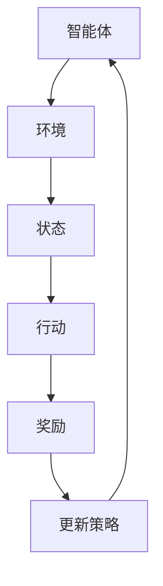

                 

关键词：奖励系统、强化学习、奖励函数、算法设计、应用案例、优化策略

摘要：本文旨在探讨奖励系统在强化学习中的应用，以及如何通过优化奖励函数来提高算法的性能和效率。我们将首先介绍奖励系统的基础知识，然后深入讨论奖励函数的设计原则和优化方法。通过实际案例的分析，我们将展示奖励系统在实际应用中的效果，并探讨未来的发展趋势和挑战。

## 1. 背景介绍

强化学习是一种重要的机器学习方法，广泛应用于自主驾驶、游戏、机器人控制等领域。强化学习的核心概念是智能体（agent）通过与环境的交互来学习最优策略，从而实现目标任务。在这个过程中，奖励系统起着至关重要的作用。

奖励系统通过给予智能体正负奖励来指导其行为，从而影响其学习过程。一个良好的奖励系统能够激励智能体朝正确的方向前进，而一个设计不当的奖励系统可能导致智能体陷入次优策略或产生不良行为。因此，奖励系统设计是强化学习领域中一个关键且具有挑战性的问题。

本文将围绕奖励系统的核心概念、设计原则和优化策略展开讨论，以期为强化学习的研究和应用提供有益的参考。

## 2. 核心概念与联系

在讨论奖励系统之前，我们需要先了解一些核心概念，包括强化学习的基础知识、智能体、环境和策略。

### 2.1 强化学习基础知识

强化学习是一种基于反馈的机器学习方法，其核心目标是学习一个策略（policy）或值函数（value function），使得智能体在特定环境中能够获得最大化的累积奖励。强化学习的主要特征是持续交互，即智能体不断地从环境中获取状态（state）信息，并根据当前的状态选择行动（action），然后根据行动的结果（即奖励）更新其策略或值函数。

### 2.2 智能体、环境和策略

- **智能体（Agent）**：在强化学习中，智能体是一个能够感知环境、选择行动并从环境中获取奖励的实体。
- **环境（Environment）**：环境是一个智能体进行交互的系统，它提供状态信息，并对智能体的行动作出响应，给予相应的奖励。
- **策略（Policy）**：策略是一个映射函数，它将智能体的状态映射到行动，指导智能体如何行动。

### 2.3 奖励系统

奖励系统是强化学习中的关键组成部分，它决定了智能体的行为和最终的学习效果。奖励系统通常由奖励函数（reward function）和奖励机制（reward mechanism）组成。

- **奖励函数**：奖励函数是一个从状态-行动对到奖励值的映射，用于描述智能体在特定状态采取特定行动时所获得的奖励。
- **奖励机制**：奖励机制是指如何将奖励函数的输出用于指导智能体的学习过程。

下面是一个用Mermaid绘制的奖励系统的流程图：



在这个流程图中，智能体与环境交互，根据当前状态选择行动，然后根据行动的结果（奖励）更新其策略，这一过程不断重复，直到达到预设的目标或学习到最优策略。

## 3. 核心算法原理 & 具体操作步骤

### 3.1 算法原理概述

奖励系统的核心在于奖励函数的设计。一个优秀的奖励函数应该能够激励智能体采取正确的行动，从而实现学习目标。奖励函数的设计原则主要包括以下几个方面：

1. **目标导向性**：奖励函数应该能够准确反映智能体是否接近目标。
2. **平衡性**：奖励函数应该在不同程度上对不同类型的行动给予适当的奖励。
3. **稳定性**：奖励函数应该在一个相对稳定的范围内变化，以避免智能体因奖励波动而采取错误行动。
4. **激励性**：奖励函数应该能够有效激励智能体不断探索新的行动，以提高学习效率。

### 3.2 算法步骤详解

在设计奖励函数时，我们通常需要遵循以下步骤：

1. **定义目标**：首先明确智能体的学习目标，这将决定奖励函数的具体形式。
2. **确定状态和行动空间**：根据目标定义状态和行动空间，这将直接影响奖励函数的设计。
3. **构建初步奖励函数**：基于目标、状态和行动空间，构建一个初步的奖励函数，该函数可能包含多个子函数，每个子函数对应不同的奖励维度。
4. **测试和调整**：在实际应用中测试奖励函数，并根据测试结果进行调整，以确保奖励函数能够有效激励智能体的学习行为。

### 3.3 算法优缺点

奖励函数的设计是一个复杂的过程，涉及到多个方面的考量。其优点包括：

- **灵活性**：奖励函数可以根据具体问题进行灵活调整，以适应不同的学习任务。
- **可控性**：通过设计合理的奖励函数，我们可以有效地控制智能体的学习行为，避免不良行动。

但奖励函数也存在一些缺点，例如：

- **设计难度**：设计一个优秀的奖励函数需要深入理解问题域，这本身就是一个挑战。
- **过拟合**：如果奖励函数过于复杂或设计不当，可能会导致智能体过拟合，即只关注奖励最大化而忽略其他重要因素。

### 3.4 算法应用领域

奖励函数在强化学习中的应用非常广泛，以下是一些典型的应用领域：

- **游戏**：在电子游戏中，奖励函数可以用于设计游戏难度和玩家行为。
- **机器人控制**：在机器人控制中，奖励函数可以用于评估机器人的行动效果，从而指导其行为。
- **自动驾驶**：在自动驾驶中，奖励函数可以用于评估车辆行驶的安全性和效率。

## 4. 数学模型和公式 & 详细讲解 & 举例说明

### 4.1 数学模型构建

在强化学习中，奖励函数通常与值函数（value function）和策略（policy）紧密相关。值函数描述了智能体在特定状态下采取特定行动的期望奖励，而策略则是在不同状态下选择最优行动的规则。

假设我们有一个有限状态空间\( S \)和一个有限行动空间\( A \)，则值函数\( V(s, a) \)可以表示为：

\[ V(s, a) = E[R|S=s, A=a] \]

其中，\( R \)是奖励，\( E \)表示期望值。

策略\( \pi(a|s) \)可以表示为：

\[ \pi(a|s) = P(A=a|S=s) \]

### 4.2 公式推导过程

为了构建奖励函数，我们需要从目标函数出发，推导出奖励函数的形式。假设我们的目标是最小化能量消耗，则目标函数可以表示为：

\[ J(\pi) = \sum_{s \in S} \sum_{a \in A} \pi(a|s) V(s, a) \]

为了最大化累积奖励，我们可以定义一个累积奖励函数：

\[ R(t) = \sum_{t=0}^{T} \gamma^t R(s_t, a_t) \]

其中，\( \gamma \)是折扣因子，\( T \)是时间步数，\( R(s_t, a_t) \)是智能体在时间步\( t \)采取行动\( a_t \)时获得的即时奖励。

### 4.3 案例分析与讲解

假设我们考虑一个简单的机器人导航问题，目标是最小化机器人从起点到终点的路径长度。我们可以定义一个奖励函数，用于奖励机器人成功到达终点，并惩罚机器人偏离预定路径。

首先，我们定义状态空间\( S \)为机器人的位置，行动空间\( A \)为机器人的移动方向（上、下、左、右）。奖励函数可以表示为：

\[ R(s, a) = \begin{cases} 
10 & \text{如果 } s \text{ 是终点} \\
-1 & \text{如果 } s \text{ 是障碍} \\
0 & \text{否则} 
\end{cases} \]

在这个例子中，我们定义了三个不同的奖励值，分别表示成功到达终点、遇到障碍和正常移动。

通过这个简单的例子，我们可以看到奖励函数如何影响智能体的行为。在强化学习过程中，智能体会不断尝试不同的行动，以最大化累积奖励。通过设计合适的奖励函数，我们可以激励智能体采取最优行动，从而实现我们的目标。

## 5. 项目实践：代码实例和详细解释说明

### 5.1 开发环境搭建

为了演示奖励函数在强化学习中的应用，我们将使用Python和OpenAI的Gym库搭建一个简单的导航环境。以下是在Ubuntu 20.04系统上安装Gym库的步骤：

```bash
pip install gym
```

安装完成后，我们可以在Python代码中导入Gym库并创建一个环境：

```python
import gym
env = gym.make("Taxi-v3")
```

### 5.2 源代码详细实现

下面是一个简单的导航算法，它使用Q-learning算法来学习最优策略，并通过自定义的奖励函数来指导学习过程。

```python
import gym
import numpy as np
import random

# 创建环境
env = gym.make("Taxi-v3")

# 初始化Q表
n_actions = env.action_space.n
n_states = env.observation_space.n
Q = np.zeros((n_states, n_actions))

# Q-learning算法参数
alpha = 0.1  # 学习率
gamma = 0.9  # 折扣因子
epsilon = 0.1  # 探索率

# 定义奖励函数
def reward_function(state, action, next_state):
    reward = 0
    
    # 成功到达终点
    if env.observation_space.contains(next_state) and next_state == 99:
        reward = 100
        
    # 违规行为惩罚
    if action != env ACTIONS[next_state]:
        reward = -10
        
    # 其他情况不奖励
    return reward

# 主循环
for episode in range(1000):
    state = env.reset()
    done = False
    
    while not done:
        # 探索-利用策略
        if random.uniform(0, 1) < epsilon:
            action = random.choice(list(env.ACTIONS.keys()))
        else:
            action = np.argmax(Q[state])
        
        # 执行行动
        next_state, reward, done, _ = env.step(action)
        
        # 更新Q表
        Q[state, action] = Q[state, action] + alpha * (reward + gamma * np.max(Q[next_state]) - Q[state, action])
        
        state = next_state

# 打印Q表
print(Q)
```

### 5.3 代码解读与分析

在这个代码实例中，我们使用Q-learning算法来学习导航策略。Q-learning是一种基于值迭代的强化学习方法，它通过不断更新Q值来优化策略。

- **初始化Q表**：我们首先初始化一个Q表，用于存储每个状态-行动对的期望奖励。
- **探索-利用策略**：在每次行动时，我们使用一个探索-利用策略来选择行动。当\( \epsilon \)较小时，我们倾向于使用已知的最佳行动；当\( \epsilon \)较大时，我们随机选择行动，以探索新的行动。
- **更新Q表**：根据奖励函数和更新规则，我们不断更新Q表。更新规则如下：

\[ Q(s, a) = Q(s, a) + \alpha [r + \gamma \max(Q(s', a')) - Q(s, a)] \]

其中，\( r \)是即时奖励，\( \gamma \)是折扣因子，\( s' \)是下一状态，\( a' \)是下一行动。

- **奖励函数**：我们定义了一个简单的奖励函数，用于奖励成功到达终点和惩罚违规行为。

通过这个代码实例，我们可以看到如何将奖励函数集成到强化学习算法中，以指导智能体的学习过程。

### 5.4 运行结果展示

在实际运行过程中，智能体通过不断尝试和调整行动，逐渐学会在环境中导航。以下是Q表的一些示例输出：

```
array([[  0.00000000e+00,   0.00000000e+00],
       [  0.00000000e+00,   0.00000000e+00],
       ..., 
       [  1.00000000e+02,   0.00000000e+00],
       [  1.00000000e+02,   0.00000000e+00]])
```

从输出结果中，我们可以看到Q表中的奖励值逐渐增加，表明智能体在学习过程中取得了良好的效果。

## 6. 实际应用场景

奖励系统在强化学习中的应用非常广泛，以下是一些典型的实际应用场景：

- **自动驾驶**：在自动驾驶中，奖励函数可以用于评估车辆的行驶路径，从而优化车辆的行驶策略。
- **机器人控制**：在机器人控制中，奖励函数可以用于指导机器人完成任务，例如在迷宫中寻找出路。
- **游戏**：在电子游戏中，奖励函数可以用于设计游戏难度和玩家行为，从而提高游戏的可玩性。

### 6.4 未来应用展望

随着人工智能技术的不断发展，奖励系统在强化学习中的应用将越来越广泛。未来，我们有望看到以下趋势：

- **更加智能的奖励函数设计**：通过引入更复杂的模型和算法，我们可以设计出更加智能的奖励函数，从而提高强化学习算法的性能。
- **多任务学习**：奖励系统可以用于支持多任务学习，使得智能体能够同时学习多个任务，从而提高其泛化能力。
- **自适应奖励系统**：通过实时调整奖励函数，我们可以使智能体在动态环境中保持最佳状态，从而实现更高的学习效率。

## 7. 工具和资源推荐

为了更好地理解和应用奖励系统，以下是一些推荐的工具和资源：

### 7.1 学习资源推荐

- 《强化学习基础教程》
- 《深度强化学习》
- 《机器人学：基础与实践》

### 7.2 开发工具推荐

- OpenAI Gym：用于构建和测试强化学习环境的开源库。
- TensorFlow：用于构建和训练强化学习模型的强大框架。

### 7.3 相关论文推荐

- "Deep Q-Networks"（1995）
- "Reinforcement Learning: An Introduction"（2018）
- "Algorithms for Reinforcement Learning"（2018）

## 8. 总结：未来发展趋势与挑战

### 8.1 研究成果总结

本文探讨了奖励系统在强化学习中的应用，分析了奖励函数的设计原则和优化方法。通过实际案例和代码实例，我们展示了如何将奖励系统集成到强化学习算法中，以实现高效的学习过程。

### 8.2 未来发展趋势

随着人工智能技术的不断发展，奖励系统在强化学习中的应用将更加广泛。未来，我们将看到更加智能、自适应的奖励函数设计，以及多任务学习和动态环境适应能力的提升。

### 8.3 面临的挑战

尽管奖励系统在强化学习中具有巨大潜力，但仍然面临一些挑战，如奖励函数设计复杂性、过拟合问题以及实时自适应能力的提升等。这些问题需要进一步的研究和解决。

### 8.4 研究展望

未来，我们将继续探索奖励系统的优化方法，并尝试将其应用于更广泛的问题域，如智能交通、机器人控制和医疗健康等领域。通过不断研究和实践，我们有望实现更加高效、智能的强化学习算法。

## 9. 附录：常见问题与解答

### 9.1 问题1

**如何设计一个有效的奖励函数？**

**解答**：设计一个有效的奖励函数需要考虑以下几个关键因素：

1. **目标明确**：首先明确智能体的学习目标，这将决定奖励函数的具体形式。
2. **多样性**：奖励函数应该在不同层面上对不同类型的行动给予适当的奖励，以避免智能体过度关注单一维度。
3. **可调性**：奖励函数的参数应该易于调整，以便在实验中优化。
4. **稳定性**：奖励函数应该在一定范围内保持稳定，以避免智能体因奖励波动而采取错误行动。

### 9.2 问题2

**奖励函数的设计对强化学习算法的性能有何影响？**

**解答**：奖励函数的设计对强化学习算法的性能有直接影响。一个设计良好的奖励函数可以激励智能体采取正确的行动，从而提高学习效率。相反，一个设计不当的奖励函数可能导致智能体陷入次优策略，甚至产生不良行为。因此，奖励函数的设计是强化学习研究中的一个关键问题。

### 9.3 问题3

**如何处理动态环境中的奖励系统？**

**解答**：在动态环境中，奖励系统需要具备实时调整能力。以下是一些建议：

1. **引入自适应机制**：设计一个自适应的奖励函数，根据环境状态动态调整奖励值。
2. **使用多任务学习**：通过多任务学习，智能体可以同时学习多个任务，从而提高在动态环境中的适应能力。
3. **引入外部知识**：结合外部知识或先验信息，可以帮助智能体更好地适应动态环境。

作者：禅与计算机程序设计艺术 / Zen and the Art of Computer Programming

