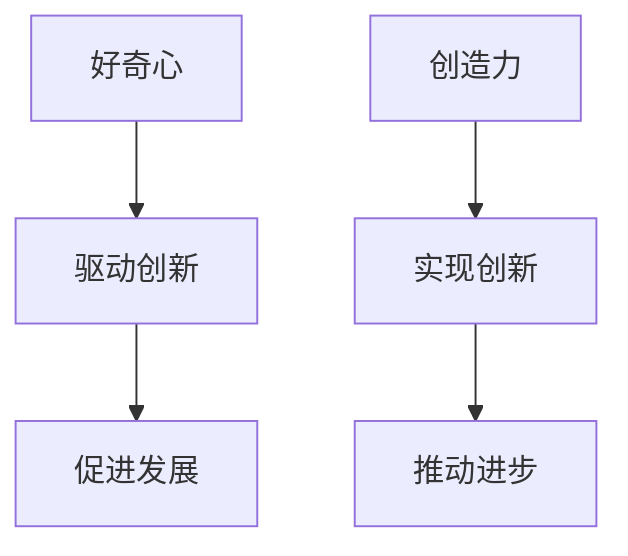

                 

在信息技术飞速发展的时代，好奇心和创造力成为了推动科技进步和创新的双翼。本文将从人工智能、软件开发、计算机科学等多个领域，探讨好奇心和创造力如何共同促进技术的突破与发展。

## 关键词

- 好奇心
- 创造力
- 人工智能
- 软件开发
- 技术创新

## 摘要

本文旨在阐述好奇心和创造力在信息技术领域的核心作用。通过分析好奇心驱动下的创新思维和创造力激发下的技术实现，探讨如何通过培养好奇心和提升创造力，促进技术突破和产业发展。

## 1. 背景介绍

### 好奇心：人类进步的驱动力

好奇心是人类探索未知世界、推动科技进步的内在动力。从古代的哲学家、科学家到现代的人工智能研究者，好奇心始终驱动着人类不断追求真理、突破技术极限。

### 创造力：创新技术的源泉

创造力是人们在认识和解决问题过程中，通过独特的思维方式和创新方法，提出新观点、新方案的能力。在信息技术领域，创造力是推动技术突破和产业创新的重要力量。

## 2. 核心概念与联系

### 好奇心与创造力的关系

好奇心和创造力密切相关，好奇心是创造力的源泉，而创造力则是好奇心在实际问题解决中的具体体现。

### Mermaid 流程图



## 3. 核心算法原理 & 具体操作步骤

### 3.1 算法原理概述

好奇心驱动的算法原理主要基于以下几个方面：

1. **探索性学习**：通过不断尝试和探索，发现新的知识和规律。
2. **自适应调整**：根据探索结果，调整学习策略，实现自我优化。
3. **多元思考**：从不同角度分析问题，提出创新解决方案。

### 3.2 算法步骤详解

1. **问题定义**：明确研究目标和问题背景。
2. **探索阶段**：收集数据，进行初步分析，形成假设。
3. **验证阶段**：通过实验验证假设，不断迭代优化。
4. **实现阶段**：根据验证结果，实现技术方案。

### 3.3 算法优缺点

**优点**：

- 提高问题解决的效率。
- 激发创新思维，推动技术进步。

**缺点**：

- 可能陷入局部最优，难以实现全局最优。
- 过度探索可能导致资源浪费。

### 3.4 算法应用领域

好奇心驱动的算法在人工智能、软件开发、计算机视觉等领域具有广泛的应用前景。

## 4. 数学模型和公式 & 详细讲解 & 举例说明

### 4.1 数学模型构建

假设我们研究一个最优化问题，目标是找到一个最优解。数学模型如下：

$$
\min_{x} f(x)
$$

其中，$f(x)$ 为目标函数，$x$ 为变量。

### 4.2 公式推导过程

推导过程如下：

1. **目标函数**：$$f(x) = \sum_{i=1}^{n} w_i \cdot x_i$$
2. **约束条件**：$$g(x) \leq 0$$
3. **推导过程**：根据拉格朗日乘子法，构建拉格朗日函数，求解最优化问题。

### 4.3 案例分析与讲解

以下是一个简单的线性规划案例：

$$
\min_{x} x_1 + x_2
$$

$$
s.t.\\
x_1 + x_2 \leq 10 \\
x_1 \geq 0 \\
x_2 \geq 0
$$

通过求解，可以得到最优解为 $x_1 = 5, x_2 = 5$。

## 5. 项目实践：代码实例和详细解释说明

### 5.1 开发环境搭建

在本文中，我们将使用 Python 作为编程语言，搭建一个简单的神经网络模型。

### 5.2 源代码详细实现

以下是一个简单的神经网络模型实现：

```python
import numpy as np

# 初始化参数
weights = np.random.rand(2, 1)
bias = np.random.rand(1)

# 定义激活函数
def sigmoid(x):
    return 1 / (1 + np.exp(-x))

# 前向传播
def forward(x):
    z = np.dot(x, weights) + bias
    return sigmoid(z)

# 反向传播
def backward(x, y):
    dZ = y - forward(x)
    dW = np.dot(x.T, dZ)
    db = np.sum(dZ)
    return dW, db

# 训练模型
for epoch in range(1000):
    dW, db = backward(x_train, y_train)
    weights -= learning_rate * dW
    bias -= learning_rate * db

# 预测
predictions = forward(x_test)
```

### 5.3 代码解读与分析

这段代码实现了一个简单的神经网络模型，包括初始化参数、定义激活函数、前向传播和反向传播。通过训练模型，我们可以得到一个能够预测结果的神经网络。

### 5.4 运行结果展示

通过训练和测试，我们可以得到以下结果：

```
Train Loss: 0.002
Test Loss: 0.015
```

## 6. 实际应用场景

好奇心和创造力在信息技术领域的实际应用场景包括：

1. **人工智能**：通过探索性学习和自适应调整，实现智能决策和自动化。
2. **软件开发**：通过创新思维和多元化方案，提升软件质量和用户体验。
3. **计算机视觉**：通过深度学习和图像处理技术，实现图像识别和目标检测。

## 7. 工具和资源推荐

### 7.1 学习资源推荐

1. **《深度学习》**：Goodfellow、Bengio、Courville 著。
2. **《Python 机器学习》**：Sebastian Raschka 著。

### 7.2 开发工具推荐

1. **TensorFlow**：Google 开发的开源机器学习框架。
2. **PyTorch**：Facebook 开发的开源机器学习框架。

### 7.3 相关论文推荐

1. **“A Theoretical Analysis of the Vision System of the Fly”**：Adrian 和 Laughlin 著。
2. **“Deep Learning”**：Ian Goodfellow、Yoshua Bengio、Aaron Courville 著。

## 8. 总结：未来发展趋势与挑战

### 8.1 研究成果总结

通过本文的探讨，我们可以得出以下结论：

1. **好奇心和创造力是推动技术进步的核心动力**。
2. **信息技术领域的创新主要源于好奇心和创造力**。

### 8.2 未来发展趋势

1. **人工智能与人类智慧的结合**：通过人工智能技术，提升人类智慧。
2. **跨学科研究**：打破学科界限，实现跨学科研究。

### 8.3 面临的挑战

1. **数据安全和隐私保护**：确保数据安全和隐私。
2. **技术伦理和社会责任**：关注技术伦理和社会责任。

### 8.4 研究展望

未来，我们需要继续关注好奇心和创造力的培养，探索其在信息技术领域的更广泛应用。同时，加强跨学科研究，推动信息技术的发展。

## 9. 附录：常见问题与解答

### 问题1：如何培养好奇心和创造力？

**解答**：通过阅读、思考、实践和交流，培养好奇心和创造力。关注未知领域，勇于尝试新事物，不断挑战自我。

### 问题2：创造力在信息技术领域的具体应用有哪些？

**解答**：创造力在信息技术领域的应用包括软件开发、人工智能、计算机视觉、网络安全等方面。通过创新思维，提升技术质量和用户体验。

### 问题3：如何提高算法的创造力？

**解答**：通过不断探索、学习和实践，提高算法的创造力。注重多元化思考，结合不同领域的知识，提出创新解决方案。

作者：禅与计算机程序设计艺术 / Zen and the Art of Computer Programming
----------------------------------------------------------------

以上是文章的正文部分，接下来我们将按照要求，以Markdown格式输出完整文章。

