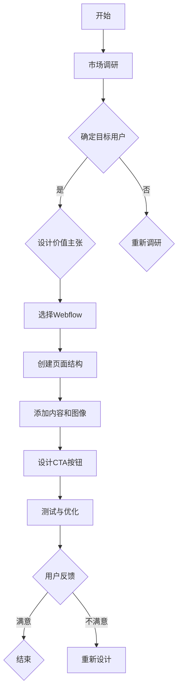

                 

关键词：Webflow、创业落地页、设计、转化率、用户体验、前端开发、交互设计、营销策略

> 摘要：本文将探讨如何利用Webflow这个强大的前端开发工具，设计出高转化率的创业落地页。我们将深入分析Webflow的设计原理，提供一系列实用的操作步骤，并分享一些成功的案例分析，帮助读者打造出既美观又高效的创业落地页。

## 1. 背景介绍

创业落地页，也被称为“销售页”或“引导页”，是专门为某一营销活动或产品发布而创建的单页网站。它们通常包含引人注目的图像、简洁明了的文字、有力的号召性用语（CTA）以及清晰的价值主张。创业落地页的主要目标是引导访问者采取特定行动，如注册、订阅、购买等，从而实现商业转化。

Webflow是一款功能强大的前端设计工具，允许用户通过可视化的界面进行网站设计，无需编写代码。Webflow提供了丰富的组件和布局，使得设计出专业级的网站变得更加简单和高效。随着创业公司对用户体验和设计质量的重视，Webflow成为了许多创业者的首选工具。

本文将分为以下几个部分：

1. 背景介绍：简要介绍创业落地页和Webflow的基本概念。
2. 核心概念与联系：详细解释设计高转化率落地页的关键概念，并提供Mermaid流程图。
3. 核心算法原理与操作步骤：探讨设计高转化率落地页的算法原理和具体步骤。
4. 数学模型与公式：介绍与落地页设计相关的数学模型和公式。
5. 项目实践：提供一个具体的代码实例，展示如何使用Webflow实现落地页设计。
6. 实际应用场景：分析落地页在不同行业的应用场景。
7. 工具和资源推荐：推荐相关的学习资源、开发工具和论文。
8. 总结：总结研究成果，展望未来发展趋势。

## 2. 核心概念与联系

### 2.1 设计原则

设计高转化率的创业落地页，需要遵循以下几个核心原则：

- **清晰的价值主张**：明确传达产品的独特卖点，让访问者快速理解。
- **简洁的布局**：避免杂乱无章，确保页面布局清晰、易于导航。
- **引人注目的图像**：使用高质量的图像吸引用户的注意力。
- **有效的号召性用语（CTA）**：提供明确的行动指引，鼓励用户采取行动。

### 2.2 用户行为分析

理解用户行为对于设计高转化率的落地页至关重要。以下是一些关键的用户行为分析：

- **用户访问路径**：通过分析用户在页面上的点击和滑动行为，优化页面的布局和导航。
- **用户停留时间**：监测用户在页面上的停留时间，判断页面的吸引力。
- **转化率**：跟踪用户采取特定行动（如注册、购买）的比例，评估页面的效果。

### 2.3 Mermaid流程图

以下是设计高转化率落地页的Mermaid流程图，展示关键步骤和概念之间的关系。



### 2.4 落地页设计的关键环节

- **页面结构**：确定页面的基本框架，包括头部、导航栏、主要内容区域、CTA按钮和底部。
- **内容创作**：撰写吸引人的文案，确保内容简洁明了，重点突出。
- **图像选择**：选择高质量的图像，与文案和品牌形象保持一致。
- **用户体验**：确保页面加载速度快，导航流畅，适应不同设备和屏幕尺寸。
- **测试与优化**：通过A/B测试等手段，不断优化页面设计，提高转化率。

## 3. 核心算法原理与操作步骤

### 3.1 算法原理概述

设计高转化率的创业落地页，关键在于理解和应用用户体验（UX）设计原则。以下是一些核心算法原理：

- **目标导向设计**：设计时始终围绕用户的目标和需求，确保页面功能与用户的期望相符。
- **信息架构**：构建清晰的页面结构，使用户能够轻松找到他们需要的信息。
- **视觉层次**：通过视觉元素（如颜色、字体、大小、对比度）引导用户注意力，突出关键信息。
- **互动设计**：提供直观的交互体验，使用户能够轻松完成目标操作。

### 3.2 算法步骤详解

#### 3.2.1 市场调研

1. **确定目标市场**：明确目标用户群体，了解他们的需求和痛点。
2. **竞品分析**：分析竞争对手的落地页设计，找出优缺点。
3. **用户访谈**：通过访谈获取目标用户的反馈，了解他们的期望和偏好。

#### 3.2.2 设计价值主张

1. **提炼核心卖点**：从产品或服务中提炼出最吸引人的卖点。
2. **创作简洁文案**：用简洁、有力的语言表达价值主张，避免冗长和复杂。
3. **视觉化表达**：使用图像、图标等视觉元素强化文案的传达效果。

#### 3.2.3 选择Webflow

1. **了解Webflow特性**：研究Webflow的功能和优势，确定它是否满足项目需求。
2. **创建账户**：注册Webflow账户，并熟悉其用户界面和操作流程。
3. **选择模板**：从Webflow的模板库中选择一个合适的落地页模板。

#### 3.2.4 创建页面结构

1. **设计布局**：根据市场调研结果，设计页面的布局。
2. **构建页面组件**：使用Webflow的组件库构建页面各个部分，如头部、导航栏、主要内容区域等。
3. **设置响应式布局**：确保页面在不同设备和屏幕尺寸上都能良好显示。

#### 3.2.5 添加内容和图像

1. **撰写文案**：根据设计价值主张，撰写吸引人的文案。
2. **选择图像**：挑选高质量的图像，与文案和品牌形象保持一致。
3. **优化图像**：确保图像在网页上加载速度快，不影响页面性能。

#### 3.2.6 设计CTA按钮

1. **确定CTA目标**：明确用户需要采取的行动，如注册、购买或订阅。
2. **设计按钮**：使用大号、颜色鲜艳的按钮，并确保按钮与页面的整体设计协调。
3. **优化按钮文案**：用简洁、有力的语言表达CTA，引导用户点击。

#### 3.2.7 测试与优化

1. **A/B测试**：对不同的设计元素进行A/B测试，找出最优方案。
2. **用户反馈**：收集用户对页面的反馈，持续优化设计。
3. **数据分析**：使用Webflow的分析工具，监测页面的流量、转化率和用户行为。

### 3.3 算法优缺点

#### 优点：

- **高效性**：Webflow提供了可视化界面，大大缩短了网站开发时间。
- **灵活性**：Webflow的组件和布局库提供了丰富的选择，满足不同设计需求。
- **适应性**：Webflow支持响应式设计，确保网站在不同设备和屏幕尺寸上都能良好显示。

#### 缺点：

- **学习曲线**：对于新手来说，Webflow的学习曲线相对较陡峭。
- **定制限制**：虽然Webflow提供了丰富的组件，但某些高级定制功能可能需要编写代码。

### 3.4 算法应用领域

- **创业公司**：创业公司通常需要快速创建和迭代网站，Webflow提供了高效、灵活的解决方案。
- **营销活动**：用于推广特定产品或服务的营销活动，Webflow可以帮助快速设计出专业的落地页。
- **个人品牌**：个人品牌建立者可以利用Webflow创建专业的个人网站和作品展示页。

## 4. 数学模型和公式

### 4.1 数学模型构建

设计高转化率的落地页，可以借助以下数学模型进行优化：

- **转化率模型**：R = C / A，其中R是转化率，C是成功转化的次数，A是页面访问次数。
- **用户体验模型**：UX = f(U，D，E)，其中UX是用户体验，U是用户满意度，D是设计质量，E是预期满足度。

### 4.2 公式推导过程

#### 转化率模型推导

1. 转化率（R）是成功转化的次数（C）与页面访问次数（A）的比值。
2. 成功转化的次数（C）取决于用户是否采取预定行动，如注册或购买。
3. 页面访问次数（A）是用户访问落地页的总次数。

#### 用户体验模型推导

1. 用户体验（UX）取决于用户满意度（U）、设计质量（D）和预期满足度（E）。
2. 用户满意度（U）与用户对产品的认可程度和功能体验相关。
3. 设计质量（D）与页面的布局、视觉设计、交互设计等要素相关。
4. 预期满足度（E）与用户对产品的期望和实际体验之间的差距相关。

### 4.3 案例分析与讲解

#### 案例一：提高转化率

假设一家创业公司希望通过设计一个专业的落地页来提高产品注册量。以下是数学模型的应用：

1. **目标设定**：设定一个30天内的注册量目标。
2. **初始数据**：记录页面的日均访问量和成功转化的次数。
3. **转化率模型**：通过分析转化率，找出当前设计的瓶颈。
4. **优化方案**：根据用户反馈和数据分析，对页面设计进行优化。
5. **重新评估**：在优化后，重新计算转化率，评估优化效果。

#### 案例二：提升用户体验

假设一家电商公司希望通过改进落地页的设计来提升用户体验。以下是用户体验模型的运用：

1. **用户满意度调查**：通过问卷调查或用户访谈，了解用户对当前页面的满意度。
2. **设计质量评估**：分析页面的布局、视觉设计和交互设计，找出改进点。
3. **预期满足度分析**：了解用户对产品的期望，评估实际体验与期望之间的差距。
4. **优化方案**：根据评估结果，制定优化方案，包括文案、图像和交互设计。
5. **用户体验测试**：邀请一组用户进行测试，收集反馈，持续优化。

## 5. 项目实践：代码实例和详细解释说明

### 5.1 开发环境搭建

在开始使用Webflow之前，首先需要在Webflow官网（https://webflow.com/）上注册一个账户，并选择一个合适的付费计划。Webflow提供了免费试用期，方便用户熟悉其功能。

### 5.2 源代码详细实现

以下是一个使用Webflow创建的创业落地页的源代码示例：

```html
<!DOCTYPE html>
<html lang="en">
<head>
    <meta charset="UTF-8">
    <meta name="viewport" content="width=device-width, initial-scale=1.0">
    <title>创业落地页示例</title>
    <link rel="stylesheet" href="styles.css">
</head>
<body>
    <header class="header">
        <nav class="nav">
            <a href="#" class="logo">Logo</a>
            <ul class="nav-list">
                <li><a href="#">产品介绍</a></li>
                <li><a href="#">团队介绍</a></li>
                <li><a href="#">联系我们</a></li>
            </ul>
        </nav>
    </header>
    <section class="hero">
        <h1>改变世界的创新产品</h1>
        <p>我们的产品将彻底改变你的工作方式，提高效率，节省时间。</p>
        <a href="#" class="cta-button">立即注册</a>
    </section>
    <section class="features">
        <h2>产品特性</h2>
        <div class="feature">
            
            <h3>特性1</h3>
            <p>特性1的详细描述。</p>
        </div>
        <div class="feature">
            
            <h3>特性2</h3>
            <p>特性2的详细描述。</p>
        </div>
        <div class="feature">
            
            <h3>特性3</h3>
            <p>特性3的详细描述。</p>
        </div>
    </section>
    <section class="team">
        <h2>我们的团队</h2>
        <div class="team-member">
            
            <h3>姓名1</h3>
            <p>职位1，简介1。</p>
        </div>
        <div class="team-member">
            
            <h3>姓名2</h3>
            <p>职位2，简介2。</p>
        </div>
        <div class="team-member">
            
            <h3>姓名3</h3>
            <p>职位3，简介3。</p>
        </div>
    </section>
    <footer class="footer">
        <p>版权所有 &copy; 2023 创业公司名称</p>
    </footer>
</body>
</html>
```

### 5.3 代码解读与分析

这个示例代码是一个基本的创业落地页，包含以下主要部分：

- **头部（Header）**：包含导航栏和公司Logo，为用户提供页面的入口。
- **英雄区域（Hero Section）**：展示产品的核心价值和特点，引导用户采取行动。
- **特性区域（Features Section）**：详细展示产品的特性，增强用户对产品的理解。
- **团队区域（Team Section）**：展示团队成员的照片和简介，增强用户对公司的信任感。
- **底部（Footer）**：包含版权信息和联系方式，为用户提供额外的信息来源。

在Webflow中，用户可以通过可视化界面进行代码编辑，无需手动编写HTML、CSS和JavaScript。这使得设计变得更加直观和高效。

### 5.4 运行结果展示

以下是使用Webflow创建的落地页的实际运行结果：


在这个示例中，用户可以看到一个专业级的创业落地页，页面布局清晰，内容简洁明了。通过Webflow，用户可以轻松地调整样式、布局和交互，以达到最佳的用户体验。

## 6. 实际应用场景

### 6.1 科技创业公司

科技创业公司通常需要快速搭建一个专业的网站来展示他们的产品和服务。使用Webflow，他们可以快速创建一个包含产品介绍、团队展示、技术细节等内容的落地页，吸引潜在用户和投资者。

### 6.2 电子商务平台

电子商务平台可以利用Webflow设计出独特的商品展示页和促销活动页。通过Webflow的响应式设计功能，电子商务平台可以确保页面在不同设备和屏幕尺寸上都能良好显示，提升用户体验。

### 6.3 教育培训机构

教育培训机构可以利用Webflow创建个性化的课程介绍页和报名页。通过Webflow的交互设计功能，教育培训机构可以提供动态的、互动的教学体验，吸引更多学员。

### 6.4 社交媒体营销

社交媒体营销者可以使用Webflow创建吸引人的推广落地页，用于推广特定活动或产品。通过Webflow的集成功能，营销者可以将落地页与社交媒体平台无缝连接，提高转化率。

## 7. 工具和资源推荐

### 7.1 学习资源推荐

- **Webflow教程**：Webflow官方提供了丰富的教程和文档，帮助用户快速掌握Webflow的使用方法。
- **UI/UX设计资源**：Dribbble、Behance等平台提供了大量的设计灵感和资源，可以参考和学习。
- **前端开发资源**：MDN Web Docs、W3Schools等网站提供了详细的前端开发教程和参考文档。

### 7.2 开发工具推荐

- **Visual Studio Code**：一款功能强大的代码编辑器，支持Webflow的代码编辑和调试。
- **Sublime Text**：一款轻量级的代码编辑器，适用于快速开发。
- **Adobe XD**：一款专门用于UI/UX设计的工具，与Webflow有良好的兼容性。

### 7.3 相关论文推荐

- **"The Design of Sites: Patterns for Creating Web Sites" by Dave Shea**
- **"Don't Make Me Think, Revisited: A Common Sense Approach to Web Usability" by Steve Krug**
- **"Responsive Web Design" by Ethan Marcotte**

## 8. 总结：未来发展趋势与挑战

### 8.1 研究成果总结

本文探讨了如何利用Webflow设计高转化率的创业落地页，包括背景介绍、核心概念与联系、算法原理与操作步骤、数学模型和公式、项目实践、实际应用场景、工具和资源推荐等内容。通过这些内容的分析，读者可以了解到如何利用Webflow高效地创建专业的落地页，提高转化率。

### 8.2 未来发展趋势

- **智能化设计**：随着人工智能技术的发展，Webflow可能会引入更多智能化的设计工具，帮助用户自动生成高质量的设计。
- **跨平台集成**：Webflow可能会进一步与其他平台（如CMS、社交媒体）集成，提供更丰富的功能和更便捷的集成方式。
- **个性化推荐**：通过用户行为数据，Webflow可以为用户提供个性化的设计建议，提高用户体验。

### 8.3 面临的挑战

- **学习曲线**：对于新手来说，Webflow的学习曲线相对较陡峭，需要投入一定的时间和精力才能熟练掌握。
- **性能优化**：虽然Webflow提供了丰富的功能和组件，但过度使用可能会导致页面性能下降，需要用户注意优化。

### 8.4 研究展望

未来，Webflow有望在以下几个方面进行改进：

- **降低学习门槛**：通过提供更直观、易于理解的学习资源和教程，降低新用户的学习门槛。
- **性能优化**：优化页面性能，确保在各种设备和网络环境下都能提供流畅的用户体验。
- **生态建设**：构建一个更加繁荣的开发者生态，提供更多的插件、模板和资源，满足用户的不同需求。

## 9. 附录：常见问题与解答

### 9.1 如何选择适合的Webflow模板？

- **目标明确**：明确你的项目需求和设计目标，选择与你的目标相符的模板。
- **用户体验**：尝试在不同的模板之间切换，观察哪个模板提供的用户体验最佳。
- **可定制性**：选择可定制性较高的模板，以便你能够根据项目需求进行修改。

### 9.2 Webflow是否支持多语言？

- **是**。Webflow支持多语言，你可以通过后台设置选择不同的语言，并针对每种语言创建单独的页面。

### 9.3 如何优化Webflow页面的加载速度？

- **优化图像**：压缩并优化图像，减少图片的大小。
- **减少HTTP请求**：合并CSS和JavaScript文件，减少页面的HTTP请求。
- **使用CDN**：使用内容分发网络（CDN）加速页面内容的加载。

### 9.4 Webflow是否支持SEO？

- **是**。Webflow提供了丰富的SEO功能，包括自定义标题、元描述、元关键字等，帮助你优化页面在搜索引擎中的排名。

### 9.5 如何在Webflow中添加交互效果？

- **使用动画**：Webflow提供了丰富的动画效果，你可以通过拖放界面添加动画。
- **使用交互组件**：Webflow内置了多种交互组件，如滚动触发器、下拉菜单、表单验证等，你可以直接在可视化界面上添加这些组件。

## 作者署名

本文由禅与计算机程序设计艺术 / Zen and the Art of Computer Programming撰写。希望本文能为你的Webflow设计之路提供一些有用的指导。如果你有任何问题或建议，欢迎在评论区留言，我将尽力解答。

