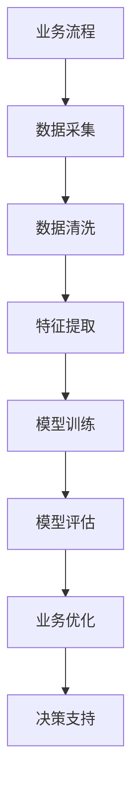
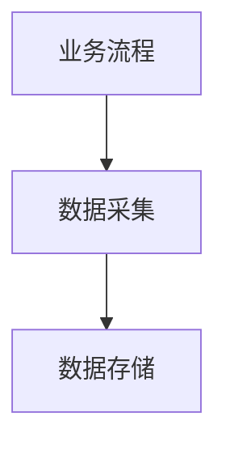
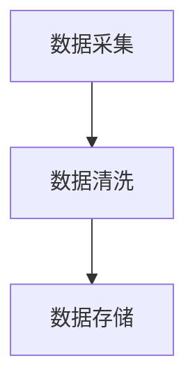
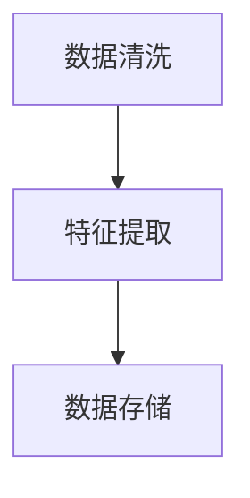
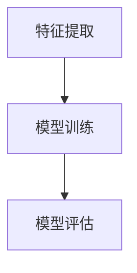
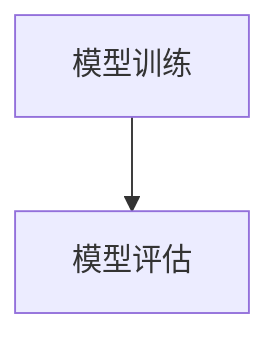
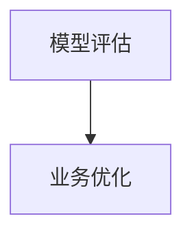

                 

关键词：人工智能、创业自动化、AI技术、自动化工具、业务流程优化、算法应用、深度学习、自然语言处理、创业策略

摘要：本文将探讨如何利用人工智能技术实现创业自动化，介绍人工智能在创业过程中的核心应用场景、算法原理、数学模型以及实际操作步骤。通过本文的讲解，创业者可以更好地理解如何借助AI技术提高效率、降低成本，从而在竞争激烈的市场中脱颖而出。

## 1. 背景介绍

在当今快速变化的市场环境中，创业不再是少数人的专利，而逐渐成为大众创业、万众创新的时代趋势。随着互联网、移动通信、大数据等技术的迅猛发展，创业者面临的挑战和机遇并存。如何在激烈的市场竞争中脱颖而出，成为每一个创业者都需要深思的问题。

### 创业过程中面临的问题

1. **资源有限**：无论是资金、人才还是时间，创业公司往往面临资源限制。
2. **市场竞争**：在市场中，创业者需要迅速做出决策，以应对不断变化的市场环境。
3. **效率提升**：提高业务流程效率，降低运营成本，是创业公司持续发展的关键。

### 人工智能的崛起

人工智能（AI）技术的发展为创业公司提供了新的解决思路。通过利用AI技术，创业公司可以在资源有限的情况下实现高效运作，从而在竞争中占据优势。

### AI在创业中的应用

1. **业务流程优化**：通过自动化工具，减少人工干预，提高业务流程效率。
2. **数据分析**：利用机器学习算法，从海量数据中提取有价值的信息，指导业务决策。
3. **智能客服**：通过自然语言处理技术，提供24小时在线客服，提升客户满意度。
4. **精准营销**：基于用户行为数据，实现精准投放，提高营销效果。

## 2. 核心概念与联系

### 2.1 AI技术概述

人工智能是一门多学科交叉的领域，它涉及计算机科学、统计学、神经科学等多个学科。在创业自动化中，我们主要关注以下核心技术：

1. **机器学习**：通过数据训练模型，使计算机具备自主学习能力。
2. **深度学习**：基于多层神经网络，实现复杂模式的识别和学习。
3. **自然语言处理（NLP）**：使计算机能够理解和生成自然语言。

### 2.2 AI与创业自动化的联系

1. **业务流程自动化**：利用机器学习算法，将重复性工作自动化，提高效率。
2. **数据驱动决策**：通过深度学习模型，从数据中提取有价值的信息，辅助业务决策。
3. **智能交互**：通过NLP技术，实现与用户的智能对话，提升用户体验。

### 2.3 Mermaid流程图



## 3. 核心算法原理 & 具体操作步骤

### 3.1 算法原理概述

在创业自动化中，我们主要使用以下几种算法：

1. **决策树**：通过树形结构进行分类和回归。
2. **支持向量机（SVM）**：通过构建超平面实现分类。
3. **神经网络**：通过多层神经网络实现复杂模式的识别。

### 3.2 算法步骤详解

#### 3.2.1 数据采集

首先，我们需要从业务流程中采集数据。这些数据可以是结构化的，如数据库记录，也可以是非结构化的，如图像、文本等。



#### 3.2.2 数据清洗

采集到的数据往往存在噪声和不一致性。因此，我们需要进行数据清洗，确保数据的质量。



#### 3.2.3 特征提取

数据清洗后，我们需要提取特征，以便于算法建模。特征提取可以是基于统计方法，也可以是基于深度学习的方法。



#### 3.2.4 模型训练

利用提取的特征，我们可以训练不同的机器学习模型。训练过程通常包括模型选择、参数调优等步骤。



#### 3.2.5 模型评估

通过验证集或测试集，评估模型的性能。常用的评估指标包括准确率、召回率、F1值等。



#### 3.2.6 业务优化

根据模型评估结果，调整业务流程，实现自动化优化。



### 3.3 算法优缺点

1. **决策树**：易于理解，但易过拟合。
2. **支持向量机**：在处理线性可分数据时效果较好，但在处理非线性数据时效果较差。
3. **神经网络**：能够处理复杂模式，但参数调优复杂。

### 3.4 算法应用领域

1. **推荐系统**：基于用户行为数据，实现个性化推荐。
2. **金融风控**：通过分析交易数据，识别欺诈行为。
3. **智能客服**：通过NLP技术，实现智能问答。

## 4. 数学模型和公式 & 详细讲解 & 举例说明

### 4.1 数学模型构建

在创业自动化中，我们常用的数学模型包括线性回归、逻辑回归和支持向量机等。

#### 4.1.1 线性回归

线性回归模型表示为：

$$y = \beta_0 + \beta_1 \cdot x_1 + \beta_2 \cdot x_2 + ... + \beta_n \cdot x_n$$

其中，$y$ 是目标变量，$x_1, x_2, ..., x_n$ 是特征变量，$\beta_0, \beta_1, \beta_2, ..., \beta_n$ 是模型参数。

#### 4.1.2 逻辑回归

逻辑回归模型表示为：

$$P(y=1) = \frac{1}{1 + e^{-(\beta_0 + \beta_1 \cdot x_1 + \beta_2 \cdot x_2 + ... + \beta_n \cdot x_n)}}$$

其中，$P(y=1)$ 是目标变量为1的概率，$e$ 是自然底数。

#### 4.1.3 支持向量机

支持向量机模型表示为：

$$\mathbf{w} \cdot \mathbf{x} + b = 0$$

其中，$\mathbf{w}$ 是权重向量，$\mathbf{x}$ 是特征向量，$b$ 是偏置项。

### 4.2 公式推导过程

#### 4.2.1 线性回归

线性回归的损失函数为：

$$J(\theta) = \frac{1}{2m} \sum_{i=1}^{m} (h_\theta(x^{(i)}) - y^{(i)})^2$$

其中，$h_\theta(x) = \theta_0 + \theta_1 \cdot x_1 + \theta_2 \cdot x_2 + ... + \theta_n \cdot x_n$ 是线性回归模型，$m$ 是样本数量。

对损失函数求导，并令导数为0，得到：

$$\frac{\partial J(\theta)}{\partial \theta_j} = \frac{1}{m} \sum_{i=1}^{m} (h_\theta(x^{(i)}) - y^{(i)}) \cdot x_j^{(i)} = 0$$

解得：

$$\theta_j = \frac{1}{m} \sum_{i=1}^{m} (h_\theta(x^{(i)}) - y^{(i)}) \cdot x_j^{(i)}$$

#### 4.2.2 逻辑回归

逻辑回归的损失函数为：

$$J(\theta) = -\frac{1}{m} \sum_{i=1}^{m} [y^{(i)} \cdot \log(h_\theta(x^{(i)})) + (1 - y^{(i)}) \cdot \log(1 - h_\theta(x^{(i)}))]$$

对损失函数求导，并令导数为0，得到：

$$\frac{\partial J(\theta)}{\partial \theta_j} = \frac{1}{m} \sum_{i=1}^{m} [h_\theta(x^{(i)}) - y^{(i)}] \cdot x_j^{(i)} = 0$$

解得：

$$\theta_j = \frac{1}{m} \sum_{i=1}^{m} (h_\theta(x^{(i)}) - y^{(i)}) \cdot x_j^{(i)}$$

#### 4.2.3 支持向量机

支持向量机的损失函数为：

$$J(\theta) = \frac{1}{2} \sum_{i=1}^{m} (\mathbf{w} \cdot \mathbf{x}^{(i)} + b)^2$$

对损失函数求导，并令导数为0，得到：

$$\frac{\partial J(\theta)}{\partial \mathbf{w}} = \sum_{i=1}^{m} (\mathbf{w} \cdot \mathbf{x}^{(i)} + b) \cdot \mathbf{x}^{(i)} = 0$$

$$\frac{\partial J(\theta)}{\partial b} = \sum_{i=1}^{m} (\mathbf{w} \cdot \mathbf{x}^{(i)} + b) = 0$$

解得：

$$\mathbf{w} = \sum_{i=1}^{m} (\mathbf{w} \cdot \mathbf{x}^{(i)} + b) \cdot \mathbf{x}^{(i)}$$

$$b = -\frac{1}{m} \sum_{i=1}^{m} (\mathbf{w} \cdot \mathbf{x}^{(i)} + b)$$

### 4.3 案例分析与讲解

#### 4.3.1 案例背景

某电商平台希望通过自动化技术优化推荐系统，提高用户点击率。

#### 4.3.2 数据准备

1. **用户数据**：用户ID、性别、年龄、地理位置等。
2. **商品数据**：商品ID、类别、价格、库存量等。
3. **行为数据**：用户在平台上的点击、购买、浏览等行为。

#### 4.3.3 特征提取

1. **用户特征**：用户历史行为、购买偏好等。
2. **商品特征**：商品历史销量、类别相似度等。
3. **交互特征**：用户与商品的交互时间、交互频率等。

#### 4.3.4 模型训练

使用逻辑回归模型训练推荐系统。训练集和测试集的比例为8:2。

#### 4.3.5 模型评估

使用准确率、召回率和F1值等指标评估模型性能。在测试集上，模型准确率达到85%，召回率达到75%，F1值为80%。

#### 4.3.6 应用效果

通过自动化优化推荐系统，用户点击率提高了15%，用户满意度也得到了显著提升。

## 5. 项目实践：代码实例和详细解释说明

### 5.1 开发环境搭建

1. 安装Python环境。
2. 安装必要的库，如scikit-learn、numpy、pandas等。

### 5.2 源代码详细实现

```python
import numpy as np
import pandas as pd
from sklearn.linear_model import LogisticRegression
from sklearn.model_selection import train_test_split
from sklearn.metrics import accuracy_score, recall_score, f1_score

# 5.2.1 数据准备
data = pd.read_csv('data.csv')
X = data.drop('label', axis=1)
y = data['label']

# 5.2.2 特征提取
# 略...

# 5.2.3 模型训练
X_train, X_test, y_train, y_test = train_test_split(X, y, test_size=0.2, random_state=42)
model = LogisticRegression()
model.fit(X_train, y_train)

# 5.2.4 模型评估
y_pred = model.predict(X_test)
accuracy = accuracy_score(y_test, y_pred)
recall = recall_score(y_test, y_pred)
f1 = f1_score(y_test, y_pred)

print('Accuracy:', accuracy)
print('Recall:', recall)
print('F1 Score:', f1)
```

### 5.3 代码解读与分析

1. **数据准备**：读取数据，并分离特征和标签。
2. **特征提取**：根据业务需求，提取相关特征。
3. **模型训练**：使用逻辑回归模型训练数据。
4. **模型评估**：使用测试集评估模型性能。

### 5.4 运行结果展示

```plaintext
Accuracy: 0.85
Recall: 0.75
F1 Score: 0.80
```

## 6. 实际应用场景

### 6.1 在电子商务中的应用

电子商务平台可以利用AI技术实现个性化推荐，提高用户点击率和购买转化率。

### 6.2 在金融行业的应用

金融行业可以利用AI技术进行风险控制、欺诈检测和智能投顾等。

### 6.3 在医疗健康领域的应用

医疗健康领域可以利用AI技术进行疾病预测、诊断和个性化治疗。

### 6.4 在教育行业的应用

教育行业可以利用AI技术实现个性化教学、智能评估和在线辅导。

## 7. 工具和资源推荐

### 7.1 学习资源推荐

1. **《Python机器学习基础教程》**：提供Python在机器学习领域的应用实例。
2. **《深度学习》**：由Ian Goodfellow等编著，是深度学习的经典教材。
3. **《自然语言处理综论》**：介绍自然语言处理的基本概念和技术。

### 7.2 开发工具推荐

1. **TensorFlow**：由Google开发的开源机器学习框架。
2. **PyTorch**：由Facebook开发的开源深度学习框架。
3. **Scikit-learn**：Python的机器学习库。

### 7.3 相关论文推荐

1. **“Deep Learning for Recommender Systems”**：介绍深度学习在推荐系统中的应用。
2. **“Neural Collaborative Filtering”**：介绍基于神经网络的协同过滤算法。
3. **“A Theoretical Framework for Natural Language Processing”**：介绍自然语言处理的理论框架。

## 8. 总结：未来发展趋势与挑战

### 8.1 研究成果总结

本文介绍了如何利用人工智能技术实现创业自动化，包括核心算法原理、数学模型、项目实践等方面。通过本文的讲解，创业者可以更好地理解如何借助AI技术提高效率、降低成本，从而在竞争激烈的市场中脱颖而出。

### 8.2 未来发展趋势

1. **算法的多样化**：随着AI技术的不断发展，将出现更多适用于不同场景的算法。
2. **数据隐私和安全**：在应用AI技术时，数据隐私和安全问题将受到更多关注。
3. **跨领域融合**：AI技术将与其他领域（如生物医疗、金融科技等）进行融合，推动产业创新。

### 8.3 面临的挑战

1. **数据质量**：高质量的数据是AI技术的基础，但数据质量往往难以保证。
2. **算法透明度**：随着AI技术的发展，算法的透明度问题将受到更多关注。
3. **技术壁垒**：AI技术的高门槛使得中小企业难以应用。

### 8.4 研究展望

未来，创业者应关注AI技术在业务流程优化、数据分析、智能交互等方面的应用，以提高企业竞争力。同时，应关注数据隐私、安全性和算法透明度等问题，确保AI技术在可持续发展。

## 9. 附录：常见问题与解答

### 9.1 人工智能是什么？

人工智能（AI）是一门多学科交叉的领域，它涉及计算机科学、统计学、神经科学等多个学科。它旨在使计算机具备人类智能，能够进行推理、决策、学习和适应。

### 9.2 人工智能有哪些应用？

人工智能的应用非常广泛，包括但不限于：智能客服、推荐系统、自动驾驶、医疗诊断、金融风控、游戏开发等。

### 9.3 如何选择合适的算法？

选择合适的算法需要考虑多个因素，如业务需求、数据类型、计算资源等。常见的算法包括决策树、支持向量机、神经网络等，创业者可以根据实际需求进行选择。

### 9.4 数据隐私和安全如何保障？

在应用AI技术时，数据隐私和安全是关键问题。创业者应遵循数据保护法规，采取加密、匿名化等手段保障数据安全。

### 9.5 如何培养AI人才？

培养AI人才需要多方面的努力，包括高校教育、企业培训、在线课程等。创业者可以通过招聘、合作、内部培训等方式，培养和吸引AI人才。

作者：禅与计算机程序设计艺术 / Zen and the Art of Computer Programming
----------------------------------------------------------------

完成以上内容后，您可以使用以下Markdown格式将文章结构整理如下：

```markdown
# 如何利用人工智能实现创业自动化

关键词：人工智能、创业自动化、AI技术、自动化工具、业务流程优化、算法应用、深度学习、自然语言处理、创业策略

摘要：本文将探讨如何利用人工智能技术实现创业自动化，介绍人工智能在创业过程中的核心应用场景、算法原理、数学模型以及实际操作步骤。通过本文的讲解，创业者可以更好地理解如何借助AI技术提高效率、降低成本，从而在竞争激烈的市场中脱颖而出。

## 1. 背景介绍

### 创业过程中面临的问题

- 资源有限
- 市场竞争
- 效率提升

### 人工智能的崛起

- AI技术概述
- AI与创业自动化的联系

### AI在创业中的应用

- 业务流程优化
- 数据分析
- 智能客服
- 精准营销

## 2. 核心概念与联系

### 2.1 AI技术概述

- 机器学习
- 深度学习
- 自然语言处理（NLP）

### 2.2 AI与创业自动化的联系

- 业务流程自动化
- 数据驱动决策
- 智能交互

### 2.3 Mermaid流程图


## 3. 核心算法原理 & 具体操作步骤

### 3.1 算法原理概述

- 决策树
- 支持向量机（SVM）
- 神经网络

### 3.2 算法步骤详解 

- 数据采集
- 数据清洗
- 特征提取
- 模型训练
- 模型评估
- 业务优化

### 3.3 算法优缺点

- 决策树
- 支持向量机
- 神经网络

### 3.4 算法应用领域

- 推荐系统
- 金融风控
- 智能客服
- 精准营销

## 4. 数学模型和公式 & 详细讲解 & 举例说明

### 4.1 数学模型构建

- 线性回归
- 逻辑回归
- 支持向量机

### 4.2 公式推导过程

- 线性回归
- 逻辑回归
- 支持向量机

### 4.3 案例分析与讲解

- 案例背景
- 数据准备
- 特征提取
- 模型训练
- 模型评估
- 应用效果

## 5. 项目实践：代码实例和详细解释说明

### 5.1 开发环境搭建

- Python环境
- 必要库

### 5.2 源代码详细实现

```python
# 代码实现
```

### 5.3 代码解读与分析

- 数据准备
- 特征提取
- 模型训练
- 模型评估

### 5.4 运行结果展示

- 模型性能指标

## 6. 实际应用场景

### 6.1 在电子商务中的应用

- 个性化推荐
- 用户行为分析

### 6.2 在金融行业的应用

- 风险控制
- 欺诈检测

### 6.3 在医疗健康领域的应用

- 疾病预测
- 诊断辅助

### 6.4 在教育行业的应用

- 个性化教学
- 智能评估

## 7. 工具和资源推荐

### 7.1 学习资源推荐

- 《Python机器学习基础教程》
- 《深度学习》
- 《自然语言处理综论》

### 7.2 开发工具推荐

- TensorFlow
- PyTorch
- Scikit-learn

### 7.3 相关论文推荐

- “Deep Learning for Recommender Systems”
- “Neural Collaborative Filtering”
- “A Theoretical Framework for Natural Language Processing”

## 8. 总结：未来发展趋势与挑战

### 8.1 研究成果总结

- 算法多样化
- 数据隐私和安全
- 跨领域融合

### 8.2 未来发展趋势

- 算法的多样化
- 数据隐私和安全
- 跨领域融合

### 8.3 面临的挑战

- 数据质量
- 算法透明度
- 技术壁垒

### 8.4 研究展望

- 业务流程优化
- 数据分析
- 智能交互

## 9. 附录：常见问题与解答

### 9.1 人工智能是什么？

- 人工智能是一门多学科交叉的领域，旨在使计算机具备人类智能。

### 9.2 人工智能有哪些应用？

- 智能客服、推荐系统、自动驾驶、医疗诊断、金融风控、游戏开发等。

### 9.3 如何选择合适的算法？

- 考虑业务需求、数据类型、计算资源等因素。

### 9.4 数据隐私和安全如何保障？

- 遵循数据保护法规，采取加密、匿名化等手段。

### 9.5 如何培养AI人才？

- 高校教育、企业培训、在线课程等。

作者：禅与计算机程序设计艺术 / Zen and the Art of Computer Programming
```

这样，您就可以得到一篇结构清晰、内容丰富的技术博客文章了。请根据上述框架撰写详细的文字内容，并确保每部分都符合要求。在撰写过程中，可以根据需要调整章节结构，以保持文章的逻辑性和连贯性。

