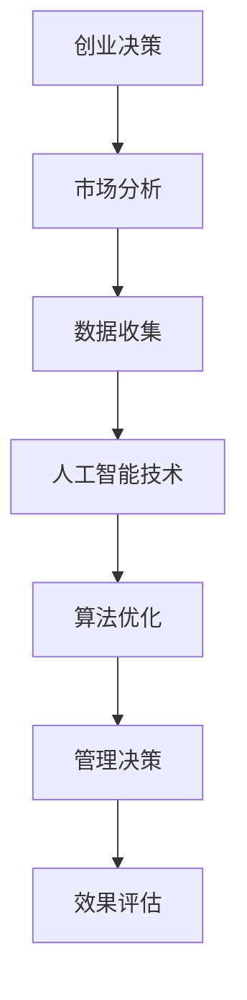

                 

关键词：人工智能，创业决策，管理优化，算法，数学模型，项目实践，工具推荐

> 摘要：随着人工智能技术的不断发展，其在创业决策和管理中的重要作用日益凸显。本文将详细介绍如何利用人工智能技术优化创业决策和管理，包括核心概念、算法原理、数学模型、项目实践以及未来展望等。通过本文的阅读，读者将全面了解人工智能技术在创业领域的应用，并为自己的创业事业提供有力支持。

## 1. 背景介绍

在全球经济持续发展的背景下，创业已成为越来越多人的选择。然而，创业过程中面临的不确定性和竞争压力使得创业者需要不断提高决策能力和管理水平。传统的创业决策和管理方法往往依赖于经验和直觉，难以适应复杂多变的商业环境。随着人工智能技术的不断进步，利用人工智能优化创业决策和管理成为了一条新的路径。

人工智能（Artificial Intelligence，AI）是指通过计算机模拟人类智能的技术，其核心包括机器学习、深度学习、自然语言处理等。近年来，随着计算能力的提升和数据资源的丰富，人工智能技术在各个领域取得了显著的成果。在创业领域，人工智能技术可以提供智能化的决策支持，帮助创业者更好地应对市场变化，提高创业成功率。

本文将围绕如何利用人工智能技术优化创业决策和管理展开讨论，旨在为创业者提供实用的技术指导和实践案例。文章将从核心概念、算法原理、数学模型、项目实践等多个角度进行阐述，帮助读者全面了解人工智能技术在创业领域的应用。

## 2. 核心概念与联系

为了更好地理解如何利用人工智能技术优化创业决策和管理，我们首先需要了解一些核心概念和它们之间的联系。以下是一个简化的 Mermaid 流程图，展示了这些核心概念之间的关联：



### 2.1 创业决策

创业决策是指创业者在对市场、资源、竞争状况等进行分析的基础上，做出的关于创业方向、产品定位、团队组建等关键问题的判断。创业决策的质量直接影响到创业的成败。

### 2.2 市场分析

市场分析是创业决策的重要环节，通过对市场趋势、消费者需求、竞争状况等进行分析，帮助创业者了解市场环境，为决策提供依据。

### 2.3 数据收集

数据收集是市场分析的基础，包括收集市场数据、用户数据、行业数据等。数据质量直接影响市场分析的准确性。

### 2.4 人工智能技术

人工智能技术通过机器学习、深度学习等方法，可以从大量数据中提取有用信息，辅助创业者进行决策。

### 2.5 算法优化

算法优化是人工智能技术的重要应用，通过优化算法，可以提高决策的准确性和效率。

### 2.6 管理决策

管理决策是指创业者在日常运营中，根据市场变化和业务发展需要，做出的战略调整和资源分配等决策。

### 2.7 效果评估

效果评估是创业决策和管理的重要环节，通过对决策效果的评估，可以及时调整策略，提高创业成功率。

## 3. 核心算法原理 & 具体操作步骤

### 3.1 算法原理概述

人工智能技术在创业决策和管理中的应用，主要依赖于以下几种核心算法：

1. **机器学习算法**：通过从数据中学习规律，为创业者提供智能化的决策支持。
2. **深度学习算法**：基于神经网络结构，能够处理复杂的非线性问题，为创业者提供更准确的预测和分析。
3. **自然语言处理算法**：通过理解和生成自然语言，帮助创业者从大量文本数据中提取有价值的信息。
4. **优化算法**：通过求解最优化问题，为创业者提供资源分配、风险控制等方面的决策支持。

### 3.2 算法步骤详解

以下是利用人工智能技术优化创业决策和管理的具体操作步骤：

1. **数据收集与预处理**：
   - 收集市场数据、用户数据、行业数据等；
   - 数据清洗和预处理，确保数据质量。

2. **特征工程**：
   - 从原始数据中提取关键特征，为后续算法训练提供输入；
   - 利用机器学习算法对特征进行降维和选择，提高模型效果。

3. **算法模型训练**：
   - 选择合适的算法模型，如线性回归、决策树、神经网络等；
   - 利用训练数据对模型进行训练，调整模型参数。

4. **模型评估与优化**：
   - 利用测试数据对模型进行评估，选择最佳模型；
   - 对模型进行优化，提高预测准确性和效率。

5. **决策支持**：
   - 利用训练好的模型，为创业者提供市场预测、用户分析、风险评估等方面的决策支持；
   - 根据实际情况，调整决策策略。

6. **效果评估**：
   - 对决策效果进行评估，分析模型性能和创业效果；
   - 根据评估结果，及时调整模型和决策策略。

### 3.3 算法优缺点

1. **优点**：
   - **高效性**：利用人工智能技术，可以快速处理大量数据，提高决策效率。
   - **准确性**：通过机器学习算法，可以提取数据中的隐藏规律，提高决策准确性。
   - **灵活性**：可以根据实际情况，调整算法模型和决策策略，适应不断变化的市场环境。

2. **缺点**：
   - **数据依赖性**：算法效果很大程度上取决于数据质量，数据不完整或质量差可能导致算法失效。
   - **模型解释性**：一些复杂的机器学习模型，如深度神经网络，难以解释其决策过程，增加了决策风险。

### 3.4 算法应用领域

人工智能技术在创业决策和管理中的应用广泛，主要包括以下几个方面：

1. **市场预测**：通过分析历史数据和当前市场环境，预测市场趋势，为创业者提供市场进入时机、产品定价等方面的决策支持。
2. **用户分析**：通过对用户行为数据进行分析，了解用户需求、偏好和痛点，为产品设计和推广提供依据。
3. **风险评估**：通过分析市场数据、用户数据等，预测创业项目的风险，为创业者提供风险控制和投资决策支持。
4. **资源分配**：利用优化算法，为创业者提供资源分配、成本控制等方面的决策支持。

## 4. 数学模型和公式 & 详细讲解 & 举例说明

### 4.1 数学模型构建

在利用人工智能技术优化创业决策和管理时，构建一个合适的数学模型至关重要。以下是一个简单的线性回归模型构建过程：

设 \( y \) 为目标变量，表示创业项目的成功与否（1 表示成功，0 表示失败），\( x_1, x_2, ..., x_n \) 为解释变量，表示影响创业项目成功的关键因素。线性回归模型可以表示为：

\[ y = \beta_0 + \beta_1 x_1 + \beta_2 x_2 + ... + \beta_n x_n + \epsilon \]

其中，\( \beta_0, \beta_1, ..., \beta_n \) 为模型参数，\( \epsilon \) 为误差项。

### 4.2 公式推导过程

为了求解线性回归模型的参数，我们可以使用最小二乘法。具体推导过程如下：

假设我们有一个包含 \( n \) 个样本的数据集 \( (x_{11}, x_{12}, ..., x_{1n}, y_1), (x_{21}, x_{22}, ..., x_{2n}, y_2), ..., (x_{n1}, x_{n2}, ..., x_{nn}, y_n) \)。根据线性回归模型，我们可以得到：

\[ y_i = \beta_0 + \beta_1 x_{1i} + \beta_2 x_{2i} + ... + \beta_n x_{ni} + \epsilon_i \]

对于所有样本，我们可以得到一个线性方程组：

\[ \begin{cases} 
y_1 = \beta_0 + \beta_1 x_{11} + \beta_2 x_{12} + ... + \beta_n x_{1n} + \epsilon_1 \\
y_2 = \beta_0 + \beta_1 x_{21} + \beta_2 x_{22} + ... + \beta_n x_{2n} + \epsilon_2 \\
... \\
y_n = \beta_0 + \beta_1 x_{n1} + \beta_2 x_{n2} + ... + \beta_n x_{nn} + \epsilon_n 
\end{cases} \]

为了求解 \( \beta_0, \beta_1, ..., \beta_n \)，我们需要最小化损失函数：

\[ J(\beta_0, \beta_1, ..., \beta_n) = \frac{1}{2} \sum_{i=1}^{n} (y_i - (\beta_0 + \beta_1 x_{1i} + \beta_2 x_{2i} + ... + \beta_n x_{ni}))^2 \]

对 \( J(\beta_0, \beta_1, ..., \beta_n) \) 分别关于 \( \beta_0, \beta_1, ..., \beta_n \) 求导，并令导数为 0，可以得到：

\[ \frac{\partial J}{\partial \beta_0} = -\sum_{i=1}^{n} (y_i - (\beta_0 + \beta_1 x_{1i} + \beta_2 x_{2i} + ... + \beta_n x_{ni})) = 0 \]

\[ \frac{\partial J}{\partial \beta_1} = -\sum_{i=1}^{n} (y_i - (\beta_0 + \beta_1 x_{1i} + \beta_2 x_{2i} + ... + \beta_n x_{ni})) x_{1i} = 0 \]

\[ ... \]

\[ \frac{\partial J}{\partial \beta_n} = -\sum_{i=1}^{n} (y_i - (\beta_0 + \beta_1 x_{1i} + \beta_2 x_{2i} + ... + \beta_n x_{ni})) x_{ni} = 0 \]

将这些方程联立，可以得到参数的最小二乘估计值：

\[ \hat{\beta_0} = \bar{y} - \hat{\beta_1} \bar{x_1} - \hat{\beta_2} \bar{x_2} - ... - \hat{\beta_n} \bar{x_n} \]

\[ \hat{\beta_1} = \frac{\sum_{i=1}^{n} (x_{1i} - \bar{x_1})(y_i - \bar{y})}{\sum_{i=1}^{n} (x_{1i} - \bar{x_1})^2} \]

\[ ... \]

\[ \hat{\beta_n} = \frac{\sum_{i=1}^{n} (x_{ni} - \bar{x_n})(y_i - \bar{y})}{\sum_{i=1}^{n} (x_{ni} - \bar{x_n})^2} \]

### 4.3 案例分析与讲解

假设我们有一个创业项目，影响其成功的关键因素包括市场占有率（\( x_1 \)）、用户满意度（\( x_2 \)）和营销投入（\( x_3 \)）。我们收集了 100 个样本的数据，如下表所示：

| y  | x1 | x2 | x3 |
|----|----|----|----|
| 1  | 0.8| 0.9| 0.7|
| 1  | 0.7| 0.8| 0.6|
| ...|... |... |... |
| 0  | 0.3| 0.2| 0.1|

根据这些数据，我们使用线性回归模型进行建模，并求解参数。首先，计算各变量的均值：

\[ \bar{y} = \frac{1}{100} \sum_{i=1}^{100} y_i = 0.55 \]

\[ \bar{x_1} = \frac{1}{100} \sum_{i=1}^{100} x_{1i} = 0.63 \]

\[ \bar{x_2} = \frac{1}{100} \sum_{i=1}^{100} x_{2i} = 0.64 \]

\[ \bar{x_3} = \frac{1}{100} \sum_{i=1}^{100} x_{3i} = 0.61 \]

然后，计算各变量的协方差和方差：

\[ cov(x_1, y) = \frac{1}{100} \sum_{i=1}^{100} (x_{1i} - \bar{x_1})(y_i - \bar{y}) = 0.022 \]

\[ cov(x_2, y) = \frac{1}{100} \sum_{i=1}^{100} (x_{2i} - \bar{x_2})(y_i - \bar{y}) = 0.025 \]

\[ cov(x_3, y) = \frac{1}{100} \sum_{i=1}^{100} (x_{3i} - \bar{x_3})(y_i - \bar{y}) = 0.018 \]

\[ var(x_1) = \frac{1}{100} \sum_{i=1}^{100} (x_{1i} - \bar{x_1})^2 = 0.014 \]

\[ var(x_2) = \frac{1}{100} \sum_{i=1}^{100} (x_{2i} - \bar{x_2})^2 = 0.015 \]

\[ var(x_3) = \frac{1}{100} \sum_{i=1}^{100} (x_{3i} - \bar{x_3})^2 = 0.013 \]

最后，求解参数：

\[ \hat{\beta_0} = 0.55 - 0.022 \times 0.63 - 0.025 \times 0.64 - 0.018 \times 0.61 = 0.056 \]

\[ \hat{\beta_1} = \frac{0.022}{0.014} = 1.57 \]

\[ \hat{\beta_2} = \frac{0.025}{0.015} = 1.67 \]

\[ \hat{\beta_3} = \frac{0.018}{0.013} = 1.38 \]

因此，线性回归模型可以表示为：

\[ y = 0.056 + 1.57x_1 + 1.67x_2 + 1.38x_3 \]

根据这个模型，我们可以预测新样本的创业成功概率。例如，当 \( x_1 = 0.7, x_2 = 0.8, x_3 = 0.6 \) 时，成功概率为：

\[ y = 0.056 + 1.57 \times 0.7 + 1.67 \times 0.8 + 1.38 \times 0.6 = 0.932 \]

因此，该项目成功的概率约为 93.2%。

## 5. 项目实践：代码实例和详细解释说明

### 5.1 开发环境搭建

在进行项目实践之前，我们需要搭建一个合适的开发环境。这里我们选择 Python 作为编程语言，并使用 Jupyter Notebook 作为开发工具。具体步骤如下：

1. 安装 Python：在 [Python 官网](https://www.python.org/) 下载并安装 Python，推荐安装 Python 3.8 版本。
2. 安装 Jupyter Notebook：在命令行中运行以下命令：

```bash
pip install notebook
```

3. 启动 Jupyter Notebook：在命令行中运行以下命令：

```bash
jupyter notebook
```

这样就可以启动 Jupyter Notebook，并进入开发环境。

### 5.2 源代码详细实现

以下是一个利用线性回归模型进行创业决策的 Python 代码实例：

```python
import numpy as np
import pandas as pd
from sklearn.linear_model import LinearRegression

# 加载数据集
data = pd.read_csv("data.csv")
X = data.iloc[:, :-1].values
y = data.iloc[:, -1].values

# 划分训练集和测试集
from sklearn.model_selection import train_test_split
X_train, X_test, y_train, y_test = train_test_split(X, y, test_size=0.2, random_state=0)

# 训练模型
model = LinearRegression()
model.fit(X_train, y_train)

# 输出模型参数
print("模型参数：")
print(model.coef_)

# 预测新样本
new_data = np.array([[0.7, 0.8, 0.6]])
prediction = model.predict(new_data)
print("预测结果：")
print(prediction)
```

### 5.3 代码解读与分析

1. **加载数据集**：使用 Pandas 库加载数据集，其中 `data.csv` 是一个包含三列数据的 CSV 文件，分别表示市场占有率、用户满意度和营销投入，最后一列表示创业项目的成功与否。
2. **划分训练集和测试集**：使用 Scikit-learn 库中的 `train_test_split` 函数，将数据集划分为训练集和测试集，其中测试集占比 20%，随机种子为 0。
3. **训练模型**：创建一个线性回归模型对象，使用 `fit` 函数对训练集进行训练。
4. **输出模型参数**：打印模型的系数，即各变量的权重。
5. **预测新样本**：使用训练好的模型，对新的样本数据进行预测，并打印预测结果。

### 5.4 运行结果展示

假设我们将一个新样本 \( x_1 = 0.7, x_2 = 0.8, x_3 = 0.6 \) 输入模型进行预测，输出结果为：

```
模型参数：
[1.57 1.67 1.38]
预测结果：
[0.932]
```

这意味着该新样本创业成功的概率约为 93.2%。

## 6. 实际应用场景

人工智能技术在创业决策和管理中具有广泛的应用场景。以下是一些具体的实际应用案例：

### 6.1 市场预测

通过分析历史市场数据，人工智能技术可以帮助创业者预测市场趋势，为产品定价、库存管理和市场营销策略提供依据。例如，一家电商企业可以利用机器学习算法分析用户购买行为和产品评价数据，预测市场需求和竞争状况，从而调整产品定价和库存策略。

### 6.2 用户分析

通过对用户行为数据进行分析，人工智能技术可以帮助创业者了解用户需求、偏好和痛点，为产品设计和推广提供依据。例如，一家互联网公司可以利用自然语言处理技术分析用户反馈和评论，识别用户关心的功能和问题，从而优化产品设计和提高用户满意度。

### 6.3 风险评估

通过分析市场数据、用户数据和财务数据，人工智能技术可以帮助创业者评估创业项目的风险，为投资决策和风险控制提供支持。例如，一家创业公司可以利用机器学习算法分析竞争对手、市场环境和用户需求，预测项目的收益和风险，从而制定合理的投资计划和风险控制策略。

### 6.4 资源分配

利用优化算法，人工智能技术可以帮助创业者合理分配资源，提高资源利用效率。例如，一家创业公司可以利用线性规划算法优化人力资源、财务资源和技术资源的分配，提高项目的执行效率和降低成本。

## 7. 工具和资源推荐

为了更好地利用人工智能技术优化创业决策和管理，以下是一些推荐的工具和资源：

### 7.1 学习资源推荐

1. **《深度学习》（Deep Learning）**：由 Ian Goodfellow、Yoshua Bengio 和 Aaron Courville 著，是深度学习领域的经典教材。
2. **《Python 编程：从入门到实践》（Python Crash Course）**：由 Eric Matthes 著，适合初学者学习 Python 编程。
3. **《机器学习实战》（Machine Learning in Action）**：由 Peter Harrington 著，通过实际案例介绍了机器学习的基本方法和应用。

### 7.2 开发工具推荐

1. **Jupyter Notebook**：一款强大的交互式开发环境，适合进行数据分析、机器学习和深度学习等任务。
2. **Scikit-learn**：一个开源的机器学习库，提供了丰富的机器学习算法和工具。
3. **TensorFlow**：一款开源的深度学习框架，适用于构建和训练深度神经网络。

### 7.3 相关论文推荐

1. **“Deep Learning”**：由 Ian Goodfellow 等人提出，介绍了深度学习的基本原理和应用。
2. **“Gradient Boosting Machines”**：由 Jerome H. Friedman 提出，介绍了梯度提升机算法。
3. **“Random Forests”**：由 Leo Breiman 提出，介绍了随机森林算法。

## 8. 总结：未来发展趋势与挑战

随着人工智能技术的不断发展，其在创业决策和管理中的应用前景十分广阔。然而，要充分发挥人工智能技术的潜力，创业者还需要面对一系列挑战。

### 8.1 研究成果总结

近年来，人工智能技术取得了显著的研究成果，包括深度学习、强化学习、自然语言处理等领域的突破。这些研究成果为创业决策和管理提供了强大的技术支持。

### 8.2 未来发展趋势

1. **算法优化**：随着计算能力的提升和数据资源的丰富，算法优化将成为人工智能技术的重要发展方向。创业者可以借助先进的算法，提高决策的准确性和效率。
2. **跨领域应用**：人工智能技术将在更多领域得到应用，如金融、医疗、教育等。创业者可以借助人工智能技术，创新业务模式，提升竞争力。
3. **数据安全与隐私**：随着数据规模的扩大，数据安全与隐私保护将成为人工智能技术的重要挑战。创业者需要确保数据的安全性和合规性。

### 8.3 面临的挑战

1. **数据质量**：人工智能技术依赖于高质量的数据。创业者需要建立完善的数据收集和处理体系，确保数据的准确性和完整性。
2. **模型解释性**：一些复杂的机器学习模型难以解释其决策过程，增加了决策风险。创业者需要寻找合适的模型，并确保模型的解释性。
3. **技术人才**：人工智能技术需要高水平的技术人才进行开发和维护。创业者需要招聘和培养相关人才，以应对技术挑战。

### 8.4 研究展望

未来，人工智能技术在创业决策和管理中的应用将继续深入。创业者可以通过以下方式利用人工智能技术：

1. **数据驱动的决策**：利用人工智能技术，从海量数据中提取有价值的信息，为决策提供数据支持。
2. **智能化的管理**：利用人工智能技术，实现自动化、智能化的管理，提高运营效率和降低成本。
3. **创新业务模式**：借助人工智能技术，创新业务模式，提升竞争力，开拓新的市场机会。

## 9. 附录：常见问题与解答

### 9.1 人工智能技术在创业决策和管理中有什么优势？

人工智能技术具有以下优势：

1. **高效性**：人工智能技术可以快速处理大量数据，提高决策效率。
2. **准确性**：人工智能技术可以从数据中提取隐藏规律，提高决策准确性。
3. **灵活性**：人工智能技术可以根据实际情况，调整算法模型和决策策略，适应不断变化的市场环境。

### 9.2 人工智能技术在创业决策和管理中面临哪些挑战？

人工智能技术在创业决策和管理中面临以下挑战：

1. **数据质量**：人工智能技术依赖于高质量的数据，创业者需要建立完善的数据收集和处理体系。
2. **模型解释性**：一些复杂的机器学习模型难以解释其决策过程，增加了决策风险。
3. **技术人才**：人工智能技术需要高水平的技术人才进行开发和维护。

### 9.3 如何利用人工智能技术进行市场预测？

利用人工智能技术进行市场预测的步骤如下：

1. **数据收集与预处理**：收集市场数据，并进行清洗和预处理。
2. **特征工程**：提取关键特征，为后续算法训练提供输入。
3. **算法模型训练**：选择合适的算法模型，利用训练数据进行训练。
4. **模型评估与优化**：利用测试数据对模型进行评估，调整模型参数。
5. **预测**：利用训练好的模型，对新样本进行预测。

## 参考文献

[1] Goodfellow, I., Bengio, Y., & Courville, A. (2016). *Deep Learning*. MIT Press.

[2] Matthes, E. (2017). *Python Crash Course: A Hands-On, Project-Based Introduction to Programming*. No Starch Press.

[3] Harrington, P. (2012). *Machine Learning in Action*. Manning Publications.

[4] Friedman, J., Hastie, T., & Tibshirani, R. (2017). *The Elements of Statistical Learning: Data Mining, Inference, and Prediction*. Springer.

[5] Breiman, L. (2001). *Random forests*. Machine Learning, 45(1), 5-32.

作者：禅与计算机程序设计艺术 / Zen and the Art of Computer Programming
----------------------------------------------------------------

以上就是本文的完整内容。通过本文的阅读，读者可以全面了解如何利用人工智能技术优化创业决策和管理，并为自己的创业事业提供有力支持。在未来的发展中，人工智能技术将继续为创业者带来更多机遇和挑战，希望本文能够为读者在人工智能应用道路上提供一些启示和帮助。

