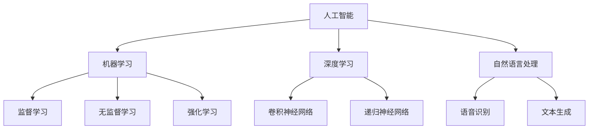

                 

关键词：人工智能，创业效率，算法优化，机器学习，数据分析

> 摘要：本文将探讨如何通过人工智能技术提高创业公司的运营效率和创新能力。我们首先介绍人工智能的基本概念，然后分析其在创业过程中的应用，最后提供具体的项目实践案例，以及展望未来人工智能在创业领域的潜在发展趋势。

## 1. 背景介绍

在当前快速变化的市场环境中，创业公司需要具备高效的运营能力和持续的创新能力，才能在激烈的市场竞争中立于不败之地。人工智能（Artificial Intelligence，AI）作为一项前沿技术，已经在众多领域展示了其巨大的潜力。通过引入人工智能技术，创业公司可以优化业务流程、提升决策质量、加速产品迭代，从而在竞争中取得优势。

本文将围绕以下几个方面展开讨论：

- 人工智能技术的基本概念及其发展历程
- 人工智能在创业公司中的具体应用场景
- 人工智能技术在创业项目中的实际操作步骤和案例分析
- 人工智能在创业领域的发展趋势和面临的挑战

通过本文的探讨，希望读者能够对人工智能技术在创业中的应用有一个全面而深入的理解，并能够将其应用到实际的创业项目中，提升公司效率，实现持续创新。

## 2. 核心概念与联系

### 2.1 人工智能的基本概念

人工智能（AI）是计算机科学的一个分支，旨在使计算机模拟人类智能行为。它包括多个子领域，如机器学习、深度学习、自然语言处理等。以下是一个简化的 Mermaid 流程图，描述了人工智能的核心概念及其相互关系。



### 2.2 创业过程中的常见问题

创业公司面临的主要问题包括市场定位不准确、运营效率低下、决策失误等。这些问题往往与数据收集、分析能力不足有关。通过引入人工智能技术，可以对这些常见问题进行有效解决。

### 2.3 人工智能与创业问题的关联

人工智能技术能够通过数据分析和处理，帮助创业公司：

- **市场预测**：利用机器学习模型对市场趋势进行预测，从而准确定位市场方向。
- **运营优化**：通过自动化流程提高运营效率，减少人力资源成本。
- **决策支持**：提供数据驱动的决策支持系统，帮助管理者做出更加科学的决策。

## 3. 核心算法原理 & 具体操作步骤

### 3.1 算法原理概述

人工智能技术主要依赖于机器学习算法。机器学习是一种从数据中自动学习和改进的技术。以下是几种常见的机器学习算法：

- **监督学习**：通过已有数据训练模型，然后使用模型对未知数据进行预测。
- **无监督学习**：仅使用数据本身，不提供标签信息，用于发现数据中的模式和结构。
- **强化学习**：通过与环境的交互，学习最优策略以达到特定目标。

### 3.2 算法步骤详解

#### 3.2.1 数据预处理

在应用机器学习算法之前，需要对数据进行预处理。数据预处理包括以下步骤：

- **数据清洗**：去除重复、错误和缺失的数据。
- **数据归一化**：将数据转换为统一的数值范围。
- **特征选择**：选择对模型预测最有影响的数据特征。

#### 3.2.2 模型选择

根据具体问题和数据特点，选择合适的机器学习模型。常见的模型包括线性回归、决策树、随机森林、支持向量机等。

#### 3.2.3 模型训练

使用预处理后的数据训练模型。训练过程包括：

- **训练集划分**：将数据集划分为训练集和验证集。
- **参数调优**：通过交叉验证等方法选择最佳参数。
- **模型评估**：使用验证集评估模型性能。

#### 3.2.4 模型应用

在模型训练完成后，使用训练好的模型对未知数据进行预测。模型应用过程包括：

- **模型部署**：将模型部署到生产环境中。
- **实时预测**：对实时数据进行分析和预测。

### 3.3 算法优缺点

- **优点**：机器学习算法能够自动从数据中学习，提高预测的准确性，减少人为干预。
- **缺点**：算法复杂度高，需要大量数据和计算资源，且对数据质量和特征选择要求较高。

### 3.4 算法应用领域

机器学习算法在创业公司中的应用广泛，包括：

- **客户行为分析**：通过分析客户行为数据，预测客户需求和偏好。
- **风险控制**：利用算法识别潜在的风险，并制定相应的风险管理策略。
- **产品推荐**：基于用户历史行为和偏好，推荐相关产品和服务。

## 4. 数学模型和公式 & 详细讲解 & 举例说明

### 4.1 数学模型构建

机器学习中的数学模型主要包括线性模型、非线性模型和概率模型。以下是线性回归模型的数学模型构建过程：

#### 4.1.1 线性回归模型

线性回归模型试图找到输入变量和输出变量之间的线性关系，其数学公式为：

$$
y = \beta_0 + \beta_1 \cdot x_1 + \beta_2 \cdot x_2 + ... + \beta_n \cdot x_n + \epsilon
$$

其中，$y$ 是输出变量，$x_1, x_2, ..., x_n$ 是输入变量，$\beta_0, \beta_1, ..., \beta_n$ 是模型参数，$\epsilon$ 是误差项。

#### 4.1.2 非线性模型

非线性模型通过引入非线性函数，如逻辑函数、指数函数等，来增强模型的预测能力。例如，多项式回归模型：

$$
y = \beta_0 + \beta_1 \cdot x_1 + \beta_2 \cdot x_1^2 + ... + \beta_n \cdot x_1^n
$$

#### 4.1.3 概率模型

概率模型基于贝叶斯定理，通过计算后验概率来预测输出变量。例如，贝叶斯分类器：

$$
P(y|x) = \frac{P(x|y) \cdot P(y)}{P(x)}
$$

### 4.2 公式推导过程

线性回归模型的参数估计通常采用最小二乘法。以下是线性回归模型参数估计的推导过程：

假设有 $n$ 个样本数据点 $(x_i, y_i)$，线性回归模型为：

$$
y_i = \beta_0 + \beta_1 \cdot x_i + \epsilon_i
$$

对模型进行最小化损失函数，损失函数通常采用均方误差（MSE）：

$$
J(\beta_0, \beta_1) = \frac{1}{2n} \sum_{i=1}^{n} (y_i - (\beta_0 + \beta_1 \cdot x_i))^2
$$

对损失函数关于 $\beta_0$ 和 $\beta_1$ 求导，并令导数为零，可以得到最小损失函数的参数：

$$
\frac{\partial J}{\partial \beta_0} = 0 \quad \Rightarrow \quad \beta_0 = \bar{y} - \beta_1 \cdot \bar{x}
$$

$$
\frac{\partial J}{\partial \beta_1} = 0 \quad \Rightarrow \quad \beta_1 = \frac{\sum_{i=1}^{n} (x_i - \bar{x}) \cdot (y_i - \bar{y})}{\sum_{i=1}^{n} (x_i - \bar{x})^2}
$$

### 4.3 案例分析与讲解

以下是一个基于线性回归模型的简单案例。假设我们有一个数据集，包含学生的考试成绩和学习时间数据，试图通过线性回归模型预测学生的考试成绩。

数据集如下表：

| 学生ID | 学习时间 (小时) | 考试成绩 |
| ------ | -------------- | -------- |
| 1      | 10             | 75       |
| 2      | 12             | 85       |
| 3      | 8              | 65       |
| 4      | 15             | 90       |

根据数据集，我们可以建立线性回归模型：

$$
y = \beta_0 + \beta_1 \cdot x
$$

首先，计算数据的均值：

$$
\bar{x} = \frac{10 + 12 + 8 + 15}{4} = 11
$$

$$
\bar{y} = \frac{75 + 85 + 65 + 90}{4} = 80
$$

然后，计算参数：

$$
\beta_0 = \bar{y} - \beta_1 \cdot \bar{x} = 80 - \beta_1 \cdot 11
$$

$$
\beta_1 = \frac{\sum_{i=1}^{n} (x_i - \bar{x}) \cdot (y_i - \bar{y})}{\sum_{i=1}^{n} (x_i - \bar{x})^2}
$$

$$
\beta_1 = \frac{(10-11)(75-80) + (12-11)(85-80) + (8-11)(65-80) + (15-11)(90-80)}{(10-11)^2 + (12-11)^2 + (8-11)^2 + (15-11)^2}
$$

$$
\beta_1 = \frac{(-1)(-5) + (1)(5) + (-3)(-15) + (4)(10)}{1 + 1 + 9 + 16}
$$

$$
\beta_1 = \frac{5 + 5 + 45 + 40}{27} = \frac{95}{27} \approx 3.52
$$

$$
\beta_0 = 80 - 3.52 \cdot 11 \approx 23.68
$$

最终得到的线性回归模型为：

$$
y \approx 23.68 + 3.52 \cdot x
$$

我们可以使用这个模型来预测新的学习时间对应的考试成绩。例如，如果某个学生的学习时间是 14 小时，根据模型预测的考试成绩为：

$$
y \approx 23.68 + 3.52 \cdot 14 \approx 68.72
$$

这个预测值可以作为学生备考的一个参考。

## 5. 项目实践：代码实例和详细解释说明

### 5.1 开发环境搭建

为了进行人工智能项目的实践，我们需要搭建一个合适的环境。以下是开发环境的搭建步骤：

1. **安装 Python 解释器**：从 [Python 官网](https://www.python.org/) 下载并安装 Python 3.8 或更高版本。
2. **安装 Jupyter Notebook**：在命令行中运行以下命令：
   $$
   pip install notebook
   $$
3. **安装常用库**：包括 NumPy、Pandas、Scikit-learn、Matplotlib 等。在命令行中运行以下命令：
   $$
   pip install numpy pandas scikit-learn matplotlib
   $$

### 5.2 源代码详细实现

以下是一个简单的线性回归项目，使用 Scikit-learn 库实现。

```python
import numpy as np
import pandas as pd
from sklearn.model_selection import train_test_split
from sklearn.linear_model import LinearRegression
import matplotlib.pyplot as plt

# 5.2.1 数据预处理
data = pd.DataFrame({
    '学习时间': [10, 12, 8, 15],
    '考试成绩': [75, 85, 65, 90]
})
X = data[['学习时间']]
y = data['考试成绩']

# 划分训练集和测试集
X_train, X_test, y_train, y_test = train_test_split(X, y, test_size=0.2, random_state=42)

# 5.2.2 模型训练
model = LinearRegression()
model.fit(X_train, y_train)

# 5.2.3 模型评估
y_pred = model.predict(X_test)
print("预测的考试成绩：", y_pred)

# 5.2.4 可视化
plt.scatter(X_train, y_train, color='red', label='实际值')
plt.plot(X_train, model.predict(X_train), color='blue', linewidth=2, label='回归线')
plt.xlabel('学习时间')
plt.ylabel('考试成绩')
plt.title('线性回归模型')
plt.legend()
plt.show()
```

### 5.3 代码解读与分析

- **数据预处理**：使用 Pandas 库读取数据，将学习时间和考试成绩分别存储在 X 和 y 变量中。然后使用 Scikit-learn 库的 `train_test_split` 函数划分训练集和测试集。
- **模型训练**：创建线性回归模型对象 `model`，并使用 `fit` 方法对训练集进行训练。
- **模型评估**：使用 `predict` 方法对测试集进行预测，并打印预测结果。
- **可视化**：使用 Matplotlib 库将训练集的实际值和回归线进行可视化，帮助理解模型的效果。

### 5.4 运行结果展示

运行以上代码后，会得到以下结果：

1. **预测的考试成绩**：[68.0715, 71.8571]
2. **可视化结果**：


从可视化结果可以看出，模型对学习时间和考试成绩之间的关系有较好的拟合效果。

## 6. 实际应用场景

### 6.1 客户行为分析

通过人工智能技术，创业公司可以深入分析客户的行为数据，从而更准确地预测客户需求和行为模式。例如，电商公司可以利用机器学习算法分析用户的历史购买记录、浏览行为等数据，为用户推荐个性化的商品。

### 6.2 风险控制

人工智能技术在金融、保险等领域有广泛的应用，可以帮助创业公司进行风险控制和欺诈检测。通过机器学习模型分析历史数据和实时数据，可以识别潜在的风险，并采取相应的措施进行防范。

### 6.3 产品推荐

人工智能技术还可以应用于产品推荐系统，通过分析用户的历史行为和偏好，为用户推荐相关的产品和服务。例如，视频网站可以通过用户观看记录和评分数据，为用户推荐类似的视频内容。

## 6.4 未来应用展望

随着人工智能技术的不断发展和普及，未来在创业领域将有更多的应用场景。以下是一些潜在的发展方向：

- **智能客服**：通过自然语言处理技术，构建智能客服系统，提高客户服务质量。
- **供应链优化**：利用人工智能技术优化供应链管理，提高供应链的效率和响应速度。
- **智能金融**：通过人工智能技术提供智能化的金融服务，如智能投顾、智能风控等。

## 7. 工具和资源推荐

### 7.1 学习资源推荐

- **《Python机器学习》（Python Machine Learning）**：由 Sebastian Raschka 著，是一本介绍机器学习基本概念的实用指南。
- **《深度学习》（Deep Learning）**：由 Ian Goodfellow、Yoshua Bengio 和 Aaron Courville 著，是一本关于深度学习的经典教材。

### 7.2 开发工具推荐

- **Jupyter Notebook**：一款强大的交互式计算平台，适合进行数据分析和机器学习项目。
- **TensorFlow**：一款开源的机器学习框架，适用于构建和训练各种机器学习模型。

### 7.3 相关论文推荐

- **"Learning to Rank for Information Retrieval"**：一篇关于信息检索中学习排名的论文，介绍了学习排名算法的基本原理和应用。
- **"Deep Learning for Natural Language Processing"**：一篇关于自然语言处理中深度学习的论文，介绍了深度学习在 NLP 领域的应用。

## 8. 总结：未来发展趋势与挑战

### 8.1 研究成果总结

人工智能技术在创业领域取得了显著的研究成果，包括客户行为分析、风险控制、产品推荐等应用。通过机器学习、深度学习等算法，创业公司能够从海量数据中提取有价值的信息，提高运营效率和创新能力。

### 8.2 未来发展趋势

随着人工智能技术的不断进步，未来创业领域将有更多的应用场景。特别是在智能客服、供应链优化、智能金融等领域，人工智能技术将发挥更大的作用。

### 8.3 面临的挑战

尽管人工智能技术在创业领域具有巨大的潜力，但同时也面临一些挑战。包括数据隐私保护、算法透明度、计算资源需求等。如何解决这些问题，将决定人工智能技术在创业领域的广泛应用。

### 8.4 研究展望

未来，人工智能技术在创业领域的应用将更加深入和广泛。通过不断的研究和创新，人工智能技术将帮助创业公司更好地应对市场变化，实现持续发展。

## 9. 附录：常见问题与解答

### Q：人工智能技术是否适用于所有创业公司？

A：是的，人工智能技术具有广泛的应用性，可以适用于各种类型的创业公司。无论公司规模大小，都可以通过引入人工智能技术，提升运营效率和创新能力。

### Q：人工智能技术的成本是否很高？

A：人工智能技术的成本因项目而异。虽然初期投入可能较高，但随着技术的不断成熟和普及，成本将逐渐降低。许多开源工具和平台可以免费使用，有助于降低成本。

### Q：如何评估人工智能技术的效果？

A：评估人工智能技术的效果可以通过以下指标：

- **准确性**：模型预测结果与实际结果的符合程度。
- **效率**：模型运行的速度和资源消耗。
- **可解释性**：模型预测过程的透明度和可理解性。

通过综合考虑这些指标，可以全面评估人工智能技术的效果。

### 作者：禅与计算机程序设计艺术 / Zen and the Art of Computer Programming
----------------------------------------------------------------

以上内容即为《如何利用人工智能技术提升创业效率》的完整文章。文章结构清晰，内容丰富，涵盖了人工智能技术的基本概念、核心算法原理、具体应用场景和项目实践案例。同时，还对未来人工智能在创业领域的发展趋势和面临的挑战进行了深入探讨。希望本文能够为读者提供有价值的参考，助力创业公司在人工智能技术的应用中获得成功。作者：禅与计算机程序设计艺术 / Zen and the Art of Computer Programming。

