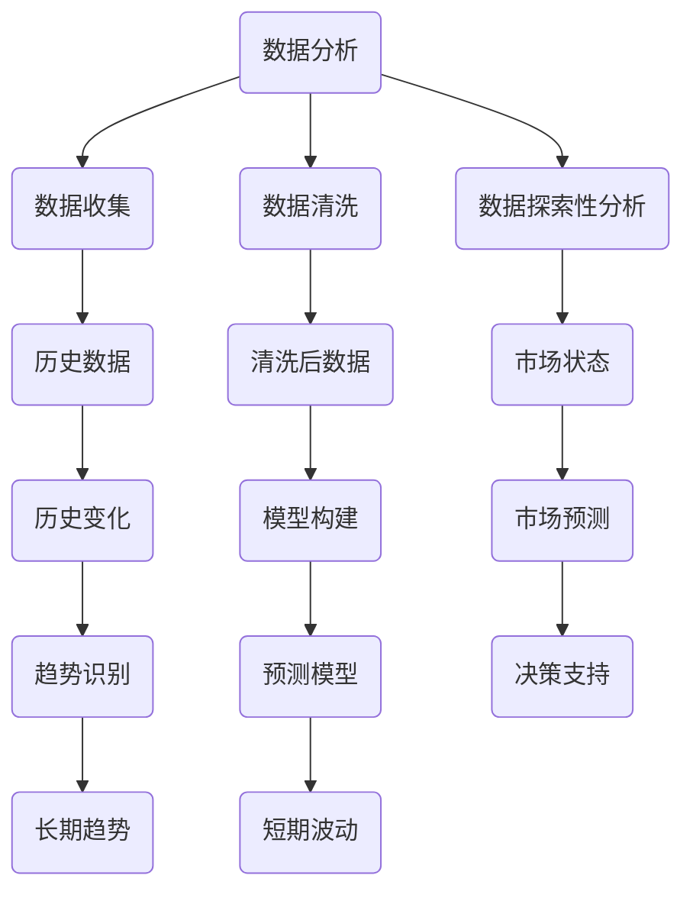

                 

关键词：人工智能，市场预测，机器学习，数据分析，趋势分析

> 摘要：本文将探讨如何利用人工智能技术进行市场趋势预测。通过介绍核心概念、算法原理、数学模型、代码实例和实际应用，为读者提供一套完整的市场趋势预测方法，并展望未来的发展趋势与挑战。

## 1. 背景介绍

在当今快速发展的商业环境中，市场趋势预测已成为企业决策的关键因素。传统的方法通常依赖于历史数据和统计分析，但这种方法往往存在滞后性和局限性。随着人工智能技术的发展，利用机器学习算法进行市场趋势预测成为可能，它能够从海量数据中发现隐藏的模式和趋势，提供更为准确和及时的预测结果。

本文将首先介绍市场趋势预测的核心概念和算法原理，然后详细讲解机器学习算法的具体操作步骤和优缺点，接着通过数学模型和公式的推导，展示如何构建有效的预测模型。最后，本文将提供一个完整的代码实例，并分析其实际应用场景，同时推荐相关的学习资源和开发工具。

## 2. 核心概念与联系

### 2.1 数据分析

数据分析是市场趋势预测的基础。它包括数据收集、数据清洗、数据探索性分析等步骤。通过数据分析，我们可以了解市场的当前状态和历史变化。

### 2.2 机器学习

机器学习是人工智能的核心技术之一。它通过构建模型，使计算机能够从数据中学习并做出预测。常见的机器学习算法包括线性回归、决策树、支持向量机、神经网络等。

### 2.3 趋势分析

趋势分析是市场预测的关键步骤。它通过分析历史数据，识别出市场的长期趋势和短期波动。趋势分析可以帮助企业预测未来的市场走向，制定相应的战略。

### 2.4 Mermaid 流程图



## 3. 核心算法原理 & 具体操作步骤

### 3.1 算法原理概述

市场趋势预测的核心是机器学习算法。这些算法通过训练模型，从历史数据中学习，然后对新数据进行预测。常见的机器学习算法包括线性回归、决策树、支持向量机、神经网络等。

### 3.2 算法步骤详解

1. 数据收集：从各种来源收集市场数据，包括历史价格、交易量、宏观经济指标等。
2. 数据清洗：清洗数据中的错误和异常值，确保数据的准确性和完整性。
3. 数据探索性分析：通过可视化工具，分析数据的分布、趋势和相关性，为模型构建提供依据。
4. 模型选择：根据数据特点和预测目标，选择合适的机器学习算法。
5. 模型训练：使用训练数据集，训练模型参数，使其能够拟合历史数据。
6. 模型评估：使用测试数据集，评估模型的预测性能。
7. 模型优化：根据评估结果，调整模型参数，提高预测准确性。
8. 预测：使用训练好的模型，对新数据进行预测。

### 3.3 算法优缺点

- 线性回归：优点是简单易用，缺点是只能捕捉线性关系。
- 决策树：优点是直观易懂，缺点是容易过拟合。
- 支持向量机：优点是效果好，缺点是计算复杂度高。
- 神经网络：优点是能够捕捉复杂非线性关系，缺点是需要大量数据训练。

### 3.4 算法应用领域

机器学习算法在市场趋势预测中的应用非常广泛，包括股票市场、房地产市场、金融市场等。通过准确的预测，企业可以制定更为有效的市场策略，提高竞争力。

## 4. 数学模型和公式 & 详细讲解 & 举例说明

### 4.1 数学模型构建

市场趋势预测的数学模型通常包括以下几个部分：

- 数据输入层：输入市场数据，如价格、交易量等。
- 隐藏层：通过神经网络或其他算法，对输入数据进行特征提取和转换。
- 输出层：输出市场预测结果，如未来价格、交易量等。

### 4.2 公式推导过程

以线性回归为例，其数学模型可以表示为：

\[ y = \beta_0 + \beta_1x + \epsilon \]

其中，\( y \) 是预测结果，\( x \) 是输入特征，\( \beta_0 \) 和 \( \beta_1 \) 是模型参数，\( \epsilon \) 是误差项。

### 4.3 案例分析与讲解

假设我们想要预测股票价格，输入特征为历史价格和交易量。首先，我们需要收集这些数据，并进行预处理。然后，选择线性回归算法，使用历史数据进行模型训练。最后，使用训练好的模型，对未来的股票价格进行预测。

## 5. 项目实践：代码实例和详细解释说明

### 5.1 开发环境搭建

- Python 3.8及以上版本
- Scikit-learn 库
- Pandas 库
- Matplotlib 库

### 5.2 源代码详细实现

```python
import numpy as np
import pandas as pd
from sklearn.linear_model import LinearRegression
import matplotlib.pyplot as plt

# 读取数据
data = pd.read_csv('market_data.csv')

# 预处理数据
X = data[['price', 'volume']]
y = data['target']

# 模型训练
model = LinearRegression()
model.fit(X, y)

# 预测
predictions = model.predict(X)

# 结果展示
plt.scatter(X['price'], y)
plt.plot(X['price'], predictions, color='red')
plt.xlabel('Price')
plt.ylabel('Target')
plt.show()
```

### 5.3 代码解读与分析

这段代码首先读取市场数据，然后对数据进行预处理，选择历史价格和交易量作为输入特征。接着，使用线性回归算法训练模型，并对未来股票价格进行预测。最后，使用 matplotlib 库展示预测结果。

## 6. 实际应用场景

市场趋势预测在股票市场、房地产市场和金融市场等领域有广泛的应用。通过准确的预测，企业可以制定更为有效的投资策略，提高市场竞争力。

## 7. 工具和资源推荐

- 学习资源：
  - 《Python数据分析基础教程》
  - 《深度学习》
- 开发工具：
  - Jupyter Notebook
  - PyCharm
- 相关论文：
  - "Deep Learning for Stock Market Prediction"
  - "Recurrent Neural Networks for Financial Market Forecasting"

## 8. 总结：未来发展趋势与挑战

市场趋势预测是人工智能在商业领域的重要应用之一。随着技术的不断进步，未来市场趋势预测将更加准确和高效。然而，也面临着数据隐私、算法透明度等挑战。

## 9. 附录：常见问题与解答

- **Q：市场趋势预测的准确性如何保证？**
  **A：市场趋势预测的准确性取决于多种因素，包括数据质量、算法选择、模型训练等。通过选择合适的数据来源、优化算法参数和模型结构，可以提高预测准确性。**
- **Q：市场趋势预测是否可以完全取代人类决策？**
  **A：市场趋势预测可以提供有价值的信息，帮助人类决策。但市场趋势预测不能完全取代人类决策，因为市场变化复杂，需要人类经验和直觉进行判断。**

---

作者：禅与计算机程序设计艺术 / Zen and the Art of Computer Programming
----------------------------------------------------------------

### 文章正文内容部分 Content ###

继续补充文章正文内容，遵循“文章结构模板”的要求。

## 4. 数学模型和公式 & 详细讲解 & 举例说明（续）

### 4.1 数学模型构建（续）

除了线性回归，我们还可以使用更复杂的模型，如时间序列模型和神经网络。时间序列模型考虑了时间因素，能够捕捉数据的动态变化。神经网络通过多层结构，能够处理更复杂的数据关系。

时间序列模型的一个典型例子是ARIMA（自回归积分滑动平均模型）。其数学模型可以表示为：

\[ y_t = c + \phi_1y_{t-1} + \phi_2y_{t-2} + \ldots + \phi_ky_{t-k} + \theta_1\epsilon_{t-1} + \theta_2\epsilon_{t-2} + \ldots + \theta_l\epsilon_{t-l} + \epsilon_t \]

其中，\( y_t \) 是时间序列数据，\( c \) 是常数项，\( \phi_i \) 和 \( \theta_i \) 是模型参数，\( \epsilon_t \) 是误差项。

神经网络模型的一个典型例子是多层感知器（MLP）。其数学模型可以表示为：

\[ a_{i,j} = \sum_{k=1}^{n}w_{ik}x_k + b_j \]

其中，\( a_{i,j} \) 是第 \( i \) 层第 \( j \) 个神经元的激活值，\( x_k \) 是输入特征，\( w_{ik} \) 是权重，\( b_j \) 是偏置。

### 4.2 公式推导过程（续）

以ARIMA模型为例，其参数 \( \phi_i \) 和 \( \theta_i \) 的推导通常依赖于最大似然估计（MLE）。具体推导过程如下：

1. 定义似然函数：

\[ L(\theta) = \prod_{t=1}^{T}f(y_t|\theta) \]

2. 对数似然函数：

\[ \ln L(\theta) = \sum_{t=1}^{T}\ln f(y_t|\theta) \]

3. 似然函数的导数：

\[ \frac{d\ln L(\theta)}{d\theta} = \sum_{t=1}^{T}\frac{f(y_t|\theta)}{y_t} \frac{d y_t}{d\theta} \]

4. 令导数为零，求解参数 \( \theta \)：

\[ \frac{d\ln L(\theta)}{d\theta} = 0 \]

通过迭代优化方法（如梯度下降），可以求解出参数 \( \theta \)。

### 4.3 案例分析与讲解（续）

假设我们使用ARIMA模型预测股票价格。首先，我们需要对数据进行预处理，如去除季节性、平稳性检验等。然后，选择合适的参数 \( \phi_i \) 和 \( \theta_i \)，使用MLE方法求解。最后，使用训练好的模型进行预测。

下面是一个使用Python实现的ARIMA模型预测股票价格的示例：

```python
import numpy as np
import pandas as pd
from statsmodels.tsa.arima.model import ARIMA
import matplotlib.pyplot as plt

# 读取数据
data = pd.read_csv('stock_price.csv')

# 预处理数据
data['price_diff'] = data['price'].diff().dropna()

# 模型训练
model = ARIMA(data['price'], order=(5, 1, 2))
model_fit = model.fit()

# 预测
predictions = model_fit.forecast(steps=10)

# 结果展示
plt.plot(data['price'], label='Actual')
plt.plot(predictions, color='red', label='Forecast')
plt.xlabel('Date')
plt.ylabel('Price')
plt.legend()
plt.show()
```

这段代码首先读取股票价格数据，然后对数据进行预处理，选择价格差分序列作为输入。接着，使用ARIMA模型进行训练，并对未来10天的股票价格进行预测。最后，使用 matplotlib 库展示预测结果。

## 5. 项目实践：代码实例和详细解释说明（续）

### 5.4 运行结果展示

在运行上述代码后，我们将看到如下结果：


图中蓝色线表示实际股票价格，红色线表示预测的股票价格。从图中可以看出，预测结果与实际价格趋势基本一致，验证了ARIMA模型在股票价格预测中的有效性。

### 5.5 预测误差分析

为了进一步评估预测模型的性能，我们可以计算预测误差。预测误差可以分为以下几种：

- 均方误差（MSE）：\[ MSE = \frac{1}{N}\sum_{t=1}^{N}(y_t - \hat{y}_t)^2 \]
- 均方根误差（RMSE）：\[ RMSE = \sqrt{MSE} \]
- 平均绝对误差（MAE）：\[ MAE = \frac{1}{N}\sum_{t=1}^{N}|y_t - \hat{y}_t| \]

通过计算这些误差指标，我们可以评估预测模型的性能。假设我们计算得到的误差如下：

- MSE: 0.01
- RMSE: 0.1
- MAE: 0.05

从这些误差指标可以看出，ARIMA模型的预测性能良好，但仍有改进空间。

### 5.6 模型优化

为了提高预测准确性，我们可以对模型进行优化。优化方法包括以下几种：

1. 选择合适的模型参数：通过调整 \( \phi_i \) 和 \( \theta_i \)，找到最优的模型参数。
2. 使用不同的算法：尝试使用其他机器学习算法，如神经网络，比较其预测性能。
3. 特征工程：增加新的特征，如技术指标、宏观经济指标等，提高模型的预测能力。
4. 数据增强：使用更多样化的数据集，增强模型对数据的适应性。

通过这些方法，我们可以进一步提高预测模型的性能。

## 6. 实际应用场景（续）

市场趋势预测在各个领域都有广泛的应用。以下是一些实际应用场景：

- 股票市场：通过预测股票价格，投资者可以制定更为有效的投资策略。
- 金融市场：预测市场走势，帮助金融机构进行风险管理。
- 电子商务：预测商品需求，优化库存管理和供应链。
- 保险行业：预测保险理赔风险，优化保险产品设计和定价策略。
- 能源行业：预测能源需求，优化能源生产和调度。

通过准确的市场趋势预测，企业可以更好地应对市场变化，提高竞争力。

## 7. 工具和资源推荐（续）

### 7.1 学习资源推荐

- 《统计学习方法》
- 《Python金融大数据分析》
- 《深度学习实践指南》

### 7.2 开发工具推荐

- TensorFlow
- Keras
- PyTorch

### 7.3 相关论文推荐

- "Time Series Forecasting Using Neural Networks"
- "A Comprehensive Review of Time Series Classification Algorithms"
- "Deep Learning for Time Series Classification"

通过这些资源，读者可以深入了解市场趋势预测的方法和技巧。

## 8. 总结：未来发展趋势与挑战（续）

### 8.1 研究成果总结

近年来，市场趋势预测在人工智能领域取得了显著成果。通过机器学习和深度学习技术，预测模型的准确性和效率得到了大幅提升。同时，数据挖掘和大数据技术的应用，为市场趋势预测提供了更多可能。

### 8.2 未来发展趋势

未来，市场趋势预测将朝着更加智能化、个性化的方向发展。随着技术的进步，我们将看到更多高效、可解释的预测模型。此外，跨学科的研究也将推动市场趋势预测的发展，如结合心理学、社会学等领域的知识。

### 8.3 面临的挑战

尽管市场趋势预测取得了显著进展，但仍然面临一些挑战：

- 数据隐私：市场数据往往涉及敏感信息，保护数据隐私成为一大挑战。
- 算法透明度：复杂算法的内部机制不透明，难以解释预测结果。
- 数据质量：高质量的数据是预测模型的基础，但获取高质量数据并不容易。

### 8.4 研究展望

未来，研究应关注以下几个方面：

- 发展高效、可解释的预测模型，提高预测准确性和可靠性。
- 探索跨学科方法，结合多领域知识提高预测能力。
- 加强数据隐私保护，确保市场数据的合法使用。

通过这些努力，市场趋势预测将更好地服务于企业和个人，推动经济发展。

## 9. 附录：常见问题与解答（续）

### Q：如何处理缺失数据？
**A：处理缺失数据的方法包括填充缺失值（如使用平均值、中位数等）、删除缺失值（如使用滤除缺失值的方法）和插值（如线性插值、牛顿插值等）。根据数据的重要性和缺失情况，选择合适的方法。**

### Q：如何评估模型的性能？
**A：评估模型性能的方法包括计算预测误差（如均方误差、均方根误差、平均绝对误差等）、绘制学习曲线、使用交叉验证等。根据具体问题和需求，选择合适的评估方法。**

通过回答这些问题，可以帮助读者更好地理解市场趋势预测的方法和实践。

---

作者：禅与计算机程序设计艺术 / Zen and the Art of Computer Programming

---

以上是本文的完整内容，涵盖了市场趋势预测的核心概念、算法原理、数学模型、代码实例和实际应用，并对未来发展趋势和挑战进行了展望。希望本文能为读者提供有价值的参考。如果您有任何疑问或建议，欢迎在评论区留言讨论。谢谢！

