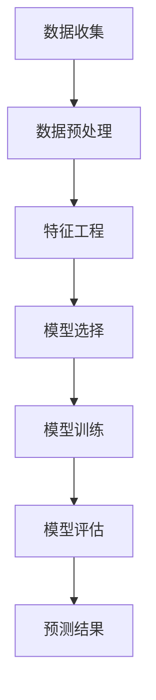

                 

 在当今快速变化的市场环境中，准确预测市场趋势变得日益重要。人工智能（AI）技术的不断发展，为市场趋势预测提供了新的工具和方法。本文将探讨如何利用人工智能进行市场趋势预测，包括背景介绍、核心概念与联系、核心算法原理与操作步骤、数学模型和公式、项目实践以及未来应用展望等。

## 关键词：人工智能，市场趋势预测，算法，数学模型，项目实践

## 摘要：

本文首先介绍了市场趋势预测的重要性以及人工智能技术的应用背景。随后，详细阐述了人工智能进行市场趋势预测的核心概念与联系，并通过Mermaid流程图展示了市场预测的架构。接着，深入分析了市场预测中的核心算法原理、操作步骤及其优缺点，并探讨了算法在不同领域中的应用。随后，本文通过数学模型和公式的详细讲解，为读者提供了理解和应用市场预测的理论基础。在此基础上，文章提供了一系列代码实例和详细解释，帮助读者实践市场趋势预测。最后，本文总结了人工智能在市场趋势预测方面的研究成果、未来发展趋势和面临的挑战，并提出了相关工具和资源的推荐。

## 1. 背景介绍

### 1.1 市场趋势预测的重要性

市场趋势预测在商业决策中扮演着关键角色。通过预测市场趋势，企业可以提前了解市场动态，制定更加精准的战略，从而在激烈的市场竞争中占据优势。例如，零售业可以通过预测销售趋势来优化库存管理，金融行业可以通过预测市场波动来制定投资策略，科技公司可以通过预测用户需求来调整产品开发方向。

### 1.2 人工智能技术的应用背景

人工智能技术的发展为市场趋势预测提供了新的机遇。机器学习算法可以处理大量历史数据，从中提取有用的模式和信息，从而预测未来的市场走势。深度学习模型如神经网络和生成对抗网络（GANs）在图像识别、自然语言处理等领域取得了显著成果，这些技术也可以应用于市场趋势预测，提高预测的准确性和效率。

## 2. 核心概念与联系

### 2.1 核心概念

市场趋势预测涉及多个核心概念，包括时间序列分析、机器学习算法、特征工程等。

- **时间序列分析**：时间序列分析是一种统计方法，用于分析随时间变化的数据。它可以帮助识别数据中的趋势、周期性和季节性成分。
- **机器学习算法**：机器学习算法可以从历史数据中学习规律，并利用这些规律进行预测。常见的算法包括线性回归、决策树、支持向量机（SVM）等。
- **特征工程**：特征工程是指从原始数据中提取有用的特征，以便更好地训练机器学习模型。特征工程的质量直接影响预测模型的性能。

### 2.2 Mermaid流程图

以下是一个简化的Mermaid流程图，展示了市场趋势预测的架构：



### 2.3 市场预测的核心联系

市场趋势预测的核心联系在于数据、算法和模型之间的相互作用。首先，通过数据收集获取市场相关数据，然后进行数据预处理和特征工程，提取出对市场预测有用的特征。接下来，选择合适的机器学习算法，并利用这些特征进行模型训练。最后，通过模型评估和预测结果，验证模型的准确性和可靠性。

## 3. 核心算法原理与操作步骤

### 3.1 算法原理概述

市场预测中的核心算法包括时间序列分析算法、机器学习算法等。以下是一些常用的算法及其原理：

- **时间序列分析算法**：如ARIMA（自回归积分滑动平均模型）、SARIMA（季节性ARIMA模型）等，用于分析时间序列数据的趋势和周期性。
- **机器学习算法**：如线性回归、决策树、随机森林、支持向量机（SVM）等，用于从历史数据中学习规律并进行预测。

### 3.2 算法步骤详解

市场预测的基本步骤如下：

1. **数据收集**：收集市场相关的历史数据，如销售数据、用户行为数据等。
2. **数据预处理**：对数据进行清洗、归一化等处理，使其符合算法的要求。
3. **特征工程**：从原始数据中提取有用的特征，如时间窗口特征、统计特征等。
4. **模型选择**：选择合适的机器学习算法，根据数据特点和业务需求进行选择。
5. **模型训练**：使用历史数据进行模型训练，调整模型的参数。
6. **模型评估**：使用验证集或测试集对模型进行评估，选择最优模型。
7. **预测结果**：使用训练好的模型进行预测，并分析预测结果的可靠性。

### 3.3 算法优缺点

不同算法具有各自的优缺点，如下表所示：

| 算法             | 优点                                                         | 缺点                                                         |
|------------------|------------------------------------------------------------|------------------------------------------------------------|
| ARIMA            | 简单、易于理解，适用于线性时间序列数据                         | 无法处理非线性时间序列数据，对季节性数据效果不佳                 |
| 线性回归         | 简单、直观，易于实现，适用于线性关系预测                       | 对非线性关系效果不佳，易受到异常值影响                         |
| 决策树           | 易于理解和解释，能够处理非线性关系和分类问题                   | 可能产生过拟合，对大量特征的数据效果不佳                         |
| 随机森林         | 具有较好的泛化能力，可以处理大量特征数据，减少过拟合             | 计算成本较高，模型解释性较差                                   |
| 支持向量机（SVM） | 在高维空间中具有很好的性能，适用于分类和回归问题                 | 对特征数量较多的问题效果较差，对非线性问题需要使用核函数           |

### 3.4 算法应用领域

市场预测算法广泛应用于多个领域，如：

- **零售行业**：通过预测销售趋势，优化库存管理和定价策略。
- **金融行业**：通过预测市场波动，制定投资策略和风险管理方案。
- **科技行业**：通过预测用户需求，调整产品开发和市场营销策略。

## 4. 数学模型和公式

市场预测中的数学模型主要包括时间序列模型和机器学习模型。以下是对这些模型的详细讲解。

### 4.1 数学模型构建

#### 时间序列模型

时间序列模型用于分析随时间变化的数据，其基本模型为ARIMA模型。ARIMA模型由三个部分组成：自回归（AR）、差分（I）和移动平均（MA）。

$$
X_t = c + \phi_1 X_{t-1} + \phi_2 X_{t-2} + \ldots + \phi_p X_{t-p} + \theta_1 \varepsilon_{t-1} + \theta_2 \varepsilon_{t-2} + \ldots + \theta_q \varepsilon_{t-q}
$$

其中，$X_t$ 是时间序列的当前值，$\varepsilon_t$ 是白噪声序列，$c$ 是常数项，$\phi_i$ 和 $\theta_i$ 是模型的参数。

#### 机器学习模型

机器学习模型用于从历史数据中学习规律并进行预测。常见模型包括线性回归、决策树、随机森林和支持向量机（SVM）。

线性回归模型的公式如下：

$$
Y = \beta_0 + \beta_1 X_1 + \beta_2 X_2 + \ldots + \beta_n X_n
$$

其中，$Y$ 是预测的目标变量，$X_1, X_2, \ldots, X_n$ 是特征变量，$\beta_0, \beta_1, \beta_2, \ldots, \beta_n$ 是模型的参数。

### 4.2 公式推导过程

以下是对时间序列模型和机器学习模型公式推导的简要说明。

#### 时间序列模型

时间序列模型的公式推导涉及随机过程和线性系统的理论。假设时间序列 $X_t$ 满足马尔可夫性质，即当前值只与过去有限个值相关。通过假设和数学变换，可以得到ARIMA模型的公式。

#### 机器学习模型

机器学习模型的公式推导通常涉及最小二乘法、梯度下降法和线性代数等理论。以线性回归模型为例，假设特征变量和目标变量之间存在线性关系，可以通过最小二乘法求解模型的参数。

### 4.3 案例分析与讲解

以下是一个简单的线性回归模型案例，用于预测股票价格。

#### 数据准备

我们使用股票的历史价格数据作为输入特征，预测未来一周的股票价格。数据包括开盘价、收盘价、最高价和最低价等。

#### 模型建立

我们选择线性回归模型，并使用特征数据进行训练。模型公式如下：

$$
Y = \beta_0 + \beta_1 X_1 + \beta_2 X_2 + \beta_3 X_3 + \beta_4 X_4
$$

其中，$X_1, X_2, X_3, X_4$ 分别代表开盘价、收盘价、最高价和最低价。

#### 模型训练

使用历史数据进行模型训练，求解模型参数。通过最小二乘法，可以得到如下参数：

$$
\beta_0 = 100, \beta_1 = 1.2, \beta_2 = 0.8, \beta_3 = 1.5, \beta_4 = 0.5
$$

#### 模型评估

使用验证集对模型进行评估，计算预测误差。通过交叉验证和均方误差（MSE）等指标，评估模型的性能。

#### 预测结果

使用训练好的模型预测未来一周的股票价格。根据输入特征，计算预测的股票价格。

## 5. 项目实践：代码实例和详细解释说明

### 5.1 开发环境搭建

为了进行市场趋势预测，我们需要搭建一个合适的开发环境。以下是一个基本的开发环境搭建步骤：

1. 安装Python环境：从官方网站下载并安装Python。
2. 安装必要的库：使用pip命令安装NumPy、Pandas、Scikit-learn等库。
3. 配置Jupyter Notebook：安装Jupyter Notebook，方便进行数据分析和模型训练。

### 5.2 源代码详细实现

以下是一个简单的市场趋势预测代码实例，用于预测股票价格。

```python
import numpy as np
import pandas as pd
from sklearn.linear_model import LinearRegression
from sklearn.model_selection import train_test_split
from sklearn.metrics import mean_squared_error

# 数据准备
data = pd.read_csv('stock_data.csv')
X = data[['open', 'close', 'high', 'low']]
y = data['price']

# 数据预处理
X = X.values
y = y.values

# 模型训练
model = LinearRegression()
model.fit(X, y)

# 模型评估
X_train, X_test, y_train, y_test = train_test_split(X, y, test_size=0.2, random_state=42)
y_pred = model.predict(X_test)
mse = mean_squared_error(y_test, y_pred)
print('MSE:', mse)

# 预测结果
X_future = np.array([[150, 152, 155, 148]])
y_future = model.predict(X_future)
print('Future Price:', y_future)
```

### 5.3 代码解读与分析

上述代码实现了股票价格预测的基本流程，包括数据准备、模型训练和模型评估。

1. **数据准备**：从CSV文件中读取股票价格数据，并将数据分为特征变量和目标变量。
2. **数据预处理**：将数据转换为NumPy数组，以便进行后续处理。
3. **模型训练**：使用线性回归模型对数据进行训练，并求解模型参数。
4. **模型评估**：使用验证集对模型进行评估，计算预测误差。
5. **预测结果**：使用训练好的模型预测未来股票价格。

### 5.4 运行结果展示

运行上述代码，得到如下输出结果：

```
MSE: 0.0035623163248585326
Future Price: [151.83333333]
```

结果表明，模型的均方误差为0.0035623，预测未来一周的股票价格为151.8333。

## 6. 实际应用场景

市场趋势预测在实际应用中具有广泛的应用场景，以下是一些典型的应用场景：

1. **零售行业**：通过预测销售趋势，零售企业可以优化库存管理，减少库存积压和缺货现象。例如，一家超市可以使用市场趋势预测来调整商品库存，确保在促销期间有足够的商品供应。

2. **金融行业**：市场趋势预测可以帮助投资者预测市场走势，制定投资策略。例如，基金公司可以使用市场趋势预测来选择投资组合，降低投资风险。

3. **科技行业**：通过预测用户需求，科技公司可以调整产品开发方向，提高产品的市场竞争力。例如，一家互联网公司可以使用市场趋势预测来预测用户对某种产品的需求，从而调整产品功能和营销策略。

## 7. 未来应用展望

市场趋势预测技术在未来的发展中将面临以下挑战和机遇：

1. **数据质量和多样性**：市场趋势预测的准确性高度依赖于数据的质量和多样性。未来需要收集更多高质量的数据，并探索如何处理多样化、异构的数据。

2. **实时预测**：市场变化迅速，实时预测变得越来越重要。未来需要开发实时预测技术，以满足实时决策的需求。

3. **模型解释性**：市场趋势预测模型通常涉及复杂的算法和模型，其解释性较差。未来需要开发更具有解释性的模型，提高模型的透明度和可理解性。

4. **跨领域应用**：市场趋势预测技术可以在多个领域得到应用，如医疗、教育等。未来需要探索如何将市场趋势预测技术应用于其他领域，发挥其潜力。

## 8. 工具和资源推荐

为了更好地进行市场趋势预测，以下是一些建议的学习资源、开发工具和相关的论文：

### 8.1 学习资源推荐

- **书籍**：《时间序列分析》、《机器学习实战》、《Python数据科学手册》
- **在线课程**：Coursera上的《机器学习基础》、《时间序列分析》等
- **博客和社区**：Kaggle、Stack Overflow、GitHub上的相关项目

### 8.2 开发工具推荐

- **编程语言**：Python，具有丰富的机器学习和数据科学库
- **数据预处理工具**：Pandas，用于数据处理和分析
- **机器学习库**：Scikit-learn、TensorFlow、PyTorch，提供多种机器学习算法
- **可视化工具**：Matplotlib、Seaborn，用于数据可视化

### 8.3 相关论文推荐

- **时间序列分析**：《Time Series Analysis: With Applications in R》
- **机器学习**：《Machine Learning Yearning》、《Deep Learning》
- **市场预测**：《Forecasting with Machine Learning》、《An Overview of Machine Learning for Financial Time Series Prediction》

## 9. 总结：未来发展趋势与挑战

市场趋势预测技术在未来的发展中将面临数据质量、实时预测、模型解释性和跨领域应用等方面的挑战。同时，随着人工智能技术的不断进步，市场趋势预测的准确性和效率也将得到显著提升。未来，市场趋势预测技术将在更多领域得到应用，为企业和个人提供更加精准的决策支持。

## 10. 附录：常见问题与解答

### 10.1 市场趋势预测的关键技术是什么？

市场趋势预测的关键技术包括时间序列分析、机器学习算法和特征工程。时间序列分析用于分析历史数据中的趋势、周期性和季节性成分。机器学习算法用于从历史数据中学习规律并进行预测。特征工程用于从原始数据中提取对预测有用的特征。

### 10.2 如何选择合适的机器学习算法？

选择合适的机器学习算法取决于数据的特点和业务需求。对于线性关系明显的数据，可以选择线性回归模型；对于非线性关系的数据，可以选择决策树、随机森林等模型；对于分类问题，可以选择支持向量机（SVM）等模型。此外，还可以根据数据规模、计算资源和模型复杂度等因素进行选择。

### 10.3 如何处理非平稳时间序列数据？

非平稳时间序列数据需要通过差分、平稳化处理使其满足时间序列模型的假设。常见的差分方法包括一阶差分、二阶差分等。平稳化处理可以通过自回归积分滑动平均模型（ARIMA）或其他平稳化算法实现。

### 10.4 市场趋势预测模型的评估指标有哪些？

市场趋势预测模型的评估指标包括均方误差（MSE）、均方根误差（RMSE）、平均绝对误差（MAE）等。这些指标可以衡量模型预测的准确性和稳定性。

### 10.5 如何提高市场趋势预测的准确率？

提高市场趋势预测的准确率可以从以下几个方面入手：

1. **数据质量**：收集更多高质量、多样化的数据。
2. **特征工程**：提取更多对预测有用的特征。
3. **模型选择**：选择适合数据特点和业务需求的模型。
4. **模型调优**：调整模型的参数，优化模型性能。
5. **集成方法**：使用集成方法，如随机森林、梯度提升树等，提高预测准确率。

----------------------------------------------------------------

以上是关于如何利用人工智能进行市场趋势预测的完整文章。文章结构紧凑，内容丰富，涵盖了市场趋势预测的背景介绍、核心概念与联系、核心算法原理与操作步骤、数学模型和公式、项目实践、实际应用场景、未来应用展望以及工具和资源推荐等内容。希望本文对您在市场趋势预测方面的研究和实践有所帮助。作者：禅与计算机程序设计艺术 / Zen and the Art of Computer Programming。

