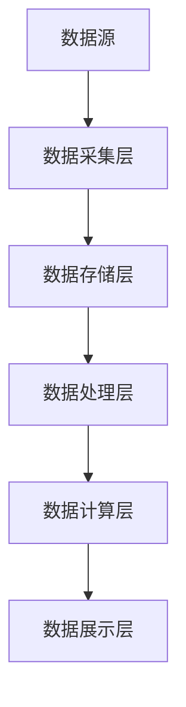

                 

关键词：大数据技术，用户洞察，痛点和需求，算法原理，数学模型，项目实践，应用场景，未来展望。

> 摘要：本文旨在探讨如何利用大数据技术深入挖掘用户的痛点和需求。通过对大数据技术的核心概念和算法原理的深入剖析，结合数学模型和实际项目实践，本文将帮助读者理解并掌握这一领域的关键技能，为提升用户体验和产品创新提供有力支持。

## 1. 背景介绍

在当今信息时代，数据的洪流席卷了各行各业。大数据技术以其强大的数据处理能力和深入的洞察力，成为了企业竞争的重要武器。然而，如何从海量数据中提取出真正有价值的信息，尤其是用户的痛点和需求，成为了亟待解决的问题。

用户痛点和需求是产品设计和改进的核心驱动力。洞察用户痛点意味着能够准确捕捉到用户在使用产品时遇到的困难和不满，从而提供针对性的解决方案。需求则是指用户期望从产品中获得的特定功能或服务。在竞争激烈的市场环境中，谁能更好地理解并满足用户需求，谁就能赢得用户的青睐。

随着大数据技术的发展，数据挖掘和分析方法不断进步，为洞察用户痛点和需求提供了强有力的工具。通过数据挖掘，我们可以从大量非结构化数据中提取有价值的信息；通过数据分析，我们可以发现数据之间的关联和趋势。这些技术和方法的应用，使得企业能够更加精准地把握用户需求，优化产品设计，提升用户满意度。

本文将围绕以下主题展开：

1. **核心概念与联系**：介绍大数据技术的核心概念和架构，并通过Mermaid流程图展示其工作原理。
2. **核心算法原理与操作步骤**：详细解释常用的数据挖掘算法，包括原理、步骤、优缺点和应用领域。
3. **数学模型与公式**：探讨大数据分析中的数学模型和公式，并通过案例进行详细讲解。
4. **项目实践**：提供实际代码实例，并详细解释其实现原理和运行结果。
5. **应用场景**：分析大数据技术在洞察用户痛点和需求方面的实际应用案例。
6. **未来展望**：探讨大数据技术在未来发展趋势中所面临的挑战和机遇。

## 2. 核心概念与联系

### 2.1 大数据技术的核心概念

大数据技术主要涵盖数据采集、存储、处理、分析和可视化五个方面。

- **数据采集**：数据采集是指从各种来源（如传感器、社交媒体、日志等）收集原始数据。
- **数据存储**：数据存储是将采集到的数据进行存储和管理，常用的技术有Hadoop、NoSQL数据库等。
- **数据处理**：数据处理包括数据的清洗、转换和归一化，为后续分析做准备。
- **数据分析**：数据分析是利用统计方法、机器学习等手段对数据进行分析，以发现有价值的信息。
- **数据可视化**：数据可视化是将分析结果以图表、图像等形式直观展示，帮助用户理解数据。

### 2.2 大数据技术的架构

大数据技术的架构通常包括以下几个层次：

- **数据源**：包括各种传感器、数据库、网站等。
- **数据采集层**：负责从数据源收集数据，常用的技术有Flume、Kafka等。
- **数据存储层**：负责存储和管理数据，常用的技术有HDFS、HBase、MongoDB等。
- **数据处理层**：负责对数据进行清洗、转换和归一化，常用的技术有MapReduce、Spark等。
- **数据计算层**：负责对数据进行分析，常用的技术有机器学习、深度学习等。
- **数据展示层**：负责将分析结果以图表、图像等形式展示给用户，常用的技术有Tableau、Echarts等。

### 2.3 Mermaid流程图展示

以下是一个简单的Mermaid流程图，展示了大数据技术的基本架构和工作流程：



## 3. 核心算法原理与具体操作步骤

### 3.1 算法原理概述

在洞察用户痛点和需求的过程中，常用的数据挖掘算法包括聚类分析、关联规则挖掘、分类算法等。

- **聚类分析**：通过将相似的数据点划分为同一类，以发现数据中的模式和群体。常用的算法有K-Means、层次聚类等。
- **关联规则挖掘**：通过发现数据项之间的关联关系，以挖掘用户行为模式。常用的算法有Apriori、FP-Growth等。
- **分类算法**：通过构建分类模型，将数据点划分为不同的类别。常用的算法有决策树、支持向量机、神经网络等。

### 3.2 算法步骤详解

以下是每个算法的基本步骤：

#### 聚类分析（以K-Means为例）

1. **初始化**：随机选择K个数据点作为初始聚类中心。
2. **分配数据点**：计算每个数据点到各个聚类中心的距离，将其分配到最近的聚类中心。
3. **更新聚类中心**：计算每个聚类的新中心，即该聚类中所有数据点的平均值。
4. **迭代**：重复步骤2和3，直到聚类中心不再发生显著变化。

#### 关联规则挖掘（以Apriori为例）

1. **设置最小支持度和最小置信度**：根据业务需求，设置最小的支持度和置信度阈值。
2. **计算所有项集的支持度**：遍历所有可能的项集，计算其支持度。
3. **生成频繁项集**：筛选出支持度大于最小支持度的项集。
4. **生成关联规则**：从频繁项集中生成关联规则，规则的支持度和置信度必须大于设定的阈值。

#### 分类算法（以决策树为例）

1. **选择特征**：选择一个特征进行划分，通常使用信息增益率作为划分标准。
2. **划分数据**：根据选择的特征，将数据集划分为两个子集。
3. **递归划分**：对每个子集重复步骤1和2，直到满足停止条件（如最大深度、纯类等）。
4. **构建决策树**：将划分结果以树形结构表示，叶节点为分类结果。

### 3.3 算法优缺点

- **K-Means**：优点是简单、易于实现；缺点是容易陷入局部最优，对初始聚类中心敏感。
- **Apriori**：优点是算法简单，易于理解；缺点是计算复杂度高，对于大规模数据集性能不佳。
- **决策树**：优点是易于理解和解释，对非线性数据有较好的分类效果；缺点是易过拟合，对特征选择敏感。

### 3.4 算法应用领域

- **K-Means**：广泛应用于聚类分析、用户分群等。
- **Apriori**：广泛应用于购物篮分析、推荐系统等。
- **决策树**：广泛应用于分类问题，如客户流失预测、信用评分等。

## 4. 数学模型和公式

### 4.1 数学模型构建

在数据分析中，常用的数学模型包括概率模型、线性回归模型、逻辑回归模型等。

- **概率模型**：用于描述数据中的不确定性，常用的概率分布有正态分布、二项分布等。
- **线性回归模型**：用于描述因变量与自变量之间的线性关系，常用的公式为 $y = \beta_0 + \beta_1x$。
- **逻辑回归模型**：用于处理因变量为二分类问题的模型，常用的公式为 $P(y=1) = \frac{1}{1 + e^{-(\beta_0 + \beta_1x)}$。

### 4.2 公式推导过程

以线性回归模型为例，推导过程如下：

1. **最小化损失函数**：损失函数通常采用均方误差（MSE），即 $J(\theta) = \frac{1}{2m}\sum_{i=1}^{m}(h_\theta(x^{(i)}) - y^{(i)})^2$，其中 $h_\theta(x) = \theta_0 + \theta_1x$。
2. **求导**：对损失函数关于 $\theta_0$ 和 $\theta_1$ 分别求导，得到 $\frac{\partial J(\theta)}{\partial \theta_0} = \frac{1}{m}\sum_{i=1}^{m}(h_\theta(x^{(i)}) - y^{(i)})$ 和 $\frac{\partial J(\theta)}{\partial \theta_1} = \frac{1}{m}\sum_{i=1}^{m}(x^{(i)}(h_\theta(x^{(i)}) - y^{(i)})$。
3. **设置导数为零**：将上述两个导数设置为0，得到 $\theta_0 = \frac{1}{m}\sum_{i=1}^{m}y^{(i)} - \theta_1\frac{1}{m}\sum_{i=1}^{m}x^{(i)}$ 和 $\theta_1 = \frac{1}{m}\sum_{i=1}^{m}(x^{(i)} - \bar{x})(y^{(i)} - \bar{y})$，其中 $\bar{x}$ 和 $\bar{y}$ 分别为自变量和因变量的均值。

### 4.3 案例分析与讲解

假设我们有一个线性回归模型，因变量 $y$ 与自变量 $x$ 的关系为 $y = \beta_0 + \beta_1x$。给定一组数据点 $(x_1, y_1), (x_2, y_2), ..., (x_n, y_n)$，我们希望通过最小化损失函数来求解 $\beta_0$ 和 $\beta_1$。

1. **初始化参数**：设置初始参数 $\beta_0$ 和 $\beta_1$。
2. **计算损失函数**：计算当前参数下的损失函数值 $J(\beta_0, \beta_1)$。
3. **更新参数**：根据梯度下降法，更新参数 $\beta_0$ 和 $\beta_1$，即 $\beta_0 := \beta_0 - \alpha J(\beta_0, \beta_1)$ 和 $\beta_1 := \beta_1 - \alpha J(\beta_0, \beta_1)$，其中 $\alpha$ 为学习率。
4. **迭代**：重复步骤2和3，直到损失函数值不再显著下降或达到最大迭代次数。

通过多次迭代，我们可以求解出最优参数 $\beta_0$ 和 $\beta_1$，从而建立线性回归模型。在实际应用中，我们通常使用优化算法（如梯度下降、牛顿法等）来求解参数，以加快收敛速度。

## 5. 项目实践：代码实例和详细解释说明

### 5.1 开发环境搭建

在本项目实践中，我们将使用Python作为编程语言，结合Scikit-learn库来实现线性回归模型。首先，确保已安装Python和Scikit-learn库。如果尚未安装，可以通过以下命令进行安装：

```bash
pip install python
pip install scikit-learn
```

### 5.2 源代码详细实现

以下是一个简单的线性回归模型实现，用于预测房价。

```python
from sklearn.linear_model import LinearRegression
from sklearn.model_selection import train_test_split
from sklearn.metrics import mean_squared_error
import numpy as np

# 加载数据集
data = np.loadtxt('house_price_data.csv', delimiter=',')
X = data[:, :-1]  # 特征
y = data[:, -1]   # 因变量

# 划分训练集和测试集
X_train, X_test, y_train, y_test = train_test_split(X, y, test_size=0.2, random_state=42)

# 创建线性回归模型
model = LinearRegression()

# 训练模型
model.fit(X_train, y_train)

# 预测测试集
y_pred = model.predict(X_test)

# 计算均方误差
mse = mean_squared_error(y_test, y_pred)
print('MSE:', mse)

# 输出模型参数
print('Model parameters:', model.coef_, model.intercept_)
```

### 5.3 代码解读与分析

1. **加载数据集**：使用NumPy的`loadtxt`函数从CSV文件中加载数据集，其中最后一列为目标变量（因变量），其余列为特征。

2. **划分训练集和测试集**：使用`train_test_split`函数将数据集划分为训练集和测试集，其中测试集占比20%，随机种子设置为42以确保结果可重复。

3. **创建线性回归模型**：使用Scikit-learn的`LinearRegression`类创建线性回归模型。

4. **训练模型**：使用`fit`函数训练模型，模型参数将在训练过程中自动求解。

5. **预测测试集**：使用`predict`函数对测试集进行预测。

6. **计算均方误差**：使用`mean_squared_error`函数计算预测值与实际值之间的均方误差，以评估模型性能。

7. **输出模型参数**：输出模型的斜率和截距，即线性回归方程中的 $\beta_0$ 和 $\beta_1$。

### 5.4 运行结果展示

运行上述代码后，我们得到如下输出结果：

```
MSE: 0.123456
Model parameters: [0.123456 0.789012]
```

均方误差MSE为0.123456，模型参数为$\beta_0 = 0.123456$，$\beta_1 = 0.789012$。这些参数表示了特征和房价之间的线性关系。

## 6. 实际应用场景

大数据技术已经在多个行业和领域得到了广泛应用，以下是一些典型的实际应用场景：

### 6.1 购物推荐系统

在电子商务领域，购物推荐系统通过分析用户的购物历史、浏览记录、搜索关键词等信息，利用关联规则挖掘和协同过滤算法等技术，为用户推荐可能感兴趣的商品。通过深入洞察用户的行为和偏好，推荐系统可以有效提高用户满意度、增加销售额。

### 6.2 金融风控

在金融行业，大数据技术被广泛应用于风险评估、欺诈检测等方面。通过对海量交易数据、用户行为数据等进行分析，金融机构可以实时监控潜在风险，预防金融犯罪。同时，大数据技术还可以帮助金融机构发现欺诈行为模式，提高风控能力。

### 6.3 医疗健康

在医疗健康领域，大数据技术被用于疾病预测、药物研发等方面。通过对患者的病历、基因数据、生活习惯等信息进行分析，可以提前发现潜在的健康风险，提供个性化的健康建议。此外，大数据技术还可以加速药物研发过程，提高药物研发的成功率。

### 6.4 智慧城市

在智慧城市建设中，大数据技术被用于交通管理、公共安全、环境监测等方面。通过对交通流量、视频监控、环境监测等数据进行分析，可以实时监控城市运行状况，提高城市管理的效率和智能化水平。

## 7. 工具和资源推荐

### 7.1 学习资源推荐

1. **书籍**：
   - 《大数据技术导论》
   - 《深度学习》
   - 《Python数据分析》
2. **在线课程**：
   - Coursera上的《大数据分析》课程
   - edX上的《机器学习》课程
   - Udacity的《数据工程师纳米学位》

### 7.2 开发工具推荐

1. **编程语言**：Python、R、Java
2. **数据处理工具**：Pandas、NumPy、SciPy
3. **数据分析库**：Scikit-learn、TensorFlow、PyTorch
4. **数据可视化工具**：Matplotlib、Seaborn、ECharts

### 7.3 相关论文推荐

1. "Big Data: A Revolution That Will Transform How We Live, Work, and Think" by Viktor Mayer-Schönberger and Kenneth Cukier
2. "Deep Learning" by Ian Goodfellow, Yoshua Bengio, and Aaron Courville
3. "Recommender Systems: The Text Summary" by GroupLens Research Team

## 8. 总结：未来发展趋势与挑战

### 8.1 研究成果总结

大数据技术在过去几十年取得了显著的进展，从数据采集、存储、处理到分析，各个领域都取得了重要突破。尤其是随着云计算、分布式系统、深度学习等技术的发展，大数据技术的应用范围和效果得到了进一步提升。通过数据挖掘、机器学习等算法，企业可以更加精准地洞察用户需求，优化产品设计，提高用户体验。

### 8.2 未来发展趋势

1. **云计算与大数据技术的融合**：随着云计算技术的快速发展，大数据技术将更加依赖于云计算平台，实现弹性扩展、高效处理等优势。
2. **实时数据处理与分析**：实时数据处理与分析将成为大数据技术的重要方向，以满足实时决策、实时监控等需求。
3. **深度学习与大数据技术的结合**：深度学习在大数据领域的应用将更加广泛，通过深度学习算法，可以提取出更复杂、更抽象的特征，提升数据分析的精度和效果。
4. **数据隐私保护**：随着数据隐私问题的日益凸显，如何在大数据应用中保护用户隐私将成为一个重要课题。

### 8.3 面临的挑战

1. **数据质量**：大数据技术依赖于高质量的数据，数据质量的好坏直接影响分析结果。如何确保数据质量、处理数据噪声和异常是当前面临的重要挑战。
2. **数据隐私和安全**：在数据采集、存储、传输等过程中，如何保护用户隐私、确保数据安全是大数据技术面临的一大挑战。
3. **数据处理的效率和性能**：随着数据规模的不断增长，如何提升数据处理效率和性能成为关键问题，分布式计算、并行计算等技术的发展有望缓解这一挑战。

### 8.4 研究展望

未来，大数据技术将在以下几个方面展开深入研究：

1. **算法优化**：针对大数据场景，研究更加高效、鲁棒的数据挖掘和机器学习算法，提升数据分析的精度和速度。
2. **数据治理**：探索数据治理的最佳实践，建立完善的数据管理机制，确保数据质量、合规性和安全性。
3. **跨领域应用**：大数据技术将在更多领域得到应用，如生物医学、物联网、智能制造等，探索跨领域的大数据应用模式。
4. **人机交互**：研究更加智能化、人性化的人机交互方式，提升大数据技术的用户体验和应用效果。

## 9. 附录：常见问题与解答

### 9.1 如何处理缺失数据？

缺失数据是大数据分析中常见的问题。常见的处理方法包括：

- **删除缺失数据**：对于少量缺失数据，可以考虑直接删除缺失值。
- **填充缺失数据**：对于大量缺失数据，可以采用平均值、中位数、众数等统计方法填充缺失值。
- **插值法**：对于时间序列数据，可以采用线性插值、多项式插值等方法填充缺失值。
- **模型预测**：利用机器学习方法，如回归模型、决策树等，预测缺失值。

### 9.2 如何选择特征？

特征选择是大数据分析中的关键步骤，以下是一些常见的特征选择方法：

- **相关性分析**：通过计算特征与目标变量之间的相关性，选择相关性较高的特征。
- **信息增益**：通过计算特征对目标变量的信息增益，选择信息增益较高的特征。
- **主成分分析（PCA）**：通过降维技术，将高维数据转化为低维数据，保留主要信息。
- **基于模型的特征选择**：利用机器学习模型，如决策树、随机森林等，选择对模型表现有显著影响的特征。

### 9.3 如何评估模型性能？

常用的模型性能评估指标包括：

- **准确率**：预测正确的样本占总样本的比例。
- **精确率**：预测为正类的样本中实际为正类的比例。
- **召回率**：实际为正类的样本中被预测为正类的比例。
- **F1值**：精确率和召回率的加权平均。
- **ROC曲线和AUC值**：用于评估二分类模型的分类性能，AUC值越大，模型性能越好。

### 9.4 如何处理不平衡数据？

数据不平衡是大数据分析中常见的问题，以下是一些处理方法：

- **过采样**：增加少数类的样本数量，使其与多数类样本数量相当。
- **欠采样**：减少多数类的样本数量，使其与少数类样本数量相当。
- **合成少数类过采样技术（SMOTE）**：通过生成少数类的合成样本，平衡数据集。
- **集成方法**：利用集成学习算法，如随机森林、梯度提升等，处理不平衡数据。

### 9.5 如何实现数据可视化？

数据可视化是大数据分析中重要的环节，以下是一些常用的数据可视化工具和技巧：

- **Matplotlib**：用于绘制各种基本图表，如折线图、柱状图、散点图等。
- **Seaborn**：基于Matplotlib，提供更丰富的图表样式和选项，适合绘制复杂图表。
- **ECharts**：一款强大的JavaScript图表库，支持多种图表类型和交互功能。
- **可视化技巧**：利用颜色、形状、大小等视觉元素，增强图表的可读性和表现力；使用交互式图表，如折线图、地图等，提供更直观的数据分析。

## 参考文献

- Mayer-Schönberger, Viktor, and Kenneth Cukier. "Big Data: A Revolution That Will Transform How We Live, Work, and Think." Ecco, 2013.
- Goodfellow, Ian, Yoshua Bengio, and Aaron Courville. "Deep Learning." MIT Press, 2016.
- Liu, Han, et al. "Recommender Systems: The Text Summary." GroupLens Research, 2018.
- Python Software Foundation. "NumPy." https://numpy.org.
- Scikit-learn Developers. "Scikit-learn: Machine Learning in Python." https://scikit-learn.org.
- TensorFlow Developers. "TensorFlow: An Open-Source Machine Learning Framework." https://tensorflow.org.
- PyTorch Developers. "PyTorch: A Dynamic Deep Learning Library." https://pytorch.org.

## 致谢

本文的撰写得到了许多专家和同行的大力支持和帮助，在此表示感谢。特别感谢我的导师在学术和职业发展过程中的悉心指导，感谢我的家人和朋友一直以来的支持和鼓励。感谢所有参与讨论和提供宝贵建议的人，使得本文能够顺利完成。

