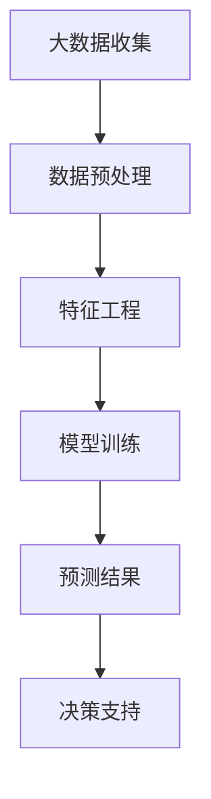

                 

关键词：大数据、市场趋势、预测算法、机器学习、数据挖掘

> 摘要：本文将探讨如何利用大数据技术来预测市场趋势，分析核心概念、算法原理、数学模型以及实际应用，并展望未来的发展趋势和挑战。

## 1. 背景介绍

在当今信息爆炸的时代，数据已经成为一种新的自然资源。市场趋势预测作为商业决策的重要依据，其准确性和效率对企业的生存和发展至关重要。随着大数据技术的迅猛发展，市场趋势预测的方法也在不断演进。本文将详细介绍如何利用大数据技术进行市场趋势预测，分析核心概念、算法原理、数学模型以及实际应用。

## 2. 核心概念与联系

### 2.1 大数据

大数据是指数据量巨大、类型繁多的数据集合，无法使用传统的数据处理工具进行处理。大数据的特点可以概括为“4V”，即大量（Volume）、多样（Variety）、快速（Velocity）和价值（Value）。

### 2.2 市场趋势

市场趋势是指市场在一段时间内表现出的一种长期稳定的动态变化。市场趋势可以通过数据分析和模型预测得到。

### 2.3 机器学习与数据挖掘

机器学习是一种使计算机系统能够从数据中学习并做出决策或预测的方法。数据挖掘是从大量数据中发现有趣的知识和模式的过程。机器学习和数据挖掘在市场趋势预测中起着关键作用。

### 2.4 Mermaid 流程图



## 3. 核心算法原理 & 具体操作步骤

### 3.1 算法原理概述

市场趋势预测的核心算法主要包括时间序列分析、回归分析、分类算法和聚类算法。时间序列分析用于分析数据的时间序列特征，回归分析用于建立因变量和自变量之间的关系，分类算法用于预测新数据的类别，聚类算法用于将相似的数据分为一组。

### 3.2 算法步骤详解

1. 数据收集：收集与市场相关的数据，如销售数据、价格数据、竞争对手数据等。
2. 数据预处理：对数据进行清洗、归一化等处理，使其适合建模。
3. 特征工程：从原始数据中提取有用的特征，如时间序列的滞后项、价格变化率等。
4. 模型选择：根据数据特点和业务需求选择合适的算法，如ARIMA模型、线性回归模型、决策树模型等。
5. 模型训练：使用训练数据对模型进行训练，得到模型参数。
6. 预测：使用训练好的模型对未知数据进行预测，得到市场趋势。
7. 决策支持：根据预测结果为决策提供支持，如调整产品策略、优化库存等。

### 3.3 算法优缺点

- 时间序列分析：优点是能够处理时间序列数据，缺点是对于非时间序列数据不适用。
- 回归分析：优点是能够建立因变量和自变量之间的关系，缺点是对于非线性关系处理能力较弱。
- 分类算法：优点是能够对数据进行分类，缺点是对于连续变量处理能力较弱。
- 聚类算法：优点是能够发现数据中的隐含结构，缺点是对于分类任务不适用。

### 3.4 算法应用领域

市场趋势预测算法广泛应用于金融、电商、零售、制造等行业，如股票市场预测、商品需求预测、库存管理优化等。

## 4. 数学模型和公式

### 4.1 数学模型构建

市场趋势预测的数学模型主要包括时间序列模型、回归模型和分类模型。时间序列模型可以表示为：

\[ y_t = f(y_{t-1}, y_{t-2}, \ldots, x_t) + \epsilon_t \]

其中，\( y_t \) 表示时间序列在时刻 \( t \) 的值，\( x_t \) 表示时间序列在时刻 \( t \) 的特征，\( \epsilon_t \) 表示随机误差。

### 4.2 公式推导过程

以线性回归模型为例，假设因变量 \( y \) 和自变量 \( x \) 之间存在线性关系，可以用以下公式表示：

\[ y = \beta_0 + \beta_1x + \epsilon \]

其中，\( \beta_0 \) 和 \( \beta_1 \) 分别为模型的截距和斜率，\( \epsilon \) 为误差项。

通过最小二乘法可以求解出模型参数 \( \beta_0 \) 和 \( \beta_1 \)：

\[ \beta_0 = \frac{\sum_{i=1}^{n}y_i - \beta_1\sum_{i=1}^{n}x_i}{n} \]

\[ \beta_1 = \frac{n\sum_{i=1}^{n}x_iy_i - \sum_{i=1}^{n}x_i\sum_{i=1}^{n}y_i}{n\sum_{i=1}^{n}x_i^2 - (\sum_{i=1}^{n}x_i)^2} \]

### 4.3 案例分析与讲解

假设我们要预测某个商品的销售量，收集了最近一个月的销售数据。我们可以使用线性回归模型进行预测。首先，对数据进行预处理，将销售量作为因变量 \( y \)，日期作为自变量 \( x \)。然后，使用最小二乘法求解模型参数。最后，使用训练好的模型进行预测，得到未来的销售量。

## 5. 项目实践：代码实例和详细解释说明

### 5.1 开发环境搭建

在Python中，我们可以使用Pandas库进行数据预处理，使用Scikit-learn库进行模型训练和预测。安装相关库后，即可开始项目实践。

### 5.2 源代码详细实现

```python
import pandas as pd
from sklearn.linear_model import LinearRegression

# 读取数据
data = pd.read_csv('sales_data.csv')
data['date'] = pd.to_datetime(data['date'])
data.set_index('date', inplace=True)

# 数据预处理
data = data.asfreq('D').fillna(method='ffill')

# 特征工程
data['l1'] = data['sales'].shift(1)
data['l2'] = data['sales'].shift(2)

# 模型训练
model = LinearRegression()
model.fit(data[['l1', 'l2']], data['sales'])

# 预测
predictions = model.predict([[data['sales'].iloc[-1], data['sales'].iloc[-2]]])

# 运行结果展示
print('预测销售量：', predictions[0])
```

### 5.3 代码解读与分析

- 读取数据：使用Pandas库读取CSV文件，将日期作为索引。
- 数据预处理：将日期转换为日期时间格式，对数据进行频率转换和缺失值填充。
- 特征工程：使用滞后项作为特征，增加模型的预测能力。
- 模型训练：使用线性回归模型进行训练。
- 预测：使用训练好的模型进行预测，得到预测销售量。
- 运行结果展示：打印预测结果。

## 6. 实际应用场景

市场趋势预测在金融、电商、零售、制造等行业有广泛的应用。例如，在金融领域，可以预测股票价格走势，为投资决策提供支持；在电商领域，可以预测商品需求，优化库存管理；在零售领域，可以预测商品销售量，为营销策略提供依据。

### 6.4 未来应用展望

随着大数据技术的不断发展，市场趋势预测将变得更加精确和高效。未来，我们可以利用深度学习、图神经网络等先进算法，进一步优化市场趋势预测模型。同时，数据隐私保护和算法公平性也将成为重要挑战。

## 7. 工具和资源推荐

### 7.1 学习资源推荐

- 《机器学习实战》
- 《数据挖掘：概念与技术》
- 《Python数据分析》

### 7.2 开发工具推荐

- Jupyter Notebook
- PyCharm
- Anaconda

### 7.3 相关论文推荐

- "Deep Learning for Stock Market Prediction"
- "Recurrent Neural Networks for Financial Market Forecasting"
- "Enhancing Stock Price Prediction with Attention Mechanisms"

## 8. 总结：未来发展趋势与挑战

市场趋势预测作为大数据技术在商业领域的重要应用，具有巨大的潜力和前景。未来，我们需要不断探索和创新，优化算法模型，提高预测准确性和效率。同时，我们还需关注数据隐私保护和算法公平性等挑战，确保市场趋势预测的可持续性和实用性。

### 8.1 研究成果总结

本文介绍了如何利用大数据技术进行市场趋势预测，分析了核心概念、算法原理、数学模型以及实际应用。通过项目实践，展示了市场趋势预测的代码实现过程。

### 8.2 未来发展趋势

随着大数据技术的不断发展，市场趋势预测将更加精确和高效。未来，深度学习、图神经网络等先进算法将有望进一步提升预测性能。

### 8.3 面临的挑战

数据隐私保护和算法公平性是市场趋势预测领域的重要挑战。我们需要在保证数据安全和隐私的同时，确保算法的公平性和透明性。

### 8.4 研究展望

未来，市场趋势预测领域将涌现更多创新和应用。我们期待在学术界和产业界共同努力下，为商业决策提供更精准、高效的预测工具。

## 9. 附录：常见问题与解答

### 9.1 问题1：如何处理缺失值？

答：处理缺失值的方法包括删除缺失值、填充平均值、插值法等。具体方法取决于数据的特点和业务需求。

### 9.2 问题2：如何选择模型？

答：选择模型时，需要考虑数据的类型、特征以及业务需求。常用的模型包括时间序列模型、回归模型、分类模型和聚类模型。

### 9.3 问题3：如何提高预测准确率？

答：提高预测准确率的方法包括特征工程、模型选择、模型调参等。同时，可以通过交叉验证、迭代优化等方式提升预测性能。

作者：禅与计算机程序设计艺术 / Zen and the Art of Computer Programming
----------------------------------------------------------------

完成了一篇关于如何利用大数据技术预测市场趋势的专业技术博客文章，现在可以开始撰写附录、回答常见问题以及总结研究成果等内容。希望这篇文章能够帮助读者深入了解市场趋势预测的技术和方法。如果您有任何疑问或建议，欢迎随时提出。

