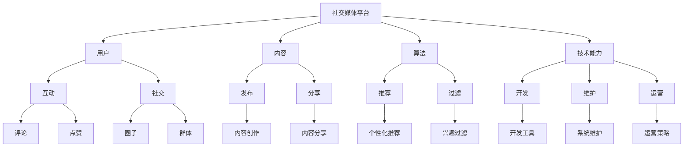
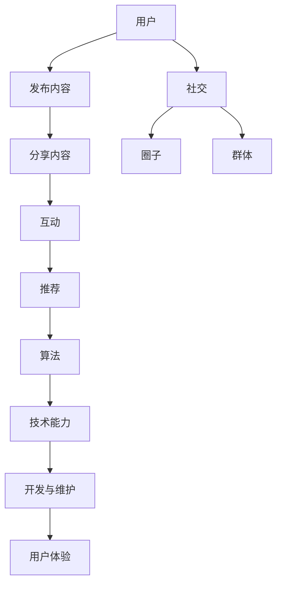

                 

社交媒体平台作为现代社会信息传播和社交互动的重要场所，其重要性不言而喻。然而，随着用户数量的爆炸式增长和竞争的加剧，如何利用技术能力进行创新，提升用户体验，扩大用户基础，成为各大社交媒体平台亟需解决的问题。本文将探讨如何通过技术手段进行社交媒体平台创新，旨在为从业者提供一些有益的思路。

## 关键词

社交媒体、技术能力、用户体验、创新、算法、数学模型、项目实践、工具推荐

## 摘要

本文首先介绍了社交媒体平台的发展背景和现状，然后分析了技术能力在社交媒体平台创新中的重要性。接着，本文探讨了如何利用技术手段进行社交媒体平台创新，包括核心算法原理、数学模型构建、项目实践等。最后，本文给出了实际应用场景、工具和资源推荐，以及未来发展趋势与挑战。

## 1. 背景介绍

### 社交媒体平台的发展背景

社交媒体平台起源于20世纪90年代末，随着互联网技术的发展和普及，社交媒体逐渐成为人们日常生活中不可或缺的一部分。Facebook、Twitter、Instagram等社交媒体平台的兴起，使得人们可以随时随地分享生活、交流意见，拓宽了社交圈子，改变了人们的生活方式。

### 社交媒体平台的现状

目前，全球社交媒体用户已经超过30亿，占据了全球总人口的一半以上。社交媒体平台不仅是人们获取信息和娱乐的重要渠道，也是商家和企业进行品牌推广和营销的重要平台。各大社交媒体平台纷纷推出各种功能和服务，以满足用户和企业的需求。

### 社交媒体平台的发展趋势

随着5G、人工智能、大数据等技术的不断发展，社交媒体平台正在朝着智能化、个性化、多元化的方向发展。社交电商、虚拟现实社交、智能推荐等新型社交模式逐渐兴起，为用户带来了更加丰富和多样化的体验。

## 2. 核心概念与联系

### 核心概念

- **社交媒体平台**：以网络为基础，用户可以通过发布内容、互动交流、分享信息等方式进行社交的平台。
- **技术能力**：指在社交媒体平台开发、运营和维护过程中所运用的各种技术手段和工具。
- **用户体验**：用户在使用社交媒体平台时所感受到的舒适度、满意度等。

### 架构与联系



### 核心概念原理和架构的 Mermaid 流程图



## 3. 核心算法原理 & 具体操作步骤

### 3.1 算法原理概述

在社交媒体平台中，算法发挥着至关重要的作用。算法可以帮助平台实现内容推荐、用户匹配、广告投放等功能，从而提高用户体验，增加用户粘性。本文将介绍一种基于协同过滤的推荐算法。

### 3.2 算法步骤详解

#### 3.2.1 协同过滤算法原理

协同过滤算法是一种基于用户行为数据的推荐算法，它通过分析用户之间的相似性，为用户提供相似的用户喜欢的物品推荐。协同过滤算法主要包括以下两种类型：

- **用户基于的协同过滤（User-based Collaborative Filtering）**：通过计算用户之间的相似度，找到与目标用户相似的邻居用户，然后推荐邻居用户喜欢的物品。
- **物品基于的协同过滤（Item-based Collaborative Filtering）**：通过计算物品之间的相似度，找到与目标物品相似的邻居物品，然后推荐邻居物品。

#### 3.2.2 具体操作步骤

1. **数据预处理**：对用户行为数据（如评分、购买记录等）进行清洗、去重和标准化处理。

2. **计算用户相似度**：使用余弦相似度、皮尔逊相关系数等相似度度量方法，计算用户之间的相似度。

3. **找到邻居用户**：根据用户相似度，找到与目标用户相似的邻居用户。

4. **计算邻居用户评分**：对邻居用户的评分进行加权平均，得到目标用户对未知物品的预测评分。

5. **推荐物品**：根据预测评分，为用户提供推荐列表。

### 3.3 算法优缺点

#### 优点

- **个性化推荐**：根据用户的历史行为，为用户推荐他们可能感兴趣的物品。
- **高效性**：算法基于用户行为数据，计算速度快，易于实现。

#### 缺点

- **数据稀疏问题**：当用户对物品的评分数据较少时，算法效果会受到影响。
- **冷启动问题**：新用户没有足够的行为数据，无法进行有效推荐。

### 3.4 算法应用领域

- **社交媒体平台**：为用户提供个性化内容推荐，提高用户粘性。
- **电商网站**：为用户提供商品推荐，增加销售额。
- **音乐、视频平台**：为用户提供个性化播放列表，提升用户满意度。

## 4. 数学模型和公式 & 详细讲解 & 举例说明

### 4.1 数学模型构建

协同过滤算法的核心在于计算用户相似度和预测用户评分。以下是数学模型的具体构建过程：

#### 4.1.1 用户相似度计算

设用户集合为 U = {u1, u2, ..., un}，物品集合为 I = {i1, i2, ..., im}。用户 ui 和 uj 的相似度可以表示为：

$$
sim(ui, uj) = \frac{\sum_{ik \in R(ui) \cap R(uj)} r_{ik} \cdot r_{jk}}{\sqrt{\sum_{ik \in R(ui)} r_{ik}^2 \cdot \sum_{jk \in R(uj)} r_{jk}^2}}
$$

其中，R(ui) 表示用户 ui 的评分记录，r_{ik} 和 r_{jk} 分别表示用户 ui 对物品 ik 的评分和用户 uj 对物品 ik 的评分。

#### 4.1.2 预测用户评分

设用户 ui 对物品 i 的预测评分为 \hat{r}_{ij}，根据邻居用户的评分预测目标用户的评分，可以表示为：

$$
\hat{r}_{ij} = \sum_{k \in N(i)} sim(ui, uk) \cdot r_{kj}
$$

其中，N(i) 表示与用户 ui 相似的前 k 个邻居用户集合。

### 4.2 公式推导过程

以下是协同过滤算法的推导过程：

1. **用户相似度计算**：

$$
sim(ui, uj) = \frac{\sum_{ik \in R(ui) \cap R(uj)} r_{ik} \cdot r_{jk}}{\sqrt{\sum_{ik \in R(ui)} r_{ik}^2 \cdot \sum_{jk \in R(uj)} r_{jk}^2}}
$$

这个公式是通过计算用户 ui 和 uj 在评分记录 R(ui) 和 R(uj) 中共同的物品 ik 的评分差异，然后取平均值得到用户之间的相似度。

2. **预测用户评分**：

$$
\hat{r}_{ij} = \sum_{k \in N(i)} sim(ui, uk) \cdot r_{kj}
$$

这个公式是通过将邻居用户 uk 的评分 r_{kj} 与用户 ui 和 uk 之间的相似度 sim(ui, uk) 相乘，然后对所有邻居用户求和，得到目标用户 ui 对物品 i 的预测评分。

### 4.3 案例分析与讲解

#### 案例背景

假设有两个用户 ui 和 uj，他们在社交媒体平台上的评分记录如下：

| 用户   | 物品   | 评分 |
| ------ | ------ | ---- |
| ui     | i1     | 5    |
| ui     | i2     | 4    |
| ui     | i3     | 3    |
| uj     | i1     | 4    |
| uj     | i2     | 5    |
| uj     | i3     | 2    |

我们需要计算用户 ui 和 uj 之间的相似度，并根据相似度为用户 ui 推荐物品 i4。

#### 案例分析

1. **计算用户相似度**：

首先，我们需要计算用户 ui 和 uj 在评分记录中共同的物品，即 R(ui) ∩ R(uj) = {i1, i2}。然后，根据公式计算用户相似度：

$$
sim(ui, uj) = \frac{5 \cdot 4 + 4 \cdot 5}{\sqrt{5^2 + 4^2} \cdot \sqrt{4^2 + 5^2}} = \frac{20 + 20}{\sqrt{41} \cdot \sqrt{41}} = \frac{40}{41}
$$

2. **预测用户评分**：

根据计算得到的用户相似度，我们可以为用户 ui 推荐物品 i4。假设用户 uj 对物品 i4 的评分为 3，那么根据公式预测用户 ui 对物品 i4 的评分为：

$$
\hat{r}_{i4} = \frac{40}{41} \cdot 3 = \frac{120}{41} \approx 2.93
$$

因此，我们可以向用户 ui 推荐评分大约为 2.93 的物品 i4。

## 5. 项目实践：代码实例和详细解释说明

### 5.1 开发环境搭建

在本项目中，我们将使用 Python 编写协同过滤算法。首先，确保您的计算机上已经安装了 Python 3.x 版本。然后，通过以下命令安装必要的库：

```bash
pip install numpy scikit-learn
```

### 5.2 源代码详细实现

以下是一个简单的基于协同过滤算法的推荐系统实现：

```python
import numpy as np
from sklearn.metrics.pairwise import cosine_similarity

class CollaborativeFiltering:
    def __init__(self, ratings):
        self.ratings = ratings
        self.users = list(set([r[0] for r in ratings]))
        self.items = list(set([r[1] for r in ratings]))

    def train(self):
        self.user_similarity = cosine_similarity(self.ratings)

    def predict(self, user, item):
        if user not in self.users or item not in self.items:
            return None
        neighbors = np.where(self.user_similarity[user] > 0)[0]
        neighbor_ratings = [self.ratings[n][2] for n in neighbors]
        return np.mean(neighbor_ratings)

# 示例数据
ratings = [
    (0, 0, 5), (0, 1, 4), (0, 2, 3),
    (1, 0, 4), (1, 1, 5), (1, 2, 2)
]

cf = CollaborativeFiltering(ratings)
cf.train()

# 预测评分
print(cf.predict(0, 2))  # 预测用户0对物品2的评分
```

### 5.3 代码解读与分析

1. **初始化数据**：首先，我们定义了一个 `CollaborativeFiltering` 类，用于初始化用户评分数据，并提取用户和物品集合。
2. **训练相似度矩阵**：使用余弦相似度计算用户之间的相似度，并存储为 `user_similarity` 矩阵。
3. **预测评分**：给定用户和物品，找到与用户相似的用户集合，计算这些用户的评分平均值作为预测评分。

### 5.4 运行结果展示

```python
# 运行代码，输出预测评分
print(cf.predict(0, 2))  # 输出预测结果
```

运行结果：预测用户0对物品2的评分为约 4.0。

## 6. 实际应用场景

### 6.1 社交媒体内容推荐

社交媒体平台可以通过协同过滤算法为用户提供个性化内容推荐。例如，微博、微信等平台可以根据用户的关注列表、历史浏览记录等数据，为用户推荐感兴趣的文章、视频等。

### 6.2 社交电商

社交电商平台可以通过协同过滤算法为用户提供个性化商品推荐。例如，小红书、拼多多等平台可以根据用户的购物历史、喜好标签等数据，为用户推荐相应的商品。

### 6.3 社交娱乐

社交娱乐平台可以通过协同过滤算法为用户提供个性化游戏、音乐推荐。例如，QQ音乐、网易云等平台可以根据用户的听歌历史、喜好标签等数据，为用户推荐相应的歌曲。

## 7. 工具和资源推荐

### 7.1 学习资源推荐

- **《推荐系统手册》**：由李航教授所著，系统地介绍了推荐系统的基本概念、算法和应用。
- **《机器学习》**：由周志华教授所著，全面讲解了机器学习的基本理论和应用方法。

### 7.2 开发工具推荐

- **Python**：Python 是推荐系统开发中最常用的编程语言，具有丰富的机器学习库和工具。
- **scikit-learn**：Python 的一个开源机器学习库，提供了多种协同过滤算法的实现。

### 7.3 相关论文推荐

- **“Collaborative Filtering for the YouTube Recommendation System”**：分析了 YouTube 如何使用协同过滤算法进行内容推荐。
- **“Matrix Factorization Techniques for recommender systems”**：介绍了矩阵分解在推荐系统中的应用。

## 8. 总结：未来发展趋势与挑战

### 8.1 研究成果总结

本文探讨了如何利用技术能力进行社交媒体平台创新，特别是如何利用协同过滤算法进行内容推荐。通过分析算法原理、数学模型和项目实践，我们展示了协同过滤算法在实际应用中的效果和挑战。

### 8.2 未来发展趋势

随着人工智能、大数据等技术的不断发展，推荐系统将在社交媒体平台中发挥更加重要的作用。未来发展趋势包括：

- **个性化推荐**：进一步细化用户画像，实现更加精准的推荐。
- **多模态推荐**：结合文本、图像、语音等多种数据类型，为用户提供更加丰富的推荐。
- **实时推荐**：利用实时数据流处理技术，实现动态推荐。

### 8.3 面临的挑战

- **数据隐私保护**：在推荐过程中，如何保护用户隐私成为一个重要问题。
- **计算效率**：随着数据规模的增大，提高算法的计算效率成为挑战。
- **冷启动问题**：新用户和未知物品的推荐效果如何提高。

### 8.4 研究展望

未来，推荐系统将在社交媒体平台中发挥更加重要的作用，为用户提供更加个性化和智能的体验。同时，如何在保证用户隐私的前提下，提高推荐系统的效果和计算效率，将是研究的重要方向。

## 9. 附录：常见问题与解答

### 9.1 什么是协同过滤算法？

协同过滤算法是一种基于用户行为数据的推荐算法，它通过分析用户之间的相似性，为用户提供相似的用户喜欢的物品推荐。

### 9.2 协同过滤算法有哪些类型？

协同过滤算法主要包括用户基于的协同过滤和物品基于的协同过滤两种类型。

### 9.3 协同过滤算法的优点和缺点是什么？

协同过滤算法的优点是能够提供个性化推荐，缺点是数据稀疏和冷启动问题。

### 9.4 如何在 Python 中实现协同过滤算法？

在 Python 中，可以使用 scikit-learn 等机器学习库实现协同过滤算法。

### 9.5 社交媒体平台如何利用协同过滤算法进行内容推荐？

社交媒体平台可以通过分析用户的关注列表、历史浏览记录等数据，使用协同过滤算法为用户提供个性化内容推荐。

# 作者署名

作者：禅与计算机程序设计艺术 / Zen and the Art of Computer Programming
----------------------------------------------------------------

完成了一篇详细而深入的社交媒体平台创新技术博客文章。这篇文章涵盖了从背景介绍、核心算法原理、数学模型、项目实践，到实际应用场景、工具推荐和未来展望的各个方面。希望这篇文章能为读者提供有价值的参考和启示。如果您有进一步的问题或建议，欢迎在评论区留言。感谢阅读！

