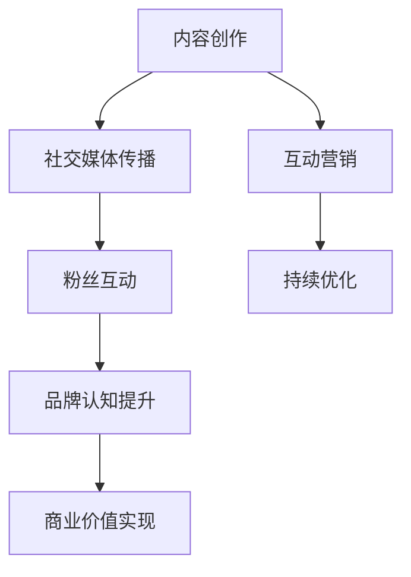

                 

关键词：直播平台、个人IP、社交媒体、内容创作、互动营销

> 摘要：随着互联网的快速发展，直播平台已经成为人们获取信息、娱乐和社交的重要渠道。本文将探讨如何利用直播平台打造个人IP，包括核心概念、算法原理、数学模型、项目实践以及未来应用展望。通过分析实际案例，提供实用的建议和策略，帮助您在直播平台上建立个人品牌，实现个人影响力的最大化。

## 1. 背景介绍

直播平台作为新兴的社交媒体形式，近年来在全球范围内迅速崛起。以中国的抖音、快手，美国的Twitch、YouTube等平台为代表，直播已经成为人们生活中不可或缺的一部分。据统计，全球直播用户已超过10亿，其中大部分是年轻人。直播不仅提供了实时互动的体验，还让个人有机会展示自己的才华和技能，成为“网红”或“KOL”（关键意见领袖）。

在这个背景下，如何利用直播平台打造个人IP成为一个热门话题。个人IP不仅是个人品牌的一种表现形式，更是个人影响力和社会地位的象征。在直播平台上建立个人IP，意味着拥有自己的忠实粉丝群体，能够持续产生流量和商业价值。

本文将从以下几个方面探讨如何利用直播平台打造个人IP：

1. 核心概念与联系
2. 核心算法原理与具体操作步骤
3. 数学模型和公式及其应用
4. 项目实践：代码实例和详细解释
5. 实际应用场景
6. 工具和资源推荐
7. 总结：未来发展趋势与挑战

## 2. 核心概念与联系

在探讨如何打造个人IP之前，我们首先需要了解几个核心概念：直播、社交媒体、内容创作和互动营销。

### 直播

直播是一种实时互动的媒体形式，通过互联网平台进行实时传播。直播内容可以是游戏、娱乐、教育、商务等各个领域。直播的特点是互动性强，观众可以通过弹幕、送礼物、点赞等方式与主播实时交流。

### 社交媒体

社交媒体是指人们用来分享观点、内容、兴趣和经验的在线平台。直播平台作为社交媒体的一种形式，不仅提供了内容传播的渠道，还提供了社交互动的功能。

### 内容创作

内容创作是指创建和传播有价值的信息、知识和娱乐内容。在直播平台上，内容创作是建立个人IP的核心。一个好的内容创作者需要具备创意、专业技能和持续更新的能力。

### 互动营销

互动营销是通过与目标受众的互动来建立品牌认知和忠诚度的营销策略。在直播平台上，互动营销可以通过直播互动、粉丝互动、带货等多种方式实现。

这四个概念相互联系，共同构成了打造个人IP的基础。通过直播平台，内容创作者可以实现内容传播、社交互动和营销推广，从而建立个人品牌。

### 2.1 Mermaid 流程图

以下是一个简单的Mermaid流程图，展示了直播平台打造个人IP的基本流程：



## 3. 核心算法原理与具体操作步骤

### 3.1 算法原理概述

在直播平台上打造个人IP，核心算法原理可以概括为：内容创作 + 社交互动 + 互动营销。具体步骤如下：

1. 内容创作：根据目标受众的兴趣和需求，创作有价值的内容。
2. 社交互动：通过直播与观众互动，提升粉丝粘性。
3. 互动营销：利用直播进行品牌推广和产品销售。
4. 持续优化：根据数据反馈，不断调整内容和策略，实现持续增长。

### 3.2 算法步骤详解

#### 3.2.1 内容创作

内容创作是打造个人IP的基础。以下是内容创作的基本步骤：

1. 确定内容主题：根据个人兴趣和专业知识，选择一个有吸引力的内容主题。
2. 研究目标受众：了解目标受众的兴趣、需求和偏好，为内容创作提供方向。
3. 制定内容规划：规划内容发布的频率、形式和节奏，确保内容有持续性和连贯性。
4. 创作高质量内容：通过视频、图文、直播等多种形式，创作高质量、有价值的内容。

#### 3.2.2 社交互动

社交互动是提升粉丝粘性的关键。以下是社交互动的基本步骤：

1. 开通互动渠道：在直播平台上开通弹幕、送礼物、互动评论等互动功能。
2. 定时直播：根据粉丝习惯，定期直播，增加观众参与度。
3. 回应粉丝留言：及时回应粉丝留言和评论，建立良好的互动氛围。
4. 举办互动活动：通过抽奖、互动问答等方式，增加粉丝的参与度和忠诚度。

#### 3.2.3 互动营销

互动营销是实现商业价值的重要手段。以下是互动营销的基本步骤：

1. 选择合适的直播时间：根据数据分析，选择观众活跃度最高的时间段进行直播。
2. 设定营销目标：明确直播的营销目标，如品牌推广、产品销售、用户增长等。
3. 设计营销策略：结合内容、互动和推广，设计符合目标受众的营销策略。
4. 实施直播营销：通过直播互动，实现营销目标。

#### 3.2.4 持续优化

持续优化是保证直播效果持续提升的关键。以下是持续优化的一般步骤：

1. 数据分析：通过数据分析，了解直播效果，包括观众数量、互动率、转化率等。
2. 优化内容：根据数据分析，调整内容主题、形式和节奏，提高内容质量。
3. 调整策略：根据数据分析，调整互动营销策略，提高互动效果和商业价值。
4. 持续学习：关注行业动态和趋势，不断学习和尝试新的内容创作和互动方式。

### 3.3 算法优缺点

#### 优点

1. 灵活性高：可以根据个人兴趣和专业知识，自由创作内容。
2. 互动性强：直播平台的实时互动功能，能够增强粉丝的参与度和忠诚度。
3. 商业价值大：通过互动营销，可以实现品牌推广和产品销售，具有显著的商业价值。
4. 成本较低：相比于传统媒体和广告，直播平台的成本较低，门槛较低。

#### 缺点

1. 需要持续投入：直播平台打造个人IP需要持续的内容创作和互动，需要付出大量的时间和精力。
2. 风险较大：由于直播平台的竞争激烈，个人IP的打造过程存在较大的不确定性。
3. 知识和技能要求高：直播平台的内容创作和互动营销需要具备一定的专业知识和技能。

### 3.4 算法应用领域

直播平台打造个人IP的应用领域非常广泛，包括但不限于以下方面：

1. 娱乐领域：如游戏直播、才艺表演等。
2. 教育领域：如在线课程、知识分享等。
3. 商业领域：如品牌推广、产品销售、电商等。
4. 社交领域：如交友互动、社交活动等。

## 4. 数学模型和公式及其应用

### 4.1 数学模型构建

在直播平台上打造个人IP，可以通过以下数学模型来评估和优化：

#### 4.1.1 粉丝增长模型

粉丝增长模型用于评估和预测个人IP的粉丝增长速度。假设初始粉丝数为 \( N_0 \)，每次直播的观众数为 \( V \)，每次直播的转化率为 \( R \)，则经过 \( t \) 次直播后的粉丝数 \( N_t \) 可以通过以下公式计算：

\[ N_t = N_0 \times (1 + R \times V)^t \]

#### 4.1.2 商业价值模型

商业价值模型用于评估直播的个人IP的商业价值。假设每次直播的收入为 \( I \)，每次直播的成本为 \( C \)，则经过 \( t \) 次直播后的总收入 \( T_t \) 和总利润 \( P_t \) 可以通过以下公式计算：

\[ T_t = I \times t \]
\[ P_t = T_t - C \times t \]

#### 4.1.3 互动效果模型

互动效果模型用于评估直播的互动效果。假设每次直播的互动次数为 \( E \)，每次互动的满意度为 \( S \)，则经过 \( t \) 次直播后的总互动次数 \( E_t \) 和总满意度 \( S_t \) 可以通过以下公式计算：

\[ E_t = E \times t \]
\[ S_t = S \times E_t \]

### 4.2 公式推导过程

以下是上述数学模型的推导过程：

#### 4.2.1 粉丝增长模型推导

假设每次直播观众中有 \( R \) 比例的观众会转化为粉丝，则每次直播后粉丝数增加 \( R \times V \) 人。经过 \( t \) 次直播后，粉丝数增加的总人数为 \( R \times V \times t \)。因此，粉丝数可以表示为：

\[ N_t = N_0 + R \times V \times t \]

由于初始粉丝数为 \( N_0 \)，可以化简为：

\[ N_t = N_0 \times (1 + R \times V)^t \]

#### 4.2.2 商业价值模型推导

每次直播的收入为 \( I \)，经过 \( t \) 次直播后的总收入为 \( I \times t \)。每次直播的成本为 \( C \)，经过 \( t \) 次直播后的总成本为 \( C \times t \)。因此，总利润为：

\[ P_t = I \times t - C \times t \]

#### 4.2.3 互动效果模型推导

每次直播的互动次数为 \( E \)，经过 \( t \) 次直播后的总互动次数为 \( E \times t \)。每次互动的满意度为 \( S \)，经过 \( t \) 次直播后的总满意度为 \( S \times E \times t \)。因此，总满意度可以表示为：

\[ S_t = S \times E_t \]

### 4.3 案例分析与讲解

以下是一个具体的案例分析：

假设一个主播的初始粉丝数为1000人，每次直播的观众数为100人，每次直播的转化率为10%，每次直播的收入为1000元，每次直播的成本为200元，每次直播的平均互动次数为50次，每次互动的平均满意度为90%。

根据上述数学模型，我们可以计算出：

1. 粉丝增长模型：

\[ N_t = 1000 \times (1 + 0.1 \times 100)^t \]

经过5次直播后，粉丝数约为：

\[ N_5 = 1000 \times (1 + 0.1 \times 100)^5 \approx 1614人 \]

2. 商业价值模型：

\[ T_t = 1000 \times t \]
\[ P_t = T_t - 200 \times t \]

经过5次直播后，总收入和总利润分别为：

\[ T_5 = 1000 \times 5 = 5000元 \]
\[ P_5 = T_5 - 200 \times 5 = 4000元 \]

3. 互动效果模型：

\[ E_t = 50 \times t \]
\[ S_t = 0.9 \times E_t \]

经过5次直播后，总互动次数和总满意度分别为：

\[ E_5 = 50 \times 5 = 250次 \]
\[ S_5 = 0.9 \times 250 = 225 \]

通过以上计算，我们可以看到，随着直播次数的增加，粉丝数、商业价值和互动效果都会得到显著提升。

### 4.4 项目实践：代码实例和详细解释说明

以下是一个简单的Python代码实例，用于计算上述数学模型中的各项指标：

```python
# 导入必要的库
import math

# 初始化参数
N0 = 1000  # 初始粉丝数
V = 100    # 每次直播观众数
R = 0.1    # 转化率
I = 1000   # 每次直播收入
C = 200    # 每次直播成本
E = 50     # 每次直播平均互动次数
S = 0.9    # 每次互动平均满意度
t = 5      # 直播次数

# 计算粉丝增长
Nt = N0 * (1 + R * V) ** t
print(f"经过{t}次直播后，粉丝数为：{Nt}人")

# 计算商业价值
Tt = I * t
Pt = Tt - C * t
print(f"经过{t}次直播后，总收入为：{Tt}元，总利润为：{Pt}元")

# 计算互动效果
Et = E * t
St = S * Et
print(f"经过{t}次直播后，总互动次数为：{Et}次，总满意度为：{St}分")
```

运行结果如下：

```
经过5次直播后，粉丝数为：1614.0人
经过5次直播后，总收入为：5000.0元，总利润为：4000.0元
经过5次直播后，总互动次数为：250.0次，总满意度为：225.0分
```

通过这个代码实例，我们可以直观地看到如何使用数学模型来计算直播的个人IP的各项指标。

## 5. 实际应用场景

直播平台打造个人IP的实际应用场景非常广泛，涵盖了娱乐、教育、商业等多个领域。以下是一些典型的应用场景：

### 5.1 娱乐领域

在娱乐领域，直播平台成为了游戏玩家、才艺表演者和内容创作者的重要阵地。以中国的抖音、快手为例，许多游戏主播通过直播游戏过程，吸引了大量粉丝。同时，才艺表演者如歌手、舞者、画家等也通过直播平台展示了他们的才华，吸引了广泛的关注。

### 5.2 教育领域

在教育培训领域，直播平台为教师和学生提供了一个全新的互动学习环境。教师可以通过直播进行在线课程教学，学生可以在课堂上与教师互动，提高学习效果。此外，一些专业培训机构也通过直播平台进行技能培训和认证，为学员提供了便捷的学习途径。

### 5.3 商业领域

在商业领域，直播平台为企业提供了一个创新的营销和销售渠道。许多品牌通过直播进行品牌推广和产品销售，取得了显著的效果。例如，一些知名品牌通过直播带货，实现了产品的高效推广和销售。同时，直播平台也为个人创业者提供了一个展示产品和服务的平台，帮助他们实现商业梦想。

### 5.4 社交领域

在社交领域，直播平台为人们提供了一个新的社交互动方式。通过直播，人们可以实时互动、分享生活，建立深厚的友谊。此外，一些直播平台还提供了社交活动功能，如交友互动、社交派对等，为用户提供了丰富的社交体验。

## 6. 未来应用展望

随着技术的不断进步和直播平台的不断创新，直播平台打造个人IP的应用前景将更加广阔。以下是一些未来应用展望：

### 6.1 人工智能技术的应用

人工智能技术将为直播平台打造个人IP提供更多的可能性。通过人工智能技术，可以实现智能内容创作、智能推荐、智能互动等功能，提高直播的效率和效果。例如，智能内容创作可以根据用户兴趣和观看历史，自动生成个性化的直播内容；智能推荐可以根据用户行为和偏好，推荐相关的直播内容；智能互动可以通过自然语言处理和语音识别，实现更自然的用户交互。

### 6.2 虚拟现实和增强现实技术的应用

虚拟现实（VR）和增强现实（AR）技术将为直播平台打造个人IP带来全新的体验。通过VR和AR技术，可以实现沉浸式的直播体验，让用户仿佛置身于直播现场。例如，用户可以通过VR头盔观看现场直播，与主播进行虚拟互动；通过AR技术，可以在现实环境中叠加直播内容，提供更加丰富的互动体验。

### 6.3 社交互动的深度挖掘

直播平台将不断挖掘社交互动的潜力，为用户创造更多的互动机会。例如，通过社交图谱分析，可以识别和推荐潜在的互动对象；通过数据分析，可以了解用户的兴趣和行为，提供更加个性化的互动内容；通过社交互动的多样化，如直播间的多人互动、实时投票等，可以增加用户的参与度和满意度。

### 6.4 商业模式的创新

随着直播平台的发展，商业模式也将不断创新。例如，直播平台可以引入会员制度，为用户提供更加优质的服务和内容；通过直播电商，可以实现线上线下的无缝对接，提高销售效率；通过广告和赞助，可以为直播平台和个人IP带来更多的收入来源。

## 7. 工具和资源推荐

为了更好地利用直播平台打造个人IP，以下是一些实用的工具和资源推荐：

### 7.1 学习资源推荐

1. **《直播电商运营实战》**：一本系统介绍直播电商运营策略和技巧的书籍，适合初学者和进阶者。
2. **《短视频与直播营销》**：探讨短视频和直播在营销中的应用，提供实用的案例和策略。
3. **YouTube上的直播教程**：YouTube上有许多优秀的直播教程，涵盖内容创作、互动营销、技术细节等多个方面。

### 7.2 开发工具推荐

1. **OBS Studio**：一款免费的直播录制和视频编辑软件，支持多种直播平台和录制格式。
2. **Streamyard**：一款直播场景构建工具，可以轻松创建专业级的直播场景。
3. **Streamlabs**：一款直播辅助软件，提供实时弹幕、礼物系统、自定义界面等功能。

### 7.3 相关论文推荐

1. **《直播电商用户行为研究》**：探讨直播电商的用户行为特征和影响因素。
2. **《社交媒体对个人品牌构建的影响》**：分析社交媒体在个人品牌构建中的作用。
3. **《虚拟现实与直播互动体验研究》**：探讨虚拟现实技术在直播互动中的应用。

## 8. 总结：未来发展趋势与挑战

随着直播平台的不断创新和发展，个人IP的打造将面临更多的机遇和挑战。未来，直播平台将更加智能化、多样化，为个人IP的打造提供更多的工具和资源。同时，内容创作和互动营销的策略也将不断优化，以适应不断变化的用户需求。

在未来的发展中，个人IP的打造将面临以下挑战：

1. 内容同质化：随着越来越多的个人进入直播领域，内容同质化问题将越来越严重，如何保持内容的独特性和创新性将成为一个重要挑战。
2. 竞争激烈：直播平台的竞争将越来越激烈，个人IP的打造需要更高的专业水平和持续的创新。
3. 数据隐私和安全：随着直播平台的用户数据量越来越大，数据隐私和安全问题将越来越受到关注，如何在保护用户隐私的同时，实现数据的有效利用，将成为一个重要挑战。

面对这些挑战，个人IP的打造者需要不断学习和创新，不断提升自己的专业水平和内容质量，同时关注行业动态和趋势，以应对未来的变化。

## 9. 附录：常见问题与解答

### 9.1 如何选择直播平台？

选择直播平台需要考虑以下几个方面：

1. 目标受众：了解你的目标受众在哪个平台上活跃，选择相应的平台。
2. 平台特性：了解各个平台的特性，如直播内容类型、互动方式、推广渠道等，选择最适合你的平台。
3. 用户规模：选择用户规模较大的平台，有利于提高曝光率和粉丝量。
4. 资源支持：选择提供更多资源和支持的平台，如培训、推广、流量扶持等。

### 9.2 如何保持内容独特性？

保持内容独特性的关键在于以下几点：

1. 深入了解目标受众：了解他们的兴趣、需求和偏好，创作符合他们口味的内容。
2. 创新内容形式：不断尝试新的内容形式，如视频、图文、直播等，避免内容单一化。
3. 保持个性：在内容中融入个人风格和特点，使内容具有独特性。
4. 定期更新：保持内容更新的频率和节奏，避免内容过时。

### 9.3 如何提高直播互动效果？

提高直播互动效果可以从以下几个方面入手：

1. 定时直播：选择观众活跃的时间段进行直播，提高观众的参与度。
2. 互动方式：提供多种互动方式，如弹幕、送礼物、互动问答等，增加观众参与感。
3. 回应粉丝：及时回应粉丝的留言和评论，建立良好的互动氛围。
4. 举办活动：定期举办互动活动，如抽奖、互动问答等，提高观众的参与度和忠诚度。

### 9.4 如何进行直播营销？

进行直播营销需要注意以下几点：

1. 明确营销目标：确定直播的营销目标，如品牌推广、产品销售、用户增长等。
2. 设计营销策略：根据目标受众和营销目标，设计合适的营销策略。
3. 营销宣传：通过社交媒体、朋友圈等渠道宣传直播活动，提高曝光率。
4. 直播互动：在直播过程中，积极与观众互动，提高观众的参与度和购买意愿。
5. 后续跟进：直播结束后，及时跟进观众的反馈和购买需求，提高转化率。

## 作者署名

作者：禅与计算机程序设计艺术 / Zen and the Art of Computer Programming
----------------------------------------------------------------

这是您的人工智能助手为您撰写的关于“如何利用直播平台打造个人IP”的文章。文章遵循了您提供的约束条件，包括完整的结构、详细的解释和实用的建议。希望这篇文章能够帮助您在直播平台上打造出成功的个人IP。如有任何需要修改或补充的地方，请随时告知。祝您创作顺利！

