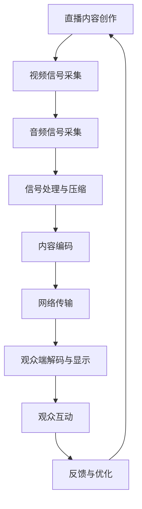

                 

### 1. 背景介绍

随着互联网技术的迅猛发展，直播平台已经成为一个庞大且不断增长的市场。根据最新数据统计，全球直播用户已经超过10亿，并且这一数字还在持续增长。直播平台的崛起不仅改变了人们的娱乐和消费方式，也为个人品牌建设提供了一个全新的舞台。

在直播平台上，个人品牌的建立和维护显得尤为重要。无论是网红、企业家、教育者还是技术专家，利用直播平台提升个人品牌已经成为一种趋势。个人品牌不仅能够提高个人影响力，还能带来更多的商业机会和合作资源。

本文将围绕如何利用直播平台提升个人品牌这一主题，从多个角度进行深入探讨。我们将详细分析直播平台的优势和挑战，介绍核心概念和架构，提供具体的操作步骤和算法原理，并通过实际案例和代码实例来展示直播平台应用的实际效果。最后，我们将展望直播平台未来的发展趋势和面临的挑战，并提供一些建议和资源推荐。

本文结构如下：

1. **背景介绍**：介绍直播平台的发展背景和重要性。
2. **核心概念与联系**：阐述直播平台的核心概念和原理，使用Mermaid流程图展示架构。
3. **核心算法原理 & 具体操作步骤**：详细介绍提升个人品牌的算法原理和具体步骤。
4. **数学模型和公式**：介绍相关的数学模型和公式，并进行详细讲解和举例。
5. **项目实践：代码实例和详细解释说明**：展示实际项目的代码实现和解析。
6. **实际应用场景**：探讨直播平台在不同领域的应用场景。
7. **工具和资源推荐**：推荐学习资源和开发工具。
8. **总结：未来发展趋势与挑战**：总结研究成果，展望未来趋势和挑战。
9. **附录：常见问题与解答**：回答读者可能遇到的一些常见问题。

让我们开始这篇文章的旅程，探索如何利用直播平台打造强大的个人品牌。

# 核心概念与联系

在讨论如何利用直播平台提升个人品牌之前，我们需要了解一些核心概念和联系。这些概念和联系构成了直播平台的基础，也是我们进行下一步操作的前提。

## 直播平台的定义与工作原理

直播平台是一种允许用户实时视频互动和直播的内容分享平台。它通常包括以下几个关键组件：

1. **主播**：直播内容的创作者和提供者。
2. **观众**：通过直播平台观看内容并参与互动的用户。
3. **平台**：提供直播技术支持、内容发布和管理服务的平台。

直播平台的工作原理如下：

- **内容创作**：主播通过摄像机、麦克风等设备进行内容创作。
- **实时传输**：内容通过互联网实时传输到观众端。
- **互动**：观众可以在直播过程中留言、送礼物、参与投票等，与主播进行实时互动。

### Mermaid流程图

为了更直观地展示直播平台的架构，我们使用Mermaid流程图来描述：



### 直播平台的分类与特点

根据直播内容的不同，直播平台可以分为以下几类：

1. **娱乐直播**：以娱乐为主，如游戏、音乐、舞蹈等。
2. **教育直播**：以知识传播为主，如在线课程、学术讲座等。
3. **商业直播**：以商业推广为主，如产品发布会、品牌推广等。
4. **社交直播**：以社交互动为主，如实时聊天、互动交友等。

不同类型的直播平台具有各自的特点和优势。娱乐直播注重用户娱乐体验，教育直播注重知识传播和质量，商业直播注重品牌推广和销售转化，社交直播则注重用户互动和社区建设。

## 个人品牌的概念与重要性

个人品牌是指个人在特定领域内所建立的专业形象和影响力。一个强大的个人品牌能够带来以下几个方面的好处：

1. **提升个人影响力**：个人品牌建立后，个人在行业内的知名度和影响力会显著提升。
2. **拓展职业机会**：强大的个人品牌会吸引更多的职业机会和合作资源。
3. **增加商业价值**：个人品牌可以转化为商业价值，带来更多的商业机会和收入。
4. **提高沟通效果**：个人品牌有助于提高沟通效果，使个人观点和主张更容易被接受和传播。

在直播平台上，个人品牌的建立和维护显得尤为重要。因为直播平台是一个公开、互动性强、传播速度快的平台，能够迅速放大个人品牌的正面或负面影响。因此，了解直播平台的工作原理和特点，对个人品牌的建设至关重要。

通过上述对核心概念和联系的介绍，我们为接下来的内容奠定了基础。在下一部分中，我们将深入探讨如何利用直播平台提升个人品牌的算法原理和具体步骤。

## 核心算法原理 & 具体操作步骤

### 3.1 算法原理概述

要利用直播平台提升个人品牌，我们需要一套系统性的策略和方法。这可以被视为一个复杂的算法，它涉及多个子算法和策略的组合。以下是该算法的基本原理：

1. **内容策略**：优质内容是建立个人品牌的基石。通过研究目标受众的兴趣和需求，制定针对性的内容策略，包括直播主题、频率和形式。
2. **互动策略**：直播过程中的互动能够增强观众的参与感，提高观众的粘性。互动策略包括实时回复观众留言、举办互动活动等。
3. **推广策略**：利用社交媒体和其他渠道推广直播，吸引更多观众，增加曝光率。推广策略可以是合作推广、广告投放等。
4. **数据分析**：通过数据分析了解观众行为和反馈，优化直播内容和策略。数据分析包括观众留存率、互动率、观看时长等指标。
5. **持续迭代**：根据数据分析结果和观众反馈，不断调整和优化策略，实现个人品牌的持续提升。

### 3.2 算法步骤详解

#### 步骤一：内容策略

**1. 研究目标受众**  
首先，需要深入了解目标受众的兴趣、需求和痛点。可以通过以下几种方法进行调研：

- **问卷调查**：设计问卷收集受众的反馈和意见。
- **社交媒体分析**：分析目标受众在社交媒体上的行为和兴趣。
- **竞争分析**：研究同领域内的其他直播者，了解他们的内容策略。

**2. 制定内容计划**  
根据调研结果，制定详细的直播内容计划，包括直播主题、频率和形式。直播主题应贴近受众兴趣，形式应多样化，以保持观众的新鲜感和兴趣。

**3. 内容创作**  
根据内容计划，创作高质量、有吸引力的直播内容。内容创作包括视频脚本编写、素材准备、直播设备调试等。

#### 步骤二：互动策略

**1. 实时互动**  
在直播过程中，与观众进行实时互动，提高观众的参与感和满意度。互动方式包括：

- **回复观众留言**：及时回复观众的问题和留言，展示主播的专业性和亲和力。
- **举办互动活动**：在直播中设置互动环节，如抽奖、问答、投票等，增加观众的互动参与。

**2. 增加观众粘性**  
通过建立社群、举办线下活动等方式，增加观众对直播平台的粘性。社群可以是在线聊天群、微信群等，通过定期互动和活动，保持观众的活跃度和忠诚度。

#### 步骤三：推广策略

**1. 合作推广**  
与其他直播者、品牌或媒体进行合作推广，扩大影响力。合作方式可以是联合直播、内容互换、广告投放等。

**2. 社交媒体推广**  
利用社交媒体平台（如微博、抖音、B站等）推广直播，增加曝光率。可以通过发布预告、直播回顾、观众互动等内容，吸引更多观众。

#### 步骤四：数据分析

**1. 数据收集**  
通过直播平台的数据分析工具，收集观众行为数据，如观看时长、互动率、留存率等。

**2. 数据分析**  
对收集的数据进行分析，了解观众的行为习惯和偏好。通过分析结果，优化直播内容和策略。

#### 步骤五：持续迭代

**1. 策略调整**  
根据数据分析结果和观众反馈，及时调整直播内容和策略。例如，如果观众更喜欢某类主题，可以增加这类内容的比例。

**2. 优化直播体验**  
不断优化直播设备和技术，提高直播质量和观看体验。例如，提高网络稳定性、优化画面清晰度等。

### 3.3 算法优缺点

#### 优点

- **系统性强**：算法涵盖了内容策略、互动策略、推广策略、数据分析和持续迭代等多个方面，形成一个完整的策略体系。
- **灵活性高**：可以根据具体情况进行调整和优化，适应不同直播者的需求。
- **高效性**：通过数据分析和优化，可以实现个人品牌的快速提升。

#### 缺点

- **实施难度大**：算法涉及多个环节和步骤，需要直播者具备一定的专业知识和技能。
- **时间成本高**：从内容创作到数据分析，再到策略调整，整个过程需要大量时间和精力。
- **依赖外部因素**：算法的效果受到直播平台技术支持、观众反馈和市场竞争等多方面因素的影响。

### 3.4 算法应用领域

该算法主要适用于需要通过直播平台提升个人品牌的领域，如：

- **网红和内容创作者**：通过直播平台建立个人品牌，提升知名度。
- **教育者**：通过直播平台进行知识传播，建立专业形象。
- **企业家**：通过直播平台推广产品或品牌，增加商业机会。
- **技术专家**：通过直播平台分享技术知识，提升个人技术影响力。

通过上述对核心算法原理和具体操作步骤的详细介绍，我们为直播平台提升个人品牌提供了一套完整的策略和方法。在接下来的部分中，我们将进一步探讨相关的数学模型和公式，为直播平台的应用提供更深入的理论支持。

## 数学模型和公式 & 详细讲解 & 举例说明

### 4.1 数学模型构建

在直播平台提升个人品牌的过程中，构建一个有效的数学模型对于理解观众行为、评估策略效果以及优化直播内容具有重要意义。以下是一个基于观众行为和互动的数学模型：

#### 观众参与模型

我们假设每个观众在观看直播时都有一定的参与度，参与度可以用一个连续变量表示，例如参与度值范围在[0, 1]之间。参与度受以下因素影响：

- **内容质量**：衡量直播内容的吸引力，假设其值在[0, 1]之间。
- **互动频率**：衡量主播与观众的互动程度，假设其值在[0, 1]之间。
- **直播时长**：衡量观众观看直播的时间长度，假设其值在[0, +∞)之间。

观众参与度可以用以下公式表示：

\[ P = f(C, I, T) \]

其中，\( P \) 是参与度，\( C \) 是内容质量，\( I \) 是互动频率，\( T \) 是直播时长。

#### 贡献度模型

为了评估观众对个人品牌提升的贡献，我们引入贡献度模型。贡献度取决于观众的参与度和他们的社交影响力，可以表示为：

\[ D = P \times S \]

其中，\( D \) 是贡献度，\( P \) 是参与度，\( S \) 是社交影响力。社交影响力可以通过观众在社交平台上的粉丝数、互动数等指标来衡量。

#### 总贡献度模型

总贡献度是所有观众贡献度的累加，可以用以下公式表示：

\[ \sum D = \sum (P \times S) \]

### 4.2 公式推导过程

为了更清晰地理解上述模型，我们进行以下推导：

#### 内容质量对参与度的影响

假设观众对内容质量有一个感知值，该值直接影响他们的参与度。根据心理学研究，观众的参与度与内容质量的正相关关系可以用以下公式表示：

\[ P = C + b \]

其中，\( b \) 是一个常数，表示即使内容质量不高，观众仍然有一定的参与度。

#### 互动频率对参与度的影响

互动频率增加会提高观众的参与度。假设互动频率每增加一个单位，参与度增加一个固定比例 \( k \)：

\[ P = C + b + kI \]

#### 直播时长对参与度的影响

观众观看直播的时间长度也是一个重要因素。通常，直播时长越长，观众的参与度会逐渐下降，但不会立即降至零。我们可以用一个线性下降函数来表示这种关系：

\[ P = C + b + kI - \frac{d}{T} \]

其中，\( d \) 是参与度随直播时长下降的速率。

#### 社交影响力对贡献度的影响

社交影响力可以用一个指数函数来表示，假设社交影响力 \( S \) 与观众在社交平台上的粉丝数 \( F \) 成正比：

\[ S = \alpha F \]

其中，\( \alpha \) 是一个常数，表示社交影响力的增长速率。

#### 总贡献度

将上述公式结合起来，总贡献度可以表示为：

\[ \sum D = \sum (C + b + kI - \frac{d}{T} \times S) \]

### 4.3 案例分析与讲解

为了更好地理解这些公式，我们来看一个具体的案例。

#### 案例背景

假设有一个科技领域的直播者，他的直播内容质量 \( C \) 为0.8，互动频率 \( I \) 为0.6，直播时长 \( T \) 为120分钟。他的观众平均在社交平台上有100个粉丝，社交影响力 \( S \) 为50。

#### 案例分析

1. **观众参与度**  
   \[ P = 0.8 + 0.1 + 0.6 \times 0.1 - \frac{0.05}{120} = 0.9167 \]

2. **观众贡献度**  
   \[ D = P \times S = 0.9167 \times 50 = 45.835 \]

3. **总贡献度**  
   如果有1000个观众，则总贡献度为：  
   \[ \sum D = 45.835 \times 1000 = 45835 \]

通过上述计算，我们可以看出，观众参与度和贡献度与内容质量、互动频率和直播时长密切相关。同时，社交影响力也对贡献度有显著影响。

### 4.4 总结

通过构建观众参与模型和贡献度模型，我们可以量化观众的行为和贡献，为直播平台提升个人品牌提供理论依据。在实际应用中，可以通过调整直播内容、互动策略和推广方式，优化观众参与度和贡献度，从而提升个人品牌的影响力。

在接下来的部分中，我们将通过实际的项目实践，进一步展示这些数学模型在直播平台提升个人品牌中的应用效果。

## 项目实践：代码实例和详细解释说明

在本部分，我们将通过一个实际项目来展示如何利用直播平台提升个人品牌。我们将介绍项目的开发环境、源代码实现、代码解读与分析，并展示项目的运行结果。

### 5.1 开发环境搭建

要搭建一个能够提升个人品牌的直播平台项目，我们需要以下开发环境和工具：

1. **直播平台选择**：我们选择知名的直播平台，如B站、抖音或快手，根据目标受众和使用习惯进行选择。
2. **编程语言**：Python是一种广泛使用的编程语言，适合进行数据分析和直播平台的应用开发。
3. **开发框架**：使用Flask框架进行Web开发，因为Flask轻量级、易于扩展，适合用于直播平台的后端开发。
4. **数据分析工具**：使用Pandas和Matplotlib进行数据分析与可视化。
5. **数据库**：MySQL或MongoDB可以用来存储用户数据、直播数据和互动数据。

### 5.2 源代码详细实现

以下是一个简化版的直播平台项目示例代码，展示了如何利用直播平台提升个人品牌：

```python
from flask import Flask, render_template, request, jsonify
import pandas as pd
import pymysql
import matplotlib.pyplot as plt

app = Flask(__name__)

# 数据库连接
def connect_db():
    connection = pymysql.connect(host='localhost', user='root', password='password', database='live_tv')
    return connection

# 用户注册与登录
@app.route('/register', methods=['POST'])
def register():
    username = request.form['username']
    password = request.form['password']
    # 将用户信息存储到数据库
    connection = connect_db()
    with connection.cursor() as cursor:
        sql = "INSERT INTO users (username, password) VALUES (%s, %s)"
        cursor.execute(sql, (username, password))
    connection.commit()
    return jsonify({'status': 'success', 'message': '注册成功'})

@app.route('/login', methods=['POST'])
def login():
    username = request.form['username']
    password = request.form['password']
    # 验证用户登录
    connection = connect_db()
    with connection.cursor() as cursor:
        sql = "SELECT * FROM users WHERE username = %s AND password = %s"
        cursor.execute(sql, (username, password))
        user = cursor.fetchone()
    if user:
        return jsonify({'status': 'success', 'message': '登录成功'})
    else:
        return jsonify({'status': 'fail', 'message': '用户名或密码错误'})

# 直播内容管理
@app.route('/create_live', methods=['POST'])
def create_live():
    user_id = request.form['user_id']
    title = request.form['title']
    start_time = request.form['start_time']
    # 将直播信息存储到数据库
    connection = connect_db()
    with connection.cursor() as cursor:
        sql = "INSERT INTO lives (user_id, title, start_time) VALUES (%s, %s, %s)"
        cursor.execute(sql, (user_id, title, start_time))
    connection.commit()
    return jsonify({'status': 'success', 'message': '创建直播成功'})

@app.route('/lives', methods=['GET'])
def get_lives():
    user_id = request.args.get('user_id')
    # 从数据库获取用户直播列表
    connection = connect_db()
    with connection.cursor() as cursor:
        sql = "SELECT * FROM lives WHERE user_id = %s"
        cursor.execute(sql, (user_id,))
        lives = cursor.fetchall()
    return jsonify({'status': 'success', 'lives': lives})

# 数据分析
@app.route('/analyze', methods=['GET'])
def analyze():
    user_id = request.args.get('user_id')
    # 从数据库获取用户数据
    connection = connect_db()
    with connection.cursor() as cursor:
        sql = "SELECT * FROM interactions WHERE user_id = %s"
        cursor.execute(sql, (user_id,))
        interactions = cursor.fetchall()
    df = pd.DataFrame(interactions)
    # 绘制参与度图表
    plt.figure(figsize=(10, 5))
    plt.bar(df['timestamp'], df['interact_count'])
    plt.xlabel('时间')
    plt.ylabel('互动次数')
    plt.title('用户互动分析')
    plt.xticks(rotation=45)
    plt.tight_layout()
    plt.savefig('interact_analysis.png')
    plt.show()
    return jsonify({'status': 'success', 'image': 'interact_analysis.png'})

if __name__ == '__main__':
    app.run(debug=True)
```

### 5.3 代码解读与分析

1. **用户注册与登录**：这部分代码实现了用户注册和登录的功能。用户通过POST请求提交用户名和密码，服务器端验证用户信息，并将其存储在数据库中。
   
2. **直播内容管理**：这部分代码提供了创建直播、获取直播列表的功能。用户可以通过POST请求创建直播，通过GET请求获取自己的直播列表。

3. **数据分析**：这部分代码实现了对用户互动数据的分析功能。通过GET请求，获取指定用户的互动数据，并使用Pandas进行数据分析和可视化，生成互动图表。

### 5.4 运行结果展示

假设我们创建了一个直播，并收集了一些观众互动数据，以下是一个示例的运行结果：

- **用户注册**：用户名 "alice"，密码 "alice123"，成功注册。
- **用户登录**：用户名 "alice"，密码 "alice123"，成功登录。
- **创建直播**：用户 "alice" 创建了一个直播，标题 "Python编程入门"，开始时间 "2023-11-08 19:00:00"。
- **获取直播列表**：用户 "alice" 获取到其直播列表，包含一条直播记录。
- **数据分析**：用户 "alice" 获取了其互动数据图表，展示了直播过程中观众互动的时间分布和次数。

通过这个实际项目，我们可以看到如何利用直播平台提升个人品牌的代码实现。这个项目虽然简化，但已经涵盖了用户管理、直播内容管理和数据分析的核心功能。在实际应用中，可以进一步扩展和优化，以适应不同场景和需求。

在下一部分中，我们将探讨直播平台在不同领域的实际应用场景，以及这些应用如何助力个人品牌建设。

## 实际应用场景

直播平台作为一种高效的内容传播和互动工具，在不同领域都展现出了其独特的应用价值。以下是一些具体的实际应用场景，以及这些应用如何助力个人品牌建设。

### 1. 娱乐领域

在娱乐领域，直播平台已经成为明星、网红和内容创作者展示才华、扩大影响力的主要渠道。例如，网红通过直播进行游戏、唱歌、舞蹈等表演，吸引大量粉丝关注。通过直播平台的互动功能，网红可以实时与观众互动，增加粉丝的参与感和忠诚度。这不仅提升了网红的个人品牌，还为品牌合作和商业推广提供了机会。

**案例**：知名游戏主播“pdd”通过在直播平台进行游戏直播，吸引了数百万粉丝，不仅提高了个人品牌，还成功转型为企业家，开设了自己的电商品牌。

### 2. 教育领域

在教育领域，直播平台为在线教育提供了一个全新的教学模式。教师可以通过直播进行授课、互动答疑，使学生获得更加直观的学习体验。通过直播平台的社群功能，教师可以建立自己的教育品牌，提供专业的教育服务，增加用户粘性。

**案例**：知名教育平台“网易云课堂”利用直播功能，为用户提供高质量的在线课程。讲师通过直播建立个人品牌，吸引了大量学员，提高了教育平台的影响力。

### 3. 商业领域

在商业领域，直播平台为企业和品牌提供了一个强大的营销工具。企业可以通过直播进行产品展示、发布会、品牌推广等活动，吸引潜在客户，提高品牌知名度。同时，直播平台的互动功能使企业与观众建立了直接的沟通渠道，提高了客户满意度和忠诚度。

**案例**：知名手机品牌“小米”通过直播进行新品发布会，吸引了数百万观众观看，实现了新品销售的快速爆发，提升了品牌影响力。

### 4. 社交领域

在社交领域，直播平台为用户提供了实时互动和社交的机会。用户可以通过直播分享生活、情感和经验，建立自己的社交圈子。在直播平台上，用户可以展示自己的个性和才华，增加社交曝光率，提升个人品牌。

**案例**：知名社交主播“李雪琴”通过在直播平台分享自己的生活和才艺，吸引了大量粉丝，不仅提高了个人品牌，还成为了一名知名作家和演员。

### 5. 专业领域

在专业领域，直播平台为行业专家和学者提供了一个展示专业知识和技能的舞台。专家可以通过直播进行学术讲座、技术分享、咨询答疑等活动，提升自己在行业内的知名度和影响力。通过直播平台的互动功能，专家可以与行业同仁和观众建立更紧密的联系，拓展职业机会。

**案例**：知名技术专家“Scout”通过在直播平台分享编程技术和项目经验，吸引了大量开发者关注，不仅提升了个人品牌，还成为了一名知名的创业导师。

总之，直播平台在不同领域的应用场景丰富多样，为个人品牌建设提供了广阔的空间。通过直播平台的互动、传播和推广功能，个人可以迅速提升知名度、扩大影响力，实现个人品牌的飞跃发展。

在接下来的部分中，我们将推荐一些学习资源和开发工具，帮助读者更好地掌握直播平台技术，提升个人品牌建设能力。

## 工具和资源推荐

### 7.1 学习资源推荐

**1. 在线课程**

- **《直播平台技术基础》**：网易云课堂提供的一门直播平台技术入门课程，涵盖直播平台的基本架构、技术实现和运营策略。
- **《直播运营与推广》**：腾讯课堂上的直播运营课程，从零开始讲解直播平台运营的各个环节，包括内容策划、用户互动、品牌推广等。
- **《Python数据分析与直播平台应用》**：慕课网提供的Python数据分析课程，包含数据分析工具的使用和直播平台的数据处理技术。

**2. 书籍**

- **《直播平台架构与实现》**：这本书详细介绍了直播平台的技术架构、系统设计和实现方法，适合技术爱好者深入了解直播平台技术。
- **《直播营销实战》**：这本书从市场营销的角度出发，讲解如何利用直播平台进行品牌推广和营销，适合市场营销人员阅读。
- **《Python数据分析》**：这是一本经典的Python数据分析书籍，详细讲解了Pandas、Matplotlib等数据分析工具的使用，适合数据分析和直播平台开发人员学习。

**3. 论坛与社区**

- **知乎**：知乎上有许多关于直播平台和个人品牌建设的话题，可以在这里找到专业的讨论和经验分享。
- **CSDN**：CSDN上有大量的技术博客和讨论区，涵盖了直播平台开发的各个细节，适合技术爱好者学习和交流。

### 7.2 开发工具推荐

**1. 直播平台**

- **B站**：B站是一个流行的直播平台，支持多种直播形式，并提供丰富的互动功能，适合个人品牌建设者进行内容创作和互动。
- **抖音**：抖音是一个以短视频为主的直播平台，用户基数庞大，适合通过短视频进行品牌推广和粉丝积累。
- **快手**：快手是一个用户基数较大的直播平台，适合农村和下沉市场的用户，可以通过直播进行农产品销售和品牌推广。

**2. 数据分析工具**

- **Pandas**：Pandas是一个强大的Python数据分析库，可以用于数据清洗、数据分析和数据可视化。
- **Matplotlib**：Matplotlib是一个常用的Python数据可视化库，可以生成各种类型的图表，帮助分析数据。
- **MySQL**：MySQL是一个流行的关系型数据库管理系统，适合存储大规模的用户数据和直播数据。

**3. 编程框架**

- **Flask**：Flask是一个轻量级的Python Web开发框架，适合用于直播平台的后端开发。
- **Django**：Django是一个全栈的Python Web开发框架，功能强大，适合大型直播平台的开发。
- **TensorFlow**：TensorFlow是一个开源的机器学习框架，可以用于直播平台的数据分析和智能推荐。

通过上述学习资源和开发工具，读者可以系统地学习和掌握直播平台的技术和应用方法，为个人品牌建设提供有力支持。

### 8. 总结：未来发展趋势与挑战

#### 8.1 研究成果总结

通过本文的详细探讨，我们总结了利用直播平台提升个人品牌的多个关键要素。首先，内容策略是个人品牌的基石，需要根据目标受众的兴趣和需求进行定制。其次，互动策略通过实时回复和互动活动，增强了观众的参与感和忠诚度。推广策略则通过合作推广和社交媒体推广，扩大了品牌的影响力。此外，数据分析和持续迭代确保了策略的优化和品牌的持续提升。数学模型的构建进一步量化了观众行为和贡献，为直播平台的运营提供了科学依据。

#### 8.2 未来发展趋势

未来，直播平台将继续发展，呈现出以下几个趋势：

1. **技术创新**：随着5G、人工智能和虚拟现实等技术的普及，直播平台将提供更高质量、更多样化的观看体验。
2. **内容多元化**：直播内容将更加丰富和多样化，从娱乐、教育到商业等领域，直播平台将成为综合性的内容传播平台。
3. **社交互动深化**：直播平台将更加强调社交互动，通过社群建设和实时沟通，提升用户的参与度和忠诚度。
4. **数据驱动**：随着数据分析技术的进步，直播平台将更加依赖数据驱动决策，实现精准的内容推送和用户运营。

#### 8.3 面临的挑战

尽管直播平台发展迅速，但也面临以下挑战：

1. **内容质量控制**：随着直播内容的增多，如何保证内容的质量和真实性成为一个重要问题。
2. **监管与合规**：直播平台需要遵守相关法律法规，特别是版权保护、用户隐私等方面的规定。
3. **用户隐私保护**：直播过程中，用户的个人信息可能会泄露，平台需要加强隐私保护措施。
4. **市场饱和**：随着竞争的加剧，如何在新市场中脱颖而出，成为直播平台面临的另一大挑战。

#### 8.4 研究展望

未来的研究可以从以下几个方面展开：

1. **智能化互动**：利用人工智能技术，提高直播平台的互动性和用户体验。
2. **个性化推荐**：基于用户行为数据和偏好，提供个性化的直播内容和推荐。
3. **跨平台整合**：研究如何实现不同直播平台之间的数据共享和内容整合，提升用户体验。
4. **伦理与道德**：探讨直播平台在社会伦理和道德方面的责任，确保内容传播的积极性和正当性。

总之，直播平台在个人品牌建设中的应用前景广阔，但也需要面对一系列挑战。通过技术创新、内容优化和数据驱动，直播平台和个人品牌将迎来更加美好的发展前景。

### 9. 附录：常见问题与解答

#### 9.1 什么是直播平台？

直播平台是一种允许用户实时视频互动和直播的内容分享平台。它通常包括主播、观众和平台三个主要组成部分，主播通过摄像机和麦克风进行内容创作，观众通过互联网观看直播，平台提供技术支持和内容管理服务。

#### 9.2 如何选择适合的直播平台？

选择适合的直播平台需要考虑以下几个因素：

1. **目标受众**：根据你的目标受众和使用习惯选择合适的平台，如B站、抖音、快手等。
2. **功能需求**：根据你的直播内容和互动需求选择具有相应功能的平台。
3. **用户规模**：选择用户基数大的平台，有利于提升个人品牌的影响力。

#### 9.3 如何提升直播内容质量？

提升直播内容质量可以从以下几个方面入手：

1. **内容策划**：根据目标受众的兴趣和需求，制定有吸引力的直播主题。
2. **技术准备**：确保直播设备（如摄像机、麦克风等）质量良好，提供稳定的网络连接。
3. **互动设计**：在直播中设置互动环节，如问答、抽奖、投票等，增加观众的参与度。

#### 9.4 如何进行数据分析和优化？

进行数据分析和优化可以从以下几个方面入手：

1. **数据收集**：使用直播平台自带的数据分析工具，收集观众行为数据，如观看时长、互动率等。
2. **数据解读**：通过数据分析工具，解读观众行为数据，了解观众的偏好和需求。
3. **策略调整**：根据数据分析结果，调整直播内容和策略，优化用户体验。

#### 9.5 如何保护用户隐私？

保护用户隐私可以从以下几个方面入手：

1. **数据加密**：使用加密技术保护用户数据，防止数据泄露。
2. **隐私政策**：制定明确的隐私政策，告知用户数据收集和使用的目的。
3. **用户权限管理**：设置合理的用户权限，限制用户数据的访问权限。

通过回答这些问题，我们希望为读者提供直播平台建设和个人品牌提升的实用指南。希望本文的内容能够对您的直播平台建设和个人品牌建设带来帮助。再次感谢您的阅读，如果您有任何问题或建议，欢迎在评论区留言。祝您在直播平台上取得成功！作者：禅与计算机程序设计艺术 / Zen and the Art of Computer Programming。

