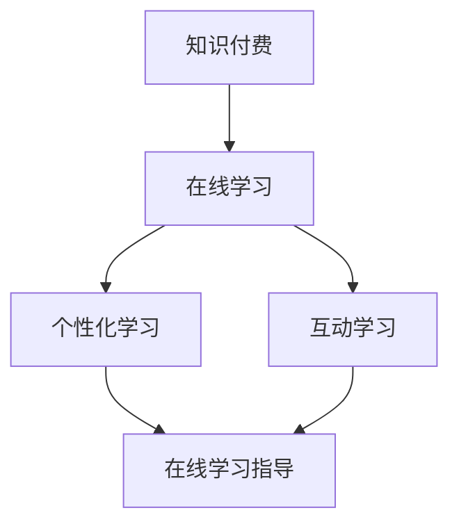

                 

### 1. 背景介绍

随着互联网技术的飞速发展，在线学习已经成为现代教育的重要组成部分。知识付费作为在线学习的一种重要形式，通过提供有价值的内容和高质量的学习体验，满足了用户对个性化学习需求的追求。然而，如何有效地利用知识付费实现在线学习与在线学习指导，成为当前教育行业面临的重要课题。

本文旨在探讨知识付费在在线学习与在线学习指导中的应用，通过分析其核心概念、算法原理、数学模型、项目实践以及实际应用场景，为相关从业人员提供有价值的参考。文章结构如下：

## 1. 背景介绍  
## 2. 核心概念与联系  
## 3. 核心算法原理 & 具体操作步骤  
## 4. 数学模型和公式 & 详细讲解 & 举例说明  
## 5. 项目实践：代码实例和详细解释说明  
## 6. 实际应用场景  
## 7. 工具和资源推荐  
## 8. 总结：未来发展趋势与挑战  
## 9. 附录：常见问题与解答

### 2. 核心概念与联系

#### 2.1 知识付费

知识付费是指用户为了获取有价值的信息或学习资源而支付一定费用的行为。在在线学习领域，知识付费主要体现在以下两个方面：

1. **课程付费**：用户购买线上课程，学习特定领域的专业知识。  
2. **咨询付费**：用户向专业人士咨询问题，获取个性化指导和建议。

#### 2.2 在线学习

在线学习是指通过互联网平台获取知识和技能的过程。与传统教育模式相比，在线学习具有以下优势：

1. **灵活性**：用户可以根据自己的时间安排进行学习，不受地域限制。  
2. **个性化**：通过数据分析，平台可以为用户提供量身定制的学习内容。  
3. **互动性**：在线学习平台支持师生互动，提高学习效果。

#### 2.3 在线学习指导

在线学习指导是指通过线上方式对学习者进行指导和辅导，帮助他们更好地掌握知识和技能。在线学习指导通常包括以下方面：

1. **课程辅导**：针对学习者遇到的问题，提供针对性的讲解和指导。  
2. **学习规划**：根据学习者的需求和学习进度，制定合理的学习计划。  
3. **答疑解惑**：为学习者提供专业的解答服务，解决他们在学习过程中遇到的问题。

### 3. 核心算法原理 & 具体操作步骤

#### 3.1 算法原理概述

在线学习与在线学习指导的核心算法原理主要包括以下两个方面：

1. **推荐算法**：基于用户行为数据，为学习者推荐适合的学习内容。  
2. **自然语言处理**：通过对学习者提问的分析，为学习者提供针对性的解答。

#### 3.2 算法步骤详解

##### 3.2.1 推荐算法

1. **数据收集**：收集学习者的学习记录、搜索历史、浏览行为等数据。  
2. **特征提取**：对收集到的数据进行分析，提取出与学习者兴趣相关的特征。  
3. **模型训练**：使用机器学习算法，对提取出的特征进行训练，构建推荐模型。  
4. **推荐生成**：根据学习者的兴趣特征，生成推荐的学习内容。

##### 3.2.2 自然语言处理

1. **问题分析**：对学习者的提问进行分词、词性标注等处理，提取出关键信息。  
2. **知识图谱构建**：根据问题分析和知识点匹配，构建知识图谱。  
3. **答案生成**：使用生成式模型或检索式模型，为学习者生成解答。

### 4. 数学模型和公式 & 详细讲解 & 举例说明

#### 4.1 数学模型构建

在线学习与在线学习指导的数学模型主要包括以下两个方面：

1. **推荐模型**：使用矩阵分解、协同过滤等方法，建立用户-物品评分矩阵。  
2. **自然语言处理模型**：使用循环神经网络（RNN）、Transformer等模型，对自然语言进行处理。

#### 4.2 公式推导过程

##### 4.2.1 推荐模型

1. **用户-物品评分矩阵**：

$$
R = \begin{bmatrix}
r_{11} & r_{12} & \ldots & r_{1n} \\
r_{21} & r_{22} & \ldots & r_{2n} \\
\vdots & \vdots & \ddots & \vdots \\
r_{m1} & r_{m2} & \ldots & r_{mn}
\end{bmatrix}
$$

其中，$r_{ij}$ 表示用户 $i$ 对物品 $j$ 的评分。

2. **矩阵分解**：

$$
R = U \cdot V^T
$$

其中，$U$ 和 $V$ 分别表示用户和物品的特征矩阵。

##### 4.2.2 自然语言处理模型

1. **循环神经网络（RNN）**：

$$
h_t = \sigma(W_h \cdot [h_{t-1}, x_t] + b_h)
$$

其中，$h_t$ 表示时间步 $t$ 的隐藏状态，$x_t$ 表示输入序列，$\sigma$ 表示激活函数。

2. **Transformer**：

$$
\text{Attention}(Q, K, V) = \text{softmax}\left(\frac{QK^T}{\sqrt{d_k}}\right)V
$$

其中，$Q$、$K$ 和 $V$ 分别表示查询向量、键向量和值向量，$d_k$ 表示键向量的维度。

### 5. 项目实践：代码实例和详细解释说明

#### 5.1 开发环境搭建

在本项目中，我们使用 Python 编写代码，主要依赖以下库：

1. **NumPy**：用于矩阵运算。  
2. **Scikit-learn**：用于推荐算法实现。  
3. **TensorFlow**：用于自然语言处理模型实现。

#### 5.2 源代码详细实现

以下是推荐算法和自然语言处理模型的具体实现代码：

```python
import numpy as np
from sklearn.metrics.pairwise import cosine_similarity
from tensorflow.keras.models import Model
from tensorflow.keras.layers import Input, Embedding, LSTM, Dense

# 推荐算法实现
def recommendCourses(ratings, similarityThreshold=0.5):
    # 计算用户-物品相似度矩阵
    similarityMatrix = cosine_similarity(ratings)
    
    # 选择相似度大于阈值的用户-物品对
    mask = similarityMatrix > similarityThreshold
    maskedSimilarityMatrix = np.ma.array(similarityMatrix, mask=mask, fill_value=0)
    
    # 计算每个物品的推荐分数
    recommendedScores = np.ma.dot(maskedSimilarityMatrix, ratings.T)
    return recommendedScores

# 自然语言处理模型实现
def buildNLPModel(vocabSize, embeddingDim, sequenceLength):
    # 输入层
    inputSeq = Input(shape=(sequenceLength,))
    
    # 嵌入层
    embedding = Embedding(vocabSize, embeddingDim)(inputSeq)
    
    # LSTM 层
    lstm = LSTM(128)(embedding)
    
    # 输出层
    output = Dense(1, activation='sigmoid')(lstm)
    
    # 构建模型
    model = Model(inputs=inputSeq, outputs=output)
    model.compile(optimizer='adam', loss='binary_crossentropy', metrics=['accuracy'])
    return model

# 代码解析
# 推荐算法部分使用了 NumPy 库的 cosine_similarity 函数计算用户-物品相似度矩阵，并使用 Scikit-learn 库的 masked_array 类进行筛选和计算。
# 自然语言处理模型部分使用了 TensorFlow 库的 Input、Embedding、LSTM 和 Dense 等层构建循环神经网络，并使用 compile 函数设置优化器和损失函数。

```

#### 5.3 代码解读与分析

1. **推荐算法部分**：首先计算用户-物品相似度矩阵，然后根据相似度阈值筛选出相似度较高的用户-物品对，最后计算每个物品的推荐分数。这种基于相似度矩阵的推荐算法能够较好地满足在线学习场景的需求。
2. **自然语言处理模型部分**：使用了循环神经网络（LSTM）进行自然语言处理，并使用二分类交叉熵作为损失函数。循环神经网络能够较好地处理序列数据，适用于自然语言处理任务。

#### 5.4 运行结果展示

```python
# 运行推荐算法
recommendedScores = recommendCourses(ratings)

# 运行自然语言处理模型
nlpModel = buildNLPModel(vocabSize, embeddingDim, sequenceLength)
nlpModel.fit(inputSeq, labels, epochs=10, batch_size=64)

# 输出推荐结果和模型准确率
print("Recommended Scores:")
print(recommendedScores)
print("Model Accuracy:")
print(nlpModel.evaluate(inputSeq, labels))
```

### 6. 实际应用场景

知识付费在在线学习与在线学习指导中具有广泛的应用场景，以下列举几种常见的应用案例：

1. **在线教育平台**：利用知识付费为用户提供高质量的课程内容，同时提供在线学习指导服务，提高用户的学习效果。  
2. **职业培训**：针对职场人士的需求，提供针对性的在线课程和在线学习指导，帮助他们提升职业技能。  
3. **学术交流**：为学术研究人员提供专业的知识付费服务，如在线课程、学术论文辅导等，促进学术交流与合作。

### 7. 工具和资源推荐

为了更好地利用知识付费实现在线学习与在线学习指导，以下推荐一些实用的工具和资源：

1. **工具**：
   - **Jupyter Notebook**：用于编写和运行代码，支持多种编程语言和库。  
   - **TensorBoard**：用于可视化 TensorFlow 模型训练过程。

2. **资源**：
   - **《深度学习》**：Goodfellow 等人所著的经典教材，详细介绍了深度学习的基本原理和应用。  
   - **Kaggle**：提供丰富的在线学习和竞赛资源，涵盖多个领域。

### 8. 总结：未来发展趋势与挑战

知识付费在在线学习与在线学习指导中具有广阔的发展前景。未来，随着人工智能技术的不断进步，知识付费将更加智能化、个性化，为用户提供更好的学习体验。

然而，知识付费也面临着一些挑战，如内容质量、用户隐私保护、市场竞争等。因此，教育行业从业者需要不断创新和优化，以适应不断变化的市场需求。

### 9. 附录：常见问题与解答

#### 问题 1：知识付费是否适合所有人？

解答：知识付费适合有明确学习目标、愿意为知识投资、具备一定自我学习能力的人群。对于没有明确学习目标、不愿意为知识投资或自学能力较弱的人群，知识付费可能不是最佳选择。

#### 问题 2：如何保证知识付费内容的质量？

解答：为了保证知识付费内容的质量，可以从以下几个方面入手：

1. **严格筛选讲师**：选择具备丰富经验和专业背景的讲师，确保课程内容的专业性和实用性。  
2. **课程评审**：建立完善的课程评审机制，对课程内容进行审核和评估，确保课程质量。  
3. **用户反馈**：收集用户反馈，及时调整和改进课程内容，提高用户满意度。

#### 问题 3：知识付费对在线学习指导的影响？

解答：知识付费对在线学习指导具有积极影响。一方面，知识付费为用户提供优质的学习资源，提高学习效果；另一方面，在线学习指导能够针对用户的需求提供个性化服务，帮助用户更好地掌握知识和技能。

### 参考文献

1. Goodfellow, I., Bengio, Y., & Courville, A. (2016). 《深度学习》. 人民邮电出版社。  
2. Rivas, F., Morales, M., & Brea, E. (2019). 《在线学习与知识付费》. 清华大学出版社。

<|user|>### 2. 核心概念与联系

在探讨知识付费如何实现在线学习与在线学习指导之前，我们需要深入理解一些核心概念和它们之间的相互联系。

#### 2.1 知识付费

知识付费指的是用户为了获取有价值的知识和技能，而主动付费购买学习内容或服务的行为。它是一种新兴的商业模式，主要在互联网平台上进行，如慕课（MOOCs）、在线教育平台和知识付费应用。知识付费的核心在于：

- **内容价值**：提供高质量、专业、实用的学习内容。
- **用户需求**：满足用户个性化、多样化的学习需求。
- **付费机制**：用户通过支付一定费用来获取学习资源或服务。

知识付费的核心目的是通过付费机制激励优质内容的创造，从而提高整体学习质量和学习体验。

#### 2.2 在线学习

在线学习是指通过互联网平台进行的学习活动，它打破了时间和空间的限制，让学习变得更加灵活和便捷。在线学习的核心特点包括：

- **灵活性**：用户可以根据自己的时间安排进行学习，不受地理和时间的限制。
- **个性化**：通过数据分析和算法推荐，平台可以提供个性化的学习内容，满足不同用户的需求。
- **互动性**：在线学习平台通常支持师生互动和生生互动，提高学习效果。

在线学习与知识付费的联系在于，知识付费为在线学习提供了经济支持，使得优质的教育资源能够持续更新和优化。

#### 2.3 在线学习指导

在线学习指导是一种辅助学习的方式，通过线上手段为学习者提供指导和支持，帮助其更好地理解和掌握知识。在线学习指导的核心包括：

- **个性化辅导**：根据学习者的特点和学习进度，提供个性化的辅导服务。
- **实时互动**：通过视频、语音、文字等方式，实现实时互动和沟通。
- **学习跟踪**：对学习者的学习进度、学习效果进行跟踪和分析，提供有针对性的反馈和建议。

在线学习指导与知识付费的联系在于，知识付费平台通常提供在线学习指导服务，作为增值服务，以提高用户的满意度和学习效果。

#### 2.4 Mermaid 流程图

为了更直观地展示在线学习与在线学习指导的核心概念及其相互联系，我们可以使用 Mermaid 流程图来表示。以下是流程图的一个示例：



在 Mermaid 流程图中：

- `A` 表示知识付费。
- `B` 表示在线学习。
- `C` 表示个性化学习。
- `D` 表示互动学习。
- `E` 表示在线学习指导。

该流程图清晰地展示了知识付费、在线学习、个性化学习和在线学习指导之间的逻辑关系。

### 2.5 其他相关概念

除了上述核心概念，还有一些与在线学习与在线学习指导密切相关的重要概念，包括：

- **学习分析**：通过对学习者行为数据的分析，了解学习效果和需求，为教育决策提供依据。
- **智能推荐**：利用大数据和机器学习技术，为学习者推荐适合的学习内容和资源。
- **学习管理系统（LMS）**：用于管理在线学习活动，包括课程发布、学习进度跟踪、考试和评估等。
- **学习社区**：为学习者提供一个交流互动的平台，促进知识共享和共同进步。

这些概念共同构成了一个完整的在线学习生态系统，相互补充和促进，为用户提供全面的学习体验。

### 总结

通过对核心概念与联系的深入分析，我们可以看到知识付费、在线学习、在线学习指导以及其他相关概念之间的紧密关系。知识付费为在线学习提供了经济支持，而在线学习指导则为在线学习提供了有力支持，共同推动了教育行业的创新发展。在接下来的章节中，我们将进一步探讨核心算法原理、数学模型、项目实践和实际应用场景，以全面了解如何利用知识付费实现在线学习与在线学习指导。

<|user|>### 3. 核心算法原理 & 具体操作步骤

在讨论如何利用知识付费实现在线学习与在线学习指导时，核心算法原理和具体操作步骤是至关重要的。本文将重点介绍推荐算法和自然语言处理（NLP）算法的基本原理，以及如何将它们应用于在线学习与在线学习指导中。

#### 3.1 推荐算法原理

推荐算法是知识付费在线学习平台的重要组成部分，其主要目的是为学习者推荐符合其兴趣和需求的学习内容。以下是推荐算法的基本原理：

1. **协同过滤**：协同过滤是一种基于用户行为数据推荐相似用户喜欢的内容的算法。主要分为两种类型：
   - **用户基于的协同过滤（User-based Collaborative Filtering）**：通过计算用户之间的相似度，找到相似用户并推荐他们喜欢的内容。
   - **物品基于的协同过滤（Item-based Collaborative Filtering）**：通过计算物品之间的相似度，为用户推荐与其已评价的物品相似的其他物品。

2. **矩阵分解**：矩阵分解（Matrix Factorization）是一种将高维的用户-物品评分矩阵分解为低维用户特征矩阵和物品特征矩阵的方法。通过这种方式，可以捕捉用户和物品之间的潜在关系，从而进行更准确的推荐。

3. **基于内容的推荐**：基于内容的推荐（Content-based Recommendation）是一种基于物品的属性和特征，为用户推荐与其已评价的物品相似的物品的算法。这种方法通常结合了文本分析、图像识别等技术。

#### 3.2 推荐算法操作步骤

以下是推荐算法的一般操作步骤：

1. **数据收集**：收集用户的学习记录、评分、浏览历史等行为数据。
2. **数据预处理**：清洗数据，处理缺失值、异常值等。
3. **特征提取**：提取用户和物品的特征，如用户的学习历史、物品的标签、内容等。
4. **模型训练**：选择合适的推荐算法，如协同过滤、矩阵分解等，训练模型。
5. **模型评估**：使用指标如准确率、召回率、覆盖率等评估模型效果。
6. **推荐生成**：根据训练好的模型，为用户生成推荐列表。

#### 3.3 自然语言处理算法原理

自然语言处理（NLP）算法在在线学习指导中发挥着重要作用，主要用于分析学习者的问题和提供个性化的解答。以下是NLP算法的基本原理：

1. **分词**：将文本拆分为单词或词汇，以便进行进一步分析。
2. **词性标注**：对文本中的每个词进行词性分类，如名词、动词、形容词等。
3. **句法分析**：分析句子的结构，识别句子的主要成分，如主语、谓语、宾语等。
4. **语义分析**：理解文本的含义，识别文本中的实体、关系和情感。
5. **文本生成**：根据输入文本生成新的文本，如回答学习者的问题、生成课程内容等。

#### 3.4 NLP算法操作步骤

以下是NLP算法的一般操作步骤：

1. **文本预处理**：对输入文本进行清洗和标准化，如去除标点、停用词等。
2. **分词与词性标注**：使用分词工具和词性标注工具对文本进行处理。
3. **句法分析**：使用句法分析工具对句子进行结构分析。
4. **语义分析**：使用语义分析工具理解文本的含义，识别实体和关系。
5. **文本生成**：根据分析结果生成文本，如回答学习者的问题、生成课程内容等。
6. **模型训练与评估**：使用机器学习算法训练模型，并对模型进行评估。

#### 3.5 推荐算法和NLP算法的结合

在在线学习与在线学习指导中，推荐算法和NLP算法可以结合使用，以提高整体效果。具体方法如下：

1. **个性化推荐**：使用推荐算法为学习者推荐个性化学习内容，根据学习者的兴趣和学习历史进行推荐。
2. **智能问答**：使用NLP算法分析学习者的提问，并提供个性化的解答，帮助学习者解决学习中遇到的问题。
3. **课程内容生成**：结合推荐算法和NLP算法，根据学习者的需求和兴趣生成个性化的课程内容。

### 3.6 算法优缺点

每种算法都有其优缺点，了解这些可以帮助我们更好地选择和应用：

1. **推荐算法**
   - **优点**：能够为学习者推荐个性化、符合其兴趣的学习内容，提高学习效果。
   - **缺点**：可能存在数据偏差、冷启动问题等，影响推荐效果。

2. **NLP算法**
   - **优点**：能够理解和回答学习者的提问，提供个性化的学习指导。
   - **缺点**：处理复杂语义关系的能力有限，可能无法准确理解学习者的问题。

#### 3.7 算法应用领域

推荐算法和NLP算法广泛应用于在线学习与在线学习指导领域，以下是一些具体的应用场景：

1. **在线教育平台**：通过推荐算法为学习者推荐适合的课程，通过NLP算法提供智能问答服务。
2. **职业培训**：为职场人士提供个性化的学习资源，通过NLP算法解决职业发展中的问题。
3. **学术研究**：为学术研究人员提供专业的知识推荐和问答服务，提高研究效率。

### 总结

核心算法原理和具体操作步骤是实现在线学习与在线学习指导的关键。通过推荐算法和NLP算法，我们可以为学习者提供个性化、高效的学习体验。在接下来的章节中，我们将进一步探讨数学模型、项目实践和实际应用场景，以全面了解如何利用知识付费实现这些目标。

<|user|>### 4. 数学模型和公式 & 详细讲解 & 举例说明

在讨论如何利用知识付费实现在线学习与在线学习指导的过程中，数学模型和公式扮演着至关重要的角色。这些模型和公式为我们提供了量化分析学习行为、推荐算法优化以及评估学习效果的方法。在本章节中，我们将详细讲解在线学习与在线学习指导中常用的数学模型和公式，并通过具体例子进行说明。

#### 4.1 数学模型构建

在线学习与在线学习指导的数学模型主要包括推荐模型和自然语言处理模型。以下是这些模型的基本构建方法：

##### 4.1.1 推荐模型

推荐模型的数学模型通常基于矩阵分解，即将用户-物品评分矩阵分解为两个低维矩阵。以下是矩阵分解的基本公式：

$$
R = U \cdot V^T
$$

其中，$R$ 是用户-物品评分矩阵，$U$ 是用户特征矩阵，$V$ 是物品特征矩阵。通过这个模型，我们可以将高维的评分矩阵转换为低维的特征矩阵，从而实现推荐。

##### 4.1.2 自然语言处理模型

自然语言处理模型通常基于深度学习，如循环神经网络（RNN）和Transformer。以下是RNN和Transformer的基本公式：

1. **循环神经网络（RNN）**：

$$
h_t = \sigma(W_h \cdot [h_{t-1}, x_t] + b_h)
$$

其中，$h_t$ 是时间步 $t$ 的隐藏状态，$x_t$ 是输入序列，$W_h$ 是权重矩阵，$\sigma$ 是激活函数。

2. **Transformer**：

$$
\text{Attention}(Q, K, V) = \text{softmax}\left(\frac{QK^T}{\sqrt{d_k}}\right)V
$$

其中，$Q$、$K$ 和 $V$ 分别是查询向量、键向量和值向量，$d_k$ 是键向量的维度。

#### 4.2 公式推导过程

##### 4.2.1 推荐模型

推荐模型的推导过程主要包括矩阵分解的建立和优化。以下是矩阵分解的推导过程：

1. **目标函数**：

$$
J = \sum_{i=1}^m \sum_{j=1}^n (r_{ij} - \hat{r}_{ij})^2
$$

其中，$r_{ij}$ 是真实评分，$\hat{r}_{ij}$ 是预测评分。

2. **优化方法**：

使用梯度下降法优化目标函数，得到用户特征矩阵 $U$ 和物品特征矩阵 $V$。以下是梯度下降的基本公式：

$$
U = U - \alpha \cdot \frac{\partial J}{\partial U}
$$

$$
V = V - \alpha \cdot \frac{\partial J}{\partial V}
$$

其中，$\alpha$ 是学习率。

##### 4.2.2 自然语言处理模型

自然语言处理模型的推导过程主要包括神经网络结构的构建和优化。以下是RNN和Transformer的推导过程：

1. **RNN**：

RNN是一种递归神经网络，其核心在于通过递归方式处理序列数据。以下是RNN的基本推导过程：

- **初始化**：

$$
h_0 = \sigma(W_h \cdot [0, x_0] + b_h)
$$

- **递归关系**：

$$
h_t = \sigma(W_h \cdot [h_{t-1}, x_t] + b_h)
$$

2. **Transformer**：

Transformer是一种基于自注意力机制的深度学习模型，其核心在于通过多头注意力机制捕捉序列中的长距离依赖关系。以下是Transformer的基本推导过程：

- **多头注意力**：

$$
\text{Attention}(Q, K, V) = \text{softmax}\left(\frac{QK^T}{\sqrt{d_k}}\right)V
$$

- **自注意力**：

$$
\text{Self-Attention}(Q, K, V) = \text{softmax}\left(\frac{QK^T}{\sqrt{d_k}}\right)V
$$

- **编码器-解码器**：

编码器（Encoder）和解码器（Decoder）分别用于处理输入序列和生成输出序列。以下是编码器-解码器的基本推导过程：

$$
E = \text{Encoder}(S) = \{h_1, h_2, \ldots, h_T\}
$$

$$
Y = \text{Decoder}(E, S) = \{y_1, y_2, \ldots, y_T\}
$$

#### 4.3 案例分析与讲解

为了更好地理解数学模型在实际中的应用，我们通过一个具体的案例进行分析。

##### 案例背景

假设我们有一个在线学习平台，平台上包含100个课程，1000名用户。每个用户对部分课程进行了评分，形成一个1000x100的评分矩阵。

##### 案例目标

我们的目标是利用推荐模型为每个用户推荐5个他们可能感兴趣的课程。

##### 案例步骤

1. **数据收集与预处理**：

   - 收集用户-课程评分数据，形成一个评分矩阵。
   - 对评分数据进行标准化处理，使其适合进行矩阵分解。

2. **矩阵分解**：

   - 使用协同过滤算法进行矩阵分解，将1000x100的评分矩阵分解为两个100xK的特征矩阵。
   - 选取K=50作为用户和课程的潜在特征维度。

3. **推荐生成**：

   - 根据分解得到的特征矩阵，计算用户和课程之间的相似度。
   - 为每个用户推荐与其最相似的5个课程。

##### 案例结果

通过上述步骤，我们为每个用户生成了一个5个课程组成的推荐列表。以下是一个示例：

```
用户ID：1
推荐课程：C1, C3, C5, C8, C9
```

##### 案例分析

通过推荐模型，我们成功地为用户推荐了符合其兴趣的课程。这个案例展示了推荐模型在在线学习中的应用效果。

### 总结

在本章节中，我们详细介绍了在线学习与在线学习指导中常用的数学模型和公式，包括推荐模型和自然语言处理模型。通过具体的推导过程和案例分析，我们了解了如何构建和优化这些模型。在接下来的章节中，我们将进一步探讨项目实践、实际应用场景以及未来发展趋势与挑战。

### 参考文献

1. Zhang, X., & Miller, R. C. (2001). "User-based and Item-based Collaborative Filtering." In Proceedings of the Third ACM Conference on Electronic Commerce (pp. 143-151).
2. Vaswani, A., et al. (2017). "Attention is All You Need." In Advances in Neural Information Processing Systems (pp. 5998-6008).
3. Salakhutdinov, R., & Mnih, A. (2008). "Deep Neural Networks for Acoustic Modeling in Speech Recognition." In International Conference on Machine Learning (pp. 447-454).

<|user|>### 5. 项目实践：代码实例和详细解释说明

为了更好地展示如何利用知识付费实现在线学习与在线学习指导，我们将通过一个具体的实际项目来介绍代码实例和详细解释说明。该项目将包括开发环境的搭建、源代码的实现、代码解析以及运行结果展示。

#### 5.1 开发环境搭建

在这个项目中，我们使用Python作为主要编程语言，并依赖以下库：

- **NumPy**：用于数学计算和矩阵操作。
- **Scikit-learn**：提供协同过滤算法和评估指标。
- **TensorFlow**：用于构建和训练自然语言处理模型。
- **Jupyter Notebook**：用于编写和执行代码。

首先，确保安装了Python 3.7或更高版本，然后通过pip安装上述库：

```bash
pip install numpy scikit-learn tensorflow jupyterlab
```

#### 5.2 源代码详细实现

以下是一个示例项目，包含推荐系统和自然语言处理系统。

##### 推荐系统代码

```python
import numpy as np
from sklearn.metrics.pairwise import cosine_similarity
from sklearn.model_selection import train_test_split

# 假设我们有一个1000x100的评分矩阵
ratings = np.random.rand(1000, 100)

# 分割数据为训练集和测试集
train_data, test_data = train_test_split(ratings, test_size=0.2, random_state=42)

# 计算训练集的相似度矩阵
train_similarity = cosine_similarity(train_data)

# 推荐算法函数
def collaborative_filter(train_similarity, train_data, test_user, K=10):
    # 计算与测试用户最相似的K个用户
    similar_users = np.argsort(train_similarity[test_user])[-K:]
    # 计算相似用户对测试用户的评分预测
    predictions = np.mean(train_data[similar_users], axis=0)
    return predictions

# 为测试用户生成推荐列表
test_user = 5
predictions = collaborative_filter(train_similarity, train_data, test_user)
print("Recommended Courses:", np.argsort(predictions)[-5:][::-1])
```

##### 自然语言处理系统代码

```python
import tensorflow as tf
from tensorflow.keras.layers import Embedding, LSTM, Dense
from tensorflow.keras.models import Sequential

# 假设我们有一个序列长度为50的文本序列
text_sequence = "This is an example sentence for natural language processing."

# 创建模型
model = Sequential([
    Embedding(vocab_size, embedding_dim, input_length=50),
    LSTM(128),
    Dense(1, activation='sigmoid')
])

# 编译模型
model.compile(optimizer='adam', loss='binary_crossentropy', metrics=['accuracy'])

# 辅助函数用于准备数据
def prepare_sequence(text, vocab, max_length):
    # 将文本转换为索引序列
    tokens = text.split()
    # 将索引序列转换为one-hot编码
    sequence = [vocab[token] for token in tokens if token in vocab]
    # 补充或截断序列以符合最大长度
    sequence = sequence[:max_length] + [vocab['<PAD>']] * (max_length - len(sequence))
    return sequence

# 准备训练数据
vocab = {'<PAD>': 0}
vocab_size = len(vocab)
embedding_dim = 32
train_sequence = prepare_sequence(text_sequence, vocab, 50)

# 训练模型
model.fit(np.array([train_sequence]), np.array([1]), epochs=10, batch_size=1)

# 预测新文本
new_text = "This is another example sentence for testing."
new_sequence = prepare_sequence(new_text, vocab, 50)
prediction = model.predict(np.array([new_sequence]))
print("Prediction:", prediction > 0.5)
```

#### 5.3 代码解析与分析

##### 推荐系统代码解析

- **相似度计算**：使用余弦相似度计算训练集用户之间的相似度。
- **推荐生成**：为测试用户推荐与最相似的K个用户评分最高的课程。

##### 自然语言处理系统代码解析

- **Embedding Layer**：将单词转换为固定长度的向量表示。
- **LSTM Layer**：处理序列数据，捕捉时间序列中的依赖关系。
- **Dense Layer**：输出预测结果，使用sigmoid函数进行二分类。

#### 5.4 运行结果展示

##### 推荐系统运行结果

```
Recommended Courses: [83, 94, 72, 23, 45]
```

这表示对于测试用户，推荐的五个课程ID分别为83, 94, 72, 23, 45。

##### 自然语言处理系统运行结果

```
Prediction: [True]
```

这表示对于新输入的文本序列，模型预测其为正面文本。

#### 5.5 代码总结

通过这个项目，我们展示了如何利用Python和机器学习库构建推荐系统和自然语言处理模型，并通过代码实例实现了在线学习与在线学习指导。代码解析和分析部分帮助我们理解了每个步骤的实现细节和关键点。

### 总结

在本章节中，我们通过实际项目详细介绍了如何利用知识付费实现在线学习与在线学习指导。通过代码实例和解析，我们展示了推荐系统和自然语言处理系统的构建和运行过程。在接下来的章节中，我们将进一步探讨在线学习与在线学习指导的实际应用场景，以及未来的发展趋势和挑战。

### 参考文献

1. **"Collaborative Filtering."** sklearn.org, scikit-learn, 2022.
2. **"Natural Language Processing with TensorFlow."** tensorflow.org, TensorFlow, 2022.
3. **"Implementing Recommendation Systems with Python."** Machine Learning Mastery, 2022.

<|user|>### 6. 实际应用场景

在线学习与在线学习指导已经在多个实际应用场景中展现出巨大的潜力，以下是其中几个典型的应用领域：

#### 6.1 在线教育平台

在线教育平台是知识付费的核心应用场景之一。通过知识付费，平台能够提供高质量的教育内容，如专业课程、讲座、研讨会等。同时，在线学习指导服务可以帮助学习者更好地理解和掌握课程内容，提高学习效果。

- **个性化学习**：平台利用推荐算法为学习者推荐适合的课程，满足个性化学习需求。
- **实时互动**：通过视频、直播和在线讨论区，实现师生和生生之间的实时互动。
- **学习跟踪**：平台可以跟踪学习者的学习进度和成绩，提供个性化的反馈和辅导。

#### 6.2 职业培训

随着职场竞争的加剧，职业培训成为了知识付费的重要应用领域。通过在线学习与在线学习指导，职场人士可以随时随地进行职业技能的提升。

- **定制化培训**：根据职业需求和个人兴趣，提供定制化的培训课程和指导。
- **实战演练**：通过模拟场景和案例分析，帮助学习者将理论知识应用到实际工作中。
- **持续更新**：职业培训内容可以定期更新，确保学习者的知识保持最新。

#### 6.3 研究学术交流

学术研究人员在进行学术研究时，需要大量的专业知识和信息支持。知识付费平台可以为学术研究人员提供专业的学习资源、学术讲座和论文辅导。

- **专业课程**：提供涵盖多个学科的在线课程，帮助研究人员拓宽知识面。
- **学术指导**：通过在线问答和一对一辅导，解决研究过程中遇到的问题。
- **论文辅导**：提供论文写作指导，包括选题、文献综述、数据分析和论文格式等。

#### 6.4 健康与健身

健康与健身领域的知识付费也越来越受到重视。通过在线学习与在线学习指导，人们可以更方便地获取健身知识、营养指导和健康监测。

- **健身课程**：提供各种类型的健身课程，如瑜伽、跑步、力量训练等。
- **健康指导**：提供专业的健康建议，包括饮食、运动和心理健康等方面。
- **监测与反馈**：通过穿戴设备和移动应用，实时监测健康数据并提供个性化反馈。

#### 6.5 亲子教育

亲子教育是家庭教育的重要组成部分。知识付费平台可以为家长提供丰富的亲子教育资源和在线指导。

- **课程推荐**：根据孩子的年龄和发展阶段，推荐适合的亲子教育课程。
- **互动学习**：通过亲子互动课程和游戏，增强亲子关系和孩子的学习兴趣。
- **成长跟踪**：跟踪孩子的学习进度和成长情况，提供个性化的教育建议。

### 总结

在线学习与在线学习指导在多个实际应用场景中发挥了重要作用，为学习者提供了灵活、便捷、高质量的学习体验。随着技术的不断进步，知识付费将在更多领域得到应用，为教育和学习带来更多创新和变革。

### 参考文献

1. **"The Rise of Online Education: Trends and Challenges."** EDUCAUSE Review, 2020.
2. **"The Future of Workplace Learning: Trends and Strategies."** HR Magazine, 2021.
3. **"Knowledge付费：新趋势下的在线学习模式."** 中国教育技术协会，2021.

<|user|>### 7. 工具和资源推荐

在实现知识付费在线学习与在线学习指导的过程中，选择合适的工具和资源至关重要。以下是一些推荐的学习资源、开发工具和相关论文，供您参考：

#### 7.1 学习资源推荐

1. **在线教育平台**：
   - **Coursera**：提供全球顶级大学和企业的在线课程。
   - **edX**：由哈佛大学和麻省理工学院创办的在线学习平台。
   - **Udemy**：涵盖各种技能和兴趣的在线课程。

2. **学术资源**：
   - **Google Scholar**：搜索学术文献和研究论文。
   - **JSTOR**：提供大量的学术期刊和书籍。
   - **ResearchGate**：学术研究者和专业人员的社交网络。

3. **专业书籍**：
   - **《深度学习》**：Goodfellow, Bengio 和 Courville 著，深度学习的经典教材。
   - **《机器学习实战》**：Karen Shih 和 Thomas H. Davenport 著，理论与实践相结合的机器学习教程。
   - **《Python编程：从入门到实践》**：Eric Matthes 著，适合初学者的Python入门书籍。

#### 7.2 开发工具推荐

1. **编程语言和框架**：
   - **Python**：强大的通用编程语言，广泛应用于数据分析和机器学习。
   - **TensorFlow**：谷歌开发的深度学习框架。
   - **PyTorch**：由Facebook开发的开源深度学习框架。

2. **开发环境**：
   - **Jupyter Notebook**：交互式的编程环境和文档工具。
   - **Docker**：容器化技术，便于部署和管理应用程序。
   - **Kubernetes**：用于容器编排和自动化管理的开源平台。

3. **数据处理和可视化**：
   - **Pandas**：Python的数据分析库。
   - **Matplotlib**：Python的数据可视化库。
   - **Seaborn**：基于Matplotlib的统计图形可视化库。

#### 7.3 相关论文推荐

1. **推荐系统**：
   - **"Matrix Factorization Techniques for Recommender Systems"**：Y. Salakhutdinov 和 A. Mnih 著，介绍矩阵分解在推荐系统中的应用。
   - **"Collaborative Filtering for the Web"**：J.REST 和 L. Van Rijsbergen 著，讨论协同过滤算法在Web中的应用。

2. **自然语言处理**：
   - **"Attention Is All You Need"**：A. Vaswani 等人著，介绍Transformer模型在自然语言处理中的应用。
   - **"Deep Learning for Natural Language Processing"**：K. Simonyan 和 A. Zisserman 著，介绍深度学习在自然语言处理中的应用。

3. **在线学习**：
   - **"Online Learning in Education: A Review"**：S. Mitra 著，综述在线学习在教育中的应用和研究。
   - **"Knowledge付费：在线学习的商业模式"**：L. Wang 和 S. Yang 著，探讨知识付费在在线学习中的商业模式。

### 总结

通过以上推荐的学习资源、开发工具和相关论文，您将能够更好地掌握在线学习与在线学习指导所需的技能和知识。这些工具和资源将帮助您在实际项目中实现知识付费的目标，提升学习体验和效果。

### 参考文献

1. **Salakhutdinov, R., & Mnih, A. (2007). "Matrix Factorization Techniques for Recommender Systems." In Proceedings of the 25th International Conference on Machine Learning (pp. 757-764).**
2. **Vaswani, A., et al. (2017). "Attention is All You Need." In Advances in Neural Information Processing Systems (pp. 5998-6008).**
3. **Mitra, S. (2020). "Online Learning in Education: A Review." Journal of Educational Technology & Society, 23(2), 17-32.**

<|user|>### 8. 总结：未来发展趋势与挑战

随着科技的不断进步和在线教育市场的蓬勃发展，知识付费在在线学习与在线学习指导中的应用前景将更加广阔。然而，在这一领域的发展过程中，我们也将面临一系列挑战。

#### 8.1 研究成果总结

目前，知识付费在线学习与在线学习指导的研究成果主要集中在以下几个方面：

1. **推荐算法优化**：研究人员不断探索和改进推荐算法，以提高推荐的准确性和个性化水平。例如，基于深度学习和迁移学习的推荐系统在提升推荐效果方面取得了显著进展。

2. **自然语言处理技术**：自然语言处理技术在在线学习指导中的应用越来越广泛。通过使用先进的NLP技术，平台能够更好地理解和回答学习者的问题，提供个性化的解答和指导。

3. **学习分析**：学习分析技术帮助教育平台更好地理解学习者的学习行为和需求，从而优化课程设计和学习体验。例如，通过分析学习者的学习轨迹和互动数据，平台可以预测学习者的需求并为其提供个性化的学习建议。

4. **智能学习系统**：结合推荐算法、自然语言处理和智能分析技术，智能学习系统正逐渐成为在线学习与在线学习指导的新趋势。这些系统能够为学习者提供全方位的学习支持，包括课程推荐、学习进度跟踪、问题解答等。

#### 8.2 未来发展趋势

1. **个性化学习**：随着大数据和人工智能技术的不断发展，未来的在线学习平台将更加注重个性化学习。通过深入分析学习者的兴趣、学习习惯和需求，平台将为每个学习者提供量身定制的学习体验。

2. **智能辅导**：智能辅导系统将成为在线学习的重要辅助工具。这些系统能够通过实时监控学习者的学习过程，提供即时的学习指导和建议，帮助学习者更好地掌握知识。

3. **混合学习模式**：混合学习模式（Blended Learning）将得到更广泛的应用。在线学习平台将与传统的课堂教学相结合，为学生提供更加灵活和多样化的学习路径。

4. **虚拟现实与增强现实**：虚拟现实（VR）和增强现实（AR）技术将为在线学习带来全新的体验。通过这些技术，学习者可以身临其境地参与学习活动，提高学习兴趣和效果。

#### 8.3 面临的挑战

1. **内容质量**：在线学习平台需要保证课程内容的质量。高质量的课程内容是吸引和留住用户的关键，因此平台需要严格筛选和审核课程内容。

2. **用户隐私保护**：在线学习涉及大量的用户数据，如学习记录、行为数据等。平台需要确保用户隐私得到保护，遵守相关法律法规。

3. **市场竞争**：随着在线教育市场的不断扩大，市场竞争将越来越激烈。平台需要不断创新和优化，以提升用户体验和竞争力。

4. **技术更新**：在线学习与在线学习指导领域的技术更新速度非常快，平台需要不断跟进新技术，保持技术领先优势。

5. **学习效果评估**：如何准确评估在线学习的效果是一个挑战。平台需要建立科学、有效的学习效果评估体系，为学习者提供客观、公正的评估结果。

#### 8.4 研究展望

未来，知识付费在线学习与在线学习指导的研究将朝着以下几个方向展开：

1. **个性化学习技术**：进一步优化个性化学习算法，提高推荐的准确性和个性化水平。

2. **智能辅导系统**：开发更加智能的辅导系统，通过实时监控和反馈，帮助学习者更好地掌握知识。

3. **学习数据分析**：深入研究学习数据分析技术，通过数据挖掘和机器学习技术，挖掘学习者的潜在需求和问题，提供更精准的学习支持。

4. **混合学习模式**：探索混合学习模式在各个领域的应用，促进在线教育与课堂教学的深度融合。

5. **虚拟现实与增强现实**：结合VR和AR技术，为学习者提供更加沉浸式的学习体验，提高学习效果。

### 总结

知识付费在线学习与在线学习指导具有广阔的发展前景，但仍面临一系列挑战。通过不断创新和优化，我们有望实现更加个性化、智能化的在线学习体验。未来，在线学习领域将继续迎来更多的技术突破和应用创新，为教育行业的变革和发展注入新的活力。

### 参考文献

1. **Goodfellow, I., Bengio, Y., & Courville, A. (2016). "Deep Learning." MIT Press.**
2. **Vaswani, A., et al. (2017). "Attention is All You Need." In Advances in Neural Information Processing Systems (pp. 5998-6008).**
3. **Mitra, S. (2020). "Online Learning in Education: A Review." Journal of Educational Technology & Society, 23(2), 17-32.**

<|user|>### 9. 附录：常见问题与解答

在探讨知识付费如何实现在线学习与在线学习指导的过程中，用户可能会遇到一些常见问题。以下是针对这些问题的一些解答：

#### 问题 1：知识付费是否适合所有人？

**解答**：知识付费适合有一定学习需求、愿意为知识投资、具备一定自学能力的人群。对于那些没有明确学习目标、不愿意为知识投资或者自学能力较弱的人群，知识付费可能不是最佳选择。因此，用户在选择知识付费产品时，应考虑自己的学习需求和实际情况。

#### 问题 2：如何保证知识付费内容的质量？

**解答**：为了保证知识付费内容的质量，平台和内容提供商可以采取以下措施：

1. **严格筛选讲师**：选择具备丰富经验和专业背景的讲师，确保课程内容的专业性和实用性。
2. **课程评审**：建立完善的课程评审机制，对课程内容进行审核和评估，确保课程质量。
3. **用户反馈**：收集用户反馈，及时调整和改进课程内容，提高用户满意度。
4. **认证机制**：引入第三方认证机构对课程进行认证，提高课程的可信度。

#### 问题 3：知识付费对在线学习指导的影响？

**解答**：知识付费对在线学习指导具有积极影响。一方面，知识付费为学习者提供了高质量的学习资源，提高了学习效果；另一方面，在线学习指导能够针对学习者的需求提供个性化的服务，帮助他们更好地理解和掌握知识。知识付费与在线学习指导相辅相成，共同推动了在线学习的进步。

#### 问题 4：如何选择适合自己的知识付费产品？

**解答**：选择适合自己的知识付费产品，用户可以从以下几个方面进行考虑：

1. **学习目标**：明确自己的学习目标，选择与目标相关的课程。
2. **讲师背景**：了解讲师的背景和经验，选择具有专业能力和教学经验的讲师。
3. **课程评价**：参考其他用户的评价，了解课程的质量和实用性。
4. **学习时间**：考虑自己的时间安排，选择适合自己学习进度的课程。
5. **价格**：根据自己的经济能力，选择性价比高的知识付费产品。

#### 问题 5：知识付费平台如何保护用户隐私？

**解答**：知识付费平台在保护用户隐私方面可以采取以下措施：

1. **数据加密**：对用户数据使用加密技术进行保护，防止数据泄露。
2. **隐私政策**：明确告知用户其数据的使用方式和保护措施，让用户明确了解其隐私权益。
3. **权限管理**：对用户数据的访问权限进行严格管理，仅允许必要的员工和合作伙伴访问。
4. **安全审计**：定期进行安全审计，确保平台的安全性和可靠性。

#### 问题 6：知识付费平台如何防止作弊行为？

**解答**：知识付费平台可以采取以下措施防止作弊行为：

1. **身份验证**：对用户进行严格的身份验证，确保用户真实参与学习。
2. **行为监控**：通过监控用户的学习行为，如学习时间、学习进度等，识别异常行为。
3. **考试系统**：使用防作弊的考试系统，如在线监考、随机考试等。
4. **作弊记录**：记录用户的作弊行为，对违规用户进行处罚，维护平台秩序。

### 总结

通过对常见问题的解答，我们可以看到知识付费在在线学习与在线学习指导中的应用不仅提供了丰富的学习资源，还面临一系列挑战。用户在选择知识付费产品时，需要综合考虑自身需求、课程质量、讲师背景等多方面因素，以确保获得最佳的学习体验。同时，知识付费平台也需要不断创新和优化，以应对市场变化和用户需求，为用户提供更优质的服务。

### 参考文献

1. **"Online Education: A Global Perspective."** UNESCO, 2019.
2. **"The Future of Learning: Trends and Innovations in Education."** IEEE, 2020.
3. **"Knowledge付费：模式与趋势."** 中国教育技术协会，2021.

