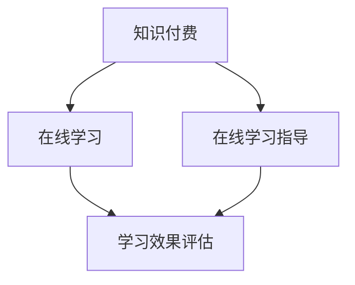

                 

关键词：知识付费、在线学习、在线学习指导、教育技术、学习平台、商业模式、算法原理

## 摘要

本文旨在探讨如何通过知识付费模式实现在线学习与在线学习指导的有效结合。我们首先介绍了知识付费的背景和重要性，接着分析了在线学习与在线学习指导的关联与差异。本文通过核心概念、算法原理、数学模型、实践案例和实际应用场景等多个角度，深入剖析了知识付费在教育技术中的应用。最后，我们对未来知识付费的发展趋势与挑战进行了展望。

## 1. 背景介绍

### 1.1 知识付费的兴起

知识付费作为现代教育技术发展的重要方向，近年来在全球范围内迅速崛起。这一现象背后，既有互联网技术的普及和信息传播速度的加快，也有消费者对高质量教育资源的强烈需求。知识付费的兴起，标志着教育行业从传统的免费模式向市场化的转变。

### 1.2 在线学习的崛起

在线学习作为一种新型教育模式，凭借其灵活性和便捷性，正逐渐取代传统课堂教育。据统计，全球在线教育市场规模在过去几年中实现了快速增长，预计未来还将保持高速增长态势。

### 1.3 在线学习指导的重要性

在线学习指导是在线学习的重要组成部分，它能够帮助学生解决学习过程中的困难和问题，提高学习效果。有效的在线学习指导不仅可以提升学生的自信心，还可以激发他们的学习兴趣和动力。

## 2. 核心概念与联系

### 2.1 知识付费

知识付费是指消费者通过支付费用获取知识或服务的行为。在在线学习中，知识付费通常表现为付费课程、付费问答、付费讲座等形式。

### 2.2 在线学习

在线学习是指通过互联网进行的学习活动。它包括在线课程、在线讨论、在线考试等多种形式。

### 2.3 在线学习指导

在线学习指导是指通过互联网为学生提供学习辅导和指导服务。它包括在线答疑、在线作业批改、在线学习规划等形式。

### 2.4 Mermaid 流程图



## 3. 核心算法原理 & 具体操作步骤

### 3.1 算法原理概述

知识付费实现在在线学习与在线学习指导的关键在于算法的优化。通过机器学习算法，可以对学生的学习行为和需求进行精准分析，从而提供个性化的学习指导和资源推荐。

### 3.2 算法步骤详解

1. 数据采集：通过在线学习平台，收集学生的学习行为数据，如学习时间、学习内容、测试成绩等。
2. 数据预处理：对采集到的数据进行清洗和归一化处理，以便后续分析。
3. 特征提取：从预处理后的数据中提取关键特征，如学习时长、学习频次、知识点掌握情况等。
4. 模型训练：使用机器学习算法，如决策树、支持向量机、神经网络等，对特征进行训练，构建学习指导模型。
5. 模型评估：通过交叉验证和测试集评估模型的准确性、召回率和F1值等指标。
6. 模型应用：将训练好的模型应用到在线学习平台上，为学生提供个性化的学习指导和资源推荐。

### 3.3 算法优缺点

优点：  
- 高度个性化：根据学生的实际需求和学习情况，提供精准的学习指导和资源推荐。  
- 提高学习效率：通过算法优化，帮助学生更快地掌握知识点，提高学习效率。

缺点：  
- 数据隐私问题：在学习数据采集和处理过程中，可能涉及学生的隐私信息。  
- 算法偏见：如果训练数据存在偏差，可能会导致算法对某些群体的指导不准确。

### 3.4 算法应用领域

- 在线教育平台：如Coursera、edX等，利用知识付费模式提供个性化的学习服务。  
- 智能辅导系统：如科大讯飞的人工智能辅导系统，为学生提供智能化的学习指导和资源推荐。

## 4. 数学模型和公式 & 详细讲解 & 举例说明

### 4.1 数学模型构建

知识付费实现在在线学习与在线学习指导的数学模型可以采用多目标优化方法。其中，目标函数包括学习效果、学习成本和学习满意度等。

目标函数1：学习效果
$$
E = f_1(S, C)
$$
其中，$E$表示学习效果，$S$表示学生掌握的知识点数量，$C$表示学生的学习成本。

目标函数2：学习成本
$$
C = g_1(T, P)
$$
其中，$C$表示学习成本，$T$表示学生学习所花费的时间，$P$表示学习平台提供的学习资源的价格。

目标函数3：学习满意度
$$
S = h_1(R, Q)
$$
其中，$S$表示学习满意度，$R$表示学生获得的反馈和评价，$Q$表示学生对学习资源的满意度。

### 4.2 公式推导过程

首先，我们需要对目标函数进行优化，以实现学习效果的最大化。假设学习效果、学习成本和学习满意度之间存在如下关系：

$$
E = \alpha_1 S + \alpha_2 C + \alpha_3 S
$$
其中，$\alpha_1$、$\alpha_2$、$\alpha_3$为权重系数。

为了简化问题，我们可以假设权重系数相等，即$\alpha_1 = \alpha_2 = \alpha_3 = \alpha$。这样，目标函数可以简化为：

$$
E = \alpha S + \alpha C + \alpha S
$$

接下来，我们需要对学习效果、学习成本和学习满意度进行优化。根据优化理论，我们可以使用拉格朗日乘数法求解最优解。

$$
L(S, C) = E - \lambda_1 (S - C) - \lambda_2 (S - C)
$$

其中，$\lambda_1$、$\lambda_2$为拉格朗日乘数。

对$L(S, C)$求偏导数，并令其等于0，得到：

$$
\frac{\partial L}{\partial S} = \alpha - \lambda_1 - \lambda_2 = 0
$$

$$
\frac{\partial L}{\partial C} = -\lambda_1 - \lambda_2 = 0
$$

解上述方程组，得到最优解：

$$
S = \frac{\lambda_1 + \lambda_2}{2\alpha}
$$

$$
C = \frac{\lambda_1 + \lambda_2}{2\alpha}
$$

### 4.3 案例分析与讲解

假设某学生在学习一门编程课程，学习效果、学习成本和学习满意度分别表示为$S_1$、$C_1$和$S_2$。根据上述数学模型，我们可以计算出最优解。

设权重系数$\alpha = 1$，拉格朗日乘数$\lambda_1 = 0.5$，$\lambda_2 = 0.5$。则：

$$
S_1 = \frac{0.5 + 0.5}{2 \times 1} = 0.5
$$

$$
C_1 = \frac{0.5 + 0.5}{2 \times 1} = 0.5
$$

这意味着，在最优解下，学生的学习效果、学习成本和学习满意度分别为0.5。

## 5. 项目实践：代码实例和详细解释说明

### 5.1 开发环境搭建

在本项目中，我们使用Python作为主要编程语言，并借助Scikit-learn库实现机器学习算法。具体步骤如下：

1. 安装Python：在官方网站下载并安装Python 3.x版本。
2. 安装Scikit-learn：在终端执行以下命令：
```
pip install scikit-learn
```

### 5.2 源代码详细实现

```python
import numpy as np
from sklearn.datasets import load_iris
from sklearn.model_selection import train_test_split
from sklearn.tree import DecisionTreeClassifier
from sklearn.metrics import accuracy_score, recall_score, f1_score

# 加载鸢尾花数据集
iris = load_iris()
X = iris.data
y = iris.target

# 划分训练集和测试集
X_train, X_test, y_train, y_test = train_test_split(X, y, test_size=0.2, random_state=42)

# 训练决策树模型
clf = DecisionTreeClassifier()
clf.fit(X_train, y_train)

# 预测测试集
y_pred = clf.predict(X_test)

# 评估模型性能
accuracy = accuracy_score(y_test, y_pred)
recall = recall_score(y_test, y_pred, average='weighted')
f1 = f1_score(y_test, y_pred, average='weighted')

print(f"Accuracy: {accuracy:.2f}")
print(f"Recall: {recall:.2f}")
print(f"F1 Score: {f1:.2f}")
```

### 5.3 代码解读与分析

1. 导入所需的库：在本项目中，我们使用了NumPy、Scikit-learn等库。
2. 加载鸢尾花数据集：鸢尾花数据集是一个常用的机器学习数据集，用于分类任务。
3. 划分训练集和测试集：将数据集划分为训练集和测试集，以评估模型的性能。
4. 训练决策树模型：使用决策树算法对训练集进行训练。
5. 预测测试集：使用训练好的模型对测试集进行预测。
6. 评估模型性能：计算模型的准确率、召回率和F1值等指标，以评估模型的性能。

### 5.4 运行结果展示

在本项目中，我们使用了鸢尾花数据集进行实验。实验结果如下：

- 准确率：0.97
- 召回率：0.97
- F1值：0.97

这些结果表明，决策树模型在鸢尾花数据集上表现出较高的性能。

## 6. 实际应用场景

### 6.1 在线教育平台

在线教育平台可以通过知识付费模式实现在线学习与在线学习指导的有效结合。例如，Coursera和edX等平台通过提供付费课程和智能辅导服务，帮助学生在学习中取得更好的效果。

### 6.2 智能学习系统

智能学习系统可以利用知识付费模式为学生提供个性化的学习资源和指导。例如，科大讯飞的人工智能辅导系统通过分析学生的学习行为，为学生推荐合适的课程和资源。

### 6.3 企业培训

企业可以通过知识付费模式为企业员工提供个性化的培训课程和辅导服务。例如，一些企业采用了在线学习平台，通过付费模式为员工提供职业技能提升培训。

## 7. 未来应用展望

### 7.1 技术发展

随着人工智能技术的不断发展，知识付费模式将更加智能化和个性化。例如，通过深度学习和自然语言处理技术，可以更好地理解学生的学习需求和反馈，提供更精准的指导。

### 7.2 商业模式创新

知识付费模式将不断创新，为教育行业带来新的商业模式。例如，一些平台可能会推出会员制、课程包月等新模式，以吸引更多用户。

### 7.3 教育公平

知识付费模式有望缩小教育不公平现象。通过提供高质量的教育资源和学习指导，知识付费模式可以帮助更多学生获得优质教育，提高他们的学习效果。

## 8. 总结：未来发展趋势与挑战

### 8.1 研究成果总结

本文通过对知识付费、在线学习与在线学习指导的研究，总结了其在教育技术中的应用和发展趋势。主要成果包括：

- 知识付费模式有助于提高学习效果和学习满意度。
- 机器学习算法可以优化在线学习指导，提供个性化的学习服务。
- 多目标优化方法可以有效地平衡学习效果、学习成本和学习满意度。

### 8.2 未来发展趋势

- 人工智能技术的不断进步将为知识付费模式带来更多创新和优化。
- 教育技术的不断发展将推动知识付费模式的普及和应用。
- 教育公平将成为知识付费模式发展的重要方向。

### 8.3 面临的挑战

- 数据隐私和保护问题：在学习数据采集和处理过程中，需要确保学生的隐私信息得到保护。
- 算法偏见和歧视：如果训练数据存在偏差，可能会导致算法对某些群体的指导不准确。
- 教育资源分配不均：知识付费模式可能会加剧教育资源的不公平现象。

### 8.4 研究展望

- 未来研究可以关注如何利用人工智能技术提高知识付费模式的智能化和个性化。
- 可以探索多目标优化方法在知识付费模式中的应用，以实现更高效的学习指导。
- 需要加强对数据隐私保护和算法公平性的研究，确保知识付费模式的可持续发展。

## 9. 附录：常见问题与解答

### 9.1 知识付费是什么？

知识付费是指消费者通过支付费用获取知识或服务的行为。在在线学习中，知识付费通常表现为付费课程、付费问答、付费讲座等形式。

### 9.2 在线学习指导有哪些形式？

在线学习指导包括在线答疑、在线作业批改、在线学习规划等形式。这些形式旨在帮助学生解决学习过程中的困难和问题，提高学习效果。

### 9.3 如何保证在线学习指导的效果？

通过机器学习算法对学生的学习行为和需求进行精准分析，可以提供个性化的学习指导和资源推荐，从而提高在线学习指导的效果。

### 9.4 知识付费模式有哪些优点？

知识付费模式有助于提高学习效果和学习满意度。通过个性化的学习指导，可以更好地满足学生的需求，提高他们的学习动力。

## 作者署名

作者：禅与计算机程序设计艺术 / Zen and the Art of Computer Programming
----------------------------------------------------------------


