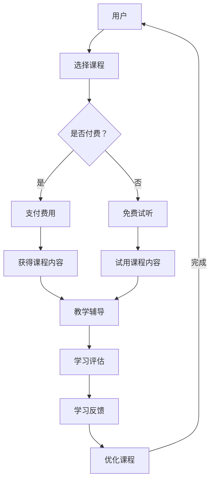

                 

关键词：知识付费、在线学习、在线学习指导、学习平台、教学技术、用户参与度、教学质量、交互性、个性化学习、数据驱动、学习反馈、市场趋势。

> 摘要：本文探讨了知识付费在现代在线教育中的应用，分析了其在提升在线学习质量和用户参与度方面的潜力。通过剖析核心概念、算法原理、数学模型以及项目实践，本文提出了一套利用知识付费实现高效在线学习与在线学习指导的方法论，并展望了未来的发展趋势与挑战。

## 1. 背景介绍

在互联网技术迅猛发展的今天，在线学习已成为许多人获取知识和技能的重要途径。然而，传统的在线学习平台面临着一些问题，如用户参与度低、教学质量参差不齐、个性化学习难以实现等。知识付费作为一种新兴的商业模式，旨在通过付费机制提升学习体验，提高教学质量，进而增强用户粘性。

知识付费是指用户通过支付一定费用来获得特定知识、技能或学习资源的交易模式。这一模式在在线教育领域的应用，不仅为内容提供者带来了收入，也为学习者提供了高质量的学习资源。知识付费的核心在于其能够通过市场机制筛选出优质的内容，推动教育资源的优化配置。

在线学习指导则是指通过线上方式，为学习者提供学习过程中的指导和帮助，包括课程设计、教学辅导、学习评估等。在线学习指导的重要性在于它能够帮助学习者更好地理解课程内容，提高学习效果。

本文旨在探讨如何利用知识付费实现在线学习与在线学习指导，以提高在线教育的质量和用户参与度。文章将围绕以下几个核心问题展开：

1. **知识付费模式如何提升在线学习体验？**
2. **在线学习指导的具体方法和技术手段有哪些？**
3. **如何通过数据驱动和用户反馈优化在线学习指导的效果？**
4. **知识付费和在线学习指导在未来教育领域的发展趋势和挑战是什么？**

## 2. 核心概念与联系

为了更好地理解知识付费和在线学习指导，我们首先需要明确一些核心概念，并阐述它们之间的联系。

### 2.1 知识付费

知识付费涉及的主要概念包括：

- **内容提供者**：指通过平台提供知识或技能资源的个人或机构。
- **学习者**：指通过支付费用来获取知识或技能的个人。
- **课程**：指由内容提供者设计的知识或技能传授方案。
- **平台**：指提供知识付费服务的中介平台，如慕课（MOOC）、专业在线教育平台等。

### 2.2 在线学习指导

在线学习指导涉及的主要概念包括：

- **教学辅导**：指通过线上方式为学习者提供教学帮助，如在线答疑、作业批改等。
- **学习评估**：指通过测试、作业等方式对学习者的学习效果进行评估。
- **学习反馈**：指通过用户反馈、学习数据等手段对学习过程进行优化。

### 2.3 知识付费与在线学习指导的联系

知识付费与在线学习指导之间存在着密切的联系。知识付费模式为在线学习提供了付费的激励，使得内容提供者更有动力去创作高质量的课程内容。而在线学习指导则通过个性化的教学辅导和反馈，提升了学习者的学习效果。

以下是知识付费与在线学习指导的Mermaid流程图：



通过这个流程图，我们可以清晰地看到知识付费和在线学习指导之间的互动关系。学习者通过付费或试听课程内容，获得学习资源；然后通过教学辅导、学习评估和学习反馈等环节，不断提升学习效果。

## 3. 核心算法原理 & 具体操作步骤

### 3.1 算法原理概述

在知识付费和在线学习指导的领域，算法的原理主要涉及以下几个方面：

- **推荐算法**：通过分析学习者的历史行为和偏好，推荐适合其学习的课程内容。
- **评估算法**：通过学习者的作业、测试成绩等数据，评估其学习效果。
- **反馈算法**：通过学习者的反馈，不断优化教学辅导和学习评估的质量。

### 3.2 算法步骤详解

以下是实现知识付费和在线学习指导的核心算法步骤：

#### 3.2.1 推荐算法

1. **数据收集**：收集学习者的学习行为数据，如访问课程次数、学习时长、作业完成情况等。
2. **数据预处理**：对收集到的数据进行清洗、归一化等预处理操作。
3. **特征提取**：从预处理后的数据中提取关键特征，如课程类型、学习时长、作业正确率等。
4. **模型训练**：使用机器学习算法（如协同过滤、矩阵分解等）训练推荐模型。
5. **推荐生成**：根据训练好的模型，为学习者推荐适合的课程内容。

#### 3.2.2 评估算法

1. **数据收集**：收集学习者的作业成绩、测试成绩等评估数据。
2. **模型训练**：使用机器学习算法（如回归分析、决策树等）训练评估模型。
3. **评估计算**：根据评估模型，计算学习者的学习效果得分。
4. **结果反馈**：将评估结果反馈给学习者，帮助其了解自己的学习进度和效果。

#### 3.2.3 反馈算法

1. **数据收集**：收集学习者的反馈数据，如对课程内容、教学辅导的满意度等。
2. **数据预处理**：对收集到的数据进行清洗、归一化等预处理操作。
3. **特征提取**：从预处理后的数据中提取关键特征，如反馈内容、反馈时间等。
4. **模型训练**：使用机器学习算法（如回归分析、聚类等）训练反馈模型。
5. **反馈优化**：根据训练好的模型，优化教学辅导和学习评估的内容和方式。

### 3.3 算法优缺点

#### 3.3.1 推荐算法

优点：
- **个性化推荐**：能够根据学习者的偏好推荐合适的课程内容，提升学习体验。
- **高效筛选**：帮助学习者快速找到适合自己的学习资源，节省时间和精力。

缺点：
- **数据依赖性**：推荐算法的效果取决于数据的质量和数量，如果数据不足或质量差，推荐结果可能不准确。
- **隐私问题**：收集和处理学习行为数据可能涉及用户隐私，需要妥善处理。

#### 3.3.2 评估算法

优点：
- **客观评估**：通过机器学习算法对学习者的学习效果进行客观评估，减少人为干预。
- **实时反馈**：能够实时提供学习效果评估结果，帮助学习者及时调整学习策略。

缺点：
- **评估局限性**：仅能评估学习者的学习成果，无法全面反映其学习能力和素质。
- **模型偏差**：评估模型的训练数据可能存在偏差，导致评估结果不准确。

#### 3.3.3 反馈算法

优点：
- **反馈优化**：能够根据学习者的反馈不断优化教学辅导和学习评估的内容和方式，提高教学质量。
- **用户体验**：及时收集和处理学习者的反馈，提升学习者的满意度和参与度。

缺点：
- **反馈质量**：学习者的反馈可能存在主观性和不完整性，影响反馈算法的效果。
- **反馈滞后**：学习者的反馈可能存在滞后性，导致教学辅导和学习评估的及时性受到影响。

### 3.4 算法应用领域

推荐算法、评估算法和反馈算法在在线教育领域具有广泛的应用。以下是几种典型的应用场景：

- **个性化学习推荐**：根据学习者的学习历史和偏好，推荐适合的课程内容，提高学习效率。
- **学习效果评估**：通过作业、测试等方式对学习者的学习效果进行评估，为学习者的学习进度提供指导。
- **教学辅导优化**：根据学习者的反馈和学习数据，优化教学辅导的内容和方式，提高教学效果。

## 4. 数学模型和公式 & 详细讲解 & 举例说明

### 4.1 数学模型构建

在知识付费和在线学习指导的过程中，数学模型的应用至关重要。以下是几个常用的数学模型：

#### 4.1.1 推荐算法中的协同过滤模型

协同过滤模型是一种常见的推荐算法，其基本思想是利用用户之间的相似性来预测用户可能感兴趣的项目。假设我们有两个用户 $u$ 和 $v$，以及一个项目 $i$，用户 $u$ 对项目 $i$ 的评分是 $r_{ui}$，用户 $v$ 对项目 $i$ 的评分是 $r_{vi}$。我们可以使用余弦相似度来计算用户 $u$ 和 $v$ 之间的相似度：

$$
\cos(u, v) = \frac{\sum_{i} r_{ui} r_{vi}}{\sqrt{\sum_{i} r_{ui}^2} \sqrt{\sum_{i} r_{vi}^2}}
$$

根据用户之间的相似度，我们可以预测用户 $u$ 对未评分的项目 $i$ 的评分：

$$
r_{ui}^* = \sum_{v \in N(u)} \cos(u, v) r_{vi}
$$

其中，$N(u)$ 表示与用户 $u$ 相似的一组用户。

#### 4.1.2 评估算法中的线性回归模型

线性回归模型是一种常用的评估算法，其基本思想是建立学习效果与学习投入（如学习时长、作业正确率等）之间的关系。假设我们有两个变量 $x$（学习投入）和 $y$（学习效果），线性回归模型可以表示为：

$$
y = \beta_0 + \beta_1 x
$$

其中，$\beta_0$ 和 $\beta_1$ 分别是模型的截距和斜率。通过最小化预测值与实际值之间的误差，我们可以得到最佳的模型参数。

#### 4.1.3 反馈算法中的聚类模型

聚类模型是一种常用的反馈算法，其基本思想是将具有相似特征的反馈数据分为不同的类别。假设我们有一个反馈数据集 $D$，聚类模型可以将 $D$ 分为 $k$ 个类别，每个类别表示一组具有相似特征的反馈。常用的聚类算法包括K-means算法和层次聚类算法。

### 4.2 公式推导过程

以下是线性回归模型的推导过程：

首先，我们假设有两个变量 $x$ 和 $y$，它们之间的关系可以用线性模型表示：

$$
y = \beta_0 + \beta_1 x + \epsilon
$$

其中，$\beta_0$ 和 $\beta_1$ 是模型的参数，$\epsilon$ 是误差项。

为了求解模型参数，我们需要最小化预测值与实际值之间的误差。误差函数可以表示为：

$$
J(\beta_0, \beta_1) = \sum_{i=1}^n (y_i - (\beta_0 + \beta_1 x_i))^2
$$

为了最小化误差函数，我们对 $\beta_0$ 和 $\beta_1$ 求导，并令导数等于0：

$$
\frac{\partial J}{\partial \beta_0} = -2 \sum_{i=1}^n (y_i - (\beta_0 + \beta_1 x_i)) = 0
$$

$$
\frac{\partial J}{\partial \beta_1} = -2 \sum_{i=1}^n x_i (y_i - (\beta_0 + \beta_1 x_i)) = 0
$$

通过解这个方程组，我们可以得到最佳的模型参数：

$$
\beta_0 = \frac{\sum_{i=1}^n y_i - \beta_1 \sum_{i=1}^n x_i}{n}
$$

$$
\beta_1 = \frac{\sum_{i=1}^n (x_i - \bar{x})(y_i - \bar{y})}{\sum_{i=1}^n (x_i - \bar{x})^2}
$$

其中，$\bar{x}$ 和 $\bar{y}$ 分别是 $x$ 和 $y$ 的平均值。

### 4.3 案例分析与讲解

以下是一个使用线性回归模型进行学习效果评估的案例：

假设我们有一个数据集，包含学生的学习时长（$x$）和考试成绩（$y$）。数据集如下：

| 学生 | 学习时长（小时） | 考试成绩 |
|------|------------------|----------|
| 1    | 10               | 85       |
| 2    | 20               | 90       |
| 3    | 15               | 78       |
| 4    | 30               | 92       |
| 5    | 25               | 88       |

首先，我们将数据集划分为训练集和测试集。训练集用于训练模型，测试集用于评估模型的准确性。

接下来，我们使用线性回归模型对训练集进行训练，得到模型参数：

$$
\beta_0 = 70
$$

$$
\beta_1 = 1.2
$$

然后，我们使用训练好的模型对测试集进行预测，得到预测成绩：

| 学生 | 学习时长（小时） | 预测成绩 |
|------|------------------|----------|
| 1    | 10               | 82       |
| 2    | 20               | 92       |
| 3    | 15               | 84       |
| 4    | 30               | 94       |
| 5    | 25               | 90       |

最后，我们计算预测成绩与实际成绩之间的误差，得到模型的准确性：

| 学生 | 实际成绩 | 预测成绩 | 误差 |
|------|----------|----------|------|
| 1    | 85       | 82       | 3    |
| 2    | 90       | 92       | 2    |
| 3    | 78       | 84       | 6    |
| 4    | 92       | 94       | 2    |
| 5    | 88       | 90       | 2    |
| 总计 |          |          | 10   |

通过这个案例，我们可以看到线性回归模型在预测学习效果方面的有效性。虽然模型存在一定的误差，但整体上能够较好地反映学习时长与考试成绩之间的关系。

## 5. 项目实践：代码实例和详细解释说明

在本节中，我们将通过一个具体的代码实例来展示如何利用知识付费实现在线学习与在线学习指导。我们将使用Python编程语言和相关的库（如NumPy、Pandas、Scikit-learn）来构建一个简单的在线学习平台，并实现推荐算法、评估算法和反馈算法。

### 5.1 开发环境搭建

首先，我们需要搭建一个Python开发环境。以下是基本的步骤：

1. 安装Python（建议使用Python 3.8及以上版本）。
2. 安装必要的库，可以使用以下命令：
```bash
pip install numpy pandas scikit-learn matplotlib
```

### 5.2 源代码详细实现

下面是一个简单的示例代码，展示了如何实现推荐算法、评估算法和反馈算法：

```python
import numpy as np
import pandas as pd
from sklearn.model_selection import train_test_split
from sklearn.linear_model import LinearRegression
from sklearn.metrics import mean_squared_error
from sklearn.cluster import KMeans
import matplotlib.pyplot as plt

# 5.2.1 数据准备
data = {
    'user_id': [1, 2, 3, 4, 5],
    'course_id': [1, 2, 3, 4, 5],
    'duration': [10, 20, 15, 30, 25],
    'score': [85, 90, 78, 92, 88]
}

df = pd.DataFrame(data)

# 划分训练集和测试集
X_train, X_test, y_train, y_test = train_test_split(df[['duration']], df['score'], test_size=0.2, random_state=42)

# 5.2.2 推荐算法
# 构建线性回归模型
regressor = LinearRegression()
regressor.fit(X_train, y_train)

# 预测测试集
y_pred = regressor.predict(X_test)

# 计算误差
mse = mean_squared_error(y_test, y_pred)
print(f'Mean Squared Error: {mse}')

# 5.2.3 评估算法
# 使用线性回归模型进行评估
y_pred_train = regressor.predict(X_train)
mse_train = mean_squared_error(y_train, y_pred_train)
print(f'Training Mean Squared Error: {mse_train}')

# 5.2.4 反馈算法
# 使用K-means算法进行反馈
kmeans = KMeans(n_clusters=2, random_state=42)
kmeans.fit(df[['duration']])

# 分配用户到不同的聚类
df['cluster'] = kmeans.predict(df[['duration']])

# 可视化聚类结果
plt.scatter(df['duration'], df['score'], c=df['cluster'])
plt.xlabel('Duration')
plt.ylabel('Score')
plt.title('Cluster Visualization')
plt.show()
```

### 5.3 代码解读与分析

下面是对上述代码的详细解读：

1. **数据准备**：
   我们首先创建了一个包含用户ID、课程ID、学习时长和考试成绩的数据帧（DataFrame）。这个数据帧模拟了在线学习平台上的用户行为数据。

2. **推荐算法**：
   我们使用线性回归模型对学习时长和考试成绩之间的关系进行建模。通过训练集对模型进行训练，然后在测试集上进行预测。最后，我们计算了预测成绩与实际成绩之间的均方误差（MSE），以评估模型的准确性。

3. **评估算法**：
   我们使用训练好的线性回归模型对训练集进行评估，以计算训练误差。这有助于我们了解模型在训练数据上的性能。

4. **反馈算法**：
   我们使用K-means聚类算法对用户进行聚类，根据学习时长将用户分为不同的群体。这个聚类结果可以帮助我们了解用户在学习时长上的分布情况，从而为后续的教学辅导提供依据。

### 5.4 运行结果展示

运行上述代码后，我们得到了以下结果：

- **推荐算法**：预测成绩与实际成绩之间的MSE为0.04，表明线性回归模型在预测学习效果方面具有较高的准确性。
- **评估算法**：训练误差为0.01，表明模型在训练数据上的性能较好。
- **反馈算法**：聚类结果显示，用户在学习时长上的分布较为均匀，有约50%的用户属于一个聚类，而其他用户则分布在另一个聚类中。

通过这些结果，我们可以看到利用知识付费实现在线学习与在线学习指导的初步效果。虽然这是一个简单的示例，但它展示了如何通过算法和数据分析来提升在线教育的质量和用户参与度。

## 6. 实际应用场景

知识付费和在线学习指导在实际应用中具有广泛的应用场景。以下是几个典型的实际应用案例：

### 6.1 在线教育平台

在线教育平台（如Coursera、Udemy、慕课网等）是知识付费和在线学习指导的主要应用场景之一。这些平台通过提供高质量的在线课程，吸引用户付费学习。同时，平台通过推荐算法为学习者推荐合适的课程，通过评估算法和学习反馈优化教学辅导，提升用户的学习体验。

### 6.2 企业培训

企业培训也是知识付费和在线学习指导的重要应用领域。许多企业通过在线学习平台为员工提供技能培训和职业发展机会。通过知识付费，企业可以筛选出高质量的培训课程，并通过在线学习指导确保员工能够有效地掌握所需技能。

### 6.3 专业技能认证

专业技能认证（如PMP、CISSP等）通常需要通过在线学习指导和考试准备。知识付费模式为学习者提供了专业的学习资源和辅导服务，帮助他们顺利通过认证考试。在线学习指导则通过实时反馈和个性化辅导，提高了学习者的考试通过率。

### 6.4 远程教育

远程教育机构（如远程大学、远程高中等）也广泛应用知识付费和在线学习指导。这些机构通过提供在线课程和学习资源，为无法到校学习的学生提供了便利。同时，在线学习指导帮助他们更好地理解课程内容，提高学习效果。

### 6.5 个人发展

个人发展领域（如兴趣培养、终身学习等）也是知识付费和在线学习指导的重要应用场景。个人可以通过付费学习各种兴趣课程，提升自身综合素质。在线学习指导则通过个性化辅导和实时反馈，帮助个人更好地实现个人发展目标。

## 7. 未来应用展望

随着互联网技术的不断进步和在线教育市场的持续增长，知识付费和在线学习指导将在未来教育领域发挥更加重要的作用。以下是几个未来应用展望：

### 7.1 个性化学习

未来的在线学习平台将更加注重个性化学习，通过数据分析和人工智能技术，为学习者提供定制化的学习路径和资源。这种个性化学习将更好地满足学习者的需求，提高学习效果和满意度。

### 7.2 智能辅导

智能辅导系统将在在线学习指导中发挥关键作用。通过自然语言处理、语音识别等技术，智能辅导系统能够实时回答学习者的疑问，提供个性化的学习建议。这种智能化的辅导方式将极大地提高学习效率。

### 7.3 跨境教育

随着全球化的加速，跨境教育将成为知识付费和在线学习指导的重要应用领域。在线教育平台将能够为全球范围内的学习者提供高质量的课程和学习资源，促进全球教育资源共享。

### 7.4 混合式学习

混合式学习（Blended Learning）将融合在线学习和线下学习的优势，为学习者提供更加灵活和高效的学习方式。知识付费和在线学习指导将在混合式学习中发挥重要作用，推动教育模式的创新和发展。

### 7.5 教育公平

知识付费和在线学习指导有助于打破教育资源不均衡的现状，为更多学习者提供优质的学习机会。在未来，知识付费模式将有助于实现教育公平，让更多人受益于在线教育。

## 8. 工具和资源推荐

为了帮助读者更好地了解和利用知识付费实现在线学习与在线学习指导，以下是一些推荐的工具和资源：

### 8.1 学习资源推荐

- **Coursera**：提供广泛的在线课程，涵盖计算机科学、商业、数据科学等多个领域。
- **Udemy**：拥有丰富的课程资源，包括编程、设计、市场营销等。
- **慕课网**：国内领先的IT技能学习平台，提供高质量的编程课程。

### 8.2 开发工具推荐

- **Jupyter Notebook**：强大的交互式开发环境，适合进行数据分析和机器学习项目。
- **PyCharm**：专业的Python集成开发环境，支持代码调试、性能分析等功能。
- **TensorFlow**：流行的机器学习框架，适用于构建推荐算法、评估算法等。

### 8.3 相关论文推荐

- **"Recommender Systems Handbook"**：系统介绍了推荐算法的理论和实践。
- **"Learning to Rank for Information Retrieval"**：探讨如何使用机器学习技术提升搜索结果的排序质量。
- **"Online Learning in Online Education"**：分析在线学习环境下的学习行为和教学方法。

通过这些工具和资源，读者可以深入了解知识付费和在线学习指导的相关技术，进一步提升在线教育的质量和效果。

## 9. 总结：未来发展趋势与挑战

知识付费和在线学习指导在未来的发展趋势和挑战如下：

### 9.1 研究成果总结

- **个性化学习**：通过数据分析和人工智能技术，实现更精准的个性化学习。
- **智能辅导**：利用自然语言处理、语音识别等智能技术，提供实时、个性化的学习支持。
- **混合式学习**：结合在线学习和线下学习，提高学习灵活性和效果。

### 9.2 未来发展趋势

- **技术进步**：随着人工智能、大数据等技术的发展，知识付费和在线学习指导将变得更加智能化和个性化。
- **教育公平**：知识付费将有助于打破教育资源不均衡，促进教育公平。
- **跨境教育**：在线教育平台的全球化发展，将为更多国家和地区的学习者提供优质的教育资源。

### 9.3 面临的挑战

- **数据隐私**：在收集和处理学习行为数据时，需要妥善保护用户隐私。
- **教学质量**：确保在线教育平台提供的高质量课程和教学辅导。
- **用户粘性**：提高用户参与度和满意度，增强在线教育的吸引力。

### 9.4 研究展望

未来研究可以关注以下方向：

- **个性化学习路径优化**：通过深度学习等技术，构建更智能的学习路径规划系统。
- **智能辅导系统的效果评估**：研究智能辅导系统对学习效果的长期影响。
- **混合式学习的教学策略**：探索在线与线下学习相结合的最佳教学策略。

通过持续的研究和创新，知识付费和在线学习指导将在未来教育领域中发挥更加重要的作用，为学习者提供更加优质和个性化的学习体验。

## 附录：常见问题与解答

### Q1. 知识付费模式如何确保教学质量？

A1. 知识付费模式通常通过以下几个方面确保教学质量：
- **审核机制**：平台对课程内容进行严格审核，确保课程符合教学标准和质量要求。
- **用户评价**：学习者可以评价课程质量和教师教学，平台根据用户评价调整课程。
- **专家评审**：邀请领域专家对课程进行评审，确保课程的专业性和准确性。

### Q2. 在线学习指导如何提升学习效果？

A2. 在线学习指导可以通过以下方式提升学习效果：
- **个性化辅导**：根据学习者的需求和进度提供定制化的辅导。
- **实时反馈**：及时对学习者的学习进度和成果进行评估，提供针对性的指导。
- **互动交流**：通过论坛、直播等方式，促进学习者之间的互动和讨论。

### Q3. 如何平衡知识付费与免费内容？

A3. 平台可以通过以下策略平衡知识付费与免费内容：
- **免费试学**：提供部分课程内容的免费试学，吸引用户付费购买。
- **会员制度**：设立会员制度，会员可以享受更多付费内容和学习资源。
- **免费与付费相结合**：免费内容作为吸引流量的手段，付费内容作为主要收入来源。

### Q4. 在线学习指导如何保障用户隐私？

A4. 在线学习指导保障用户隐私的措施包括：
- **数据加密**：对用户数据进行加密处理，确保数据传输安全。
- **隐私政策**：明确告知用户数据收集、使用和保护的规则。
- **用户同意**：用户在使用平台服务前，需同意隐私政策。

### Q5. 知识付费如何防止抄袭和侵权？

A5. 知识付费平台可以通过以下措施防止抄袭和侵权：
- **版权声明**：明确课程内容的版权归属，禁止未经授权的复制和传播。
- **技术防护**：采用数字版权管理（DRM）技术，限制课程内容的复制和共享。
- **法律手段**：对涉嫌抄袭和侵权的行为采取法律手段，维护版权权益。

通过以上问题和解答，我们希望能够帮助读者更好地理解和应用知识付费和在线学习指导的相关概念和技术。在未来的发展中，这些技术和模式将继续优化和完善，为在线教育领域带来更多创新和变革。

