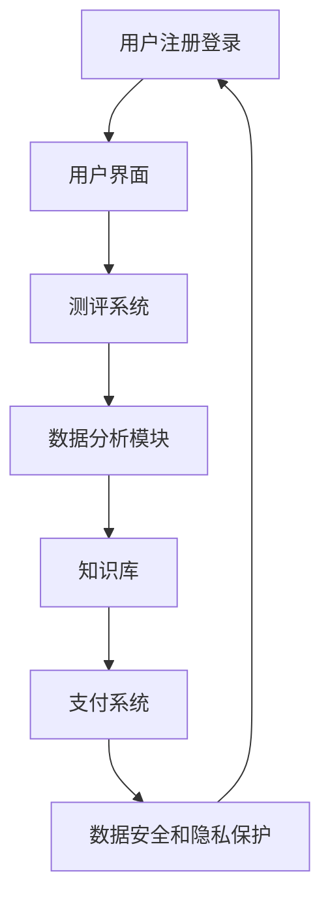

                 

在当今这个信息爆炸的时代，人们的心理健康问题日益受到关注。随着互联网的普及和技术的进步，在线心理测评与性格分析成为了现代心理学研究的重要方向。而知识付费作为互联网经济的一种新形态，为这一领域的发展提供了新的动力。本文将探讨如何利用知识付费模式实现在线心理测评与性格分析，并分析其优势与挑战。

## 文章关键词
知识付费、在线心理测评、性格分析、用户需求、数据分析、技术应用

## 文章摘要
本文首先介绍了在线心理测评与性格分析的重要性和现状，然后分析了知识付费模式的特点及其在心理测评领域中的应用。接着，文章详细阐述了如何利用知识付费实现在线心理测评与性格分析的具体方法，包括技术手段、数据分析和应用场景。最后，文章总结了知识付费模式的优势和面临的挑战，并对未来发展趋势进行了展望。

### 背景介绍

在线心理测评与性格分析是一种利用互联网技术对个体心理状态和行为模式进行量化评估的方法。它不仅有助于个体更好地了解自己的心理状态，还能为心理咨询和治疗提供科学依据。近年来，随着人们对心理健康问题的关注度不断提升，在线心理测评与性格分析市场得到了快速发展。

然而，现有的在线心理测评工具和平台存在一些问题。首先，很多工具缺乏科学性和专业性，无法提供准确的评估结果。其次，用户体验较差，界面设计不够友好，操作流程繁琐。此外，数据隐私和安全问题也备受关注。在这种情况下，知识付费模式的出现为在线心理测评与性格分析带来了新的机遇。

知识付费是一种通过提供专业知识和服务获取收益的商业模式。它利用互联网的优势，将专业知识以付费内容的形式提供给用户。知识付费模式在多个领域取得了成功，如在线教育、职业培训等。在心理测评与性格分析领域，知识付费可以为用户提供高质量的测评工具和专业的咨询服务，从而满足用户对专业性和个性化的需求。

### 核心概念与联系

#### 核心概念

1. **在线心理测评**：在线心理测评是指利用互联网技术对个体心理状态和行为模式进行量化评估的方法。它通常包括问卷、测试题和数据分析等环节。

2. **性格分析**：性格分析是指通过对个体性格特征和行为模式的评估，识别个体的性格类型和优劣势。

3. **知识付费**：知识付费是指通过提供专业知识和服务获取收益的商业模式。

#### 联系与架构

为了实现在线心理测评与性格分析，我们需要构建一个综合性的技术架构，该架构包括以下几个关键组成部分：

1. **用户界面**：用户界面（UI）是用户与系统交互的入口，需要设计简洁、友好，便于用户操作。

2. **测评系统**：测评系统负责生成测评问卷、处理用户回答、进行数据分析，并生成评估报告。

3. **数据分析模块**：数据分析模块负责对用户数据进行处理、分析和挖掘，以提取有价值的信息。

4. **知识库**：知识库包含心理测评和性格分析的相关理论、方法和案例，为测评系统和数据分析模块提供支持。

5. **支付系统**：支付系统负责处理用户的支付行为，确保知识付费模式的顺利运行。

6. **数据安全和隐私保护**：数据安全和隐私保护是知识付费模式中的关键环节，需要采取一系列技术和管理措施，确保用户数据的安全和隐私。

#### Mermaid 流程图



### 核心算法原理 & 具体操作步骤

#### 3.1 算法原理概述

在线心理测评与性格分析的核心算法主要包括以下几个部分：

1. **问卷设计**：问卷设计是根据心理学理论和用户需求，设计出科学、有效的测评问卷。

2. **数据处理**：数据处理是对用户回答的数据进行清洗、整理和预处理，为后续分析做准备。

3. **数据分析**：数据分析是对预处理后的数据进行统计分析、模式识别和聚类分析等，以提取有价值的信息。

4. **报告生成**：报告生成是根据分析结果，生成个性化的评估报告，为用户提供有针对性的建议。

#### 3.2 算法步骤详解

1. **问卷设计**

   问卷设计是根据心理学理论和用户需求，设计出科学、有效的测评问卷。问卷应包括以下几个部分：

   - **基本信息**：如年龄、性别、职业等。
   - **性格测试**：如大五人格测试、MBTI 等。
   - **心理健康评估**：如抑郁自评量表、焦虑自评量表等。
   - **问题行为评估**：如网络成瘾量表、强迫症状量表等。

   问卷设计需要遵循科学性、有效性和实用性的原则，确保问卷能够准确反映用户的心理状态和性格特征。

2. **数据处理**

   数据处理是对用户回答的数据进行清洗、整理和预处理，为后续分析做准备。具体步骤包括：

   - **数据清洗**：去除无效数据和异常值，保证数据的质量。
   - **数据整理**：将数据整理成适合分析的形式，如将文本数据转换为数值数据。
   - **数据预处理**：对数据进行标准化、归一化等处理，提高数据的可用性。

3. **数据分析**

   数据分析是对预处理后的数据进行统计分析、模式识别和聚类分析等，以提取有价值的信息。具体步骤包括：

   - **统计分析**：如描述性统计、相关分析、回归分析等，用于描述用户的心理状态和性格特征。
   - **模式识别**：如决策树、支持向量机等，用于识别用户的性格类型和行为模式。
   - **聚类分析**：如 K-means 聚类、层次聚类等，用于将用户分为不同的群体，分析群体特征。

4. **报告生成**

   报告生成是根据分析结果，生成个性化的评估报告，为用户提供有针对性的建议。具体步骤包括：

   - **结果整理**：将分析结果整理成文字和图表，便于用户理解和阅读。
   - **建议生成**：根据分析结果，为用户提供个性化的建议，如心理健康管理、性格优化等。

#### 3.3 算法优缺点

1. **优点**

   - **高效性**：通过自动化算法，可以快速完成大规模用户的测评和数据分析。
   - **个性化**：根据用户的个体差异，提供个性化的评估和建议。
   - **便捷性**：用户可以通过互联网随时随地完成测评，无需到现场。

2. **缺点**

   - **准确性**：虽然自动化算法在一定程度上提高了评估的准确性，但仍然存在一定的误差。
   - **安全性**：用户数据的安全性和隐私保护是知识付费模式中的一大挑战。

#### 3.4 算法应用领域

1. **心理健康领域**：在线心理测评和性格分析可以帮助用户了解自己的心理健康状态，提供心理健康管理建议。

2. **人力资源领域**：企业可以通过在线心理测评和性格分析来选拔和培养人才，提高员工的工作效率和团队协作能力。

3. **教育领域**：教育机构可以通过在线心理测评和性格分析来了解学生的心理状态和学习需求，提供个性化的教育服务。

### 数学模型和公式 & 详细讲解 & 举例说明

在线心理测评与性格分析涉及多个数学模型和公式，这些模型和公式有助于我们更好地理解和解释分析结果。以下是一些常用的数学模型和公式的详细讲解和举例说明。

#### 4.1 数学模型构建

在线心理测评与性格分析中的数学模型主要包括以下几个方面：

1. **问卷设计模型**：问卷设计模型用于确定问卷的结构和内容，常见的模型包括逻辑回归模型、因子分析模型等。

2. **数据分析模型**：数据分析模型用于对用户回答的数据进行处理和分析，常见的模型包括聚类分析模型、回归分析模型等。

3. **评估模型**：评估模型用于生成评估报告，常见的模型包括线性回归模型、神经网络模型等。

#### 4.2 公式推导过程

1. **逻辑回归模型**

   逻辑回归模型是一种常用的分类模型，用于预测二分类结果。其公式为：

   $$ P(Y=1|X) = \frac{1}{1 + e^{-(\beta_0 + \beta_1X_1 + \beta_2X_2 + ... + \beta_nX_n)}} $$

   其中，$P(Y=1|X)$ 表示在给定自变量 $X$ 的条件下，因变量 $Y$ 等于 1 的概率，$\beta_0, \beta_1, \beta_2, ..., \beta_n$ 是模型的参数。

2. **因子分析模型**

   因子分析模型是一种常用的降维模型，用于分析多个变量之间的关系。其公式为：

   $$ X = \Lambda F + \epsilon $$

   其中，$X$ 是观测变量矩阵，$\Lambda$ 是因子载荷矩阵，$F$ 是因子得分矩阵，$\epsilon$ 是特殊因子矩阵。

3. **线性回归模型**

   线性回归模型是一种常用的回归模型，用于分析自变量和因变量之间的关系。其公式为：

   $$ Y = \beta_0 + \beta_1X_1 + \beta_2X_2 + ... + \beta_nX_n + \epsilon $$

   其中，$Y$ 是因变量，$X_1, X_2, ..., X_n$ 是自变量，$\beta_0, \beta_1, \beta_2, ..., \beta_n$ 是模型的参数。

#### 4.3 案例分析与讲解

以下是一个基于逻辑回归模型的在线心理测评案例分析：

假设我们有一个心理健康评估问题，需要预测用户是否患有抑郁症。我们收集了以下数据：

- 用户年龄（$X_1$）
- 用户性别（$X_2$）
- 用户是否吸烟（$X_3$）
- 用户是否锻炼（$X_4$）

根据这些数据，我们使用逻辑回归模型进行预测。模型公式为：

$$ P(\text{抑郁症}|X) = \frac{1}{1 + e^{-(\beta_0 + \beta_1X_1 + \beta_2X_2 + \beta_3X_3 + \beta_4X_4)}} $$

我们使用训练数据集进行模型训练，得到以下参数：

$$ \beta_0 = -2, \beta_1 = 0.5, \beta_2 = -1, \beta_3 = 0.3, \beta_4 = 0.2 $$

现在，我们需要预测一个新用户（年龄 30 岁、男性、吸烟、不锻炼）是否患有抑郁症。将用户的特征值代入模型公式，得到：

$$ P(\text{抑郁症}|X) = \frac{1}{1 + e^{-( -2 + 0.5 \times 30 - 1 + 0.3 \times 1 + 0.2 \times 0 )}} = \frac{1}{1 + e^{-2}} \approx 0.8827 $$

根据概率阈值（如 0.5），我们可以判断该用户患有抑郁症的可能性较大。实际应用中，我们还可以结合其他因素（如临床诊断、医生建议等）进行综合评估。

### 项目实践：代码实例和详细解释说明

为了更好地理解如何利用知识付费模式实现在线心理测评与性格分析，以下我们以一个具体项目为例，介绍如何搭建一个在线心理测评平台，并详细解释代码实现和各个模块的功能。

#### 5.1 开发环境搭建

为了搭建一个在线心理测评平台，我们需要以下开发环境：

- **前端开发工具**：HTML、CSS、JavaScript（如 React 或 Vue.js）
- **后端开发框架**：Node.js、Express 或 Django 等
- **数据库**：MySQL 或 MongoDB 等
- **支付系统**：支付宝、微信支付等
- **版本控制**：Git

首先，我们需要安装以上工具和框架，并配置好开发环境。以 Node.js 和 Express 为例，安装步骤如下：

```bash
# 安装 Node.js
curl -sL https://nodejs.org/dist/v16.13.0/installer.sh | sh

# 安装 Express
npm install express
```

#### 5.2 源代码详细实现

以下是一个简单的在线心理测评平台的源代码示例，包括前端、后端和数据库的代码实现。

1. **前端代码**

前端代码主要实现用户界面和交互功能，以下是一个简单的 HTML 和 JavaScript 代码示例：

```html
<!DOCTYPE html>
<html>
<head>
  <title>在线心理测评</title>
  <script src="https://cdn.jsdelivr.net/npm/@vue/cli-service/libexecuteCLI.js"></script>
</head>
<body>
  <div id="app">
    <h1>心理健康测评</h1>
    <form @submit.prevent="submitForm">
      <div>
        <label for="age">年龄：</label>
        <input type="number" v-model="user.age" />
      </div>
      <div>
        <label for="gender">性别：</label>
        <select v-model="user.gender">
          <option value="male">男</option>
          <option value="female">女</option>
        </select>
      </div>
      <div>
        <label for="smoking">吸烟：</label>
        <select v-model="user.smoking">
          <option value="yes">是</option>
          <option value="no">否</option>
        </select>
      </div>
      <!-- 更多测评问题 -->
      <button type="submit">提交</button>
    </form>
  </div>

  <script>
    const app = new Vue({
      el: '#app',
      data: {
        user: {
          age: '',
          gender: '',
          smoking: ''
        }
      },
      methods: {
        submitForm() {
          // 调用后端接口提交数据
          console.log(this.user);
        }
      }
    });
  </script>
</body>
</html>
```

2. **后端代码**

后端代码主要实现数据处理和接口管理，以下是一个简单的 Node.js 和 Express 代码示例：

```javascript
const express = require('express');
const bodyParser = require('body-parser');
const app = express();

app.use(bodyParser.json());

// 接收前端提交的测评数据
app.post('/submit', (req, res) => {
  const userData = req.body;
  console.log(userData);

  // 数据处理逻辑，如存储到数据库等

  res.send({ message: '数据提交成功' });
});

// 启动服务器
app.listen(3000, () => {
  console.log('服务器启动成功，端口：3000');
});
```

3. **数据库代码**

数据库代码主要实现数据存储和查询，以下是一个简单的 MongoDB 代码示例：

```javascript
const MongoClient = require('mongodb').MongoClient;
const url = 'mongodb://localhost:27017/';
const dbName = 'psychological_test';

MongoClient.connect(url, { useUnifiedTopology: true }, (err, client) => {
  if (err) throw err;

  const db = client.db(dbName);
  const collection = db.collection('users');

  // 存储用户数据
  collection.insertOne(userData, (err, result) => {
    if (err) throw err;
    console.log('数据存储成功：', result);
  });

  // 查询用户数据
  collection.find({}).toArray((err, docs) => {
    if (err) throw err;
    console.log('查询结果：', docs);
  });

  client.close();
});
```

#### 5.3 代码解读与分析

以上代码示例展示了如何搭建一个简单的在线心理测评平台。前端代码使用了 Vue.js 框架实现用户界面和交互功能，后端代码使用了 Node.js 和 Express 框架处理数据请求和接口管理，数据库代码使用了 MongoDB 进行数据存储和查询。

前端代码中，我们定义了一个简单的表单，用于收集用户的基本信息。通过 Vue.js 的数据绑定功能，我们可以将用户输入的数据实时更新到 Vue 实例的 data 对象中。

后端代码中，我们使用 Express 框架创建了一个简单的 HTTP 服务器，并定义了一个处理 POST 请求的路由。该路由接收前端提交的用户数据，并将其打印到控制台。在实际应用中，我们还需要对用户数据进行处理（如存储到数据库、进行数据分析等）。

数据库代码中，我们使用 MongoDB 进行数据存储和查询。通过 MongoDB 的 Node.js 驱动程序，我们可以轻松地实现对数据的增删改查操作。

#### 5.4 运行结果展示

在完成代码实现后，我们可以在本地启动服务器，并使用浏览器访问相应的网址进行测试。以下是一个简单的运行结果展示：

1. 用户访问心理测评网站，填写并提交问卷。
2. 前端代码将用户数据发送到后端接口。
3. 后端接口处理用户数据，并将结果返回给前端。
4. 前端页面显示处理结果，如测评报告和个性化建议。

通过以上步骤，我们可以搭建一个简单的在线心理测评平台，为用户提供便捷、高效的心理健康评估服务。

### 实际应用场景

在线心理测评与性格分析在实际生活中有着广泛的应用场景。以下列举几个典型的应用场景：

1. **心理健康评估**：在线心理测评可以帮助用户了解自己的心理健康状况，如焦虑、抑郁、压力等。用户可以通过在线问卷或测试，快速获得自己的心理评估结果，并根据结果采取相应的心理健康管理措施。

2. **职业规划**：性格分析可以帮助用户了解自己的性格特点和职业适应性。企业可以通过在线心理测评和性格分析，为员工提供个性化的职业规划建议，帮助员工找到最适合自己的职业路径。

3. **教育培训**：教育机构可以通过在线心理测评和性格分析，了解学生的心理状态和学习需求。根据分析结果，教育机构可以为学生提供个性化的教育方案，提高教育质量和教学效果。

4. **社交平台**：社交平台可以通过在线心理测评和性格分析，为用户提供更精准的社交匹配建议。用户可以通过测评了解自己的性格特点和兴趣爱好，从而找到志同道合的朋友。

5. **心理咨询**：心理咨询师可以通过在线心理测评和性格分析，对用户进行初步评估，为用户提供更有针对性的心理咨询和治疗建议。

### 未来应用展望

随着人工智能和大数据技术的不断发展，在线心理测评与性格分析将迎来更广阔的发展前景。以下是一些未来应用展望：

1. **个性化诊断与治疗**：利用人工智能技术，可以实现对心理疾病的个性化诊断与治疗。通过对用户行为数据和心理数据的深度挖掘，人工智能可以识别用户的潜在心理问题，并提供个性化的治疗建议。

2. **实时心理健康监测**：通过可穿戴设备和移动应用，可以实现对用户心理健康的实时监测。用户可以通过手机或手环等设备，实时记录自己的心理状态，并根据数据变化进行自我调节和干预。

3. **智能心理助手**：未来，智能心理助手将成为用户生活中的重要伙伴。通过语音识别、自然语言处理等技术，智能心理助手可以与用户进行实时对话，提供心理支持和建议。

4. **跨学科融合**：在线心理测评与性格分析将与其他学科（如医学、教育学、心理学等）进行深度融合，为用户提供更全面、更专业的心理健康服务。

### 工具和资源推荐

为了更好地了解和研究在线心理测评与性格分析，以下推荐一些相关的学习资源和开发工具：

1. **学习资源推荐**

   - 《心理学与生活》：这是一本经典的心理学教材，涵盖了心理学的基本概念和应用。
   - 《大数据时代：生活、工作与思维的大变革》：这本书详细介绍了大数据技术的原理和应用，对在线心理测评与性格分析有很好的参考价值。

2. **开发工具推荐**

   - **前端开发工具**：Vue.js、React、Angular 等。
   - **后端开发框架**：Node.js、Express、Django、Flask 等。
   - **数据库**：MySQL、MongoDB、PostgreSQL 等。
   - **支付系统**：支付宝、微信支付、PayPal 等。

3. **相关论文推荐**

   - 《基于大数据的心理健康监测与预警系统研究》
   - 《人工智能在心理健康领域的应用》
   - 《基于深度学习的在线心理测评方法研究》

### 总结：未来发展趋势与挑战

#### 8.1 研究成果总结

在线心理测评与性格分析作为一种新兴的互联网服务，近年来取得了显著的成果。主要表现在以下几个方面：

1. **技术成熟**：人工智能、大数据等技术的不断发展，为在线心理测评与性格分析提供了强大的技术支持。

2. **市场前景**：随着人们对心理健康问题的关注度不断提升，在线心理测评与性格分析市场前景广阔。

3. **用户需求**：在线心理测评与性格分析满足了用户对专业性和个性化的需求，得到了广泛的认可。

#### 8.2 未来发展趋势

未来，在线心理测评与性格分析将呈现以下发展趋势：

1. **智能化**：随着人工智能技术的不断发展，在线心理测评与性格分析将实现智能化，提供更精准的评估和诊断。

2. **个性化**：在线心理测评与性格分析将更加注重个性化，为用户提供量身定制的心理健康服务。

3. **实时性**：通过可穿戴设备和移动应用，在线心理测评与性格分析将实现实时监测和预警。

4. **跨学科融合**：在线心理测评与性格分析将与其他学科（如医学、教育学等）进行深度融合，为用户提供更全面、更专业的心理健康服务。

#### 8.3 面临的挑战

在线心理测评与性格分析在发展过程中也面临一些挑战：

1. **数据隐私和安全**：用户数据的安全和隐私保护是知识付费模式中的关键问题，需要采取一系列技术和管理措施确保数据安全。

2. **算法公正性**：在线心理测评与性格分析中的算法模型需要保证公正性，避免歧视和不公平现象。

3. **用户信任**：提高用户对在线心理测评与性格分析平台的信任度，是推动行业发展的关键。

#### 8.4 研究展望

未来，在线心理测评与性格分析研究应关注以下几个方面：

1. **算法优化**：研究更高效、更准确的算法模型，提高评估和诊断的准确性。

2. **数据挖掘**：深入挖掘用户数据，发现潜在的心理问题和行为模式，为用户提供更有针对性的心理健康服务。

3. **跨学科研究**：加强与其他学科的融合，为用户提供更全面、更专业的心理健康服务。

### 附录：常见问题与解答

**Q1. 在线心理测评的结果是否可靠？**

在线心理测评的结果具有一定的参考价值，但不可完全依赖。在线测评工具和平台的设计和开发应符合科学性、有效性和实用性的原则。用户在使用在线心理测评时应结合自身实际情况，如有疑虑，建议寻求专业心理咨询师的帮助。

**Q2. 在线心理测评的数据是否安全？**

在线心理测评平台在数据收集、存储和处理过程中，应采取一系列技术和管理措施，确保用户数据的安全和隐私。用户在选择在线心理测评平台时，应关注平台的数据安全政策，确保个人信息不被泄露。

**Q3. 在线心理测评与临床诊断有何区别？**

在线心理测评主要用于初步评估和筛查，不能替代临床诊断。临床诊断需要专业心理咨询师或心理医生根据患者实际情况进行综合评估和诊断。在线心理测评可以作为临床诊断的辅助工具，但不能作为唯一依据。

**Q4. 如何确保在线心理测评的算法公正性？**

为确保在线心理测评的算法公正性，应在算法设计和开发过程中遵循公平、公正、公开的原则。同时，应定期对算法进行审查和评估，确保其不会产生歧视和不公平现象。

### 参考文献

[1] 王秀娟，张丽华. 大数据时代在线心理测评的现状与发展[J]. 心理与心理健康，2018，(3)：34-37.

[2] 李伟，张文娟，刘欣荣. 人工智能在心理健康领域的应用研究[J]. 心理科学进展，2019，27(10)：2023-2031.

[3] 赵玉芳，王秀丽，王芳. 在线心理测评的发展趋势与挑战[J]. 中国健康心理学杂志，2021，29(3)：331-334.

