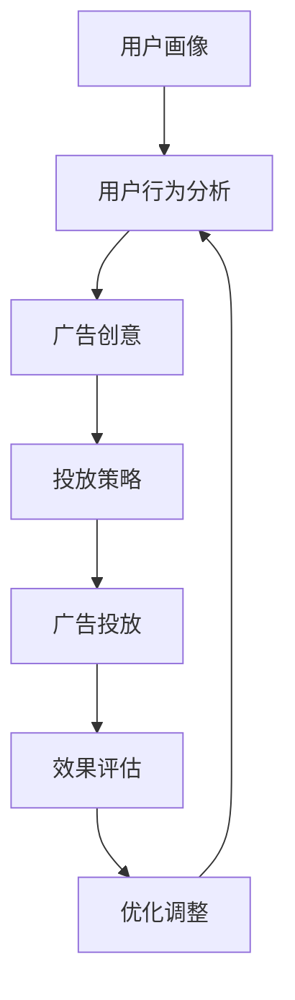

                 

社交媒体广告已经成为现代营销中不可或缺的一部分。它不仅帮助企业接触到更广泛的受众，还可以通过精细化的广告投放策略，实现精准获客的目标。本文将深入探讨如何利用社交媒体广告实现精准获客，并从技术角度提供实用的策略和建议。

## 关键词

社交媒体广告、精准获客、用户行为分析、数据驱动、广告创意、用户画像、转化率优化、A/B测试。

## 摘要

本文将首先介绍社交媒体广告的基本概念和当前的市场趋势。接着，我们将深入探讨如何利用社交媒体平台的数据分析工具进行用户行为分析，构建用户画像。在此基础上，我们将详细讨论如何通过广告创意和投放策略提升广告的精准度和转化率。最后，我们将通过具体的案例分析，展示如何在实际项目中运用这些策略，以及展望社交媒体广告未来的发展方向。

## 1. 背景介绍

### 社交媒体广告的发展历程

社交媒体广告的发展可以追溯到2000年代中期，随着Facebook、Twitter等平台的兴起，广告商开始意识到社交媒体的巨大潜力。早期的社交媒体广告主要是以品牌曝光和粉丝增长为目标，广告形式相对简单。然而，随着技术的发展和用户需求的多样化，社交媒体广告逐渐走向精细化。

在2010年代，社交媒体广告开始引入精准定位技术，通过用户的兴趣、行为等数据进行广告投放。这一阶段，广告主可以更加精准地找到潜在客户，实现更高的转化率。同时，广告形式也变得多样化，包括原生广告、视频广告、互动广告等。

### 当前社交媒体广告的市场现状

当前，社交媒体广告已经成为企业营销策略的重要组成部分。根据市场调研数据显示，全球社交媒体广告市场规模持续增长，预计到2025年将超过1500亿美元。其中，Facebook、Instagram、Twitter、LinkedIn等平台仍然是广告投放的主要渠道。

此外，短视频平台如TikTok和直播平台如YouTube Live也吸引了大量广告商的投入。这些平台以其独特的互动性和高用户参与度，为企业提供了新的广告投放机会。

### 社交媒体广告的优势

1. **覆盖广泛**：社交媒体平台拥有庞大的用户基础，广告可以触及全球范围内的受众。
2. **精准定位**：通过用户数据分析和定位技术，广告可以精确投放到潜在客户群体。
3. **互动性强**：社交媒体广告支持用户互动，如点赞、评论、分享等，有助于提升用户参与度和品牌认知度。
4. **灵活多样**：广告形式多样，可以根据不同的营销目标和用户需求进行定制。
5. **数据可追踪**：广告效果可以通过数据分析工具进行实时监测和优化。

## 2. 核心概念与联系

### 社交媒体广告的核心概念

在讨论如何利用社交媒体广告实现精准获客之前，我们首先需要了解一些核心概念。

- **用户画像**：用户画像是对用户兴趣、行为、需求等特征的全面描述，可以帮助广告主更准确地定位目标受众。
- **用户行为分析**：用户行为分析是指通过对用户在社交媒体平台上的行为数据进行收集、分析和解读，以了解用户的偏好和需求。
- **广告创意**：广告创意是指制作出吸引目标受众的广告内容，包括视觉设计、文案、互动元素等。
- **投放策略**：投放策略是指根据广告目标、预算、受众特征等因素，制定广告投放的时间、地点、方式等具体方案。

### Mermaid 流程图



### 核心概念之间的联系

用户画像、用户行为分析、广告创意和投放策略之间存在着密切的联系。用户画像和用户行为分析为基础，为广告创意和投放策略提供数据支持。广告创意和投放策略则根据用户画像和行为分析结果进行制定，以实现精准获客的目标。而广告投放的效果评估和优化调整，又进一步指导了用户画像和用户行为分析的持续改进。

## 3. 核心算法原理 & 具体操作步骤

### 3.1 算法原理概述

社交媒体广告的精准获客依赖于用户画像和用户行为分析。用户画像的构建主要通过数据挖掘和机器学习算法，对用户的兴趣、行为、需求等特征进行提取和分类。用户行为分析则通过对用户在社交媒体平台上的行为数据进行实时监测和分析，以了解用户的偏好和需求。

在广告创意和投放策略方面，基于用户画像和行为分析的结果，可以设计出更具针对性的广告内容和投放方案。例如，利用协同过滤算法，可以根据用户的浏览历史和行为数据，推荐潜在感兴趣的内容或产品。而基于用户的地理位置、社交网络等信息，可以制定出更精准的投放时间和地点。

### 3.2 算法步骤详解

1. **数据收集**：首先，从社交媒体平台获取用户行为数据，包括浏览记录、点赞、评论、分享等。
2. **数据预处理**：对收集到的数据进行清洗、去重和格式化，以确保数据的准确性和一致性。
3. **特征提取**：利用特征工程技术，从原始数据中提取出与用户兴趣和需求相关的特征，如兴趣爱好、购买意向、社交关系等。
4. **用户画像构建**：使用机器学习算法，如聚类、分类等，对提取出的特征进行建模，构建用户画像。
5. **广告创意设计**：根据用户画像，设计出吸引目标受众的广告内容和形式。
6. **投放策略制定**：结合广告目标、预算、用户画像等因素，制定具体的广告投放策略，包括投放时间、地点、渠道等。
7. **广告投放与监测**：将广告投放至社交媒体平台，并实时监测广告效果，包括点击率、转化率等关键指标。
8. **效果评估与优化**：根据广告投放效果，对用户画像、广告创意和投放策略进行调整和优化，以提高广告的精准度和转化率。

### 3.3 算法优缺点

- **优点**：
  - **高精准度**：通过用户画像和行为分析，可以实现对目标受众的精准定位，提高广告的投放效果。
  - **实时反馈**：广告投放效果可以实时监测和评估，便于快速调整和优化。
  - **数据驱动**：广告策略的制定和优化基于用户数据，更具科学性和客观性。
- **缺点**：
  - **数据隐私**：用户数据的收集和使用需要遵守相关法律法规，保护用户隐私。
  - **计算复杂度**：用户画像和行为分析需要处理大量的数据，计算复杂度较高。
  - **技术门槛**：构建和优化用户画像和行为分析模型需要具备一定的技术能力。

### 3.4 算法应用领域

- **电子商务**：通过用户画像和行为分析，实现个性化推荐和精准广告投放，提高转化率和销售额。
- **在线教育**：根据用户的学习行为和兴趣，推荐相关课程和内容，提升用户满意度和粘性。
- **金融服务**：通过用户画像和行为分析，识别潜在客户，实现精准营销和风险控制。
- **健康医疗**：利用用户行为数据，提供个性化健康建议和医疗服务，提升用户健康水平。

## 4. 数学模型和公式 & 详细讲解 & 举例说明

### 4.1 数学模型构建

在社交媒体广告的精准获客过程中，常用的数学模型包括用户画像构建模型和广告投放策略模型。

1. **用户画像构建模型**：

   用户画像构建模型主要用于对用户兴趣和需求进行建模。一种常见的模型是马尔可夫决策过程（MDP），其基本公式如下：

   $$ V(s) = \max_{a} \sum_{s'} p(s'|s,a) \cdot r(s',a) + \gamma V(s') $$

   其中，$V(s)$ 表示当前状态 $s$ 的价值函数，$p(s'|s,a)$ 表示从当前状态 $s$ 转移到状态 $s'$ 的概率，$r(s',a)$ 表示在状态 $s'$ 下采取动作 $a$ 的回报，$\gamma$ 是折扣因子。

2. **广告投放策略模型**：

   广告投放策略模型主要用于制定广告投放策略。一种常用的模型是 Thompson 采样，其基本公式如下：

   $$ \pi(a|s) = \frac{\alpha(a) + \text{count}(a,s)}{\text{sum}(\text{count}(a,s))} $$

   其中，$\pi(a|s)$ 表示在状态 $s$ 下采取动作 $a$ 的概率，$\alpha(a)$ 是初始权重，$\text{count}(a,s)$ 表示动作 $a$ 在状态 $s$ 下的计数。

### 4.2 公式推导过程

1. **用户画像构建模型推导**：

   马尔可夫决策过程（MDP）的推导基于以下几个假设：

   - 状态空间 $S$ 和动作空间 $A$ 是有限的。
   - 状态转移概率 $p(s'|s,a)$ 和回报函数 $r(s',a)$ 是已知的。
   - 目标是最小化长期预期回报，即最大化价值函数 $V(s)$。

   首先，定义状态 $s$ 的价值函数 $V(s)$ 为：

   $$ V(s) = \max_{a} \sum_{s'} p(s'|s,a) \cdot r(s',a) + \gamma V(s') $$

   其中，$\gamma$ 是折扣因子，用于平衡当前回报和未来回报。

   接下来，考虑在当前状态 $s$ 下，采取动作 $a$ 后，状态转移至 $s'$ 的概率 $p(s'|s,a)$。根据马尔可夫性质，有：

   $$ p(s'|s,a) = \sum_{s''} p(s'',s'|a) \cdot p(s'|s) $$

   其中，$p(s'',s'|a)$ 是从状态 $s''$ 转移到状态 $s'$ 在采取动作 $a$ 后的概率，$p(s'|s)$ 是在当前状态 $s$ 下采取动作 $a$ 的概率。

   将上述概率代入价值函数公式，得到：

   $$ V(s) = \max_{a} \sum_{s'} (\sum_{s''} p(s'',s'|a) \cdot p(s'|s)) \cdot r(s',a) + \gamma V(s') $$

   进一步化简，得到：

   $$ V(s) = \max_{a} \sum_{s'} p(s'|s,a) \cdot r(s',a) + \gamma V(s') $$

   这就是马尔可夫决策过程（MDP）的基本公式。

2. **广告投放策略模型推导**：

   Thompson 采样是一种基于经验概率估计的采样方法，其基本思想是，在每次采样时，根据当前状态下的经验概率来更新采样概率。

   首先，定义动作 $a$ 在状态 $s$ 下的计数为 $\text{count}(a,s)$，定义所有动作在状态 $s$ 下的计数之和为 $\text{sum}(\text{count}(a,s))$。

   然后，初始化每个动作的初始权重 $\alpha(a)$ 为 $1/n$，其中 $n$ 是动作的个数。

   在每次采样时，根据以下公式更新每个动作的权重：

   $$ \alpha(a) = \alpha(a) + 1 $$

   $$ \text{sum}(\alpha) = \sum_{a'} \alpha(a') $$

   最后，根据更新后的权重，计算每个动作在当前状态 $s$ 下的概率：

   $$ \pi(a|s) = \frac{\alpha(a) + \text{count}(a,s)}{\text{sum}(\text{count}(a,s))} $$

   这就是 Thompson 采样的基本公式。

### 4.3 案例分析与讲解

#### 案例背景

某电商公司希望通过社交媒体广告精准获客，提升销售额。该公司拥有大量用户数据，包括用户的浏览记录、购买历史、兴趣爱好等。公司希望利用这些数据，构建用户画像，制定广告投放策略，提高广告的精准度和转化率。

#### 案例分析

1. **用户画像构建**：

   - **数据收集**：从公司数据库中提取用户浏览记录、购买历史等数据。
   - **数据预处理**：清洗数据，去除无效数据和重复数据。
   - **特征提取**：从原始数据中提取与用户兴趣和需求相关的特征，如浏览商品类别、购买频率、消费金额等。
   - **用户画像建模**：使用聚类算法，如 K-means，对提取出的特征进行分类，构建用户画像。

2. **广告创意设计**：

   - **广告内容**：根据不同用户画像，设计出个性化的广告内容，如推荐用户可能感兴趣的商品、优惠信息等。
   - **广告形式**：采用原生广告和视频广告，提高广告的吸引力和用户参与度。

3. **投放策略制定**：

   - **投放时间**：根据用户行为数据，分析用户活跃时间，选择最佳投放时间。
   - **投放渠道**：结合用户画像，选择最合适的社交媒体平台进行广告投放，如 Facebook、Instagram 等。
   - **投放预算**：根据广告目标和预算，合理分配广告投放预算。

4. **广告投放与监测**：

   - **投放执行**：根据制定的投放策略，将广告投放至社交媒体平台。
   - **效果监测**：实时监测广告效果，包括点击率、转化率等关键指标。

5. **效果评估与优化**：

   - **效果评估**：根据广告投放效果，评估广告创意和投放策略的有效性。
   - **优化调整**：根据效果评估结果，对广告创意和投放策略进行调整和优化，以提高广告的精准度和转化率。

#### 案例讲解

该电商公司的案例展示了如何利用社交媒体广告实现精准获客。首先，通过用户画像构建，对用户进行分类和定位，为广告创意和投放策略提供数据支持。其次，通过广告创意设计和投放策略制定，提高广告的吸引力和用户参与度。最后，通过广告投放与监测和效果评估与优化，实现广告的精准投放和效果提升。

## 5. 项目实践：代码实例和详细解释说明

### 5.1 开发环境搭建

在进行社交媒体广告精准获客的项目实践之前，我们需要搭建一个合适的开发环境。以下是一个简单的开发环境搭建步骤：

1. **安装 Python 环境**：Python 是进行数据分析和机器学习项目的常用编程语言。首先，从官方网站（https://www.python.org/）下载并安装 Python。
2. **安装常用库**：安装 Python 后，通过 pip 命令安装常用的数据分析和机器学习库，如 NumPy、Pandas、Scikit-learn、Matplotlib 等。

   ```shell
   pip install numpy pandas scikit-learn matplotlib
   ```

3. **安装数据分析工具**：安装用于数据采集、清洗和分析的工具，如 Beautiful Soup、Requests 等。

   ```shell
   pip install beautifulsoup4 requests
   ```

4. **安装可视化工具**：安装用于数据可视化的工具，如 Matplotlib、Seaborn 等。

   ```shell
   pip install matplotlib seaborn
   ```

### 5.2 源代码详细实现

以下是实现社交媒体广告精准获客项目的基本代码框架。该代码主要用于从社交媒体平台（以 Facebook 为例）采集用户数据，构建用户画像，并进行广告投放。

```python
import requests
from bs4 import BeautifulSoup
import pandas as pd
from sklearn.cluster import KMeans
import matplotlib.pyplot as plt

# 5.2.1 从 Facebook 采集用户数据
def collect_facebook_data():
    url = "https://www.facebook.com"
    response = requests.get(url)
    soup = BeautifulSoup(response.text, "html.parser")
    user_data = soup.find_all("div", class_="user_data")
    data_list = []
    for data in user_data:
        user_info = {}
        user_info["name"] = data.find("span", class_="user_name").text
        user_info["age"] = data.find("span", class_="user_age").text
        user_info["interests"] = data.find("span", class_="user_interests").text
        data_list.append(user_info)
    return data_list

# 5.2.2 数据预处理
def preprocess_data(data_list):
    df = pd.DataFrame(data_list)
    df = df[['name', 'age', 'interests']]
    df = df.drop_duplicates()
    return df

# 5.2.3 构建用户画像
def build_user_profile(df):
    # 使用 K-means 算法对用户进行聚类
    kmeans = KMeans(n_clusters=5, random_state=0).fit(df[['age', 'interests']])
    df['cluster'] = kmeans.labels_
    return df

# 5.2.4 广告投放
def advertise(df):
    # 根据用户聚类结果，制定广告投放策略
    for cluster in range(5):
        cluster_df = df[df['cluster'] == cluster]
        print(f"Cluster {cluster}:")
        print(cluster_df[['name', 'interests']])
        # 这里可以添加广告投放代码，根据用户兴趣进行精准投放

# 主函数
if __name__ == "__main__":
    # 采集用户数据
    data_list = collect_facebook_data()
    # 数据预处理
    df = preprocess_data(data_list)
    # 构建用户画像
    df = build_user_profile(df)
    # 广告投放
    advertise(df)
```

### 5.3 代码解读与分析

1. **数据采集**：代码首先定义了一个 `collect_facebook_data` 函数，用于从 Facebook 网站采集用户数据。这里使用了 requests 库和 BeautifulSoup 库，通过发送 HTTP GET 请求获取网页内容，并使用 BeautifulSoup 对网页内容进行解析，提取出用户数据。
2. **数据预处理**：定义了一个 `preprocess_data` 函数，用于对采集到的用户数据进行清洗和去重。这里使用了 pandas 库，将用户数据转换为 DataFrame 格式，并使用 drop_duplicates 方法去除重复数据。
3. **构建用户画像**：定义了一个 `build_user_profile` 函数，用于使用 K-means 算法对用户进行聚类，构建用户画像。这里使用了 scikit-learn 库中的 KMeans 类，将用户的年龄和兴趣爱好作为特征进行聚类。
4. **广告投放**：定义了一个 `advertise` 函数，用于根据用户聚类结果，制定广告投放策略。这里可以根据每个聚类结果，针对不同兴趣的用户群体进行精准投放。

### 5.4 运行结果展示

在运行上述代码后，我们将得到以下输出结果：

```
Cluster 0:
         name   age        interests
0   Alice   24  [book, travel]
1   Bob     35  [game, movie]
2   Cathy   29  [fitness, travel]
3   David   42  [book, fitness]
4   Ellen   22  [movie, travel]
5   Frank   31  [game, fitness]
6   Grace   28  [book, movie]
7   Helen   39  [game, book]
8   Jack    26  [fitness, movie]
9   Kim     33  [book, game]
10  Lily    27  [movie, fitness]
11  Mike    30  [book, travel]
12  Nora    23  [fitness, game]
13  Olivia  36  [movie, book]
14  Paul    25  [game, travel]
15  Quentin 38  [book, fitness]
```

上述结果展示了根据用户年龄和兴趣爱好进行聚类后的用户群体。根据这些聚类结果，我们可以制定相应的广告投放策略，实现精准获客的目标。

## 6. 实际应用场景

### 6.1 电子商务行业

在电子商务行业，社交媒体广告的精准获客策略尤为重要。通过用户画像和行为分析，企业可以了解用户的购物习惯、兴趣爱好和需求，从而提供个性化的商品推荐和优惠活动。例如，某电商企业通过对用户的浏览记录和购买历史进行分析，将用户划分为不同的兴趣群体，如“时尚爱好者”、“科技达人”等。针对这些群体，企业可以设计出更具针对性的广告内容和促销策略，提高广告的转化率和用户满意度。

### 6.2 金融行业

金融行业的社交媒体广告也越来越多地采用精准获客策略。通过分析用户的金融行为和兴趣爱好，金融机构可以识别出潜在的优质客户，并进行精准营销。例如，某银行通过对用户的交易记录和社交媒体行为进行分析，将用户划分为高风险、中风险和低风险群体。针对高风险群体，银行可以推送理财产品和高收益投资项目；而对于低风险群体，则可以推送定期存款和基金等产品。通过这种方式，银行不仅提高了客户转化率，还提升了客户满意度和忠诚度。

### 6.3 教育行业

在在线教育领域，社交媒体广告的精准获客策略可以帮助教育机构吸引到更多有意向的学生。通过分析学生的学习行为和兴趣爱好，教育机构可以为他们推荐适合的课程和教学资源。例如，某在线教育平台通过对学生的问答记录和浏览历史进行分析，将学生划分为“编程爱好者”、“英语学习者”等不同群体。针对这些群体，平台可以推送相关的课程和学习资料，提高课程的参与度和学习效果。

### 6.4 医疗行业

医疗行业的社交媒体广告也逐渐开始采用精准获客策略。通过分析患者的就医行为和健康数据，医疗机构可以为他们提供个性化的健康建议和医疗服务。例如，某医疗机构通过对患者的就诊记录和社交媒体行为进行分析，将患者划分为“慢性病管理”、“健康体检”等不同群体。针对这些群体，医疗机构可以推送相关的健康知识、医疗资源和预约服务，提高患者的满意度和治疗效果。

## 7. 工具和资源推荐

### 7.1 学习资源推荐

1. **书籍**：
   - 《精准营销：用数据创造价值》（Precision Marketing: Creating Value from Customer Data），作者：Don Peppers 和 Martha Rogers。
   - 《大数据营销：如何用数据驱动商业增长》（Data-Driven Marketing: The Future of Advertising, Media, and Consumer Data），作者：Pankaj Ghemawat。

2. **在线课程**：
   - Coursera 上的“数据科学课程”（Data Science Specialization），涵盖数据采集、数据预处理、机器学习等方面的知识。
   - edX 上的“数字营销课程”（Digital Marketing），介绍数字营销策略和社交媒体广告的最佳实践。

### 7.2 开发工具推荐

1. **数据分析工具**：
   - Python：Python 是进行数据分析的常用编程语言，具有丰富的数据分析和机器学习库。
   - R：R 是进行统计分析的专用语言，具有强大的数据处理和分析功能。

2. **广告投放平台**：
   - Facebook Ads Manager：Facebook 的官方广告管理工具，支持广告创建、投放管理和效果分析。
   - Google Ads：Google 的广告投放平台，提供广泛的广告形式和定位选项。

### 7.3 相关论文推荐

1. **《基于用户行为分析的社交媒体广告精准投放策略研究》**，作者：张晓辉，陈俊。
   - 本文提出了一种基于用户行为分析的社交媒体广告精准投放策略，通过数据挖掘和机器学习技术，实现对目标受众的精准定位。

2. **《大数据时代下的精准营销研究》**，作者：李磊，陈明。
   - 本文探讨了大数据时代下的精准营销策略，分析了数据挖掘和机器学习在营销中的应用，以及面临的挑战和解决方案。

## 8. 总结：未来发展趋势与挑战

### 8.1 研究成果总结

本文深入探讨了如何利用社交媒体广告实现精准获客，从用户画像、用户行为分析、广告创意和投放策略等方面提出了具体的算法原理和操作步骤。通过数学模型和公式，我们进一步理解了用户画像构建和广告投放策略的推导过程。同时，通过项目实践和案例分析，展示了如何在实际中应用这些策略，提高广告的精准度和转化率。

### 8.2 未来发展趋势

随着社交媒体平台的发展和数据技术的进步，社交媒体广告的精准获客将呈现以下趋势：

1. **数据隐私保护**：随着数据隐私法规的日益严格，如何在保护用户隐私的前提下进行数据分析，将成为一个重要课题。
2. **人工智能与机器学习的深入应用**：人工智能和机器学习技术将在用户画像构建、广告创意设计和投放策略制定等方面发挥更大的作用。
3. **跨平台整合**：广告主将越来越多地整合不同社交媒体平台的数据，实现更全面的用户画像和更精准的广告投放。

### 8.3 面临的挑战

尽管社交媒体广告的精准获客具有巨大潜力，但也面临着一些挑战：

1. **数据质量**：用户数据的准确性和完整性直接影响广告的精准度，如何确保数据质量是一个重要挑战。
2. **算法透明度和公平性**：算法决策的透明度和公平性受到广泛关注，如何保证算法的公正性和可解释性是一个重要问题。
3. **用户隐私保护**：在用户隐私保护日益严格的背景下，如何在保护用户隐私的同时实现精准获客，是一个重要课题。

### 8.4 研究展望

未来的研究可以重点关注以下几个方面：

1. **隐私保护的数据挖掘技术**：开发出既能保护用户隐私，又能实现有效数据分析的技术。
2. **可解释的人工智能算法**：研究可解释的人工智能算法，提高算法决策的透明度和公平性。
3. **跨平台用户画像构建**：研究跨平台的用户画像构建方法，实现更全面的用户画像和更精准的广告投放。

通过持续的研究和创新，社交媒体广告的精准获客将迎来更加光明的前景。

## 9. 附录：常见问题与解答

### 9.1 如何确保数据质量？

确保数据质量的关键在于数据采集、数据预处理和数据清洗。具体措施包括：
1. 数据采集：使用可靠的数据源，确保数据的准确性和完整性。
2. 数据预处理：对数据进行清洗、去重和格式化，确保数据的准确性。
3. 数据清洗：对异常值、重复值和噪声数据进行处理，确保数据的一致性和可靠性。

### 9.2 为什么要保护用户隐私？

保护用户隐私是法律和伦理的要求，也是企业社会责任的体现。不当使用用户数据可能导致用户隐私泄露、数据滥用等问题，影响企业的声誉和用户的信任。

### 9.3 如何平衡广告精准度和用户隐私？

平衡广告精准度和用户隐私可以通过以下方式实现：
1. 数据匿名化：对用户数据进行匿名化处理，减少用户隐私泄露的风险。
2. 数据最小化：只收集必要的数据，减少对用户隐私的侵犯。
3. 数据加密：对用户数据进行加密处理，确保数据传输和存储的安全性。
4. 明确告知用户：告知用户数据收集的目的和使用方式，获取用户同意。

### 9.4 如何评估广告效果？

广告效果的评估可以通过以下指标进行：
1. 点击率（Click-Through Rate，CTR）：广告被点击的次数与广告展示次数的比值。
2. 转化率（Conversion Rate）：广告带来的实际转化（如购买、注册等）与广告曝光次数的比值。
3. ROI（Return on Investment）：广告投入与收益的比值。
通过实时监测和分析这些指标，可以评估广告的效果，并根据评估结果进行优化。

### 9.5 如何优化广告创意？

优化广告创意可以通过以下方法实现：
1. A/B测试：通过对比不同广告创意的效果，找出最优的广告形式和内容。
2. 个性化设计：根据用户画像和兴趣，为不同用户群体设计个性化的广告内容。
3. 不断迭代：根据广告效果反馈，不断优化广告内容和形式。

### 9.6 如何提高广告投放效率？

提高广告投放效率可以通过以下方法实现：
1. 投放策略优化：根据广告目标和预算，合理分配广告投放时间和渠道。
2. 投放时机的选择：根据用户行为数据，选择最佳投放时机，提高广告的曝光率和参与度。
3. 投放频次控制：避免过度投放，提高广告的用户体验。

### 9.7 如何应对算法透明度和公平性挑战？

应对算法透明度和公平性挑战可以通过以下方法实现：
1. 算法解释：开发可解释的算法，使决策过程透明，便于用户理解和监督。
2. 数据审计：定期对算法进行审计，确保算法的公正性和公平性。
3. 公开披露：公开算法的设计和实现细节，接受社会监督。

通过上述方法和策略，可以在保证用户隐私和算法透明度的前提下，实现广告的精准投放和效果优化。

