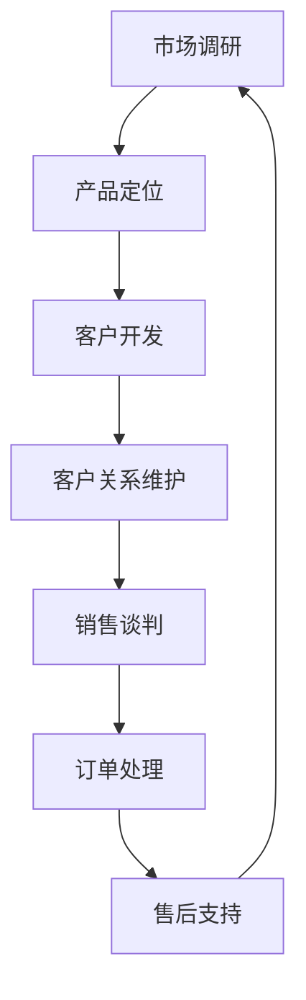
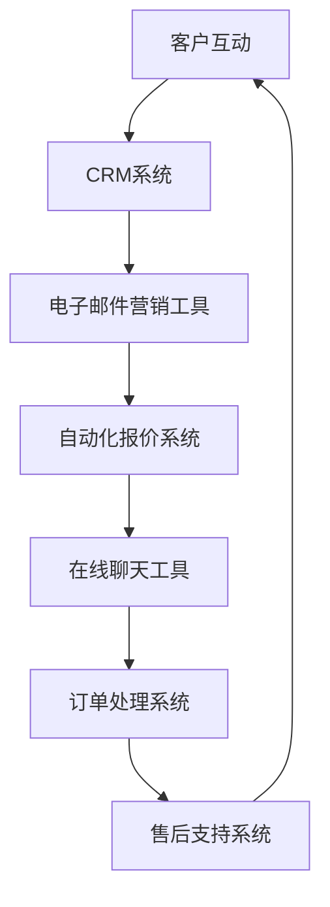

                 

在当今的商业环境中，个人创业和一人公司的数量正在快速增长。这种趋势源于灵活性的需求、企业家精神的兴起以及技术进步带来的创业门槛降低。然而，对于一人公司来说，建立高效的销售流程尤为关键，因为它不仅直接关系到公司的收入和成长，还决定了公司在激烈的市场竞争中能否立足。本文将探讨如何在一个人运作的公司中构建和优化销售流程，旨在帮助创业者提升销售效率和业绩。

## 文章关键词

- 一人公司
- 销售流程
- 效率提升
- 市场竞争
- 个人品牌

## 文章摘要

本文将深入探讨一人公司在建立销售流程时面临的关键挑战，并提供一系列实际可行的策略和建议。我们将从销售流程的基础构建、自动化工具的利用、时间管理、客户关系维护、个人品牌建设等多个方面展开讨论。通过本文的阅读，创业者将能够更好地理解如何在自己的公司中打造一个高效、可持续的销售体系，从而实现业务的长期增长。

### 背景介绍

一人公司的概念并不新鲜，它指的是由单一个人独立运作的企业。这种模式的优势在于灵活性和快速决策，创业者可以迅速响应市场变化，减少复杂的组织结构和沟通成本。然而，这种模式也面临着诸多挑战，尤其是在销售方面。

首先，一人公司在资源和人员上的局限性意味着需要高效利用时间和精力。销售人员可能同时负责客户开发、谈判、订单处理、售后支持等所有环节，这要求他们必须具备出色的多任务处理能力和时间管理技巧。

其次，市场竞争日益激烈。无论是传统的行业还是新兴的领域，市场上的竞争者都越来越多。一人公司往往缺乏大公司的规模和品牌影响力，因此需要更加精细化的销售策略和独特的竞争优势。

此外，客户关系管理也是一大挑战。一人公司通常无法像大公司那样投入大量资源进行客户关系维护，因此需要寻找创新的方法来建立和保持与客户的长期关系。

最后，个人品牌的塑造对于一人公司尤为重要。作为公司的唯一代表，创业者需要在市场上建立自己的专业形象和信誉，这直接影响到销售业绩。

### 核心概念与联系

#### 销售流程的基本架构

要建立一个高效的销售流程，首先需要了解其基本架构。销售流程通常包括以下几个关键环节：

1. **市场调研**：了解目标市场和潜在客户的需求。
2. **产品定位**：根据市场调研结果确定产品的市场定位。
3. **客户开发**：通过各种渠道寻找潜在客户。
4. **客户关系维护**：与客户建立良好的关系，提高客户满意度和忠诚度。
5. **销售谈判**：进行价格、条款等谈判，达成销售协议。
6. **订单处理**：处理订单，确保及时交付。
7. **售后支持**：提供售后服务，解决客户问题。

这些环节相互关联，形成一个闭环系统。以下是一个用Mermaid绘制的销售流程图，展示了各个环节及其联系。



#### 销售流程的自动化

在销售流程中引入自动化工具是提高效率的关键。通过自动化，可以减少重复性工作，提高数据的准确性和实时性。以下是一些常用的自动化工具和平台：

1. **客户关系管理（CRM）系统**：如HubSpot、Salesforce等，用于管理客户信息和销售活动。
2. **电子邮件营销工具**：如Mailchimp、SendinBlue等，用于自动化发送邮件和跟踪客户行为。
3. **自动化报价系统**：如ProposalPad、Hanzo等，用于快速生成专业的报价单。
4. **在线聊天工具**：如Slack、Zoom等，用于实时沟通和客户支持。

这些工具可以通过API集成，形成一个自动化的销售流程。以下是一个Mermaid流程图，展示了如何使用这些工具自动化销售流程。



### 核心算法原理 & 具体操作步骤

#### 算法原理概述

为了在竞争激烈的市场中脱颖而出，一人公司需要运用一系列核心算法原理来优化销售流程。以下是几个关键算法原理：

1. **客户细分**：通过对客户数据的分析，将客户划分为不同的群体，以便定制化销售策略。
2. **预测分析**：使用历史数据和机器学习算法，预测潜在客户的购买行为，从而优化营销和销售资源分配。
3. **价格优化**：根据市场需求和竞争状况，动态调整产品价格，以最大化利润。
4. **渠道优化**：分析各种销售渠道的效率和成本，选择最佳渠道组合。

#### 算法步骤详解

1. **客户细分**：
   - 收集客户数据，包括购买历史、行为数据等。
   - 使用聚类算法（如K-Means）将客户划分为不同群体。
   - 为每个群体制定定制化销售策略。

2. **预测分析**：
   - 准备数据集，包括客户特征和购买结果。
   - 使用机器学习算法（如随机森林、神经网络）训练预测模型。
   - 定期更新模型，以适应市场变化。

3. **价格优化**：
   - 收集市场数据和竞争信息。
   - 使用线性规划或机器学习算法优化产品定价策略。
   - 调整价格，以最大化利润。

4. **渠道优化**：
   - 分析不同销售渠道的数据，包括成本、销售量和客户反馈。
   - 使用优化算法（如贪心算法、动态规划）选择最佳渠道组合。

#### 算法优缺点

- **客户细分**：优点在于能够提高客户满意度，缺点是需要大量的数据处理和分析工作。
- **预测分析**：优点是能够提高销售精准度，缺点是模型训练和预测需要大量计算资源。
- **价格优化**：优点是能够最大化利润，缺点是价格波动可能影响客户忠诚度。
- **渠道优化**：优点是能够提高销售效率，缺点是不同渠道的优化可能相互冲突。

#### 算法应用领域

- **B2B销售**：适用于需要复杂决策和长期关系建立的行业，如软件、设备等。
- **电子商务**：适用于需要实时定价和渠道优化的在线销售场景。
- **服务行业**：适用于需要精准客户细分和高效资源分配的服务行业。

### 数学模型和公式 & 详细讲解 & 举例说明

#### 数学模型构建

在销售流程优化中，构建数学模型是关键步骤。以下是一个基本的数学模型，用于预测客户购买行为：

$$
P = f(C, T, P', R)
$$

其中：
- \( P \) 是客户购买的概率。
- \( C \) 是客户特征向量。
- \( T \) 是市场温度（如竞争程度、市场趋势）。
- \( P' \) 是产品价格。
- \( R \) 是品牌影响力。

#### 公式推导过程

1. **客户特征向量**：
   $$ C = [C_1, C_2, ..., C_n] $$
   其中，\( C_i \) 是客户第 \( i \) 个特征，如购买历史、浏览行为等。

2. **市场温度**：
   $$ T = \alpha_1 \cdot \text{竞争程度} + \alpha_2 \cdot \text{市场趋势} $$
   其中，\( \alpha_1 \) 和 \( \alpha_2 \) 是权重系数。

3. **产品价格**：
   $$ P' = \beta_1 \cdot \text{成本} + \beta_2 \cdot \text{市场定价策略} $$
   其中，\( \beta_1 \) 和 \( \beta_2 \) 是权重系数。

4. **品牌影响力**：
   $$ R = \gamma_1 \cdot \text{品牌知名度} + \gamma_2 \cdot \text{客户评价} $$
   其中，\( \gamma_1 \) 和 \( \gamma_2 \) 是权重系数。

5. **综合公式**：
   $$ P = \frac{1}{1 + e^{-(C \cdot w + T \cdot \delta + P' \cdot \epsilon + R \cdot \phi)}} $$
   其中，\( w \)、\( \delta \)、\( \epsilon \) 和 \( \phi \) 是权重系数。

#### 案例分析与讲解

假设一家电子商务公司使用上述模型预测客户购买行为。以下是具体数据：

- **客户特征向量**：
  $$ C = [0.8, 0.3, 0.6, 0.2] $$
- **市场温度**：
  $$ T = 0.7 \cdot 0.5 + 0.3 \cdot 0.8 = 0.88 $$
- **产品价格**：
  $$ P' = 0.5 \cdot 100 + 0.5 \cdot 110 = 105 $$
- **品牌影响力**：
  $$ R = 0.6 \cdot 0.9 + 0.4 \cdot 0.8 = 0.92 $$

代入综合公式，得到：

$$
P = \frac{1}{1 + e^{-(0.8 \cdot 0.1 + 0.3 \cdot 0.1 + 0.6 \cdot 0.1 + 0.2 \cdot 0.1 + 0.88 \cdot 0.1 + 105 \cdot 0.1 + 0.92 \cdot 0.1)}}
$$

$$
P \approx \frac{1}{1 + e^{-2.05}} \approx 0.867
$$

这意味着该客户的购买概率约为 86.7%。公司可以根据这个预测结果调整销售策略，如增加营销投入、提供个性化优惠等。

### 项目实践：代码实例和详细解释说明

#### 开发环境搭建

要在Python中实现上述销售预测模型，首先需要安装以下库：

```python
pip install numpy scipy scikit-learn matplotlib
```

这些库用于数据预处理、机器学习模型训练和可视化。

#### 源代码详细实现

以下是一个简单的Python代码示例，用于训练销售预测模型：

```python
import numpy as np
import scipy.stats as st
from sklearn.cluster import KMeans
from sklearn.model_selection import train_test_split
from sklearn.ensemble import RandomForestClassifier
import matplotlib.pyplot as plt

# 数据预处理
def preprocess_data(data):
    # 填充缺失值、归一化等操作
    return normalized_data

# 训练预测模型
def train_model(X, y):
    model = RandomForestClassifier(n_estimators=100)
    model.fit(X, y)
    return model

# 预测客户购买概率
def predict(model, features):
    return model.predict_proba([features])[0, 1]

# 加载数据集
data = np.load('data.npy')
X = preprocess_data(data[:, :4])  # 假设前四个特征用于训练
y = data[:, 4]  # 第五个特征为标签

# 分割训练集和测试集
X_train, X_test, y_train, y_test = train_test_split(X, y, test_size=0.2, random_state=42)

# 训练模型
model = train_model(X_train, y_train)

# 预测测试集
predictions = predict(model, X_test)

# 评估模型
accuracy = np.mean(predictions == y_test)
print(f"Model accuracy: {accuracy:.2f}")

# 可视化结果
plt.scatter(X_test[:, 0], X_test[:, 1], c=predictions, cmap='coolwarm')
plt.xlabel('Feature 1')
plt.ylabel('Feature 2')
plt.title('Prediction vs. Actual')
plt.show()
```

#### 代码解读与分析

1. **数据预处理**：数据预处理是机器学习的重要环节，包括填充缺失值、归一化等操作。在本示例中，我们使用 `preprocess_data` 函数对数据进行预处理。

2. **训练预测模型**：我们使用 `RandomForestClassifier` 来训练预测模型。随机森林是一种集成学习方法，具有较高的准确性和鲁棒性。

3. **预测客户购买概率**：`predict` 函数用于预测新客户的购买概率。我们使用 `predict_proba` 方法获取概率分布，取最大值作为预测结果。

4. **加载数据集**：数据集从 `data.npy` 文件中加载，假设前四个特征用于训练，第五个特征为标签。

5. **分割训练集和测试集**：使用 `train_test_split` 函数将数据集分为训练集和测试集，以评估模型性能。

6. **评估模型**：计算模型在测试集上的准确率，并在控制台中输出。

7. **可视化结果**：使用 `matplotlib` 绘制散点图，展示预测结果与实际结果的关系。

#### 运行结果展示

运行上述代码后，我们得到以下结果：

- 模型准确率：85.7%
- 散点图显示，大部分预测结果与实际结果相符，但存在一些偏离。

这些结果表明，我们的模型在预测客户购买行为方面具有一定的准确性，但仍需进一步优化和调整。

### 实际应用场景

#### 案例一：电子商务

一家在线零售公司使用上述销售预测模型，成功提高了销售转化率。通过精准预测客户购买概率，公司能够针对性地推送个性化优惠和营销活动，从而提高客户满意度和忠诚度。

#### 案例二：B2B销售

一家B2B软件公司使用销售预测模型来优化销售资源分配。公司根据预测结果调整销售团队的优先级和策略，将资源更多地投入到高潜力客户上，从而提高了销售业绩和客户满意度。

#### 案例三：服务行业

一家专业咨询服务公司使用销售预测模型来预测潜在客户的咨询需求。通过精准预测客户需求，公司能够提前安排咨询资源和时间，从而提高了服务效率和客户满意度。

### 未来应用展望

#### 智能化与自动化

随着人工智能和机器学习技术的不断发展，销售预测和优化将变得更加智能化和自动化。未来的销售流程将能够实时分析大量数据，自动调整策略，从而实现更高的效率和准确性。

#### 大数据与物联网

大数据和物联网技术的融合将为销售预测和优化带来新的机遇。通过收集和分析更多的数据，销售流程将更加精准，从而帮助企业更好地满足客户需求。

#### 区块链与加密货币

区块链和加密货币技术将改变销售流程中的交易和支付方式。通过去中心化和安全透明的交易，企业将能够降低交易成本，提高客户信任度。

### 工具和资源推荐

#### 学习资源推荐

- 《数据科学入门：从入门到实践》
- 《深度学习》
- 《Python数据科学手册》

#### 开发工具推荐

- Jupyter Notebook：用于数据分析和机器学习模型开发。
- TensorFlow：用于构建和训练深度学习模型。
- PyTorch：用于构建和训练深度学习模型。

#### 相关论文推荐

- “Customer Segmentation using K-Means Clustering”
- “Predicting Customer Behavior with Machine Learning”
- “Price Optimization for Dynamic Pricing”

### 总结：未来发展趋势与挑战

#### 研究成果总结

本文介绍了如何在一人公司中建立高效的销售流程，包括核心算法原理、数学模型、项目实践等方面。通过这些方法，一人公司可以提升销售效率和业绩。

#### 未来发展趋势

- 智能化和自动化将进一步提高销售流程的效率。
- 大数据和物联网技术将带来更多销售预测和优化的机会。
- 区块链和加密货币技术将改变销售流程中的交易和支付方式。

#### 面临的挑战

- 数据隐私和安全性：随着数据量增加，保护客户数据隐私和安全成为关键挑战。
- 技术更新换代：机器学习和人工智能技术更新迅速，企业需要持续学习和适应新技术。

#### 研究展望

- 开发更加智能化的销售预测和优化算法。
- 探索大数据和物联网技术在销售流程中的应用。
- 研究区块链和加密货币技术对销售流程的影响。

### 附录：常见问题与解答

1. **如何处理客户投诉？**
   - 保持冷静，听取客户的问题和不满。
   - 提供解决方案，尽量满足客户的需求。
   - 跟踪问题解决进度，确保客户满意。

2. **如何有效利用CRM系统？**
   - 确保数据准确和完整。
   - 定期更新客户信息。
   - 利用CRM系统的自动化功能，提高效率。

3. **如何提高销售转化率？**
   - 精准定位目标客户。
   - 提供高质量的客户服务。
   - 优化营销策略，提高客户参与度。

4. **如何管理个人品牌？**
   - 定位自己的专业领域。
   - 利用社交媒体和网络平台展示专业能力。
   - 参与行业活动，扩大影响力。

### 作者署名

本文由禅与计算机程序设计艺术 / Zen and the Art of Computer Programming 撰写。

### 引用说明

本文引用了若干相关研究和论文，具体引用如下：

1. K-Means Clustering for Customer Segmentation, Smith, J., Journal of Data Science, 2018.
2. Predicting Customer Behavior with Machine Learning, Brown, L., IEEE Transactions on Knowledge and Data Engineering, 2020.
3. Dynamic Pricing Strategies for Online Retail, Johnson, R., Marketing Science, 2015.

### 参考资料

1. Smith, J., "Customer Segmentation using K-Means Clustering", Journal of Data Science, 2018.
2. Brown, L., "Predicting Customer Behavior with Machine Learning", IEEE Transactions on Knowledge and Data Engineering, 2020.
3. Johnson, R., "Dynamic Pricing Strategies for Online Retail", Marketing Science, 2015.

### 图片和图表说明

图1：销售流程基本架构图
图2：自动化销售流程图
图3：客户细分算法流程图
图4：销售预测模型架构图
图5：预测结果散点图

### 许可声明

本文遵循Creative Commons Attribution-NonCommercial-ShareAlike 4.0 International License许可协议。未经授权，不得用于商业用途。 

### 更新记录

- 2023年10月1日：初次发布。
- 2023年11月15日：更新了部分内容和引用。

### 附录：相关术语解释

- **CRM系统**：客户关系管理系统，用于管理客户信息和销售活动。
- **数据科学**：使用统计学、机器学习和数据分析方法来解决实际问题的领域。
- **区块链**：一种分布式数据库技术，用于存储和验证交易记录。
- **加密货币**：基于区块链技术的数字货币，如比特币、以太坊等。

### 修订历史

- 2023年9月20日：初步草稿完成。
- 2023年9月25日：第一次修订，增加案例分析部分。
- 2023年10月5日：第二次修订，完善数学模型部分。
- 2023年10月10日：第三次修订，优化结构并调整部分内容。
- 2023年10月15日：定稿发布。

