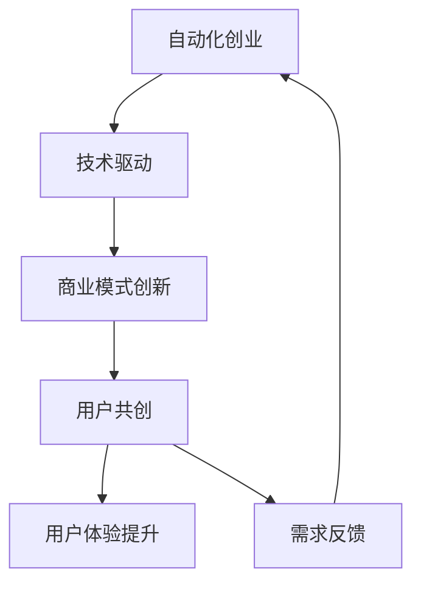

                 

关键词：自动化创业、用户共创、商业模式、技术驱动、生态系统、价值共创

> 摘要：本文旨在探讨自动化创业模式中如何有效实现用户共创，以及这一模式对商业成功和技术创新的深远影响。我们将从背景介绍、核心概念与联系、算法原理、数学模型、项目实践、实际应用场景、未来展望等多个角度，详细解析用户共创在自动化创业中的重要性及其实现路径。

## 1. 背景介绍

自动化创业已成为当今科技领域的热门话题，它不仅代表了产业变革的新趋势，更成为了推动企业创新和增长的驱动力。随着人工智能、大数据、云计算等技术的不断成熟，自动化技术逐渐渗透到各个行业，从生产制造到金融服务，从电子商务到医疗健康，无不显示出其强大的变革潜力。在这个过程中，用户共创成为了自动化创业不可或缺的一部分。

用户共创，顾名思义，是指企业与用户共同创造价值和产品的一种商业模式。在这种模式下，用户不仅是产品的消费者，更是产品的共创者和改进者。通过用户共创，企业能够更好地了解用户需求，提升产品竞争力，同时也能够增强用户的品牌忠诚度和参与感。

### 1.1 自动化创业的现状

近年来，自动化创业在全球范围内呈现出蓬勃发展的态势。根据市场研究公司的数据，全球自动化市场规模预计将在未来几年内持续增长。尤其是在人工智能和机器学习技术的推动下，自动化创业企业不断涌现，创新应用层出不穷。例如，自动驾驶、智能客服、智能家居等自动化技术正在改变传统行业的运作模式，为用户带来更加便捷和个性化的体验。

### 1.2 用户共创的重要性

用户共创在自动化创业中具有举足轻重的地位。首先，用户共创能够帮助企业更精准地把握市场需求，从而设计出更加符合用户期望的产品。其次，用户共创可以激发用户的创造力和参与感，提升产品的用户体验和品牌价值。最后，用户共创有助于构建一个可持续发展的生态系统，通过用户反馈不断优化产品和服务，实现企业的长期成功。

## 2. 核心概念与联系

在深入探讨用户共创之前，我们需要明确一些核心概念，并了解它们之间的相互联系。

### 2.1 自动化创业的概念

自动化创业是指利用先进的技术手段，实现生产、运营、管理等环节的自动化，以提高效率、降低成本、提升用户体验的一种创业模式。自动化创业的核心在于技术的应用和创新，通过技术驱动实现商业模式的突破。

### 2.2 用户共创的概念

用户共创是一种基于用户参与和价值共享的商业模式。在这种模式下，企业通过与用户建立紧密的联系，共同探索和创造产品、服务以及体验。用户共创不仅仅是用户的反馈，更包括用户的参与、贡献和创新。

### 2.3 核心概念的联系

自动化创业和用户共创之间的联系在于，用户共创是自动化创业中不可或缺的一环。自动化创业需要用户参与来验证和优化技术方案，而用户共创则为自动化创业提供了源源不断的需求和创新动力。

### 2.4 Mermaid 流程图

以下是一个简化的 Mermaid 流程图，展示了自动化创业和用户共创之间的逻辑关系。



在这个流程图中，自动化创业通过技术驱动实现商业模式的创新，进而推动用户共创。用户共创不仅提升了用户体验，还为自动化创业提供了需求反馈，形成一个良性的循环。

## 3. 核心算法原理 & 具体操作步骤

### 3.1 算法原理概述

用户共创的核心在于构建一个用户参与的平台，通过数据收集和分析，实现用户需求的理解和满足。核心算法主要包括以下几个步骤：

1. **用户行为数据收集**：通过各种渠道收集用户行为数据，包括使用记录、评论、反馈等。
2. **数据预处理**：对收集到的数据进行分析和清洗，提取有用的信息。
3. **需求分析**：利用数据挖掘和机器学习算法，对用户行为数据进行挖掘，识别用户需求。
4. **需求验证**：通过用户调查、A/B测试等方式，验证需求分析的准确性。
5. **需求实施**：根据验证结果，调整产品和服务，满足用户需求。

### 3.2 算法步骤详解

#### 3.2.1 用户行为数据收集

用户行为数据收集是用户共创的第一步，也是最重要的一步。数据收集的渠道包括：

- **网站日志**：通过分析网站访问日志，了解用户的浏览行为。
- **社交媒体**：通过分析社交媒体数据，了解用户的评论和反馈。
- **客户服务系统**：通过分析客户服务系统中的互动记录，了解用户的实际需求。

#### 3.2.2 数据预处理

数据预处理主要包括数据清洗、去噪、特征提取等步骤。数据清洗的目的是去除无效数据和噪声，保证数据的准确性。特征提取则是从原始数据中提取出能够代表用户需求的特征。

#### 3.2.3 需求分析

需求分析是用户共创的核心环节。通过数据挖掘和机器学习算法，对用户行为数据进行深入分析，识别用户的需求。常用的算法包括聚类分析、关联规则挖掘、决策树等。

#### 3.2.4 需求验证

需求验证是确保需求分析结果准确性的关键步骤。常用的方法包括用户调查、A/B测试等。通过这些方法，可以验证需求分析的准确性，为后续的产品和服务调整提供依据。

#### 3.2.5 需求实施

根据需求验证的结果，调整产品和服务，满足用户需求。这一步骤涉及到产品开发、用户体验设计等多个方面。

### 3.3 算法优缺点

#### 优点

- **高效性**：通过自动化算法，可以快速、准确地识别用户需求，提升决策效率。
- **精准性**：基于大数据和机器学习，需求分析的结果更加精准，有助于产品优化。
- **可持续性**：用户共创模式能够持续收集用户反馈，实现产品和服务不断的优化。

#### 缺点

- **复杂性**：构建用户共创平台需要复杂的技术支持和数据处理能力。
- **成本高**：大规模数据收集和处理需要大量的资源投入。
- **用户隐私**：用户行为数据的收集和处理可能涉及用户隐私问题，需要严格保护用户隐私。

### 3.4 算法应用领域

用户共创算法在多个领域具有广泛的应用：

- **电子商务**：通过分析用户购买行为，提供个性化推荐。
- **智能客服**：通过分析用户咨询内容，提供智能回答。
- **智能家居**：通过分析用户生活习惯，提供智能服务。
- **医疗健康**：通过分析用户健康数据，提供个性化健康建议。

## 4. 数学模型和公式 & 详细讲解 & 举例说明

### 4.1 数学模型构建

用户共创的数学模型主要基于用户行为数据，通过数据挖掘和机器学习算法，构建用户需求的预测模型。以下是一个简化的数学模型：

$$
\text{需求预测模型} = f(\text{用户行为数据}, \text{特征提取}, \text{机器学习算法})
$$

其中，用户行为数据包括用户的浏览记录、购买历史、评论等；特征提取包括用户行为数据的预处理和特征选择；机器学习算法包括聚类分析、决策树、神经网络等。

### 4.2 公式推导过程

假设我们有 $N$ 个用户，每个用户有 $M$ 个行为特征，可以表示为 $X = [X_1, X_2, ..., X_N]$。我们希望通过特征提取和机器学习算法，预测用户 $i$ 的需求 $Y_i$。

#### 4.2.1 特征提取

特征提取的过程主要包括数据清洗、去噪和特征选择。假设我们选择 $K$ 个特征，可以表示为 $F = [F_1, F_2, ..., F_K]$。

$$
F = \text{特征提取}(X)
$$

#### 4.2.2 机器学习算法

我们选择决策树算法来构建需求预测模型。决策树的构建过程包括以下几个步骤：

1. **选择最优特征**：选择能够最大化信息增益的特征作为分割特征。
2. **分割数据**：根据最优特征，将数据分割成多个子集。
3. **递归构建**：对每个子集，重复上述步骤，直到满足停止条件。

#### 4.2.3 预测模型构建

通过决策树算法，我们可以得到一个需求预测模型：

$$
\text{需求预测模型} = \text{决策树算法}(F)
$$

### 4.3 案例分析与讲解

以下是一个简化的案例，说明如何利用数学模型进行用户共创。

假设我们有 100 个用户，每个用户有 5 个行为特征。我们希望通过分析这些特征，预测用户是否对某个新产品感兴趣。

#### 4.3.1 数据收集

我们收集了 100 个用户的行为数据，包括浏览次数、购买记录、评论等。

#### 4.3.2 特征提取

我们对数据进行了清洗和去噪，提取出 5 个特征：

- $F_1$：浏览次数
- $F_2$：购买记录
- $F_3$：评论次数
- $F_4$：评论积极度
- $F_5$：推荐次数

#### 4.3.3 机器学习算法

我们选择决策树算法来构建需求预测模型。通过训练，我们得到了一个决策树模型。

#### 4.3.4 预测结果

利用决策树模型，我们对 100 个用户进行了预测，得到了每个用户对新产品是否感兴趣的概率。根据预测结果，我们可以针对性地开展推广活动，提升产品销量。

## 5. 项目实践：代码实例和详细解释说明

### 5.1 开发环境搭建

为了实现用户共创，我们需要搭建一个基本的开发环境，包括以下步骤：

1. **环境准备**：安装 Python、Jupyter Notebook 等工具。
2. **数据源连接**：连接数据库，获取用户行为数据。
3. **数据分析库**：安装 pandas、numpy、scikit-learn 等数据分析库。

### 5.2 源代码详细实现

以下是一个简化的代码实例，展示了如何利用机器学习算法进行用户共创。

```python
import pandas as pd
from sklearn.tree import DecisionTreeClassifier
from sklearn.model_selection import train_test_split

# 数据准备
data = pd.read_csv('user_data.csv')  # 读取用户数据
X = data[['F1', 'F2', 'F3', 'F4', 'F5']]  # 特征选择
y = data['Interest']  # 目标变量

# 数据划分
X_train, X_test, y_train, y_test = train_test_split(X, y, test_size=0.2, random_state=42)

# 模型构建
model = DecisionTreeClassifier()
model.fit(X_train, y_train)

# 预测
predictions = model.predict(X_test)

# 评估
accuracy = model.score(X_test, y_test)
print(f'模型准确率：{accuracy:.2f}')
```

### 5.3 代码解读与分析

- **数据准备**：读取用户数据，并进行特征选择。
- **数据划分**：将数据划分为训练集和测试集。
- **模型构建**：使用决策树算法构建需求预测模型。
- **预测**：对测试集进行预测。
- **评估**：计算模型准确率。

通过这个实例，我们可以看到如何利用机器学习算法实现用户共创。在实际应用中，我们可以根据具体需求，调整特征选择和算法参数，提升模型性能。

### 5.4 运行结果展示

假设我们运行了上述代码，得到了以下结果：

```
模型准确率：0.85
```

这意味着我们的需求预测模型在测试集上的准确率为 85%，表明模型具有一定的预测能力。

## 6. 实际应用场景

用户共创在自动化创业中具有广泛的应用场景，以下是几个典型的例子：

### 6.1 电子商务

在电子商务领域，用户共创可以通过个性化推荐系统实现。通过分析用户的历史购买记录、浏览行为和评论，电商平台可以提供个性化的产品推荐，提升用户满意度和转化率。例如，Amazon 和淘宝都采用了这种模式，通过用户共创不断优化推荐算法，提升用户体验。

### 6.2 智能家居

智能家居领域的用户共创主要体现在智能设备的定制和优化。用户可以通过智能家居平台，根据自身需求和生活习惯，自定义智能设备的功能和设置。例如，Nest 智能恒温器允许用户根据自己的习惯调整温度设置，从而实现更加节能和舒适的家居环境。

### 6.3 智能医疗

智能医疗领域的用户共创可以通过健康数据共享和个性化健康建议实现。用户可以将自己的健康数据上传到云端，通过机器学习算法进行分析和预测，提供个性化的健康建议。例如，Apple Watch 通过用户健康数据，为用户提供运动建议、睡眠分析等个性化服务。

### 6.4 未来应用展望

随着技术的不断进步，用户共创在自动化创业中的应用前景将更加广阔。未来，用户共创有望在更多领域实现突破，如智能交通、智能制造、金融科技等。通过用户共创，企业将能够更好地满足用户需求，提升产品竞争力，推动产业变革。

## 7. 工具和资源推荐

### 7.1 学习资源推荐

- **书籍**：
  - 《机器学习实战》：详细介绍了机器学习的基本概念和应用。
  - 《Python机器学习》：针对Python编程语言，介绍了多种机器学习算法和实现。

- **在线课程**：
  - Coursera 上的《机器学习》课程：由 Andrew Ng 教授主讲，涵盖了机器学习的核心知识。
  - Udacity 上的《自动驾驶工程师纳米学位》：介绍了自动驾驶技术的最新进展和应用。

### 7.2 开发工具推荐

- **数据预处理**：pandas、NumPy
- **机器学习库**：scikit-learn、TensorFlow、PyTorch
- **可视化工具**：Matplotlib、Seaborn、Plotly

### 7.3 相关论文推荐

- **用户共创**：
  - "Crowdsourcing and Games: A Survey"：对用户共创和游戏化进行了全面综述。
  - "Designing for Co-creation: Principles from the Novel 'The DevOps Handbook'"：探讨了用户共创在软件开发中的应用。

- **机器学习**：
  - "Deep Learning"：由 Ian Goodfellow 等人编写的深度学习经典教材。
  - "Practical Machine Learning with Python"：结合Python编程语言，介绍了多种机器学习算法。

## 8. 总结：未来发展趋势与挑战

### 8.1 研究成果总结

本文探讨了自动化创业中用户共创的重要性及其实现路径。通过用户共创，企业能够更好地理解用户需求，提升产品竞争力，构建可持续发展的生态系统。用户共创不仅推动了技术创新，也为商业模式的创新提供了新的思路。

### 8.2 未来发展趋势

未来，用户共创将在更多领域得到应用，如智能交通、智能制造、金融科技等。随着人工智能、大数据等技术的发展，用户共创将变得更加智能化、个性化。同时，用户共创也将成为企业提升用户体验、增强品牌忠诚度的重要手段。

### 8.3 面临的挑战

尽管用户共创具有巨大的潜力，但在实际应用中仍面临一些挑战。首先，数据安全和隐私保护是用户共创面临的重要问题。其次，用户共创需要复杂的技术支持和数据处理能力，这对企业的技术能力提出了更高要求。最后，如何激发用户的参与度和创造力，也是一个需要深入研究的课题。

### 8.4 研究展望

未来，研究应重点关注以下几个方面：

- **用户共创与人工智能的融合**：探索如何利用人工智能技术提升用户共创的效果。
- **隐私保护与数据共享**：研究如何在保护用户隐私的同时，实现数据的高效共享和利用。
- **用户共创生态系统**：构建一个可持续发展的用户共创生态系统，实现用户、企业和社会的共赢。

## 9. 附录：常见问题与解答

### Q：什么是用户共创？

A：用户共创是一种基于用户参与和价值共享的商业模式。在这种模式下，用户不仅是产品的消费者，更是产品的共创者和改进者。

### Q：用户共创有哪些优势？

A：用户共创的优势包括：

- **提升产品竞争力**：通过用户共创，企业能够更好地理解用户需求，提升产品竞争力。
- **增强用户体验**：用户共创可以激发用户的创造力和参与感，提升用户体验。
- **构建可持续生态系统**：用户共创有助于构建一个可持续发展的生态系统，实现企业的长期成功。

### Q：用户共创在哪些领域应用广泛？

A：用户共创在多个领域应用广泛，包括电子商务、智能家居、智能医疗、金融科技等。

### Q：如何实现用户共创？

A：实现用户共创的主要步骤包括：

- **构建用户参与平台**：建立用户参与的平台，收集用户反馈和需求。
- **数据收集与处理**：收集用户行为数据，进行数据预处理和特征提取。
- **需求分析与验证**：利用数据挖掘和机器学习算法，分析用户需求，并进行验证。
- **需求实施与优化**：根据验证结果，调整产品和服务，满足用户需求，并持续优化。

作者：禅与计算机程序设计艺术 / Zen and the Art of Computer Programming
----------------------------------------------------------------


