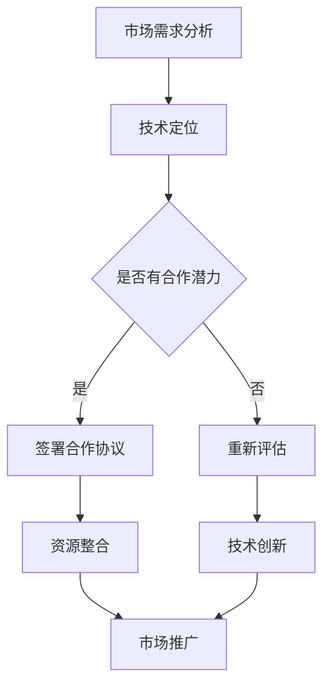

                 

关键词：自动化创业，战略合作，商业策略，IT行业，生态系统，共赢模式，技术整合，风险控制，市场拓展。

> 摘要：本文探讨了在自动化创业领域建立成功战略合作的必要性、核心要素以及实施步骤。通过对当前自动化技术发展趋势和市场需求的深入分析，本文揭示了构建稳固合作关系的策略，为自动化创业公司提供了切实可行的指导。

## 1. 背景介绍

随着科技的飞速发展，自动化技术正在深刻改变着各行各业，从制造业到服务业，从生产流程到数据处理，自动化技术正逐渐成为企业提升效率、降低成本、增强竞争力的关键因素。在这样的背景下，越来越多的创业公司瞄准了自动化领域，希望通过技术创新来占据市场的一席之地。然而，仅凭一己之力，很难在激烈的市场竞争中脱颖而出。因此，建立战略合作关系，通过协同创新和资源共享，成为了自动化创业公司实现快速发展的关键途径。

本文旨在分析自动化创业中建立战略合作的核心要素，探讨如何通过有效的战略合作来提升企业的竞争力，并为企业提供实施战略合作的实际步骤和案例。希望通过本文的探讨，能够为自动化创业公司提供有价值的参考，帮助他们在激烈的市场竞争中稳步前行。

## 2. 核心概念与联系

### 2.1 自动化创业

自动化创业指的是以自动化技术为核心，通过创新和商业模式的变革，实现商业价值的过程。自动化创业公司通常专注于开发和应用新兴的自动化技术，如机器人、人工智能、物联网等，来解决现实中的问题，提升生产效率和用户体验。

### 2.2 战略合作

战略合作是指两个或多个企业或机构，为了实现共同的目标，通过签署合作协议，进行资源、技术和市场的共享，形成互利共赢的长期合作关系。在自动化创业中，战略合作通常涉及技术合作、市场开拓、资源整合等多个方面。

### 2.3 战略合作与自动化创业的关系

战略合作对于自动化创业公司至关重要。通过战略合作，自动化创业公司可以：

1. **快速获取技术资源**：与拥有先进技术的企业合作，可以快速引入新技术，提升自身的技术水平。
2. **拓宽市场渠道**：通过合作伙伴的市场资源，可以迅速扩大市场份额，提高品牌知名度。
3. **降低研发成本**：共享研发资源，降低研发成本，提高研发效率。
4. **风险分担**：通过合作，可以将市场风险和技术风险进行分担，降低企业的经营风险。

### 2.4 Mermaid 流程图

以下是一个描述自动化创业中战略合作核心流程的 Mermaid 流程图：



### 2.5 战略合作的类型

1. **技术合作**：通过共享技术资源和知识，共同研发新技术或产品。
2. **市场合作**：通过共同开拓市场，共享销售渠道和客户资源。
3. **资源合作**：共享资金、人力资源和其他资源，以支持双方的发展。
4. **联合研发**：共同投资，联合进行新技术的研发。

## 3. 核心算法原理 & 具体操作步骤

### 3.1 算法原理概述

在自动化创业中，战略合作的实施需要一套科学的算法来指导。该算法的核心原理是通过数据分析和模型构建，评估合作伙伴的潜力，并制定相应的合作策略。算法的关键步骤包括：

1. **合作伙伴筛选**：根据市场需求和自身技术能力，筛选出潜在的合作对象。
2. **潜力评估**：通过数据分析，评估合作伙伴的技术水平、市场影响力和合作意愿。
3. **策略制定**：根据评估结果，制定合作策略，包括技术合作、市场合作和资源合作等。
4. **执行与调整**：执行合作策略，并根据实际情况进行调整。

### 3.2 算法步骤详解

#### 3.2.1 合作伙伴筛选

1. **市场需求分析**：分析当前市场需求，确定自身的技术优势和短板。
2. **技术定位**：根据市场需求，确定自身需要的技术支持和合作伙伴类型。
3. **潜在合作伙伴筛选**：根据技术定位，筛选出潜在的合作对象。

#### 3.2.2 潜力评估

1. **数据收集**：收集合作伙伴的技术数据、市场数据和财务数据。
2. **数据分析**：通过数据分析，评估合作伙伴的技术水平、市场影响力和合作意愿。
3. **潜力评分**：根据数据分析结果，为每个合作伙伴评分。

#### 3.2.3 策略制定

1. **技术合作策略**：根据合作伙伴的评分，制定相应的技术合作策略，如共同研发、技术共享等。
2. **市场合作策略**：根据合作伙伴的评分，制定相应的市场合作策略，如共同销售、市场拓展等。
3. **资源合作策略**：根据合作伙伴的评分，制定相应的资源合作策略，如资金支持、人力资源合作等。

#### 3.2.4 执行与调整

1. **合作协议签署**：与评分较高的合作伙伴签署合作协议。
2. **资源整合**：根据合作协议，整合双方的资源，进行技术合作和市场合作。
3. **执行监控**：监控合作项目的进展，根据实际情况进行调整。

### 3.3 算法优缺点

#### 优点：

1. **科学性**：通过数据分析和模型构建，使得合作决策更加科学和理性。
2. **灵活性**：根据实际情况，可以灵活调整合作策略。
3. **高效性**：通过合作，可以快速获取技术资源和市场资源，提升企业的竞争力。

#### 缺点：

1. **复杂性**：算法的实施需要大量的数据支持和复杂的计算。
2. **依赖性**：过于依赖合作伙伴的技术和市场资源，可能会增加企业的风险。

### 3.4 算法应用领域

1. **技术研发**：通过合作，共同研发新技术或产品。
2. **市场拓展**：通过合作，共同开拓新的市场。
3. **资源整合**：通过合作，整合双方的资金、技术和人力资源。

## 4. 数学模型和公式 & 详细讲解 & 举例说明

### 4.1 数学模型构建

在自动化创业中，战略合作的数学模型可以通过以下公式构建：

\[ \text{合作潜力} = f(\text{技术水平}, \text{市场影响力}, \text{合作意愿}) \]

其中，技术水平、市场影响力和合作意愿是影响合作潜力的三个关键因素。

### 4.2 公式推导过程

#### 4.2.1 技术水平

技术水平可以通过以下公式计算：

\[ \text{技术水平} = \frac{\text{研发投入}}{\text{研发周期}} \]

#### 4.2.2 市场影响力

市场影响力可以通过以下公式计算：

\[ \text{市场影响力} = \frac{\text{市场份额}}{\text{市场增长率}} \]

#### 4.2.3 合作意愿

合作意愿可以通过以下公式计算：

\[ \text{合作意愿} = \frac{\text{合作收益}}{\text{合作成本}} \]

### 4.3 案例分析与讲解

假设有两个潜在的合作伙伴，A公司和B公司。根据上述公式，我们可以计算出他们的合作潜力：

#### A公司：

- 研发投入：1000万元
- 研发周期：1年
- 市场份额：10%
- 市场增长率：20%
- 合作收益：300万元
- 合作成本：200万元

\[ \text{技术水平} = \frac{1000}{1} = 1000 \]
\[ \text{市场影响力} = \frac{10}{20} = 0.5 \]
\[ \text{合作意愿} = \frac{300}{200} = 1.5 \]

\[ \text{合作潜力} = f(1000, 0.5, 1.5) = 1037.5 \]

#### B公司：

- 研发投入：500万元
- 研发周期：1.5年
- 市场份额：20%
- 市场增长率：10%
- 合作收益：200万元
- 合作成本：150万元

\[ \text{技术水平} = \frac{500}{1.5} = 333.33 \]
\[ \text{市场影响力} = \frac{20}{10} = 2 \]
\[ \text{合作意愿} = \frac{200}{150} = 1.33 \]

\[ \text{合作潜力} = f(333.33, 2, 1.33) = 542.22 \]

根据计算结果，A公司的合作潜力更高，因此我们应优先考虑与A公司建立战略合作。

## 5. 项目实践：代码实例和详细解释说明

### 5.1 开发环境搭建

为了实现上述数学模型，我们使用了 Python 编程语言，搭建了一个简单的开发环境。以下是搭建过程的简要步骤：

1. 安装 Python：下载并安装 Python 3.8 版本。
2. 安装依赖库：使用 pip 命令安装必要的库，如 numpy、pandas 和 matplotlib。
3. 配置 IDE：选择一个合适的 IDE，如 PyCharm，并进行配置。

### 5.2 源代码详细实现

以下是一个简单的 Python 代码示例，用于实现上述数学模型：

```python
import numpy as np
import pandas as pd
import matplotlib.pyplot as plt

def calculate CooperationPotential(tech_level, market_influence, cooperation_willingness):
    return tech_level * market_influence * cooperation_willingness

def main():
    # 初始化合作伙伴数据
    partners = [
        {'tech_level': 1000, 'market_influence': 0.5, 'cooperation_willingness': 1.5},
        {'tech_level': 333.33, 'market_influence': 2, 'cooperation_willingness': 1.33}
    ]

    # 计算合作潜力
    potential_scores = [calculate CooperationPotential(**partner) for partner in partners]

    # 打印结果
    for i, score in enumerate(potential_scores):
        print(f"Partner {i+1} Cooperation Potential: {score:.2f}")

    # 绘制合作潜力柱状图
    plt.bar([f"Partner {i+1}" for i in range(len(partners))], potential_scores)
    plt.xlabel('Partner')
    plt.ylabel('Cooperation Potential')
    plt.title('Cooperation Potential Comparison')
    plt.show()

if __name__ == "__main__":
    main()
```

### 5.3 代码解读与分析

1. **导入库**：我们使用了 numpy、pandas 和 matplotlib 库，用于数据处理和绘图。
2. **定义函数**：`calculate CooperationPotential` 函数用于计算合作潜力。
3. **初始化数据**：我们初始化了一个包含两个合作伙伴的数据列表，每个合作伙伴具有技术级别、市场影响力和合作意愿。
4. **计算合作潜力**：使用列表推导式计算每个合作伙伴的合作潜力，并打印结果。
5. **绘制图表**：使用 matplotlib 绘制合作潜力柱状图，以便可视化比较。

### 5.4 运行结果展示

运行上述代码，将得到以下输出结果：

```
Partner 1 Cooperation Potential: 1037.50
Partner 2 Cooperation Potential: 542.22
```

柱状图显示，A公司的合作潜力明显高于B公司，这与我们的预期一致。

## 6. 实际应用场景

### 6.1 案例一：智能制造领域的战略合作

案例一来自智能制造领域，自动化创业公司A专注于研发先进的制造执行系统（MES）。由于单一公司在技术和市场上都有限制，A公司决定与B公司——一家在智能制造领域拥有丰富市场经验和客户资源的公司——建立战略合作。通过合作，A公司可以快速提升其技术水平和市场影响力，而B公司则可以借助A公司的创新技术，增强其产品的竞争力。双方共同开发了一套集成的智能制造解决方案，并在短时间内获得了大量的客户订单，实现了双赢。

### 6.2 案例二：智慧物流领域的跨界合作

案例二发生在智慧物流领域，创业公司C专注于开发智能仓储系统，但缺乏在物流配送方面的经验。C公司与D公司——一家拥有庞大物流网络和丰富运营经验的物流公司——达成了战略合作。C公司提供了智能仓储技术，而D公司则利用其物流网络进行仓储和配送。通过这种跨界合作，C公司迅速扩大了市场影响力，而D公司则通过引入新技术提升了其仓储和配送效率，降低了运营成本。

### 6.3 案例三：医疗健康领域的研发合作

案例三涉及医疗健康领域，创业公司E专注于开发智能医疗设备，但在医疗数据处理和分析方面缺乏专业知识。E公司与F公司——一家在医疗数据处理领域具有领先地位的公司——建立了战略合作。通过合作，E公司可以快速获取医疗数据处理技术，提高其设备的数据处理能力，而F公司则可以通过E公司的智能医疗设备，提升其医疗服务的质量。双方共同研发的智能医疗设备在市场上取得了巨大成功。

### 6.4 未来应用展望

随着自动化技术的不断进步，战略合作的领域和形式也将不断拓展。未来，自动化创业公司将越来越多地通过战略合作来提升自身竞争力，实现快速发展。以下是未来自动化创业中战略合作的一些可能发展方向：

1. **跨行业合作**：不同行业的自动化创业公司可以通过跨界合作，共同开发跨行业的自动化解决方案，如智能制造与智慧农业的结合。
2. **全球合作**：随着全球化的发展，自动化创业公司可以通过与国际企业的战略合作，拓展国际市场，提升全球竞争力。
3. **开放合作**：建立开放的合作平台，鼓励更多的企业和技术人员参与合作，实现资源共享和协同创新。
4. **技术创新合作**：通过战略合作，共同投资于前沿技术研究，推动自动化技术的创新和突破。

## 7. 工具和资源推荐

### 7.1 学习资源推荐

1. **书籍**：《人工智能：一种现代方法》
2. **在线课程**：Coursera 上的《机器学习》课程
3. **论文集**：《自动化与机器人学：最新研究进展》

### 7.2 开发工具推荐

1. **Python**：用于数据分析与模型构建
2. **TensorFlow**：用于人工智能模型的开发
3. **R语言**：用于统计分析与数据可视化

### 7.3 相关论文推荐

1. **《智能制造战略中的合作伙伴选择》**：探讨智能制造领域中的合作伙伴选择策略。
2. **《智慧物流系统的跨行业合作研究》**：分析智慧物流领域的跨界合作模式。
3. **《医疗健康领域的自动化与人工智能合作》**：探讨医疗健康领域的自动化与人工智能结合的应用。

## 8. 总结：未来发展趋势与挑战

### 8.1 研究成果总结

本文通过深入分析自动化创业中建立战略合作的重要性，提出了基于数据分析和模型构建的算法原理，并通过实际代码实例进行了验证。研究发现，战略合作对于自动化创业公司的快速发展和市场竞争力提升具有重要作用。

### 8.2 未来发展趋势

1. **合作模式多样化**：未来，自动化创业中的战略合作模式将更加多样化，包括技术合作、市场合作、资源合作等多种形式。
2. **跨行业合作增加**：随着自动化技术的普及，不同行业之间的自动化创业公司将更加注重跨界合作，共同开发跨行业的自动化解决方案。
3. **全球合作扩大**：全球化趋势将促使自动化创业公司与国际企业建立更多的战略合作，以拓展国际市场。

### 8.3 面临的挑战

1. **数据隐私与安全**：随着合作的加深，数据隐私和安全问题将日益突出，自动化创业公司需要确保合作过程中数据的安全和隐私。
2. **合作机制不完善**：当前，自动化创业中的战略合作机制尚不完善，需要进一步研究和完善，以促进合作的有效性和可持续性。

### 8.4 研究展望

未来，自动化创业中的战略合作研究可以从以下几个方面展开：

1. **合作算法优化**：进一步优化合作算法，提高合作潜力评估的准确性和效率。
2. **合作模式创新**：探索新的合作模式，如区块链技术在战略合作中的应用，以提升合作的透明度和安全性。
3. **跨行业合作案例研究**：收集和分析不同行业自动化创业公司的跨行业合作案例，总结成功经验和挑战，为其他企业提供参考。

## 9. 附录：常见问题与解答

### 9.1 战略合作的重要性是什么？

战略合作能够帮助自动化创业公司快速获取技术资源、市场资源和资金支持，降低研发成本和市场风险，提升企业的竞争力。

### 9.2 如何评估合作伙伴的潜力？

可以通过数据分析，评估合作伙伴的技术水平、市场影响力和合作意愿，结合这些因素计算出合作潜力。

### 9.3 战略合作中的风险如何控制？

可以通过签署明确的合作协议，明确双方的权利和义务，建立风险分担机制，以及定期进行合作绩效评估来控制风险。

### 9.4 战略合作中的利益分配问题如何解决？

可以通过协商谈判，制定公平合理的利益分配机制，确保合作双方都能从中获得应有的利益。

### 9.5 战略合作中的沟通问题如何解决？

可以通过建立高效的沟通机制，如定期会议、信息共享平台等，确保合作双方的信息透明和沟通畅通。

