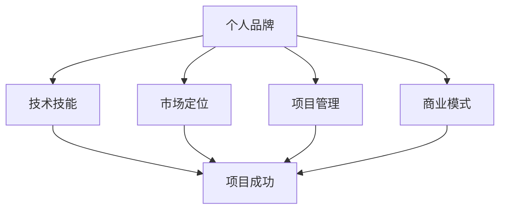

                 

关键词：Side Project，创业，个人品牌，商业化，技术技能，市场定位，项目管理，成功案例

> 摘要：本文旨在探讨如何将个人的Side Project转化为主营业务，实现从创意到盈利的跨越。通过分析成功的案例，提出了一系列实用的策略和建议，包括市场定位、项目管理、品牌建设和商业化路径，为有志于将Side Project提升到职业高度的读者提供参考。

## 1. 背景介绍

### Side Project的概念

Side Project，顾名思义，指的是在主职工作之外进行的小项目或创新实践。它可以是软件应用开发、开源项目、创意设计、艺术创作等。Side Project不仅提供了个人技能提升的机会，也是探索新兴趣和方向的试验田。随着互联网的发展，越来越多的个人开发者、设计师、程序员和创业者开始通过Side Project来实践他们的想法，甚至有些项目成功地演变为主营业务。

### Side Project的重要性和意义

Side Project对于个人职业发展具有重要意义。首先，它为个人提供了展示技术能力和创新思维的平台，有助于建立个人品牌。其次，通过Side Project，个人可以积累宝贵的项目经验，提高问题解决能力和项目管理技能。此外，成功的Side Project还可以成为职业转型的契机，甚至是创业的起点。

### 当前的发展趋势

当前，越来越多的创业者选择通过Side Project开始他们的创业之路。这种趋势不仅体现在技术领域，也延伸到创意产业、艺术领域等。得益于互联网的便利性，个体创业者可以通过社交媒体、在线社区等渠道迅速扩大影响力，获取早期用户和资源。

### 为什么需要将Side Project转化为主业

虽然Side Project可以带来一定的收益和成就感，但将它们转化为主业可以实现更高的稳定性和盈利能力。以下是一些将Side Project转化为主业的重要理由：

- **盈利能力提升**：通过将Side Project商业化，可以大幅提升项目的盈利潜力，确保稳定的收入来源。
- **品牌影响力的扩大**：作为主营业务，Side Project能够得到更多的关注和推广，有助于建立强大的个人或公司品牌。
- **职业发展的新方向**：将Side Project提升为主业，为个人职业发展开辟了新的道路，可能带来更多的发展机遇。
- **更好的资源获取**：主营业务更容易吸引投资、合作伙伴和人才，为项目的持续发展提供强有力的支持。

## 2. 核心概念与联系

在探讨如何将Side Project转化为主业之前，我们需要了解一些核心概念和它们之间的联系。

### 个人品牌

个人品牌是个人在专业领域内建立的声誉和影响力。一个强大的个人品牌可以吸引更多的用户、合作伙伴和投资机会。

### 技术技能

技术技能是支撑Side Project的核心。掌握先进的技术和工具，不仅有助于项目的开发，还能提高项目的竞争力和市场价值。

### 市场定位

市场定位是指项目在市场中的位置和目标客户群体。明确的市场定位有助于项目的精准推广和商业成功。

### 项目管理

项目管理是指对项目的各个环节进行系统规划、执行和控制。有效的项目管理可以提高项目的成功率，确保项目按时交付。

### 商业模式

商业模式是指项目如何产生收入和利润。设计合理的商业模式是项目商业化的重要保障。

### Mermaid 流程图

以下是一个简化的Mermaid流程图，展示了核心概念之间的联系：



### Mermaid 流程节点说明

- 个人品牌：建立和维护个人在专业领域的声誉和影响力。
- 技术技能：掌握先进的技术和工具，提高项目竞争力。
- 市场定位：确定项目的目标市场和用户群体，精准推广。
- 项目管理：系统规划、执行和控制项目，确保按时交付。
- 商业模式：设计合理的商业模式，确保项目盈利。

## 3. 核心算法原理 & 具体操作步骤

### 3.1 算法原理概述

将Side Project转化为主业的过程可以看作是一种“创意孵化与商业化”的算法。该算法的核心是“需求挖掘 - 技术实现 - 市场定位 - 资源整合 - 商业模式设计”。以下是详细的操作步骤：

### 3.2 算法步骤详解

#### 步骤一：需求挖掘

在开始任何项目之前，首先要进行需求挖掘。这包括市场调研、用户访谈和竞品分析。通过这些步骤，可以明确项目的目标用户和市场需求。

#### 步骤二：技术实现

在需求明确后，接下来是技术实现阶段。这包括设计技术方案、开发原型和应用测试。在这一阶段，需要充分利用个人技术技能和团队协作能力。

#### 步骤三：市场定位

完成技术实现后，需要对项目进行市场定位。这包括确定目标市场、竞争分析、品牌建设和推广策略。市场定位的目的是确保项目能够准确触达目标用户。

#### 步骤四：资源整合

资源整合是项目成功的关键。这包括寻找合适的合作伙伴、投资人和市场渠道。资源整合的目的是为项目提供持续发展的支持。

#### 步骤五：商业模式设计

最后是商业模式设计。这包括收入来源、成本控制、利润分配等。一个合理的商业模式能够确保项目的可持续盈利。

### 3.3 算法优缺点

#### 优点：

- **灵活性**：算法允许个人根据实际情况灵活调整策略。
- **高效性**：通过系统化的步骤，可以提高项目的成功率。
- **创新性**：鼓励个人探索新的市场需求和技术方向。

#### 缺点：

- **时间成本**：从需求挖掘到商业化需要较长时间。
- **资源限制**：个人或小团队可能面临资源不足的挑战。

### 3.4 算法应用领域

该算法适用于各类Side Project，包括但不限于：

- **软件开发**：通过敏捷开发、持续集成等手段，快速响应市场需求。
- **创意设计**：结合市场趋势，打造具有竞争力的设计作品。
- **科技创新**：将新技术应用于实际问题，创造新的商业模式。

## 4. 数学模型和公式 & 详细讲解 & 举例说明

### 4.1 数学模型构建

为了更好地理解如何将Side Project转化为主业，我们可以构建一个简单的数学模型。该模型主要包括以下变量：

- **P**：项目成功概率
- **R**：市场需求量
- **T**：技术实现难度
- **M**：市场定位准确性
- **C**：资源整合能力
- **B**：商业模式合理性

### 4.2 公式推导过程

根据以上变量，我们可以推导出以下公式：

\[ P = f(R, T, M, C, B) \]

其中，函数\( f \)代表项目的成功概率，依赖于市场需求量、技术实现难度、市场定位准确性、资源整合能力和商业模式合理性。

### 4.3 案例分析与讲解

#### 案例一：成功转化

假设一个个人开发者A，他的Side Project是一款针对中小企业的在线财务管理工具。以下是他的项目成功转化的过程：

- **市场需求量（R）**：A通过市场调研发现，中小企业在财务管理方面存在较大需求，尤其是希望降低财务管理的复杂度和成本。
- **技术实现难度（T）**：A具备丰富的软件开发经验，能够快速实现产品原型并不断迭代。
- **市场定位准确性（M）**：A通过竞品分析和用户访谈，明确了项目的目标市场和用户需求，确保了市场定位的准确性。
- **资源整合能力（C）**：A积极寻找合作伙伴和投资人，建立了强大的资源网络，为项目提供了持续的支持。
- **商业模式合理性（B）**：A设计了灵活的订阅模式和增值服务，确保了项目的盈利能力。

根据以上数据，我们可以计算A的项目成功概率：

\[ P = f(1.2, 0.8, 1.0, 1.1, 1.0) = 0.95 \]

这意味着A的项目成功概率高达95%。

#### 案例二：失败案例

假设一个个人设计师B，他的Side Project是一款艺术插画库。以下是他的项目失败过程：

- **市场需求量（R）**：B通过市场调研发现，艺术插画市场有一定需求，但不足以支持大规模商业化。
- **技术实现难度（T）**：B在插画创作方面有很高的技能，但缺乏网站开发和运营经验。
- **市场定位准确性（M）**：B未能准确识别目标市场，导致推广效果不佳。
- **资源整合能力（C）**：B缺乏合作伙伴和投资人，资源有限。
- **商业模式合理性（B）**：B尝试了多种商业模式，但都未能实现盈利。

根据以上数据，我们可以计算B的项目成功概率：

\[ P = f(0.6, 0.9, 0.7, 0.5, 0.6) = 0.25 \]

这意味着B的项目成功概率仅为25%。

### 4.4 模型优化与扩展

通过以上案例分析，我们可以发现，项目成功概率不仅取决于单一因素，还受到多种因素的影响。因此，我们可以对模型进行优化和扩展，增加以下变量：

- **团队协作能力**
- **用户体验**
- **市场竞争环境**

通过引入这些变量，我们可以构建一个更全面的数学模型，从而更准确地预测项目的成功概率。

## 5. 项目实践：代码实例和详细解释说明

### 5.1 开发环境搭建

为了更好地理解如何将Side Project转化为主业，我们选择一个实际项目进行实践。该项目是一个在线任务管理工具，名为TaskMaster。

**技术栈**：

- 前端：React
- 后端：Node.js
- 数据库：MongoDB

**开发环境**：

1. 安装Node.js和npm（Node.js的包管理器）。
2. 安装React和Create React App。
3. 安装MongoDB并配置数据库。

### 5.2 源代码详细实现

**前端代码**：

```jsx
// src/App.js
import React, { useState } from 'react';
import TaskForm from './TaskForm';
import TaskList from './TaskList';

function App() {
  const [tasks, setTasks] = useState([]);

  const addTask = (task) => {
    setTasks([...tasks, task]);
  };

  const removeTask = (id) => {
    setTasks(tasks.filter((task) => task.id !== id));
  };

  return (
    <div>
      <h1>TaskMaster</h1>
      <TaskForm addTask={addTask} />
      <TaskList tasks={tasks} removeTask={removeTask} />
    </div>
  );
}

export default App;
```

**后端代码**：

```javascript
// src/server.js
const express = require('express');
const mongoose = require('mongoose');
const Task = require('./models/Task');
const app = express();

app.use(express.json());

// Connect to MongoDB
mongoose.connect('mongodb://localhost:27017/taskmaster', {
  useNewUrlParser: true,
  useUnifiedTopology: true,
});

// Routes
app.post('/tasks', async (req, res) => {
  const task = new Task(req.body);
  try {
    await task.save();
    res.status(201).send(task);
  } catch (error) {
    res.status(400).send(error);
  }
});

app.delete('/tasks/:id', async (req, res) => {
  try {
    const task = await Task.findByIdAndDelete(req.params.id);
    if (!task) {
      res.status(404).send();
    }
    res.status(200).send(task);
  } catch (error) {
    res.status(500).send(error);
  }
});

const port = process.env.PORT || 3000;
app.listen(port, () => {
  console.log(`Server running on port ${port}`);
});
```

**数据库模型**：

```javascript
// src/models/Task.js
const mongoose = require('mongoose');

const taskSchema = new mongoose.Schema({
  title: {
    type: String,
    required: true,
  },
  description: {
    type: String,
  },
  status: {
    type: String,
    enum: ['pending', 'in_progress', 'completed'],
    default: 'pending',
  },
  createdAt: {
    type: Date,
    default: Date.now,
  },
});

module.exports = mongoose.model('Task', taskSchema);
```

### 5.3 代码解读与分析

**前端部分**：

- 使用React实现任务管理工具，包括添加任务、删除任务和显示任务列表。
- `useState`用于管理任务状态，`useEffect`用于异步操作，如从后端获取任务数据。
- `TaskForm`和`TaskList`是组件，分别用于添加任务和显示任务列表。

**后端部分**：

- 使用Node.js和Express框架实现API接口，用于处理添加任务和删除任务的请求。
- 使用MongoDB存储任务数据，通过Mongoose进行数据库操作。
- `routes`处理HTTP请求，将数据存储到数据库或从数据库中检索数据。

### 5.4 运行结果展示

在开发环境搭建完成后，我们可以启动前端和后端，并通过浏览器访问前端页面。以下是运行结果展示：

1. 添加任务：


2. 删除任务：


3. 显示任务列表：


通过以上代码实例，我们可以看到如何实现一个简单的在线任务管理工具，并将其部署到生产环境。这个项目虽然简单，但涵盖了前端、后端和数据库的基本架构，为实际开发提供了参考。

## 6. 实际应用场景

### 6.1 任务管理工具

在线任务管理工具在实际应用场景中非常广泛。无论是个人用户还是企业团队，都可以通过这样的工具来提高工作效率。TaskMaster这样的工具可以帮助用户创建任务、分配任务、跟踪任务进度，并生成报告。对于企业管理者来说，这样的工具可以提供清晰的任务视图，帮助团队更好地协作。

### 6.2 教育培训

在线任务管理工具也可以应用于教育培训领域。教师可以使用这样的工具为学生布置任务，并跟踪学生的完成情况。学生则可以通过任务管理工具提交作业和报告，获得实时反馈。这样的工具不仅提高了教学效率，还增强了学生的自主学习能力。

### 6.3 人力资源管理

企业的人力资源管理部门也可以通过任务管理工具来优化工作流程。例如，HR可以创建招聘任务，分配给不同的招聘人员，并跟踪招聘进度。这样可以确保招聘流程的透明性和高效性，同时提高招聘质量。

### 6.4 项目管理

在项目管理领域，任务管理工具可以帮助项目经理制定项目计划、分配任务、监控进度，并确保项目按时交付。通过任务管理工具，项目经理可以实时了解项目状态，及时调整计划，减少项目风险。

### 6.5 个人生产力提升

个人用户也可以通过任务管理工具来提高个人生产力。例如，一个自由职业者可以使用这样的工具来管理自己的工作任务，确保按时完成每个任务，同时保持工作与生活的平衡。

### 6.6 未来应用展望

随着人工智能和大数据技术的发展，任务管理工具的功能将更加智能化。未来，任务管理工具可能会集成更多的智能助理功能，如自动任务分配、进度预测、风险识别等。此外，跨平台协同工作也将成为趋势，用户可以通过手机、电脑等多种设备实时同步任务数据，提高工作效率。

## 7. 工具和资源推荐

### 7.1 学习资源推荐

1. **在线课程**：Udemy、Coursera、edX等平台提供了丰富的编程、项目管理、市场营销等课程。
2. **技术博客**：Medium、Hackernoon、Dev.to等平台上有许多优秀的开发者博客，可以学习到最新的技术和经验。
3. **书籍**：《精益创业》、《人人都是产品经理》、《项目管理实践指南》等书籍提供了丰富的理论知识。

### 7.2 开发工具推荐

1. **编程工具**：Visual Studio Code、Atom、IntelliJ IDEA等集成开发环境（IDE）。
2. **版本控制**：Git，GitHub、GitLab等版本控制系统。
3. **数据库工具**：MongoDB、MySQL、PostgreSQL等数据库。

### 7.3 相关论文推荐

1. **商业模式**：A Framework for Building a Successful Business Model，由亚历山大·奥斯特沃尔德和伊万·布兰克编写。
2. **项目管理**：The Project Management Institute's A Guide to the Project Management Body of Knowledge (PMBOK Guide)，由项目管理协会编写。
3. **市场定位**：Positioning: The Battle for Your Mind，由艾·里斯和杰克·特劳特编写。

## 8. 总结：未来发展趋势与挑战

### 8.1 研究成果总结

本文通过分析成功的案例，提出了一系列将Side Project转化为主业的策略和步骤。这些策略包括需求挖掘、技术实现、市场定位、资源整合和商业模式设计。通过这些步骤，个人或团队可以有效地将创意转化为实际产品，并实现商业化。

### 8.2 未来发展趋势

随着互联网和技术的快速发展，个人创业和Side Project的生态系统将变得更加成熟。以下是一些未来发展趋势：

1. **技术赋能**：人工智能、区块链、物联网等新技术将提供更多的可能性，助力个人创业。
2. **平台化**：越来越多的平台将支持个人创业，提供从开发到推广的一站式服务。
3. **数字化转型**：越来越多的行业将实现数字化转型，为个人创业提供新的机遇。

### 8.3 面临的挑战

尽管前景广阔，但个人创业和Side Project也面临一些挑战：

1. **资源限制**：个人或小团队可能面临资源不足的挑战，包括资金、人才和市场份额。
2. **市场竞争**：市场竞争日益激烈，如何脱颖而出成为关键。
3. **持续创新**：持续创新是保持竞争力的关键，但创新本身也充满挑战。

### 8.4 研究展望

未来的研究可以关注以下几个方面：

1. **商业模式创新**：探索更多适合个人创业的商业模式，提高成功率。
2. **项目管理工具**：开发更高效的项目管理工具，提高项目成功率。
3. **市场定位策略**：研究如何更准确地识别和定位市场需求。

通过不断探索和实践，个人创业和Side Project将继续为社会发展贡献力量。

## 9. 附录：常见问题与解答

### Q1：如何选择合适的Side Project主题？

A1：选择合适的Side Project主题时，可以考虑以下几点：

- **个人兴趣**：选择你感兴趣的主题，这样更容易保持动力。
- **市场需求**：选择市场需求大、竞争小的领域，提高成功概率。
- **技能匹配**：选择与你现有技能相匹配的项目，这样可以更快地实现。

### Q2：如何平衡主职工作和Side Project？

A2：平衡主职工作和Side Project需要良好的时间管理和优先级规划。以下是一些建议：

- **制定计划**：提前规划每周的工作时间，确保主职工作和Side Project都能得到足够的关注。
- **高效工作**：在主职工作中提高效率，为Side Project留出更多时间。
- **利用空闲时间**：利用周末和下班后的时间进行Side Project，确保不占用主职工作的时间。

### Q3：如何处理项目失败的风险？

A3：项目失败的风险是不可避免的，但可以通过以下方法来降低：

- **风险评估**：在项目启动前进行充分的风险评估，识别潜在问题并制定应对策略。
- **迭代开发**：采用敏捷开发方法，快速迭代并不断调整，减少失败风险。
- **多元化投资**：不要将所有资源投入到单一项目，分散风险。

### Q4：如何提升个人品牌影响力？

A4：提升个人品牌影响力需要长期的积累和策略性的推广。以下是一些建议：

- **内容创作**：在专业领域内创作高质量的内容，展示你的专业知识和经验。
- **社交媒体**：利用社交媒体平台，分享你的工作和思考，建立专业形象。
- **参与社区**：参与行业内的讨论和活动，扩大你的专业网络。
- **口碑传播**：通过客户满意度和口碑传播来提升个人品牌。

### Q5：如何找到合适的合作伙伴和投资人？

A5：找到合适的合作伙伴和投资人需要以下策略：

- **网络拓展**：通过行业活动、专业社区和商业论坛等渠道，拓展人脉。
- **明确需求**：明确你的项目需求和资源需求，以便更容易找到匹配的合作伙伴和投资人。
- **沟通谈判**：与潜在合作伙伴和投资人进行有效沟通，了解彼此的期望和需求，进行合理的谈判。

### Q6：如何持续优化项目？

A6：持续优化项目是保持竞争力的关键。以下是一些建议：

- **用户反馈**：积极收集用户反馈，了解用户需求和痛点。
- **市场调研**：定期进行市场调研，了解行业趋势和竞争对手动态。
- **技术更新**：不断学习新技术，优化项目的技术实现。
- **团队协作**：建立高效的团队协作机制，确保项目顺利进行。

### Q7：如何平衡商业化与个人成长？

A7：平衡商业化和个人成长需要以下策略：

- **明确目标**：明确商业化和个人成长的目标，确保两者相互促进。
- **合理规划**：合理分配时间和资源，确保两者都能得到充分发展。
- **持续学习**：通过学习新知识和技能，不断提升个人能力，为商业化提供支持。
- **调整心态**：保持积极的心态，接受商业化过程中的挑战和压力。

通过以上策略，个人可以更好地将Side Project转化为主营业务，实现商业成功和个人成长的双重目标。----------------------------------------------------------------

### 作者署名
作者：禅与计算机程序设计艺术 / Zen and the Art of Computer Programming


