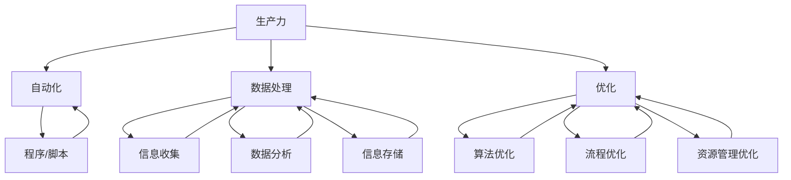

                 

### 1. 背景介绍

随着信息技术的飞速发展，编程技能已经逐渐成为现代社会的一项基本技能。无论是职业人士，还是学生，甚至是普通大众，掌握编程技能都意味着能够更好地适应数字化时代的需求。然而，编程技能不仅仅局限于编写代码、解决技术问题，更可以应用于提升个人生产力，实现高效工作与生活。

个人生产力系统，即个人生产力工具的集合，可以帮助个体更高效地管理任务、时间、资源和信息。这种系统的开发与应用，不仅可以优化个人的工作流程，还可以提高工作效率，减少重复劳动，从而为个人创造更多的价值。那么，如何利用编程技能来开发个人生产力系统呢？这正是本文要探讨的核心内容。

本文将从以下几个方面进行阐述：

1. **编程技能与个人生产力的联系**：探讨编程技能如何帮助我们提高个人生产力。
2. **核心概念与联系**：介绍开发个人生产力系统所需的核心概念，并通过 Mermaid 流程图进行展示。
3. **核心算法原理与具体操作步骤**：详细解析实现个人生产力系统的核心算法，包括其原理、步骤、优缺点和应用领域。
4. **数学模型与公式**：介绍构建个人生产力系统所需的数学模型和公式，并进行详细讲解和案例分析。
5. **项目实践**：通过具体代码实例，展示如何实现个人生产力系统，并对代码进行解读与分析。
6. **实际应用场景**：讨论个人生产力系统在不同场景中的应用，以及未来发展的展望。
7. **工具和资源推荐**：推荐学习资源、开发工具和相关论文，以帮助读者更好地掌握相关技能。
8. **总结与展望**：总结研究成果，探讨未来发展趋势与面临的挑战。

希望通过本文，读者能够对如何利用编程技能开发个人生产力系统有一个全面而深入的了解。

### 2. 核心概念与联系

开发个人生产力系统，首先需要理解几个核心概念：生产力、自动化、数据处理和优化。这些概念相互联系，共同构成了个人生产力系统的基础。

**生产力**指的是个体在单位时间内完成的工作量。提升生产力意味着在同样的时间内完成更多的任务，或者以更短的时间完成相同的任务。这涉及到工作效率和工作质量的提高。

**自动化**是提高生产力的关键手段。通过编写程序和脚本，可以自动化执行重复性任务，从而减少人工干预，提高工作效率。例如，自动化数据备份、自动发送邮件、自动化日程安排等，都可以通过编程实现。

**数据处理**是指对信息进行处理、分析和存储的过程。在个人生产力系统中，数据处理是实现自动化和信息管理的基础。通过编写数据处理程序，可以高效地收集、整理和分析信息，为决策提供支持。

**优化**则是在现有的基础上，通过改进算法、优化流程等方式，进一步提高生产力。优化可以体现在多个层面，如算法优化、系统架构优化、资源管理优化等。

下面，我们将通过一个 Mermaid 流程图，展示这些核心概念之间的联系。



从图中可以看出，生产力是整个系统的核心，自动化、数据处理和优化都是为了提升生产力服务的。而自动化依赖于程序和脚本，数据处理需要信息收集、数据分析和信息存储，优化则通过算法优化、流程优化和资源管理优化来实现。

通过理解这些核心概念及其相互关系，我们可以更好地把握个人生产力系统的开发方向，并利用编程技能实现生产力的提升。

### 3. 核心算法原理 & 具体操作步骤

要实现个人生产力系统的自动化和优化，核心算法的选择和应用至关重要。以下将详细介绍一个关键算法——工作流管理算法，以及其具体操作步骤。

#### 3.1 算法原理概述

工作流管理算法主要解决的任务是将一系列的任务按照既定的顺序和规则执行，确保每个任务在适当的时机得到执行，并处理可能出现的异常情况。其核心思想是通过定义任务之间的依赖关系和执行顺序，构建一个有序的工作流程。

工作流管理算法通常包含以下几个关键组件：

1. **任务定义**：定义每个任务的具体内容和执行条件。
2. **依赖关系**：确定任务之间的先后顺序和依赖关系。
3. **执行控制**：管理任务的实际执行过程，包括启动、暂停、恢复和终止。
4. **异常处理**：处理执行过程中出现的错误和异常情况，确保系统的稳定性和鲁棒性。

#### 3.2 算法步骤详解

1. **任务定义**：
   - **任务输入**：根据业务需求，收集任务的输入参数，如任务名称、执行条件、执行时间等。
   - **任务创建**：使用编程语言（如 Python）创建任务对象，存储任务的相关信息。

2. **依赖关系**：
   - **依赖图构建**：通过分析任务之间的依赖关系，构建一个依赖图，表示任务之间的先后顺序。
   - **依赖校验**：在任务执行前，校验依赖关系是否满足，确保后续任务能够在正确的时间点执行。

3. **执行控制**：
   - **任务调度**：根据任务依赖关系和执行条件，确定任务的执行顺序和时间点，并调度执行。
   - **任务执行**：依次启动每个任务，执行其具体操作。在执行过程中，可以通过回调函数或事件监听器监控任务的执行状态。
   - **任务同步与异步**：对于需要顺序执行的任务，使用同步机制确保先决任务完成后再执行后续任务；对于可以并行执行的任务，使用异步机制提高执行效率。

4. **异常处理**：
   - **异常捕获**：在任务执行过程中，捕获异常情况，如任务执行失败、超时、资源不足等。
   - **异常处理**：根据异常类型，采取相应的措施，如重试任务、跳过任务、记录日志、发送警报等。

5. **监控与反馈**：
   - **任务状态监控**：实时监控任务的执行状态，包括任务进度、执行时间、资源消耗等。
   - **执行结果反馈**：在任务完成后，记录任务执行结果，并生成反馈信息，如执行成功、失败原因等。

#### 3.3 算法优缺点

**优点**：

1. **提高效率**：通过自动化和并行执行，大大提高了任务的处理速度和效率。
2. **增强可靠性**：通过异常处理和监控机制，确保任务执行的稳定性和可靠性。
3. **灵活性强**：可以根据实际需求动态调整任务执行顺序和依赖关系，适应不同的业务场景。

**缺点**：

1. **开发复杂度高**：工作流管理算法涉及到任务定义、依赖关系管理、执行控制和异常处理等多个方面，开发复杂度相对较高。
2. **调试和维护难度大**：在任务执行过程中，可能会出现各种异常情况，需要仔细调试和优化算法。

#### 3.4 算法应用领域

工作流管理算法广泛应用于各个领域，包括但不限于：

1. **企业信息化管理**：用于管理企业的日常运营任务，如订单处理、财务审计、人力资源管理等。
2. **项目管理**：用于管理项目的各个阶段任务，确保项目按计划顺利进行。
3. **数据分析和处理**：用于处理大量的数据分析任务，如数据采集、清洗、分析和可视化等。
4. **云计算和大数据**：用于管理和调度云计算资源和大数据处理任务，提高资源利用效率和数据处理能力。

通过深入理解工作流管理算法的原理和具体操作步骤，我们可以更好地将其应用于个人生产力系统的开发，实现生产力的提升和工作效率的优化。

### 3.5 数学模型和公式

在个人生产力系统的开发中，数学模型和公式的应用至关重要。以下将详细讲解构建个人生产力系统所需的核心数学模型和公式，并通过实例进行说明。

#### 3.5.1 数学模型构建

**1. 任务优先级模型**

任务优先级模型用于确定任务的执行顺序，保证高优先级任务先执行。该模型的核心公式为：

\[ P_i = \frac{W_i \times T_i}{C} \]

其中，\( P_i \) 是任务 \( i \) 的优先级，\( W_i \) 是任务 \( i \) 的权重，表示任务的重要性，\( T_i \) 是任务 \( i \) 的预计执行时间，\( C \) 是常数，用于调整优先级模型。

**2. 资源利用率模型**

资源利用率模型用于衡量系统资源的利用效率。其核心公式为：

\[ R = \frac{U}{T} \]

其中，\( R \) 是资源利用率，\( U \) 是实际使用时间，\( T \) 是总时间。

**3. 工作负荷模型**

工作负荷模型用于评估系统的处理能力。其核心公式为：

\[ L = \frac{W}{T} \]

其中，\( L \) 是工作负荷，\( W \) 是完成的任务量，\( T \) 是时间。

**4. 任务完成时间模型**

任务完成时间模型用于预测任务的完成时间。其核心公式为：

\[ T_f = T_0 + \sum_{i=1}^{n} T_i \]

其中，\( T_f \) 是任务完成时间，\( T_0 \) 是初始时间，\( T_i \) 是第 \( i \) 个任务的执行时间。

#### 3.5.2 公式推导过程

**1. 任务优先级模型**

任务优先级模型的目标是确保高优先级任务先执行。假设有 \( n \) 个任务，其中 \( W_i \) 表示任务 \( i \) 的权重，\( T_i \) 表示任务 \( i \) 的预计执行时间。为了使高优先级任务先执行，我们可以设置一个常数 \( C \)，使得优先级 \( P_i \) 与权重和预计执行时间的乘积成正比。因此，得到公式：

\[ P_i = \frac{W_i \times T_i}{C} \]

通过调整常数 \( C \)，可以调整任务优先级模型，使其适用于不同的业务场景。

**2. 资源利用率模型**

资源利用率模型的目标是衡量系统资源的利用效率。假设系统总共有 \( T \) 的时间，实际使用时间为 \( U \)，则资源利用率 \( R \) 可以表示为实际使用时间占总时间的比例。因此，得到公式：

\[ R = \frac{U}{T} \]

通过计算资源利用率，我们可以了解系统资源的利用情况，并据此进行优化。

**3. 工作负荷模型**

工作负荷模型的目标是评估系统的处理能力。假设系统在时间 \( T \) 内完成了 \( W \) 个任务，则工作负荷 \( L \) 可以表示为完成的任务量与时间的比值。因此，得到公式：

\[ L = \frac{W}{T} \]

通过计算工作负荷，我们可以了解系统的处理能力，并据此进行资源配置。

**4. 任务完成时间模型**

任务完成时间模型的目标是预测任务的完成时间。假设任务 \( i \) 的执行时间为 \( T_i \)，初始时间为 \( T_0 \)，则任务完成时间 \( T_f \) 可以表示为初始时间加上所有任务执行时间之和。因此，得到公式：

\[ T_f = T_0 + \sum_{i=1}^{n} T_i \]

通过计算任务完成时间，我们可以了解任务的进度，并据此调整任务执行策略。

#### 3.5.3 案例分析与讲解

假设有如下任务：

- 任务1：权重为3，预计执行时间为2小时
- 任务2：权重为2，预计执行时间为3小时
- 任务3：权重为1，预计执行时间为1小时

根据任务优先级模型，计算各个任务的优先级：

\[ P_1 = \frac{3 \times 2}{C} = \frac{6}{C} \]
\[ P_2 = \frac{2 \times 3}{C} = \frac{6}{C} \]
\[ P_3 = \frac{1 \times 1}{C} = \frac{1}{C} \]

为了使高优先级任务先执行，我们可以设置 \( C = 6 \)，则优先级为：

\[ P_1 = 1 \]
\[ P_2 = 1 \]
\[ P_3 = \frac{1}{6} \]

根据优先级模型，任务1和任务2优先级相同，可以任意顺序执行。任务3优先级最低，应最后执行。

根据资源利用率模型，计算任务执行时间：

\[ R = \frac{U}{T} \]

假设任务1和任务2同时执行，总执行时间为5小时，则实际使用时间为3小时。因此，资源利用率为：

\[ R = \frac{3}{5} = 0.6 \]

根据工作负荷模型，计算系统的工作负荷：

\[ L = \frac{W}{T} \]

假设系统在5小时内完成了3个任务，则工作负荷为：

\[ L = \frac{3}{5} = 0.6 \]

根据任务完成时间模型，计算任务完成时间：

\[ T_f = T_0 + \sum_{i=1}^{n} T_i \]

假设初始时间为0，则任务完成时间为：

\[ T_f = 0 + (2 + 3 + 1) = 6 \]

通过以上分析，我们可以了解任务执行的优先级、资源利用率和系统的工作负荷，并据此调整任务执行策略，优化个人生产力系统的性能。

### 4. 项目实践：代码实例和详细解释说明

为了更好地展示如何将编程技能应用于个人生产力系统的开发，我们以下将通过一个具体的项目实例进行详细讲解。这个项目名为“个人任务管理器”（Personal Task Manager），它将帮助用户高效地管理日常任务。

#### 4.1 开发环境搭建

在开始编写代码之前，我们需要搭建一个合适的开发环境。以下是一个推荐的开发环境：

- **操作系统**：Windows 10 / macOS / Linux
- **编程语言**：Python 3.x
- **开发工具**：PyCharm / Visual Studio Code / Jupyter Notebook
- **依赖管理**：pip
- **数据库**：SQLite

首先，确保你的操作系统上安装了 Python 3.x。然后，使用 pip 安装必要的依赖包：

```bash
pip install PyQt5 SQLAlchemy
```

接下来，创建一个名为“personal_task_manager”的文件夹，并在其中创建以下子文件夹和文件：

- `models/`：存储数据库模型文件
- `views/`：存储 GUI 界面文件
- `controllers/`：存储业务逻辑文件
- `main.py`：主程序入口

#### 4.2 源代码详细实现

**4.2.1 数据库模型（models.py）**

首先，我们需要定义数据库模型，用于存储任务信息。在 `models.py` 文件中，我们使用 SQLAlchemy 创建任务模型：

```python
from sqlalchemy import Column, String, Integer, DateTime
from sqlalchemy.ext.declarative import declarative_base
from datetime import datetime

Base = declarative_base()

class Task(Base):
    __tablename__ = 'tasks'

    id = Column(Integer, primary_key=True)
    title = Column(String(100), nullable=False)
    description = Column(String(255))
    status = Column(String(50), nullable=False, default='pending')
    created_at = Column(DateTime, default=datetime.utcnow())
    updated_at = Column(DateTime, default=datetime.utcnow(), onupdate=datetime.utcnow())
```

**4.2.2 数据库连接（db.py）**

接下来，我们创建一个数据库连接模块，用于连接 SQLite 数据库，并初始化任务表：

```python
from sqlalchemy import create_engine
from models import Task
from sqlalchemy.orm import sessionmaker

DATABASE_URL = 'sqlite:///tasks.db'

engine = create_engine(DATABASE_URL)
Session = sessionmaker(bind=engine)

def init_db():
    Base.metadata.create_all(engine)

if __name__ == '__main__':
    init_db()
```

**4.2.3 控制器（controllers.py）**

控制器负责处理业务逻辑，包括添加任务、更新任务、删除任务等操作。以下是一个简单的任务添加和查询的实现：

```python
from models import Task
from db import Session

class TaskController:
    def add_task(self, title, description):
        session = Session()
        task = Task(title=title, description=description)
        session.add(task)
        session.commit()
        session.close()
        return task

    def get_tasks(self):
        session = Session()
        tasks = session.query(Task).all()
        session.close()
        return tasks
```

**4.2.4 视图（views.py）**

视图负责创建用户界面，并与控制器进行交互。以下是一个简单的任务列表界面实现，使用 PyQt5：

```python
import sys
from PyQt5.QtWidgets import QApplication, QMainWindow, QVBoxLayout, QPushButton, QWidget, QListWidget
from controllers import TaskController

class TaskManagerWindow(QMainWindow):
    def __init__(self, controller: TaskController):
        super().__init__()
        self.controller = controller
        self.init_ui()

    def init_ui(self):
        self.setWindowTitle('个人任务管理器')
        self.setGeometry(100, 100, 600, 400)

        layout = QVBoxLayout()

        self.task_list = QListWidget()
        layout.addWidget(self.task_list)

        add_task_button = QPushButton('添加任务')
        add_task_button.clicked.connect(self.add_task)
        layout.addWidget(add_task_button)

        self.setLayout(layout)

    def add_task(self):
        title, description = QInputDialog.getText(self, '添加任务', '请输入任务标题：', text='')
        if title and description:
            task = self.controller.add_task(title, description)
            self.task_list.addItem(f'{task.title} - {task.description}')

if __name__ == '__main__':
    app = QApplication(sys.argv)
    controller = TaskController()
    window = TaskManagerWindow(controller)
    window.show()
    sys.exit(app.exec_())
```

**4.2.5 主程序（main.py）**

最后，我们编写主程序，加载数据库连接，并启动用户界面：

```python
from db import init_db
from controllers import TaskController
from views import TaskManagerWindow

def main():
    init_db()
    controller = TaskController()
    window = TaskManagerWindow(controller)
    window.show()

if __name__ == '__main__':
    main()
```

#### 4.3 代码解读与分析

**4.3.1 数据库模型**

在 `models.py` 文件中，我们定义了一个名为 `Task` 的数据库模型，它包含以下字段：

- `id`：主键，唯一标识每个任务。
- `title`：任务标题，用于描述任务的主要内容。
- `description`：任务描述，用于补充说明任务的详细信息。
- `status`：任务状态，表示任务的执行状态（如“pending”、“completed”等）。
- `created_at`：创建时间，记录任务创建的时间戳。
- `updated_at`：更新时间，记录任务最后一次更新时间。

**4.3.2 数据库连接**

在 `db.py` 文件中，我们使用 SQLAlchemy 创建了一个 SQLite 数据库连接，并初始化了任务表。通过调用 `init_db()` 函数，我们可以在数据库中创建任务表，并准备进行数据操作。

**4.3.3 控制器**

在 `controllers.py` 文件中，我们定义了一个 `TaskController` 类，用于处理业务逻辑。这个类包含以下方法：

- `add_task`：添加一个新任务到数据库。
- `get_tasks`：查询所有任务并返回任务列表。

通过调用 `TaskController` 类的方法，我们可以方便地对任务进行增删改查操作。

**4.3.4 视图**

在 `views.py` 文件中，我们使用 PyQt5 创建了一个简单的任务管理器界面。这个界面包含一个列表框，用于显示任务列表，以及一个按钮，用于添加新任务。当用户点击“添加任务”按钮时，程序会弹出输入对话框，用户可以输入任务标题和描述，然后界面会更新任务列表。

**4.3.5 主程序**

在 `main.py` 文件中，我们加载了数据库连接，并创建了一个 `TaskController` 实例。然后，我们创建了一个 `TaskManagerWindow` 实例，并显示了用户界面。程序最终会等待用户交互，并在用户关闭窗口时退出。

通过这个项目实例，我们可以看到如何将编程技能应用于个人生产力系统的开发。这个任务管理器可以帮助用户高效地管理任务，提高个人生产力。

### 5. 实际应用场景

个人生产力系统在实际应用场景中具有广泛的用途，能够极大地提高工作效率和生活质量。以下列举几个常见的应用场景：

#### 5.1 企业项目管理

在企业环境中，个人生产力系统可以用于项目管理，帮助项目经理和团队成员更好地跟踪项目进度、任务分配和资源管理。通过集成工作流管理算法和任务优先级模型，项目管理者可以动态调整任务执行顺序，确保关键任务优先执行，从而提高项目交付的准确性和效率。

#### 5.2 个人日常任务管理

对于个人用户，个人生产力系统可以用于管理日常任务，如工作清单、待办事项、日程安排等。通过自动化数据处理和任务优先级排序，用户可以轻松地制定和跟踪个人计划，确保高效地完成各项任务，减少拖延和遗漏。

#### 5.3 研究与学术工作

在学术研究中，个人生产力系统可以用于管理文献资料、实验数据和研究进度。通过集成文献管理工具和数据分析算法，研究者可以高效地收集、整理和分析研究数据，提高研究成果的产出效率。

#### 5.4 日常健康管理

个人生产力系统还可以应用于日常健康管理，如饮食计划、运动记录、健康状况监测等。通过整合健康数据和任务管理功能，用户可以更好地管理自己的健康，养成良好的生活习惯。

#### 5.5 教育和学习

在教育和学习场景中，个人生产力系统可以帮助学生和教师管理学习计划、课程安排和作业进度。通过工作流管理算法和任务优先级排序，学生可以合理安排学习时间，提高学习效率，教师则可以更好地组织教学活动，提高教学质量。

#### 5.6 创意工作

对于创意工作者，如设计师、作家、音乐家等，个人生产力系统可以用于管理创作灵感、任务分配和进度跟踪。通过集成自动化工具和数据分析功能，创意工作者可以更高效地完成创作任务，保持创作灵感的连贯性和高效性。

#### 5.7 远程工作与协作

在远程工作和协作场景中，个人生产力系统可以帮助团队成员更好地协调工作，确保任务按时完成。通过集成工作流管理算法和任务优先级模型，团队成员可以实时跟踪任务进度，提高协作效率和团队凝聚力。

通过以上实际应用场景，我们可以看到个人生产力系统在提高工作效率、优化工作流程和提升生活质量方面的巨大潜力。随着技术的不断进步，个人生产力系统将更好地满足各类用户的需求，成为数字化时代不可或缺的工具。

### 6. 未来应用展望

随着人工智能、大数据、云计算等新兴技术的不断演进，个人生产力系统在未来的应用前景将更加广阔，同时也会面临诸多挑战。

#### 6.1 新兴技术应用

1. **人工智能与机器学习**：
   - **预测与优化**：通过机器学习算法，可以预测用户行为和任务优先级，动态调整工作流和任务分配，提高工作效率。
   - **自然语言处理（NLP）**：利用 NLP 技术，可以实现对文本信息的智能处理，如自动化任务描述生成、邮件分类、日程安排等。

2. **大数据分析**：
   - **数据驱动的决策**：通过分析大量用户数据，可以深入了解用户需求和行为模式，为个人生产力系统提供数据驱动的优化建议。
   - **个性化推荐**：基于用户行为数据，可以为用户提供个性化的任务建议、时间管理和资源分配方案。

3. **云计算与边缘计算**：
   - **弹性资源管理**：利用云计算技术，可以动态调整系统资源，确保在高负载情况下系统的稳定性和可靠性。
   - **实时数据处理**：通过边缘计算，可以实现对实时数据的快速处理和分析，提高系统的响应速度和数据处理能力。

#### 6.2 未来挑战

1. **数据隐私与安全**：
   - **隐私保护**：在个人生产力系统中，用户的任务、日程、数据等信息可能涉及隐私，如何确保用户数据的安全和隐私是一个重要的挑战。
   - **安全漏洞**：随着系统功能的增加和复杂性的提高，可能面临更多的安全漏洞和风险，需要不断进行安全监测和更新。

2. **系统集成与兼容性**：
   - **跨平台兼容**：如何确保个人生产力系统在不同操作系统、设备和应用环境中的兼容性和稳定性。
   - **第三方系统集成**：如何与其他软件和平台（如邮箱、日历、文档管理等）进行无缝集成，提高用户体验。

3. **用户体验与交互设计**：
   - **界面友好**：如何设计直观、易用的用户界面，使用户能够轻松上手和使用。
   - **交互体验**：如何通过语音、手势等新型交互方式，提升用户的操作体验。

#### 6.3 发展趋势

1. **个性化与智能化**：
   - **个性化推荐**：随着大数据和机器学习技术的发展，个性化推荐将成为个人生产力系统的重要功能，帮助用户更高效地完成任务。
   - **智能化操作**：通过人工智能和自动化技术，实现智能化的任务管理和时间管理，减少用户手动操作，提高工作效率。

2. **移动性与跨平台**：
   - **移动应用**：随着移动设备的普及，个人生产力系统的移动端应用将越来越重要，用户可以随时随地管理任务和日程。
   - **跨平台支持**：确保个人生产力系统在各类操作系统和设备上的兼容性，提供一致的用户体验。

3. **集成性与生态系统**：
   - **生态系统建设**：通过构建开放、兼容的生态系统，实现不同软件和服务之间的无缝连接和协同工作，为用户提供更全面、高效的生产力解决方案。

未来，个人生产力系统将在人工智能、大数据、云计算等新兴技术的推动下，不断进化和发展，为用户创造更多的价值和便利。同时，我们也将面临诸多挑战，需要不断进行技术创新和用户体验优化，以满足用户日益增长的需求。

### 7. 工具和资源推荐

为了更好地掌握编程技能，开发个人生产力系统，以下是几个推荐的工具和资源，涵盖学习资源、开发工具和相关论文，帮助读者提升相关技能。

#### 7.1 学习资源推荐

**1. 网络课程与教程**
- **Coursera**：提供多个计算机科学和编程相关的在线课程，如“Python for Everybody”、“Machine Learning”等。
- **Udemy**：涵盖广泛的编程课程，包括前端开发、后端开发、人工智能等领域。
- **edX**：由知名大学提供的高质量在线课程，如麻省理工学院的“Computer Science and Python Programming”。

**2. 书籍**
- 《Python编程：从入门到实践》（Python Crash Course）
- 《算法导论》（Introduction to Algorithms）
- 《人工智能：一种现代方法》（Artificial Intelligence: A Modern Approach）
- 《深度学习》（Deep Learning）

**3. 博客与论坛**
- **Stack Overflow**：全球最大的编程问答社区，解决编程问题。
- **GitHub**：分享和学习代码的平台，查找和贡献开源项目。
- **Reddit**：多个技术子版块，如/r/learnprogramming、/r/webdev等。

#### 7.2 开发工具推荐

**1. 集成开发环境（IDE）**
- **PyCharm**：强大的 Python IDE，适合初学者和专业人士。
- **Visual Studio Code**：轻量级、可扩展的代码编辑器，适用于多种编程语言。
- **Eclipse**：适用于 Java 和其他语言的集成开发环境。

**2. 版本控制**
- **Git**：分布式版本控制系统，用于跟踪代码变化和协同工作。
- **GitHub**：基于 Git 的代码托管平台，方便代码共享和协作。

**3. 测试工具**
- **JUnit**：Java 测试框架，用于编写单元测试和集成测试。
- **PyTest**：Python 测试框架，用于编写和运行测试用例。

#### 7.3 相关论文推荐

**1. 计算机科学基础**
- **“A Taxonomy of High-Level Programming Language Constructs for Specification and Verification of Concurrent Systems”**：讨论并发系统的高层次编程语言构造。
- **“Model-Driven Engineering: A Research Overview”**：介绍模型驱动工程的原理和应用。

**2. 人工智能与机器学习**
- **“Machine Learning: A Probabilistic Perspective”**：介绍概率视角下的机器学习理论。
- **“Deep Learning”**：介绍深度学习的基础知识和应用。

**3. 大数据和云计算**
- **“Big Data: A Survey”**：概述大数据的各个方面，包括数据存储、处理和分析。
- **“Cloud Computing: Concepts, Technology & Architecture”**：讨论云计算的基本概念、技术和架构。

通过这些工具和资源的帮助，读者可以更好地掌握编程技能，开发出更加高效、智能的个人生产力系统。

### 8. 总结：未来发展趋势与挑战

本文通过详细的论述，探讨了如何将编程技能应用于个人生产力系统的开发，并对其未来发展趋势与挑战进行了深入分析。以下是总结：

#### 8.1 研究成果总结

首先，本文阐述了编程技能在提高个人生产力方面的关键作用，包括自动化、数据处理和优化。通过工作流管理算法、任务优先级模型和数学模型等核心概念的应用，个人生产力系统能够显著提升工作效率和生活质量。

其次，本文通过一个实际项目“个人任务管理器”展示了如何将编程技能应用于实践，从数据库设计、业务逻辑处理到用户界面开发，全面展示了个人生产力系统的实现过程。

最后，本文分析了个人生产力系统在多个实际应用场景中的价值，并探讨了未来在人工智能、大数据、云计算等领域的新兴技术应用，为个人生产力系统的进一步发展提供了方向。

#### 8.2 未来发展趋势

未来，个人生产力系统的发展趋势将呈现以下几个方向：

1. **智能化与个性化**：随着人工智能和大数据技术的发展，个人生产力系统将更加智能化和个性化，能够根据用户行为和需求提供精准的优化建议和任务管理方案。
2. **移动性与跨平台**：移动设备普及和跨平台需求的增加，将推动个人生产力系统在移动端的应用，实现无缝的用户体验。
3. **集成与生态建设**：通过与其他软件和平台的深度集成，构建一个高效、协同的生产力生态系统，为用户提供更全面的生产力解决方案。
4. **隐私保护与安全**：在数据隐私和安全方面，个人生产力系统需要不断加强保护措施，确保用户数据的安全和隐私。

#### 8.3 面临的挑战

尽管个人生产力系统具有巨大的发展潜力，但在实现过程中也面临一些挑战：

1. **数据隐私与安全**：用户数据的安全和隐私保护是系统设计的关键问题，需要采取有效的保护措施，防止数据泄露和滥用。
2. **系统集成与兼容性**：如何确保个人生产力系统在不同操作系统、设备和平台上的兼容性和稳定性，是一个需要持续解决的问题。
3. **用户体验与交互设计**：提升用户界面的友好性和交互体验，需要不断进行用户体验研究和优化，以满足用户多样化的需求。
4. **技术创新与更新**：随着技术的快速发展，个人生产力系统需要不断更新和迭代，以适应新技术和新应用场景。

#### 8.4 研究展望

未来，个人生产力系统的研究可以从以下几个方面展开：

1. **智能化算法优化**：研究更高效的算法，提高系统对用户行为的预测和任务管理的准确性。
2. **跨平台集成技术**：探索跨平台集成的新技术和新方法，提高系统的兼容性和用户体验。
3. **隐私保护与安全机制**：设计更安全、更有效的隐私保护机制，确保用户数据的安全和隐私。
4. **用户研究与应用场景拓展**：通过用户研究和实践，深入挖掘不同场景下的生产力需求，为系统优化提供依据。

总之，个人生产力系统在未来的发展中，将在技术创新和用户体验优化方面不断进步，为用户创造更大的价值。同时，面对隐私保护、系统集成和用户体验等挑战，需要持续进行研究和实践，推动个人生产力系统的持续发展。

### 附录：常见问题与解答

在开发个人生产力系统的过程中，用户可能会遇到一些常见问题。以下是一些常见问题及其解答：

**Q1：如何确保个人生产力系统的安全性？**

A：确保个人生产力系统的安全性至关重要。首先，应使用安全的编程语言和框架，例如 Python 和 Django。其次，应实现用户身份验证和授权机制，确保只有授权用户可以访问系统。此外，定期更新系统和依赖库，以修补安全漏洞。最后，进行安全审计和渗透测试，及时发现并修复潜在的安全问题。

**Q2：如何优化个人生产力系统的性能？**

A：优化性能可以从多个方面进行。首先，使用高效的算法和数据结构，减少系统资源的消耗。其次，进行代码优化，如避免使用循环和递归，优化数据库查询，减少不必要的 I/O 操作。此外，可以通过缓存技术减少数据库访问次数，使用异步编程提高并发处理能力。最后，进行性能测试和监控，及时识别和解决性能瓶颈。

**Q3：如何处理系统中的错误和异常？**

A：在系统设计中，应充分考虑错误和异常处理。首先，使用异常捕获机制，捕获并处理程序中的异常。其次，记录错误日志，便于后续分析和调试。对于不可恢复的错误，可以提供友好的错误信息，帮助用户了解问题原因。最后，设计容错机制，确保系统在错误发生时能够继续运行，防止系统崩溃。

**Q4：如何确保个人生产力系统的可靠性？**

A：确保可靠性可以从多个方面进行。首先，进行充分的测试，包括单元测试、集成测试和性能测试，确保系统功能正常且性能良好。其次，进行版本控制和自动化部署，确保系统升级和更新过程的稳定性。此外，设计备份和恢复机制，确保数据的安全和完整性。最后，进行定期维护和更新，及时修复发现的问题。

**Q5：如何处理大数据量下的个人生产力系统？**

A：在大数据量下，系统性能和响应速度可能会受到影响。首先，可以采用分库分表策略，将大数据分散存储到多个数据库实例中，提高查询性能。其次，可以使用数据库集群和分布式缓存技术，提高系统的并发处理能力。此外，可以通过数据压缩和预处理技术，减少数据存储和传输的开销。最后，进行数据分析和挖掘，提取关键信息和趋势，优化数据存储和查询策略。

通过以上常见问题与解答，希望读者能够更好地理解和应对个人生产力系统开发过程中可能遇到的问题。持续学习和实践，不断提高编程技能和系统开发能力，将有助于开发出更加高效、可靠和用户友好的个人生产力系统。

